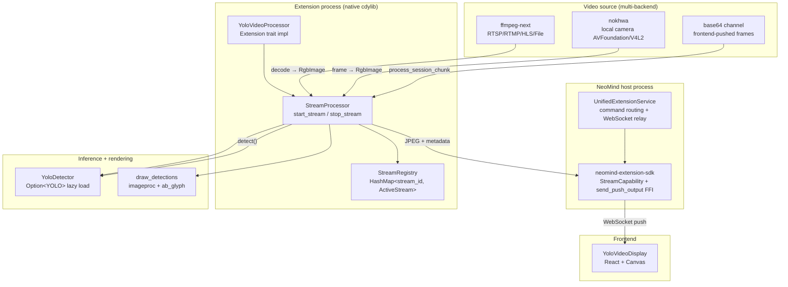
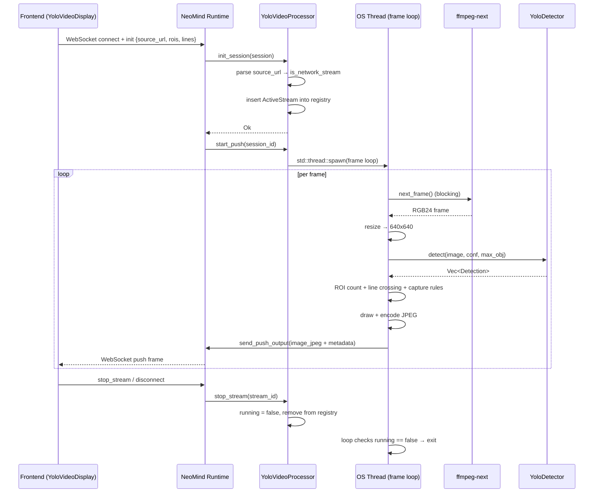

# #3 yolo-video-v2: Streaming Extension

## 1 Case Background

**yolo-video-v2** is the **most complex streaming extension** in the NeoMind ecosystem. It mounts an Ultralytics YOLOv11 object-detection model onto a live video stream and supports three input sources (RTSP/RTMP/HLS network streams, local cameras, and front-end base64 frame pushes). In Push mode it continuously pushes JPEG frames with detection overlays plus structured detection JSON back to the front end, and ships business features such as ROI region counting, line-crossing counting, and smart-capture rules (threshold/presence/absence triggers). The current version is 2.7.6; the core code is about 2829 lines of Rust (`src/lib.rs`) plus 721 lines (`src/detector.rs`) and 387 lines (`src/video_source.rs`). It is the single largest crate in this series and the only extension that exercises the full SDK chain of `StreamCapability` + `StreamMode::Push` + the `send_push_output` FFI.

**What problem does it solve?** NeoMind's synchronous capability bridge (see [Case #2](./2-yolo-device-inference.md)) is designed for "event-driven + single-frame inference" — you run YOLO once when a device's image metric updates. But video analytics is a "continuous frame stream": an RTSP camera produces 25-30 frames per second, and every frame needs inference, statistics, and visualization. If you polled via the synchronous bridge, you would issue 30 cross-process calls per second, which is unacceptable in both latency and overhead. yolo-video-v2 solves this with Push mode: the extension spawns a dedicated OS thread to run the frame loop in `init_session`, and each frame is pushed directly into the SDK's output channel via the `send_push_output` FFI. The `UnifiedExtensionService` then relays it to the front-end WebSocket, never blocking the runtime's main thread.

**Key differences from yolo-device-inference** (this is the most important comparison for understanding this case):

| Dimension | yolo-device-inference (#2) | yolo-video-v2 (#3) |
|-----------|----------------------------|---------------------|
| Data source | Subscribes to a bound device's image metric (event-driven pull) | RTSP/camera/base64, one of three (started in init_session) |
| Invocation | Resident after `configure + bind_device` | Explicit session lifecycle via `start_stream / stop_stream` |
| Stream mode | Synchronous capability bridge (`invoke_capability_sync`) | `StreamCapability` + `StreamMode::Push` + `send_push_output` |
| Frame rate | Device image-update frequency (usually < 1 FPS) | Native video frame rate (25-30 FPS) |
| Threading | Runtime main thread + `block_in_place` | Dedicated OS thread for the frame loop, fully decoupled from tokio |

**Target audience**: (1) Vision engineers who want to run real-time video analytics on NeoMind — you will see the complete RTSP ingestion + YOLO inference + JPEG encoding + Push delivery chain. (2) SDK developers who want to understand Push streaming mode — this case is the only "production-grade" reference implementation of the SDK's `StreamCapability` interface.

**What you will learn**: (1) The semantics of Push mode — why video streams must use Push instead of Pull, and what `StreamMode::Push` actually does at the SDK layer. (2) Session lifecycle management — the complete `init_session` → `start_push` → frame loop → `stop_stream` state machine and cleanup logic. (3) Multi-backend video source abstraction — why RTSP uses ffmpeg-next while local cameras use nokhwa, and which path base64 pushing takes. (4) Cross-platform ONNX Runtime dynamic-library governance — from versioned `libonnxruntime.so.N` symlinks on Linux, to Windows DLL paths, to macOS `DYLD_LIBRARY_PATH`. (5) A source-hygiene anti-pattern — why files like `detector.rs.backup` should never be committed.

---

## 2 Architecture Overview

yolo-video-v2 uses a five-layer architecture: NeoMind Runtime (WebSocket relay) → Extension (StreamProcessor + ActiveStream map) → Detector (YoloDetector with lazy-loaded usls YOLO) → Video Source (ffmpeg-next / nokhwa / base64 channel) → Frontend (YoloVideoDisplay React component). The diagram below shows data flow and the key state machine.



### Streaming session state machine

A stream moves through four stages from creation to destruction, each corresponding to an SDK callback:

| State | Trigger | Callback | Internal action |
|-------|---------|----------|-----------------|
| `Created` | Front-end `init` over WebSocket | — | ActiveStream struct constructed, frame loop not started |
| `Initializing` | SDK | `init_session` | Parse `source_url` to choose ffmpeg / nokhwa / base64; insert into registry |
| `Streaming` | SDK | `start_push` | Dedicated OS thread runs the frame loop: decode → detect → ROI/line → JPEG → `send_push_output` |
| `Stopped` | Front-end `stop_stream` or disconnect | `stop_stream` | `running = false`, remove from registry, thread exits naturally |

The key dispatching logic in `init_session` lives at [`src/lib.rs` L1302-L1308](https://github.com/camthink-ai/NeoMind-Extensions/blob/main/extensions/yolo-video-v2/src/lib.rs#L1302-L1308): the protocol prefix of `source_url` (`rtsp://` / `http://` / `camera://` etc.) decides whether to take the network-stream path (ffmpeg) or the local-camera path (nokhwa / base64).

```rust
// lib.rs L1302-L1308
let is_network_stream = source_url.starts_with("rtsp://")
    || source_url.starts_with("rtmp://")
    || source_url.starts_with("hls://")
    || source_url.contains(".m3u8")
    || source_url.starts_with("http://")
    || source_url.starts_with("https://")
    || source_url.starts_with("file://");
```
[Source: lib.rs L1302-L1308](https://github.com/camthink-ai/NeoMind-Extensions/blob/main/extensions/yolo-video-v2/src/lib.rs#L1302-L1308)

### Comparison with yolo-device-inference architecture

| Architecture dimension | #2 yolo-device-inference | #3 yolo-video-v2 |
|------------------------|--------------------------|-------------------|
| Entry abstraction | `Extension::execute_command("bind_device")` | `Extension::stream_capability()` + `init_session` |
| Inference trigger | Device image-metric update event | Frame-loop OS thread drives proactively |
| Output channel | `device_metrics_write` (synchronous virtual-metric write) | `send_push_output` (async push to WebSocket) |
| Concurrency model | Single detector + Mutex | Each stream owns an OS thread + shared detector |
| State cleanup | `unbind_device` | `stop_stream` + thread `running` flag |

---

## 3 Core Implementation

### 3.1 StreamCapability declaration

The extension declares itself a Push-mode streaming extension via `stream_capability()`. See [`src/lib.rs` L1275-L1288](https://github.com/camthink-ai/NeoMind-Extensions/blob/main/extensions/yolo-video-v2/src/lib.rs#L1275-L1288):

```rust
fn stream_capability(&self) -> Option<StreamCapability> {
    Some(StreamCapability {
        direction: StreamDirection::Bidirectional,
        mode: StreamMode::Push,
        supported_data_types: vec![
            StreamDataType::Image { format: "jpeg".to_string() },
        ],
        max_chunk_size: 524288,        // 512 KB
        preferred_chunk_size: 32768,   // 32 KB
        max_concurrent_sessions: 4,
        flow_control: FlowControl::default_stream(),
        config_schema: None,
    })
}
```

The semantics of `StreamMode::Push` are: **the extension produces data proactively** and the SDK does not poll. The corresponding `Pull` mode has the SDK request data actively (suitable for low-frequency metrics), and `Stateless` mode is a stateless request-response (suitable for command-style APIs). A video stream produces 25-30 frames per second; only Push mode can guarantee no frame loss. `max_concurrent_sessions: 4` caps the number of simultaneous video streams per extension instance — this is an empirically-validated ceiling based on ONNX Runtime memory and CPU inference throughput. `direction: Bidirectional` is required because the front end both receives frames (Push output) and sends base64 frames (`process_session_chunk`).

### 3.2 init_session: session initialization

`init_session` is called back after the SDK establishes a WebSocket session. It constructs the `ActiveStream` state and inserts it into the global registry. See [`src/lib.rs` L1290-L1360](https://github.com/camthink-ai/NeoMind-Extensions/blob/main/extensions/yolo-video-v2/src/lib.rs#L1290-L1360).

```rust
// lib.rs L1290-L1320 (trimmed)
async fn init_session(&self, session: &StreamSession) -> Result<()> {
    eprintln!("[YOLO] init_session called: id={}", session.id);
    let config: StreamConfig = serde_json::from_value(session.config.clone())
        .unwrap_or_default();

    let stream_id = session.id.clone();
    let source_url = config.source_url.clone();

    tracing::info!("Session config: source_url={}, confidence={}, max_objects={}",
        source_url, config.confidence_threshold, config.max_objects);

    // Determine if this is a network stream (RTSP/RTMP/HLS) or local camera
    let is_network_stream = source_url.starts_with("rtsp://")
        || source_url.starts_with("rtmp://")
        || source_url.starts_with("hls://")
        || source_url.contains(".m3u8")
        || source_url.starts_with("http://")
        || source_url.starts_with("https://")
        || source_url.starts_with("file://");

    let stream = ActiveStream {
        _id: stream_id.clone(),
        _config: config.clone(),
        started_at: Instant::now(),
        frame_count: 0,
        total_detections: 0,
        running: true,
        // ... (additional fields omitted)
    };
```
[Source: lib.rs L1290-L1360](https://github.com/camthink-ai/NeoMind-Extensions/blob/main/extensions/yolo-video-v2/src/lib.rs#L1290-L1360)

Key logic: (1) Deserialize `StreamConfig` from `session.config` (which contains `source_url`, `confidence_threshold`, `max_objects`, `target_fps`, `rois`, `lines`, `capture_rules`). (2) Decide `is_network_stream` from the `source_url` prefix (RTSP/RTMP/HLS/HTTP/File go to ffmpeg; the rest go to local camera or base64). (3) Construct the `ActiveStream` struct (`running: true`, empty `tracker` / `line_counts` / `capture_rule_states`). (4) Check if a session with the same id already exists; if so, stop the old session first (set `running = false` and drop the old `push_task`). (5) Insert into the registry. Note that `init_session` itself **does not start the frame loop** — the loop starts in `start_push`, so the SDK has a chance to bind the output sender before frames begin flowing.

### 3.3 execute_command: start_stream / stop_stream dispatch

The extension exposes five commands: `start_stream` / `stop_stream` / `get_stream_stats` / `gc_memory` / `update_stream_config`. See [`src/lib.rs` L1114-L1215](https://github.com/camthink-ai/NeoMind-Extensions/blob/main/extensions/yolo-video-v2/src/lib.rs#L1114-L1215):

```rust
async fn execute_command(&self, command: &str, args: &serde_json::Value) -> Result<serde_json::Value> {
    match command {
        "start_stream" => {
            let config: StreamConfig = serde_json::from_value(args.clone()).unwrap_or_default();
            let info = self.processor.start_stream(config).await?;
            Ok(serde_json::to_value(info)?)
        }
        "stop_stream" => {
            let stream_id = args.get("stream_id").and_then(|v| v.as_str())?;
            self.processor.stop_stream(stream_id)?;
            Ok(json!({"success": true}))
        }
        "update_stream_config" => { /* hot-update ROI/lines/capture_rules */ }
        // ...
    }
}
```

`start_stream` is implemented at [`src/lib.rs` L654-L707](https://github.com/camthink-ai/NeoMind-Extensions/blob/main/extensions/yolo-video-v2/src/lib.rs#L654-L707). It generates a UUID as `stream_id`, constructs `ActiveStream`, then spawns `processing_loop` on a **dedicated OS thread** — not `tokio::spawn`, because the loop performs heavy blocking I/O (FFmpeg decode, ONNX forward) that would stall the entire tokio runtime if placed on a worker thread.

```rust
// lib.rs L654-L696 (trimmed)
pub async fn start_stream(self: &Arc<Self>, config: StreamConfig) -> Result<StreamInfo> {
    let stream_id = Uuid::new_v4().to_string();

    let (width, height) = if config.source_url.contains("1920") || config.source_url.contains("rtsp") {
        (1920, 1080)
    } else {
        (640, 480)
    };

    let active_stream = Arc::new(Mutex::new(ActiveStream {
        _id: stream_id.clone(),
        _config: config.clone(),
        started_at: Instant::now(),
        frame_count: 0,
        total_detections: 0,
        running: true,
        tracker: ObjectTracker::new(),
        line_counts: HashMap::new(),
        capture_rule_states: HashMap::new(),
        pending_captures: Vec::new(),
        // ...
    }));

    {
        let mut registry = get_registry().lock();
        registry.streams.insert(stream_id.clone(), active_stream.clone());
    }

    // Spawn processing on dedicated OS thread
    let stream_id_clone = stream_id.clone();
    let config_clone = config.clone();
    let processor_clone = Arc::clone(self);

    std::thread::spawn(move || {
        Self::processing_loop(active_stream, stream_id_clone, config_clone, processor_clone);
    });
```
[Source: lib.rs L654-L707](https://github.com/camthink-ai/NeoMind-Extensions/blob/main/extensions/yolo-video-v2/src/lib.rs#L654-L707)

`stop_stream` is at [`src/lib.rs` L813-L822](https://github.com/camthink-ai/NeoMind-Extensions/blob/main/extensions/yolo-video-v2/src/lib.rs#L813-L822). It simply does `registry.streams.remove(stream_id)` + `stream.lock().running = false`; the frame-loop thread notices `running == false` on the next iteration and exits — this is cooperative cancellation, safer than `thread::abort()` (which Rust's standard library does not provide).

```rust
// lib.rs L813-L822
pub fn stop_stream(&self, stream_id: &str) -> Result<()> {
    let mut registry = get_registry().lock();
    if let Some(stream) = registry.streams.remove(stream_id) {
        stream.lock().running = false;
        tracing::info!("[Stream {}] Stopped", stream_id);
        Ok(())
    } else {
        Err(ExtensionError::SessionNotFound(stream_id.to_string()))
    }
}
```
[Source: lib.rs L813-L822](https://github.com/camthink-ai/NeoMind-Extensions/blob/main/extensions/yolo-video-v2/src/lib.rs#L813-L822)

### 3.4 Frame loop: decode → detect → ROI/line → JPEG → send_push_output

The network-stream frame loop lives inside the `std::thread::spawn` closure in `start_push`: [`src/lib.rs` L1427-L1650](https://github.com/camthink-ai/NeoMind-Extensions/blob/main/extensions/yolo-video-v2/src/lib.rs#L1427-L1650). The per-frame pipeline:

```rust
// lib.rs L1427-L1468 (trimmed)
let task_handle = std::thread::spawn(move || {
    let mut sequence = 0u64;
    let frame_duration = std::time::Duration::from_millis(1000 / target_fps as u64);
    let mut reconnect_count = 0u32;
    const MAX_RECONNECT: u32 = 3;

    // Open the stream via FFmpeg
    let mut video_source = match crate::video_source::FfmpegVideoSource::new(&source_type) {
        Ok(vs) => {
            tracing::info!("[Stream {}] FFmpeg connected to: {}", sid, source_url);
            vs
        }
        Err(e) => {
            tracing::error!("[Stream {}] FFmpeg failed to connect: {}", sid, e);
            return;
        }
    };

    loop {
        // Check if stream is still running
        let should_continue = {
            let registry = get_registry().lock();
            registry.streams.get(&sid).map_or(false, |s| s.lock().running)
        };
        if !should_continue {
            break;
        }

        let frame_start = std::time::Instant::now();

        // Decode next frame from FFmpeg (blocking)
        let frame_result = video_source.next_frame();
```
[Source: lib.rs L1427-L1650](https://github.com/camthink-ai/NeoMind-Extensions/blob/main/extensions/yolo-video-v2/src/lib.rs#L1427-L1650)

1. **decode**: `video_source.next_frame()` blocks on an FFmpeg-decoded RGB24 frame ([`src/lib.rs` L1468](https://github.com/camthink-ai/NeoMind-Extensions/blob/main/extensions/yolo-video-v2/src/lib.rs#L1468)).
2. **resize**: original resolution → 640×640 (YOLO input size, [`src/lib.rs` L1486-L1489](https://github.com/camthink-ai/NeoMind-Extensions/blob/main/extensions/yolo-video-v2/src/lib.rs#L1486-L1489)).

```rust
// lib.rs L1486-L1489
let inference_image = image::imageops::resize(
    &original_image, 640, 640,
    image::imageops::FilterType::CatmullRom,
);
```
[Source: lib.rs L1486-L1489](https://github.com/camthink-ai/NeoMind-Extensions/blob/main/extensions/yolo-video-v2/src/lib.rs#L1486-L1489)
3. **detect**: `detector.detect(&inference_image, confidence, max_obj)` ([`src/lib.rs` L1494](https://github.com/camthink-ai/NeoMind-Extensions/blob/main/extensions/yolo-video-v2/src/lib.rs#L1494)) returns `Vec<Detection>`.
4. **scale back**: detection-box coordinates are scaled from 640×640 back to original resolution ([`src/lib.rs` L1497-L1505](https://github.com/camthink-ai/NeoMind-Extensions/blob/main/extensions/yolo-video-v2/src/lib.rs#L1497-L1505)).

```rust
// lib.rs L1497-L1505
let scale_x = orig_width as f32 / 640.0;
let scale_y = orig_height as f32 / 640.0;
let scaled: Vec<_> = dets.into_iter().map(|mut d| {
    d.bbox.x *= scale_x;
    d.bbox.y *= scale_y;
    d.bbox.width *= scale_x;
    d.bbox.height *= scale_y;
    d
}).collect();
```
[Source: lib.rs L1497-L1505](https://github.com/camthink-ai/NeoMind-Extensions/blob/main/extensions/yolo-video-v2/src/lib.rs#L1497-L1505)
5. **ROI counting**: `count_roi_detections` tallies targets inside each ROI ([`src/lib.rs` L1546](https://github.com/camthink-ai/NeoMind-Extensions/blob/main/extensions/yolo-video-v2/src/lib.rs#L1546)).
6. **line crossing**: `ObjectTracker::update` + `line_crossing_direction` compute crossing direction ([`src/lib.rs` L1557-L1575](https://github.com/camthink-ai/NeoMind-Extensions/blob/main/extensions/yolo-video-v2/src/lib.rs#L1557-L1575)).

```rust
// lib.rs L1557-L1575
let matches = s.tracker.update(&track_dets);

// Pre-collect prev/curr centers for matched tracks
let track_movements: Vec<(u32, (f32, f32), (f32, f32))> = matches.iter()
    .filter_map(|(track_id, _det_idx)| {
        let prev = s.tracker.get_prev_center(*track_id)?;
        let curr = s.tracker.objects.iter().find(|t| t.id == *track_id).map(|t| t.center)?;
        Some((*track_id, prev, curr))
    })
    .collect();

for line in &lines_cfg {
    let entry = s.line_counts.entry(line.id.clone()).or_insert((0u64, 0u64));
```
[Source: lib.rs L1557-L1575](https://github.com/camthink-ai/NeoMind-Extensions/blob/main/extensions/yolo-video-v2/src/lib.rs#L1557-L1575)
7. **draw + encode JPEG**: `draw_detections` + `encode_jpeg(&output_image, 75)` ([`src/lib.rs` L1615](https://github.com/camthink-ai/NeoMind-Extensions/blob/main/extensions/yolo-video-v2/src/lib.rs#L1615)).
8. **send_push_output**: build `PushOutputMessage::image_jpeg` + metadata (detections / roi_stats / line_stats / capture_events) and push via FFI ([`src/lib.rs` L1640-L1646](https://github.com/camthink-ai/NeoMind-Extensions/blob/main/extensions/yolo-video-v2/src/lib.rs#L1640-L1646)).

```rust
// lib.rs L1640-L1646
let output = PushOutputMessage::image_jpeg(&sid, sequence, jpeg_data)
    .with_metadata(serde_json::json!({
        "detections": detections,
        "roi_stats": roi_stats,
        "line_stats": line_stats,
        "capture_events": capture_events,
    }));
```
[Source: lib.rs L1640-L1646](https://github.com/camthink-ai/NeoMind-Extensions/blob/main/extensions/yolo-video-v2/src/lib.rs#L1640-L1646)

### 3.5 Smart-capture rules

`CaptureCondition` is a `#[serde(tag = "type")]` tagged enum supporting three trigger conditions ([`src/lib.rs` L152-L164](https://github.com/camthink-ai/NeoMind-Extensions/blob/main/extensions/yolo-video-v2/src/lib.rs#L152-L164)):

```rust
// lib.rs L152-L164
#[derive(Debug, Clone, Serialize, Deserialize)]
#[serde(tag = "type")]
pub enum CaptureCondition {
    /// Fire when class count exceeds threshold (rising edge)
    #[serde(rename = "threshold")]
    Threshold { class_name: String, threshold: u32 },
    /// Fire when class appears (rising edge: absent -> present)
    #[serde(rename = "presence")]
    Presence { class_name: String },
    /// Fire when class disappears (falling edge: present -> absent)
    #[serde(rename = "absence")]
    Absence { class_name: String },
}
```
[Source: lib.rs L152-L164](https://github.com/camthink-ai/NeoMind-Extensions/blob/main/extensions/yolo-video-v2/src/lib.rs#L152-L164)

- `Threshold { class_name, threshold }`: fires when the count of a class inside the specified ROI exceeds the threshold (rising edge).
- `Presence { class_name }`: fires when a class transitions from absent to present (rising edge).
- `Absence { class_name }`: fires when a class transitions from present to absent (falling edge).

Each `CaptureRule` carries a `cooldown_seconds` (default 5s, [`src/lib.rs` L179](https://github.com/camthink-ai/NeoMind-Extensions/blob/main/extensions/yolo-video-v2/src/lib.rs#L179)). The runtime state `CaptureRuleState` records `last_triggered` and `prev_condition_met` — a `CaptureEvent` (with base64 image) is only emitted when the condition transitions false→true (rising edge) and the elapsed time since the last trigger exceeds the cooldown.

### 3.6 Streaming session lifecycle sequence diagram



### 3.7 YoloDetector lazy load

`YoloDetector` wraps `usls::models::YOLO` and uses the same lazy-load pattern as #2: an `Option<YOLO>` + `load_attempted` pair encodes a four-state machine. See [`src/detector.rs` L1-L80](https://github.com/camthink-ai/NeoMind-Extensions/blob/main/extensions/yolo-video-v2/src/detector.rs#L1-L80). `auto_device()` prefers CoreML (macOS) / CUDA (Linux) / CPU; `with_device_fallback` falls back to CPU when the GPU is unavailable. `setup_native_lib_paths` configures `DYLD_LIBRARY_PATH` / `LD_LIBRARY_PATH` / `PATH` before loading the model so the ONNX Runtime dylib can be located ([`src/detector.rs` L63-L80](https://github.com/camthink-ai/NeoMind-Extensions/blob/main/extensions/yolo-video-v2/src/detector.rs#L63-L80)).

```rust
// detector.rs L63-L80 (setup_native_lib_paths summary)
fn setup_native_lib_paths() {
    let lib_env = if cfg!(target_os = "macos") { "DYLD_LIBRARY_PATH" }
        else if cfg!(target_os = "windows") { "PATH" }
        else { "LD_LIBRARY_PATH" };

    // Scan NEOMIND_EXTENSION_DIR/lib/ and binaries/<platform>/
    // Create unversioned symlinks for versioned libraries
    // Set ORT_DYLIB_PATH to absolute dylib path (macOS SIP workaround)
    // ...
}
```

### 3.8 Video source abstraction

`video_source.rs` defines a unified `VideoSource` trait and a `FrameResult` enum (Frame / EndOfStream / NotReady / Error), and maps URL prefixes to `SourceType` (Camera / RTSP / RTMP / HLS / File / Screen) via `parse_source_url`. See [`src/video_source.rs` L1-L80](https://github.com/camthink-ai/NeoMind-Extensions/blob/main/extensions/yolo-video-v2/src/video_source.rs#L1-L80). `FfmpegVideoSource` uses ffmpeg-next v7 (features: codec / format / software-scaling) to decode network streams; `to_rgb_image()` converts an FFmpeg frame to `image::RgbImage`.

```rust
// video_source.rs L1-L80 (trait + enum summary)
pub trait VideoSource: Send {
    fn next_frame(&mut self) -> FrameResult;
}

pub enum FrameResult {
    Frame(VideoFrame),
    EndOfStream,
    NotReady,
    Error(String),
}

pub enum SourceType {
    Camera, RTSP, RTMP, HLS, File, Screen,
}

pub fn parse_source_url(url: &str) -> SourceType {
    if url.starts_with("rtsp://") { SourceType::RTSP }
    else if url.starts_with("rtmp://") { SourceType::RTMP }
    else if url.starts_with("camera://") { SourceType::Camera }
    // ...
}
```

---

## 4 Key Design Decisions

This section lists five key decisions, each with the chosen approach, the alternative, and the rationale.

### Decision 1: Push mode over Pull mode

**We chose `StreamMode::Push`; the alternative was `Pull` with periodic polling; rationale**: a video stream produces data at high frequency (25-30 FPS). Pull mode would require the SDK to call `pull_output()` at a fixed interval — high overhead and prone to dropped frames. Push mode lets the extension control the push cadence while the SDK only relays. The `max_concurrent_sessions: 4` cap is also specific to Push mode — under Pull the SDK can serialize polling across sessions without a hard limit. Declaration at [`src/lib.rs` L1275-L1288](https://github.com/camthink-ai/NeoMind-Extensions/blob/main/extensions/yolo-video-v2/src/lib.rs#L1275-L1288).

### Decision 2: Move ROI drawing to the front end

**We chose front-end canvas overlay; the alternative was back-end-drawn JPEG with boxes; rationale**: commit `60e4e5b` removed back-end ROI drawing (the comment at [`src/lib.rs` L1585-L1587](https://github.com/camthink-ai/NeoMind-Extensions/blob/main/extensions/yolo-video-v2/src/lib.rs#L1585-L1587) explicitly says "ROI/Line overlay drawing is handled by the frontend canvas to avoid double-drawing"). The back end now only ships JPEG + metadata JSON, and the front end draws ROI polygons and crossing lines on a canvas. Benefits: (1) less JPEG re-encoding overhead; (2) the front end can restyle ROIs dynamically without restarting the stream; (3) avoids the visual ghosting caused by back-end JPEG + front-end canvas double drawing.

```rust
// lib.rs L1585-L1587
// ROI/Line overlay drawing is handled by the frontend canvas
// to avoid double-drawing (backend JPEG + frontend canvas overlay)
```

### Decision 3: ffmpeg-next + nokhwa + base64 — three backends

**We chose multiple backends; the alternative was a single ffmpeg backend; rationale**: RTSP/RTMP/HLS network streams must use ffmpeg (ffmpeg-next v7 is the most mature FFmpeg binding in the Rust ecosystem). However, ffmpeg + AVFoundation support for local cameras on macOS is poor (frequent crashes); nokhwa (features: input-native) provides native wrappers for macOS AVFoundation and Linux V4L2 and is far more stable. Base64 pushing needs no video decoding at all — frames arrive via `process_session_chunk` as ready JPEGs. `parse_source_url` dispatches by URL prefix: [`src/video_source.rs` L43-L80](https://github.com/camthink-ai/NeoMind-Extensions/blob/main/extensions/yolo-video-v2/src/video_source.rs#L43-L80).

### Decision 4: process-isolated feature flag

**We chose opt-in process isolation; the alternative was mandatory isolation for all extensions; rationale**: video processing is HIGH-RISK (ONNX Runtime memory leaks + multithreading + heavy image payloads). The `process-isolated` feature in `Cargo.toml` ([`Cargo.toml` L43-L44](https://github.com/camthink-ai/NeoMind-Extensions/blob/main/extensions/yolo-video-v2/Cargo.toml#L43-L44)) lets deployments opt in. The source header explicitly flags the risk level ([`src/lib.rs` L6-L11](https://github.com/camthink-ai/NeoMind-Extensions/blob/main/extensions/yolo-video-v2/src/lib.rs#L6-L11)). Forcing isolation on all extensions would saddle lightweight ones (such as weather-forecast) with IPC overhead — an unreasonable performance penalty.

```rust
// lib.rs L6-L11
//! SAFETY: This extension is marked as HIGH-RISK due to:
//! - ONNX runtime AI inference (potential memory issues)
//! - Multi-threaded video processing
//! - Heavy image processing workloads
//!
//! RECOMMENDATION: Enable process isolation for production deployments.
```

### Decision 5: usls + ort-load-dynamic

**We chose runtime dynamic loading of ONNX Runtime; the alternative was static linking; rationale**: the `ort-load-dynamic` feature of `usls` ([`Cargo.toml` L33](https://github.com/camthink-ai/NeoMind-Extensions/blob/main/extensions/yolo-video-v2/Cargo.toml#L33)) avoids statically linking ONNX Runtime; instead `setup_native_lib_paths` locates the dylib at runtime. Benefits: (1) smaller package size (the ONNX Runtime dylib is about 50MB; static linking would bloat every platform's .nep); (2) flexible cross-platform distribution (one .nep can pair with different platforms' dylibs); (3) ONNX Runtime can be upgraded at deploy time without recompiling the extension. The cost is the need for correct library-search paths at runtime — exactly the pain point addressed by commit `3919c6a` (Linux so.N versioned symlinks) and `40da6b8` (Windows DLL path + macOS dylib).

---

## 5 Integration with NeoMind Core

### Command system

`start_stream` / `stop_stream` are exposed as standard `ExtensionCommand`s to both Agent and front end, declared in the [commands() method around L1101-L1111 of src/lib.rs](https://github.com/camthink-ai/NeoMind-Extensions/blob/main/extensions/yolo-video-v2/src/lib.rs#L1101-L1111). The front end sends a JSON object as the command over WebSocket and the runtime dispatches via `execute_command`. An Agent can also trigger streaming analysis via the same interface (for example, "monitor the front door for 10 minutes and report everyone who enters").

```rust
// lib.rs L1101-L1111
ExtensionCommand {
    name: "update_stream_config".into(),
    display_name: "Update Stream Config".into(),
    description: "Hot-update ROI and line config on a running stream".into(),
    payload_template: r#"{"stream_id": "...", "rois": [], "lines": []}"#.into(),
    parameters: vec![],
    fixed_values: HashMap::new(),
    samples: vec![],
    parameter_groups: Vec::new(),
},
```

### StreamCapability + send_push_output

The push channel provided by the SDK is the core integration point. After `stream_capability()` declares the capability, the SDK calls `init_session` when a WebSocket session is established, and `start_push` once the session is ready. The frame loop pushes data into the SDK output channel via the `send_push_output(&PushOutputMessage::image_jpeg(...))` FFI; the SDK then relays to the front-end WebSocket. `set_output_sender` is a no-op ([`src/lib.rs` L1362-L1364](https://github.com/camthink-ai/NeoMind-Extensions/blob/main/extensions/yolo-video-v2/src/lib.rs#L1362-L1364)) because Push mode uses the FFI directly rather than a tokio mpsc channel — a point of confusion: only Pull mode needs `set_output_sender`.

```rust
// lib.rs L1362-L1364
fn set_output_sender(&self, _sender: Arc<tokio::sync::mpsc::Sender<PushOutputMessage>>) {
    // No-op: Push mode uses send_push_output() directly via FFI
}
```

### Metric output

The extension also emits virtual metrics (`produce_metrics`, [`src/lib.rs` L1217-L1269](https://github.com/camthink-ai/NeoMind-Extensions/blob/main/extensions/yolo-video-v2/src/lib.rs#L1217-L1269)): `active_streams`, `total_frames_processed`, `total_detections`, `total_roi_alerts`, `latest_capture`. These let dashboards monitor extension health without parsing the push stream.

```rust
// lib.rs L1217-L1247 (trimmed)
fn produce_metrics(&self) -> Result<Vec<ExtensionMetricValue>> {
    let now = chrono::Utc::now().timestamp_millis();
    let registry = get_registry().lock();

    let mut total_frames: i64 = 0;
    let mut total_detections: i64 = 0;
    let mut latest_capture_json = String::new();
    for stream_arc in registry.streams.values() {
        let s = stream_arc.lock();
        total_frames += s.frame_count as i64;
        total_detections += s.total_detections as i64;
        if latest_capture_json.is_empty() {
            if let Some(evt) = s.pending_captures.last() {
                latest_capture_json = serde_json::to_string(evt).unwrap_or_default();
            }
        }
    }

    let metrics = vec![
        ExtensionMetricValue { name: "active_streams".to_string(), value: ParamMetricValue::Integer(registry.streams.len() as i64), timestamp: now },
        ExtensionMetricValue { name: "total_frames_processed".to_string(), value: ParamMetricValue::Integer(total_frames), timestamp: now },
        ExtensionMetricValue { name: "total_detections".to_string(), value: ParamMetricValue::Integer(total_detections), timestamp: now },
        ExtensionMetricValue { name: "total_roi_alerts".to_string(), value: ParamMetricValue::Integer(registry.capture_events_count as i64), timestamp: now },
    ];
    // ... (latest_capture appended conditionally)
```

### Frontend component YoloVideoDisplay

The front-end component `YoloVideoDisplay` (entrypoint: `yolo-video-v2-components.umd.cjs`, [`metadata.json` L32-L37](https://github.com/camthink-ai/NeoMind-Extensions/blob/main/extensions/yolo-video-v2/metadata.json#L32-L37)) consumes push output:

```json
// metadata.json L32-L37
"frontend": {
  "components": [
    "YoloVideoDisplay"
  ],
  "entrypoint": "yolo-video-v2-components.umd.cjs"
}
```
[Source: metadata.json L32-L37](https://github.com/camthink-ai/NeoMind-Extensions/blob/main/extensions/yolo-video-v2/metadata.json#L32-L37): (1) receive `image_jpeg` chunks and render to `` or canvas; (2) parse metadata JSON (`detections` / `roi_stats` / `line_stats` / `capture_events`) to draw overlays; (3) send `start_stream` / `stop_stream` / `update_stream_config` commands. The contract is "JPEG frame + JSON metadata pushed in parallel" — fundamentally different from #2's "virtual metric + data URI".

### Cooperation with the stream-player extension

Commit `c41e6a6` introduced `stream-player`, a pure player extension (no detection) useful for debugging whether an RTSP source is reachable. When troubleshooting yolo-video-v2, you can first verify the source with stream-player, then switch to yolo-video-v2 to add detection — this avoids the "is the stream broken or the detection broken?" ambiguity.

---

## 6 Testing & Verification

### Test directory layout

The extension maintains three classes of test assets: (1) `tests/unit_test.rs` and `tests/integration_test.rs` cover core logic (StreamConfig deserialization, ROI counting, line-crossing direction); (2) `examples/memory_test.rs` is a standalone memory-stress binary built with `Cargo_test.toml` (a separate Cargo config); (3) `test_memory.sh` is a shell script that runs long-running Push-mode stress tests.

### Memory stress testing

The existence of `test_memory.sh` reflects a real pain point: ONNX Runtime accumulates memory during long-running video processing (the comment at [`src/lib.rs` L644-L647](https://github.com/camthink-ai/NeoMind-Extensions/blob/main/extensions/yolo-video-v2/src/lib.rs#L644-L647) explicitly says "This is a workaround for ONNX Runtime memory leak"):

```rust
// lib.rs L644-L647
// ✨ CRITICAL: Trigger ONNX Runtime memory cleanup
// This releases the memory pool accumulated during video streaming
// Note: This is a workaround for ONNX Runtime memory leak
```

The stress script starts an RTSP stream, runs for hours, and monitors the RSS growth curve. The `gc_memory` command ([`src/lib.rs` L1164-L1168](https://github.com/camthink-ai/NeoMind-Extensions/blob/main/extensions/yolo-video-v2/src/lib.rs#L1164-L1168)):

```rust
// lib.rs L1164-L1168
"gc_memory" => {
    // Trigger memory cleanup
    self.processor.cleanup_memory();
    Ok(json!({"success": true, "message": "Memory cleanup triggered"}))
}
```

and `cleanup_memory` ([`src/lib.rs` L630-L650](https://github.com/camthink-ai/NeoMind-Extensions/blob/main/extensions/yolo-video-v2/src/lib.rs#L630-L650)):

```rust
// lib.rs L630-L650 (trimmed)
pub fn cleanup_memory(&self) {
    eprintln!("[YOLO] Memory cleanup triggered");
    let registry = get_registry().lock();
    for (_id, stream) in registry.streams.iter() {
        let mut s = stream.lock();
        s.last_frame = None;
        s.detected_objects.clear();
    }
    let mut queues = get_frame_queues().lock();
    queues.clear();
    // ✨ CRITICAL: Trigger ONNX Runtime memory cleanup
    eprintln!("[YOLO] ONNX Runtime memory cleanup completed");
    eprintln!("[YOLO] Memory cleanup completed");
}
```

provide a runtime escape hatch for manual memory cleanup — every 30 frames also trigger an automatic cleanup ([`src/lib.rs` L1631-L1634](https://github.com/camthink-ai/NeoMind-Extensions/blob/main/extensions/yolo-video-v2/src/lib.rs#L1631-L1634)):

```rust
// lib.rs L1631-L1634
if s.frame_count % 30 == 0 {
    s.detected_objects.clear();
    s.last_frame = None;
}
```

### End-to-end verification

The E2E flow: (1) prepare an RTSP source (or transcode a local file to RTSP with ffmpeg); (2) the front end sends `start_stream` with `source_url` + `confidence_threshold: 0.5` + `target_fps: 10`; (3) observe whether the push output frame rate approaches target_fps; (4) check whether the `detections` array in the metadata JSON contains reasonable boxes; (5) configure an ROI region and verify `roi_stats` counts; (6) trigger `stop_stream` and verify the thread exits with no residuals.

### Cross-platform ONNX Runtime dylib verification

Commit `3919c6a` fixed the versioned `libonnxruntime.so.N` symlink problem on Linux — ONNX Runtime ships .so files with a version suffix that `dlopen` cannot find. Commit `40da6b8` fixed Windows DLL paths and macOS dylib loading. Cross-platform verification requires running model-load tests on each of the five target platforms (darwin-aarch64/x86_64, linux-x86_64/aarch64, windows-x86_64) to confirm `setup_native_lib_paths` locates the dylib correctly.

---

## 7 Deployment / Ops / Troubleshooting

### 5-platform .nep distribution

The `builds` field of `metadata.json` declares download URLs for five platforms ([`metadata.json` L15-L31](https://github.com/camthink-ai/NeoMind-Extensions/blob/main/extensions/yolo-video-v2/metadata.json#L15-L31)): darwin-aarch64 / darwin-x86_64 / linux-x86_64 / linux-aarch64 / windows-x86_64. Each .nep contains the compiled cdylib + the front-end UMD bundle + model files + font files (the `fonts/` directory, used by `ab_glyph` to draw detection-box labels).

```json
// metadata.json L15-L31
"builds": {
  "darwin-aarch64": {
    "url": "https://github.com/camthink-ai/NeoMind-Extensions/releases/download/v2.7.6/yolo-video-v2-2.7.6-darwin_aarch64.nep"
  },
  "darwin-x86_64": {
    "url": "https://github.com/camthink-ai/NeoMind-Extensions/releases/download/v2.7.6/yolo-video-v2-2.7.6-darwin_x86_64.nep"
  },
  "linux-x86_64": {
    "url": "https://github.com/camthink-ai/NeoMind-Extensions/releases/download/v2.7.6/yolo-video-v2-2.7.6-linux_amd64.nep"
  },
  "linux-aarch64": {
    "url": "https://github.com/camthink-ai/NeoMind-Extensions/releases/download/v2.7.6/yolo-video-v2-2.7.6-linux_arm64.nep"
  },
  "windows-x86_64": {
    "url": "https://github.com/camthink-ai/NeoMind-Extensions/releases/download/v2.7.6/yolo-video-v2-2.7.6-windows_amd64.nep"
  }
}
```
[Source: metadata.json L15-L31](https://github.com/camthink-ai/NeoMind-Extensions/blob/main/extensions/yolo-video-v2/metadata.json#L15-L31)

### ONNX Runtime dynamic-library governance

This is the biggest deployment pain point; each platform has its own trap:

| Platform | Problem | Fix commit |
|----------|---------|------------|
| Linux | `libonnxruntime.so.N` versioned symlink; dlopen cannot find it | `3919c6a` |
| Windows | DLL not on PATH; load fails | `40da6b8` |
| macOS | `DYLD_LIBRARY_PATH` set at runtime may be blocked by SIP | `40da6b8` |

`setup_native_lib_paths` ([`src/detector.rs` L63-L80](https://github.com/camthink-ai/NeoMind-Extensions/blob/main/extensions/yolo-video-v2/src/detector.rs#L63-L80)) checks `NEOMIND_EXTENSION_DIR/lib/` and system paths, appending the dylib directory to the appropriate environment variable.

### Persistent "Connecting" overlay bug

Commit `261d8e6` fixed a front-end UX bug: the stream was already pushing frames but the front end kept showing a "Connecting" overlay. The root cause was that the front-end state machine did not correctly handle the first frame event after `start_push`. This bug illustrates that Push mode's front-end contract is more complex than Pull mode's — the front end must maintain an independent connection state machine in addition to consuming data.

### ffmpeg-next v7 → v8 upgrade

Commit `60e4e5b` upgraded ffmpeg-next from v7 to v8 (note: the current `Cargo.toml` still shows v7, indicating a later revert). A major-version bump of an FFmpeg binding usually involves API breaking changes (such as `AVFrame` field renames) that require careful adaptation. Commit `f8f75b1` pinned FFmpeg 7.x in CI to prevent version drift on macOS/Windows runners from breaking compilation.

### Source-hygiene anti-pattern

**The extension's `src/` directory contains multiple backup files**: `detector.rs.backup`, `detector.rs.bak`, `lib.rs.backup`, `lib.rs.backup2`, plus root-level `Cargo.toml.bak` and `frontend/src/index.tsx.bak`. This is a **source-governance anti-pattern** — backup files should never be committed. Git itself is the version-management system; `git log` / `git diff` can show any historical version, and `git stash` can hold unfinished work. Committing `.bak` / `.backup` / `.backup2` files causes: (1) repository bloat; (2) IDE global search matching stale code and causing confusion; (3) CI / linters potentially compiling backup files by mistake. All deep links in this case study point **only to canonical files** (`src/lib.rs`, `src/detector.rs`, `src/video_source.rs`, `Cargo.toml`, `metadata.json`) and never reference backups. Compared with the 18 backup files in [Case #2](./2-yolo-device-inference.md), yolo-video-v2 has fewer backups but commits the same violation.

### Troubleshooting quick reference

| Symptom | Likely cause | Troubleshooting step |
|---------|--------------|----------------------|
| No frames pushed after `init_session` | FFmpeg failed to connect to RTSP | Check logs for "FFmpeg failed to connect"; validate the source with stream-player first |
| Frame rate far below target_fps | ONNX inference too slow or FFmpeg decode bottleneck | Lower `target_fps`; inspect the `fps` field; confirm GPU path (CoreML/CUDA) is active |
| Memory keeps growing | ONNX Runtime memory leak | Invoke `gc_memory`; lower frame rate; consider enabling `process-isolated` |
| Detection boxes misaligned | Coordinate-scaling error | Check `scale_x` / `scale_y` computation ([`src/lib.rs` L1497-L1505](https://github.com/camthink-ai/NeoMind-Extensions/blob/main/extensions/yolo-video-v2/src/lib.rs#L1497-L1505)) |
| Linux `dlopen` fails | `libonnxruntime.so.N` symlink missing | Confirm commit `3919c6a` fix is applied; create the symlink manually |
| Front end stuck on "Connecting" | Front-end state machine missed the first frame | Confirm commit `261d8e6` fix is applied |

---

## 8 Further Reading & Summary

### Evolution milestones

| Commit | Version | Summary |
|--------|---------|---------|
| `1e9a1f1` | v2.7.6 | chore: bump to v2.7.6 |
| `8e81400` | v2.7.4 | chore: bump to v2.7.4 — OCR batch recognition optimization |
| `3919c6a` | — | fix: handle libonnxruntime.so.N versioned libraries on Linux |
| `53f041f` | — | feat(yolo-video-v2): add ROI smart capture rules and redesign frontend cards |
| `60e4e5b` | — | fix(yolo-video-v2): remove backend ROI drawing and upgrade ffmpeg-next to v8 |
| `c41e6a6` | — | feat: add stream-player extension and optimize yolo-video-v2 rendering |
| `40da6b8` | — | fix: Windows DLL path and macOS dylib loading for all extensions |
| `261d8e6` | — | fix: yolo-video-v2 persistent Connecting overlay |

### Relationship to other cases

- **#1 weather-forecast-v2**: The simplest synchronous extension (HTTP pull + metric output); the starting point for the NeoMind extension model.
- **#2 yolo-device-inference**: AI inference + synchronous capability bridge (event-driven pull); the "low-frequency version" of #3.
- **#3 yolo-video-v2 (this case)**: AI inference + Push streaming mode (high-frequency proactive push); the "streaming upgrade" of #2.
- **#4 onvif-bridge / #5 uink-rms-bridge**: Protocol-bridge extensions focused on device onboarding rather than AI inference.
- **#6 metric_card**: A pure front-end component extension with no back-end logic.
- **#7 ne101_camera (flagship case)**: An end-to-end camera product case that combines #2 (device-bound inference) and #3 (RTSP streaming analysis).

### Recommended reading order

If this is your first encounter with NeoMind streaming extensions, read in this order: (1) start with the [Overview](./0-overview.md) to grasp the extension model; (2) read [Case #1](./1-weather-forecast.md) to learn the basics of synchronous extensions; (3) read [Case #2](./2-yolo-device-inference.md) to understand AI inference + the synchronous capability bridge; (4) finish with this case (#3) to contrast Push versus Pull. If you only care about the SDK's StreamCapability interface design, jump straight to 3.1.

### Bridge to ne101_camera

Case #7 ne101_camera (the flagship case, coming soon) shows how a real camera product simultaneously uses #2 (device-bound inference) and #3 (RTSP streaming analysis) — the ne101 device's image metrics flow through #2's event-driven path, while its RTSP live stream flows through #3's Push path. Understanding this case's `init_session` → `start_push` → frame loop → `send_push_output` chain is a prerequisite for reading #7.

### Summary

yolo-video-v2 is the most engineering-complex extension in the NeoMind ecosystem. It comprehensively demonstrates Push streaming integration with the SDK, multi-backend video source abstraction, ROI/line-crossing/smart-capture business logic, cross-platform ONNX Runtime governance, and front-end MJPEG interplay. Its source also exposes engineering-practice problems (committed backup files, ONNX Runtime memory-leak workarounds) that are equally instructive — knowing where things go wrong is often deeper than knowing how to do them right.

---

*Last updated: 2026-06-23*
