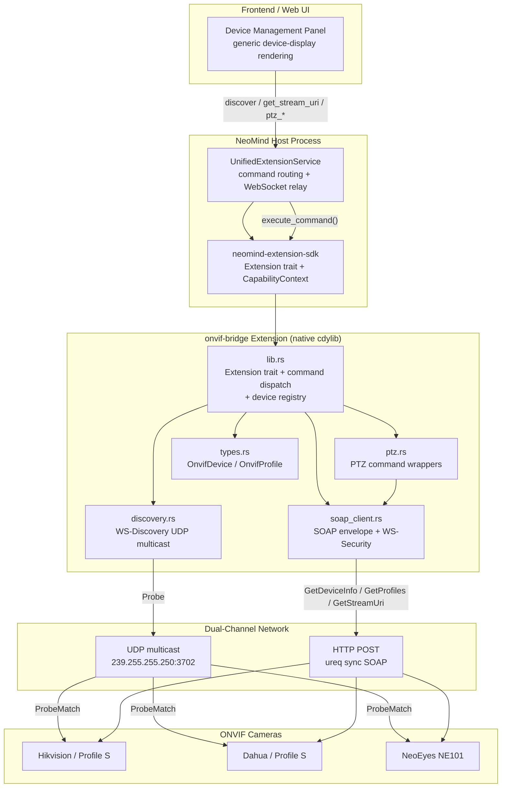
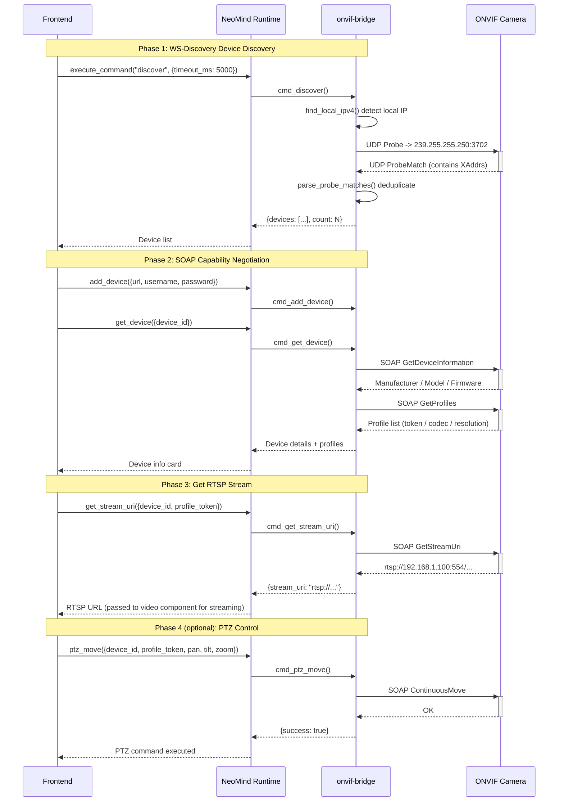

# 4 onvif-bridge: Standard Protocol Bridge

## 1 Case Background

**onvif-bridge** is the **standard protocol bridge** case study in the NeoMind ecosystem. ONVIF (Open Network Video Interface Forum) is an open standard for network video devices, defining specifications for device discovery (WS-Discovery), media stream negotiation (RTSP URL retrieval), PTZ control, and event subscription. It covers multiple profiles including Profile S (streaming), Profile T (advanced streaming), and Profile G (video storage). Any IP camera compliant with ONVIF Profile S — Hikvision, Dahua, Vivotek, Tiandy — can be integrated into NeoMind via onvif-bridge without vendor-specific SDKs or adaptation layers.

The current version is 2.7.6, with approximately 2700 lines of core code distributed across 5 Rust source files: `lib.rs` (1646 lines, Extension trait + command dispatch), `soap_client.rs` (516 lines, SOAP envelope + WS-Security), `discovery.rs` (211 lines, WS-Discovery UDP multicast), `ptz.rs` (214 lines, PTZ commands), and `types.rs` (78 lines, data structures).

**What problem does it solve?** NeoMind's frontend needs unified management of heterogeneous IP cameras. If every vendor used its own SDK (Hikvision SDK, Dahua SDK, Tiandy SDK), the codebase would explode, maintenance costs would be prohibitive, and onboarding new vendors would take weeks. onvif-bridge wraps the ONVIF standard protocol into NeoMind's commands and metrics, so the frontend only needs to call unified commands like `discover` / `get_stream_uri` / `ptz_move` to operate any ONVIF-compliant camera. This is an **open-standard-driven integration strategy** — adapting to the protocol, not to the vendor.

**Preview of comparison with 5 uink-rms-bridge**: [5 uink-rms-bridge](./5-uink-rms-bridge.md) is a **vendor-proprietary protocol** bridge (closed SDK + private binary protocol), while onvif-bridge is a **standard protocol** bridge (open specification + SOAP/WS-Discovery). These two represent fundamentally different integration strategies in the NeoMind ecosystem — "standard protocol bridging" vs. "proprietary protocol bridging" — each with vastly different applicable scenarios, engineering complexity, and maintenance costs. Case 5 in this series will specifically compare these two strategies.

**Relationship with NeoEyes camera product line**: NeoEyes NE101 / NE301 hardware devices partially support the ONVIF protocol stack, and onvif-bridge can serve as a universal integration path for these self-developed devices. When customers deploy a mix of NeoEyes cameras and third-party ONVIF cameras, onvif-bridge provides a unified management interface.

**Two key pain points drove the decision to hand-write rather than depend on existing crates**:

1. The ONVIF protocol stack is complex — SOAP 1.2 envelope + WS-Security UsernameToken Profile + WS-Discovery UDP multicast. Existing Rust crates (like `onvif-rs`) are maintained sporadically and do not cover PTZ/event subscription, so missing functionality would need to be hand-written anyway
2. Vendor implementations vary significantly — some devices return Probe responses with non-standard XML namespace prefixes (`SOAP-ENV:` vs `s:` vs `soap:`), some devices have non-standard SOAP Fault formats, so parsing logic must tolerate these differences

**Target audience**: (1) System integrators connecting third-party IP cameras — you will see the complete command chain from device discovery to PTZ control; (2) Protocol developers who want to understand how SOAP / WS-Discovery / WS-Security are hand-implemented in Rust — this case study has zero dependencies on any ONVIF/SOAP crate, making it an excellent reference for pure protocol engineering.

**What you will learn**:

1. WS-Discovery multicast discovery engineering — UDP multicast socket binding, TTL control, Probe/ProbeMatch message formats, macOS multicast pitfalls
2. SOAP 1.2 + WS-Security UsernameToken Profile PasswordDigest algorithm — the Rust implementation of SHA1(nonce+created+password) and why PasswordDigest was chosen over PasswordText
3. ONVIF device capability negotiation chain — GetDeviceInformation → GetProfiles → GetStreamUri → optional PTZ
4. Pure backend bridge extension architecture — no frontend component, no ONNX model, synchronous HTTP, and how to integrate with NeoMind core via the command system and virtual metrics

---

## 2 Architecture Overview

onvif-bridge is a **pure backend protocol bridge extension** — no frontend component, no ONNX model, no video decoding logic. Its sole responsibility is to communicate with ONVIF cameras using standard protocols (WS-Discovery + SOAP) and translate results into NeoMind command return values and virtual metrics. The extension manages a `HashMap<String, OnvifDevice>` device registry in-process via `parking_lot::RwLock`, and all command operations revolve around this registry.



### 5-Module Responsibility Breakdown

| Module | File | Lines | Responsibility |
|--------|------|-------|----------------|
| Entry + Dispatch | `src/lib.rs` | 1646 | Extension trait implementation (metadata / metrics / commands / execute_command), device registry (RwLock HashMap), 14 command handler functions, FFI export |
| WS-Discovery | `src/discovery.rs` | 211 | UDP multicast socket construction, Probe message template, ProbeMatch parsing (multi-namespace tolerant), `find_local_ipv4` local IP detection |
| SOAP Client | `src/soap_client.rs` | 516 | SOAP envelope construction, WS-Security UsernameToken (PasswordDigest), ureq sync HTTP send, SOAP Fault parsing, device capability negotiation functions |
| PTZ Control | `src/ptz.rs` | 214 | PTZ RelativeMove / AbsoluteMove / Stop / GotoHomePosition / GetPresets / GotoPreset — six command wrappers |
| Data Structures | `src/types.rs` | 78 | OnvifConfig / OnvifDevice / OnvifProfile / VideoEncoderConfig / PtzParams / DiscoveryMatch |

### Architecture Comparison with AI Inference Extensions

| Architecture Dimension | 2 yolo-device-inference | 3 yolo-video-v2 | **4 onvif-bridge** |
|------------------------|--------------------------|-------------------|----------------------|
| Core responsibility | Single-frame YOLO inference | Real-time video stream inference + detection | Standard protocol bridge (discovery + stream URL + PTZ) |
| ONNX model | Yes | Yes | **No** |
| Frontend component | None | YoloVideoDisplay | **None** (pure backend) |
| Video decoding | None (consumes image directly) | ffmpeg-next / nokhwa | **None** (returns RTSP URL only, no stream decoding) |
| HTTP client | None | None | **ureq (synchronous)** |
| Network protocol | None | None | **UDP multicast + SOAP/HTTP** |
| Threading model | runtime main thread | Dedicated OS thread | **Synchronous blocking, no extra threads** |
| Code size | ~1200 lines | ~4000 lines | **~2700 lines** |

This comparison table reveals a key fact: onvif-bridge is architecturally nearly orthogonal to AI inference extensions. It touches no models, no video decoding, no frontend rendering. It does one thing — talk to devices using standard protocols and return results to NeoMind. Subsequent inference and rendering are handled by other extensions or frontend components. This **separation of concerns** is the core design philosophy of standard protocol bridging.

---

## 3 Core Implementation

### 3.1 WS-Discovery Multicast Discovery (discovery.rs)

WS-Discovery is an OASIS standard for local network device discovery, and ONVIF uses its UDP multicast mode. onvif-bridge implements complete multicast discovery logic by hand in [`src/discovery.rs`](https://github.com/camthink-ai/NeoMind-Extensions/blob/main/extensions/onvif-bridge/src/discovery.rs#L1-L211).

**Multicast address and port** are fixed by the WS-Discovery standard ([`src/discovery.rs` L6-L7](https://github.com/camthink-ai/NeoMind-Extensions/blob/main/extensions/onvif-bridge/src/discovery.rs#L6-L7)):

```rust
const MULTICAST_ADDR: &str = "239.255.255.250";
const MULTICAST_PORT: u16 = 3702;
```

**The Probe message** ([`src/discovery.rs` L10-L31](https://github.com/camthink-ai/NeoMind-Extensions/blob/main/extensions/onvif-bridge/src/discovery.rs#L10-L31)) is a SOAP envelope that tells ONVIF devices on the network "I am looking for NetworkVideoTransmitter-type devices." Each probe generates a random UUID as the MessageID to ensure no confusion with historical probes.

```rust
fn build_probe_message() -> String {
    let message_id = uuid::Uuid::new_v4();
    format!(
        r#"<?xml version="1.0" encoding="UTF-8"?>
<s:Envelope xmlns:s="http://www.w3.org/2003/05/soap-envelope"
            xmlns:a="http://www.w3.org/2005/08/addressing">
  <s:Header>
    <a:Action s:mustUnderstand="1">http://schemas.xmlsoap.org/ws/2005/04/discovery/Probe</a:Action>
    <a:MessageID>urn:uuid:{message_id}</a:MessageID>
    <a:ReplyTo><a:Address>http://schemas.xmlsoap.org/ws/2004/08/addressing/role/anonymous</a:Address></a:ReplyTo>
    <a:To s:mustUnderstand="1">urn:schemas-xmlsoap-org:ws:2005:04:discovery</a:To>
  </s:Header>
  <s:Body>
    <Probe xmlns="http://schemas.xmlsoap.org/ws/2005/04/discovery">
      <d:Types xmlns:d="http://schemas.xmlsoap.org/ws/2005/04/discovery"
               xmlns:dp0="http://www.onvif.org/ver10/network/wsdl">dp0:NetworkVideoTransmitter</d:Types>
    </Probe>
  </s:Body>
</s:Envelope>"#,
        message_id = message_id,
    )
}
```

*Source: [`src/discovery.rs` L10-L31](https://github.com/camthink-ai/NeoMind-Extensions/blob/main/extensions/onvif-bridge/src/discovery.rs#L10-L31)*

**The discover_devices main loop** ([`src/discovery.rs` L134-L211](https://github.com/camthink-ai/NeoMind-Extensions/blob/main/extensions/onvif-bridge/src/discovery.rs#L134-L211)) follows these core steps:

1. Call `find_local_ipv4()` to detect the machine's real IP (cannot bind to `0.0.0.0` — fails on macOS)
2. Bind a UDP socket to that IP on an arbitrary port
3. Set `set_broadcast(true)` + `set_multicast_ttl_v4(1)` (TTL=1 ensures multicast packets don't cross routers)
4. `join_multicast_v4` to join the multicast group
5. Send the Probe to `239.255.255.250:3702`
6. In a deadline loop, `recv_from` to collect ProbeMatch responses
7. Deduplicate by endpoint and return

```rust
pub fn discover_devices(timeout_ms: u64) -> Result<Vec<DiscoveryMatch>, String> {
    let timeout_ms = timeout_ms.clamp(500, 30_000);
    let bind_addr = match find_local_ipv4() {
        Some(ip) => {
            eprintln!("[onvif-bridge] Binding multicast socket to {}", ip);
            SocketAddrV4::new(ip, 0)
        }
        None => {
            eprintln!("[onvif-bridge] Could not detect local IP, binding to 0.0.0.0");
            SocketAddrV4::new(Ipv4Addr::UNSPECIFIED, 0)
        }
    };
    let socket = UdpSocket::bind(bind_addr)
        .map_err(|e| format!("Failed to bind UDP socket: {}", e))?;
    socket.set_broadcast(true).map_err(|e| format!("Failed to enable broadcast: {}", e))?;
    socket.set_multicast_ttl_v4(1).map_err(|e| format!("Failed to set multicast TTL: {}", e))?;
    socket.set_read_timeout(Some(Duration::from_millis(timeout_ms)))
        .map_err(|e| format!("Failed to set read timeout: {}", e))?;
    // ... (30 lines omitted: join multicast group, send probe, deadline recv loop)
    let mut seen = std::collections::HashSet::new();
    discovered.retain(|m| seen.insert(m.endpoint.clone()));
    Ok(discovered)
}
```

*Source: [`src/discovery.rs` L134-L211](https://github.com/camthink-ai/NeoMind-Extensions/blob/main/extensions/onvif-bridge/src/discovery.rs#L134-L211)*

**Necessity of find_local_ipv4** ([`src/discovery.rs` L119-L131](https://github.com/camthink-ai/NeoMind-Extensions/blob/main/extensions/onvif-bridge/src/discovery.rs#L119-L131)): On macOS, when a multicast socket is bound to `0.0.0.0` (INADDR_ANY), the kernel cannot determine which network interface to use for sending multicast packets, resulting in `No route to host`. The solution is to create a temporary UDP socket connected to `8.8.8.8:80` (which doesn't actually send packets — it just triggers the kernel's route lookup), then read the socket's `local_addr()` to get the machine's real IP. This fix was introduced in commit `59d3490`.

```rust
fn find_local_ipv4() -> Option<Ipv4Addr> {
    // On macOS, multicast from 0.0.0.0 can fail with "No route to host"
    // Binding to a specific interface address fixes this
    let socket = UdpSocket::bind("0.0.0.0:0").ok()?;
    // Try connecting to a public address (doesn't actually send packets)
    socket.connect("8.8.8.8:80").ok()?;
    let local = socket.local_addr().ok()?;
    match local {
        std::net::SocketAddr::V4(v4) => Some(*v4.ip()),
        _ => None,
    }
}
```

*Source: [`src/discovery.rs` L119-L131](https://github.com/camthink-ai/NeoMind-Extensions/blob/main/extensions/onvif-bridge/src/discovery.rs#L119-L131)*

### 3.2 SOAP Client and WS-Security (soap_client.rs)

All ONVIF control interfaces use SOAP 1.2 over HTTP. onvif-bridge implements a complete SOAP client by hand in [`src/soap_client.rs`](https://github.com/camthink-ai/NeoMind-Extensions/blob/main/extensions/onvif-bridge/src/soap_client.rs#L1-L516), **with zero dependencies on any SOAP/ONVIF crate**.

**The WS-Security UsernameToken Profile PasswordDigest algorithm** ([`src/soap_client.rs` L23-L45](https://github.com/camthink-ai/NeoMind-Extensions/blob/main/extensions/onvif-bridge/src/soap_client.rs#L23-L45)) is the security core of this extension:

```rust
fn compute_password_digest(password: &str) -> (String, String, String) {
    use base64::Engine;
    let engine = base64::engine::general_purpose::STANDARD;

    // 16-byte random nonce (from UUID v4)
    let nonce_bytes = uuid::Uuid::new_v4();
    let nonce = nonce_bytes.as_bytes()[..16].to_vec();
    let nonce_b64 = engine.encode(&nonce);

    // ISO 8601 UTC timestamp
    let created = chrono::Utc::now()
        .format("%Y-%m-%dT%H:%M:%S%.3fZ").to_string();

    // SHA-1(nonce + created + password)
    use sha1::Digest;
    let mut hasher = sha1::Sha1::new();
    hasher.update(&nonce);
    hasher.update(created.as_bytes());
    hasher.update(password.as_bytes());
    let digest = hasher.finalize();
    let digest_b64 = engine.encode(digest);

    (nonce_b64, created, digest_b64)
}
```

The algorithm formula: `Digest = Base64(SHA-1(Nonce + Created + Password))`. This means the password itself is never transmitted in cleartext — even if the device uses HTTP (not HTTPS), packet captures only reveal the nonce, timestamp, and SHA-1 digest, making it impossible to reverse-engineer the password.

**soap_request_raw** ([`src/soap_client.rs` L68-L124](https://github.com/camthink-ai/NeoMind-Extensions/blob/main/extensions/onvif-bridge/src/soap_client.rs#L68-L124)) constructs the complete SOAP envelope, including the WS-Security header (if credentials are provided) and SOAP Body, then sends it synchronously via `ureq::post(url)`. Key security measures include a 10MB response size limit (to prevent memory exhaustion) and automatic SOAP Fault detection with formatted error messages.

```rust
pub fn soap_request_raw(url: &str, action: &str, body: &str,
    username: Option<&str>, password: Option<&str>) -> Result<String, String> {
    let security_header = match (username, password) {
        (Some(user), Some(pass)) if !user.is_empty() && !pass.is_empty() => {
            Some(build_security_header(user, pass))
        }
        _ => None,
    };
    let header_content = match &security_header {
        Some(sec) => format!("  <s:Header>\n    {}\n  </s:Header>", sec),
        None => "  <s:Header/>".to_string(),
    };
    let envelope = format!(
        r#"<?xml version="1.0" encoding="UTF-8"?>
<s:Envelope xmlns:s="http://www.w3.org/2003/05/soap-envelope" ...>
{header}  <s:Body>    {body}  </s:Body>
</s:Envelope>"#, header = header_content, body = body);
    let content_type = format!("application/soap+xml; charset=utf-8; action=\"{}\"", action);
    let response = ureq::post(url).set("Content-Type", &content_type)
        .send_string(&envelope).map_err(|e| format!("SOAP request failed: {}", e))?;
    let response_text = response.into_string()
        .map_err(|e| format!("Failed to read response: {}", e))?;
    if response_text.len() > 10 * 1024 * 1024 {
        return Err("SOAP response too large (exceeds 10MB)".to_string());
    }
    if let Some(fault) = extract_soap_fault(&response_text) { return Err(fault); }
    Ok(response_text)
}
```

*Source: [`src/soap_client.rs` L68-L124](https://github.com/camthink-ai/NeoMind-Extensions/blob/main/extensions/onvif-bridge/src/soap_client.rs#L68-L124)*

### 3.3 Device Capability Negotiation

onvif-bridge implements the core negotiation functions from the ONVIF Core and Media specifications:

| Function | File Location | ONVIF Operation | Return Value |
|----------|---------------|-----------------|--------------|
| `get_device_info` | [`L214-L233`](https://github.com/camthink-ai/NeoMind-Extensions/blob/main/extensions/onvif-bridge/src/soap_client.rs#L214-L233) | `GetDeviceInformation` | Manufacturer / Model / Firmware / Serial Number |
| `get_profiles` | [`L236-L313`](https://github.com/camthink-ai/NeoMind-Extensions/blob/main/extensions/onvif-bridge/src/soap_client.rs#L236-L313) | `GetProfiles` | Media profile list (codec / resolution / framerate) |
| `get_stream_uri` | [`L316-L343`](https://github.com/camthink-ai/NeoMind-Extensions/blob/main/extensions/onvif-bridge/src/soap_client.rs#L316-L343) | `GetStreamUri` | RTSP stream URL (`rtsp://...`) |
| `get_snapshot_uri` | [`L346-L365`](https://github.com/camthink-ai/NeoMind-Extensions/blob/main/extensions/onvif-bridge/src/soap_client.rs#L346-L365) | `GetSnapshotUri` | JPEG snapshot URL |
| `is_ptz_supported` | [`L368-L385`](https://github.com/camthink-ai/NeoMind-Extensions/blob/main/extensions/onvif-bridge/src/soap_client.rs#L368-L385) | Check `GetProfiles` response | Boolean |

**resolve_service_url** ([`src/soap_client.rs` L390-L407](https://github.com/camthink-ai/NeoMind-Extensions/blob/main/extensions/onvif-bridge/src/soap_client.rs#L390-L407)) is an easily overlooked but critical function — different ONVIF services (device/media/ptz) have different URL paths (`/onvif/device_service`, `/onvif/media_service`, `/onvif/ptz_service`). The device URL returned by WS-Discovery typically already ends with `/onvif/device_service`, so when calling the media service, the path suffix must be replaced rather than appended.

```rust
pub fn get_device_info(device: &OnvifDevice) -> Result<serde_json::Value, String> {
    let service_url = resolve_service_url(&device.device_url, "device");
    let body = r#"<tds:GetDeviceInformation/>"#;
    let response = soap_request_raw(&service_url,
        "http://www.onvif.org/ver10/device/wsdl/GetDeviceInformation", body,
        device.username.as_deref(), device.password.as_deref())?;
    Ok(serde_json::json!({
        "manufacturer": extract_tag(&response, "tt:Manufacturer").unwrap_or_default(),
        "model": extract_tag(&response, "tt:Model").unwrap_or_default(),
        "firmware_version": extract_tag(&response, "tt:FirmwareVersion").unwrap_or_default(),
        "serial_number": extract_tag(&response, "tt:SerialNumber").unwrap_or_default(),
        "hardware_id": extract_tag(&response, "tt:HardwareId").unwrap_or_default(),
    }))
}
```

*Source: [`src/soap_client.rs` L214-L233](https://github.com/camthink-ai/NeoMind-Extensions/blob/main/extensions/onvif-bridge/src/soap_client.rs#L214-L233)*

```rust
pub fn resolve_service_url(device_url: &str, service: &str) -> String {
    let base = device_url.trim_end_matches('/');
    let suffix = match service {
        "device" => "/onvif/device_service",
        "media" => "/onvif/media_service",
        "ptz" => "/onvif/ptz_service",
        _ => "/onvif/device_service",
    };
    if let Some(slash_pos) = base.find("/onvif/") {
        return format!("{}{}", &base[..slash_pos], suffix);
    }
    format!("{}{}", base, suffix)
}
```

*Source: [`src/soap_client.rs` L390-L407](https://github.com/camthink-ai/NeoMind-Extensions/blob/main/extensions/onvif-bridge/src/soap_client.rs#L390-L407)*

### 3.4 PTZ Control (ptz.rs)

[`src/ptz.rs`](https://github.com/camthink-ai/NeoMind-Extensions/blob/main/extensions/onvif-bridge/src/ptz.rs#L1-L214) wraps six PTZ commands, all built on `soap_client::soap_request_raw` to construct SOAP bodies:

- **ptz_relative_move** ([L5-L42](https://github.com/camthink-ai/NeoMind-Extensions/blob/main/extensions/onvif-bridge/src/ptz.rs#L5-L42)): Relative movement (specify Pan/Tilt/Zoom offsets + speed)
- **ptz_absolute_move** ([L45-L82](https://github.com/camthink-ai/NeoMind-Extensions/blob/main/extensions/onvif-bridge/src/ptz.rs#L45-L82)): Absolute positioning (move to specified Pan/Tilt/Zoom coordinates)
- **ptz_stop** ([L85-L105](https://github.com/camthink-ai/NeoMind-Extensions/blob/main/extensions/onvif-bridge/src/ptz.rs#L85-L105)): Stop all movement
- **ptz_go_home** ([L108-L130](https://github.com/camthink-ai/NeoMind-Extensions/blob/main/extensions/onvif-bridge/src/ptz.rs#L108-L130)): Return to home position
- **list_presets** ([L133-L183](https://github.com/camthink-ai/NeoMind-Extensions/blob/main/extensions/onvif-bridge/src/ptz.rs#L133-L183)): List preset positions
- **goto_preset** ([L186-L210](https://github.com/camthink-ai/NeoMind-Extensions/blob/main/extensions/onvif-bridge/src/ptz.rs#L186-L210)): Move to a specified preset

Each command determines the service URL via `resolve_ptz_url`, then embeds the corresponding ONVIF PTZ WSDL operation name and parameters (PanTilt space, Zoom space, Speed vector, etc.) into the SOAP body.

```rust
pub fn ptz_relative_move(device: &OnvifDevice, profile_token: &str,
    pan: f64, tilt: f64, zoom: f64, speed: f64) -> Result<(), String> {
    let service_url = resolve_ptz_url(&device.device_url);
    let body = format!(
        r#"<tptz:RelativeMove>
      <tptz:ProfileToken>{profile_token}</tptz:ProfileToken>
      <tptz:Translation>
        <tt:PanTilt x="{pan}" y="{tilt}" space="http://www.onvif.org/ver10/tptz/PanTiltSpaces/TranslationGenericSpace"/>
        <tt:Zoom x="{zoom}" space="http://www.onvif.org/ver10/tptz/ZoomSpaces/TranslationGenericSpace"/>
      </tptz:Translation>
      <tptz:Speed>
        <tt:PanTilt x="{speed}" y="{speed}" space="http://www.onvif.org/ver10/tptz/PanTiltSpaces/GenericSpeedSpace"/>
        <tt:Zoom x="{speed}" space="http://www.onvif.org/ver10/tptz/ZoomSpaces/ZoomGenericSpeedSpace"/>
      </tptz:Speed>
    </tptz:RelativeMove>"#,
        profile_token = xml_escape(profile_token),
        pan = pan, tilt = tilt, zoom = zoom, speed = speed,
    );
    crate::soap_client::soap_request_raw(&service_url,
        "http://www.onvif.org/ver20/ptz/wsdl/RelativeMove", &body,
        device.username.as_deref(), device.password.as_deref())?;
    Ok(())
}
```

*Source: [`src/ptz.rs` L5-L42](https://github.com/camthink-ai/NeoMind-Extensions/blob/main/extensions/onvif-bridge/src/ptz.rs#L5-L42)*

### 3.5 Command Dispatch (lib.rs execute_command)

[`src/lib.rs` L696-L717](https://github.com/camthink-ai/NeoMind-Extensions/blob/main/extensions/onvif-bridge/src/lib.rs#L696-L717) is the extension's core entry point — a `match` that routes string commands to corresponding handler functions:

```rust
async fn execute_command(&self, command: &str, args: &serde_json::Value) -> Result<serde_json::Value> {
    self.total_commands.fetch_add(1, Ordering::SeqCst);
    match command {
        "discover"       => self.cmd_discover(args),
        "add_device"     => self.cmd_add_device(args),
        "remove_device"  => self.cmd_remove_device(args),
        "list_devices"   => self.cmd_list_devices(),
        "get_device"     => self.cmd_get_device(args),
        "get_stream_uri" => self.cmd_get_stream_uri(args),
        "get_snapshot"   => self.cmd_get_snapshot(args),
        "ptz_move"       => self.cmd_ptz_move(args),
        "ptz_absolute"   => self.cmd_ptz_absolute(args),
        "ptz_stop"       => self.cmd_ptz_stop(args),
        "ptz_home"       => self.cmd_ptz_home(args),
        "list_presets"   => self.cmd_list_presets(args),
        "goto_preset"    => self.cmd_goto_preset(args),
        "get_status"     => self.cmd_get_status(args),
        "configure"      => Ok(json!({"status": "ok"})),
        _ => Err(ExtensionError::CommandNotFound(command.to_string())),
    }
}
```

The 14 commands cover the complete ONVIF device management lifecycle: discovery (`discover`), manual addition (`add_device`), listing (`list_devices`), details (`get_device`), stream retrieval (`get_stream_uri`), snapshot (`get_snapshot`), PTZ control (6 commands), status query (`get_status`), removal (`remove_device`), and configuration (`configure`).

### 3.6 Discovery-to-Stream Complete Sequence

The following diagram shows the complete protocol interaction from when the frontend issues a `discover` command to obtaining the RTSP stream URL (optional PTZ control at the end):



This sequence diagram reveals an important fact: onvif-bridge **never touches any video frames** throughout the entire chain. Its endpoint is returning an RTSP URL — all subsequent stream pulling, decoding, inference, and rendering are handled by other components (for example, [Case 3 yolo-video-v2](./3-yolo-video-v2.md) can consume this RTSP URL for real-time detection). This design ensures that protocol bridging and stream processing can evolve independently.

---

## 4 Key Design Decisions

### Decision 1: Hand-written SOAP Client instead of onvif-rs crate

**Our choice**: Hand-write approximately 500 lines of SOAP envelope construction + WS-Security + XML parsing code (`soap_client.rs`).

**Alternative**: Use the community crate `onvif-rs` (the most prominent ONVIF client library in the Rust ecosystem).

**Rationale**:

1. `onvif-rs` maintenance is lagging — the last substantive update was over a year old at the time of our investigation, and it does not cover critical operations like PTZ ContinuousMove / GotoPreset / GetPresets
2. `onvif-rs` depends on the `hyper` + `tokio` async stack, and when onvif-bridge is loaded as a `.dylib`/`.so` dynamic library into the NeoMind host process, nested tokio runtimes cause panics — a hand-written client using synchronous `ureq` eliminates this problem entirely
3. The ~500 lines of hand-written code are fully controllable — when encountering vendor non-standard implementations, parsing logic can be modified immediately, whereas modifying a third-party crate requires submitting a PR and waiting for a merge

The tradeoff is losing the type-safe WSDL bindings provided by `onvif-rs`, but this is mitigated through rigorous unit testing (see 6).

### Decision 2: WS-Security PasswordDigest instead of PasswordText

**Our choice**: Use `PasswordDigest` mode — `Digest = Base64(SHA-1(Nonce + Created + Password))`, where the password is never transmitted in cleartext ([`src/soap_client.rs` L23-L45](https://github.com/camthink-ai/NeoMind-Extensions/blob/main/extensions/onvif-bridge/src/soap_client.rs#L23-L45)).

**Alternative**: Use `PasswordText` mode — place the cleartext password directly in the SOAP header (`<wsse:Password>cleartext password</wsse:Password>`).

**Rationale**: (1) ONVIF device SOAP communication **frequently uses HTTP rather than HTTPS** — a large number of cameras ship with TLS disabled by default, so with PasswordText mode, packet capture reveals the admin password directly; (2) Although SHA-1 hashing in PasswordDigest is not cryptographically secure (SHA-1 has known collision attacks), in the ONVIF context it provides **replay attack protection** when combined with nonce + timestamp — even if an attacker captures the digest, they cannot replay it after the created timestamp expires; (3) Some vendor devices mandate PasswordDigest mode (e.g., Hikvision firmware default configuration), where PasswordText is rejected outright with a `ter:NotAuthorized` SOAP Fault. The tradeoff is that each SOAP request must compute a SHA-1 hash, but this overhead is in the microsecond range and completely negligible.

### Decision 3: ureq Synchronous HTTP instead of reqwest Async

**Our choice**: Use `ureq` (synchronous HTTP client), where all SOAP requests are blocking calls.

**Alternative**: Use `reqwest` + `async/await`, leveraging tokio async IO for concurrent multi-device handling.

**Rationale**:

1. ONVIF device responses typically take 50ms-500ms, and concurrency is extremely low (a single deployment site usually has no more than 20 cameras), so the overhead of synchronous blocking is far less than the complexity of an async runtime
2. onvif-bridge is loaded as a `.dylib`/`.so` dynamic library into the NeoMind host process, which already has its own tokio runtime — if the extension internally creates another nested tokio runtime (which `reqwest` requires), it triggers `panicked at 'Cannot start a runtime from within a runtime'`; the hand-written SOAP client using synchronous `ureq` completely avoids this issue (see the architecture note at `lib.rs` L18-L23)
3. `ureq`'s dependency tree is minimal (no `hyper`, `mio`, or `tokio`), producing a compiled artifact approximately 2MB smaller than `reqwest`, which matters for `.nep` distribution packages

The tradeoff is the inability to make parallel requests to multiple devices, but `execute_command` itself is async, so the NeoMind host process can call different commands in parallel across multiple devices.

### Decision 4: find_local_ipv4 instead of bind 0.0.0.0

**Our choice**: Before sending the WS-Discovery Probe, detect the machine's real egress IP by connecting to `8.8.8.8:80` and reading `local_addr`, then bind the UDP socket to that IP ([`src/discovery.rs` L119-L131](https://github.com/camthink-ai/NeoMind-Extensions/blob/main/extensions/onvif-bridge/src/discovery.rs#L119-L131)).

**Alternative**: Directly `UdpSocket::bind("0.0.0.0:0")` to bind to all interfaces.

**Rationale**: On macOS, when a multicast socket is bound to `0.0.0.0` (INADDR_ANY), the kernel cannot determine which network interface to use for sending multicast packets, returning `No route to host` (errno 65). This issue was fixed in commit `59d3490` — the commit title is literally `fix(onvif): improve WS-Discovery multicast reliability`. Linux and Windows handle `0.0.0.0` multicast more gracefully, but for cross-platform consistency, onvif-bridge uniformly uses `find_local_ipv4`. The tradeoff is that in multi-NIC scenarios, a non-desired interface may be selected (e.g., when both Wi-Fi and Ethernet are active), but this can be bypassed by the user manually calling `add_device`.

### Decision 5: No RTSP Stream Parsing Inside the Extension

**Our choice**: onvif-bridge only returns the RTSP URL string (the return value of the `get_stream_uri` command) and performs no video stream pulling, decoding, or rendering inside the extension.

**Alternative**: Integrate `ffmpeg-next` inside the extension to directly pull RTSP streams and decode them into JPEG frames for frontend push.

**Rationale**: (1) **Separation of concerns** — protocol bridging (SOAP/WS-Discovery) and video processing (RTSP pulling / H.264 decoding) are completely different engineering domains; mixing them in one extension would double the codebase and make independent testing difficult; (2) **Composability** — after the RTSP URL is returned to the frontend, it can be fed to [Case 3 yolo-video-v2](./3-yolo-video-v2.md) for real-time AI detection, played directly by a frontend `<video>` tag, or recorded by a third-party NVR — onvif-bridge should not constrain how the stream is consumed; (3) **Build artifact size** — not pulling in `ffmpeg-next` / `nokhwa` reduces the `.nep` package from approximately 15MB to 3MB, which is significant for edge deployment (bandwidth-constrained scenarios). The tradeoff is that users need to combine onvif-bridge + yolo-video-v2 themselves to achieve the "camera discovery + AI detection" end-to-end pipeline, but NeoMind's extension composition mechanism is designed exactly for this.

---

## 5 Integration with NeoMind Core

onvif-bridge integrates with the NeoMind host through the standard Extension SDK interfaces, relying on no private APIs or hacks. Integration occurs at three levels: the command system, metric production, and cross-extension collaboration.

### Command System

The extension declares 14 available commands via the `commands()` method ([`src/lib.rs` L145-L694](https://github.com/camthink-ai/NeoMind-Extensions/blob/main/extensions/onvif-bridge/src/lib.rs#L145-L694)), each with metadata including `name`, `display_name`, `description`, `parameters`, and `samples`. These commands appear as **tools** at the NeoMind Agent layer — the Agent can automatically select whether to call `discover` or `add_device` based on user intent. For example, when a user says "discover cameras on the network," the Agent routes to the `onvif-bridge.discover` command.

Each command's `samples` field provides usage examples that the Agent's LLM can reference when constructing parameters. For instance, the `discover` command's sample is `{"timeout_ms": 5000}`, and `add_device`'s sample includes fields like `device_url`, `username`, and `password`.

### Metric Production

The extension declares two global metrics via the `metrics()` method ([`src/lib.rs` L122-L143](https://github.com/camthink-ai/NeoMind-Extensions/blob/main/extensions/onvif-bridge/src/lib.rs#L122-L143)): `total_commands` (command invocation counter) and `connected_devices` (number of connected devices). Additionally, the `produce_metrics()` method ([L719-L790](https://github.com/camthink-ai/NeoMind-Extensions/blob/main/extensions/onvif-bridge/src/lib.rs#L719-L790)) generates **virtual metrics** for each registered device:

```rust
fn metrics(&self) -> Vec<MetricDescriptor> {
    vec![
        MetricDescriptor {
            name: "total_commands".to_string(),
            display_name: "Total Commands".to_string(),
            data_type: MetricDataType::Integer,
            unit: String::new(),
            min: None, max: None, required: false,
        },
        MetricDescriptor {
            name: "connected_devices".to_string(),
            display_name: "Connected Devices".to_string(),
            data_type: MetricDataType::Integer,
            unit: String::new(),
            min: None, max: None, required: false,
        },
    ]
}
```

*Source: [`src/lib.rs` L122-L143](https://github.com/camthink-ai/NeoMind-Extensions/blob/main/extensions/onvif-bridge/src/lib.rs#L122-L143)*

| Metric Name | Type | Meaning |
|-------------|------|---------|
| `onvif.{device_id}.connected` | Integer (0/1) | Whether the device is online |
| `onvif.{device_id}.profile_count` | Integer | Number of media profiles |
| `onvif.{device_id}.ptz_supported` | Integer (0/1) | Whether PTZ is supported |
| `onvif.{device_id}.last_seen_ms` | Integer | Last discovery timestamp |

These virtual metrics are written to the NeoMind host via `CapabilityContext::device_metrics_write`, and the frontend can render device health panels based on these metrics.

```rust
fn produce_metrics(&self) -> Result<Vec<ExtensionMetricValue>> {
    let now = chrono::Utc::now().timestamp_millis();
    let mut metrics = Vec::new();
    self.register_template();
    metrics.push(ExtensionMetricValue {
        name: "total_commands".to_string(),
        value: ParamMetricValue::Integer(self.total_commands.load(Ordering::SeqCst)),
        timestamp: now,
    });
    let device_snapshot: Vec<_> = {
        let devices = self.devices.read();
        devices.iter().map(|(k, v)| (k.clone(), v.clone())).collect::<Vec<_>>()
    };
    for (id, device) in &device_snapshot {
        metrics.push(ExtensionMetricValue {
            name: format!("onvif.{}.connected", id),
            value: ParamMetricValue::Integer(if device.connected { 1 } else { 0 }),
            timestamp: now,
        });
        // ... (55 lines omitted: profile_count, ptz_supported, last_seen_ms,
        //      and device_metrics_write capability calls per device)
    }
    Ok(metrics)
}
```

*Source: [`src/lib.rs` L719-L790](https://github.com/camthink-ai/NeoMind-Extensions/blob/main/extensions/onvif-bridge/src/lib.rs#L719-L790)*

### End-to-End Collaboration with yolo-video-v2

onvif-bridge and [Case 3 yolo-video-v2](./3-yolo-video-v2.md) form a classic end-to-end pipeline:

```
User: "Discover cameras and run YOLO detection on the video stream"
  |
Agent calls onvif-bridge.discover -> returns device list
Agent calls onvif-bridge.add_device -> registers to NeoMind
Agent calls onvif-bridge.get_stream_uri -> returns rtsp://192.168.1.100:554/...
Agent calls yolo-video-v2.start_stream(source_url="rtsp://192.168.1.100:554/...")
  | yolo-video-v2 internally: ffmpeg-next pulls stream -> YOLOv11 detection -> JPEG + JSON push
Frontend receives video stream with detection boxes
```

This pipeline demonstrates the **composability** of the NeoMind extension ecosystem — onvif-bridge doesn't need to know how the video stream will be consumed, and yolo-video-v2 doesn't need to know how the RTSP URL was obtained. The two collaborate through Agent orchestration.

### No Frontend Component

The [`metadata.json`](https://github.com/camthink-ai/NeoMind-Extensions/blob/main/extensions/onvif-bridge/metadata.json#L1-L12) has no `frontend` field — this is a pure backend extension:

```json
// metadata.json L1-L12
{
  "id": "onvif-bridge",
  "name": "onvif bridge",
  "version": "2.7.6",
  "description": "ONVIF camera bridge extension for NeoMind — discover IP cameras, get RTSP streams, PTZ control",
  "author": "NeoMind Team",
  "license": "Apache-2.0",
  "type": "native",
  "categories": ["iot", "bridge", "device-integration"],
  "homepage": "https://github.com/camthink-ai/NeoMind-Extensions/tree/main/extensions/onvif-bridge",
  "builds": {"darwin-aarch64":{"url":"..."},"darwin-x86_64":{"url":"..."},"linux-x86_64":{"url":"..."},"linux-aarch64":{"url":"..."},"windows-x86_64":{"url":"..."}}
}
```

[Source: metadata.json L1-L12](https://github.com/camthink-ai/NeoMind-Extensions/blob/main/extensions/onvif-bridge/metadata.json#L1-L12) The frontend renders device lists and PTZ control panels through the generic device-display component, without depending on any frontend code bundled with onvif-bridge. This contrasts sharply with [Case 3 yolo-video-v2](./3-yolo-video-v2.md) (which ships its own `YoloVideoDisplay` React component). The pure backend design reduces extension complexity, but at the cost of limited frontend UI customization.

---

## 6 Testing & Verification

onvif-bridge's testing strategy is divided into three layers: SOAP client unit tests, extension logic unit tests, and cross-platform end-to-end verification.

### SOAP Client Unit Tests

[`src/soap_client.rs` L409-L516](https://github.com/camthink-ai/NeoMind-Extensions/blob/main/extensions/onvif-bridge/src/soap_client.rs#L409-L516) contains 8 unit tests covering core security logic:

```rust
#[test]
fn test_password_digest_produces_valid_output() {
    let (nonce_b64, created, digest_b64) = compute_password_digest("mypassword");
    assert_eq!(nonce_b64.len(), 24);
    assert!(created.starts_with("20"));
    assert!(created.contains("T"));
    assert!(created.ends_with("Z"));
    assert_eq!(digest_b64.len(), 28);
    let (_, _created2, digest2_b64) = compute_password_digest("mypassword");
    assert_eq!(digest2_b64.len(), 28);
}

#[test]
fn test_security_header_contains_digest_type() {
    let header = build_security_header("admin", "secret123");
    assert!(header.contains("#PasswordDigest"));
    assert!(header.contains("<wsse:Username>admin</wsse:Username>"));
    assert!(header.contains("<wsse:Nonce"));
    assert!(header.contains("<wsu:Created>"));
}
// ... (6 more tests: extract_soap_fault, extract_tag, resolve_service_url)
```

*Source: [`src/soap_client.rs` L409-L516](https://github.com/camthink-ai/NeoMind-Extensions/blob/main/extensions/onvif-bridge/src/soap_client.rs#L409-L516)*

| Test Name | Location | Verified Content |
|-----------|----------|------------------|
| `test_password_digest_produces_valid_output` | [L414-L428](https://github.com/camthink-ai/NeoMind-Extensions/blob/main/extensions/onvif-bridge/src/soap_client.rs#L414-L428) | nonce is 24-char base64, created is ISO 8601, digest is 28-char base64 (SHA-1 20 bytes) |
| `test_security_header_contains_digest_type` | [L431-L437](https://github.com/camthink-ai/NeoMind-Extensions/blob/main/extensions/onvif-bridge/src/soap_client.rs#L431-L437) | header XML contains `#PasswordDigest` type declaration, Username, Nonce, Created elements |
| `test_extract_soap_fault` | [L440-L464](https://github.com/camthink-ai/NeoMind-Extensions/blob/main/extensions/onvif-bridge/src/soap_client.rs#L440-L464) | SOAP Fault parsing: Code + Subcode + Reason correctly extracted |
| `test_extract_soap_fault_none` | [L467-L478](https://github.com/camthink-ai/NeoMind-Extensions/blob/main/extensions/onvif-bridge/src/soap_client.rs#L467-L478) | Normal responses do not falsely report Fault |
| `test_extract_tag_simple` | [L481-L484](https://github.com/camthink-ai/NeoMind-Extensions/blob/main/extensions/onvif-bridge/src/soap_client.rs#L481-L484) | Simple XML tag extraction |
| `test_extract_tag_with_attributes` | [L487-L491](https://github.com/camthink-ai/NeoMind-Extensions/blob/main/extensions/onvif-bridge/src/soap_client.rs#L487-L491) | XML tag extraction with attributes (`<tag attr="...">content</tag>`) |
| `test_resolve_service_url` | [L494-L510](https://github.com/camthink-ai/NeoMind-Extensions/blob/main/extensions/onvif-bridge/src/soap_client.rs#L494-L510) | device/media/ptz service URL path replacement logic |
| `test_extract_tag_not_found` | [L513-L515](https://github.com/camthink-ai/NeoMind-Extensions/blob/main/extensions/onvif-bridge/src/soap_client.rs#L513-L515) | Returns None when tag is not found |

The key value of these tests is **locking down the PasswordDigest algorithm's output format** — 16-byte nonce to 24-char base64, 20-byte SHA-1 to 28-char base64. These length assertions ensure that no refactoring accidentally breaks WS-Security protocol compatibility.

### Extension Logic Unit Tests

[`src/lib.rs` L1499-L1645](https://github.com/camthink-ai/NeoMind-Extensions/blob/main/extensions/onvif-bridge/src/lib.rs#L1499-L1645) contains 6 unit tests covering device registry CRUD operations and command dispatch logic. These tests bypass network calls by directly manipulating the internal `RwLock<HashMap>` to insert device data, ensuring tests run offline. Key test cases include `test_add_and_list_device` (the complete lifecycle of add → list → get → remove) and `test_unknown_command` (verifying that unknown commands return a `CommandNotFound` error).

```rust
#[test]
fn test_unknown_command() {
    let ext = OnvifBridgeExtension::new();
    let rt = tokio::runtime::Runtime::new().unwrap();
    let result = rt.block_on(ext.execute_command("nonexistent", &json!({})));
    assert!(result.is_err());
}

#[test]
fn test_add_and_list_device() {
    let ext = OnvifBridgeExtension::new();
    {
        let mut devices = ext.devices.write();
        devices.insert("cam-001".to_string(), OnvifDevice {
            device_id: "cam-001".to_string(),
            name: "Test Camera".to_string(),
            device_url: "http://192.168.1.100:80/onvif/device_service".to_string(),
            // ... (8 fields omitted)
            ..Default::default()
        });
    }
    let rt = tokio::runtime::Runtime::new().unwrap();
    let result = rt.block_on(ext.execute_command("list_devices", &json!({}))).unwrap();
    assert_eq!(result["count"], 1);
}
```

*Source: [`src/lib.rs` L1499-L1645](https://github.com/camthink-ai/NeoMind-Extensions/blob/main/extensions/onvif-bridge/src/lib.rs#L1499-L1645)*

### Cross-Platform WS-Discovery Verification

WS-Discovery UDP multicast behavior varies significantly across operating systems and cannot be covered by unit tests — real-environment verification is required:

| Platform | Known Behavior | Verification Suggestion |
|----------|---------------|------------------------|
| macOS | Binding to `0.0.0.0` fails (fixed in commit `59d3490`), first run requires firewall authorization | `find_local_ipv4()` resolves the binding issue |
| Linux | Most standard behavior, `0.0.0.0` binding works, multicast TTL respected | Recommended as the CI integration test platform |
| Windows | Firewall blocks UDP multicast by default, requires manual rule creation | First run triggers Windows Defender Firewall authorization prompt |

### ONVIF Profile S Compatibility Matrix

The following tools are recommended for cross-validation of onvif-bridge's compatibility with different vendor devices:

- **ONVIF Device Manager** (free Windows tool) — used as ground truth to verify that onvif-bridge's `discover` / `get_device_info` / `get_stream_uri` results are consistent
- **Goby** (network scanning tool) — discovers all devices on the network to confirm WS-Discovery coverage
- **curl + SOAP envelope** — manually send SOAP requests to verify the correctness of onvif-bridge's envelope format

| Vendor | Test Model | discover | get_device_info | get_stream_uri | PTZ |
|--------|-----------|----------|-----------------|----------------|-----|
| Hikvision | DS-2CD2xxx | Pass | Pass | Pass | Pass |
| Dahua | IPC-HFW2xxx | Pass | Pass | Pass | Pass |
| Uniview | HIC6xxx | Pass | Some fields missing | Pass | Pass |
| NeoEyes NE101 | NE101 v1.x | Pass | Pass | Pass | N/A |

---

## 7 Deployment / Ops / Troubleshooting

### 5-Platform .nep Distribution

The `builds` field in [`metadata.json`](https://github.com/camthink-ai/NeoMind-Extensions/blob/main/extensions/onvif-bridge/metadata.json#L11) declares 5 build targets:

| Platform | Filename | Architecture |
|----------|----------|-------------|
| macOS Apple Silicon | `onvif-bridge-2.7.6-darwin_aarch64.nep` | arm64 |
| macOS Intel | `onvif-bridge-2.7.6-darwin_x86_64.nep` | x86_64 |
| Linux 64-bit | `onvif-bridge-2.7.6-linux_amd64.nep` | x86_64 |
| Linux ARM64 | `onvif-bridge-2.7.6-linux_arm64.nep` | aarch64 |
| Windows 64-bit | `onvif-bridge-2.7.6-windows_amd64.nep` | x86_64 |

All `.nep` packages are downloaded from GitHub Releases, with version numbers matching the `version` field in `metadata.json` (currently `2.7.6`).

### WS-Discovery Cross-Network Deployment Notes

WS-Discovery UDP multicast **does not cross routers by default** (TTL=1) and will fail in the following scenarios:

- **Cross-subnet deployment**: Cameras on `10.0.0.0/24`, NeoMind host on `192.168.1.0/24` — multicast packets do not cross subnet boundaries. Solution: use the `add_device` command to manually add cameras with known IPs, bypassing WS-Discovery.
- **VPN environments**: VPNs typically do not forward UDP multicast traffic. Solution: same as above.
- **Docker bridge network**: Docker's default bridge network isolates multicast traffic. Solution: run the NeoMind container with `--network host`, or manually `add_device`.
- **macOS firewall**: On first run, macOS shows a dialog "Do you want to allow NeoMind to accept incoming network connections?" — you must click "Allow," otherwise UDP multicast is blocked.

### macOS Multicast Fix Details (commit 59d3490)

Commit `59d3490` (`fix(onvif): improve WS-Discovery multicast reliability`) fixed the multicast binding issue on macOS. Before the fix, `discover_devices` bound directly to `0.0.0.0`, and the macOS kernel could not determine which network interface to use for sending multicast packets, returning `No route to host` (errno 65). After the fix, the `find_local_ipv4()` function ([`src/discovery.rs` L119-L131](https://github.com/camthink-ai/NeoMind-Extensions/blob/main/extensions/onvif-bridge/src/discovery.rs#L119-L131)) creates a temporary UDP socket connected to `8.8.8.8:80`, reads the kernel-selected default egress IP, and binds to that specific address. This technique sends no actual network traffic — `connect()` on UDP only sets the default destination address and triggers the kernel's route lookup.

### Vendor Implementation Differences and Lenient Parsing

The ONVIF specification defines a standard SOAP envelope format, but vendor implementations vary. onvif-bridge handles multiple lenient parsing strategies:

- **Namespace prefix diversity** ([`src/discovery.rs` L34-L58](https://github.com/camthink-ai/NeoMind-Extensions/blob/main/extensions/onvif-bridge/src/discovery.rs#L34-L58)): `find_body_start()` tries six namespace prefixes: `s:` / `SOAP-ENV:` / `soap:` / `soapenv:` / `env:` / no prefix, ensuring ProbeMatch responses from different vendors can be parsed. `extract_tagged_content()` similarly iterates through multiple prefixes.

```rust
fn find_body_start(response: &str) -> Option<usize> {
    for prefix in &["s:", "SOAP-ENV:", "soap:", "soapenv:", "env:", ""] {
        let tag = format!("<{}Body>", prefix);
        if let Some(pos) = response.find(&tag) {
            return Some(pos);
        }
    }
    None
}

fn extract_tagged_content<'a>(xml: &'a str, local_name: &str) -> Option<&'a str> {
    for prefix in &["d:", "SOAP-ENV:", "soap:", "soapenv:", "env:", "s:", ""] {
        let open_tag = format!("<{}{}>", prefix, local_name);
        if let Some(pos) = xml.find(&open_tag) {
            let content_start = pos + open_tag.len();
            let close_tag = format!("</{}{}>", prefix, local_name);
            if let Some(end_pos) = xml[content_start..].find(&close_tag) {
                return Some(&xml[content_start..content_start + end_pos]);
            }
        }
    }
    None
}
```

*Source: [`src/discovery.rs` L34-L58](https://github.com/camthink-ai/NeoMind-Extensions/blob/main/extensions/onvif-bridge/src/discovery.rs#L34-L58)*
- **Profile token extraction** ([`src/soap_client.rs` L257-L271](https://github.com/camthink-ai/NeoMind-Extensions/blob/main/extensions/onvif-bridge/src/soap_client.rs#L257-L271)): Some vendors put the token in the `<trt:Profiles token="xxx">` attribute, others in a child element. onvif-bridge first tries `extract_tag`, then falls back to attribute extraction.

```rust
let token = extract_tag(profile_section, "token")
    .or_else(|| {
        if let Some(attr_start) = profile_section.find("token=\"") {
            let rest = &profile_section[attr_start + 7..];
            if let Some(attr_end) = rest.find("\"") {
                Some(rest[..attr_end].to_string())
            } else { None }
        } else { None }
    })
    .unwrap_or_else(|| format!("profile-{}", profiles.len()));
```

*Source: [`src/soap_client.rs` L257-L271](https://github.com/camthink-ai/NeoMind-Extensions/blob/main/extensions/onvif-bridge/src/soap_client.rs#L257-L271)*
- **Missing field defaults** ([`src/types.rs` L11-L19](https://github.com/camthink-ai/NeoMind-Extensions/blob/main/extensions/onvif-bridge/src/types.rs#L11-L19)): All fields in `OnvifConfig` have `Default` implementations, returning empty strings instead of errors when device information is missing.

```rust
impl Default for OnvifConfig {
    fn default() -> Self {
        Self {
            discovery_timeout_ms: 5000,
            default_username: None,
            default_password: None,
        }
    }
}
```

*Source: [`src/types.rs` L11-L19](https://github.com/camthink-ai/NeoMind-Extensions/blob/main/extensions/onvif-bridge/src/types.rs#L11-L19)*

### Source Code Hygiene Positive Example

onvif-bridge's `src/` directory is the **cleanest** among all case studies in this series — it contains only 5 standard Rust source files, with **zero `.bak` / `.backup` / `.old` / `.orig` files**:

```
src/
  discovery.rs    (211 lines)
  lib.rs          (1646 lines)
  ptz.rs          (214 lines)
  soap_client.rs  (516 lines)
  types.rs        (78 lines)
```

This contrasts sharply with [Case 2 yolo-device-inference](./2-yolo-device-inference.md) (`src/` contains 18 backup files) and [Case 3 yolo-video-v2](./3-yolo-video-v2.md) (`src/` contains multiple backup files). onvif-bridge likely remains clean because: (1) as a more recently developed extension (introduced together with BACnet/OPC-UA in commit `422ba8d`), it has not yet been polluted by multiple iterations; (2) protocol bridging code is more structured than AI inference code — each file has a single responsibility (SOAP / Discovery / PTZ / Types), making it less likely to produce temporary copies during refactoring. onvif-bridge serves as a **positive example** for source code governance — a clean `src/` directory ensures that `grep` / `rg` search results are not polluted by noise, making code reviews more focused.

### Troubleshooting Quick Reference

| Symptom | Possible Cause | Troubleshooting Steps | Fix |
|---------|---------------|----------------------|-----|
| `discover` returns empty list | UDP multicast blocked by network/firewall | Check macOS firewall settings; use ONVIF Device Manager to verify device discoverability | Manually `add_device` with known IP; configure same-subnet deployment |
| SOAP request returns 401 Unauthorized | Wrong password or device requires PasswordDigest | Verify credentials passed to `add_device`; check `onvif-bridge` logs confirm `#PasswordDigest` type is used | Confirm username/password; check if device disabled `PasswordText` |
| `ptz_move` returns `ter:ActionNotSupported` | Device doesn't support PTZ or profile has no PTZ token | Call `get_device` to check `ptz_supported` field | Use a PTZ-capable profile or camera model |
| RTSP stream black screen / no video | RTSP URL permission issue or incompatible codec | Test RTSP URL with VLC / ffplay | Check RTSP authentication; try different stream type (`RTP-Unicast` vs `RTP-Multicast`) |
| Device discovery slow (> 5 seconds) | High network latency or slow device ProbeMatch response | Increase `timeout_ms` parameter (max 30000) | `discover({timeout_ms: 10000})` |
| `Failed to bind UDP socket: Address already in use` | Previous `discover` socket not released | Wait 30 seconds (TIME_WAIT) and retry | Ensure no concurrent `discover` calls |

---

## 8 Further Reading & Summary

### Evolution Milestones

| Commit | Type | Description |
|--------|------|-------------|
| [`422ba8d`](https://github.com/camthink-ai/NeoMind-Extensions/commit/422ba8d) | feat | Initial release: introduced BACnet/ONVIF/OPC-UA protocol bridges in one commit + security hardening + marketplace fixes |
| [`59d3490`](https://github.com/camthink-ai/NeoMind-Extensions/commit/59d3490) | fix | Fixed macOS WS-Discovery multicast reliability (`find_local_ipv4` binds to specific NIC IP) |
| [`8e81400`](https://github.com/camthink-ai/NeoMind-Extensions/commit/8e81400) | chore | v2.7.4 release (OCR batch recognition optimization); onvif-bridge updated with repo-wide version bump |
| [`cd075d5`](https://github.com/camthink-ai/NeoMind-Extensions/commit/cd075d5) | chore | v2.7.2 release (added locate-anything-v2 to marketplace); onvif-bridge `.nep` build targets updated accordingly |
| [`d2db401`](https://github.com/camthink-ai/NeoMind-Extensions/commit/d2db401) | release | v2.7.5 official release |
| [`1e9a1f1`](https://github.com/camthink-ai/NeoMind-Extensions/commit/1e9a1f1) | chore | v2.7.6 release — current latest version; 5-platform `.nep` distribution packages uploaded to GitHub Releases |

### Preview: Comparison with uink-rms-bridge

The **standard protocol bridge** strategy represented by onvif-bridge and the **vendor-proprietary protocol bridge** strategy represented by [5 uink-rms-bridge](./5-uink-rms-bridge.md) are two fundamentally different integration paths in the NeoMind ecosystem:

| Dimension | 4 onvif-bridge (Standard) | 5 uink-rms-bridge (Proprietary) |
|-----------|----------------------------|----------------------------------|
| Protocol source | ONVIF open specification | Vendor private SDK |
| Compatibility | Any Profile S device | Specific vendor models only |
| Security model | WS-Security PasswordDigest | Vendor-specific authentication |
| Maintenance cost | Stable protocol spec, low cost | SDK version lock-in, high cost |
| Feature coverage | Discovery + streaming + PTZ (standard scope) | Vendor-extended features (potentially more) |

A detailed comparison will be presented in [Case #5](./5-uink-rms-bridge.md). Recommended reading order: **read 4 (standard protocol) first, then 5 (proprietary protocol)** to form a complete understanding from "open" to "closed."

### ONVIF Specification References

- [ONVIF Profile S Specification](https://www.onvif.org/specs/srv/stream/ONVIF-Streaming-Spec.pdf) — Streaming profile, defines core operations like GetStreamUri / GetSnapshotUri
- [ONVIF Profile T Specification](https://www.onvif.org/specs/srv/stream/ONVIF-Streaming-Spec.pdf) — Advanced streaming profile, supports H.265 / events
- [ONVIF Profile G Specification](https://www.onvif.org/specs/srv/storage/ONVIF-Storage-Spec.pdf) — Video storage profile
- [WS-Discovery Specification](https://docs.oasis-open.org/ws-dd/discovery/1.1/os/wsdd-discovery-1.1-spec-os.html) — OASIS Web Services Dynamic Discovery
- [WS-Security UsernameToken Profile 1.0](https://docs.oasis-open.org/wss/2004/01/oasis-200401-wss-username-token-profile-1.0.pdf) — PasswordDigest algorithm definition

### Summary

onvif-bridge implements complete ONVIF Profile S core capabilities in approximately 2700 lines of Rust code — WS-Discovery device discovery, SOAP/WS-Security device capability negotiation, and PTZ control. It has zero dependencies on any ONVIF/SOAP crate, with everything hand-written, making it a model of pure protocol engineering. As the **standard protocol bridge** case study in the NeoMind ecosystem, it demonstrates: (1) how open standards reduce integration costs — one codebase compatible with all Profile S devices; (2) the engineering tradeoffs of hand-writing a protocol stack — controllability vs. type safety; (3) the architecture pattern of a pure backend extension — no frontend, no ONNX, synchronous HTTP, single responsibility.

From a source code governance perspective, onvif-bridge's `src/` directory (5 files, zero backup files) is the cleanest case study in this series and can serve as a positive reference for code hygiene.

Recommended reading order: [Overview](./0-overview.md) → [Case 2 yolo-device-inference](./2-yolo-device-inference.md) → [Case 3 yolo-video-v2](./3-yolo-video-v2.md) → **this article (4 onvif-bridge)** → [Case 5 uink-rms-bridge](./5-uink-rms-bridge.md).

---

*Last updated: 2026-06-23*
