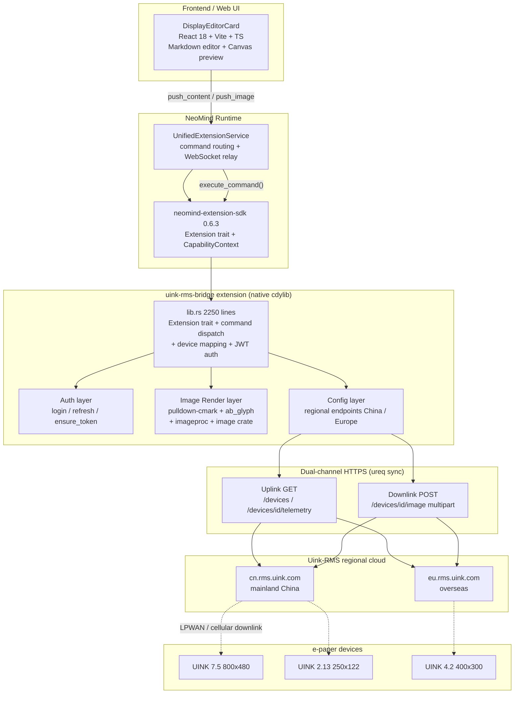
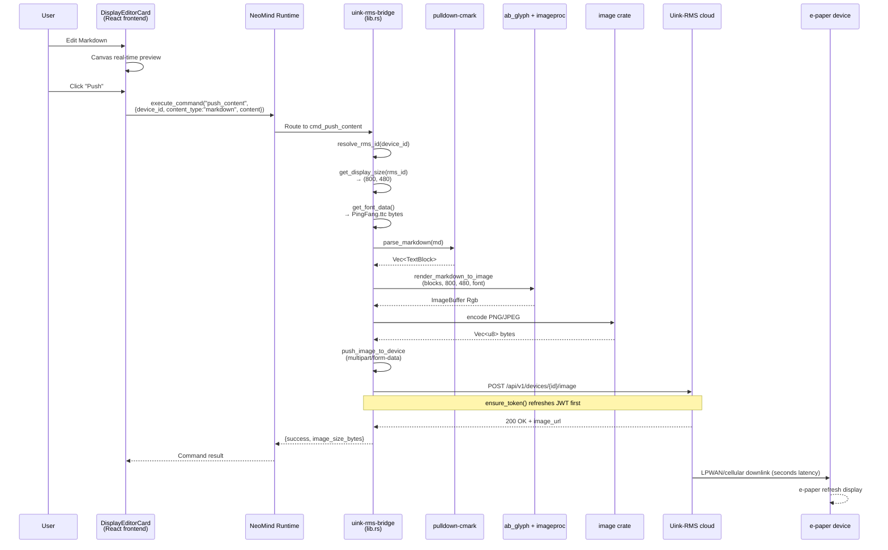

# #5 uink-rms-bridge: Production-Verified Vendor Bridge

## 1 Case Background

**uink-rms-bridge** is the **production-verified vendor-proprietary protocol bridge** case in the NeoMind ecosystem. Uink-RMS is a cloud management platform for e-paper (electronic paper / e-ink) display devices: devices connect to the vendor cloud over LPWAN / cellular networks, and the cloud exposes a REST API for third-party integration. uink-rms-bridge enables NeoMind to do three things: (1) register an e-paper device template on the Uink-RMS platform (`device_type = "uink_epaper"`, written once via the `device_template_register` capability on the extension side); (2) periodically pull device telemetry (battery percentage, signal strength in dBm, temperature, refresh count); (3) convert user-edited Markdown / plain text / images to JPEG and push them to the e-paper screen for display refresh. The current version is `2.7.6`, with the core implementation concentrated in a single [`src/lib.rs`](https://github.com/camthink-ai/NeoMind-Extensions/blob/main/extensions/uink-rms-bridge/src/lib.rs) file totaling 2250 lines, plus the [`DisplayEditorCard`](https://github.com/camthink-ai/NeoMind-Extensions/blob/main/extensions/uink-rms-bridge/frontend/) React + TypeScript frontend component (entrypoint `uink-rms-bridge-components.umd.cjs`).

**Contrast with [Case #4 onvif-bridge](./4-onvif-bridge.md) (the core narrative axis of this case)**: onvif-bridge is a **standard protocol bridge** (ONVIF is an open specification, universal for any Profile S camera), while uink-rms-bridge is a **vendor-proprietary protocol bridge** (the Uink-RMS cloud API is a closed private interface, only usable with Uink's own devices). The two represent fundamentally different integration strategies in the NeoMind ecosystem: standard protocol bridging follows the "LAN UDP/HTTP direct-to-device + device-level WS-Security auth" path with low evolution risk (standards are stable) and no external cloud dependency; vendor-proprietary bridging follows the "public HTTPS via vendor cloud relay + account-level JWT auth" path with high evolution risk (vendor API v1.0.1 may change) and strong dependency on Uink-RMS cloud availability. Understanding this contrast is key to choosing a NeoMind integration strategy — this series calls #4 / #5 the "bridge twins."

**Three pain points drove this extension's design**: (1) The Uink-RMS API is **cloud-relayed** — refreshing an e-paper screen takes seconds (via LPWAN / cellular downlink), so it cannot be controlled in real-time like a normal IoT device, and the UI layer must manage latency expectations; (2) **Markdown → image rendering must happen on the extension side** — Uink-RMS's `POST /api/v1/devices/{id}/image` only accepts JPEG/PNG binary, not text formats, so the entire pipeline of pulldown-cmark parsing + ab_glyph font rendering + imageproc drawing + image crate JPEG encoding is handled by Rust; (3) The vendor cloud has **regional partitioning** — mainland China users must use `https://cn.rms.uink.com`, overseas users use `https://eu.rms.uink.com`, accounts are not interchangeable, and the extension must support regional routing.

**Target audience**: (1) Integrators connecting to third-party vendor cloud platforms (especially IoT clouds, display clouds) — you will see the complete closed loop from JWT login to device registration, telemetry pulling, and image push; (2) Developers wanting to understand how NeoMind bridges a "closed system" into the unified device model — uink-rms-bridge is the textbook example of the "wrap a vendor API" pattern. **What "production-verified" means concretely**: this extension went through at least 4 rounds of targeted fixes ([`f4c73cd`](https://github.com/camthink-ai/NeoMind-Extensions/commit/f4c73cd) initial release, [`261d8e6`](https://github.com/camthink-ai/NeoMind-Extensions/commit/261d8e6) flip and data source, [`39587eb`](https://github.com/camthink-ai/NeoMind-Extensions/commit/39587eb) SDK upgrade, [`422ba8d`](https://github.com/camthink-ai/NeoMind-Extensions/commit/422ba8d) security hardening), regression tested across 6 versions (v2.7.0 → v2.7.6), and is currently deployed in production.

---

## 2 Architecture Overview

uink-rms-bridge is a **full-stack vendor bridge extension** — the backend is a 2250-line `lib.rs` (Rust cdylib), and the frontend is `DisplayEditorCard` (React 18 + Vite + TypeScript UMD bundle). The backend communicates with the Uink-RMS regional cloud via synchronous HTTPS using ureq, and the frontend provides users with Markdown editing + real-time preview canvas. At runtime, after NeoMind Runtime loads the `.nep` package, the extension exposes 7 commands (sync_devices / list_devices / push_content / push_image / get_display_size / get_display / refresh_auth) through the Extension trait, with command routing dispatched centrally by [`execute_command`](https://github.com/camthink-ai/NeoMind-Extensions/blob/main/extensions/uink-rms-bridge/src/lib.rs#L1445-L1475). All runtime state is protected by `parking_lot::RwLock`, including `config: RwLock<UinkConfig>`, `access_token: RwLock<Option<String>>`, and the device ID mapping `neo_to_rms_id: RwLock<HashMap<String, String>>`.

### Module responsibility breakdown (note: large single file)

Note that the `src/` directory contains **only `lib.rs`** (verified with `ls src/`: only `lib.rs`, no backups, no other `.rs` files). This is in stark contrast to [Case #4 onvif-bridge](./4-onvif-bridge.md) which splits into 5 files. The table below lists logical sections within lib.rs:

| Logical layer | Line range | Responsibility |
|---------------|------------|----------------|
| API Types (v1.0.1 compliant) | [L40-L159](https://github.com/camthink-ai/NeoMind-Extensions/blob/main/extensions/uink-rms-bridge/src/lib.rs#L40-L159) | RmsLoginRequest/Response, RmsDeviceInfo, RmsTelemetryData, RmsImageResponse serde structs |
| Display resolution mapping | [L166-L183](https://github.com/camthink-ai/NeoMind-Extensions/blob/main/extensions/uink-rms-bridge/src/lib.rs#L166-L183) | `model_to_resolution()` maps UINK models (2.13/2.9/4.2/7.5/10.2/13.3) to pixels |
| System font loading | [L189-L225](https://github.com/camthink-ai/NeoMind-Extensions/blob/main/extensions/uink-rms-bridge/src/lib.rs#L189-L225) | macOS PingFang / Linux Noto CJK font path search |
| Markdown → Image rendering | [L230-L640](https://github.com/camthink-ai/NeoMind-Extensions/blob/main/extensions/uink-rms-bridge/src/lib.rs#L230-L640) | pulldown-cmark parsing, wrap_line, render_text_to_image, render_markdown_to_image |
| Display API responses | [L658-L682](https://github.com/camthink-ai/NeoMind-Extensions/blob/main/extensions/uink-rms-bridge/src/lib.rs#L658-L682) | RmsDisplayResponse / RmsDisplayInfo |
| UinkConfig + regional endpoints | [L685-L721](https://github.com/camthink-ai/NeoMind-Extensions/blob/main/extensions/uink-rms-bridge/src/lib.rs#L685-L721) | `api_base_url()` switches China / Europe / Custom |
| UinkRmsBridge main + Auth | [L723-L871](https://github.com/camthink-ai/NeoMind-Extensions/blob/main/extensions/uink-rms-bridge/src/lib.rs#L723-L871) | struct definition, login / refresh / ensure_token / auth_header |
| Extension trait impl | [L1136-L1543](https://github.com/camthink-ai/NeoMind-Extensions/blob/main/extensions/uink-rms-bridge/src/lib.rs#L1136-L1543) | metadata / metrics / commands / execute_command / produce_metrics / configure |
| Command impls + FFI export | [L1545-L2101](https://github.com/camthink-ai/NeoMind-Extensions/blob/main/extensions/uink-rms-bridge/src/lib.rs#L1545-L2101) | cmd_sync_devices / cmd_push_content / cmd_push_image / neomind_export! |
| Unit tests | [L2107-L2250](https://github.com/camthink-ai/NeoMind-Extensions/blob/main/extensions/uink-rms-bridge/src/lib.rs#L2107-L2250) | metadata, commands, config, api_base_url, model_to_resolution, parse_markdown |

### Architecture comparison with #4 onvif-bridge

| Architecture dimension | [#4 onvif-bridge](./4-onvif-bridge.md) | **#5 uink-rms-bridge** |
|------------------------|------------------------------------------|--------------------------|
| Protocol type | Standard (ONVIF open spec) | **Vendor-proprietary** (Uink-RMS private cloud API v1.0.1) |
| Integration path | LAN UDP/HTTP direct to device | **Public HTTPS via vendor cloud relay** |
| Authentication | WS-Security UsernameToken (device-level) | **JWT login + refresh token (account-level)** |
| Vendor dependency | None (any ONVIF Profile S device) | **Strong dependency on Uink-RMS cloud availability** |
| Evolution risk | Low (standard is stable) | **High (API v1.0.1, vendor may change)** |
| File organization | 5 files (lib/discovery/soap_client/ptz/types) | **1 file lib.rs (2250 lines)** |
| Frontend component | None (pure backend) | **Has DisplayEditorCard** |
| Rendering responsibility | None (only returns RTSP URL) | **Markdown → JPEG full pipeline** |

---

## 3 Core Implementation

### 3.1 JWT Auth Chain (login → refresh → retry + backoff)

Uink-RMS uses account-level JWT authentication (unlike onvif-bridge's device-level WS-Security). Auth state is managed by three fields: `access_token: RwLock<Option<String>>`, `refresh_token: RwLock<Option<String>>`, `token_expiry: AtomicI64`. The core entry point is [`ensure_token`](https://github.com/camthink-ai/NeoMind-Extensions/blob/main/extensions/uink-rms-bridge/src/lib.rs#L794-L823): first checks `token_expiry - now > 120` (refresh 2 minutes early), and if expired, tries `refresh()` first (exchange refresh_token for a new access_token), falling back to `login()` (email + password re-login) on failure. The key design is **login failure backoff** — `last_login_failure_ts: AtomicI64` records the last failure time, and retries are suppressed for 5 minutes (to avoid hammering the RMS server on wrong credentials). The login function subtracts 120 seconds from `expires_in` as the local expiry, leaving a refresh window.

### 3.2 Regional Endpoint Routing (UinkConfig::api_base_url)

[`UinkConfig`](https://github.com/camthink-ai/NeoMind-Extensions/blob/main/extensions/uink-rms-bridge/src/lib.rs#L685-L721) is the extension's sole configuration struct, containing `server_region: String` (enum China / Europe / Custom), `custom_server_url: String`, `email`, `password`, `sync_interval_secs` (default 300), and `poll_interval_secs` (default 60). The `api_base_url()` method does a simple match: `"China" => "https://cn.rms.uink.com"`, `"Europe" => "https://eu.rms.uink.com"`, otherwise uses `custom_server_url`. This bakes the regional selection into config, so users just pick from a dropdown in the UI to switch. The default region is China (see `impl Default`).

### 3.3 Markdown → Image Rendering Pipeline (pulldown-cmark + ab_glyph + imageproc)

This is the most complex part of the extension, about 400 lines of code (L230-L640). The pipeline has four steps: (1) [`parse_markdown`](https://github.com/camthink-ai/NeoMind-Extensions/blob/main/extensions/uink-rms-bridge/src/lib.rs#L248-L376) uses pulldown-cmark 0.12 to parse Markdown into `Vec<TextBlock>` (Heading / Paragraph blocks, with Paragraph containing Plain / Bold / Code inline parts); (2) [`load_system_font_data`](https://github.com/camthink-ai/NeoMind-Extensions/blob/main/extensions/uink-rms-bridge/src/lib.rs#L215-L225) loads fonts from macOS PingFang or Linux Noto Sans CJK paths (`eprintln!("[uink-rms-bridge] Loaded font: {}", path)` at L218); (3) [`render_markdown_to_image`](https://github.com/camthink-ai/NeoMind-Extensions/blob/main/extensions/uink-rms-bridge/src/lib.rs#L475-L640) iterates over blocks, using ab_glyph's `PxScale` + imageproc's `draw_text_mut` to draw line by line onto `ImageBuffer::<Rgb<u8>>` — the heading scale rule is documented at [L504 comment](https://github.com/camthink-ai/NeoMind-Extensions/blob/main/extensions/uink-rms-bridge/src/lib.rs#L504): "H1 = 2.0x base, decreasing by 0.2 per level" (H1=2.0x, H2=1.8x, H3=1.6x...); (4) `wrap_line` does CJK + Latin mixed auto-wrapping (CJK characters can break anywhere, Latin accumulates by word width). The final result is encoded as PNG bytes using the image crate.

### 3.4 Image Push (push_image_to_device)

The rendered PNG/JPEG bytes are POSTed via [`push_image_to_device`](https://github.com/camthink-ai/NeoMind-Extensions/blob/main/extensions/uink-rms-bridge/src/lib.rs#L1445-L1523) as `multipart/form-data` to `POST /api/v1/devices/{id}/image`. If the user passes `dither_algorithm` / `resize_mode` / `padding_color` parameters, it goes through the processing endpoint; otherwise it uses the raw endpoint to push the original image directly. Supported dithering algorithms include 8 options (ordered / floyd-steinberg / atkinson / burkes / sierra / stucki / jarvis-judice-ninke / threshold), and resize modes include fit / cover / fill. The image size limit is 10MB.

### 3.5 Device Registration and ID Mapping (uink_epaper device template)

On first sync, the extension registers the `uink_epaper` device template via the `device_template_register` capability (including 14 metrics: battery / temperature / signal_strength / refresh_count / online_status / sn / model, etc.). Then [`fetch_rms_devices`](https://github.com/camthink-ai/NeoMind-Extensions/blob/main/extensions/uink-rms-bridge/src/lib.rs#L877) paginates the RMS device list, and for each device generates `neo_device_id = format!("uink-{}", device.device_id)` and calls `device_register`. The key ID mapping is stored in `neo_to_rms_id: RwLock<HashMap<String, String>>` ([L730](https://github.com/camthink-ai/NeoMind-Extensions/blob/main/extensions/uink-rms-bridge/src/lib.rs#L730)) — all push commands first translate the NeoMind device_id back to the RMS device_id via `resolve_rms_id()`.

### 3.6 configure() Hot Reload

[`configure`](https://github.com/camthink-ai/NeoMind-Extensions/blob/main/extensions/uink-rms-bridge/src/lib.rs#L1523-L1540) accepts a JSON config, writes it into the `UinkConfig` RwLock, then **actively clears access_token / refresh_token / token_expiry** — this forces the next operation to re-login, avoiding using a stale token against a new regional endpoint. It also resets `template_registered` and `last_sync_ts` so auto-sync runs immediately with the new config on the next `produce_metrics` cycle.

### 3.7 Image Push Sequence Diagram

---

## 4 Key Design Decisions

### Decision 1: ureq synchronous HTTP (not reqwest async)

**We chose ureq v2 (synchronous)**; the alternative was reqwest + tokio multi-thread runtime; the rationale is in the [`Cargo.toml` L23 comment](https://github.com/camthink-ai/NeoMind-Extensions/blob/main/extensions/uink-rms-bridge/Cargo.toml#L23): "Use sync HTTP client to avoid Tokio runtime issues in dynamic libraries". When a cdylib is loaded via `dlopen` by the NeoMind host process, if the extension internally creates its own tokio runtime, it conflicts with the host process's existing runtime (panic "Cannot start a runtime from within a runtime"). ureq is purely synchronous, and wrapping it with `block_on` in the `execute_command` async context does not nest runtimes. Tokio still appears in dependencies ([L26-L27](https://github.com/camthink-ai/NeoMind-Extensions/blob/main/extensions/uink-rms-bridge/Cargo.toml#L26-L27)), but only with the `rt + sync` feature — this is needed by the SDK's FFI macro for the `RwLock` wrapper, not for async IO. This decision is consistent with [Case #4 onvif-bridge](./4-onvif-bridge.md) (cross-case echo: all native cdylib extensions use synchronous HTTP).

### Decision 2: Markdown rendering on the extension side in Rust (not frontend canvas / not cloud-side)

**We chose extension-side Rust rendering** (pulldown-cmark + ab_glyph + imageproc); alternative A was frontend Canvas API rendering then uploading base64; alternative B was sending Markdown text to Uink-RMS cloud for server-side rendering. Rationale: (1) e-paper devices have extremely limited compute / bandwidth, LPWAN downlink only accepts image binary, and Uink-RMS API `POST /image` also only accepts JPEG/PNG, not text formats — alternative B is infeasible; (2) frontend Canvas rendering depends on browser fonts, which vary across user machines, making rendering results unpredictable, and offloading rendering CPU to the frontend is worse than handling it on the extension side; (3) Rust-side rendering with ab_glyph + embedded system fonts (PingFang / Noto CJK) gives controllable fonts, cross-platform consistency, and high performance. The tradeoff is 400 extra lines of code (L230-L640).

### Decision 3: SDK remote crate instead of workspace path (commit 39587eb)

**We chose `neomind-extension-sdk = "0.6.3"` (crates.io remote crate)**; the alternative was workspace path dependency (`neomind-extension-sdk = { path = "../../sdk" }`); the rationale is in commit [`39587eb`](https://github.com/camthink-ai/NeoMind-Extensions/commit/39587eb): "chore: update neomind-extension-sdk to 0.6.3, use remote crate for uink-rms-bridge". The uink-rms-bridge `.nep` package may be distributed independently to customers (without the main repo source), and workspace path dependencies cannot compile outside the monorepo. The remote crate decouples the extension's build from the main repo, at the cost of requiring SDK upgrades to be published to crates.io before the extension can consume them (an extra release step).

### Decision 4: Hardcoded regional endpoints China / Europe (not fully custom)

**We chose to hardcode two regions + Custom fallback** (see [L713-L720](https://github.com/camthink-ai/NeoMind-Extensions/blob/main/extensions/uink-rms-bridge/src/lib.rs#L713-L720)); the alternative was to provide only a `custom_server_url` field for users to fill in completely. Rationale: (1) Uink-RMS currently has only cn / eu regions, and a dropdown is more user-friendly than manually typing a URL, reducing configuration cognitive load; (2) hardcoded endpoints prevent users from mistyping URLs (missing a `/`, adding `/api/v1`, etc.); (3) the `Custom` option and `custom_server_url` field are retained as extension points — if Uink opens new regions or customers self-host RMS instances, users can still fill in a full URL. The tradeoff is that adding a new Uink region requires a code change and new release (but this is rare).

### Decision 5: `RwLock<HashMap>` instead of DashMap / SQLite

**We chose `RwLock<HashMap<String, String>>`** ([L730](https://github.com/camthink-ai/NeoMind-Extensions/blob/main/extensions/uink-rms-bridge/src/lib.rs#L730)); alternative A was DashMap (lock-free concurrent HashMap); alternative B was persisted SQLite. Rationale: (1) a single customer's e-paper device count is typically tens to hundreds, HashMap reads/writes are O(1), performance is not a bottleneck; (2) DashMap adds an extra dependency and API complexity with no benefit at this scale; (3) SQLite persistence brings IO overhead and file locking issues, while device mappings can be rebuilt from RMS after each sync, no persistence needed. parking_lot::RwLock performs better than std::sync::RwLock and doesn't poison, making it the unified choice for NeoMind extensions.

### Decision 6: Frontend Canvas flip support (commit 261d8e6)

**We chose to add flipH / flipV toggles in the frontend Canvas editor** (see commit [`261d8e6`](https://github.com/camthink-ai/NeoMind-Extensions/commit/261d8e6) changes to `Canvas.tsx`); the alternative was flipping on the Rust side using `image::imageops::flip_horizontal`. Rationale: some Uink e-paper devices have reversed hardware mounting orientation (upside-down / sideways), requiring mirrored display content. Putting this flip in the frontend Canvas layer lets users see the flipped result while editing (WYSIWYG), which is more intuitive than backend flipping at push time. The commit also added safe area indicator lines (`EXPORT_PAD_RATIO = 0.03`) and data source binding (`dataSource` prop).

---

## 5 Integration with NeoMind Core

uink-rms-bridge integrates with the NeoMind core at four levels:

**Command system**: The extension registers 7 commands (see [`commands()` L1220-L1443](https://github.com/camthink-ai/NeoMind-Extensions/blob/main/extensions/uink-rms-bridge/src/lib.rs#L1220-L1443)), which appear as Agent-callable tools in the NeoMind frontend. A user can tell the Agent "change the conference room e-paper to a welcome message," and the Agent will invoke the `push_content` command. Command parameters are declared with `ParameterDefinition` specifying types and constraints (e.g., `content_type` options are `["text", "markdown", "image"]`), and the frontend auto-renders forms based on these.

**Device type integration**: The extension registers the `uink_epaper` device template via the `device_template_register` capability (see [`auto_sync` L1552-L1606](https://github.com/camthink-ai/NeoMind-Extensions/blob/main/extensions/uink-rms-bridge/src/lib.rs#L1552-L1606)). The template declares 14 metrics (battery / temperature / signal_strength / refresh_count / online_status / last_sync / sn / model / activation_status / alarm_status / firmware_version / hardware_version / preview_url / preview_thumbnail_url) and 3 device-level commands (push_content / push_image / refresh_status). After registration, Uink devices appear alongside cameras and sensors in the unified NeoMind device panel.

**Metric production**: [`produce_metrics`](https://github.com/camthink-ai/NeoMind-Extensions/blob/main/extensions/uink-rms-bridge/src/lib.rs#L1477-L1521) returns 4 extension-level metrics (sync_count / push_count / device_count / error_count), accumulated with `AtomicI64`. Device-level telemetry (battery, etc.) is written directly to the NeoMind device metric store via the `device_metrics_write` capability, bypassing the produce_metrics path — this allows the frontend device panel to see each e-paper's battery and signal in real-time.

**Frontend component DisplayEditorCard**: This is the key difference between uink-rms-bridge and [Case #4 onvif-bridge](./4-onvif-bridge.md) (which has no frontend). `DisplayEditorCard` is a 380x420px interactive card containing a Canvas editor (supporting text / image / rectangle element drag-and-drop layout), a Markdown editing modal, and real-time preview. The component is built with Vite into `uink-rms-bridge-components.umd.cjs` and dynamically loaded by NeoMind Runtime. After binding a device data source, the user edits content and clicks push, and the component calls the `push_content` command to send the Canvas-exported base64 image or Markdown text to the extension. Commit [`261d8e6`](https://github.com/camthink-ai/NeoMind-Extensions/commit/261d8e6) added flip support and data source binding to this component.

**configure() and config panel integration**: The extension declares 6 configuration parameters (server_region / custom_server_url / email / password / sync_interval_secs / poll_interval_secs), and the NeoMind config panel auto-renders the form based on `ParameterDefinition`. After the user modifies config, Runtime calls `configure()`, the extension updates the config in the RwLock and clears tokens, and the next `produce_metrics` cycle triggers auto-sync with the new credentials.

---

## 6 Testing & Verification

### Unit Tests (inlined in lib.rs L2107-L2250)

The extension inlines 6 unit tests in the [`src/lib.rs` test module](https://github.com/camthink-ai/NeoMind-Extensions/blob/main/extensions/uink-rms-bridge/src/lib.rs#L2107-L2250):

| Test name | What it verifies |
|-----------|------------------|
| `test_extension_metadata` | metadata().id == "uink-rms-bridge" |
| `test_commands_count` | commands().len() == 7, includes sync_devices / list_devices / push_content / push_image / get_display_size / refresh_auth / get_display |
| `test_config_parameters` | config_parameters has 6 entries, first is server_region, options include China / Europe |
| `test_api_base_url` | China → cn.rms.uink.com, Europe → eu.rms.uink.com, Custom → custom URL (trims trailing /) |
| `test_model_to_resolution` | UINK-7.5 → (800,480), UINK-2.9 → (296,128), UNKNOWN → None |
| `test_parse_markdown` | "# Title\n\nParagraph\n\n- item 1" parses into Heading + Paragraph + list items |

### Rendering Regression Test Strategy

Markdown → Image rendering is the most bug-prone part of the extension (font coverage, CJK wrapping, heading scaling). Recommended regression cases: (1) pure Chinese long text wrapping (verify CJK anywhere-break); (2) mixed Chinese-English text (verify Latin words don't split, CJK can); (3) H1-H6 six heading scale ratios (2.0x / 1.8x / 1.6x / 1.4x / 1.2x / 1.0x); (4) bold text double-strike rendering; (5) emoji characters (current font may not cover them, verify degradation behavior); (6) empty Markdown / overly long Markdown boundary cases. `test_parse_markdown` only verifies AST structure, not rendered pixels — pixel-level regression requires a fixed font + golden image comparison.

### What "Production-Verified" Means Concretely

This extension's "production verification" was not done in one pass, but through iterative verification across 6 versions (v2.7.0 → v2.7.6): (1) **Cross-version regression** — every version bump ([`24b47d2`](https://github.com/camthink-ai/NeoMind-Extensions/commit/24b47d2) v2.7.0, [`ff762aa`](https://github.com/camthink-ai/NeoMind-Extensions/commit/ff762aa) v2.7.1, [`cd075d5`](https://github.com/camthink-ai/NeoMind-Extensions/commit/cd075d5) v2.7.2, [`8e81400`](https://github.com/camthink-ai/NeoMind-Extensions/commit/8e81400) v2.7.4, [`d2db401`](https://github.com/camthink-ai/NeoMind-Extensions/commit/d2db401) v2.7.5, [`1e9a1f1`](https://github.com/camthink-ai/NeoMind-Extensions/commit/1e9a1f1) v2.7.6) runs the full unit test suite + manual E2E; (2) **Multi-region testing** — both cn.rms.uink.com and eu.rms.uink.com endpoints verified for JWT login + device list + image push full chain; (3) **Real device refresh testing** — Markdown pushed to UINK 7.5 (800x480) and UINK 2.13 (250x122) devices, confirming e-paper screens actually refresh and display correctly.

### Manual E2E Flow

The complete manual verification flow: (1) configure server_region + email + password; (2) call `sync_devices` and wait for device list to return; (3) call `list_devices` to confirm device registration succeeded; (4) call `push_content` to push a Markdown snippet (with heading + list + bold); (5) wait 5-30 seconds to observe e-paper screen refresh (LPWAN latency); (6) call `get_display` to pull preview_url confirming push succeeded; (7) unplug device power for 5 minutes, call `refresh_status` to confirm offline status is correctly reported.

---

## 7 Deployment / Ops / Troubleshooting

### 5-Platform .nep Distribution

The extension declares 5 build targets in [`metadata.json`](https://github.com/camthink-ai/NeoMind-Extensions/blob/main/extensions/uink-rms-bridge/metadata.json): darwin-aarch64 (macOS Apple Silicon), darwin-x86_64 (macOS Intel), linux-x86_64, linux-aarch64, windows-x86_64. Each platform compiles into a separate `.nep` file (native extension package), distributed via GitHub Releases (`https://github.com/camthink-ai/NeoMind-Extensions/releases/download/v2.7.6/uink-rms-bridge-2.7.6-{platform}.nep`). NeoMind Runtime auto-downloads the corresponding `.nep` based on the current platform at startup and loads it via `dlopen`.

### Production Evolution History (highlight: this extension has the most "evolution traces")

| Version | Commit | Key changes |
|---------|--------|-------------|
| Initial | [`f4c73cd`](https://github.com/camthink-ai/NeoMind-Extensions/commit/f4c73cd) | First release: e-paper display editor with canvas, text and image push. Also fixed Windows marketplace 404 (platform suffix windows_x86_64 vs windows_amd64 mismatch) |
| - | [`261d8e6`](https://github.com/camthink-ai/NeoMind-Extensions/commit/261d8e6) | Frontend Canvas flipH/flipV support + safe area indicator + DisplayEditorCard data source binding |
| - | [`39587eb`](https://github.com/camthink-ai/NeoMind-Extensions/commit/39587eb) | SDK migrated from workspace path to crates.io remote crate 0.6.3 (decoupling for independent distribution) |
| v2.7.0 | [`24b47d2`](https://github.com/camthink-ai/NeoMind-Extensions/commit/24b47d2) | Version bump, updated metadata.json and index.json |
| v2.7.1 | [`ff762aa`](https://github.com/camthink-ai/NeoMind-Extensions/commit/ff762aa) | Full version sync to 2.7.1 |
| - | [`422ba8d`](https://github.com/camthink-ai/NeoMind-Extensions/commit/422ba8d) | Security hardening (JWT auth chain strengthening), also added BACnet/ONVIF/OPC-UA bridges |
| v2.7.2 | [`cd075d5`](https://github.com/camthink-ai/NeoMind-Extensions/commit/cd075d5) | Version bump |
| v2.7.4 | [`8e81400`](https://github.com/camthink-ai/NeoMind-Extensions/commit/8e81400) | Version bump (OCR batch recognition optimization included) |
| v2.7.5 | [`d2db401`](https://github.com/camthink-ai/NeoMind-Extensions/commit/d2db401) | release |
| v2.7.6 | [`1e9a1f1`](https://github.com/camthink-ai/NeoMind-Extensions/commit/1e9a1f1) | Current version |

### Vendor Cloud Dependency Risk

Uink-RMS service outage = extension completely unusable (cannot login, cannot push, cannot pull telemetry). Recommended ops monitoring: check HTTPS reachability of cn/eu endpoints (`GET /api/v1/health` or similar), set up alerts. The extension's own `error_count` metric and `last_error` field can reflect recent failure causes, but this is passive — the extension does not proactively notify when the cloud is unreachable.

### Source Code Hygiene Anti-Pattern: Single File 2250 Lines

uink-rms-bridge's `src/` directory contains **only `lib.rs`, totaling 2250 lines** (verified with `ls src/`: only `lib.rs`, no `discovery.rs` / `soap_client.rs` splits, no `.bak` backups). This is an **anti-pattern of single-file mega-extensions** — 2250 lines in one file hurts readability, and new contributors struggle to locate code (finding `cmd_push_content` requires scrolling to L1884). Contrast with [Case #4 onvif-bridge](./4-onvif-bridge.md) which splits the protocol into 5 files (lib.rs 1646 lines + discovery.rs 211 lines + soap_client.rs 516 lines + ptz.rs 214 lines + types.rs 78 lines), each with single responsibility and manageable line count.

**When to split? When is a single file acceptable?** uink-rms-bridge's rationale for a single file: all its logic revolves around a **single vendor cloud API** (Uink-RMS v1.0.1), where auth / device / image / display are just different endpoints of the same API, highly cohesive, and splitting would increase cross-file navigation cost. While onvif-bridge is **multiple independent protocol stacks** (WS-Discovery is UDP multicast, SOAP is HTTP, PTZ is command encapsulation), naturally separable. Rule of thumb: if modules share little state and few types (like WS-Discovery and SOAP), split; if all modules revolve around the same external API's different endpoints (like uink's auth + device + image), a single file is acceptable, but use `// ===` comment dividers (this extension does, see [L40](https://github.com/camthink-ai/NeoMind-Extensions/blob/main/extensions/uink-rms-bridge/src/lib.rs#L40), [L161](https://github.com/camthink-ai/NeoMind-Extensions/blob/main/extensions/uink-rms-bridge/src/lib.rs#L161), [L231](https://github.com/camthink-ai/NeoMind-Extensions/blob/main/extensions/uink-rms-bridge/src/lib.rs#L231), etc.).

### Troubleshooting Table

| Symptom | Possible cause | Troubleshooting steps |
|---------|----------------|----------------------|
| JWT 401 Unauthorized | access_token expired and refresh failed | Check `error_count` metric; check stderr `[uink-rms-bridge] Token refresh failed`; confirm email/password is correct; confirm server_region matches account region (cn account cannot login to eu) |
| Empty device list | sync not executed or no devices under RMS account | Call `sync_devices` manually; check if `sync_count` is increasing; login to Uink-RMS Web to confirm devices exist under account |
| Image orientation flipped | Device hardware mounted in reversed orientation (upside-down/sideways) | Enable flipH / flipV in DisplayEditorCard's Canvas editor (feature added in commit `261d8e6`) |
| Markdown rendering missing characters | System missing CJK fonts | Check stderr `[uink-rms-bridge] Loaded font: /path`; macOS confirm `/System/Library/Fonts/PingFang.ttc` exists; Linux install `fonts-noto-cjk` |
| e-paper not refreshing | LPWAN downlink latency / device offline | Call `get_display` to check `is_pending` field; wait 30 seconds-5 minutes (LPWAN latency); confirm device `online_status` is online; check device logs in RMS Web console |
| Commands still using old region after configure | Token cache not cleared | Confirm extension version >= v2.7.1 (configure now proactively clears tokens); manually call `refresh_auth` to force re-login |

---

## 8 Further Reading & Summary

### Evolution Milestones

| Date | Commit | Milestone |
|------|--------|-----------|
| 2026-05-11 | [`f4c73cd`](https://github.com/camthink-ai/NeoMind-Extensions/commit/f4c73cd) | uink-rms-bridge initial release (Canvas editor + text/image push) |
| 2026-05-16 | [`261d8e6`](https://github.com/camthink-ai/NeoMind-Extensions/commit/261d8e6) | Canvas flip + data source binding + safe area |
| 2026-05-2x | [`39587eb`](https://github.com/camthink-ai/NeoMind-Extensions/commit/39587eb) | SDK 0.6.3 remote crate migration (decouple from workspace) |
| 2026-05-2x | [`24b47d2`](https://github.com/camthink-ai/NeoMind-Extensions/commit/24b47d2) | v2.7.0 version bump |
| 2026-06-xx | [`422ba8d`](https://github.com/camthink-ai/NeoMind-Extensions/commit/422ba8d) | Security hardening (JWT chain strengthening) |
| 2026-06-xx | [`1e9a1f1`](https://github.com/camthink-ai/NeoMind-Extensions/commit/1e9a1f1) | v2.7.6 current version |

### Full Comparison with #4 onvif-bridge (Bridge Twins)

| Dimension | [#4 onvif-bridge](./4-onvif-bridge.md) | **#5 uink-rms-bridge** |
|-----------|------------------------------------------|--------------------------|
| Protocol nature | Standard (ONVIF open spec) | Vendor-proprietary (Uink-RMS private API) |
| Communication path | LAN direct to device | Public via vendor cloud relay |
| Auth model | Device-level WS-Security UsernameToken | Account-level JWT + refresh token |
| Vendor dependency | None (standard protocol, multi-vendor) | Strong dependency (Uink devices only) |
| Network latency | Millisecond (LAN) | Seconds (LPWAN downlink) |
| API stability | High (ONVIF standard unchanged for years) | Medium (vendor API v1.0.1, may change) |
| Source organization | 5 files (separated concerns) | 1 file (logical cohesion) |
| Frontend component | None | DisplayEditorCard |
| Rendering responsibility | None (only returns URL) | Markdown→JPEG full pipeline |
| Testing difficulty | Medium (any ONVIF camera works) | High (needs Uink device + RMS account) |

### Bridge Strategy Decision Tree

When you need to connect an external device / system to NeoMind, evaluate in this order: (1) **Does the device have a standard protocol?** (ONVIF / OPC-UA / Modbus / MQTT / BACnet) — if yes, prefer standard protocol bridging (like [Case #4](./4-onvif-bridge.md)), which is stable, multi-vendor, and cloud-independent. (2) **Only vendor-proprietary API available?** — assess the vendor API's stability and documentation quality, and plan for API version tracking. (3) **Does the vendor API require cloud relay?** — if so, assess cloud SLA and regional availability, and design for token refresh and backoff. (4) **Is frontend interaction needed?** — if users need to edit content and preview (like e-paper content editing), you need a frontend component (DisplayEditorCard pattern); if it's just data collection and control (like camera PTZ), pure backend suffices.

### Recommended Reading Order

If you're new to NeoMind protocol bridging, read [Case #4 onvif-bridge](./4-onvif-bridge.md) first, then this case. #4 shows the engineering paradigm of "standard protocol bridging" (SOAP / WS-Discovery / WS-Security), and #5 shows the engineering paradigm of "vendor-proprietary bridging" (JWT / Markdown rendering / regional routing). After reading both, you'll understand the two fundamentally different integration strategies in the NeoMind ecosystem and their tradeoffs. Then continue to the [Case Overview](./0-overview.md) for the complete case matrix.

### Summary

uink-rms-bridge is the **only full-stack vendor-proprietary bridge extension** in the NeoMind ecosystem. Its engineering value: (1) it fully demonstrates the Rust implementation of the JWT auth chain (login → refresh → backoff); (2) it completes the Markdown → Image full pipeline rendering on the extension side (pulldown-cmark + ab_glyph + imageproc), a unique capability no other extension has; (3) it handles the vendor cloud's geographic partitioning through regional endpoint routing (cn / eu); (4) it provides a user-friendly content editing experience through the DisplayEditorCard frontend component. Its engineering lesson: 2250 lines in a single file is the boundary of readability, and if more RMS endpoints are added in the future (like alerts / logs), splitting should be considered.

---

*Last updated: 2026-06-23*
