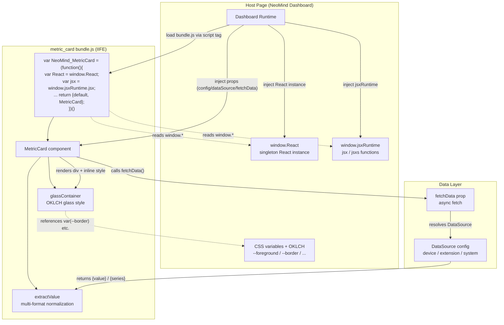
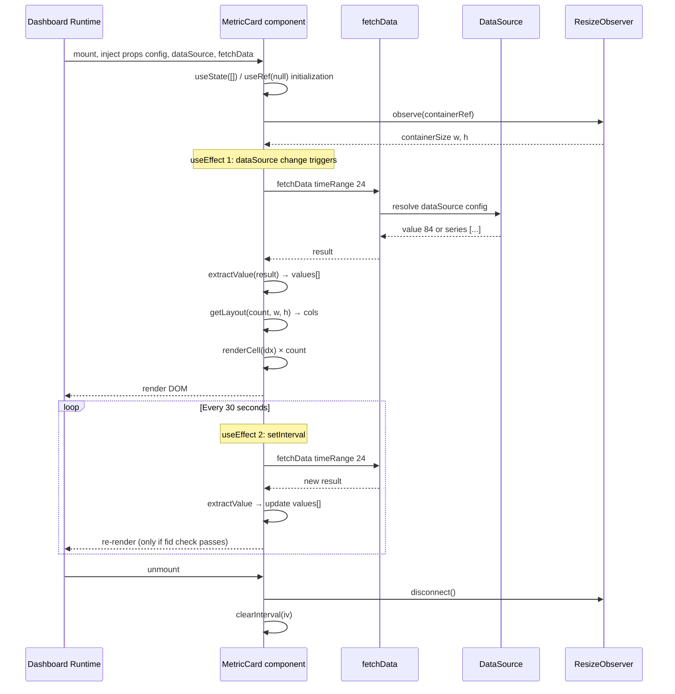

# metric_card: Introductory Dashboard Component

## Case Background

**metric_card** is the simplest "meaningful component" in the NeoMind dashboard component marketplace. It renders one or more numeric values (temperature, battery level, inference latency, detected object count) as a frosted-glass card with labels, units, and decimal precision. The entire component is 352 lines of hand-written IIFE JavaScript with zero build step — the shortest path for a newcomer to understand "what makes up a NeoMind component."

**What problem does it solve?** Dashboards need to display numeric metrics, but the data sources are diverse: device telemetry (`values.battery`), periodic extension output (`temperature_c`), system metrics (`cpu.usage`), or info properties (`name`). metric_card abstracts away these differences and provides a unified "numeric display card" — the user binds a data source and fills in label/unit, and the component automatically fetches, formats, and lays out the data.

**Target reader**: Developers who just finished the [Component API reference](../8-dashboard-component-dev.md) and want to build their first component. Requires React basics (hooks, JSX) but zero bundler knowledge — NeoMind components deliberately avoid Webpack/Vite/Rollup so anyone can write and ship directly.

**Where it fits**: metric_card is the canonical "display component." It does not bind to specific device types (`has_device_binding: false`), does not run AI inference, and does not render images/video. In later cases, 7 (ne101_camera) builds on metric_card's foundation with device binding, image canvas, and an AI processing pipeline. Master this case's 8 sections and you have the skeleton of every NeoMind component: IIFE injection, manifest contract, fetchData retrieval, OKLCH visual system.

**What you will learn**: Why NeoMind components use IIFE + `window.React` injection instead of ESM bundling; how `manifest.json`'s `size_constraints` / `has_data_source` / `config_schema` fields shape component behavior in the dashboard; how `extractValue()` normalizes across 5+ data formats; why OKLCH + CSS variables beat hardcoded hex colors; how `backdrop-filter` glass effects are implemented with inline style objects under a zero-build constraint.

---

## Architecture Overview

metric_card is a collaboration between three parts: the component bundle (IIFE, self-registering to `window.NeoMind_MetricCard`), the NeoMind dashboard runtime (host page providing React/jsxRuntime + `fetchData` injection + grid container), and data sources (device telemetry / extension metrics / system metrics). The diagram below shows the load sequence and dependency injection boundaries.



### Core Abstractions

| Abstraction | Location | Purpose |
|-------------|----------|---------|
| `manifest.json` | Component root | Declares component metadata, size constraints, data source capabilities, and config schema. The runtime reads this file to decide how to place the component in the grid and whether to show the data source binding panel. |
| IIFE + `window.*` injection | First 4 lines of `bundle.js` | The component does not bundle React; instead it reads the host page's pre-loaded instance from `window.React` / `window.jsxRuntime`. This guarantees a single React instance across the entire dashboard (preventing hooks from breaking across instances). |
| `extractValue()` | `bundle.js` L40-60 | Normalizes the 5+ formats returned by `fetchData()` (raw number, `{value: ...}`, `{series: [...]}`, boolean, string) into a directly displayable scalar. This is the key to the component working across data source types. |

---

## Implementation Walkthrough

### Directory Structure & Manifest Contract

```
components/metric_card/
├── manifest.json    # Component manifest (hand-maintained)
└── bundle.js        # 352 lines hand-written IIFE JavaScript (source, not compiled output)
```

> **Key insight**: `bundle.js` is named "bundle" but is **not the output of a bundler**. The NeoMind component marketplace deliberately requires hand-written IIFE — the file IS the source code, readable like any normal JS. Case 7 (ne101_camera) is 1972 lines and is still hand-written IIFE.

View full manifest: [`manifest.json`](https://github.com/camthink-ai/NeoMind-Dashboard-Components/blob/main/components/metric_card/manifest.json#L1-L49)

```json
// manifest.json L1-L30 (trimmed)
{
  "id": "metric_card",
  "name": { "en": "Metric Card", "zh": "指标卡片" },
  "description": {
    "en": "A frosted-glass metric card with adaptive layout and multi-data-source support",
    "zh": "毛玻璃效果指标卡片，自适应布局，支持多数据源绑定"
  },
  "icon": "BarChart3",
  "category": "display",
  "version": "1.7.0",
  "author": "NeoMind Team",
  "size_constraints": {
    "min_w": 2,
    "min_h": 2,
    "default_w": 3,
    "default_h": 2,
    "max_w": 6,
    "max_h": 4
  },
  "has_data_source": true,
  "max_data_sources": 12,
  "has_device_binding": false,
  "has_display_config": true,
  "has_actions": false,
  "config_schema": {
    "type": "object",
    "properties": {
      "metrics": {
        "type": "array",
```

[Source: manifest.json L1-L49](https://github.com/camthink-ai/NeoMind-Dashboard-Components/blob/main/components/metric_card/manifest.json#L1-L49)

**Why each field has this shape:**

- `size_constraints.min_w: 2` — One grid cell is too narrow to fit even a two-digit number + unit; two cells is the minimum for a "readable numeric card." The runtime prevents users from shrinking below 2 cells during drag-resize.
- `size_constraints.default_w: 3, default_h: 2` — The default size is large enough to show 3 slots in a row or one large + two small, striking a balance between "single metric" and "multi-metric" use cases.
- `size_constraints.max_w: 6, max_h: 4` — Caps the maximum size to prevent layout breakage. metric_card's `getLayout()` still lays out reasonably at 12 slots × 6 columns; beyond this size the value diminishes.
- `has_data_source: true` + `max_data_sources: 12` — Declares data source capability. `true` makes the dashboard show the data source binding panel; `12` aligns with `config_schema.metrics.maxItems`, allowing users to stack 12 metric slots in one card.
- `has_device_binding: false` — metric_card does not bind to a specific device type; it can consume any data source (device telemetry, extension metrics, system metrics all work). If set to `true`, the runtime requires the user to first select a device instance and additionally injects a `deviceContext` prop.
- `config_schema` — A JSON Schema that the runtime uses to auto-generate the configuration form. Each item in the `metrics` array has `label` / `unit` / `decimalPlaces`, corresponding one-to-one with the `config.metrics[i]` reads in `bundle.js`.

### IIFE Injection Pattern (Critical Design)

View source: [`bundle.js`](https://github.com/camthink-ai/NeoMind-Dashboard-Components/blob/main/components/metric_card/bundle.js#L1-L4) L1-4

```javascript
var NeoMind_MetricCard = (function () {
  var React = window.React;        // why window: host page already loaded React; read singleton
  var jsx = window.jsxRuntime.jsx; // why jsxRuntime: automatic runtime, no need to import React
  var jsxs = window.jsxRuntime.jsxs;
  // ... 350 lines of component logic ...
  return { default: MetricCard, MetricCard: MetricCard };
})();
```

[Source: bundle.js L1-L4](https://github.com/camthink-ai/NeoMind-Dashboard-Components/blob/main/components/metric_card/bundle.js#L1-L4)

**Why IIFE + `window.*` injection instead of ESM?**

The core constraint of the NeoMind component marketplace is: **components are distributed as drop-in bundles with no build step**. The user drops `bundle.js` into the marketplace, the runtime loads it via a `<script>` tag, and the component registers on `window.NeoMind_MetricCard`. This means:

1. **No `import`** — `<script>` tags do not support `import` syntax. Using ESM would require either `<script type="module">` (CORS / path resolution complexity) or requiring users to run a bundler first (violating the "drop-in" promise).
2. **No bundled React** — If every component ships its own React, loading 10 components produces 10 React instances, and hooks break across instances (`useContext` / `useRef` return undefined).
3. **Must use `window.React`** — The host page loads one React onto `window.React`, shared by all components. This is React's officially recommended "single instance via global" pattern.

**Rejected alternatives:**

| Alternative | Rejection reason |
|-------------|-----------------|
| ESM `import React from 'react'` | Requires bundler or `<script type="module">`, violates "drop-in" promise |
| Per-component bundled React | Multi-instance conflict, hooks fail across instances, bloat (+130KB each) |
| CDN React + UMD | Still needs bundler for JSX transform; blank screen when CDN unavailable |

`window.jsxRuntime` is React 17+'s "automatic JSX runtime." The traditional approach requires `import React from 'react'` to use JSX; the automatic runtime exposes `jsx()` / `jsxs()` as standalone functions, so the component only needs `var jsx = window.jsxRuntime.jsx` to render, further reducing dependence on the React namespace.

### Glass Container Design (OKLCH + CSS Variables)

View source: [`bundle.js`](https://github.com/camthink-ai/NeoMind-Dashboard-Components/blob/main/components/metric_card/bundle.js#L9-L18) L9-18

```javascript
// bundle.js L9-L18
var glassContainer = {
  background: 'linear-gradient(135deg, oklch(1 0 0 / 6%) 0%, oklch(0.75 0.06 270 / 5%) 40%, oklch(1 0 0 / 3%) 60%, oklch(0.75 0.06 200 / 4%) 100%)',
  backgroundSize: '300% 300%',
  animation: 'mc-shimmer 12s ease infinite',
  border: '1px solid var(--border)',           // why var: follows theme switch
  borderRadius: '12px',
  backdropFilter: 'blur(16px)',                // why 16px: core of glass effect, diffuses background
  WebkitBackdropFilter: 'blur(16px)',
  boxShadow: '0 1px 3px oklch(0 0 0 / 12%), inset 0 1px 0 oklch(1 0 0 / 6%)'
};
```

[Source: bundle.js L9-L18](https://github.com/camthink-ai/NeoMind-Dashboard-Components/blob/main/components/metric_card/bundle.js#L9-L18)

**Why OKLCH instead of hex / rgb?**

[OKLCH](https://oklch.com/) is a perceptually uniform color space, meaning "different hues with the same lightness value appear equally bright to the human eye." This has two practical benefits for component design:

1. **Native alpha channel** — `oklch(1 0 0 / 6%)` writes opacity directly, no `rgba()` conversion needed. metric_card's glass layer stacks 4 gradient colors with different opacities; OKLCH is more concise than `rgba()`.
2. **No jarring theme switches** — `glassContainer` references `var(--border)` for the border color, which automatically follows dark/light theme switches with zero code changes. Hardcoding `border: '1px solid #e5e7eb'` would make the border too bright in dark mode.

**Why inline style objects instead of CSS-in-JS / Tailwind?**

metric_card has no build step (see 3.2), so it cannot use Tailwind classes (requires PostCSS compilation) or CSS-in-JS (requires a runtime library). Inline style objects are the zero-dependency solution. The trade-off is that dynamic values (like `opacity` percentages) cannot use Tailwind's `/10` syntax and must be written as `'oklch(1 0 0 / 10%)'`. STYLE_GUIDE 1 explicitly warns about this.

### `extractValue()` — Multi-Format Data Normalization (Core Engineering Insight)

View source: [`bundle.js`](https://github.com/camthink-ai/NeoMind-Dashboard-Components/blob/main/components/metric_card/bundle.js#L40-L60) L40-60

```javascript
// bundle.js L40-L60
function extractValue(result) {
  if (result == null) return null;                    // why null: empty value does not render a slot
  if (typeof result === 'number') return result;      // raw number (backward compat)
  if (typeof result === 'string') return result;      // string displayed directly
  if (typeof result === 'boolean') return result ? 'Yes' : 'No';
  if (result.value != null) {                         // why .value: fetchData standard format
    if (typeof result.value === 'number') return result.value;
    if (typeof result.value === 'string') return result.value;
    if (typeof result.value === 'boolean') return result.value ? 'Yes' : 'No';
  }
  if (result.series != null && Array.isArray(result.series) && result.series.length) {
    var last = result.series[result.series.length - 1];  // why last: take the newest point
    if (typeof last === 'number') return last;
    if (typeof last === 'string') return last;
    if (last && last.value != null) {
      if (typeof last.value === 'number') return last.value;
      if (typeof last.value === 'string') return last.value;
    }
  }
  return null;
}
```

[Source: bundle.js L40-L60](https://github.com/camthink-ai/NeoMind-Dashboard-Components/blob/main/components/metric_card/bundle.js#L40-L60)

**Why handle 5+ input formats?**

This is the core contract tension of the NeoMind ecosystem: **the metric types produced by extensions are loosely typed**. A `detect` extension might return `{value: 3}` (detected object count); a `recognize_image` extension might return `{value: "hello"}` (OCR text); a `timeseries` data source returns `{series: [{timestamp, value}, ...]}` (historical temperature); legacy extensions might return a raw number `3`.

As a general-purpose component, metric_card **must tolerate all of these formats**. If it required a strict schema (e.g., "only `{value: number}` accepted"), then:
- String metrics (device names, OCR text) could not be displayed.
- Boolean metrics (online status) could not be displayed.
- Timeseries data sources would require the user to configure "take the last point," adding friction.

**Rejected alternatives:**

| Alternative | Rejection reason |
|-------------|-----------------|
| Require strict `{value: number}` schema | String/boolean metrics cannot display; breaks ecosystem compatibility |
| Only take `result.value`, ignore `series` | Timeseries data sources (one of the most common scenarios) completely fail |
| Let users declare expected format in manifest | Adds configuration complexity, violates "drop-in" philosophy |

**Design principle of `extractValue`: progressive degradation.** It checks formats in order from "most specific" to "most general": first `.value` (standard format), then `.series` (timeseries format), finally falling back to "raw scalar." This guarantees forward compatibility with future formats — if NeoMind adds a `{data: ...}` format, only a new branch in `extractValue` is needed; old components will not crash.

### Render & Props Contract

View source: [`bundle.js`](https://github.com/camthink-ai/NeoMind-Dashboard-Components/blob/main/components/metric_card/bundle.js#L130-L148) L130-148 (state), [L156-176](https://github.com/camthink-ai/NeoMind-Dashboard-Components/blob/main/components/metric_card/bundle.js#L156-L176) (doFetch), [L288-322](https://github.com/camthink-ai/NeoMind-Dashboard-Components/blob/main/components/metric_card/bundle.js#L288-L322) (renderCell)

```javascript
function MetricCard(props) {
  var config = props.config || {};      // why ||: config may be undefined (when unconfigured)
  var fetchData = props.fetchData;      // async fetch function injected by host
  var dataSource = props.dataSource;    // data source config object

  var dataSt = React.useState([]);      // why []: values is an array, supports multi-slot
  var values = dataSt[0], setValues = dataSt[1];
  // ... loading / error state ...
}
```

```js
// bundle.js L130-L148
function MetricCard(props) {
    var config = props.config || {};
    var fetchData = props.fetchData;
    var dataSource = props.dataSource;

    var dataSt = React.useState([]);
    var values = dataSt[0], setValues = dataSt[1];
    var loadSt = React.useState(true);
    var loading = loadSt[0], setLoading = loadSt[1];
    var errSt = React.useState(null);
    var error = errSt[0], setError = errSt[1];

    var fetchDataRef = React.useRef(fetchData);
    fetchDataRef.current = fetchData;
    var configRef = React.useRef(config);
    configRef.current = config;
    var fetchIdRef = React.useRef(0);
    var lastDsKeyRef = React.useRef(null);

    var containerRef = React.useRef(null);
    var sizeSt = React.useState({ w: 0, h: 0 });
```

[Source: bundle.js L130-L148](https://github.com/camthink-ai/NeoMind-Dashboard-Components/blob/main/components/metric_card/bundle.js#L130-L148)

```js
// bundle.js L156-L176
    function doFetch() {
      var fn = fetchDataRef.current;
      var fid = ++fetchIdRef.current;
      if (!fn) { setLoading(false); return; }
      setLoading(true);
      setError(null);
      fn({ timeRange: 24 }).then(function (result) {
        if (fid !== fetchIdRef.current) return;
        var results = Array.isArray(result) ? result : (result ? [result] : []);
        var vals = results.map(function (r) {
          return extractValue(r);
        });
        setValues(vals);
      }).catch(function () {
        if (fid !== fetchIdRef.current) return;
        setError('fetch');
      }).finally(function () {
        if (fid !== fetchIdRef.current) return;
        setLoading(false);
      });
    }
```

[Source: bundle.js L156-L176](https://github.com/camthink-ai/NeoMind-Dashboard-Components/blob/main/components/metric_card/bundle.js#L156-L176)

```js
// bundle.js L288-L322 (trimmed)
    function renderCell(idx) {
      var slot = slots[idx];
      var displayValue = String(slot.value);

      return jsxs('div', {
        className: 'flex flex-col items-center justify-center min-w-0',
        style: {
          padding: slotCount === 1 ? '16px' : '10px 6px',
          background: 'oklch(1 0 0 / 3%)',
          borderRadius: '8px'
        },
        children: [
          jsx('div', {
            className: 'text-[10px] uppercase tracking-wider font-semibold truncate max-w-full',
            style: { color: 'var(--muted-foreground)', marginBottom: '6px' },
            children: slot.label
          }),
          jsxs('div', {
            className: 'flex items-baseline gap-1 justify-center min-w-0 max-w-full',
            children: [
              jsx('span', {
                className: 'font-bold font-mono tabular-nums truncate ' + valueClass,
```

[Source: bundle.js L288-L322](https://github.com/camthink-ai/NeoMind-Dashboard-Components/blob/main/components/metric_card/bundle.js#L288-L322)

Props flow: `data` (from `fetchData`) → `extractValue` normalization → `values[]` array → `renderCell(idx)` formats display (`toFixed(decimalPlaces)` + unit + label).

The `doFetch()` function (L156-176) is the core of data retrieval. It does three things:

1. **Increments `fetchIdRef`** — Prevents stale requests from overwriting new data. If the user switches data sources within the 30-second polling interval, the old request's callback is intercepted by `if (fid !== fetchIdRef.current) return`.
2. **Normalizes results to array** — `Array.isArray(result) ? result : [result]`, so single-source and multi-source share the same rendering path.
3. **Runs `extractValue` on each result** — Stores normalized scalars into `values[]`; `renderCell` then formats based on `config.metrics[i]`.

### Data Flow Sequence Diagram

The diagram below shows the complete lifecycle of metric_card in the dashboard: from mount to 30-second polling updates.



**Key timing points:**

- **`useEffect` 1 (L180-186)** watches `dataSource` changes. Uses `getStableDsKey()` to generate a stable identifier for the data source (`source|mode|id|field` concatenation), avoiding the overhead of deep equality checks.
- **`useEffect` 2 (L188-196)** sets up 30-second polling. Before each poll, it resets `lastDsKeyRef` to force `doFetch` to run.
- **`useEffect` 3 (L198-207)** binds a `ResizeObserver`; when the container size changes, it recalculates `getLayout()`'s column count. This lets metric_card adjust its layout in real time as the user drags to resize (from 1 column to 2 to 3).

---

## Design Trade-offs

### Decision 1: IIFE + `window.*` Injection vs ESM Bundling

| Dimension | IIFE + window injection (adopted) | ESM bundling (rejected) | Per-component React (rejected) |
|-----------|----------------------------------|------------------------|------------------------------|
| Distribution | `<script>` tag loads directly | Requires bundler or `<script type=module>` | Each bundle ships its own React |
| React instance | Global singleton, hooks work | Global singleton (if externalized) | Multiple instances, hooks break across components |
| Build step | Zero | Required (Webpack/Vite/Rollup) | Required |
| Learning curve | Write plain JS | Must understand bundler config | Must understand external config |
| Bundle size | 0 KB React overhead | 0 KB (external) or +130KB | +130KB × N components |

**Cost of choosing IIFE**: No tree-shaking, no TypeScript type checking, no ESLint. metric_card accepts this cost because the component logic is simple (352 lines) and manual testing suffices. ne101_camera (1972 lines) is also hand-written IIFE but ships a `test_bundle.js` for logic testing.

### Decision 2: Inline Style Objects vs CSS-in-JS vs Tailwind

| Dimension | Inline style objects (adopted) | CSS-in-JS (rejected) | Tailwind classes (rejected) |
|-----------|-------------------------------|---------------------|---------------------------|
| Dependencies | Zero | Requires runtime library (styled-components, etc.) | Requires PostCSS compilation |
| Dynamic values | `style={{ opacity: x }}` direct | Supported | Requires predefined classes or inline style |
| Theme following | `var(--border)` references CSS variables | Requires theme provider | Requires Tailwind theme config |
| Code readability | Styles co-located with logic | Component + style separation | Class string concatenation |

**Cost of choosing inline styles**: Cannot use CSS pseudo-classes (`:hover` / `:focus`), cannot use media queries. metric_card's interactions are simple (click Retry button), so pseudo-classes are unnecessary; responsive layout is handled via JS `getLayout()` + `ResizeObserver`, so CSS media queries are unnecessary.

### Decision 3: OKLCH + CSS Variables vs hex/rgb Hardcoding

| Dimension | OKLCH + CSS variables (adopted) | hex/rgb hardcoded (rejected) |
|-----------|-------------------------------|---------------------------|
| Theme switching | Auto-follows (`var(--foreground)` switches) | Requires two sets of color values |
| Opacity | Native `/6%` syntax | Requires `rgba()` conversion |
| Perceptual uniformity | Same lightness = visual consistency | hex space is non-uniform |
| Browser support | Modern browsers (Chrome 111+) | Fully compatible |

**Cost of choosing OKLCH**: Older browsers (Safari < 15.4) do not support it. NeoMind dashboard is a modern web app targeting evergreen browsers only, so this cost is acceptable. See [STYLE_GUIDE 1](https://github.com/camthink-ai/NeoMind-Dashboard-Components/blob/main/STYLE_GUIDE.md#1-color-system).

### Decision 4: Multi-format `extractValue` vs Strict Schema Validation

| Dimension | Multi-format `extractValue` (adopted) | Strict schema (rejected) |
|-----------|--------------------------------------|------------------------|
| Ecosystem compatibility | Consumes any data source format | Only accepts declared formats |
| Configuration complexity | User just binds data source | Must additionally declare expected format |
| Forward compatibility | Add a new branch | Breaking change |
| Error handling | Silently returns null, skips slot | Throws exception, component crashes |

**Cost of multi-format**: `extractValue` has many logic branches; test coverage must be careful. metric_card has two commits in git history specifically fixing `extractValue` bugs (see 7).

---

## Tech Stack Breakdown

| Component | Choice | Why |
|-----------|--------|-----|
| UI framework | React (`window.React` injection) | Host page singleton, shared by all components; avoids multi-instance hooks failure |
| JSX runtime | `window.jsxRuntime.jsx/jsxs` | React 17+ automatic runtime, no `import React` needed |
| CSS approach | Inline style objects + Tailwind classes (mixed) | Static styles use Tailwind classes (`text-xs`), dynamic values use inline style (`oklch(...)`) |
| Color system | OKLCH + CSS variables (`var(--border)`) | Perceptually uniform + native alpha + automatic theme following |
| Build step | None (hand-written IIFE) | Drop-in distribution, zero toolchain |
| Animation | CSS keyframes + `document.head.appendChild` | Inject `<style>` tag at runtime, deduplicate by id (`mc-styles`) |
| Layout | JS computation (`getLayout()`) + `ResizeObserver` | Dynamically adjusts column count on container resize; more flexible than CSS Grid |
| Data retrieval | `fetchData` prop (host-injected) | Component does not directly access data source APIs; runtime resolves config and injects async function |
| State management | React hooks (`useState` / `useRef` / `useEffect`) | No Redux/Zustand needed; component-level state suffices |

---

## Standards in Practice

This section shows how metric_card implements the rules from the [Engineering Standards Appendix](./appendix-standards.md) and [STYLE_GUIDE](https://github.com/camthink-ai/NeoMind-Dashboard-Components/blob/main/STYLE_GUIDE.md).

### manifest.json Field Practice

metric_card's manifest fully follows the schema in Appendix 1. Key field mapping:

| Standard field | metric_card actual value | Standard source |
|---------------|-------------------------|-----------------|
| `id` | `"metric_card"` | Appendix 1.1 |
| `name` | `{ "en": "Metric Card", "zh": "指标卡片" }` | Appendix 1.1 (component multilingual object) |
| `version` | `"1.7.0"` | Appendix 1.1 (semver) |
| `size_constraints` | `{ min_w: 2, ... max_w: 6 }` | Appendix 1.5 (component-specific) |
| `has_data_source` | `true` | Appendix 1.5 |
| `config_schema` | JSON Schema object | Appendix 1.5 (component-specific) |

### How Size Constraints Shape the Grid

The four values in `size_constraints` (`min_w/h`, `default_w/h`, `max_w/h`) directly determine the component's behavior in the dashboard grid:

- **`min_w: 2, min_h: 2`** — During drag-resize, the runtime prevents going below this size. metric_card at 2×2 can display one slot (`getLayout()` returns `{cols: 1}`, `getValueClass()` returns `text-4xl`).
- **`default_w: 3, default_h: 2`** — The initial size when dragged from the component library. 3×2 is enough to show 3 slots (one row) or 1 large slot.
- **`max_w: 6, max_h: 4`** — Caps maximum size. At 6 columns, `getLayout()` returns `{cols: 6}` for 12 slots, each using `text-lg`; beyond this size the value diminishes.

### STYLE_GUIDE Adherence in Practice

metric_card's `renderCell` function strictly follows the STYLE_GUIDE patterns:

```javascript
// Follows STYLE_GUIDE 7 "Value Display" pattern
jsx('span', {
  className: 'font-bold font-mono tabular-nums truncate ' + valueClass,
  // why tabular-nums: numbers align evenly; STYLE_GUIDE 2 requires it
  // why truncate: long values are truncated to prevent overflow
  style: { color: 'var(--foreground)', letterSpacing: '-0.02em' },
  children: displayValue
})
```

- `font-mono tabular-nums` — STYLE_GUIDE 2 explicitly requires "numeric displays must use `tabular-nums`; using `font-mono` alone results in non-monospaced digits."
- `var(--foreground)` — Instead of the `text-foreground` class. This is because metric_card's text color is dynamically calculated (based on slot state); inline style is more flexible. STYLE_GUIDE 1 permits this usage.
- `text-[10px]` — STYLE_GUIDE 2's "Tiny metadata" size, used for labels.

### Reverse Example: Hardcoded Palette Colors

> **Wrong approach (explicitly forbidden by STYLE_GUIDE 1):**
>
> ```javascript
> // WRONG - hardcoded hex color
> jsx('span', {
>   className: 'text-green-600',
>   children: displayValue
> })
> ```
>
> **Consequence**: When the user switches to dark theme, `text-green-600` is a fixed Tailwind palette color that does not follow the theme. Under a dark background, `green-600` may have insufficient contrast, making text hard to read. Additionally, `green-600` is disconnected from NeoMind's semantic color system — if the design system later changes "success" from green to teal, all components hardcoded with `green-600` will be out of sync.
>
> **Correct approach**:
>
> ```javascript
> // CORRECT - semantic CSS variable
> jsx('span', {
>   className: 'text-success',  // follows theme + unified semantics
>   children: displayValue
> })
> ```
>
> metric_card does not use any Tailwind palette colors (`green-*` / `red-*` / `blue-*`) anywhere in `bundle.js`. Everything uses CSS variables like `var(--foreground)` / `var(--muted-foreground)` / `var(--border)`. This is a direct implementation of the STYLE_GUIDE 9 "Do's and Don'ts" table.

---

## Common Pitfalls & Best Practices

### Engineering Evolution: Two Refactors of `extractValue`

metric_card's git history records the evolution of `extractValue` from "numbers only" to "multi-format normalization." This is a classic case of "ecosystem contract tension."

**Commit [`e4fe4b6`](https://github.com/camthink-ai/NeoMind-Dashboard-Components/commit/e4fe4b6) (v1.3.0) — Introducing `extractValue` and `getDsLabel`**

> Add extractValue() to handle various result formats (scalar, `{value}`, `{series}`), and getDsLabel() to derive labels from dataSource config (field/infoProperty/systemMetric) matching data_list patterns.

- **Symptom**: metric_card v1.2 only read `result.value`, but users reported "timeseries data sources don't display" and "device name metrics don't display."
- **Root cause**: The return format of `fetchData()` depends on the data source mode (`latest` returns `{value}`, `timeseries` returns `{series}`, `info` returns `{value: string}`). v1.2 assumed all data sources return `{value: number}`, missing timeseries and info modes.
- **Fix**: Added the `extractValue()` function, checking formats in order: `number` → `string` → `boolean` → `{value}` → `{series[last]}`. Also added `getDsLabel()` to auto-derive labels from data source config.
- **Lesson**: General-purpose components must tolerate the polymorphic return formats of data sources. `extractValue`'s progressive degradation design (most specific → most general) is the best practice for this ecosystem contract.

**Commit [`7cc9e48`](https://github.com/camthink-ai/NeoMind-Dashboard-Components/commit/7cc9e48) (v1.4.0) — Display all data types, remove null placeholders**

> extractValue now returns strings/booleans directly instead of rejecting. Slots with null values are skipped entirely (no empty cell rendered). Layout adapts to actual slot count with data, not data source count.

- **Symptom**: v1.3's `extractValue` only returned `number`; string and boolean metrics were silently discarded, showing as empty slots.
- **Root cause**: The first version of `extractValue` still had a "numbers first" mindset, not considering that OCR text (string) and online status (boolean) are also legitimate metric values.
- **Fix**: `extractValue` now returns strings directly and converts booleans to `'Yes'` / `'No'`. Additionally, the `slots` array skips `null` values during construction (`if (rawVal == null) continue`), and layout is based on the actual count of slots with data, not the data source count.
- **Lesson**: "Numeric card" does not mean "numbers only." metric_card's positioning is "scalar display" — strings and booleans are scalars too. This cognitive correction tripled the component's applicability.

### Best Practices Checklist

1. **Always use semantic CSS variables** (`text-success` / `bg-muted` / `var(--border)`), never hardcoded palette colors (`text-green-600` / `#e5e7eb`). The former auto-follows theme switches; the latter desynchronizes. STYLE_GUIDE 1 explicitly forbids this.

2. **Wrap `extractValue` in try/catch**. Although the current implementation is synchronous and does not throw, future versions might have `result.value` as a getter (dynamically computed) that could throw. metric_card v1.7 lacks try/catch — this is known technical debt. Adding `try { ... } catch(e) { continue; }` around `slots.push` would isolate single-slot failures from affecting other slots.

3. **Test with multiple data formats before shipping**. metric_card's test matrix should cover at least: `{value: 84}` (latest mode), `{value: "NE101"}` (info mode), `{series: [{timestamp, value}, ...]}` (timeseries mode), `null` (no data source), `3` (raw number, backward compat). Git history shows that every `extractValue` bug was a missed format.

4. **Use `fetchIdRef` to guard against stale requests**. metric_card's `doFetch` uses `++fetchIdRef.current` to generate request IDs and checks `if (fid !== fetchIdRef.current) return` in callbacks. This is the standard pattern for React async data fetching — without it, rapidly switching data sources causes old requests to overwrite new data.

5. **Use `ResizeObserver` for responsive layout**. metric_card uses JS to calculate column count (`getLayout()`) rather than CSS Grid's `repeat(auto-fit, minmax(...))`, because it needs to optimize layout based on the container's aspect ratio, which pure CSS cannot do. The trade-off is that `useEffect` must properly clean up `ro.disconnect()`.

---

## Further Reading

- [Engineering Standards Appendix](./appendix-standards.md) — Central reference for manifest schema, size constraints, and STYLE_GUIDE rules.
- [Case Study Overview](./0-overview.md) — Version alignment table and reading paths for all 7 cases.
- [1 weather-forecast-v2](./1-weather-forecast.md) — Paired extension case. weather-forecast produces metrics; metric_card consumes them; together they form a complete "extension → component" data pipeline.
- [7 ne101_camera](./7-ne101-camera-component/index.md) — Flagship component case (next difficulty level). Builds on metric_card's foundation with device binding, image canvas, and AI processing pipeline.
- [Component API Reference](../8-dashboard-component-dev.md) — API docs for dashboard component schema, data source binding, and render pipeline.
- [Source Repository](https://github.com/camthink-ai/NeoMind-Dashboard-Components/tree/main/components/metric_card) — `bundle.js` + `manifest.json`.
- [STYLE_GUIDE](https://github.com/camthink-ai/NeoMind-Dashboard-Components/blob/main/STYLE_GUIDE.md) — Complete spec for color tokens, typography, component patterns, and dark mode.

---

*Last updated: 2026-06-22 · Source version: metric_card v1.7.0*
