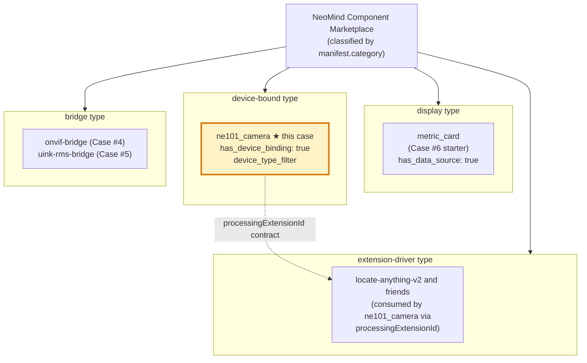
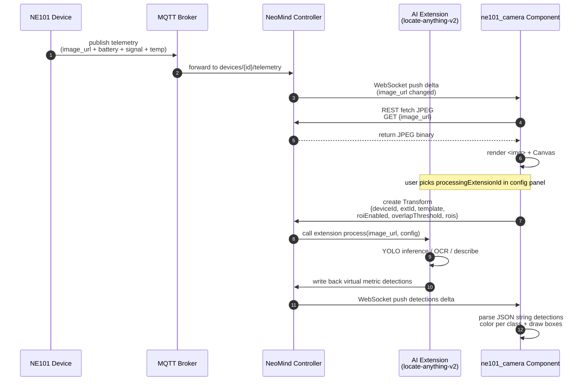

# 1 Business Background: Why NeoMind Needs the ne101_camera Component

> This section answers three questions: **what is the NE101 hardware**, **why the generic metric_card cannot do the job**, and **where ne101_camera sits in the NeoMind ecosystem**. After reading it you will be able to explain why the manifest declares `has_device_binding: true` + `has_data_source: false` — the canonical signature of a device-bound component.

---

## 1.1 The NE101 Device: CamThink Sensing Camera

**CamThink NE101** is a battery-powered edge-AI sensing camera designed by the CamThink team (which also maintains the NeoMind Dashboard). Its core capability is "on-demand capture + edge metric reporting": unlike a traditional IPC camera that streams continuously, NE101 spends most of its time in low-power sleep and wakes up to capture a single JPEG still only under three trigger conditions — (1) an explicit `trigger_capture` command from a user; (2) the built-in scheduler firing (cron-style `set_schedule`); (3) an external system issuing a command via the MQTT `cmd` topic. After each capture the device reports a telemetry bundle: the latest JPEG image (fetched via REST, URL stored in `values.image_url`), the battery percentage, the cellular signal strength, and the enclosure temperature. This "event-driven + low-frequency sampling" design lets a single battery last 3-6 months, but it also means the component cannot use a "subscribe to video stream" model — it must use a "fetch the latest still" polling/event pattern.

NE101 talks to the NeoMind controller over MQTT: the device publishes telemetry to the `devices/{device_id}/telemetry` topic, NeoMind subscribes and forwards deltas to the frontend component via WebSocket. This link dictates why the ne101_camera data access is "device binding" (DeviceBinding subscribes directly to a specific device's telemetry stream) rather than "data source binding" (DataSource was designed for "periodic metrics produced by extensions").

The device commands NE101 supports are the source of the component's command buttons:

- `trigger_capture` — wakes the device to capture a single JPEG immediately; the most common user-initiated operation. The component renders a button in the "commands" area that calls `fetchData({type: 'device_command', command: 'trigger_capture'})` on click.
- `set_schedule` — sets the cron expression for scheduled captures (e.g. `0 */30 * * * *` means every 30 minutes). The component wraps this command in a "schedule config" sub-panel.
- `reboot` — remotely reboots the device, useful for troubleshooting cellular dropouts. This command gets a confirmation dialog in the UI to prevent accidental triggers.
- `set_capture_params` — tunes capture parameters (resolution, JPEG quality, whether to enable IR illumination); an advanced setting collapsed by default.

The existence of these four command types further reinforces the 1.2 argument: a purely display-oriented component like metric_card cannot carry command-triggering capability at all; a dedicated device-bound component is required to render command buttons and call the device-command API.

> **Source evidence**: the manifest's `description.en` literally says "displays latest capture, battery status, and trigger controls" — this trio mirrors the NE101 device capabilities. See [manifest.json L4-L7](https://github.com/camthink-ai/NeoMind-Dashboard-Components/blob/main/components/ne101_camera/manifest.json#L4-L7):

```json
// manifest.json L4-L7
"description": {
  "en": "CamThink NE101 sensing camera — displays latest capture, battery status, and trigger controls",
  "zh": "CamThink NE101 感知摄像头 — 显示最新抓拍、电量状态和触发控制"
},
```
[Source: manifest.json L4-L7](https://github.com/camthink-ai/NeoMind-Dashboard-Components/blob/main/components/ne101_camera/manifest.json#L4-L7)

---

## 1.2 Why metric_card Cannot Fill In

A natural first reaction is: "NE101 just reports battery, signal, and temperature numbers — can't I bind a data source to [#6 metric_card](../6-metric-card-component.md) and be done?" The answer is no, for four reasons:

**First, metric_card cannot render images.** The core value of NE101 is "the JPEG image that was captured", while metric_card's `extractValue()` only outputs scalars (numbers/strings). Showing an image needs a dedicated `` + Canvas, and metric_card's render layer has no such capability.

**Second, metric_card cannot draw ROI overlays.** A typical NE101 use case is "draw a box around the walkway and count pedestrians passing through" — this requires drawing semi-transparent rectangles (ROIs) over the image, drawing detection boxes over detected targets, and coloring them per class. This overlay logic (Canvas coordinate system, non-linear mapping of `objectFit: contain`, async setup of ResizeObserver) simply does not fit metric_card's "single card" layout.

**Third, metric_card cannot trigger device commands.** NE101 has device-level commands like `trigger_capture` (capture now) and `set_schedule` (set timer), which require rendering buttons in the component and calling `fetchData({type: 'device_command', ...})`. metric_card's manifest is `has_actions: false` and has no command-panel entry at all.

**Fourth, metric_card cannot configure the AI processing pipeline.** NE101's real killer feature is the "image → AI extension → detection write-back" chain, which requires a config panel for picking the extension (`processingExtensionId`), picking the template (`processingTemplate`), and tuning the ROI threshold (`processingRoiOverlap`). None of these fields exist in metric_card.

In short, NE101 needs a **dedicated device-bound component** that bundles "image display + ROI overlay + command trigger + AI processing config" into one. That is the fundamental reason ne101_camera exists.

---

## 1.3 Position in the NeoMind Ecosystem: A Device-Bound Component

The NeoMind component marketplace has four `category` values: `display` (e.g. metric_card), `device` (e.g. ne101_camera), `extension` (extension drivers), and `bridge` (protocol bridges like onvif-bridge). ne101_camera is the flagship sample of the `device` category and currently the only `device`-category component in the marketplace.

Whether a component is "device-bound" is decided by two manifest fields:

- `has_data_source: false` ([manifest.json L13](https://github.com/camthink-ai/NeoMind-Dashboard-Components/blob/main/components/ne101_camera/manifest.json#L13)) — explicitly **does not** use data-source binding. DataSource is an abstraction designed for "periodic metrics produced by extensions"; binding it makes the editor show a "data source picker" panel. ne101_camera disables that panel because it does not consume extension metrics — it consumes device telemetry.
- `has_device_binding: true` + `device_type_filter: ["ne101_camera"]` ([manifest.json L14-L15](https://github.com/camthink-ai/NeoMind-Dashboard-Components/blob/main/components/ne101_camera/manifest.json#L14-L15)):

```json
// manifest.json L14-L15
"has_device_binding": true,
"device_type_filter": ["ne101_camera"],
```
[Source: manifest.json L14-L15](https://github.com/camthink-ai/NeoMind-Dashboard-Components/blob/main/components/ne101_camera/manifest.json#L14-L15) — enables the device-binding panel and **only allows binding devices whose `device_type === "ne101_camera"`**. This filter is a two-way guarantee: on the editor side, the device dropdown only lists NE101 devices; on the runtime side, the component code can safely assume `device.type === "ne101_camera"` without any type branching.

This combination of "disable data source, enable device binding + type filter" is the **canonical signature of any device-bound component**. If you later write a dedicated component for an ONVIF camera, a Modbus sensor, or a Zigbee actuator, you can copy this pattern verbatim.

The diagram below maps the NeoMind component marketplace into the four `category` buckets and marks where this case (ne101_camera) and the prerequisite cases (metric_card / onvif-bridge) sit, to give you the global picture.



The dashed arrow is the most important cross-category relationship in this case: the `device`-category ne101_camera consumes `extension`-category AI extensions through the `processingExtensionId` field. This "device component + pluggable extension" cooperation model is the core mechanism for AI reuse in the NeoMind ecosystem and is covered in depth in 3 Extension Side (v1.1).

---

## 1.4 Deep Analysis of Key manifest.json Fields

ne101_camera's manifest is only 40 lines but extremely dense. Beyond the two binding fields covered in 1.3, three fields are the core innovations of this case and will be referenced repeatedly in later sections:

**`processingExtensionId: ""` ([manifest.json L24](https://github.com/camthink-ai/NeoMind-Dashboard-Components/blob/main/components/ne101_camera/manifest.json#L24)) — the configurable AI-extension consumer contract.** This is the most important design decision in this case (see 1.6 decision #1). The empty string means "AI processing is off by default"; in the config panel the user picks an installed AI extension (object_detection / ocr / describe, etc.) from a dropdown, and the component sends the captured image URL + config params to that extension. The extension runs inference, writes the detections back to the device's virtual metrics, and the component reads them back and overlays them. This contract means ne101_camera is not hard-wired to any specific AI capability — the same component does different tasks when paired with different extensions.

**`processingRoiOverlap: 0.6` ([manifest.json L31](https://github.com/camthink-ai/NeoMind-Dashboard-Components/blob/main/components/ne101_camera/manifest.json#L31)) — the IoU-based ROI hit threshold.** This field decides "whether a detection box counts as falling inside an ROI": a box counts as a hit when its Intersection over Union with the ROI is ≥ 0.6. The earlier implementation used "center point inside ROI" (before commit `2109c45`), but center-point was too lenient for large targets straddling the ROI edge. Commit `2109c45` (`feat(ne101_camera): overlap-based ROI detection instead of center point`) switched to IoU, and commit `636a8ae` (`feat(ne101_camera): make ROI overlap threshold configurable`) then exposed the threshold as a user-tunable field.

**`processingRois: []` ([manifest.json L36](https://github.com/camthink-ai/NeoMind-Dashboard-Components/blob/main/components/ne101_camera/manifest.json#L36)) — multi-ROI array, supersedes the single rectangle.** The early implementation only had `processingRoiX/Y/W/H` defining one rectangle (L32-L35), but real users often want multiple ROIs (e.g. "count vehicles in the top-left, pedestrians in the bottom-right"), so the manifest added the `processingRois: []` array. When the array is non-empty it takes precedence; otherwise the component falls back to the single rectangle — a backward-compatible field evolution strategy.

---

## 1.5 User Pain Points Before the Component Existed

Before ne101_camera was built, monitoring an NE101 camera on NeoMind required "assembling" at least three components plus manual REST calls:

1. A metric_card to show battery / signal / temperature numbers;
2. An image_display component (if one existed) to show the latest JPEG;
3. Manual `curl` or Postman calls to `/devices/{id}/commands` to trigger captures;
4. For AI detection, manually calling the extension API and writing the result back.

This assembly had three obvious pain points: **(a) no unified control panel** — users had to jump between three or four components, a fragmented experience; **(b) no image + ROI overlay** — image_display could only show the raw JPEG, with no way to draw ROI rectangles or detection boxes; **(c) no AI processing pipeline** — all inference had to be triggered manually, with no "capture-then-infer" automation. ne101_camera exists to eliminate these three pain points: it bundles all of the above into a 3×3 default-size card providing a five-in-one panel of "image + metrics + command buttons + ROI config + AI extension picker".

To make the "before vs after" experience concrete, the table below contrasts the same monitoring task ("count pedestrian flow at a walkway every 30 minutes") under the two approaches. As you can see, ne101_camera compresses a 7-step manual flow into 2 steps of config plus an automatic loop — and that is the real reason it is called the "flagship component": not because of its line count, but because it collapses a fragmented cross-component chain into a single panel.

| Step | Before the component (assembly) | ne101_camera unified panel |
|------|---------------------------------|----------------------------|
| 1 | Create metric_card, bind NE101 battery/signal metrics | Drag in ne101_camera, auto-binds to the NE101 device |
| 2 | Create image_display, manually paste image_url | (included) auto-displays the latest capture |
| 3 | Use Postman to call `set_schedule` for 30-min captures | Fill the cron expression in the "schedule" panel |
| 4 | Use Postman to call the extension API with image_url + template | Pick extension + template in the "AI processing" panel |
| 5 | Manually write detections back to the device virtual metric | (automatic) Transform auto-writes detections |
| 6 | Write your own script to draw ROI + detection boxes | Drag on the canvas to draw ROI rectangles |
| 7 | Repeat steps 3-6 every time you want fresh data | Auto-refreshes after each capture, zero intervention |

This contrast also explains why ne101_camera's `bundle.js` is 1972 lines while metric_card is only 352 — the former extends the latter's "pull a number + render a card" into a seven-in-one state machine of "pull image + pull metrics + trigger commands + schedule extension + parse detections + draw ROI + draw detection boxes".

---

## 1.6 Key Design Decisions (with Alternatives)

This section lists 4 key design decisions and the alternatives that were rejected. These decisions shaped ne101_camera into its current form; understanding them helps you avoid detours when forking the component.

### Decision #1: The component does not run AI itself; it outsources via `processingExtensionId`

**Chosen**: the component only handles "image display + command trigger + ROI config"; AI inference is delegated via the `processingExtensionId` field to a user-selected extension (the `locate-anything-v2`-compatible family).

**Rejected alternative**: bake AI inference into the component (call YOLO directly). Rejected for three reasons: (1) the component bundle would balloon to multiple MB, violating the "hand-written IIFE, no build step" pattern; (2) AI models iterate fast, and tying the model version to the component version makes upgrades painful; (3) different users want different AI capabilities (some want object detection, some OCR, some image description), and baking in one capability removes user choice.

**Cost**: the component depends on an external extension to deliver real value — if the user has not installed any `locate-anything-v2`-compatible extension, the `processingExtensionId` dropdown is empty and the component degrades to a "pure image display + command trigger" panel. This cost is considered acceptable because the NeoMind ecosystem recommends installing at least one AI extension by default.

### Decision #2: Use `has_device_binding` + `device_type_filter`, not `has_data_source`

**Chosen**: take the "device binding" path — the manifest declares `has_device_binding: true` + `device_type_filter: ["ne101_camera"]` and explicitly opts out of data-source binding.

**Rejected alternative**: use `has_data_source: true` and disguise device telemetry as extension metrics. Rejected because: (1) the DataSource abstraction was designed for "periodic extension output", and shoehorning device telemetry into it distorts the abstraction boundary; (2) data-source binding cannot trigger device commands like `trigger_capture` (DataSource is read-only); (3) data-source binding cannot do "device type filtering" in the editor, so the dropdown would list every device — a terrible experience.

**Cost**: the component code must explicitly handle the device object (`device.id`, `device.type`, `device.metrics`) rather than relying on DataSource's uniform `fetchData()` interface. This makes the data layer noticeably more complex than metric_card's.

### Decision #3: `processingRoiOverlap` uses an IoU threshold, not center-point detection

**Chosen**: ROI hit detection uses "IoU of detection box vs ROI ≥ threshold" (default 0.6), with the threshold user-tunable.

**Rejected alternative A**: "detection-box center inside ROI counts as a hit" (the implementation before commit `2109c45`). Rejected because it was too lenient for large targets — a box mostly outside the ROI with only its center inside would still be counted, inflating the count.

**Rejected alternative B**: "detection box must be fully contained in the ROI". Rejected because it was too strict — any target touching the ROI edge would be excluded, so almost nothing would hit in practice.

**Cost**: IoU computation is slightly more expensive than center-point (it needs intersection and union areas), but the perf cost is negligible for the typical ≤ 50 detection boxes per frame.

### Decision #4: `processingRois` array coexists with single-rectangle fields (backward compatibility)

**Chosen**: the manifest keeps both `processingRoiX/Y/W/H` (single rectangle, L32-L35) and `processingRois` (array, L36). At runtime the array takes precedence when non-empty; otherwise the component falls back to the single rectangle.

**Rejected alternative**: deprecate the single-rectangle fields and unify on the array (an array with one element is equivalent to a single rectangle). Rejected because: (1) existing user configs are written with the single-rectangle fields, and a forced migration would break them; (2) the single-rectangle fields need only 4 inputs in the config panel, a simpler UI, while multi-ROI requires interactive Canvas drawing with a much more complex UI.

**Cost**: the component code must handle both formats (see the fallback at bundle.js L1034-L1036), which adds a small amount of duplicated code. But this cost buys a smooth upgrade path, which is worth it.

### Design decision recap

These four decisions share a common theme: **push complexity to the edges and keep the component itself "thin"**. ne101_camera does not bake in AI, does not pretend to be a data source, does not lock the detection algorithm, and does not force a config-format migration — each decision leaves the choice to the user or to the downstream extension. This "thin component + thick contract" philosophy is the core design principle of the NeoMind component marketplace, and it is why a 1972-line component can be called "flagship" rather than "bloated": the vast majority of those 1972 lines are glue code that "exposes choice correctly", not monolithic logic that "does everything itself". Later sections (especially 3 Extension Side and 6 Component Build) will return to this theme repeatedly.

---

## 1.7 End-to-End Data Flow

The diagram below shows the complete chain from NE101 device capture to the user seeing an annotated image. This chain involves five roles: the NE101 device, the MQTT broker, the NeoMind controller, the AI extension, and the ne101_camera component.



**Key points on the chain**:

- Steps 3-4 ("WebSocket pushes delta → component fetches JPEG") are asynchronous. The component must hold the latest `image_url` in state and handle "image still loading, Canvas not yet set up" edge cases (commit `d7836b8` fixes ResizeObserver not being set up when the image loads async).
- Steps 8-10 ("component → controller → extension → write back") are ne101_camera's most innovative chain, called the **Transform lifecycle**. When `processingEnabled: true`, the component creates a named Transform (`ne101-{deviceId}-{extId}-{template}`); the controller schedules it, the extension runs inference, and the result is written back via the `detections` virtual metric. See 3 Extension Side (v1.1) + 4 Data Contract (MVP).
- Step 11 ("parse JSON string") is needed because the `detections` virtual metric is serialized as a string (commit `e3a70be` fixed this parsing); the component must `JSON.parse` before using it.

---

## 1.8 Target Readers

This case targets two audiences:

**First: component developers who are writing a dedicated panel for a specific device type.** If you have an ONVIF camera, a Modbus sensor, or a Zigbee actuator and want to know "how do I write a NeoMind component for this device", this case is your template. Focus on 1 (this section) + 2 Architecture (v1.1) + 6 Component Build (MVP) to learn the triple "device binding + command trigger + config panel".

**Second: integrators who want to wire an AI extension to a camera device.** If you develop AI extensions and want your extension to be consumable by ne101_camera (or any other device-bound component), focus on 1 (this section) + 3 Extension Side (v1.1) + 4 Data Contract (MVP) to learn the input/output format of the `processingExtensionId` contract, the schema of the `detections` virtual metric, and the rules of the Transform lifecycle.

Both audiences should first read 1-3 of the [#6 metric_card](../6-metric-card-component.md) case, because the "IIFE injection + manifest contract + fetchData pull" triple taught there is the underlying skeleton of this case.

---

## 1.9 What Comes Next

- **2 Architecture (v1.1)**: breaks down the 1972-line IIFE into module layers and draws the component tree and data flow.
- **3 Extension Side (v1.1)**: dives into the `processingExtensionId` contract — how extensions consume images and write detections back.
- **4 Data Contract ★ (MVP)**: MQTT topic naming, WebSocket delta message format, the `detections` field schema, and the JSON structure of single-rectangle ROI vs multi-ROI array.
- **5 Frontend Consume ★ (MVP)**: how the component fetches detections, parses the JSON string, colors per class (commit `c276c23`'s golden-angle HSV rotation), and draws detection boxes.
- **6 Component Build ★ (MVP)**: the `NE101CameraPanel` named export pattern, React-hooks-in-IIFE pitfalls (commits `b060a25` / `0601cd4`), and the layered design of the config panel.
- **7 ROI Overlay (v1.1)**: rendering differences between single rectangle and multi-ROI array, normalized-to-pixel coordinate mapping, and handling the non-linear scaling of `objectFit: contain`.
- **8 Ops & Extensions (v1.1)**: version evolution (key nodes across 25+ commits), debug-trace techniques, and performance tuning (avoiding duplicate Transform creation, throttling Canvas redraws).

---

## 1.10 Key Commit Index

Later sections reference the commits below; they are listed here for convenience. For the full history, run `git log --oneline -- components/ne101_camera/` in the [source repo](https://github.com/camthink-ai/NeoMind-Dashboard-Components).

| Commit | Type | One-liner | Section |
|--------|------|-----------|---------|
| `c276c23` | feat | per-class detection colors via golden-angle HSV rotation | 5 Frontend Consume |
| `8656148` | feat | pass NMS IoU threshold 0.5 to locate-anything-v2 | 3 Extension Side |
| `636a8ae` | feat | make ROI overlap threshold configurable (the `processingRoiOverlap` field) | 7 ROI Overlay |
| `2109c45` | feat | overlap-based ROI detection instead of center point (IoU replaces center) | 7 ROI Overlay |
| `b746c02` | feat | render OCR detection boxes as polygons with rect fallback | 5 Frontend Consume |
| `d7836b8` | fix | ResizeObserver never set up when image loads async (async Canvas pitfall) | 6 Component Build |
| `b060a25` | fix | React error #310 — use defaultValue instead of hooks in ImageInput (hooks pitfall) | 6 Component Build |
| `0601cd4` | fix | move conditional useState hook to fix React error #310 (hook-order pitfall) | 6 Component Build |
| `e3a70be` | fix | parse JSON string detections from backend virtual metrics (JSON string parsing) | 4 Data Contract |
| `c4fe7bf` | fix | guard rawImageSrc against non-string metric values (type guard) | 5 Frontend Consume |

---

*Last updated: 2026-06-23*
