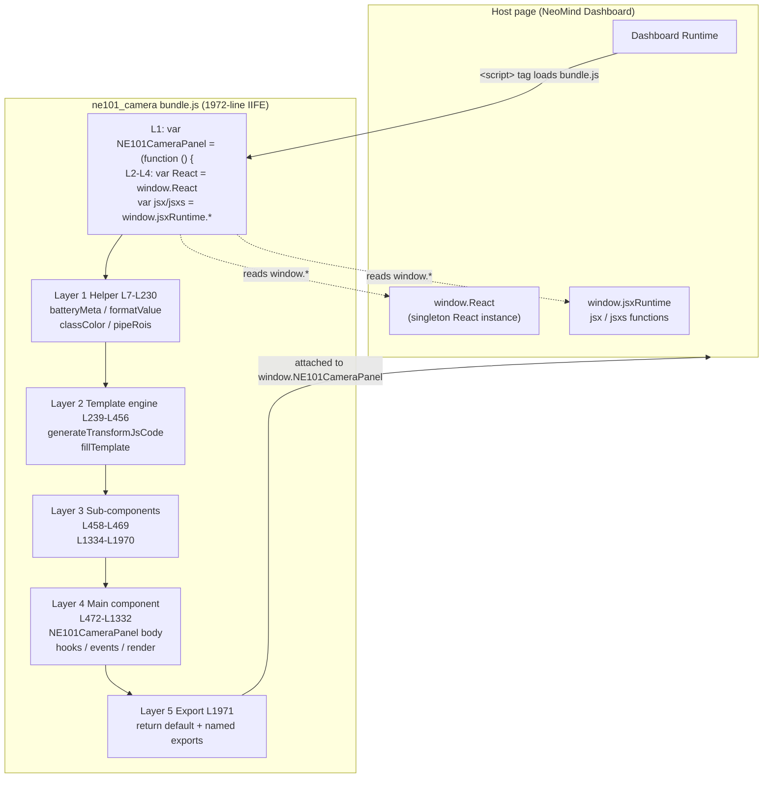
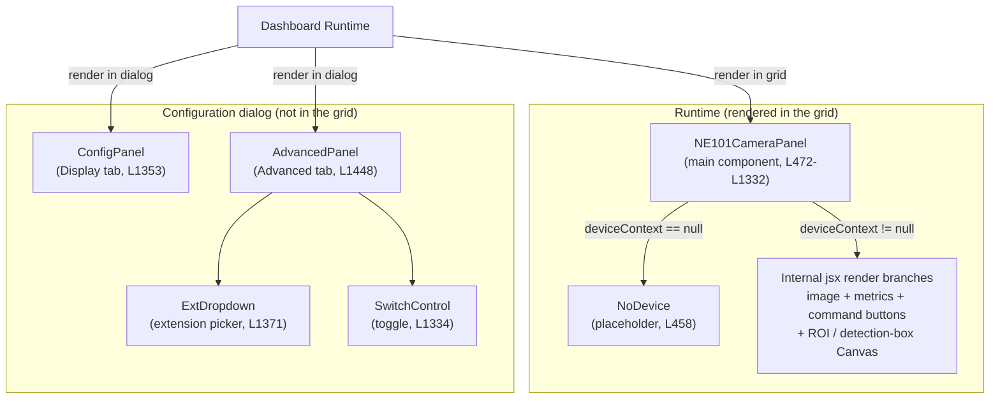
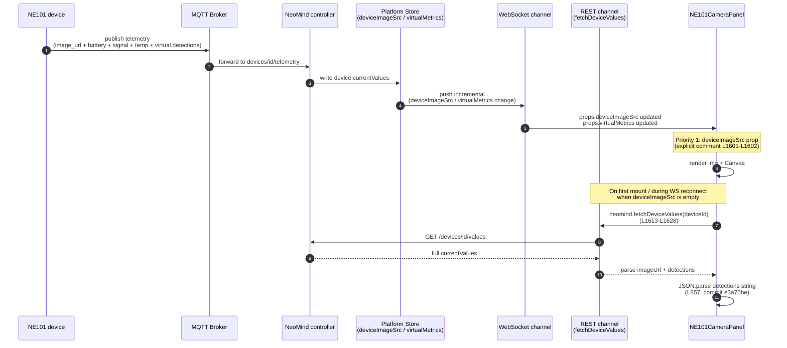

# 2 Architecture Overview

> This section cracks open the 1972-line hand-written IIFE [`bundle.js`](https://github.com/camthink-ai/NeoMind-Dashboard-Components/blob/main/components/ne101_camera/bundle.js), covering the five-layer architecture (helper / template / sub-component / main / export), the three exported components, the dual-channel data flow, and the architectural gulf versus metric_card.

---

## 2.1 IIFE Top-Level Structure

The first line of ne101_camera's `bundle.js` is not an import — it is a contract declaration against `window`. See source:

```js
// bundle.js L1-L5
var NE101CameraPanel = (function () {
  var React = window.React;
  var jsx = window.jsxRuntime.jsx;
  var jsxs = window.jsxRuntime.jsxs;
```

Source: [`bundle.js` L1-L5](https://github.com/camthink-ai/NeoMind-Dashboard-Components/blob/main/components/ne101_camera/bundle.js#L1-L5)

These three lines (`var React = window.React`, `var jsx = window.jsxRuntime.jsx`, `var jsxs = window.jsxRuntime.jsxs`) are the NeoMind component market's standard "injection triple", shared with metric_card ([6 metric_card 3.2](../6-metric-card-component.md)). The implication is that **the bundle does not pack React** — it borrows a single instance already loaded by the host page, guaranteeing one React instance for the whole dashboard and preventing cross-instance hook failures (the classic `useContext` returns undefined / `useRef` throws symptoms).

Why use `var Name = (function(){ ... })()` (an IIFE) instead of UMD / CommonJS / ESM? The root cause is that **the Dashboard host injects the bundle via a `<script>` tag**. A `<script>` tag has no module scope, so an IIFE is the only zero-dependency mechanism that emulates private naming via function scope + closure: every `function classColor` / `var white` inside the function body stays out of `window`, and only the final `return { ... }` object is attached to `window.NE101CameraPanel`. UMD also works under `<script>` but adds a `define` / `module.exports` detection branch that is redundant for NeoMind's "no bundler" philosophy; CommonJS's `require` simply does not work in the browser.

The final line [`bundle.js` L1971](https://github.com/camthink-ai/NeoMind-Dashboard-Components/blob/main/components/ne101_camera/bundle.js#L1971) is a **named-export + default dual exposure**:

```js
// bundle.js L1971
  return { default: NE101CameraPanel, NE101CameraPanel: NE101CameraPanel, ConfigPanel: ConfigPanel, AdvancedPanel: AdvancedPanel };
```

Source: [`bundle.js` L1971](https://github.com/camthink-ai/NeoMind-Dashboard-Components/blob/main/components/ne101_camera/bundle.js#L1971)

Note that `manifest.json`'s [`export_name: "NE101CameraPanel"`](https://github.com/camthink-ai/NeoMind-Dashboard-Components/blob/main/components/ne101_camera/manifest.json#L39) selects the named export:

```js
// manifest.json L38-L39
  "global_name": "NE101CameraPanel",
  "export_name": "NE101CameraPanel"
```

Source: [manifest.json L39](https://github.com/camthink-ai/NeoMind-Dashboard-Components/blob/main/components/ne101_camera/manifest.json#L39) (it reads the main component from `NE101CameraPanel.NE101CameraPanel`), not the default; but the default is also retained for backward compatibility with older Dashboard loaders that still write `bundle.default` (see 2.5 decision 2). This dual exposure is one detail that distinguishes ne101_camera from metric_card — metric_card also exposes `default + MetricCard` but only exports a single component, whereas ne101_camera must also carry `ConfigPanel` and `AdvancedPanel` out for the configuration dialog.

The diagram below draws the main line from window injection to IIFE closure to five layers to return object.



Solid arrows are load/inject direction; dotted arrows are read direction. The five layers inside the IIFE closure are not physically separate files but logical layers segmented by line number — which is also why reading ne101_camera source is harder than reading metric_card: helper, sub-component, and main interleave within the same file, and you must first build the five-layer model in your head.

---

## 2.2 Five-Layer Architecture Decomposition

The 1972 lines of ne101_camera's IIFE can be sliced into five layers by responsibility. This section gives each layer a 2-3 sentence responsibility statement and marks key line numbers for deep links, making cross-references in later sections easier.

### Layer 1: Helper (L7-L230)

The Helper layer is a stateless collection of utility functions that **do pure computation and never touch React**. The design principle is "each function could be lifted out and run in Node.js", because none of them have side effects.

Core helpers:

- `batteryMeta(level)` ([L7](https://github.com/camthink-ai/NeoMind-Dashboard-Components/blob/main/components/ne101_camera/bundle.js#L7-L12)) — maps a battery percentage to a green/yellow/red bar color.

```js
// bundle.js L7-L12 — batteryMeta
  function batteryMeta(level) {
    if (level == null) return { bar: 'rgba(128,128,128,0.3)' };
    if (level > 60) return { bar: 'rgba(34,197,94,0.8)' };
    if (level > 20) return { bar: 'rgba(234,179,8,0.8)' };
    return { bar: 'rgba(239,68,68,0.8)' };
  }
```

Source: [`bundle.js` L7-L12](https://github.com/camthink-ai/NeoMind-Dashboard-Components/blob/main/components/ne101_camera/bundle.js#L7-L12)
- `formatValue(val, metric)` / `unitStr(metric)` / `timeAgo(iso)` — value formatting and relative time; metric_card has equivalents.
- `getVal(obj, key)` / `getFirst(obj, keys)` — dot-path value accessors for nested telemetry fields like `values.xxx.yyy`.
- `classColor(label)` ([L57](https://github.com/camthink-ai/NeoMind-Dashboard-Components/blob/main/components/ne101_camera/bundle.js#L55-L72)) — **golden-angle HSV coloring**: hashes the class string, multiplies the hash by the golden angle 137.508° to obtain hue, ensuring visually separable colors for any class count. Introduced by commit [`c276c23`](https://github.com/camthink-ai/NeoMind-Dashboard-Components/commit/c276c23) (`feat(ne101): per-class detection colors via golden-angle HSV rotation`).

```js
// bundle.js L55-L72 — classColor (golden-angle HSV)
  // Per-class color via golden-angle HSV rotation — maximally distinct hues for any class count.
  // Same label always yields the same color; 100+ classes still get good separation.
  function classColor(label) {
    var h = 0;
    for (var i = 0; i < label.length; i++) { h = ((h << 5) - h + label.charCodeAt(i)) | 0; }
    var hue = (Math.abs(h) * 137.508) % 360;  // golden angle
    var s = 0.78, v = 0.95;
    var c = v * s, hp = hue / 60, x = c * (1 - Math.abs(hp % 2 - 1)), r = 0, g = 0, b = 0;
    if (hp < 1) { r = c; g = x; }
    else if (hp < 2) { r = x; g = c; }
    else if (hp < 3) { g = c; b = x; }
    else if (hp < 4) { g = x; b = c; }
    else if (hp < 5) { r = x; b = c; }
    else { r = c; b = x; }
    var m = v - c, R = Math.round((r + m) * 255), G = Math.round((g + m) * 255), B = Math.round((b + m) * 255);
    var rgb = R + ',' + G + ',' + B;
    return { stroke: 'rgba(' + rgb + ',0.85)', fill: 'rgba(' + rgb + ',0.08)', text: 'rgba(' + rgb + ',0.95)' };
  }
```

Source: [`bundle.js` L55-L72](https://github.com/camthink-ai/NeoMind-Dashboard-Components/blob/main/components/ne101_camera/bundle.js#L55-L72)

- `PinIcon` / `ModeIcon` ([L86-L100](https://github.com/camthink-ai/NeoMind-Dashboard-Components/blob/main/components/ne101_camera/bundle.js#L86-L100)) — inline SVG icon components, no external dependencies.

```js
// bundle.js L86-L100 — PinIcon + ModeIcon entry
  function PinIcon() {
    return jsx('svg', {
      width: '12', height: '12', viewBox: '0 0 24 24',
      fill: 'none', stroke: 'currentColor', strokeWidth: '2', strokeLinecap: 'round', strokeLinejoin: 'round',
      style: { flexShrink: '0' },
      children: jsx('path', { d: 'M20 10c0 6-8 12-8 12s-8-6-8-12a8 8 0 0 1 16 0Z' })
    });
  }

  // SVG icons for AI mode cards (Lucide-style)
  var _iconBase = { fill: 'none', stroke: 'currentColor', strokeWidth: '2', strokeLinecap: 'round', strokeLinejoin: 'round' };
  function ModeIcon(type) {
    switch (type) {
      case 'search':
```

Source: [`bundle.js` L86-L100](https://github.com/camthink-ai/NeoMind-Dashboard-Components/blob/main/components/ne101_camera/bundle.js#L86-L100)
- `pipeRois(pipe)` ([L204-L230](https://github.com/camthink-ai/NeoMind-Dashboard-Components/blob/main/components/ne101_camera/bundle.js#L204-L230)) — extracts ROI arrays from a pipeline config, supporting both the new format (`pipe.rois = [{points:[...]}`) and the legacy format (`pipe.roiX/Y/W/H` single rectangle). This is the code-level landing of 1.6 decision #4's backward-compatible field evolution.

```js
// bundle.js L204-L230 — pipeRois
  function pipeRois(pipe) {
    if (!pipe.roiEnabled) return [];
    if (pipe.rois && Array.isArray(pipe.rois) && pipe.rois.length > 0) {
      var result = [];
      for (var i = 0; i < pipe.rois.length; i++) {
        var r = pipe.rois[i];
        var pts = r.points;
        if (pts && pts.length >= 3) {
          result.push({ name: (r.name || 'ROI ' + (i + 1)).replace(/[^a-zA-Z0-9_\u4e00-\u9fff]/g, '_'), points: pts });
        }
      }
      if (result.length > 0) return result;
    }
    if (pipe.roiX == null || pipe.roiY == null) return [];
    var x = Number(pipe.roiX) || 0;
    var y = Number(pipe.roiY) || 0;
    var w = Number(pipe.roiW) || 0.8;
    var h = Number(pipe.roiH) || 0.8;
    if (w <= 0) w = 0.8;
    if (h <= 0) h = 0.8;
    return [{ name: 'default', points: [
      { x: x, y: y },
      { x: x + w, y: y },
      { x: x + w, y: y + h },
      { x: x, y: y + h }
    ]}];
  }
```

Source: [`bundle.js` L204-L230](https://github.com/camthink-ai/NeoMind-Dashboard-Components/blob/main/components/ne101_camera/bundle.js#L204-L230)

The Helper layer exists as a distinct layer because these functions are called repeatedly across both main component and sub-components; scattering them would produce the maintenance nightmare of "grep the whole file to change one function".

### Layer 2: Template Engine (L239-L456)

This is ne101_camera's signature capability that no other NeoMind component has: **dynamically generating the transform's `js_code` string**.

```js
// bundle.js L239-L264 — generateTransformJsCode entry
  function generateTransformJsCode(pipe) {
    var extensionId = pipe.extId;
    // Remove any 'virtual' prefix in various formats (defensive)
    if (extensionId.indexOf('virtual') === 0) {
      extensionId = extensionId.replace(/^virtual[._-]/, '');
    }
    var templateName = pipe.template;
    var mode = getExtMode(extensionId, templateName);
    if (!mode) return '';

    var extKey = extensionId.replace(/-/g, '_');
    var pfx = extKey + '.';
    var imageArg = mode.imageArg;
    var hasCats = (mode.args || []).indexOf('categories') >= 0 && pipe.categories;
    var hasPhrase = (mode.args || []).indexOf('phrase') >= 0 && pipe.phrase;
    var rois = pipeRois(pipe);
    var roiAction = pipe.roiAction || 'count';
    var classFilter = pipe.classFilter;

    var L = [];
    L.push('// NE101 Camera Transform');
    L.push('// Extension: ' + extensionId + ' | Mode: ' + mode.label);
    L.push('// Generated by component config — safe to customize');
    L.push('');
    // ... (190 lines omitted: input parsing, extension invoke, per-template post-processing) ...
```

Source: [`bundle.js` L239-L456](https://github.com/camthink-ai/NeoMind-Dashboard-Components/blob/main/components/ne101_camera/bundle.js#L239-L456)

`generateTransformJsCode(pipe)` ([L239](https://github.com/camthink-ai/NeoMind-Dashboard-Components/blob/main/components/ne101_camera/bundle.js#L239-L264)) takes a pipeline config object (containing `extId` / `template` / `categories` / `phrase` / `classFilter` / `roiEnabled` / `roiAction` / `roiX/Y/W/H`) and returns a JavaScript code string. This string is stuffed into a TransformAutomation entity on the NeoMind controller, which schedules it after each capture, invokes `extensions.invoke()`, and writes results back to virtual metrics.

Why code generation instead of hardcoded branches? Because different `processingTemplate` values (`object_detection` / `ocr` / `describe` / `barcode`) need radically different post-processing (OCR assembles polygons, describe assembles description text, object_detection aggregates by class). Writing `if (template === 'ocr') { ... } else if ...` would bloat the main component's render function to the point of unreadability. Generating the post-processing as an independent string and letting the controller `eval` it in a sandbox effectively physically strips the "variable post-processing" out of the component code. The trade-offs of this decision are discussed in 2.5 #4.

### Layer 3: Sub-component (L458-L1970)

This layer contains every React function component that is either rendered by the main component or rendered by the Dashboard's configuration dialog. Unlike metric_card, which only exports one `MetricCard`, ne101_camera's sub-component layer has **five public/private components**, which is the main source of its 1972-line bulk:

- `NoDevice` ([L458](https://github.com/camthink-ai/NeoMind-Dashboard-Components/blob/main/components/ne101_camera/bundle.js#L458-L469)) — placeholder card shown when no device is bound, telling the user to bind a device in the config panel.

```js
// bundle.js L458-L469 — NoDevice
  function NoDevice() {
    return jsxs('div', {
      className: 'flex flex-col items-center justify-center h-full w-full p-4 text-center border border-border rounded-lg',
      children: [
        jsx('div', { key: 'icon', className: 'w-10 h-10 rounded-lg flex items-center justify-center mb-3', style: { background: 'rgba(161,161,170,0.15)' }, children:
          jsx('span', { style: Object.assign({}, mutedFg, { fontSize: '14px', fontWeight: '700' }), children: 'CAM' })
        }),
        jsx('p', { key: 'title', style: Object.assign({}, mutedFg, { fontSize: '14px', fontWeight: '500' }), children: 'NE101 Camera' }),
        jsx('p', { key: 'hint', style: Object.assign({}, mutedFgSub, { fontSize: '10px', marginTop: '4px' }), children: 'Bind a device in config panel' })
      ]
    });
  }
```

Source: [`bundle.js` L458-L469](https://github.com/camthink-ai/NeoMind-Dashboard-Components/blob/main/components/ne101_camera/bundle.js#L458-L469)

- `SwitchControl(checked, onChangeFn)` ([L1334-L1348](https://github.com/camthink-ai/NeoMind-Dashboard-Components/blob/main/components/ne101_camera/bundle.js#L1334-L1348)) — hand-written replica of shadcn Switch, using `data-state` to trigger the host page's CSS rules and avoid pulling in extra dependencies.

```js
// bundle.js L1334-L1348 — SwitchControl
  function SwitchControl(checked, onChangeFn) {
    var state = checked ? 'checked' : 'unchecked';
    return jsx('button', {
      type: 'button',
      role: 'switch',
      'data-state': state,
      'aria-checked': String(checked),
      onClick: onChangeFn,
      className: 'peer inline-flex h-6 w-11 shrink-0 cursor-pointer items-center rounded-full border-2 border-transparent transition-colors focus-visible:outline-none focus-visible:ring-2 focus-visible:ring-ring focus-visible:ring-offset-2 focus-visible:ring-offset-background disabled:cursor-not-allowed disabled:opacity-50 data-[state=checked]:bg-primary data-[state=unchecked]:bg-input',
      children: jsx('span', {
        'data-state': state,
        className: 'pointer-events-none block h-5 w-5 rounded-full bg-background shadow-lg ring-0 transition-transform data-[state=checked]:translate-x-5 data-[state=unchecked]:translate-x-0'
      })
    });
  }
```

Source: [`bundle.js` L1334-L1348](https://github.com/camthink-ai/NeoMind-Dashboard-Components/blob/main/components/ne101_camera/bundle.js#L1334-L1348)
- `ConfigPanel(props)` ([L1353-L1357](https://github.com/camthink-ai/NeoMind-Dashboard-Components/blob/main/components/ne101_camera/bundle.js#L1353-L1357)) — content of the Display tab; currently an empty shell (the platform owns the title field) but kept exported to preserve the three-piece contract.

```js
// bundle.js L1353-L1357 — ConfigPanel
  function ConfigPanel(props) {
    // Title field is provided by the platform (ComponentConfigDialog → titleSection)
    // No custom fields needed — this keeps Display tab clean with just the platform title
    return jsx('div', { className: 'space-y-3', children: null });
  }
```

Source: [`bundle.js` L1353-L1357](https://github.com/camthink-ai/NeoMind-Dashboard-Components/blob/main/components/ne101_camera/bundle.js#L1353-L1357)

- `ExtDropdown(props)` ([L1371-L1446](https://github.com/camthink-ai/NeoMind-Dashboard-Components/blob/main/components/ne101_camera/bundle.js#L1371-L1446)) — shadcn-style extension picker dropdown that replaces the native `<select>`, with loading state and outside-click close.

```js
// bundle.js L1371-L1390 — ExtDropdown (head; 56 lines omitted)
  function ExtDropdown(props) {
    var exts = props.extensions;
    var value = props.value;
    var onChangeFn = props.onChange;
    var loading = props.loading;

    var openSt = React.useState(false);
    var open = openSt[0];
    var setOpen = openSt[1];
    var wrapRef = React.useRef(null);

    React.useEffect(function () {
      if (!open) return;
      function handler(e) {
        if (wrapRef.current && !wrapRef.current.contains(e.target)) setOpen(false);
      }
      document.addEventListener('mousedown', handler);
      return function () { document.removeEventListener('mousedown', handler); }
    }, [open]);
    // ... (56 lines omitted: option list rendering, trigger button, popover) ...
```

Source: [`bundle.js` L1371-L1446](https://github.com/camthink-ai/NeoMind-Dashboard-Components/blob/main/components/ne101_camera/bundle.js#L1371-L1446)
- `AdvancedPanel(props)` ([L1448-L1970](https://github.com/camthink-ai/NeoMind-Dashboard-Components/blob/main/components/ne101_camera/bundle.js#L1448-L1970)) — **the advanced configuration panel**: AI processing toggle, extension picker, template picker, ROI editor, ROI overlap threshold slider, NMS threshold pass-through. This single component is 523 lines — the longest span in the bundle.

```js
// bundle.js L1448-L1457 — AdvancedPanel (entry; 513 lines omitted)
  function AdvancedPanel(props) {
    var config = props.config || {};
    var onChange = props.onChange;

    function update(key, value) {
      if (onChange) onChange(key, value);
    }

    // Uncontrolled input — uses defaultValue so it always responds to typing.
    // Syncs to config via onChange. No hooks needed, avoids hook-count mismatch
    // ... (513 lines omitted: AI toggle, ExtDropdown, template picker, ROI editor, sliders) ...
```

Source: [`bundle.js` L1448-L1970](https://github.com/camthink-ai/NeoMind-Dashboard-Components/blob/main/components/ne101_camera/bundle.js#L1448-L1970)

### Layer 4: Main Component (L472-L1332)

`NE101CameraPanel(props)` ([L472](https://github.com/camthink-ai/NeoMind-Dashboard-Components/blob/main/components/ne101_camera/bundle.js#L472-L1332)) is the main component mounted into the grid at runtime. It consumes platform-injected props (`config` / `deviceContext` / `deviceImageSrc` / `virtualMetrics` / `sendDeviceCommand`) and manages command-loading state, extension state, transform lifecycle, detection cache, and image layout via a group of hooks.

```js
// bundle.js L470-L486 — NE101CameraPanel entry
  function NE101CameraPanel(props) {
    var config = props.config || {};
    var showCommands = config.showCommands !== false;
    var location = props.title || config.displayTitle || config.location || '';

    var deviceCtx = props.deviceContext;
    var device = deviceCtx && deviceCtx.device;
    var deviceType = deviceCtx && deviceCtx.deviceType;
    var sendCmd = props.sendDeviceCommand;

    var cmdState = React.useState({});
    var cmdLoading = cmdState[0];
    var setCmdLoading = cmdState[1];
    // ... (847 lines omitted: processing config, effects, render) ...
```

Source: [`bundle.js` L472-L1332](https://github.com/camthink-ai/NeoMind-Dashboard-Components/blob/main/components/ne101_camera/bundle.js#L472-L1332)

### Layer 5: Export (L1971)

A single line: `return { default: NE101CameraPanel, NE101CameraPanel: NE101CameraPanel, ConfigPanel: ConfigPanel, AdvancedPanel: AdvancedPanel };`. This line is also the IIFE's closing `})()`, packaging every declaration inside the closure onto `window.NE101CameraPanel`. Both `global_name` and `export_name` in manifest point to `NE101CameraPanel`, and the platform loader uses the named export accordingly.

---

## 2.3 Component Tree (NE101CameraPanel / ConfigPanel / AdvancedPanel)

The NeoMind Dashboard contract for a "device-bound component" is: **main component + optional Display tab config panel + optional Advanced tab config panel**. ne101_camera fills all three roles, producing a three-export component tree.



`ConfigPanel` is the Display tab content, responsible for user-visible display configuration (title, location, etc.). ne101_camera currently cedes the title field to the platform's `ComponentConfigDialog` (see the comment at [`bundle.js` L1354-L1356](https://github.com/camthink-ai/NeoMind-Dashboard-Components/blob/main/components/ne101_camera/bundle.js#L1353-L1357)), so `ConfigPanel` itself returns `null`, but it remains exported to avoid breaking the "main + Display + Advanced" three-piece contract.

`AdvancedPanel` ([L1448](https://github.com/camthink-ai/NeoMind-Dashboard-Components/blob/main/components/ne101_camera/bundle.js#L1448-L1970)) is where the real complexity lands, containing:

1. the AI processing master toggle
2. the extension picker dropdown (`ExtDropdown`)
3. template picker (object_detection / ocr / describe / barcode)
4. class filter / phrase input
5. ROI toggle + polygon editor (user drags points on a canvas)
6. ROI overlap threshold slider (`processingRoiOverlap`, commit [`636a8ae`](https://github.com/camthink-ai/NeoMind-Dashboard-Components/commit/636a8ae))
7. NMS IoU threshold pass-through to `locate-anything-v2` (commit [`8656148`](https://github.com/camthink-ai/NeoMind-Dashboard-Components/commit/8656148)).

The core hooks of `NE101CameraPanel` (located at [`bundle.js` L484-L513](https://github.com/camthink-ai/NeoMind-Dashboard-Components/blob/main/components/ne101_camera/bundle.js#L484-L513)) form its state machine skeleton:

```js
// bundle.js L484-L524 — core hooks block
    var cmdState = React.useState({});
    var cmdLoading = cmdState[0];
    var setCmdLoading = cmdState[1];
    // ... (18 lines omitted: processing config destructure) ...
    var extStatusState = React.useState('idle');
    var extStatus = extStatusState[0];
    var setExtStatus = extStatusState[1];

    // Track transform ID for cleanup
    var transformIdRef = React.useRef(null);

    // Cache last known detections + their source timestamp
    var lastDetsRef = React.useRef([]);
    var lastDetsTsRef = React.useRef(null);

    // WS-triggered fetch: platform WS delivers small metrics (battery, ts) in real-time,
    // but large base64 images may exceed WS message size limits.
    // Strategy: when WS updates device.currentValues (detected by ts change),
    // trigger a single Rest fetch to get the full data including the image.
    var imageState = React.useState(null);
    var imageData = imageState[0];
    var setImageData = imageState[1];

    var lastFetchTsRef = React.useRef(null);
    var fetchingRef = React.useRef(false);
```

Source: [`bundle.js` L484-L524](https://github.com/camthink-ai/NeoMind-Dashboard-Components/blob/main/components/ne101_camera/bundle.js#L484-L524)

| Hook | Line | Purpose |
|------|------|---------|
| `cmdState = React.useState({})` | [L484](https://github.com/camthink-ai/NeoMind-Dashboard-Components/blob/main/components/ne101_camera/bundle.js#L484-L486) | Loading-state dictionary for device commands, keyed by command name |
| `extStatusState = React.useState('idle')` | [L504-L506](https://github.com/camthink-ai/NeoMind-Dashboard-Components/blob/main/components/ne101_camera/bundle.js#L504-L506) | Extension-invocation state machine: `idle` / `running` / `done` / `error` |
| `transformIdRef = React.useRef(null)` | [L509](https://github.com/camthink-ai/NeoMind-Dashboard-Components/blob/main/components/ne101_camera/bundle.js#L509) | ID of the current Transform, used for cleanup on unmount |
| `lastDetsRef = React.useRef([])` | [L512](https://github.com/camthink-ai/NeoMind-Dashboard-Components/blob/main/components/ne101_camera/bundle.js#L512) | Caches the previous frame's detections to avoid image/detection misalignment |
| `lastDetsTsRef = React.useRef(null)` | [L513](https://github.com/camthink-ai/NeoMind-Dashboard-Components/blob/main/components/ne101_camera/bundle.js#L513) | The source_ts that the previous frame's detections correspond to |

This group of hooks reveals the three axes of ne101_camera's state machine: **the command axis** (short-term state for user-initiated actions), **the extension axis** (medium-term state for AI scheduling), and **the detection cache axis** (long-term refs for cross-frame alignment). metric_card has only one axis (the loading/data/error of data fetching) — this is the clearest illustration of the complexity gap between the two.

> **Hook-order pitfall**: commit [`0601cd4`](https://github.com/camthink-ai/NeoMind-Dashboard-Components/commit/0601cd4) (`fix(ne101_camera): move conditional useState hook to fix React error #310`) specifically fixes a bug where a conditional `useState` caused inconsistent hook ordering. When writing hooks inside an IIFE, the absence of ESLint's `rules-of-hooks` makes this class of bug easy to miss — a hidden cost of the hand-written IIFE philosophy.

---

## 2.4 Data Flow: WebSocket Priority + REST Fallback

ne101_camera's data flow is where it diverges most from metric_card. metric_card uses a `fetchData` prop for polled pulling, while ne101_camera runs a dual-channel strategy: **WebSocket push (incremental) + REST pull (full fallback)**.

The diagram below shows the full link from device capture to component render, with emphasis on the priority relationship between the WebSocket and REST channels.



The core contract of this data flow is written in the comment at [`bundle.js` L1601-L1602](https://github.com/camthink-ai/NeoMind-Dashboard-Components/blob/main/components/ne101_camera/bundle.js#L1601-L1602):

```js
// bundle.js L1600-L1602 — data-flow priority comment
    // Fetch preview image from bound device
    // Priority: 1. deviceImageSrc prop (from platform store, populated by WebSocket)
    //           2. REST fetch via fetchDeviceValues (fallback)
```

Source: [`bundle.js` L1601-L1602](https://github.com/camthink-ai/NeoMind-Dashboard-Components/blob/main/components/ne101_camera/bundle.js#L1601-L1602)

**Priority 1: `deviceImageSrc` prop.** This prop comes from the platform's device store, populated by WebSocket push. The platform subscribes to the `devices/{device_id}/telemetry` topic, updates the store on every message, and injects `deviceImageSrc` into the component via React props. This is the **realtime channel** — low latency (millisecond-level), but reliability is bounded by the WebSocket connection state (messages can be lost during reconnect), and large base64 images may exceed WS message-size limits (see the comment at [`bundle.js` L515-L517](https://github.com/camthink-ai/NeoMind-Dashboard-Components/blob/main/components/ne101_camera/bundle.js#L515-L517)).

```js
// bundle.js L515-L517 — WS-triggered fetch comment
    // WS-triggered fetch: platform WS delivers small metrics (battery, ts) in real-time,
    // but large base64 images may exceed WS message size limits.
    // Strategy: when WS updates device.currentValues (detected by ts change),
```

Source: [`bundle.js` L515-L517](https://github.com/camthink-ai/NeoMind-Dashboard-Components/blob/main/components/ne101_camera/bundle.js#L515-L517)

**Priority 2: REST fallback.** When `deviceImageSrc` is empty (first mount, WS reconnect, or oversized image), the component calls `window.neomind.fetchDeviceValues(deviceId)` to pull the full `currentValues` (see the `fetchPreview` function at [`bundle.js` L1613-L1628](https://github.com/camthink-ai/NeoMind-Dashboard-Components/blob/main/components/ne101_camera/bundle.js#L1613-L1628)). This is the **reliable channel** — it always returns, but with higher latency (HTTP round-trip).

```js
// bundle.js L1613-L1628 — fetchPreview (REST fallback)
    function fetchPreview() {
      if (previewSrc) return; // already have image from prop
      if (!deviceId) { previewImgState[1](''); return; }
      var neomind = window.neomind;
      if (!neomind || typeof neomind.fetchDeviceValues !== 'function') return;
      previewLoadingState[1](true);
      neomind.fetchDeviceValues(deviceId).then(function (v) {
        if (!v) { previewLoadingState[1](false); return; }
        var img = getFirst(v, ['values.imageUrl', 'values.image', 'values.photo', 'imageUrl', 'image', 'photo', 'values.picture', 'picture']);
        if (img && typeof img === 'string') {
          var src = img.indexOf('data:') === 0 ? img : 'data:image/jpeg;base64,' + img;
          previewImgState[1](src);
        }
        previewLoadingState[1](false);
      }).catch(function () { previewLoadingState[1](false); });
    }
```

Source: [`bundle.js` L1613-L1628](https://github.com/camthink-ai/NeoMind-Dashboard-Components/blob/main/components/ne101_camera/bundle.js#L1613-L1628)

Two commits mark the introduction of this dual-channel strategy:

- commit [`b0be12b`](https://github.com/camthink-ai/NeoMind-Dashboard-Components/commit/b0be12b) (`fix(ne101): initial fetch on mount for image + virtual metrics`) — fixes "if WebSocket has not pushed the first message by the time the component mounts, the screen is blank", by triggering an active REST fetch in the mount effect.
- commit [`0eedd27`](https://github.com/camthink-ai/NeoMind-Dashboard-Components/commit/0eedd27) (`fix(ne101): update virtual data on WS-triggered REST fetch`) — fixes "WS push only carries small metrics (battery/ts), large images need REST to backfill", by making the WS-triggered REST fetch also refresh virtual metrics.

Detection parsing has one easy-to-miss pitfall: the backend stores the `detections` virtual metric as a **JSON string** rather than an array. [`bundle.js` L857](https://github.com/camthink-ai/NeoMind-Dashboard-Components/blob/main/components/ne101_camera/bundle.js#L853-L867) does a defensive parse with try/catch:

```js
// bundle.js L853-L867 — detections parse + source_ts alignment
    if (processingEnabled && processingExtId) {
      var pfx = 'virtual.' + processingExtId.replace(/-/g, '_') + '.';
      var vDet = getFirst(vals, [pfx + 'detections', 'values.' + pfx + 'detections']);
      // Backend may store detections as a JSON string — parse it
      if (typeof vDet === 'string') { try { vDet = JSON.parse(vDet); } catch(e) { vDet = null; } }
      var vSourceTs = getFirst(vals, [pfx + 'source_ts', 'values.' + pfx + 'source_ts']);
      // Match: detections' source_ts must align with the current image timestamp
      var imgTsVal = imgTs;
      var tsMatch = !vSourceTs || !imgTsVal || String(vSourceTs) === String(imgTsVal);
      if (Array.isArray(vDet) && vDet.length > 0 && tsMatch) {
        detections = vDet;
        lastDetsRef.current = vDet;
        lastDetsTsRef.current = imgTsVal;
      } else if (Array.isArray(vDet) && vDet.length > 0) {
        // Detections exist but from a different image — cache but don't display
        lastDetsRef.current = vDet;
        lastDetsTsRef.current = vSourceTs;
```

This fix comes from commit [`e3a70be`](https://github.com/camthink-ai/NeoMind-Dashboard-Components/commit/e3a70be) (`fix(ne101): parse JSON string detections from backend virtual metrics`). Before this, the component assumed `vDet` was always an array and crashed on a string. This is a common contract-ambiguity zone for device-bound components — the backend's serialization strategy and the frontend's deserialization assumption disagree. 4 Data Contract discusses this in depth.

---

## 2.5 Key Design Decisions (>=4, with trade-offs and alternatives)

This section lists five architectural decisions that shape ne101_camera's current form. Each decision uses a three-part "we chose X / alternative Y / rationale Z" framing, plus the cost paid.

### Decision 1: IIFE + window.React instead of bundling React

**Choice**: the IIFE form `var NE101CameraPanel = (function(){ var React = window.React; ... })()`, without packing React, borrowing the singleton from the host page.

**Alternative**: use Rollup / Webpack to externalize React or bundle it directly.

**Rationale**:

1. The Dashboard host already provides React; each component packing its own copy would produce N React instances across the dashboard, breaking hooks across instances (`useContext` returns undefined, `useRef` throws)
2. IIFE shared singleton saves about 140KB per component (React + ReactDOM minified), which is 1.4MB across 10 components
3. it guarantees the component's React version matches the host, avoiding "component uses React 18's `useSyncExternalStore`, host is still on React 17" version mismatches.

**Cost**:

1. No tree-shaking — the entire helper layer ships in the bundle even if some functions are unused
2. no TypeScript type checking — the parameter types of `getFirst(vals, keys)` and similar functions live only in comments and convention
3. no ESLint `rules-of-hooks` — hook-order bugs can only be caught at runtime (commit `0601cd4` is exactly such a bug). metric_card accepts this cost because it is 352 lines; ne101_camera accepts it at 1972 lines because `test_bundle.js` provides logic-test coverage as a safety net.

### Decision 2: Named export + default dual exposure

**Choice**: [`bundle.js` L1971](https://github.com/camthink-ai/NeoMind-Dashboard-Components/blob/main/components/ne101_camera/bundle.js#L1971) return object contains both `default` and named exports (`NE101CameraPanel` / `ConfigPanel` / `AdvancedPanel`).

**Alternative**: expose only `default` and have the platform read the main component from `bundle.default`.

**Rationale**:

1. manifest's [`export_name: "NE101CameraPanel"`](https://github.com/camthink-ai/NeoMind-Dashboard-Components/blob/main/components/ne101_camera/manifest.json#L39) explicitly selects the named export, and the platform loader reads the main component from `window.NE101CameraPanel.NE101CameraPanel`
2. keeping `default` preserves backward compatibility with older Dashboard loaders (v1.x era wrote `bundle.default`), avoiding a one-shot breaking upgrade
3. `ConfigPanel` and `AdvancedPanel` must be named exports because the configuration dialog references them individually to render the Display tab and Advanced tab.

**Cost**: the return object has one layer of redundancy (`default` and `NE101CameraPanel` point to the same function), but this is the standard cost of forward compatibility and is negligible.

### Decision 3: WebSocket-priority + REST-fallback dual channel

**Choice**: image data flows through two channels — Priority 1 is `props.deviceImageSrc` (WebSocket push), Priority 2 is `neomind.fetchDeviceValues(deviceId)` (REST pull).

**Alternative**: use only WebSocket and rely on the platform store's push to cover every scenario.

**Rationale**:

1. WebSocket can drop messages (during reconnect, network jitter), so on first mount when WS has not pushed yet, the screen would be blank
2. large base64 images may exceed WS message-size limits (see the comment at [`bundle.js` L515-L517](https://github.com/camthink-ai/NeoMind-Dashboard-Components/blob/main/components/ne101_camera/bundle.js#L515-L517)) — WS only pushes small metrics (battery/ts), images must come via REST
3. REST guarantees "first mount always has data", which is the user-experience floor. commit [`b0be12b`](https://github.com/camthink-ai/NeoMind-Dashboard-Components/commit/b0be12b) adds exactly this mount effect for that floor.

**Cost**:

1. the component maintains two data paths, roughly doubling code complexity
2. WebSocket push and REST pull can race (REST returning stale data overwriting fresh WS data), requiring deduplication via `lastFetchTsRef` and `fetchingRef` ([`bundle.js` L523-L524](https://github.com/camthink-ai/NeoMind-Dashboard-Components/blob/main/components/ne101_camera/bundle.js#L523-L524)). commit [`0eedd27`](https://github.com/camthink-ai/NeoMind-Dashboard-Components/commit/0eedd27) once fixed this race.

```js
// bundle.js L523-L524 — race-condition dedup refs
    var lastFetchTsRef = React.useRef(null);
    var fetchingRef = React.useRef(false);
```

Source: [`bundle.js` L523-L524](https://github.com/camthink-ai/NeoMind-Dashboard-Components/blob/main/components/ne101_camera/bundle.js#L523-L524)

### Decision 4: Dynamically generating transform JS code

**Choice**: use `generateTransformJsCode(pipe)` ([L239](https://github.com/camthink-ai/NeoMind-Dashboard-Components/blob/main/components/ne101_camera/bundle.js#L239-L456)) to serialize the pipeline config into a JavaScript code string, stuffed into the TransformAutomation entity's `js_code` field.

**Alternative**: hardcode the processing logic inside the component with conditional branches (`if (template === 'ocr') { ... } else if (template === 'describe') { ... }`).

**Rationale**:

1. Different `processingTemplate` values (`object_detection` / `ocr` / `describe` / `barcode`) have radically different post-processing — OCR assembles polygons and extracts text, describe assembles description strings, object_detection aggregates by class — hardcoding would bloat the main render function beyond readability
2. code generation physically strips the "variable post-processing" out of the component code and lets the controller execute it in an isolated sandbox, keeping the AI scheduling logic out of the component bundle
3. generated code is declarative (user changes config -> regenerate), easier to reason about than imperative `if/else`.

**Cost**:

1. string-concatenated code has no syntax checking — typos only surface at runtime
2. the controller must `eval` this code in a sandbox, introducing (controlled) security risk
3. debugging is hard — stack frames point into the generated string, not the source. `test_bundle.js` contains snapshot tests specifically for `generateTransformJsCode` to mitigate this.

### Decision 5: Golden-angle HSV for class coloring

**Choice**: `classColor(label)` ([L57-L72](https://github.com/camthink-ai/NeoMind-Dashboard-Components/blob/main/components/ne101_camera/bundle.js#L55-L72)) uses string hashing + golden-angle 137.508° rotation to generate HSV hue.

**Alternative**: fixed palette (`['#ef4444', '#3b82f6', '#10b981', ...]`, taking color by class index).

**Rationale**:

1. golden-angle rotation guarantees visually separable colors for any class count — a fixed palette starts repeating after the 9th color, while ne101_camera may encounter COCO's 80 classes or OpenImages' 500+
2. the same class label always hashes to the same color, consistent across frames and devices, with no "class -> color" mapping table to maintain
3. hashing is a pure function with no side effects, suitable for the helper layer. commit [`c276c23`](https://github.com/camthink-ai/NeoMind-Dashboard-Components/commit/c276c23) introduced this rule; the prior implementation was a fixed palette.

**Cost**:

1. hash collisions are rare but non-zero (two labels could hash to nearby hues)
2. generated colors are not designer-controlled, possibly producing "brand-color dissonance"
3. HSV is not perceptually uniform (the blue region is harder for the eye to distinguish), theoretically inferior to OKLCH. In practice, with fewer than 50 classes, the effect is acceptable.

---

## 2.6 Architectural Comparison with 6 metric_card

The table below compares ne101_camera and [6 metric_card](../6-metric-card-component.md) across six dimensions, to help readers build a mental model of the architectural gulf between "display component" and "device-bound component". For metric_card's relevant fields, see its [3.1 manifest contract](../6-metric-card-component.md).

| Dimension | 6 metric_card | 7 ne101_camera | Gap interpretation |
|-----------|----------------|-----------------|---------------------|
| **Code volume** | 352-line IIFE | 1972-line IIFE | The extra 1620 lines in ne101 mostly live in the sub-component layer (`AdvancedPanel` 523 lines) and the template engine layer (`generateTransformJsCode` 218 lines) — both are complexity unique to "device binding + AI processing pipeline". |
| **Component count** | 1 exported component (`MetricCard`) | 3 exported components (`NE101CameraPanel` + `ConfigPanel` + `AdvancedPanel`) + 4 internal sub-components | metric_card's "single component" means it has no configuration-dialog tab structure; ne101's three-piece set is the platform's requirement for components with `has_device_binding` or complex `config_schema`. |
| **Data access** | `has_data_source: true` + `fetchData` prop (generic) | `has_device_binding: true` + `device_type_filter: ["ne101_camera"]` (specific) | metric_card consumes any DataSource (device telemetry / extension metrics / system metrics); ne101 only consumes devices where `device.type === "ne101_camera"`. This is the fundamental "generic vs specific" divide. |
| **Configuration complexity** | Simple display config (`label` / `unit` / `decimalPlaces`) | 18-field `default_config` ([manifest.json L18-L37](https://github.com/camthink-ai/NeoMind-Dashboard-Components/blob/main/components/ne101_camera/manifest.json#L18-L37)): processing pipeline + ROI + NMS + categories + phrase | ne101 has 3x the config fields of metric_card, each with defaults and compatibility fallback (`processingRois` array vs single rectangle). |
| **Export style** | `default + MetricCard` dual exposure (but only default is used) | `default + NE101CameraPanel + ConfigPanel + AdvancedPanel` four-field exposure | metric_card's default dual exposure is "forward-compatible insurance"; ne101's named exports are "a contract the configuration dialog must use". |
| **Applicable scenarios** | Any scalar metric (temperature, battery, latency, count) | Only `ne101_camera` device type | metric_card is a "universal value card"; ne101 is a "dedicated camera panel". If the NE101 device is retired, the ne101 component is also deprecated; metric_card never becomes invalid because some device type disappears. |

The full 18-field `default_config` of ne101_camera is as follows:

```js
// manifest.json L18-L37 — default_config (18 fields)
  "default_config": {
    "showMetrics": true,
    "showCommands": true,
    "location": "",
    "displayTitle": "",
    "processingEnabled": false,
    "processingExtensionId": "",
    "processingTemplate": "object_detection",
    "processingCategories": "person,car",
    "processingPhrase": "",
    "processingClassFilter": "",
    "processingRoiEnabled": false,
    "processingRoiAction": "count",
    "processingRoiOverlap": 0.6,
    "processingRoiX": 0.1,
    "processingRoiY": 0.1,
    "processingRoiW": 0.8,
    "processingRoiH": 0.8,
    "processingRois": []
  }
```

Source: [manifest.json L18-L37](https://github.com/camthink-ai/NeoMind-Dashboard-Components/blob/main/components/ne101_camera/manifest.json#L18-L37)

**One-sentence summary**: metric_card is "thin component + thick generality"; ne101_camera is "thick component + thin specificity". The former's value is wide coverage; the latter's value is collapsing a complex device link into a single panel. The two are not substitutes but a progression — ne101_camera builds on metric_card's three-piece set (IIFE injection + manifest contract + inline style) and adds four new capability layers: device binding, image canvas, AI processing pipeline, and ROI overlay.

---

## 2.7 Summary

This section decomposed ne101_camera's five-layer IIFE architecture, the three-export component tree, the WebSocket-priority + REST-fallback dual-channel data flow, and five key design decisions. Three core takeaways:

1. **The five-layer architecture** (helper / template / sub-component / main / export) is not a physical separation but a logical layering within one file. When reading the source, first build the five-layer model in your head, or the 1972 lines will overwhelm you.
2. **The dual-channel data flow** (WebSocket + REST) is the core feature that distinguishes a device-bound component from a display component. metric_card is fine with a single `fetchData` channel; ne101 must run dual channels to balance realtime responsiveness and reliability.
3. **Code generation (`generateTransformJsCode`)** is an architectural innovation unique to ne101_camera that physically strips "variable post-processing" out of the component code. This pattern will be reused in later case studies.

### Evolution Milestone Table

The six commits below are key nodes in ne101_camera's architectural evolution, in chronological order. The full commit history is available via `git log --oneline -- components/ne101_camera/` in the source repo.

| Commit | Type | One-line description | Affected layer |
|--------|------|----------------------|----------------|
| [`c276c23`](https://github.com/camthink-ai/NeoMind-Dashboard-Components/commit/c276c23) | feat | per-class detection colors via golden-angle HSV rotation | Helper (`classColor` L57) |
| [`8656148`](https://github.com/camthink-ai/NeoMind-Dashboard-Components/commit/8656148) | feat | pass NMS IoU threshold 0.5 to locate-anything-v2 | Template engine (NMS parameter pass-through) |
| [`636a8ae`](https://github.com/camthink-ai/NeoMind-Dashboard-Components/commit/636a8ae) | feat | make ROI overlap threshold configurable | Sub-component (`AdvancedPanel` slider) |
| [`b0be12b`](https://github.com/camthink-ai/NeoMind-Dashboard-Components/commit/b0be12b) | fix | initial fetch on mount for image + virtual metrics | Main component (mount-effect REST fallback) |
| [`e3a70be`](https://github.com/camthink-ai/NeoMind-Dashboard-Components/commit/e3a70be) | fix | parse JSON string detections from backend virtual metrics | Main component ([`L857`](https://github.com/camthink-ai/NeoMind-Dashboard-Components/blob/main/components/ne101_camera/bundle.js#L853-L867) JSON.parse) |
| [`0601cd4`](https://github.com/camthink-ai/NeoMind-Dashboard-Components/commit/0601cd4) | fix | move conditional useState hook to fix React error #310 | Main component (hook-order fix) |

### Bridge to Later Chapters

- [3 Extension Side](./3-extension-side.md) (v1.1) — dives into the `processingExtensionId` contract, how extensions consume images, how they write back detections, and how the code generated by `generateTransformJsCode` executes in the controller's sandbox.
- [4 Data Contract](./4-data-contract.md) (MVP) — MQTT topic naming, WebSocket incremental message format, the `detections` field schema, and the ROI polygon vs single-rectangle JSON structure. The JSON-string parsing pitfall (commit `e3a70be`) mentioned here is expanded into a full schema discussion there.
- [5 Frontend Consumption](./5-frontend-consume.md) (MVP) — how the component pulls detections, parses JSON strings, applies per-class coloring (`classColor` golden-angle HSV), and draws detection boxes and ROI polygons.
- [6 Component Build](./6-component-build.md) (MVP) — the named-export pattern for `NE101CameraPanel`, React-hook pitfalls inside an IIFE (commit `0601cd4`), and the layered design of `AdvancedPanel`.
- Back to [1 Business Background](./1-background.md) — if you have not read it yet, read 1 first for narrative continuity.

---

*Last updated: 2026-06-23*
