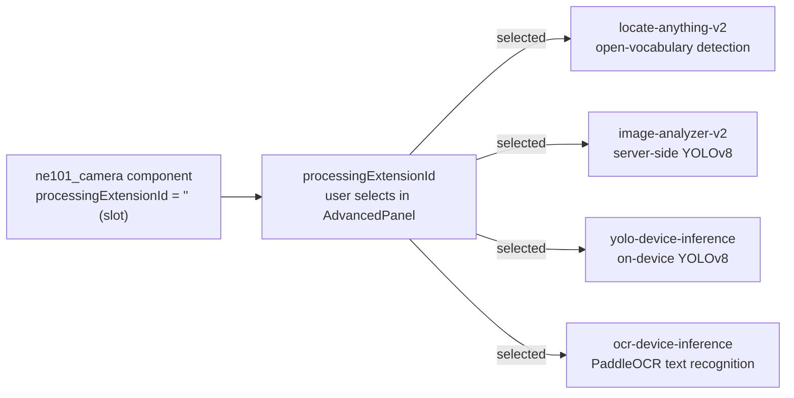

# 3 Extension Side: The processingExtensionId Generic AI Contract

> This page is the **extension-side contract reference** for the ne101_camera case study, covering the `processingExtensionId` generic AI processing contract: whitelist validation (`AI_EXT_IDS`), mode mapping (`EXT_MODES`), the `__imageData` injection mechanism, and the degradation fallback strategy.

---

## 3.1 The processingExtensionId Generic Contract

The most easily misunderstood fact about ne101_camera is this: although it looks like it is doing "AI object detection", a full read of the 1972-line `bundle.js` will find zero lines of YOLO inference, zero references to an ONNX runtime, zero model-weight loads. The component itself **does no AI whatsoever**. All inference is outsourced to whichever extension the user picks via the `processingExtensionId` config field. This field lives in the `default_config` block of [`manifest.json` L23-L24](https://github.com/camthink-ai/NeoMind-Dashboard-Components/blob/main/components/ne101_camera/manifest.json#L23-L24):

```json
"processingEnabled": false,
"processingExtensionId": "",
```

`processingEnabled` is the master switch (default false, so out of the box the component is a pure camera-view widget), and `processingExtensionId` is the extension-id slot (default empty string = no extension selected = no processing). When the user toggles the switch on in `AdvancedPanel` and picks an extension (say `locate-anything-v2`) from the dropdown, the component's `generateTransformJsCode` writes that extension id into the generated Transform's `extensions.invoke()` call, and the platform — when the Transform runs in the controller sandbox — routes the call to the extension's HTTP/RPC endpoint.

This "component + pluggable extension" contract is the **template** for AI reuse across the NeoMind ecosystem: one component, N inference backends. The same ne101_camera component, paired with `locate-anything-v2`, becomes "open-vocabulary object detection"; paired with `ocr-device-inference`, it becomes "OCR text recognition"; paired with `yolo-device-inference`, it becomes "edge-device YOLOv8 inference". The component never needs to know how those extensions are implemented internally — only how to invoke them and how to normalize their responses (see [4.3](./4-data-contract.md)).

**Why "pluggable extension" beats "baked-in AI"**: if the component shipped its own YOLO model (say, embedding onnxruntime-web + yolov8n.weights into the bundle), three serious consequences would follow. First, bundle size would explode — a quantized YOLOv8n weight is ~12MB and onnxruntime-web's WASM adds ~12MB, taking the bundle from 80KB to over 25MB and pushing load time from milliseconds to seconds. Second, model choice would be locked — a user wanting OCR would need a different "OCR-baked" variant of the component, multiplying the component-market SKU count. Third, model updates would be tightly coupled to component updates — every YOLO iteration would require a new component release, whereas extensions are deployed independently (upgraded by the user or platform ops without touching the component). The pluggable-extension design dissolves all three problems: the component stays at 80KB, the user picks the model, and extensions can evolve on their own release cadence.

The diagram below shows the fan-out from "component → processingExtensionId → N candidate extensions". The component exposes one slot; the user's dropdown choice determines which extension is actually invoked, and extensions are mutually unaware of each other.



**Design decision: pluggable extension vs baked-in AI model**

- **Choice**: the component does zero AI; inference is outsourced to the extension named by `processingExtensionId` ([manifest.json L24](https://github.com/camthink-ai/NeoMind-Dashboard-Components/blob/main/components/ne101_camera/manifest.json#L24-L24)).
- **Alternative A**: the component bundles its own YOLO model (onnxruntime-web + weights). Rejected because: bundle size balloons from 80KB to 25MB+, load time goes from milliseconds to seconds, and model choice is locked — wanting OCR forces a different component variant.
- **Alternative B**: the component bundles multiple models (one detector + one OCR), switching at runtime by config. Rejected because: the size problem gets worse (25MB x 2) and the models contend for GPU/WASM memory.
- **Rationale**: pluggable extensions keep the component lightweight (80KB), hand model selection to the user (pick per scenario), and let extensions upgrade independently (no component release required). This is the foundation of NeoMind's "one component, many uses" paradigm.
- **Cost**: the component cannot do detection in an environment where no AI extension is installed — but that is exactly the semantics of `processingExtensionId` defaulting to the empty string (pure display mode).

---

## 3.2 The AI_EXT_IDS Whitelist

The platform hosts many extensions (weather, ONVIF bridge, various AI inference engines), but ne101_camera only cares about **AI extensions that can consume an image input and return detections**. The component filters with a hardcoded whitelist defined at [`bundle.js` L144](https://github.com/camthink-ai/NeoMind-Dashboard-Components/blob/main/components/ne101_camera/bundle.js#L144-L144):

```javascript
var AI_EXT_IDS = ['locate-anything-v2', 'image-analyzer-v2', 'yolo-device-inference', 'ocr-device-inference'];
```

The responsibilities of these four extensions are:

- **`locate-anything-v2`** — a Grounding-DINO-style open-vocabulary detector that supports free-text descriptions like "find a cat" or "find a red car" (phrase). It is the most capable of the four, with the most modes (5).
- **`image-analyzer-v2`** — server-side YOLOv8 object detection with a fixed class set (COCO 80 classes). No phrase input required; suitable for "count heads" or "count vehicles" scenarios.
- **`yolo-device-inference`** — on-device YOLOv8 inference. Functionally similar to `image-analyzer-v2` but the inference runs on the NE101 device itself rather than on the server, yielding lower latency and zero server-GPU cost.
- **`ocr-device-inference`** — PaddleOCR text recognition. Returns text blocks with polygon bounding boxes, for "license plate recognition" or "signage text extraction" use cases.

This whitelist is consumed by the extension-loading logic in `AdvancedPanel`, at [`bundle.js` L1488-L1491](https://github.com/camthink-ai/NeoMind-Dashboard-Components/blob/main/components/ne101_camera/bundle.js#L1488-L1491). The component calls `window.neomind.listExtensions()` to fetch the list of all installed extensions on the platform, then filters with the whitelist:

```javascript
var arr = Array.isArray(exts) ? exts : [];
var filtered = [];
for (var i = 0; i < arr.length; i++) {
  if (AI_EXT_IDS.indexOf(arr[i].id) >= 0) filtered.push(arr[i]);
}
```

Only the filtered `filtered` array is handed to `ExtDropdown` to render as dropdown options. This means that even if the platform has `weather-forecast-v2`, `onvif-bridge`, or `uink-rms-bridge` installed, none of them will appear in ne101_camera's extension picker — because they cannot consume an image input, and selecting them would only cause the Transform invocation to fail.

**Why a hardcoded whitelist rather than "show all extensions"**: user experience is the core reason. If the dropdown were polluted with `weather-forecast-v2`, a user might select it and then be confused about "why are there no detection boxes on the camera frame" — the weather extension does not accept an image parameter at all. The whitelist separates "usable" from "unusable" at the UI layer, preventing users from entering a dead-end of "selected the wrong thing but don't know why".

**Design decision: hardcoded whitelist vs metadata-driven vs show-all**

- **Choice**: hardcode `AI_EXT_IDS = ['locate-anything-v2', ...]` as a four-element array in `bundle.js` ([L144](https://github.com/camthink-ai/NeoMind-Dashboard-Components/blob/main/components/ne101_camera/bundle.js#L144-L144)), filter with `indexOf` ([L1488-L1491](https://github.com/camthink-ai/NeoMind-Dashboard-Components/blob/main/components/ne101_camera/bundle.js#L1488-L1491)).
- **Alternative A**: metadata-driven — extensions declare `"supports_image": true` in their manifest, and the component filters on that field. Rejected because: this requires all extension authors to follow a "declare capability" contract, and NeoMind's current extension manifest has no such field. Introducing it requires platform-level standardization that will not happen in the short term.
- **Alternative B**: show all installed extensions. Rejected because: non-AI extensions (weather, ONVIF bridge) pollute the dropdown; selecting one causes a Transform invocation failure with a poor experience, and the error may only surface at Transform runtime (hard to debug).
- **Rationale**: the hardcoded whitelist is the simplest option — the four extensions are the known, stable AI set, and adding a new AI extension only requires appending one string to the array. In the absence of an extension-metadata standard, this is the pragmatic choice.
- **Cost**: adding a new AI extension requires editing component code (append to `AI_EXT_IDS` and add a mode entry to `EXT_MODES`). But the lenient fallback in 3.7 ensures that "new extension + old whitelist" still works (it falls through to the default `detect` command).

---

## 3.3 The EXT_MODES Mode Catalog

Each extension does not have just one invocation mode — `locate-anything-v2` can do category-based detection, phrase-based grounding, and OCR. The component uses a **mode catalog** `EXT_MODES` to describe "which modes this extension supports, and what each mode's parameters and response shape are". The catalog lives at [`bundle.js` L154-L171](https://github.com/camthink-ai/NeoMind-Dashboard-Components/blob/main/components/ne101_camera/bundle.js#L154-L171). Its structure is an object keyed by extension id; each value is an array of modes supported by that extension. Each mode is an object with eight fields: `id` / `command` / `imageArg` / `responseType` / `label` / `desc` / `icon` / `args`.

```js
  var EXT_MODES = {
    'locate-anything-v2': [
      { id: 'object_detection', command: 'detect', imageArg: 'image_base64', responseType: 'boxes_x1y1x2y2', label: 'Object Detection', desc: 'Detect objects by category', icon: 'search', args: ['categories'] },
      { id: 'grounding', command: 'ground', imageArg: 'image_base64', responseType: 'boxes_x1y1x2y2', label: 'Grounding', desc: 'Find objects by description', icon: 'target', args: ['phrase'] },
      { id: 'text_detection', command: 'detect_text', imageArg: 'image_base64', responseType: 'boxes_x1y1x2y2', label: 'Text Detection', desc: 'Extract text from image', icon: 'text', args: [] },
      { id: 'ground_gui', command: 'ground_gui', imageArg: 'image_base64', responseType: 'boxes_x1y1x2y2', label: 'UI Grounding', desc: 'Locate UI elements by description', icon: 'monitor', args: ['phrase'] },
      { id: 'point', command: 'point', imageArg: 'image_base64', responseType: 'boxes_x1y1x2y2', label: 'Point', desc: 'Point to specific objects', icon: 'cursor', args: ['phrase'] }
    ],
    'image-analyzer-v2': [
      { id: 'object_detection', command: 'analyze_image', imageArg: 'image', responseType: 'objects_bbox', label: 'Object Detection', desc: 'YOLOv8 object detection', icon: 'search', args: [] }
    ],
    'yolo-device-inference': [
      { id: 'object_detection', command: 'analyze_image', imageArg: 'image', responseType: 'detections_bbox', label: 'Object Detection', desc: 'YOLOv8 device inference', icon: 'search', args: [] }
    ],
    'ocr-device-inference': [
      { id: 'text_detection', command: 'recognize_image', imageArg: 'image', responseType: 'ocr_text_blocks', label: 'Text Detection', desc: 'OCR text recognition', icon: 'text', args: [] }
    ]
  };
```

*Source: [`bundle.js` L154-L171](https://github.com/camthink-ai/NeoMind-Dashboard-Components/blob/main/components/ne101_camera/bundle.js#L154-L171)*

The mode distribution across the four extensions is:

- **`locate-anything-v2`** ([L155-L161](https://github.com/camthink-ai/NeoMind-Dashboard-Components/blob/main/components/ne101_camera/bundle.js#L155-L161)) — 5 modes, all using `boxes_x1y1x2y2` response shape, all taking `image_base64` as input:
  - `object_detection` (detect by category, requires `categories` input)
  - `grounding` (locate by phrase, requires `phrase` input)
  - `text_detection` (text detection, no extra input)
  - `ground_gui` (UI element grounding, requires `phrase` input)
  - `point` (point at specific target, requires `phrase` input)
- **`image-analyzer-v2`** ([L162-L164](https://github.com/camthink-ai/NeoMind-Dashboard-Components/blob/main/components/ne101_camera/bundle.js#L162-L164)) — 1 mode: `object_detection`, `objects_bbox` response shape, `image` input.
- **`yolo-device-inference`** ([L165-L167](https://github.com/camthink-ai/NeoMind-Dashboard-Components/blob/main/components/ne101_camera/bundle.js#L165-L167)) — 1 mode: `object_detection`, `detections_bbox` response shape, `image` input.
- **`ocr-device-inference`** ([L168-L170](https://github.com/camthink-ai/NeoMind-Dashboard-Components/blob/main/components/ne101_camera/bundle.js#L168-L170)) — 1 mode: `text_detection`, `ocr_text_blocks` response shape, `image` input.

**How the `args` field drives the UI**: each mode's `args` array determines which input fields `AdvancedPanel` renders when that mode is selected. `args: ['categories']` renders a "category filter" input (the user types `person,car`); `args: ['phrase']` renders a "description phrase" input (the user types "a red car"); `args: []` renders no extra input. This mechanism lets a single `AdvancedPanel` dynamically adjust its input fields based on the selected extension and mode, without writing a dedicated config panel per extension.

**Mode-picker UI behavior**: when the user picks `locate-anything-v2` in `ExtDropdown`, the mode-picker area below shows 5 mode cards (object_detection / grounding / text_detection / ground_gui / point); picking `image-analyzer-v2` shows only 1 card. This "expand modes per extension" behavior is driven by the `getExtModes(extId)` function at [`bundle.js` L196-L198](https://github.com/camthink-ai/NeoMind-Dashboard-Components/blob/main/components/ne101_camera/bundle.js#L196-L198) — it returns the `EXT_MODES[extId]` array, and `AdvancedPanel` iterates it to render the cards.

```js
  /** Get available modes for an extension */
  function getExtModes(extensionId) {
    return EXT_MODES[extensionId] || [{ id: 'object_detection', command: 'detect', imageArg: 'image', responseType: 'boxes_x1y1x2y2', label: 'Object Detection', desc: 'Generic detection', icon: 'search' }];
  }
```

*Source: [`bundle.js` L195-L198](https://github.com/camthink-ai/NeoMind-Dashboard-Components/blob/main/components/ne101_camera/bundle.js#L195-L198)*

**Design decision: per-extension mode catalog vs a single generic detect mode**

- **Choice**: `EXT_MODES` lists all modes per extension ([L154-L171](https://github.com/camthink-ai/NeoMind-Dashboard-Components/blob/main/components/ne101_camera/bundle.js#L154-L171)); `getExtModes(extId)` returns that extension's mode array for UI rendering ([L196-L198](https://github.com/camthink-ai/NeoMind-Dashboard-Components/blob/main/components/ne101_camera/bundle.js#L196-L198)).
- **Alternative**: all extensions share a single generic `detect` mode (`command: 'detect'` + a fixed parameter set). Rejected because: extension capabilities differ radically — `locate-anything-v2` supports grounding (locating by phrase), a capability that simply does not exist on YOLO-style extensions. Forcing all extensions through one `detect` command would either hide the grounding mode from the user (lost functionality) or cause YOLO extensions to error on an unknown `ground` command (runtime crash). The mode catalog lets each extension expose only what it actually supports.
- **Rationale**: capability differences between extensions are objective (Grounding DINO has 5 invocation styles, YOLO has 1), and the mode catalog is the **explicit declaration** of those differences. The UI renders from the catalog, so users never see non-existent options, and invalid commands are never sent to extensions.

---

## 3.4 The imageArg + responseType Contract

The two most critical fields in each mode object are `imageArg` and `responseType` — together they define the **interface contract** between component and extension. `imageArg` describes "what parameter name the component uses to pass the image to the extension"; `responseType` describes "what shape of data the extension returns". The meaning of both fields is clearly documented in source comments at [`bundle.js` L146-L153](https://github.com/camthink-ai/NeoMind-Dashboard-Components/blob/main/components/ne101_camera/bundle.js#L146-L153):

```
imageArg: extension's input parameter name for the image
  'image_base64' = locate-anything-v2 style (expects raw base64 string)
  'image' = most other extensions (expects base64 string under 'image' key)
responseType: how the extension returns detection results
  'boxes_x1y1x2y2' = { boxes: [{x1,y1,x2,y2}, ...] } (pixel coords)
  'objects_bbox'   = { objects: [{label, confidence, bbox:{x,y,width,height}}] } (pixel coords)
  'detections_bbox'= { detections: [{label, confidence, bbox:{x,y,width,height}}] } (pixel coords)
  'ocr_text_blocks'= { success, data: { text_blocks: [...] } } (normalized 0-1)
```

**The two values of `imageArg`**: `image_base64` (locate-anything-v2 family) passes the base64 string directly as the parameter value; `image` (the other three extensions) wraps the base64 under the `image` key. This difference stems from extension authors' implementation habits — `locate-anything-v2`'s API is "flat" (pass the base64 string directly), while the others are "structured" (parameters wrapped in an object). The mode catalog normalizes this difference via the `imageArg` field — the component uses `imageArg`'s value to decide the parameter name when generating Transform code, without requiring the user to care.

**The actual invocation in the Transform**: the code generated at [`bundle.js` L277-L278](https://github.com/camthink-ai/NeoMind-Dashboard-Components/blob/main/components/ne101_camera/bundle.js#L277-L278) looks like this:

```javascript
var r = extensions.invoke('locate-anything-v2', 'detect', {
  image_base64: __imageData,
  categories: 'person,car',
  nms_iou_threshold: 0.5
});
```

Here `'locate-anything-v2'` is the extension id, `'detect'` is the mode's `command` field, `image_base64` is the mode's `imageArg` field, and `__imageData` is the base64-encoded device capture JPEG that the platform injects at Transform execution time (see 3.6). After the extension is invoked it returns an object whose shape is described by `responseType` — the component dispatches to different normalization branches in the latter half of the generated code ([L288-L329](https://github.com/camthink-ai/NeoMind-Dashboard-Components/blob/main/components/ne101_camera/bundle.js#L288-L329)) based on `responseType`, unifying the four heterogeneous response shapes into the internal `{bbox, label, confidence}` form (see [4.3](./4-data-contract.md) for details).

```js
    // Parse detections from extension response
    if (mode.responseType === 'boxes_x1y1x2y2') {
      L.push('var rawBoxes = r.boxes || [];');
      L.push('var refTags = (r.answer || \'\').match(/<ref>(.*?)<\\/ref>/g) || [];');
      L.push('var dets = rawBoxes.map(function(b, i) {');
      L.push('  return {');
      L.push('    bbox: [b.x1 / W, b.y1 / H, b.x2 / W, b.y2 / H],');
      L.push('    label: (refTags[i] || \'\').replace(/<\\/?ref>/g, \'\'),');
      L.push('    confidence: b.score || b.confidence || null');
      L.push('  };');
      L.push('});');
    } else if (mode.responseType === 'objects_bbox') {
      L.push('var dets = (r.objects || []).map(function(o) {');
      L.push('  var b = o.bbox || {};');
      L.push('  return {');
      L.push('    bbox: [(b.x||0)/W, (b.y||0)/H, ((b.x||0)+(b.width||0))/W, ((b.y||0)+(b.height||0))/H],');
      L.push('    label: o.label || \'\',');
      L.push('    confidence: o.confidence || null');
      L.push('  };');
      L.push('});');
    } else if (mode.responseType === 'detections_bbox') {
      L.push('var dets = (r.detections || []).map(function(d) {');
      L.push('  var b = d.bbox || {};');
      L.push('  return {');
      L.push('    bbox: [(b.x||0)/W, (b.y||0)/H, ((b.x||0)+(b.width||0))/W, ((b.y||0)+(b.height||0))/H],');
      L.push('    label: d.label || \'\',');
      L.push('    confidence: d.confidence || null');
      L.push('  };');
      L.push('});');
    } else if (mode.responseType === 'ocr_text_blocks') {
      L.push('var data = r.data || r;');
      L.push('var blocks = data.text_blocks || [];');
      L.push('var dets = blocks.map(function(b) {');
      L.push('  var b2 = b.bbox || {};');
      L.push('  return {');
      L.push('    bbox: [b2.x, b2.y, (b2.x||0) + (b2.width||0), (b2.y||0) + (b2.height||0)],');
      L.push('    polygon: b.polygon || null,');
      L.push('    label: b.text || \'\',');
      L.push('    confidence: b.confidence || null');
      L.push('  };');
      L.push('});');
      L.push('var texts = blocks.map(function(b) { return b.text; }).filter(Boolean);');
    }
```

*Source: [`bundle.js` L287-L329](https://github.com/camthink-ai/NeoMind-Dashboard-Components/blob/main/components/ne101_camera/bundle.js#L287-L329)*

The diagram below turns the contract chain "component → image input → extension → response output → component normalization" into a sequence, showing which segment `imageArg` and `responseType` each define.

```mermaid
graph LR
    subgraph COMPONENT["Component side (generateTransformJsCode)"]
        MODE["mode object<br/>&#123;imageArg, responseType, command&#125;"]
        ARG["imageArg names the parameter<br/>image_base64 or image"]
        NORM["responseType picks the normalizer<br/>boxes / objects / detections / ocr_text_blocks"]
    end

    subgraph EXTENSION["Extension side (extensions.invoke)"]
        INPUT["receives image base64"]
        INFER["runs AI inference"]
        OUTPUT["returns raw response<br/>shape defined by responseType"]
    end

    PLATFORM["platform Transform sandbox<br/>injects __imageData"]

    MODE --> ARG
    MODE --> NORM
    PLATFORM -->|"base64"| INPUT
    ARG -->|"parameter name"| INPUT
    INPUT --> INFER --> OUTPUT
    OUTPUT -->|"raw response"| NORM
    NORM -->|"&#123;bbox,label,confidence&#125;"| UI["Canvas detection-box render"]
```



**Design decision: per-mode imageArg vs a single global parameter name**

- **Choice**: each mode object declares its own `imageArg` ([L146-L148](https://github.com/camthink-ai/NeoMind-Dashboard-Components/blob/main/components/ne101_camera/bundle.js#L146-L148)); the component reads this field as the parameter name when generating the invocation code.
- **Alternative**: a global convention where every extension accepts the same parameter name (e.g. `image`), and the component hardcodes `{ image: __imageData }`. Rejected because: this would require every extension author to change their API to align on a parameter name — `locate-anything-v2` is already shipped with its API pinned to `image_base64`, and a forced rename would break existing callers. The mode catalog's `imageArg` field lets the component adapt to each extension's existing naming convention, not the other way around.
- **Rationale**: extensions evolve independently and were written before the component. Having the component adapt to extensions' existing APIs (via `imageArg`) is far cheaper than coordinating many extension authors to change APIs and manage backward compatibility.
- **Cost**: the mode object gains an extra field (`imageArg`), slightly increasing cognitive load. But this is the standard trade of "describe with data" instead of "branch in code" — without `imageArg`, the component would need an `if (extId === 'locate-anything-v2') arg = 'image_base64'; else arg = 'image';` chain, which is harder to maintain.

---

## 3.5 The locate-anything-v2 NMS Threshold Special-Case

Among all extensions, `locate-anything-v2` enjoys a special privilege: when generating the invocation code, the component appends an extra `nms_iou_threshold: 0.5` argument for it. This special-case was introduced by commit [`8656148`](https://github.com/camthink-ai/NeoMind-Dashboard-Components/commit/8656148) (`feat(ne101): pass NMS IoU threshold 0.5 to locate-anything-v2`) and lives at [`bundle.js` L281-L282](https://github.com/camthink-ai/NeoMind-Dashboard-Components/blob/main/components/ne101_camera/bundle.js#L281-L282):

```javascript
// Pass NMS threshold to locate-anything-v2 — extension postprocess_args reads it from args
if (extensionId === 'locate-anything-v2') L.push(',  nms_iou_threshold: 0.5');
```

**Why NMS is needed**: `locate-anything-v2` is a Grounding-DINO-style open-vocabulary detector whose inference mechanism (cross-modal text-image matching) inherently tends to produce multiple highly-overlapping candidate boxes for the same target — the model is "unsure" where the precise boundary lies, so it emits a cluster of boxes covering slightly different crops. Without NMS (Non-Maximum Suppression), the user would see the same person surrounded by 5 overlapping boxes — a deeply confusing experience. NMS works by: ranking candidate boxes by confidence, and for each high-confidence box, suppressing all lower-confidence boxes whose IoU (Intersection over Union) with it exceeds a threshold, keeping only the best one.

**Why 0.5**: IoU 0.5 is the "universal default" for NMS — boxes overlapping below 0.5 IoU are almost certainly not duplicate detections of the same target (keep them), while boxes overlapping above 0.5 IoU are very likely duplicates (suppress them). This value is the recommended starting point in the COCO evaluation protocol, MMDetection's default config, and torchvision.ops.nms documentation. The `locate-anything-v2` extension's post-processing reads this parameter from `postprocess_args` (the commit summary mentions `postprocess_args`); if the component does not pass it, the extension falls back to its own default (which may not be 0.5).

**Why hardcoded instead of user-configurable**: NMS threshold is an **expert-grade tuning knob** — 95% of users do not know what IoU is, let alone the difference between 0.5 and 0.6. Exposing it as a slider in `AdvancedPanel` would only confuse ordinary users ("what does this 0.5 mean? what should I set it to?"), while the power users who genuinely need to tune NMS can edit the generated Transform code directly (the code comment `// Generated by component config — safe to customize` signals that edits are welcome). The component picks a universally-accepted safe default (0.5) and hardcodes it, buying UI simplicity.

**Design decision: hardcoded NMS threshold 0.5 vs user-configurable vs extension-default**

- **Choice**: hardcode `nms_iou_threshold: 0.5`, passed only when `extensionId === 'locate-anything-v2'` ([L281-L282](https://github.com/camthink-ai/NeoMind-Dashboard-Components/blob/main/components/ne101_camera/bundle.js#L281-L282), commit [`8656148`](https://github.com/camthink-ai/NeoMind-Dashboard-Components/commit/8656148)).
- **Alternative A**: user-configurable — add an NMS-threshold slider to `AdvancedPanel`. Rejected because: NMS is an expert concept; exposing it to ordinary users adds cognitive load, and 0.5 is a universally safe default that 99% of scenarios never need to tune.
- **Alternative B**: do not pass it; let the extension use its own default. Rejected because: `locate-anything-v2`'s default NMS behavior is uncontrollable (it may not enable NMS, causing overlapping boxes), and the component must guarantee predictable rendering.
- **Rationale**: hardcoding 0.5 embodies the "principle of least astonishment" — users see a reasonable number of detection boxes (no duplicates) without needing to understand NMS. Power users who need to tune can edit the generated code.
- **Cost**: if a particular scenario demands an NMS threshold of 0.3 or 0.7, the user must hand-edit the generated code (cannot tune via UI). But that falls under "advanced customization", where hand-editing code is a reasonable path.

---

## 3.6 The __imageData Injection Mechanism

When the generated Transform code runs in the controller sandbox, it needs the device's latest captured image as input for AI inference. How that image is obtained is the most subtle part of the entire extension-side contract — the component **does not fetch the image inside the Transform code itself**; instead it relies on the platform to **inject** a variable named `__imageData` at execution time. Look at the start of the generated Transform code, at [`bundle.js` L266-L272](https://github.com/camthink-ai/NeoMind-Dashboard-Components/blob/main/components/ne101_camera/bundle.js#L266-L272):

```javascript
var imageData = __imageData || (input_raw && input_raw.values && input_raw.values.image) || (input_raw && input_raw.image) || '';
if (!imageData) return {};
// ...
var W = (imageMeta && imageMeta.width) || 1;
var H = (imageMeta && imageMeta.height) || 1;
```

**`__imageData` is not a variable defined inside the Transform code** — it is injected by the platform as a parameter when invoking the Transform's execution function. The platform knows which device this Transform is bound to (via the `rule: { device_id, device_type: 'ne101_camera' }` declared at [`fillTemplate` L453](https://github.com/camthink-ai/NeoMind-Dashboard-Components/blob/main/components/ne101_camera/bundle.js#L453-L453)); before execution it fetches the image field from the device's latest telemetry, base64-encodes it, and passes it in as the `__imageData` argument to the Transform function. This mechanism completely decouples "image acquisition" (which requires MQTT subscription, device credentials, base64 encoding) from "image consumption" (AI inference + normalization) — the Transform code only consumes, and the platform handles acquisition.

```js
  function fillTemplate(pipe) {
    var jsCode = generateTransformJsCode(pipe);
    return {
      js_code: jsCode,
      output_prefix: 'virtual',
      rule: { device_id: pipe.deviceId || '', device_type: 'ne101_camera' }
    };
  }
```

*Source: [`bundle.js` L448-L455](https://github.com/camthink-ai/NeoMind-Dashboard-Components/blob/main/components/ne101_camera/bundle.js#L448-L455)*

**The fallback chain**: if the platform version is old and does not support `__imageData` injection (the variable is undefined), the code falls back to `input_raw.values.image` — the standard field path for device telemetry in the Transform context. `input_raw` is the device-telemetry object the platform passes to the Transform; `values.image` is the image field (which may be a URL or base64). This fallback guarantees backward compatibility on older platforms.

**The early-exit guard**: L267's `if (!imageData) return {};` is a critical safety net — if neither `__imageData` nor `input_raw.values.image` is present (say, the device just came online and has not captured yet, or the image field was mistakenly stored as null by the backend), the Transform returns an empty object immediately, skipping the subsequent extension invocation and metric generation. This avoids pointless "no image but still calling the AI extension" computation and prevents the extension from erroring on an empty `__imageData` string.

**The role of `imageMeta`**: L271-L272's `imageMeta` (containing `width` / `height`) is also platform-injected, used for coordinate normalization. Detection boxes returned by extensions are typically in pixel values (e.g. `x1=320, y1=240`); they must be divided by image width/height to obtain 0-1 normalized coordinates (used for Canvas rendering with `object-cover` non-linear scaling; see [5](./5-frontend-consume.md)). If `imageMeta` is missing, width/height fall back to 1, and coordinates stay as raw pixels — a degraded mode where boxes are drawn in the wrong place but nothing crashes.

**Design decision: platform-injected __imageData vs Transform fetches image itself vs component passes image**

- **Choice**: the platform injects `__imageData` (base64) and `imageMeta` (dimensions) when executing the Transform; the Transform code only consumes, never fetches ([L266-L272](https://github.com/camthink-ai/NeoMind-Dashboard-Components/blob/main/components/ne101_camera/bundle.js#L266-L272); the injection contract is declared by the `rule` field at [L453](https://github.com/camthink-ai/NeoMind-Dashboard-Components/blob/main/components/ne101_camera/bundle.js#L453-L453)).
- **Alternative A**: the Transform code fetches the image itself — write `fetch(deviceImageUrl).then(r => r.blob()).then(...)` into the generated code. Rejected because: the Transform sandbox may not expose `fetch` (depends on the sandbox implementation), and the device image likely requires authentication (MQTT credentials / platform token) that the Transform code cannot access. More fundamentally, image fetching is asynchronous (fetch returns a Promise), while the current Transform code is synchronous — introducing async would break the entire generation-and-execution model.
- **Alternative B**: the component bakes the image URL into the code before generating the Transform. Rejected because: the Transform is generated ahead of time (when the user configures the component), and is reused for every subsequent device capture — the image URL does not exist at generation time (the device has not captured the next frame yet). The URL must be resolved dynamically at execution time.
- **Rationale**: the platform is the only actor that simultaneously holds the "device credentials", the "MQTT connection", and the "Transform execution context" — only it can, at the right moment (when a new device capture arrives), inject the right image (the latest frame's base64) into the right context (the Transform function's arguments). Delegating image acquisition to the platform keeps both the Transform and the component simple.
- **Cost**: the component depends on the platform supporting `__imageData` injection — if the platform does not implement this mechanism, the component can only fall back to `input_raw.values.image` (which may yield a URL rather than base64, causing extension invocation failure). This is an implicit dependency of the "component ↔ platform" contract; documentation (this section) is the mitigation.

---

## 3.7 The Extension Degradation Fallback

The NeoMind AI-extension ecosystem will keep growing — future additions may include a "segmentation extension", a "pose-estimation extension", or a "depth-estimation extension". ne101_camera's `EXT_MODES` catalog (3.3) lists only the four extensions known today; what happens if the user installs a new extension that is not in `EXT_MODES`? The answer is: **lenient fallback**, not a rejection error. This fallback logic lives in the `getExtMode()` function at [`bundle.js` L181-L193](https://github.com/camthink-ai/NeoMind-Dashboard-Components/blob/main/components/ne101_camera/bundle.js#L181-L193):

```javascript
function getExtMode(extensionId, templateName) {
  var modes = EXT_MODES[extensionId];
  if (modes) {
    for (var i = 0; i < modes.length; i++) {
      if (modes[i].id === templateName) return modes[i];
    }
  }
  // Fallback: return default object_detection mode for unknown extensions
  // This allows Transform creation to proceed even for unlisted extensions
  return {
    id: templateName || 'object_detection',
    command: 'detect',
    imageArg: 'image',
    responseType: 'boxes_x1y1x2y2',
    label: 'Object Detection',
    desc: 'Generic detection',
    icon: 'search',
    args: []
  };
}
```

A similar fallback appears in `getExtModes(extensionId)` at [`bundle.js` L196-L198](https://github.com/camthink-ai/NeoMind-Dashboard-Components/blob/main/components/ne101_camera/bundle.js#L196-L198) — if the extension id is not in `EXT_MODES`, it returns a single-element array containing only a generic `object_detection` mode. This means `AdvancedPanel`'s mode-picker renders one "Object Detection" card even for unknown extensions (instead of a blank area).

**The shape of the default mode**: the fallback returns a mode object with the triple `{command: 'detect', imageArg: 'image', responseType: 'boxes_x1y1x2y2'}`. This is a **guess-based default** — most YOLO-style detection extensions accept the `image` parameter name, use a `detect` command, and return some form of detection-box array. If the new extension happens to follow this convention (many will), it works out of the box. `boxes_x1y1x2y2` is the most "raw" response shape (just four coordinate values) with the simplest normalization logic, making it a reasonable default guess.

**Risk and cost**: if the unknown extension's response shape is not `boxes_x1y1x2y2` (say it returns `ocr_text_blocks` or some novel `segments` format), the normalizer will not find the expected field (`r.boxes` is undefined) and the detections array will be empty. This is a **silent failure** — the Transform does not error, but no detection boxes render. The user sees a degraded "image shows but no detections" experience. This risk is deemed acceptable because: (1) it is not a crash (the component remains usable, only detection is degraded); (2) the debug log (mentioned in [5](./5-frontend-consume.md) as `console.warn('empty detections')`) helps developers locate the problem; (3) once the component updates `EXT_MODES` to include the new extension, the correct response shape takes over.

**Design decision: lenient fallback vs strict rejection**

- **Choice**: unknown extensions fall through to the default `object_detection` + `boxes_x1y1x2y2`, allowing Transform creation to proceed ([L181-L193](https://github.com/camthink-ai/NeoMind-Dashboard-Components/blob/main/components/ne101_camera/bundle.js#L181-L193) + [L196-L198](https://github.com/camthink-ai/NeoMind-Dashboard-Components/blob/main/components/ne101_camera/bundle.js#L196-L198)).
- **Alternative**: strict mode — extensions not in `EXT_MODES` trigger an `AdvancedPanel` error "this extension is not supported by ne101_camera", blocking Transform creation. Rejected because: this makes the "new extension + old component" combination entirely unusable — the user installs a new AI extension but cannot use it because ne101_camera has not yet updated `EXT_MODES`. This version coupling is a hindrance to ecosystem growth.
- **Rationale**: forward-compatibility takes priority over strictness. New extensions most likely follow common detection-API conventions (`detect` command + `image` parameter + box response), and the lenient fallback lets them "mostly work" before the component catches up. Occasional shape mismatches cause silent failure (no boxes), not crashes — users can wait for a component update or hand-edit the Transform code.
- **Cost**: silent failure is harder to debug than an explicit error. The mitigations are the 5 debug log and this very documentation — making sure developers know "unknown extensions fall through to boxes_x1y1x2y2", so empty detections quickly point to a response-shape mismatch.

---

## 3.8 Design Decisions Summary

The seven design decisions on this page are consolidated below, each with the choice / alternative / rationale triple. They share a common theme: **in the fuzzy zones of the "component ↔ extension" contract, choose leniency and adaptation over strictness and coercion** — the component does not demand that extensions follow a unified API, but instead adapts to each extension's existing conventions via the mode catalog (`EXT_MODES`) and parameter normalization (`imageArg`); unknown extensions get a default fallback rather than a rejection; expert parameters (NMS threshold) get a hardcoded safe default rather than UI exposure.

| Decision | Choice | Alternative | Rationale |
|------|------|----------|------|
| **Pluggable extension vs baked-in AI** | the component does zero AI; inference is outsourced to the extension named by `processingExtensionId` ([manifest.json L24](https://github.com/camthink-ai/NeoMind-Dashboard-Components/blob/main/components/ne101_camera/manifest.json#L24-L24)) | bundle a YOLO model / bundle multiple models | bundle stays at 80KB; user picks the model per scenario; extensions upgrade independently |
| **Hardcoded AI_EXT_IDS whitelist** | hardcode a four-element array in `bundle.js` ([L144](https://github.com/camthink-ai/NeoMind-Dashboard-Components/blob/main/components/ne101_camera/bundle.js#L144-L144)), filter with `indexOf` ([L1488-L1491](https://github.com/camthink-ai/NeoMind-Dashboard-Components/blob/main/components/ne101_camera/bundle.js#L1488-L1491)) | metadata-driven (`supports_image: true`) / show all | extension manifests have no capability field; hardcoding is the simplest filter |
| **Per-extension mode catalog** | `EXT_MODES` lists all modes per extension ([L154-L171](https://github.com/camthink-ai/NeoMind-Dashboard-Components/blob/main/components/ne101_camera/bundle.js#L154-L171)); `getExtModes` returns that extension's array ([L196-L198](https://github.com/camthink-ai/NeoMind-Dashboard-Components/blob/main/components/ne101_camera/bundle.js#L196-L198)) | all extensions share one generic `detect` mode | extension capabilities differ radically (Grounding DINO 5 modes vs YOLO 1 mode); the catalog is the explicit declaration |
| **Per-mode imageArg** | Each EXT_MODES entry has its own imageArg field | Global unified param name | Different extensions accept different image param formats (base64 / URL / bytes), per-mode is more flexible |
| **Hardcoded NMS threshold 0.5** | pass `nms_iou_threshold: 0.5` only for `locate-anything-v2` ([L281-L282](https://github.com/camthink-ai/NeoMind-Dashboard-Components/blob/main/components/ne101_camera/bundle.js#L281-L282), commit [`8656148`](https://github.com/camthink-ai/NeoMind-Dashboard-Components/commit/8656148)) | user-configurable slider / extension default | NMS is an expert concept; 0.5 is the universally safe default; UI simplicity wins |
| **Platform-injected __imageData** | the platform injects `__imageData` (base64) + `imageMeta` (dimensions) at Transform execution time ([L266-L272](https://github.com/camthink-ai/NeoMind-Dashboard-Components/blob/main/components/ne101_camera/bundle.js#L266-L272); rule declared at [L453](https://github.com/camthink-ai/NeoMind-Dashboard-Components/blob/main/components/ne101_camera/bundle.js#L453-L453)) | Transform fetches itself / component pre-bakes URL | the platform holds device credentials + MQTT connection + execution context; only it can fetch correctly |
| **Lenient extension fallback** | unknown extensions fall through to default `object_detection` + `boxes_x1y1x2y2` ([L181-L193](https://github.com/camthink-ai/NeoMind-Dashboard-Components/blob/main/components/ne101_camera/bundle.js#L181-L193) + [L196-L198](https://github.com/camthink-ai/NeoMind-Dashboard-Components/blob/main/components/ne101_camera/bundle.js#L196-L198)) | strict rejection of unlisted extensions | forward-compatibility: new extension + old component still runs; silent failure (no boxes) beats hard error (unusable) |

### Key commit index

| Commit | Type | One-line summary | Section |
|--------|------|------------|----------|
| [`8656148`](https://github.com/camthink-ai/NeoMind-Dashboard-Components/commit/8656148) | feat | pass NMS IoU threshold 0.5 to locate-anything-v2 | 3.5 |
| [`c276c23`](https://github.com/camthink-ai/NeoMind-Dashboard-Components/commit/c276c23) | feat | per-class detection colors via golden-angle HSV rotation | 3.4 (rendering-side consumption after response normalization) |
| [`e3a70be`](https://github.com/camthink-ai/NeoMind-Dashboard-Components/commit/e3a70be) | fix | parse JSON string detections from backend virtual metrics | 3.4 (storage round-trip after responseType normalization) |
| [`403c0f1`](https://github.com/camthink-ai/NeoMind-Dashboard-Components/commit/403c0f1) | fix | handle `{x,y}` object format for OCR polygon detection boxes | 3.4 (polygon compatibility in ocr_text_blocks responses) |
| [`b746c02`](https://github.com/camthink-ai/NeoMind-Dashboard-Components/commit/b746c02) | feat | render OCR detection boxes as polygons with rect fallback | 3.4 (rendering-side polygon support for ocr_text_blocks) |
| [`a8c1212`](https://github.com/camthink-ai/NeoMind-Dashboard-Components/commit/a8c1212) | revert | remove auto hash bump, preserve user transform edits | 3.6 (customizability contract on generated code) |

### Cross-chapter bridges

- [4 Data Contract](./4-data-contract.md) — the four `responseType` values defined here (`boxes_x1y1x2y2` / `objects_bbox` / `detections_bbox` / `ocr_text_blocks`) get a detailed normalization-code analysis in 4.3, including each responseType's field structure, coordinate conversion, and polygon-preservation strategy.
- Back to [2 Architecture](./2-architecture.md) — the "component + pluggable extension" contract defined here is the expansion of the "AI inference outsourcing" design decision in 2.1.
- [6 Component Build](./6-component-build.md) — the `AdvancedPanel` mode-picker UI and the `ExtDropdown` component get a build-perspective analysis in 6.6 (shadcn CSS-class replication, dual-panel division of labor).

---

*Last updated: 2026-06-23*
