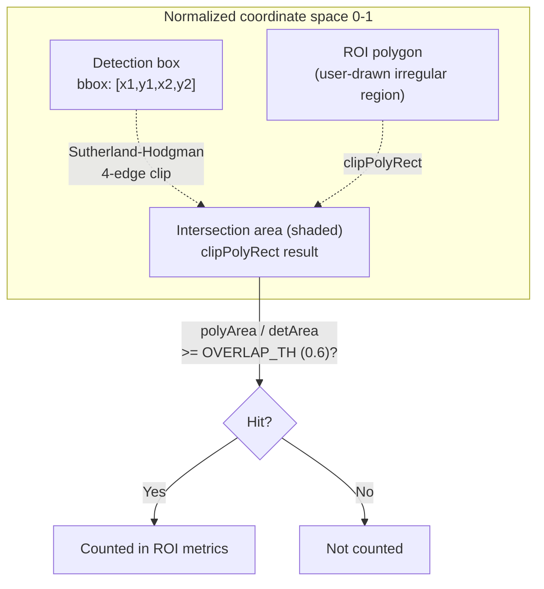

# Data Contract: Full-pipeline schema from MQTT telemetry to virtual metrics

> This section is the **contract reference page** for the ne101_camera case study MVP phase, covering the three-layer contract (device telemetry, extension response, virtual metrics), four responseType normalizations, JSON string parsing pitfalls, and the ROI overlap detection algorithm.

---

## The Three-Layer Data Contract Model

The ne101_camera data contract is not a flat schema table — it is a **three-layer pipeline**. Layer 1 is the raw telemetry pushed by the NE101 device via MQTT (image URL/base64 + battery + timestamp and other scalars); Layer 2 is the inference response returned by the AI extension (one of four `responseType` values, each with a different field structure); Layer 3 is the synthetic virtual metrics generated by the component's Transform (prefixed with `virtual.<ext_id>.`, written back to the device metrics store by the platform, then read and rendered by the component). There are two "shape conversion boundaries" between these three layers: boundary A (device telemetry to extension input) is bridged by `input_raw` inside `generateTransformJsCode`; boundary B (extension response to virtual metrics) is handled by the normalization logic inside the same code generator. The fundamental reason for splitting into three layers instead of one big table is **decoupling** — the device protocol (MQTT topic names, field naming) may change with firmware upgrades, the AI extension's response format is decided by the extension author, and the virtual metrics schema is owned by the component itself. With three-layer separation, a change in any one layer does not bleed through to the other two.

The diagram below strings the three layers left-to-right, labeling each layer's "owner" and key fields for easy cross-referencing in subsequent subsections.

```mermaid
graph LR
    DEV["Layer 1: Device Telemetry<br/>Owned by NE101 device<br/>MQTT: devices/&#123;id&#125;/telemetry<br/>imageUrl / battery / ts"]
    WS["Platform Store<br/>(wsValues state)"]
    TR["Layer 2: Extension Response<br/>Owned by extension author<br/>responseType: 1 of 4<br/>boxes / objects / detections / text_blocks"]
    VM["Layer 3: Virtual Metrics<br/>Owned by component<br/>virtual.&lt;ext_id&gt;.<br/>detections / total_count / source_ts"]
    UI["Component Render<br/>(Canvas + detection boxes)"]

    DEV -->|"MQTT publish"| WS
    WS -->|"input_raw = &#123;image, ts&#125;"| TR
    TR -->|"normalized to<br/>&#123;bbox, label, confidence&#125;"| VM
    VM -->|"read + source_ts alignment"| UI
```



There is one critical timing convention in this chain: **the virtual metric's `source_ts` must match the current image's `ts` before the component renders the corresponding detection boxes**. This is because extension inference is asynchronous — when the user sees image A at second 5, the detections for image A may still be queuing in the extension, while the detections already in the store are actually for image B from second 0. Without `source_ts` alignment, the user would see "image A overlaid with image B's detection boxes" — a temporal mismatch. The alignment logic lives at [`bundle.js` L858-L874](https://github.com/camthink-ai/NeoMind-Dashboard-Components/blob/main/components/ne101_camera/bundle.js#L858-L874), expanded in 4.4:

```js
// bundle.js L858-L874
var vSourceTs = getFirst(vals, [pfx + 'source_ts', 'values.' + pfx + 'source_ts']);
// Match: detections' source_ts must align with the current image timestamp
var imgTsVal = imgTs;
var tsMatch = !vSourceTs || !imgTsVal || String(vSourceTs) === String(imgTsVal);
if (Array.isArray(vDet) && vDet.length > 0 && tsMatch) {
  detections = vDet;
  lastDetsRef.current = vDet;
  lastDetsTsRef.current = imgTsVal;
} else if (Array.isArray(vDet) && vDet.length > 0) {
  // Detections exist but from a different image — cache but don't display
  lastDetsRef.current = vDet;
  lastDetsTsRef.current = vSourceTs;
} else if (lastDetsRef.current.length > 0 && lastDetsTsRef.current != null &&
           String(lastDetsTsRef.current) === String(imgTsVal)) {
  // No detections in store — use cache only if it matches current image
  detections = lastDetsRef.current;
}
```
[Source: bundle.js L858-L874](https://github.com/camthink-ai/NeoMind-Dashboard-Components/blob/main/components/ne101_camera/bundle.js#L858-L874)

---

## Device Telemetry: MQTT Topics and WebSocket Messages

NE101 device telemetry is published via MQTT to the `devices/{device_id}/telemetry` topic. The NeoMind platform subscribes, then pushes deltas to the frontend component's `wsValues` state via WebSocket. The key device metrics consumed by the component are concentrated in [`bundle.js` L830-L842](https://github.com/camthink-ai/NeoMind-Dashboard-Components/blob/main/components/ne101_camera/bundle.js#L830-L842):

```js
// bundle.js L830-L842
var batteryVal = getFirst(vals, ['values.battery', 'battery']);
var devName = device.name || getFirst(vals, ['values.devName', 'devName']) || 'NE101 Camera';

var metrics = (deviceType && deviceType.metrics) || [];
var displayMetrics = [];
for (var i = 0; i < metrics.length; i++) {
  var m = metrics[i];
  var n = (m.name || '').toLowerCase();
  if (n === 'ts' || n === 'timestamp' || n === 'time') continue;
  if (n === 'values.battery' || n === 'battery') continue;
  if (n.indexOf('image') >= 0 || n.indexOf('photo') >= 0 || n.indexOf('picture') >= 0) continue;
  if (n === 'values.devname' || n === 'devname') continue;
  displayMetrics.push(m);
}
```
[Source: bundle.js L830-L842](https://github.com/camthink-ai/NeoMind-Dashboard-Components/blob/main/components/ne101_camera/bundle.js#L830-L842)

- **`battery`** — Battery percentage (0-100), mapped by `batteryMeta()` to a green/yellow/red color bar ([L830](https://github.com/camthink-ai/NeoMind-Dashboard-Components/blob/main/components/ne101_camera/bundle.js#L830-L830)). This is the core health indicator for NE101's low-power design.
- **Image fields (multi-alias)** — The captured JPEG, either as a URL or as base64. The component uses `getFirst()` to probe a list of aliases by priority, see [`bundle.js` L634](https://github.com/camthink-ai/NeoMind-Dashboard-Components/blob/main/components/ne101_camera/bundle.js#L634-L634): `['values.imageUrl', 'values.image', 'values.photo', 'imageUrl', 'image', 'photo', 'values.picture', 'picture']`. Multiple aliases exist because field naming is inconsistent across firmware versions and deployment modes — some firmware uses `imageUrl`, some uses `image`, and REST fetch and WebSocket push may use different field names. `getFirst` returns the first non-empty value in array order, accommodating this legacy baggage.
- **`ts` / `timestamp`** — Capture timestamp, used for `source_ts` alignment (see 4.4) and as an image cache-buster (see below).
- **`devName`** — Device name, falling back to `device.name` ([L831](https://github.com/camthink-ai/NeoMind-Dashboard-Components/blob/main/components/ne101_camera/bundle.js#L831-L831)).

Image source handling has several pitfalls, all concentrated in [`bundle.js` L634-L648](https://github.com/camthink-ai/NeoMind-Dashboard-Components/blob/main/components/ne101_camera/bundle.js#L634-L648):

```js
// bundle.js L634-L648
var rawImageSrc = getFirst(_vals, ['values.imageUrl', 'values.image', 'values.photo', 'imageUrl', 'image', 'photo', 'values.picture', 'picture']);
// Guard: only strings can be image sources — numbers/objects from metrics crash .indexOf()/.match()
if (typeof rawImageSrc !== 'string') rawImageSrc = null;
var isBase64Image = rawImageSrc && (rawImageSrc.indexOf('data:image') === 0 || !rawImageSrc.match(/^https?:\/\//));
// For URL images: append ts-based cache buster; for base64: use as-is (ts change triggers re-render via new imageSrc ref)
var imgTs = getFirst(_vals, ['ts', 'values.ts', 'timestamp', 'values.timestamp']);
var imageSrc;
if (!rawImageSrc) {
  imageSrc = '';
} else if (isBase64Image) {
  // Ensure base64 has data URI prefix for  display
  imageSrc = rawImageSrc.indexOf('data:') === 0 ? rawImageSrc : 'data:image/jpeg;base64,' + rawImageSrc;
} else {
  imageSrc = rawImageSrc + (rawImageSrc.indexOf('?') >= 0 ? '&' : '?') + '_t=' + (imgTs || 0);
}
```
[Source: bundle.js L634-L648](https://github.com/camthink-ai/NeoMind-Dashboard-Components/blob/main/components/ne101_camera/bundle.js#L634-L648)

**Pitfall 1: Non-string guard (commit `c4fe7bf`)**. L636 has `if (typeof rawImageSrc !== 'string') rawImageSrc = null;`. This is because some backends accidentally store the image field as a number (e.g., storing the base64 length as the value) or as an object (a nested metric wrapper). Without the guard, the subsequent `rawImageSrc.indexOf('data:image')` and `rawImageSrc.match(/^https?:\/\//)` would throw `TypeError: rawImageSrc.indexOf is not a function`, white-screening the entire component. Commit `c4fe7bf` (`fix(ne101): guard rawImageSrc against non-string metric values`) was specifically written to fix this crash.

**Pitfall 2: base64 vs URL detection**. L637 uses `isBase64Image = rawImageSrc.indexOf('data:image') === 0 || !rawImageSrc.match(/^https?:\/\//)`. Note the "or" instead of "and" — anything not starting with `http(s)://` is treated as base64. This is an **optimistic judgment**: better to try treating a weird string as base64 once (the `` tag silently fails on invalid src) than to send a base64 string as a URL request (which triggers a meaningless HTTP request + CORS error).

**Pitfall 3: Cache-buster for URL images**. L647 appends `_t=<ts>` to URL images: `imageSrc = rawImageSrc + (...) + '_t=' + (imgTs || 0);`. After each NE101 capture, the URL may not change (same `devices/{id}/latest.jpg` endpoint), but the image content does. Without a cache-buster, the browser reuses the cached stale image and the user never sees the new capture. Base64 images don't need a cache-buster because each base64 string is itself a new reference — `` re-decodes it.

---

## Four Extension Response Normalizers

The AI extension's response format is decided by the extension author; ne101_camera cannot control it. To handle this uniformly inside the component, `generateTransformJsCode` normalizes all four `responseType` values into the same internal shape: `{bbox: [x1, y1, x2, y2], label, confidence}` (coordinates normalized to 0-1). The dispatch logic for these four responseTypes is at [`bundle.js` L288-L329](https://github.com/camthink-ai/NeoMind-Dashboard-Components/blob/main/components/ne101_camera/bundle.js#L288-L329):

| responseType | Data path | Field format |
|---|---|---|
| `boxes_x1y1x2y2` | `r.boxes` | `` `{x1,y1,x2,y2}` `` pixel coords (normalized to 0-1 in code) |
| `objects_bbox` | `r.objects[].bbox` | `` `{x,y,w,h}` `` pixel coords |
| `detections_bbox` | `r.detections[].bbox` | `` `{x,y,w,h}` `` pixel coords |
| `ocr_text_blocks` | `r.text_blocks` | See code block below (has polygon) |

**`boxes_x1y1x2y2`** (locate-anything-v2 family)** — see [`bundle.js` L288-L297](https://github.com/camthink-ai/NeoMind-Dashboard-Components/blob/main/components/ne101_camera/bundle.js#L288-L297). The response structure is `r.boxes[]`, where each box has `x1, y1, x2, y2` (pixel coordinates) + `score`/`confidence`. Labels are not in the boxes — they are in the `r.answer` string as `<ref>label</ref>` tags in order. The code uses regex `match(/<ref>(.*?)<\/ref>/g)` to extract the label array, then pairs them by index `refTags[i]`. During normalization, coordinates are divided by image dimensions `W/H` to get 0-1 range. Commit `8656148` (`feat(ne101): pass NMS IoU threshold 0.5 to locate-anything-v2`) passes an additional `nms_iou_threshold: 0.5` parameter to this extension at L282, controlling the non-maximum suppression threshold.

**`objects_bbox`** (image-analyzer-v2)** — see [`bundle.js` L298-L306](https://github.com/camthink-ai/NeoMind-Dashboard-Components/blob/main/components/ne101_camera/bundle.js#L298-L306). The response structure is `r.objects[]`, where each object has `label`, `confidence`, and `bbox: {x, y, width, height}` (pixel coordinates). Normalization converts `{x, y, width, height}` to `[x1, y1, x2, y2]`: `x2 = x + width`, `y2 = y + height`, then divides by `W/H`.

**`detections_bbox`** (yolo-device-inference)** — see [`bundle.js` L307-L315](https://github.com/camthink-ai/NeoMind-Dashboard-Components/blob/main/components/ne101_camera/bundle.js#L307-L315). The response structure is `r.detections[]`, with nearly identical field structure to `objects_bbox` (`label`, `confidence`, `bbox: {x, y, width, height}`), only the top-level key changes from `objects` to `detections`. The reason for listing it as a separate responseType instead of reusing `objects_bbox` is that it is image-analyzer-v2 only; shares analyze_image command with yolo but different response path, and yolo-device-inference may add device-specific fields in the future (e.g., inference time, model version).

**`ocr_text_blocks`** (ocr-device-inference)** — see [`bundle.js` L316-L328](https://github.com/camthink-ai/NeoMind-Dashboard-Components/blob/main/components/ne101_camera/bundle.js#L316-L328). The response structure is `r.data.text_blocks[]`, where each block has `text`, `confidence`, `bbox: {x, y, width, height}` and an optional `polygon` (array of polygon vertices). Normalization **preserves the `polygon` field** (`polygon: b.polygon || null`), because OCR text boxes are typically not axis-aligned rectangles (tilted text), and a polygon fits better than a bbox. Coordinates are already normalized to 0-1 and are not divided by `W/H`. Commit `403c0f1` (`fix(ne101): handle {x,y} object format for OCR polygon detection boxes`) fixed a compatibility issue where polygon vertices could arrive in either `{x, y}` object format or `[x, y]` array format:

```js
// bundle.js L316-L328
} else if (mode.responseType === 'ocr_text_blocks') {
  L.push('var data = r.data || r;');
  L.push('var blocks = data.text_blocks || [];');
  L.push('var dets = blocks.map(function(b) {');
  L.push('  var b2 = b.bbox || {};');
  L.push('  return {');
  L.push('    bbox: [b2.x, b2.y, (b2.x||0) + (b2.width||0), (b2.y||0) + (b2.height||0)],');
  L.push('    polygon: b.polygon || null,');
  L.push('    label: b.text || \'\',');
  L.push('    confidence: b.confidence || null');
  L.push('  };');
  L.push('});');
  L.push('var texts = blocks.map(function(b) { return b.text; }).filter(Boolean);');
}
```
[Source: bundle.js L316-L328](https://github.com/camthink-ai/NeoMind-Dashboard-Components/blob/main/components/ne101_camera/bundle.js#L316-L328)

The diagram below presents the mapping from the four responseTypes to the unified internal shape as a tabular mermaid for quick reference.

```mermaid
graph TB
    subgraph RESPONSE["Extension raw response responseType"]
        R1["boxes_x1y1x2y2<br/>r.boxes[].x1/y1/x2/y2<br/>+ ref tags from r.answer"]
        R2["objects_bbox<br/>r.objects[].bbox&#123;x,y,w,h&#125;"]
        R3["detections_bbox<br/>r.detections[].bbox&#123;x,y,w,h&#125;"]
        R4["ocr_text_blocks<br/>r.data.text_blocks[]<br/>+ polygon field"]
    end

    subgraph NORMALIZED["Unified internal shape (normalized 0-1)"]
        UNI["&#123; bbox: [x1,y1,x2,y2],<br/>label,<br/>confidence &#125;"]
    end

    R1 -->|"÷ W/H"| UNI
    R2 -->|"x2=x+w, ÷ W/H"| UNI
    R3 -->|"x2=x+w, ÷ W/H"| UNI
    R4 -->|"keep polygon<br/>already normalized"| UNI
```



**Extension modes catalog**: Behind the four responseTypes is a "modes catalog" for four extensions, defined in the `EXT_MODES` object at [`bundle.js` L155-L171](https://github.com/camthink-ai/NeoMind-Dashboard-Components/blob/main/components/ne101_camera/bundle.js#L155-L171). Each extension maps to a modes array, where each mode has `{id, command, imageArg, responseType, label, args}`. For example, `locate-anything-v2` has 5 modes (object_detection / grounding / text_detection / ground_gui / point), all using the `boxes_x1y1x2y2` response format:

```js
// bundle.js L155-L171
var EXT_MODES = {
  'locate-anything-v2': [
    { id: 'object_detection', command: 'detect', imageArg: 'image_base64', responseType: 'boxes_x1y1x2y2', label: 'Object Detection', desc: 'Detect objects by category', icon: 'search', args: ['categories'] },
    { id: 'grounding', command: 'ground', imageArg: 'image_base64', responseType: 'boxes_x1y1x2y2', label: 'Grounding', desc: 'Find objects by description', icon: 'target', args: ['phrase'] },
    // ... (3 modes omitted)
  ],
  'image-analyzer-v2': [
    { id: 'object_detection', command: 'analyze_image', imageArg: 'image', responseType: 'objects_bbox', label: 'Object Detection', desc: 'YOLOv8 object detection', icon: 'search', args: [] }
  ],
  'yolo-device-inference': [
    { id: 'object_detection', command: 'analyze_image', imageArg: 'image', responseType: 'detections_bbox', label: 'Object Detection', desc: 'YOLOv8 device inference', icon: 'search', args: [] }
  ],
  'ocr-device-inference': [
    { id: 'text_detection', command: 'recognize_image', imageArg: 'image', responseType: 'ocr_text_blocks', label: 'Text Detection', desc: 'OCR text recognition', icon: 'text', args: [] }
  ]
};
```
[Source: bundle.js L155-L171](https://github.com/camthink-ai/NeoMind-Dashboard-Components/blob/main/components/ne101_camera/bundle.js#L155-L171)

**Permissive fallback strategy**: The `getExtMode()` function at [`bundle.js` L181-L193](https://github.com/camthink-ai/NeoMind-Dashboard-Components/blob/main/components/ne101_camera/bundle.js#L181-L193) returns a default `object_detection` mode object (`responseType: 'boxes_x1y1x2y2'`) when the extension ID is not in `EXT_MODES`. This is a **design decision**:

```js
// bundle.js L181-L193
// Fallback: return default object_detection mode for unknown extensions
// This allows Transform creation to proceed even for unlisted extensions
return {
  id: templateName || 'object_detection',
  command: 'detect',
  imageArg: 'image',
  responseType: 'boxes_x1y1x2y2',
  label: 'Object Detection',
  desc: 'Generic detection',
  icon: 'search',
  args: []
};
```
[Source: bundle.js L181-L193](https://github.com/camthink-ai/NeoMind-Dashboard-Components/blob/main/components/ne101_camera/bundle.js#L181-L193)

- **Choice**: Permissive fallback — unlisted extensions can still create a Transform, defaulting to the `boxes_x1y1x2y2` response format.
- **Alternative**: Strict whitelist — unlisted extensions throw an error "not supported."
- **Reason**: The NeoMind ecosystem's AI extensions will keep growing. If every new extension required updating ne101_camera's `EXT_MODES` whitelist, the component version and extension version would become tightly coupled. Permissive fallback lets "new extension + old component" at least run (most detection-style extensions have a response format close to `boxes_x1y1x2y2`); users only see empty detections when the format truly mismatches, rather than being blocked outright.
- **Cost**: If a new extension's response format is genuinely different (e.g., returns `segments` instead of `boxes`), permissive fallback causes a silent failure — the component doesn't error but detection boxes are empty. This cost is mitigated by the debug logging in 5 Frontend Consume (`console.warn('empty detections')`).

---

## Virtual Metrics Output Contract

The synthetic metrics generated by the Transform follow a strict naming convention: **prefix `virtual.<ext_id_normalized>.` + field name**. `ext_id_normalized` replaces hyphens in the extension ID with underscores (e.g., `yolo-device-inference` becomes `yolo_device_inference`), because metric names cannot contain hyphens (they conflict with some backend key parsers). This normalization happens at [`bundle.js` L854](https://github.com/camthink-ai/NeoMind-Dashboard-Components/blob/main/components/ne101_camera/bundle.js#L854-L854): `var pfx = 'virtual.' + processingExtId.replace(/-/g, '_') + '.';`:

```js
// bundle.js L854
var pfx = 'virtual.' + processingExtId.replace(/-/g, '_') + '.';
```
[Source: bundle.js L854](https://github.com/camthink-ai/NeoMind-Dashboard-Components/blob/main/components/ne101_camera/bundle.js#L854-L854)

The output metrics generation logic is at [`bundle.js` L406-L436](https://github.com/camthink-ai/NeoMind-Dashboard-Components/blob/main/components/ne101_camera/bundle.js#L406-L436), dispatched by template type and ROI configuration:

```js
// bundle.js L406-L436
L.push('var out = {};');
L.push('out[\'' + pfx + 'detections\'] = outputDets;');

if (templateName === 'object_detection') {
  L.push('out[\'' + pfx + 'total_count\'] = outputDets.length;');
  L.push('out[\'' + pfx + 'count_by_class\'] = outputDets.reduce(function(a, d) { a[d.label] = (a[d.label]||0)+1; return a; }, {});');
}

if (rois.length > 0) {
  L.push('out[\'' + pfx + 'roi_count\'] = dets.filter(inAnyRoi).length;');
  L.push('for (var ri = 0; ri < roiRegions.length; ri++) {');
  L.push('  var rn = roiRegions[ri].name; var rp = roiRegions[ri].poly;');
  L.push('  var rd = dets.filter(function(d) { return detOverlapsRoi(d, rp); });');
  L.push('  out[\'' + pfx + '\' + rn + \'_count\'] = rd.length;');
  L.push('  out[\'' + pfx + '\' + rn + \'_detections\'] = rd;');
  // ... (count_by_class omitted for brevity)
  L.push('}');
}

if (mode.responseType === 'ocr_text_blocks') {
  L.push('out[\'' + pfx + 'texts\'] = texts || [];');
}
L.push('out[\'' + pfx + 'inference_time_ms\'] = r.inference_time_ms || r.processing_time_ms || null;');
L.push('out[\'' + pfx + 'source_ts\'] = input_raw && (input_raw.ts || input_raw.timestamp) || null;');
```
[Source: bundle.js L406-L436](https://github.com/camthink-ai/NeoMind-Dashboard-Components/blob/main/components/ne101_camera/bundle.js#L406-L436)

| Output Metric | Condition | Line | Purpose |
|---------------|-----------|------|---------|
| `<pfx>detections` | Always | [L408](https://github.com/camthink-ai/NeoMind-Dashboard-Components/blob/main/components/ne101_camera/bundle.js#L408-L408) | Normalized detection array, the core data source for rendering detection boxes |
| `<pfx>total_count` | `object_detection` template only | [L411](https://github.com/camthink-ai/NeoMind-Dashboard-Components/blob/main/components/ne101_camera/bundle.js#L411-L411) | Total number of detected objects, used for metric card summaries |
| `<pfx>count_by_class` | `object_detection` template only | [L412](https://github.com/camthink-ai/NeoMind-Dashboard-Components/blob/main/components/ne101_camera/bundle.js#L412-L412) | Per-class count object, e.g. `{person: 3, car: 2}` |
| `<pfx>roi_count` | When ROIs are configured | [L417](https://github.com/camthink-ai/NeoMind-Dashboard-Components/blob/main/components/ne101_camera/bundle.js#L417-L417) | Total detections falling inside any ROI (global) |
| `<pfx><roi_name>_count` | Per ROI, when ROIs configured | [L423](https://github.com/camthink-ai/NeoMind-Dashboard-Components/blob/main/components/ne101_camera/bundle.js#L423-L423) | Count of detections inside this ROI |
| `<pfx><roi_name>_detections` | Per ROI, when ROIs configured | [L424](https://github.com/camthink-ai/NeoMind-Dashboard-Components/blob/main/components/ne101_camera/bundle.js#L424-L424) | Detection array inside this ROI |
| `<pfx><roi_name>_count_by_class` | Per ROI + `object_detection` | [L426](https://github.com/camthink-ai/NeoMind-Dashboard-Components/blob/main/components/ne101_camera/bundle.js#L426-L426) | Per-class count inside this ROI |
| `<pfx>texts` | `ocr_text_blocks` template only | [L432](https://github.com/camthink-ai/NeoMind-Dashboard-Components/blob/main/components/ne101_camera/bundle.js#L432-L432) | Array of OCR-recognized text strings |
| `<pfx>inference_time_ms` | Always | [L435](https://github.com/camthink-ai/NeoMind-Dashboard-Components/blob/main/components/ne101_camera/bundle.js#L435-L435) | Extension inference duration (ms), for performance monitoring |
| `<pfx>source_ts` | Always | [L436](https://github.com/camthink-ai/NeoMind-Dashboard-Components/blob/main/components/ne101_camera/bundle.js#L436-L436) | Input image timestamp, **the sole key for detection-image alignment** |

The output prefix and device type rule are hardcoded in `fillTemplate()`: [`bundle.js` L452-L453](https://github.com/camthink-ai/NeoMind-Dashboard-Components/blob/main/components/ne101_camera/bundle.js#L452-L453) sets `output_prefix: 'virtual'` and `rule: { device_type: 'ne101_camera' }`. This means all synthetic metrics live under the `virtual.*` namespace, and the Transform only fires for devices where `device_type === 'ne101_camera'` — preventing other device types' telemetry from being accidentally fed to the AI extension:

```js
// bundle.js L452-L453
js_code: jsCode,
output_prefix: 'virtual',
rule: { device_id: pipe.deviceId || '', device_type: 'ne101_camera' }
```
[Source: bundle.js L452-L453](https://github.com/camthink-ai/NeoMind-Dashboard-Components/blob/main/components/ne101_camera/bundle.js#L452-L453)

**The `source_ts` alignment mechanism** is the most subtle part of the virtual metrics contract. The logic is at [`bundle.js` L858-L874](https://github.com/camthink-ai/NeoMind-Dashboard-Components/blob/main/components/ne101_camera/bundle.js#L858-L874). After reading the virtual metrics, the component extracts `source_ts` (L858) and the current image's `imgTs` (L860), then does a string comparison (L861): `tsMatch = !vSourceTs || !imgTsVal || String(vSourceTs) === String(imgTsVal)`. Only when `tsMatch === true` and the detection array is non-empty does it render the detections onto the Canvas (L862-L865). If `source_ts` doesn't match (meaning the detections are for an older image), they are cached into `lastDetsRef` but not rendered (L866-L869). This mechanism ensures the user never sees "image A overlaid with image B's detection boxes" — a spatiotemporal mismatch:

```js
// bundle.js L858-L874
var vSourceTs = getFirst(vals, [pfx + 'source_ts', 'values.' + pfx + 'source_ts']);
// Match: detections' source_ts must align with the current image timestamp
var imgTsVal = imgTs;
var tsMatch = !vSourceTs || !imgTsVal || String(vSourceTs) === String(imgTsVal);
if (Array.isArray(vDet) && vDet.length > 0 && tsMatch) {
  detections = vDet;
  lastDetsRef.current = vDet;
  lastDetsTsRef.current = imgTsVal;
} else if (Array.isArray(vDet) && vDet.length > 0) {
  // Detections exist but from a different image — cache but don't display
  lastDetsRef.current = vDet;
  lastDetsTsRef.current = vSourceTs;
} else if (lastDetsRef.current.length > 0 && lastDetsTsRef.current != null &&
           String(lastDetsTsRef.current) === String(imgTsVal)) {
  // No detections in store — use cache only if it matches current image
  detections = lastDetsRef.current;
}
```
[Source: bundle.js L858-L874](https://github.com/camthink-ai/NeoMind-Dashboard-Components/blob/main/components/ne101_camera/bundle.js#L858-L874)

---

## The JSON-String Parsing Pitfall

After passing through backend storage serialization/deserialization, the `detections` field may become a **JSON string** rather than an array object. This is a very common contract ambiguity pitfall. Commit `e3a70be` (`fix(ne101): parse JSON string detections from backend virtual metrics`) was written specifically to fix this.

**Root cause**: The NeoMind backend's metrics storage layer has different serialization strategies for different data types. Scalar types (Integer / Float / Boolean / String) are stored directly; complex types (Array / Object) are `JSON.stringify`-ed into strings in some storage backends (e.g., Redis hash fields) and are not automatically `JSON.parse`-d on read. `detections` is an array, so after a storage round-trip it becomes a string like `'[{\"bbox\":[...],\"label\":\"person\"}]'`.

**Defensive parsing** is at [`bundle.js` L857](https://github.com/camthink-ai/NeoMind-Dashboard-Components/blob/main/components/ne101_camera/bundle.js#L857-L857):

```js
// bundle.js L857
if (typeof vDet === 'string') { try { vDet = JSON.parse(vDet); } catch(e) { vDet = null; } }
```
[Source: bundle.js L857](https://github.com/camthink-ai/NeoMind-Dashboard-Components/blob/main/components/ne101_camera/bundle.js#L857-L857)

This is one line of code but contains a **design decision**:

- **Choice**: Silent catch (`catch(e) { vDet = null; }`) — on parse failure, set `vDet` to null; the component renders an empty detection list without throwing.
- **Alternative A**: Throw an exception (`throw new Error('malformed detections JSON')`). Rejected because this would white-screen the entire component — an uncaught exception during React rendering bubbles up to the error boundary, showing the user a crashed card instead of a degraded "image without boxes" experience.
- **Alternative B**: `console.error` the issue but keep the original value. Rejected because keeping the original value (a string) means subsequent code treats it as an array (`.map()`), which still crashes.
- **Reason**: Silent null is "the safest degradation" — the user at least sees the image and scalar metrics like battery; only the detection boxes disappear. During debugging, developers can manually inspect `vDet` in DevTools to determine whether this catch was triggered.
- **Cost**: If the detections JSON has a format bug (e.g., the backend wrote truncated JSON), users silently lose all detection boxes with no UI indication. This cost is considered acceptable because losing detection boxes is a "visual degradation," not "data corruption."

**OCR polygon format compatibility**: Commit `403c0f1` (`fix(ne101): handle {x,y} object format for OCR polygon detection boxes`) fixed another related format pitfall. The `polygon` field returned by OCR extensions (array of polygon vertices) comes in two formats: `[[x,y], ...]` (array pairs) and `[{x, y}, ...]` (object arrays). The frontend renderer must handle both formats simultaneously, otherwise polygon drawing crashes. This is because `ocr-device-inference` and `locate-anything-v2`'s `text_detection` mode serialize polygons inconsistently — the former uses object arrays (consistent with PaddleOCR's native output), the latter uses array pairs (consistent with COCO format).

---

## ROI Overlap Detection Algorithm

ROI (Region of Interest) detection determines "whether a detection box counts as falling inside a user-drawn region of interest." This detection algorithm went through two major evolutions:

**Version 1 (deprecated): Center-point test**. A detection counts if its center point falls inside the ROI rectangle. This implementation is simple (one point-in-rectangle test) but too permissive for large targets — a detection box with 80% of its area outside the ROI but whose center happens to be inside would still be counted as a "hit," inflating the in-ROI count. Commit `2109c45` (`feat(ne101_camera): overlap-based ROI detection instead of center point`) deprecated this approach.

**Version 2 (current): Sutherland-Hodgman polygon clipping + area-ratio threshold**. Uses the classic polygon clipping algorithm to compute "the intersection area of the detection box and the ROI polygon," then divides by the detection box area to get the coverage ratio. If the ratio is >= the threshold, it counts as a hit. The default threshold is 0.6 ([`bundle.js` L341](https://github.com/camthink-ai/NeoMind-Dashboard-Components/blob/main/components/ne101_camera/bundle.js#L341-L341): `pipe.overlapThreshold != null ? pipe.overlapThreshold : 0.6`); commit `636a8ae` (`feat(ne101_camera): make ROI overlap threshold configurable`) exposed it as a user-adjustable field:

```js
// bundle.js L341
L.push('var OVERLAP_TH = ' + (pipe.overlapThreshold != null ? pipe.overlapThreshold : 0.6) + ';');
```
[Source: bundle.js L341](https://github.com/camthink-ai/NeoMind-Dashboard-Components/blob/main/components/ne101_camera/bundle.js#L341-L341)

The clipping algorithm implementation is a group of helper functions, all inside the generated code string ([`bundle.js` L342-L372](https://github.com/camthink-ai/NeoMind-Dashboard-Components/blob/main/components/ne101_camera/bundle.js#L342-L372)):

```js
// bundle.js L342-L372
L.push('var lerpPt = function(a, b, t) { return [a[0] + t * (b[0] - a[0]), a[1] + t * (b[1] - a[1])]; };');
L.push('var clipEdge = function(inp, inside, isect) {');
L.push('  var out = [];');
L.push('  for (var i = 0; i < inp.length; i++) {');
L.push('    var j = (i + 1) % inp.length;');
L.push('    if (inside(inp[i])) { if (inside(inp[j])) out.push(inp[j]); else out.push(isect(inp[i], inp[j])); }');
L.push('    else if (inside(inp[j])) { out.push(isect(inp[i], inp[j])); out.push(inp[j]); }');
L.push('  }');
L.push('  return out;');
L.push('};');
L.push('var clipPolyRect = function(poly, rx1, ry1, rx2, ry2) {');
L.push('  var r = poly.slice();');
L.push('  r = clipEdge(r, function(p){return p[0] >= rx1;}, function(a,b){return lerpPt(a,b,(rx1-a[0])/(b[0]-a[0]));});');
L.push('  r = clipEdge(r, function(p){return p[0] <= rx2;}, function(a,b){return lerpPt(a,b,(rx2-a[0])/(b[0]-a[0]));});');
L.push('  r = clipEdge(r, function(p){return p[1] >= ry1;}, function(a,b){return lerpPt(a,b,(ry1-a[1])/(b[1]-a[1]));});');
L.push('  r = clipEdge(r, function(p){return p[1] <= ry2;}, function(a,b){return lerpPt(a,b,(ry2-a[1])/(b[1]-a[1]));});');
L.push('  return r;');
L.push('};');
L.push('var polyArea = function(p) {');
L.push('  var a = 0;');
L.push('  for (var i = 0; i < p.length; i++) { var j = (i + 1) % p.length; a += p[i][0] * p[j][1] - p[j][0] * p[i][1]; }');
L.push('  return Math.abs(a) / 2;');
L.push('};');
L.push('var detOverlapsRoi = function(d, poly) {');
L.push('  var dx1 = d.bbox[0], dy1 = d.bbox[1], dx2 = d.bbox[2], dy2 = d.bbox[3];');
L.push('  var detArea = (dx2 - dx1) * (dy2 - dy1);');
L.push('  if (detArea <= 0) return false;');
L.push('  var clipped = clipPolyRect(poly, dx1, dy1, dx2, dy2);');
L.push('  if (clipped.length < 3) return false;');
L.push('  return polyArea(clipped) / detArea >= OVERLAP_TH;');
L.push('};');
```
[Source: bundle.js L342-L372](https://github.com/camthink-ai/NeoMind-Dashboard-Components/blob/main/components/ne101_camera/bundle.js#L342-L372)

- `lerpPt(a, b, t)` — Linear interpolation between two points, used to compute the intersection of a clipping edge with a polygon edge.
- `clipEdge(inp, inside, isect)` — The core of Sutherland-Hodgman: iterates over each edge of the polygon, using the `inside` predicate to decide keep/remove/insert-intersection.
- `clipPolyRect(poly, rx1, ry1, rx2, ry2)` — Clips the polygon against the rectangle's four edges (left/right/top/bottom) in sequence, equivalent to "polygon ∩ rectangle."
- `polyArea(p)` — Shoelace formula to compute the polygon area.
- `detOverlapsRoi(d, poly)` — The main entry point: computes the detection box area, uses `clipPolyRect` to clip the ROI polygon to the detection box bounds, computes the intersection area, and checks `polyArea(clipped) / detArea >= OVERLAP_TH`.

**ROI serialization format**: ROIs are `{name, points: [{x,y},...]}` in the config panel, serialized into the generated code as `{name, poly: [[x,y],...]}` ([`bundle.js` L336-L338](https://github.com/camthink-ai/NeoMind-Dashboard-Components/blob/main/components/ne101_camera/bundle.js#L336-L338)):

```js
// bundle.js L336-L338
var roiSer = rois.map(function(roi) {
  return { name: roi.name, poly: roi.points.map(function(p) { return [p.x, p.y]; }) };
});
```
[Source: bundle.js L336-L338](https://github.com/camthink-ai/NeoMind-Dashboard-Components/blob/main/components/ne101_camera/bundle.js#L336-L338)

The `name` field is sanitized via regex ([`bundle.js` L212](https://github.com/camthink-ai/NeoMind-Dashboard-Components/blob/main/components/ne101_camera/bundle.js#L212-L212): `/[^a-zA-Z0-9_\u4e00-\u9fff]/g, '_'`), keeping only letters, digits, underscores, and CJK Unified Ideographs — because `name` gets concatenated into the virtual metric name (`<pfx><roi_name>_count`), and metric names cannot contain spaces or special characters:

```js
// bundle.js L212
result.push({ name: (r.name || 'ROI ' + (i + 1)).replace(/[^a-zA-Z0-9_\u4e00-\u9fff]/g, '_'), points: pts });
```
[Source: bundle.js L212](https://github.com/camthink-ai/NeoMind-Dashboard-Components/blob/main/components/ne101_camera/bundle.js#L212-L212)

**roiAction modes**: [`bundle.js` L379-L385](https://github.com/camthink-ai/NeoMind-Dashboard-Components/blob/main/components/ne101_camera/bundle.js#L379-L385) defines three ROI action modes:

```js
// bundle.js L379-L385
if (roiAction === 'filter') {
  L.push('var filtered = dets.filter(inAnyRoi);');
} else if (roiAction === 'filter_outside') {
  L.push('var filtered = dets.filter(function(d) { return !inAnyRoi(d); });');
} else {
  L.push('var filtered = dets;');
}
```
[Source: bundle.js L379-L385](https://github.com/camthink-ai/NeoMind-Dashboard-Components/blob/main/components/ne101_camera/bundle.js#L379-L385)

- `filter` — Keep only detections that fall inside an ROI (outside-ROI detections are discarded).
- `filter_outside` — Keep only detections that fall outside an ROI (inside-ROI detections are discarded; used for "exclude interference zone" scenarios).
- Default (`count`) — Keep all detections, but additionally compute in-ROI count metrics (does not modify `outputDets`).

The diagram below visualizes the clipping process when a detection box partially overlaps an ROI polygon: the intersection of the detection box and ROI polygon (shaded area) divided by the detection box area — if >= 0.6, it counts as a hit.



**The 0.6 threshold tradeoff** — this is a **design decision**:

- **Choice**: Default `OVERLAP_TH = 0.6`, adjustable by the user in the `[0, 1]` range.
- **Alternative A**: 0.5 (majority vote). Rejected because 0.5 means "if half the detection box is inside the ROI, it counts," which is still too permissive for large targets hugging the ROI boundary, inflating counts.
- **Alternative B**: 1.0 (full containment). Rejected because 1.0 requires the detection box to be fully inside the ROI, but in practice targets frequently hug the ROI edge; 1.0 misses these edge cases, undercounting.
- **Reason**: Empirically, 0.6 balances precision and recall for most edge-detection scenarios — too low (e.g., 0.5) inflates counts, too high (e.g., 1.0) misses valid detections. Users can adjust via the config panel slider.

---

## WS-Priority + REST Backfill Dual Channel

ne101_camera's data ingestion uses a **dual-channel strategy**: WebSocket push (real-time deltas) as primary, REST pull (full backfill) as secondary. The comment documenting this strategy is at [`bundle.js` L1601-L1602](https://github.com/camthink-ai/NeoMind-Dashboard-Components/blob/main/components/ne101_camera/bundle.js#L1601-L1602):

```js
// bundle.js L1601-L1602
// Fetch preview image from bound device
// Priority: 1. deviceImageSrc prop (from platform store, populated by WebSocket)
//           2. REST fetch via fetchDeviceValues (fallback)
```
[Source: bundle.js L1601-L1602](https://github.com/camthink-ai/NeoMind-Dashboard-Components/blob/main/components/ne101_camera/bundle.js#L1601-L1602)

**WebSocket path (Priority 1)**: After NE101 device telemetry arrives via MQTT at the platform, the platform pushes deltas to the frontend via WebSocket. The frontend platform's device store updates, then injects `deviceImageSrc` and `virtualMetrics` into the component via React props (corresponding to `wsValues` state inside the component). This is the **real-time channel** — millisecond latency, but reliability is limited by WS connection state.

**REST path (Priority 2)**: The component actively pulls the device's full `currentValues` via `window.neomind.fetchDeviceValues(deviceId)` ([`bundle.js` L1619](https://github.com/camthink-ai/NeoMind-Dashboard-Components/blob/main/components/ne101_camera/bundle.js#L1619-L1619)). This is the **reliable channel** — always returns a response, but latency is an HTTP round-trip (200-500ms). REST fetch is triggered in three scenarios: (a) on initial component mount before WS has delivered the first message (commit `b0be12b`); (b) during WS reconnection; (c) when the WS-pushed delta only contains small metrics (battery/ts) and image data needs REST backfill (commit `0eedd27`):

```js
// bundle.js L1619
neomind.fetchDeviceValues(deviceId).then(function (v) {
```
[Source: bundle.js L1619](https://github.com/camthink-ai/NeoMind-Dashboard-Components/blob/main/components/ne101_camera/bundle.js#L1619-L1619)

**Merge strategy** at [`bundle.js` L631](https://github.com/camthink-ai/NeoMind-Dashboard-Components/blob/main/components/ne101_camera/bundle.js#L631-L631):

```js
// bundle.js L631
var _vals = Object.assign({}, wsValues, imageData || {}, virtualDataState[0] || {});
```
[Source: bundle.js L631](https://github.com/camthink-ai/NeoMind-Dashboard-Components/blob/main/components/ne101_camera/bundle.js#L631-L631)

The merge order is **WS base -> REST image overlay -> virtual metrics overlay**. `Object.assign`'s "last wins" semantics means: if WS pushed an `imageUrl` but REST also fetched a newer `imageUrl`, the REST value wins. This order is deliberate — REST is triggered on-demand (mount / WS hole), and its data is fresher than the stale deltas in the WS cache.

**Why dual-channel is needed** — this is a **design decision**:

- **Choice**: WS + REST dual-channel, WS priority, REST backfill.
- **Alternative A**: WS-only. Rejected because:

    1. WebSocket drops messages during reconnection (network jitter, tab switch), leaving the component blank
    2. large base64 images may exceed the WS message size limit (platform default 1MB), so WS only pushes small metrics and images must come via REST
    3. on first mount the WS subscription hasn't been established yet, leaving the screen blank for several hundred milliseconds.
- **Alternative B**: REST-only (timed polling). Rejected because:

    1. polling latency is high (after NE101 captures, you wait for the next poll cycle to see it), degrading UX
    2. polling generates many wasteful requests (most polls find no image change), wasting bandwidth and backend resources
    3. multiple components polling the same device simultaneously cause thundering herd.
- **Reason**: WS provides real-time responsiveness (see new image within seconds of NE101 capture); REST provides a reliability floor (within 500ms of mount, there is always data). The two are complementary and indispensable.
- **Cost**:

    1. Code complexity doubles — the component maintains both WS listener and REST fetch paths
    2. data races — WS pushes and REST returns may interleave, and stale REST data may overwrite fresh WS data. Races are mitigated by `Object.assign`'s "last wins" semantics + REST only firing during WS holes.

---

## Design Decisions Summary

The 5 design decisions covered on this page are summarized below, each with the "choice / alternative / reason" three-part structure.

| Decision | Choice | Alternative | Reason |
|----------|--------|-------------|--------|
| **Permissive extension fallback** | Unlisted extensions default to `boxes_x1y1x2y2` response format ([L181-L193](https://github.com/camthink-ai/NeoMind-Dashboard-Components/blob/main/components/ne101_camera/bundle.js#L181-L193)) | Strict whitelist: unlisted extensions error out | Decouples component version from extension version; "new extension + old component" still runs |
| **Silent JSON catch** | `JSON.parse` failure sets null, no throw ([L857](https://github.com/camthink-ai/NeoMind-Dashboard-Components/blob/main/components/ne101_camera/bundle.js#L857-L857), commit `e3a70be`) | Throw / `console.error` but keep original value | Avoids component white-screen; degrades to "image without boxes" experience |
| **0.6 ROI overlap threshold** | Sutherland-Hodgman clipping + area ratio >= 0.6 ([L341](https://github.com/camthink-ai/NeoMind-Dashboard-Components/blob/main/components/ne101_camera/bundle.js#L341-L341), commit `636a8ae`) | 0.5 (too permissive) / 1.0 (too strict) | 0.6 balances precision and recall for most edge-detection scenarios; user-adjustable |
| **Dual-channel WS+REST** | WS priority + REST backfill ([L1601-L1602](https://github.com/camthink-ai/NeoMind-Dashboard-Components/blob/main/components/ne101_camera/bundle.js#L1601-L1602), commits `b0be12b` + `0eedd27`) | WS-only / REST-only polling | WS provides real-time; REST provides reliability floor; complementary |
| **Optimistic base64 judgment** | Anything not `http(s)://` is treated as base64 ([L637](https://github.com/camthink-ai/NeoMind-Dashboard-Components/blob/main/components/ne101_camera/bundle.js#L637-L637)) | Strict: must start with `data:image` to count as base64 | Better to try a weird string as base64 once (`` fails silently) than to request a base64 string as a URL |

These 5 decisions share a common theme: **choosing permissive degradation over strict error-throwing in "contract ambiguity zones."** The backend's serialization strategy, the extension's response format, WS reliability — none of these are within the component's control, so the component can only use defensive code to cushion the blow. This "permissive input + strict normalization" philosophy is the fundamental reason ne101_camera can operate stably across the combinatorial space of 4 extensions x 2 image formats x 2 storage serializations.

### Key commit index

| Commit | Type | One-line summary | Section |
|--------|------|------------------|---------|
| [`e3a70be`](https://github.com/camthink-ai/NeoMind-Dashboard-Components/commit/e3a70be) | fix | parse JSON string detections from backend virtual metrics | 4.5 |
| [`c4fe7bf`](https://github.com/camthink-ai/NeoMind-Dashboard-Components/commit/c4fe7bf) | fix | guard rawImageSrc against non-string metric values | 4.2 |
| [`403c0f1`](https://github.com/camthink-ai/NeoMind-Dashboard-Components/commit/403c0f1) | fix | handle `{x,y}` object format for OCR polygon detection boxes | 4.3 / 4.5 |
| [`2109c45`](https://github.com/camthink-ai/NeoMind-Dashboard-Components/commit/2109c45) | feat | overlap-based ROI detection instead of center point | 4.6 |
| [`636a8ae`](https://github.com/camthink-ai/NeoMind-Dashboard-Components/commit/636a8ae) | feat | make ROI overlap threshold configurable | 4.6 |
| [`b0be12b`](https://github.com/camthink-ai/NeoMind-Dashboard-Components/commit/b0be12b) | fix | initial fetch on mount for image + virtual metrics | 4.7 |
| [`0eedd27`](https://github.com/camthink-ai/NeoMind-Dashboard-Components/commit/0eedd27) | fix | update virtual data on WS-triggered REST fetch | 4.7 |
| [`8656148`](https://github.com/camthink-ai/NeoMind-Dashboard-Components/commit/8656148) | feat | pass NMS IoU threshold 0.5 to locate-anything-v2 | 4.3 |

### Following chapters

- [5 Frontend Consume](./5-frontend-consume.md) (MVP) — How the component reads the normalized detections, colors them by class using `classColor`'s golden-angle HSV rotation, and maps bbox from 0-1 normalized coordinates to Canvas pixel coordinates (the non-linear scaling of `object-cover`).
- [3 Extension Side](./3-extension-side.md) (v1.1) — Execution details of the code generated by `generateTransformJsCode` in the platform sandbox, the `extensions.invoke()` call contract, and how extensions consume `input_raw` and return the four responseTypes.
- Back to [2 Architecture](./2-architecture.md) — The dual-channel data flow and JSON string parsing mentioned on this page are overviewed from an architecture perspective in 2.4.

---

*Last updated: 2026-06-23*
