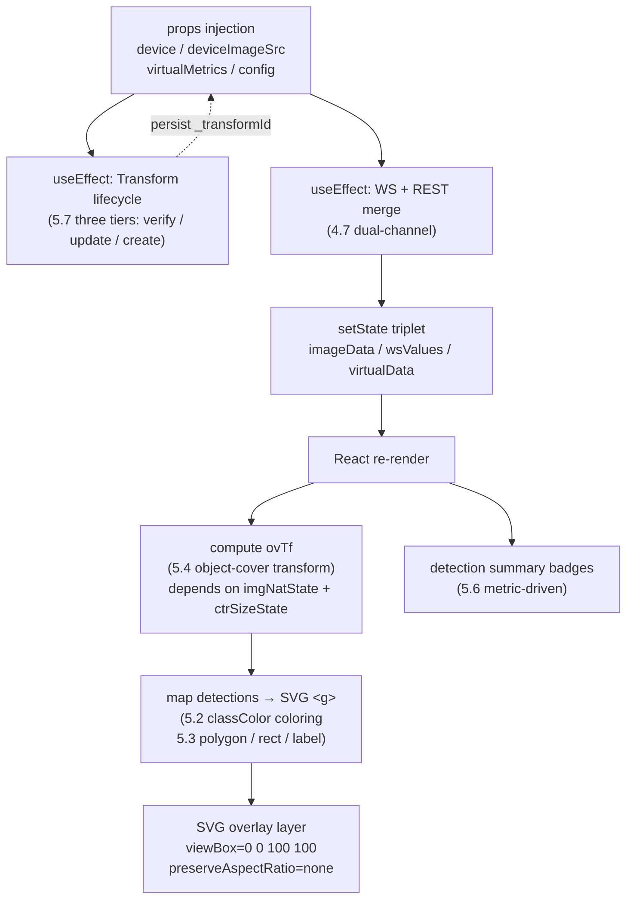
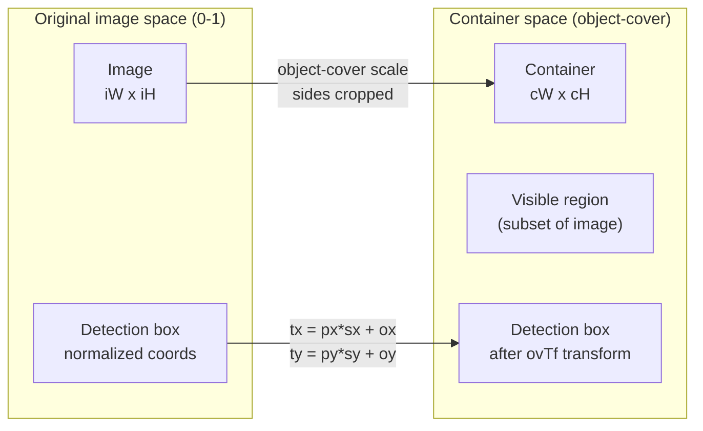
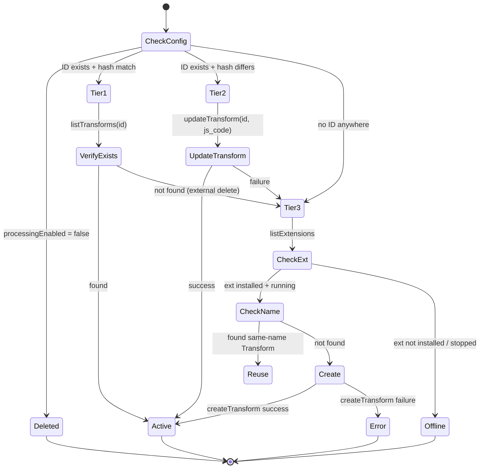

# Frontend Consume: From detections to SVG overlay rendering pipeline

> This page is the **frontend rendering reference** for the ne101_camera MVP, covering the effect-driven rendering pipeline, per-class coloring (golden-angle HSV), SVG overlay rendering, object-cover coordinate transform, and the ResizeObserver callback-ref pattern.

---

## Rendering Pipeline Overview

The ne101_camera rendering path is not a one-shot JSX template but a **state pipeline** driven by multiple effects. The pipeline starts from platform-injected props (`device` / `deviceImageSrc` / `virtualMetrics` / `config` / `onConfigChange`) and ends at the SVG overlay layer mounted on the media `<div>`. In between it passes through five state nodes:

1. the Transform lifecycle effect (create/update/delete the backend Transform, see 5.7)
2. the WS + REST merge effect (fetch image and virtual metrics, see [4.7](./4-data-contract.md))
3. the `imageData` / `wsValues` / `virtualData` triplet of `setState` calls
4. the `ovTf` coordinate transform computation driven by `imgNatState` (image natural dimensions) + `ctrSizeState` (container dimensions, see 5.4)
5. the detections array, colored per-class, mapped into SVG `<g>` elements (see 5.2 / 5.3).

Any state change at any node triggers a React re-render that re-runs the path from `ovTf` computation through SVG mapping.

The diagram below renders this effect-driven pipeline as a flowchart, annotating each step's inputs/outputs and trigger conditions.



**Why this pipeline is effect-driven**: ne101_camera is a "React-in-IIFE" component on the NeoMind platform (see [2.1](./2-architecture.md)). It has no external state management (Redux / Zustand); all cross-frame state is managed with `React.useState` + `React.useRef`. React's core mental model is "UI = f(state)" — whenever state changes, the render function re-runs. The component wires WS pushes, REST backfill, image `onLoad`, and ResizeObserver callbacks all into `setState`, so every external event drives a full re-render through state mutation. The cost of this pattern is the absence of virtual-DOM diffing optimizations (every render recomputes `ovTf` and the detections mapping from scratch), but since a single component's DOM node count stays under 50 (one `<svg>` + N `<g>` elements), the full-rerender overhead is negligible. What is genuinely expensive are async API calls like `neomind.createTransform`; these are strictly confined to effects and guarded by a `cancelled` flag (see [`bundle.js` L709](https://github.com/camthink-ai/NeoMind-Dashboard-Components/blob/main/components/ne101_camera/bundle.js#L709-L709)).

```js
// bundle.js L704-L714
var payload = Object.assign({}, tplCfg, {
  name: transformName,
  scope: device.id,
  description: 'ne101:' + device.id + ':' + processingExtId + ':' + processingTemplate
});
var cancelled = false;

var persist = function (id) {
  transformIdRef.current = id;
  if (onCfgChange) onCfgChange(Object.assign({}, config, { _transformId: id, _transformHash: _configHash }));
};
```

Source: [`bundle.js` L704-L714](https://github.com/camthink-ai/NeoMind-Dashboard-Components/blob/main/components/ne101_camera/bundle.js#L704-L714)

---

## Per-Class Coloring: Golden-Angle HSV

Detection-box color is not fixed; it is determined by the class label (`det.label`). Commit [`c276c23`](https://github.com/camthink-ai/NeoMind-Dashboard-Components/commit/c276c23) (`feat(ne101): per-class detection colors via golden-angle HSV rotation`) introduced the `classColor(label)` function at [`bundle.js` L55-L72](https://github.com/camthink-ai/NeoMind-Dashboard-Components/blob/main/components/ne101_camera/bundle.js#L55-L72):

```js
// bundle.js L55-L72
// Per-class color via golden-angle HSV rotation — maximally distinct hues for any class count.
// Same label always yields the same color; 100+ classes still get good separation.
function classColor(label) {
  var h = 0;
  for (var i = 0; i < label.length; i++) { h = ((h << 5) - h + label.charCodeAt(i)) | 0; }
  var hue = (Math.abs(h) * 137.508) % 360;  // golden angle
  var s = 0.78, v = 0.95;
  var c = v * s, hp = hue / 60, x = c * (1 - Math.abs(hp % 2 - 1)), r = 0, g = 0, b = 0;
  if (hp < 1) { r = c; g = x; }
  else if (hp < 2) { r = x; g = c; }
  else if (hp < 3) { g = c; b = x; }
  else if (hp < 4) { g = x; b = c; }
  else if (hp < 5) { r = x; b = c; }
  else { r = c; b = x; }
  var m = v - c, R = Math.round((r + m) * 255), G = Math.round((g + m) * 255), B = Math.round((b + m) * 255);
  var rgb = R + ',' + G + ',' + B;
  return { stroke: 'rgba(' + rgb + ',0.85)', fill: 'rgba(' + rgb + ',0.08)', text: 'rgba(' + rgb + ',0.95)' };
}
```

Source: [`bundle.js` L55-L72](https://github.com/camthink-ai/NeoMind-Dashboard-Components/blob/main/components/ne101_camera/bundle.js#L55-L72)

The function does three things:

1. **String hash (L58-L59)**: applies the classic `h = ((h << 5) - h + charCodeAt(i)) | 0` accumulator to hash the label string. This is a 32-bit integer hash where the shift-and-subtract is equivalent to multiplying by 31 (`((h << 5) - h) = h * 31`), the same algorithm used by Java's `String.hashCode()`. The `| 0` truncates the result to a 32-bit signed integer.
2. **Golden-angle rotation (L60)**: `hue = (Math.abs(h) * 137.508) % 360`. 137.508° is the golden angle — the shorter arc obtained when the circumference is divided according to the golden ratio. Multiplying the hash by the golden angle and taking mod 360 is equivalent to sampling hues on the color wheel at golden-ratio intervals — mathematically the optimal strategy for maximizing the minimum pairwise distance among any number of points on a circle. The same label always hashes to the same hue (pure function, no side effects), while two labels whose hash values differ by only 1 will have hues 137.508° apart, making visual collision practically impossible.
3. **HSV → RGB (L61-L71)**: with fixed `s = 0.78, v = 0.95` (saturation and value), a six-segment piecewise function converts HSV to RGB, finally returning an `rgba(r,g,b,α)` triplet: `stroke` (outline, α=0.85), `fill` (fill, α=0.08), `text` (label text, α=0.95). The opacity gradient gives detection boxes a recognizable contour (dark outline) without obscuring large areas of the underlying image (light fill).

Before `c276c23`, detection-box color went through two iterations. The earliest version used a fixed blue (`#3b82f6` family); commit [`3cf1b27`](https://github.com/camthink-ai/NeoMind-Dashboard-Components/commit/3cf1b27) (`style(ne101): change detection box and label color from blue to red`) changed it to fixed red — but a fixed color cannot distinguish targets at all in multi-class scenarios. The introduction of golden-angle HSV definitively solved this problem: COCO's 80 classes, or even OpenImages-scale 500+ classes, all receive visually separable hues.

**Design decision: golden-angle hash vs fixed palette vs random color**

- **Choice**: string hash + golden-angle rotation.
- **Alternative A**: fixed palette (e.g. `['#ef4444', '#3b82f6', '#10b981', ...]`, indexed by class). Rejected because palettes have a fixed length (typically 10-20 colors); the Nth class (N > palette length) wraps around to the first color, causing repetition in multi-class scenarios. It also requires maintaining a class-to-index mapping table that cannot be kept consistent across frames and devices.
- **Alternative B**: random color (`Math.random()`). Rejected because the same class gets a different color on every render, causing severe visual flicker and preventing users from building "this color = this class" muscle memory.
- **Rationale**: golden-angle rotation mathematically guarantees maximally dispersed hues for any class count; the pure-function hash guarantees cross-frame consistency; it is zero-config (no preset palette needed). The cost is that HSV space is not perceptually uniform (the blue region has lower human-eye discriminability), but in practice the effect is acceptable for ≤ 50 classes.

---

## SVG Overlay: Polygon + Rect Fallback

Detection boxes are not drawn on a Canvas but overlaid on the `` via an SVG layer. The rendering logic for this SVG layer lives at [`bundle.js` L1210-L1272](https://github.com/camthink-ai/NeoMind-Dashboard-Components/blob/main/components/ne101_camera/bundle.js#L1210-L1272); its core is a `detections.map(...)` call that produces one `<g>` element per detection, containing a shape (polygon or rect) plus a label text node.

```js
// bundle.js L1210-L1272 (trimmed)
(processingEnabled && detections.length > 0 && ovTf)
  ? jsx('svg', {
      key: 'det-svg',
      className: 'absolute inset-0 w-full h-full',
      style: { pointerEvents: 'none' },
      viewBox: '0 0 100 100',
      preserveAspectRatio: 'none',
      children: detections.map(function (det, i) {
        var detLabel = det.label || '';
        var detConf = typeof det.confidence === 'number' ? Math.round(det.confidence * 100) : '';
        var clr = classColor(detLabel || ('det' + i));
        var children = [];

        if (det.polygon && det.polygon.length >= 3) {
          // Polygon mode (OCR scenarios): precise contour
          var pts = det.polygon.map(function(p) {
            var px = Array.isArray(p) ? p[0] : p.x;
            var py = Array.isArray(p) ? p[1] : p.y;
            var tx = ovTf ? ((px * ovTf.sx + ovTf.ox) * 100) : (px * 100);
            var ty = ovTf ? ((py * ovTf.sy + ovTf.oy) * 100) : (py * 100);
            return tx.toFixed(2) + ',' + ty.toFixed(2);
          }).join(' ');
          children.push(jsx('polygon', {
            key: 'poly', points: pts,
            fill: clr.fill, stroke: clr.stroke,
            strokeWidth: '0.4'
          }));
        } else if (det.bbox && det.bbox.length >= 4) {
          // Rect fallback (object detection scenarios)
          // ... (25 lines omitted: rect coords + label text node)
        }

        // ... (14 lines omitted: label text rendering)

        return children.length > 0 ? jsxs('g', { key: 'dbox-' + i, children: children }) : null;
      })
    })
  : null,
```

Source: [`bundle.js` L1210-L1272](https://github.com/camthink-ai/NeoMind-Dashboard-Components/blob/main/components/ne101_camera/bundle.js#L1210-L1272)

**Polygon mode (L1224-L1237)**: when `det.polygon` exists and has ≥ 3 vertices, an `<polygon>` is rendered. This is the precise contour for OCR scenarios (`ocr_text_blocks` responseType) — OCR text boxes are often not axis-aligned rectangles (tilted text, curved text lines), and a polygon hugs the boundary far better than a bbox. Vertices are iterated at L1226-L1231; each vertex is first passed through the `ovTf` transform (see 5.4) and then concatenated into the SVG `points` string.

**Rect fallback (L1238-L1252)**: when only `det.bbox` (a 4-element array `[x1, y1, x2, y2]`) is available, an `<rect>` is rendered. This is the standard rectangular box for object-detection scenarios (`objects_bbox` / `detections_bbox` responseType). The four bbox corner values are each passed through `ovTf` and assembled into the `<rect>` `x / y / width / height` attributes.

**Vertex format compatibility (L1227-L1228)**: commit [`403c0f1`](https://github.com/camthink-ai/NeoMind-Dashboard-Components/commit/403c0f1) (`fix(ne101): handle {x,y} object format for OCR polygon detection boxes`) fixed a critical format-compatibility issue. OCR extensions return polygon vertices in two formats: `[x, y]` array pairs (COCO format) and `{x, y}` objects (PaddleOCR native format). L1227-L1228 probe both formats with `Array.isArray(p) ? p[0] : p.x` — if the vertex is an array, subscripts 0/1 are used; if it is an object, the `.x / .y` properties are read. This compatibility layer appears in both the polygon mode (L1227-L1228) and the label positioning (L1257-L1258), ensuring both vertex formats map correctly to SVG coordinates.

**Label rendering (L1254-L1267)**: the label text (`detLabel + detConf`) is positioned at the first polygon vertex or the bbox top-left corner, offset vertically by -1.5 (SVG units, i.e. 1.5% of the 100-unit viewBox). The label uses the `text` color returned by `classColor` (α=0.95), monospace bold, ensuring readability over complex background imagery. The content is `label + confidence%`, e.g. `person 95%`.

Commit [`b746c02`](https://github.com/camthink-ai/NeoMind-Dashboard-Components/commit/b746c02) (`feat(ne101): render OCR detection boxes as polygons with rect fallback`) introduced this branch structure — before it, all detection boxes were hard-coded as `<rect>`, and OCR's tilted text boxes were force-fitted into axis-aligned rectangles, causing severe visual distortion.

**Design decision: SVG over Canvas**

- **Choice**: an SVG `<svg viewBox="0 0 100 100" preserveAspectRatio="none">` overlay layer.
- **Alternative**: a `<canvas>` 2D context with manual drawing.
- **Rationale**:

    1. SVG is declarative and can be written directly as JSX, fitting React's rendering model naturally — when state changes, React re-invokes `detections.map` to produce new `<polygon>` / `<rect>` elements, with no manual `clearRect` + redraw
    2. SVG natively supports `<text>` elements, so text rendering is handled by the browser engine with no need for Canvas `fillText` + font loading + pixel measurement
    3. SVG's `viewBox="0 0 100 100"` + `preserveAspectRatio="none"` lets detection-box coordinates use normalized values (0-100) directly, aligning naturally with the backend's 0-1 normalized coordinates (multiply by 100)
    4. Canvas would require manual DPI scaling, redraw scheduling, and hit-testing, roughly doubling the code volume.
- **Cost**: SVG underperforms Canvas when the detection-box count is very large (> 500) (each `<g>` is a DOM node). But ne101_camera's typical scenario (a single camera frame) usually has ≤ 30 detections, so SVG's overhead is negligible.

---

## The object-cover Coordinate Transform

Detection-box coordinates are **normalized to image space** (0-1 means the ratio relative to the original image width/height), but the image is rendered in the DOM with `object-cover` — the image is scaled to completely cover the container, with excess cropped. This means only a subset of the original image is visible in the container, and detection-box coordinates must pass through a transform to overlay correctly on the visible region. This transform is `ovTf`, computed at [`bundle.js` L879-L899](https://github.com/camthink-ai/NeoMind-Dashboard-Components/blob/main/components/ne101_camera/bundle.js#L879-L899):

```js
// bundle.js L879-L899
// Object-cover transform: map normalized image coords (0-1) to container coords (0-1)
// object-cover scales image to cover container, cropping excess.
// In image space, only a portion is visible. We map image coords → container coords.
var imgNat = imgNatState[0];
var ctrSize = ctrSizeState[0];
var ovTf = null;
if (imgNat.w > 0 && imgNat.h > 0 && ctrSize.w > 0 && ctrSize.h > 0) {
  var imgAsp = imgNat.w / imgNat.h;
  var cAsp = ctrSize.w / ctrSize.h;
  if (imgAsp > cAsp) {
    // Image wider than container → sides cropped, image fills container height
    var scX = (ctrSize.h / imgNat.h * imgNat.w) / ctrSize.w;
    ovTf = { sx: scX, sy: 1, ox: (1 - scX) / 2, oy: 0 };
  } else {
    // Image taller than container → top/bottom cropped, image fills container width
    var scY = (ctrSize.w / imgNat.w * imgNat.h) / ctrSize.h;
    ovTf = { sx: 1, sy: scY, ox: 0, oy: (1 - scY) / 2 };
  }
```

Source: [`bundle.js` L879-L899](https://github.com/camthink-ai/NeoMind-Dashboard-Components/blob/main/components/ne101_camera/bundle.js#L879-L899)

`ovTf` is a `{sx, sy, ox, oy}` 4-tuple representing the affine transform that maps normalized image coordinates `(px, py)` to normalized container coordinates `(tx, ty)`: `tx = px * sx + ox`, `ty = py * sy + oy`. Two branches:

- **Image aspect ratio > container aspect ratio (L888-L894)**: the image is "wider" than the container; after scaling, both sides of the image are cropped, and the container shows only a center slice of the image width. Here `sy = 1` (no vertical scaling), `sx = (cH / iH * iW) / cW` (horizontal scaling, because the image is compressed into a narrower container width), `ox = (1 - sx) / 2` (horizontal offset to center the crop), `oy = 0`.
- **Image aspect ratio ≤ container aspect ratio (L895-L898)**: the image is "taller" than the container; after scaling, the top and bottom of the image are cropped. Here `sx = 1` (no horizontal scaling), `sy = (cW / iW * iH) / cH` (vertical scaling), `oy = (1 - sy) / 2` (vertical offset), `ox = 0`.

At render time this transform is applied to every coordinate of every detection box: polygon vertices at [L1185-L1187](https://github.com/camthink-ai/NeoMind-Dashboard-Components/blob/main/components/ne101_camera/bundle.js#L1185-L1187) (ROI polygons) and [L1229-L1230](https://github.com/camthink-ai/NeoMind-Dashboard-Components/blob/main/components/ne101_camera/bundle.js#L1229-L1230) (detection polygons), bbox corners at [L1241-L1244](https://github.com/camthink-ai/NeoMind-Dashboard-Components/blob/main/components/ne101_camera/bundle.js#L1241-L1244), and label positions at [L1259-L1260](https://github.com/camthink-ai/NeoMind-Dashboard-Components/blob/main/components/ne101_camera/bundle.js#L1259-L1260). The transform formula is uniformly `tx = (px * ovTf.sx + ovTf.ox) * 100` (the multiply by 100 is because the SVG viewBox is 100x100).

Using detection polygon vertices as an example:

```js
// detection polygon vertices (L1229-L1230):
var dtx = ovTf ? ((px * ovTf.sx + ovTf.ox) * 100) : (px * 100);
var dty = ovTf ? ((py * ovTf.sy + ovTf.oy) * 100) : (py * 100);
```

The same transform is also applied to ROI polygon vertices (L1185-L1187), bbox corners (L1241-L1244), and label positions (L1259-L1260), with an identical formula.

Source: [`bundle.js` L1185-L1260](https://github.com/camthink-ai/NeoMind-Dashboard-Components/blob/main/components/ne101_camera/bundle.js#L1185-L1260)

The image's own `object-cover` is set at [`bundle.js` L1162](https://github.com/camthink-ai/NeoMind-Dashboard-Components/blob/main/components/ne101_camera/bundle.js#L1162-L1162): `className: 'w-full h-full object-cover'`.

```js
                jsx('img', {
                  src: imageSrc,
                  alt: 'Latest capture',
                  className: 'w-full h-full object-cover',
                  loading: 'lazy',
                  style: { imageRendering: 'auto' },
```

Source: [`bundle.js` L1159-L1164](https://github.com/camthink-ai/NeoMind-Dashboard-Components/blob/main/components/ne101_camera/bundle.js#L1159-L1164)



**Design decision: replicate object-cover math manually vs use the browser's native transform**

- **Choice**: manually compute `sx / sy / ox / oy` and perform the affine transform in JS.
- **Alternative**: rely on the browser's native `object-cover` rendering without transforming coordinates.
- **Rationale**: the browser **does not expose** `object-cover`'s internal scale/offset parameters. CSS `object-fit: cover` is a black box — the browser internally computes the scaling and cropping, but offers no API for JS to read "how much was the image scaled, how much was cropped." Without manually replicating this math, detection-box coordinates cannot align with the visible image. The only alternative would be to reverse-engineer via `getBoundingClientRect` + `naturalWidth/Height`, but that is fundamentally the same manual computation, just moved from render time to measurement time. ne101_camera chooses to compute at render time (depending on `imgNatState` + `ctrSizeState`), keeping the logic centralized and tractable.
- **Cost**: if a browser were to change the implementation details of `object-cover` in the future (theoretically impossible, since this is a CSS spec), the manually computed parameters could diverge from the actual rendering. But the CSS spec clearly defines the semantics of `object-fit: cover` (scale to fully cover, crop centered), and this semantics is stable.

---

## The ResizeObserver Callback-Ref Pattern

The `ovTf` computation depends on two pieces of state: the image's natural dimensions (`imgNatState`) and the container dimensions (`ctrSizeState`). The image dimensions are written via the `` callback ([L1165-L1168](https://github.com/camthink-ai/NeoMind-Dashboard-Components/blob/main/components/ne101_camera/bundle.js#L1165-L1168)):

```js
// bundle.js L1153-L1168
hasImage
  ? jsxs('div', {
      key: 'media',
      ref: cbRef.current,
      className: 'relative w-full h-full',
      children: [
        jsx('img', {
          src: imageSrc,
          alt: 'Latest capture',
          className: 'w-full h-full object-cover',
          loading: 'lazy',
          style: { imageRendering: 'auto' },
          onLoad: function (e) {
            var img = e.target;
            if (img && img.naturalWidth) setImgNat({ w: img.naturalWidth, h: img.naturalHeight });
          }
        }),
```

Source: [`bundle.js` L1153-L1168](https://github.com/camthink-ai/NeoMind-Dashboard-Components/blob/main/components/ne101_camera/bundle.js#L1153-L1168)

The container dimensions are written via a ResizeObserver listening to the media `<div>`'s size changes. But there is a classic React trap here: **the media `<div>` is conditionally rendered** — it only mounts when `hasImage` is true ([L1153-L1156](https://github.com/camthink-ai/NeoMind-Dashboard-Components/blob/main/components/ne101_camera/bundle.js#L1153-L1156)), and the image arrives asynchronously (WS push or REST backfill). This means on the component's first render the media `<div>` does not yet exist, and a naive `useEffect(() => { new ResizeObserver(mediaRef.current) }, [])` would find `mediaRef.current === null`, so the ResizeObserver would never be attached.

Commit [`d7836b8`](https://github.com/camthink-ai/NeoMind-Dashboard-Components/commit/d7836b8) (`fix(ne101_camera): ResizeObserver never set up when image loads async`) fixes exactly this. The solution is the **callback ref pattern**, at [`bundle.js` L534-L548](https://github.com/camthink-ai/NeoMind-Dashboard-Components/blob/main/components/ne101_camera/bundle.js#L534-L548):

```javascript
var cbRef = React.useRef(null);
if (!cbRef.current) {
  cbRef.current = function (el) {
    if (roRef.current) { roRef.current.disconnect(); roRef.current = null; }
    mediaRef.current = el;
    if (!el) return;
    var ro = new ResizeObserver(function (entries) {
      var e = entries[0];
      if (e && e.contentRect) setCtrSize({ w: e.contentRect.width, h: e.contentRect.height });
    });
    ro.observe(el);
    roRef.current = ro;
  };
}
```

The key insight is that `cbRef.current` is a **function** (not a ref object), passed as `ref={cbRef.current}` to the media `<div>` ([L1156](https://github.com/camthink-ai/NeoMind-Dashboard-Components/blob/main/components/ne101_camera/bundle.js#L1156-L1156)). React treats function-typed refs specially: when the DOM element mounts, React invokes the function with the element; when it unmounts, React invokes the function with `null`. This precisely solves the "async mount" problem — no matter when the media `<div>` appears, the callback ref is invoked and the ResizeObserver is correctly attached.

The callback logic has three steps:

1. L538 disconnects the previous ResizeObserver if one exists, preventing memory leaks
2. L539 stores the element in `mediaRef` for use by other logic
3. L541-L545 creates a new ResizeObserver whose callback invokes `setCtrSize` to update the container-dimension state.

The initial value of `ctrSizeState` is `{w: 0, h: 0}` ([L530](https://github.com/camthink-ai/NeoMind-Dashboard-Components/blob/main/components/ne101_camera/bundle.js#L530-L530)); when it transitions from 0 to the actual size, a re-render is triggered, `ovTf` goes from `null` to a valid value, and detection boxes transition from "not rendered" (the `&& ovTf` guard at L1211) to "rendered."

```js
    var imgNatState = React.useState({ w: 0, h: 0 });
    var setImgNat = imgNatState[1];
    var mediaRef = React.useRef(null);
    var ctrSizeState = React.useState({ w: 0, h: 0 });
    var setCtrSize = ctrSizeState[1];
```

Source: [`bundle.js` L527-L530](https://github.com/camthink-ai/NeoMind-Dashboard-Components/blob/main/components/ne101_camera/bundle.js#L527-L530)

Commit [`7c92a19`](https://github.com/camthink-ai/NeoMind-Dashboard-Components/commit/7c92a19) (`fix(ne101): fix ROI canvas coordinate mapping for objectFit contain`) is a related earlier fix that handled coordinate-mapping issues from the `objectFit: contain` era; after the switch to `object-cover`, `d7836b8`'s callback ref completed the async-mount scenario. Note: main image rendering switched to object-cover, but the ROI Canvas editor still uses contain coordinate transforms (bundle.js containTransform function).

**Design decision: callback ref vs useEffect+ref vs ResizeObserver on window**

- **Choice**: callback ref (`ref={function(el) { ... }}`).
- **Alternative A**: `useEffect(() => { if (mediaRef.current) new ResizeObserver(...).observe(mediaRef.current); }, [hasImage])`. Rejected because `useEffect` runs **after commit**, but the conditionally rendered DOM node already exists at commit time — the problem is that the dependency array must include `hasImage`, and when `hasImage` flips from false to true the effect runs, but if `hasImage` flips multiple times within the same render cycle (React 18 concurrent mode may interrupt/retry rendering), the effect may run at the wrong time.
- **Alternative B**: attach a ResizeObserver on `window`. Rejected because window resize only captures browser-window size changes, not container size changes caused by layout shifts (e.g. sidebar collapse, grid column drag-resize).
- **Rationale**: callback ref is React's officially recommended pattern for "listening on asynchronously mounted elements" (see the React docs on [ref callback timing](https://react.dev/reference/react-dom/components/common#ref-callback)). It is invoked at the exact moment the DOM node actually mounts/unmounts, with precise timing and no dependence on effect scheduling.
- **Cost**: the callback ref mental model is harder to grasp than `useEffect` ("refs can be functions" is a feature many developers are unfamiliar with), slightly hurting code readability. The comments at L532-L533 explicitly explain why callback ref is used.

---

## Detection Summary Badges

The bottom overlay bar ([`bundle.js` L1067-L1145](https://github.com/camthink-ai/NeoMind-Dashboard-Components/blob/main/components/ne101_camera/bundle.js#L1067-L1145)) renders a set of detection summary badges that let users quickly grasp "what was detected in this frame" without inspecting detection-box details. The design principle for these badges is **metric-driven** — the data source is the virtual metrics already computed by the Transform, not re-aggregated inside the component from the detections array.

```js
// bundle.js L1067-L1095 (trimmed)
var vTotalCount = getFirst(vals, [pfx + 'total_count', 'values.' + pfx + 'total_count']);
var vRoiCount = getFirst(vals, [pfx + 'roi_count', 'values.' + pfx + 'roi_count']);
var vCountByClass = getFirst(vals, [pfx + 'count_by_class', 'values.' + pfx + 'count_by_class']);
var vTexts = getFirst(vals, [pfx + 'texts', 'values.' + pfx + 'texts']);
var maxInfTime = getFirst(vals, [pfx + 'inference_time_ms', 'values.' + pfx + 'inference_time_ms']);

var displayCount = vTotalCount != null ? vTotalCount : detections.length;
var detLabels = detections.slice(0, 4).map(function (d) { return d.label || '?'; });

var detSummaryChildren = [];
detSummaryChildren.push(
  jsx('span', {
    key: 'count',
    style: Object.assign({}, white, bgMetricStyle, textShadow, { fontSize: '9px', fontWeight: '600', padding: '2px 6px', borderRadius: '4px' }),
    children: displayCount + ' detected'
  })
);

// ROI count badge
if (vRoiCount != null) {
  detSummaryChildren.push(
    jsxs('span', {
      key: 'roi-count',
      style: Object.assign({}, white80, { fontSize: '8px', fontWeight: '600', padding: '2px 5px', borderRadius: '3px', background: 'rgba(255,200,50,0.25)', border: '1px solid rgba(255,200,50,0.4)' }),
      children: ['ROI: ', jsx('span', { key: 'n', style: { fontFamily: 'monospace' }, children: vRoiCount })]
    })
  );
}
```

Source: [`bundle.js` L1067-L1145](https://github.com/camthink-ai/NeoMind-Dashboard-Components/blob/main/components/ne101_camera/bundle.js#L1067-L1145)

The rendering condition is `hasAnySummary` (L1063), meaning at least `total_count` exists among the virtual metrics. When satisfied, five badges are rendered in order:

1. **Total count badge (L1078-L1084)**: `displayCount + ' detected'`. `displayCount` prefers the virtual `total_count` (L1074: `vTotalCount != null ? vTotalCount : detections.length`); only when the metric is absent does it fall back to `detections.length`.
2. **ROI count badge (L1087-L1095)**: yellow-tinted, rendered only when ROIs are configured and the `roi_count` metric exists. Displays `ROI: <vRoiCount>`.
3. **Class breakdown (L1097-L1118)**: iterates the keys of the `count_by_class` object (max 4), rendering a `<span>` per key showing `className count`. If `count_by_class` is absent (non-`object_detection` template), falls back to showing the first 4 detection labels (L1112-L1117).
4. **Extracted texts (L1120-L1131)**: purple-tinted, rendered only when the `texts` metric exists (OCR template). Takes the first 3 texts, joins them with commas, and appends an ellipsis if there are more than 3.
5. **Inference time (L1133-L1137)**: monospace font, displays `Math.round(maxInfTime) + 'ms'`.

**Design decision: metric-driven badges vs computed-from-detections**

- **Choice**: read data from virtual metrics (`total_count` / `count_by_class` / `roi_count` / `texts`).
- **Alternative**: aggregate in real time from the `detections` array inside the component's render function (`detections.length`, `detections.reduce(...)` to group-count by label).
- **Rationale**: the Transform **already** computed these aggregations in the backend sandbox (see the `total_count` / `count_by_class` / `roi_count` output contracts in [4.4](./4-data-contract.md)). If the component computed them again, it would be duplicate computation with two risks:

    1. the two computations' logic could diverge (e.g. the Transform computed `roi_count` from ROI-filtered detections, but the component received unfiltered detections), causing badge numbers to disagree with the visible detection-box count
    2. every render would re-reduce a potentially long array, wasting CPU.

    The metric-driven approach keeps the component purely a "presenter" that does no "computation," keeping responsibilities clean.
- **Cost**: if the Transform has a bug and computes a metric incorrectly, the component will faithfully display the wrong number. This cost is mitigated by the "graceful degradation" philosophy of 4.8 — when a metric is missing, it falls back to `detections.length`, never producing a blank screen.

---

## Transform Tiered Lifecycle

The Transform's create/update/delete logic lives at [`bundle.js` L661-L824](https://github.com/camthink-ai/NeoMind-Dashboard-Components/blob/main/components/ne101_camera/bundle.js#L661-L824) inside a `React.useEffect` whose dependency array is `[device.id, processingEnabled, _configHash, _storedTid, _storedHash]` (L824). Inside the effect, dispatching follows three tiers:

```js
// bundle.js L661-L679, L722-L742 (trimmed)
React.useEffect(function () {
  if (_isPreview) return;
  var neomind = window.neomind;
  var onCfgChange = props.onConfigChange;

  // --- Processing OFF: delete Transform ---
  if (!processingEnabled || !processingExtId || !device) {
    if (_storedTid && neomind && neomind.deleteTransform) {
      neomind.deleteTransform(_storedTid).catch(function () {});
    }
    if (_storedTid) {
      transformIdRef.current = null;
      if (onCfgChange) onCfgChange(Object.assign({}, config, { _transformId: '', _transformHash: '' }));
    }
    setExtStatus('idle');
    return;
  }
  // ... (42 lines omitted: payload build) ...

  // --- Tier 1: ID + hash match — verify Transform still exists ---
  if (_storedTid && _storedHash === _configHash) {
    transformIdRef.current = _storedTid;
    setExtStatus('active');
    if (neomind.listTransforms) {
      neomind.listTransforms({ id: _storedTid }).then(function (list) {
        if (cancelled) return;
        var arr = Array.isArray(list) ? list : [];
        var found = false;
        for (var vi = 0; vi < arr.length; vi++) {
          if (arr[vi].id === _storedTid) { found = true; break; }
        }
        if (!found) {
          transformIdRef.current = null;
          if (onCfgChange) onCfgChange(Object.assign({}, config, { _transformId: '', _transformHash: '' }));
        }
      }).catch(function () {});
    }
    return;
  }
  // ... (82 lines omitted: Tier 2 update + Tier 3 create) ...
}, [device ? device.id : null, processingEnabled, _configHash, _storedTid, _storedHash]);
```

Source: [`bundle.js` L661-L824](https://github.com/camthink-ai/NeoMind-Dashboard-Components/blob/main/components/ne101_camera/bundle.js#L661-L824)

**Config hash (L655-L659)**: before the effect, `_configHash` is computed by concatenating all processing-config fields (extId / template / categories / phrase / classFilter / roiEnabled / roiAction / roiOverlap / roiX/Y/W/H / rois) into a single string. If `_configHash === _storedHash` (the hash persisted last time), the configuration is unchanged and Tier 1's fast path is taken.

**Preview guard (L653/L663)**: `_isPreview = typeof props.onConfigChange !== 'function'` — if the component is rendering in the config dialog's preview area (no `onConfigChange` callback), it returns immediately without touching the Transform. This prevents the disaster of "every parameter tweak in the config panel creates/deletes a Transform."

**Tier 1 (L722-L742): ID + hash match → verify existence**. When the stored `_transformId` exists and `_storedHash === _configHash`, the configuration is unchanged and the Transform should still be there. But the backend Transform may have been deleted externally (a user manually deleted it on another page, or the controller cleaned up expired entities), so Tier 1 calls `neomind.listTransforms({ id: _storedTid })` to verify it actually exists (L727-L739). Commit [`ac06344`](https://github.com/camthink-ai/NeoMind-Dashboard-Components/commit/ac06344) (`fix(ne101): verify stored Transform exists in Tier 1`) introduced this verification — before it, Tier 1 merely checked the hash match and assumed the Transform existed, but external deletion would leave the component "thinking the Transform is alive" while never receiving detection results.

**Tier 2 (L744-L763): ID exists but hash differs → update**. When `_transformId` exists but the configuration changed (`_storedHash !== _configHash`), `neomind.updateTransform(activeId, { js_code, ... })` is called to update the Transform's code. On success, the new `_transformHash` is persisted.

**Tier 3 (L766-L821): no ID → create**. When neither a stored ID nor a ref ID is present, the create flow begins. Before creating, two checks run:

1. is the extension installed and not stopped (L806-L817)
2. is there an existing same-name Transform that can be reused (L783-L800).

If neither yields a match, `neomind.createTransform(payload)` is invoked. During creation, the sentinel value `'_creating_'` (L719/L770) prevents concurrent creation — if a previous effect is already creating (`transformIdRef.current === '_creating_'`), the current effect returns immediately and waits for the re-render triggered by successful creation to hit Tier 2.

**Delete path (L668-L679)**: when `processingEnabled` is false, or no extension is selected, or no device is bound, the stored Transform is deleted and `_transformId / _transformHash` are cleared.



**Design decision: three tiers (verify/update/create) vs always delete-and-recreate**

- **Choice**: three-tier dispatch (Tier 1 verify / Tier 2 update / Tier 3 create).
- **Alternative**: `deleteTransform` + `createTransform` on every configuration change.
- **Rationale**:

    1. avoid flicker — during the gap between delete and re-create (potentially hundreds of milliseconds), the component is in a "no Transform" state, detections are interrupted, and users see detection boxes vanish and reappear
    2. preserve virtual-metric continuity — when the Transform's ID changes, the backend may clear the old ID's virtual-metric cache, causing a transient data hole
    3. reduce API calls — Tier 1's fast path (hash match) only does one `listTransforms` verification, one fewer network round-trip than "delete then create."
- **Cost**: high code complexity — three branches + sentinel + cancellation guard + persistence callback occupy 163 lines (L661-L824) for this single effect. But this is the core complexity source of ne101_camera as a "device-bound + AI-processing" component and cannot be simplified away.

---

## Design Decisions Summary

The 6 design decisions covered on this page are consolidated below, each following the "choice / alternative / rationale" triad.

| Decision | Choice | Alternative | Rationale |
|----------|--------|-------------|-----------|
| **Per-class coloring** | String hash + golden-angle HSV rotation ([L55-L72](https://github.com/camthink-ai/NeoMind-Dashboard-Components/blob/main/components/ne101_camera/bundle.js#L55-L72), commit [`c276c23`](https://github.com/camthink-ai/NeoMind-Dashboard-Components/commit/c276c23)) | Fixed palette / random color | Maximally dispersed hues for any class count; pure function guarantees cross-frame consistency; zero-config |
| **SVG overlay rendering** | SVG `<svg viewBox="0 0 100 100">` ([L1210-L1272](https://github.com/camthink-ai/NeoMind-Dashboard-Components/blob/main/components/ne101_camera/bundle.js#L1210-L1272), commit [`b746c02`](https://github.com/camthink-ai/NeoMind-Dashboard-Components/commit/b746c02)) | Canvas 2D manual drawing | Declarative JSX integration, native text support, normalized coordinates align naturally |
| **object-cover transform** | Manual `sx/sy/ox/oy` affine computation ([L879-L899](https://github.com/camthink-ai/NeoMind-Dashboard-Components/blob/main/components/ne101_camera/bundle.js#L879-L899)) | Rely on browser-native `object-cover` | Browser does not expose object-cover's internal scale/offset; the math must be replicated manually |
| **ResizeObserver attachment** | Callback ref pattern ([L534-L548](https://github.com/camthink-ai/NeoMind-Dashboard-Components/blob/main/components/ne101_camera/bundle.js#L534-L548), commit [`d7836b8`](https://github.com/camthink-ai/NeoMind-Dashboard-Components/commit/d7836b8)) | useEffect + ref / window resize | The only correct pattern for asynchronously mounted elements; React-official recommendation |
| **Badge data source** | Read from virtual metrics ([L1067-L1145](https://github.com/camthink-ai/NeoMind-Dashboard-Components/blob/main/components/ne101_camera/bundle.js#L1067-L1145)) | Aggregate from detections array in real time | Avoids duplicate computation, prevents logic divergence, clean separation (component presents, does not compute) |
| **Transform lifecycle** | Three-tier dispatch verify/update/create ([L661-L824](https://github.com/camthink-ai/NeoMind-Dashboard-Components/blob/main/components/ne101_camera/bundle.js#L661-L824), commit [`ac06344`](https://github.com/camthink-ai/NeoMind-Dashboard-Components/commit/ac06344)) | Always delete + create | Avoids detection flicker, preserves metric continuity, reduces API calls |

The common theme across these 6 decisions: **at every "boundary" of frontend rendering, choose determinism over convenience.** Color uses a pure function to guarantee consistency; coordinates use explicit math to guarantee alignment; listeners use callback ref to guarantee timing; data uses metric-driven sourcing to guarantee a single source of truth; the lifecycle uses three-tier dispatch to guarantee continuity. This "explicit-over-implicit" philosophy is the fundamental reason ne101_camera can render stably amid the complex interactions of asynchronous images, asynchronous detections, and dynamically sized containers.

### Key commit index

| Commit | Type | One-line summary | Section |
|--------|------|------------------|---------|
| [`c276c23`](https://github.com/camthink-ai/NeoMind-Dashboard-Components/commit/c276c23) | feat | per-class detection colors via golden-angle HSV rotation | 5.2 |
| [`3cf1b27`](https://github.com/camthink-ai/NeoMind-Dashboard-Components/commit/3cf1b27) | style | change detection box and label color from blue to red | 5.2 |
| [`b746c02`](https://github.com/camthink-ai/NeoMind-Dashboard-Components/commit/b746c02) | feat | render OCR detection boxes as polygons with rect fallback | 5.3 |
| [`403c0f1`](https://github.com/camthink-ai/NeoMind-Dashboard-Components/commit/403c0f1) | fix | handle `{x,y}` object format for OCR polygon detection boxes | 5.3 |
| [`d7836b8`](https://github.com/camthink-ai/NeoMind-Dashboard-Components/commit/d7836b8) | fix | ResizeObserver never set up when image loads async | 5.5 |
| [`7c92a19`](https://github.com/camthink-ai/NeoMind-Dashboard-Components/commit/7c92a19) | fix | fix ROI canvas coordinate mapping for objectFit contain | 5.5 |
| [`ac06344`](https://github.com/camthink-ai/NeoMind-Dashboard-Components/commit/ac06344) | fix | verify stored Transform exists in Tier 1 | 5.7 |
| [`e3a70be`](https://github.com/camthink-ai/NeoMind-Dashboard-Components/commit/e3a70be) | fix | parse JSON string detections from backend virtual metrics | 5.1 |

### Cross-references

- [6 Component Build](./6-component-build.md) (MVP) — the named-export pattern for `NE101CameraPanel`, React-hooks pitfalls inside IIFE (commit `0601cd4`), and the layered design of `AdvancedPanel`. The callback ref pattern and three-tier Transform lifecycle from this section are revisited from a build perspective in 6.
- Back to [4 Data Contract](./4-data-contract.md) — the schemas and output-prefix rules for the `detections` / `total_count` / `count_by_class` virtual metrics consumed here are defined in 4.4.
- Back to [2 Architecture](./2-architecture.md) — the relationship between the effect-driven pipeline described here and the five-layer architecture is expanded in 2.2 / 2.3.

---

*Last updated: 2026-06-23*
