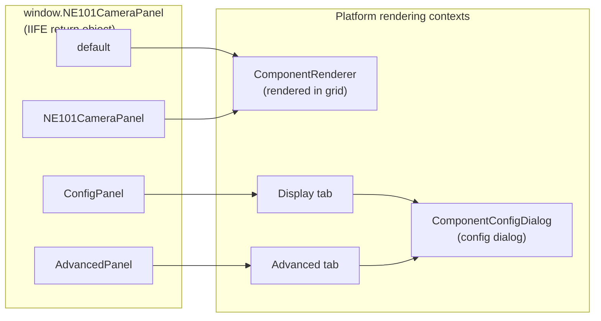
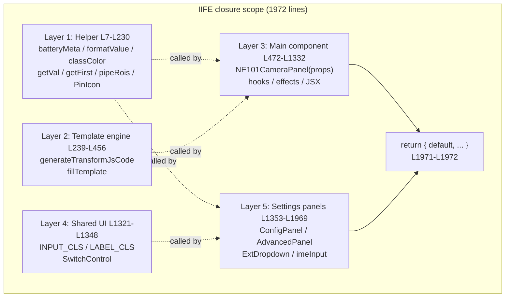
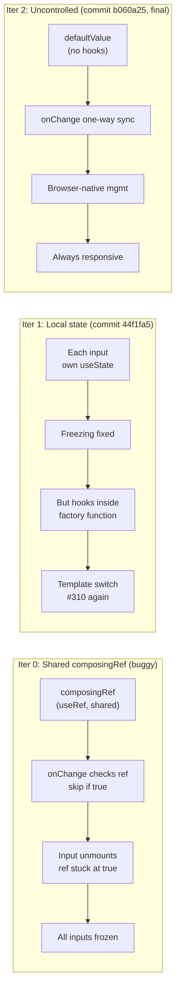

# 6 Component Build: From IIFE Injection to shadcn Replica

> This page is the **component build reference** for the ne101_camera MVP phase (final page of the MVP core trio), covering the IIFE injection pattern, four-key named export, five-layer module structure, three React-in-IIFE hooks pitfalls, and the shadcn CSS class replica strategy.

---

## 6.1 The IIFE Injection Pattern

The first line of ne101_camera's `bundle.js` is not an `import` statement — it is the entry of an IIFE (Immediately Invoked Function Expression). See source: [`bundle.js` L1-L5](https://github.com/camthink-ai/NeoMind-Dashboard-Components/blob/main/components/ne101_camera/bundle.js#L1-L5).

```javascript
var NE101CameraPanel = (function () {
  var React = window.React;
  var jsx = window.jsxRuntime.jsx;
  var jsxs = window.jsxRuntime.jsxs;
  // ... 1965 lines of component logic ...
})();
```

These three lines — `var React = window.React`, `var jsx = window.jsxRuntime.jsx`, and `var jsxs = window.jsxRuntime.jsxs` — are the "injection trio" of the NeoMind component marketplace. Before loading a component, the platform mounts a global `window.React` (single React instance) and `window.jsxRuntime` (providing `jsx` and `jsxs` JSX transform functions) on the host page. The component "borrows" references from `window` at IIFE evaluation time (the instant the `<script>` tag executes). This means the bundle **does not package React** — the entire 1972-line file contains only business logic, no framework runtime: roughly 80KB unminified, smaller when minified.

The fundamental difference between this pattern and ESM-bundled components (Vite / webpack output) is **React instance uniqueness**. ESM bundling typically treats React as `external` (not bundled) or `peerDependency`, but this relies on correct bundler configuration — if one component misconfigures and bundles React into its chunk, a second React instance is created, causing hooks to fail across instances (`useContext` returns undefined, `useRef` throws, `useState` loses state). The IIFE + `window.React` pattern eliminates this problem at the mechanism level: the platform guarantees exactly one React loaded, all 6 marketplace components share the same instance, and no bundler configuration can let a component "bring its own."

The last line of the IIFE is the closure's closing and export, at [`bundle.js` L1971-L1972](https://github.com/camthink-ai/NeoMind-Dashboard-Components/blob/main/components/ne101_camera/bundle.js#L1971-L1972): `return { default: NE101CameraPanel, ... };` followed by `})();`. The returned object is assigned to `var NE101CameraPanel`, which the platform's `<script>` loader then mounts onto `window.NE101CameraPanel`. All `function` and `var` declarations inside the IIFE are protected by the closure scope and do not leak to `window` — this is the core value of IIFE as a module substitute: **zero-dependency private namespace**.

```js
// bundle.js L1971-L1972
return { default: NE101CameraPanel, NE101CameraPanel: NE101CameraPanel, ConfigPanel: ConfigPanel, AdvancedPanel: AdvancedPanel };
})();
```

Source: [`bundle.js` L1971-L1972](https://github.com/camthink-ai/NeoMind-Dashboard-Components/blob/main/components/ne101_camera/bundle.js#L1971-L1972)

**Design decision: IIFE + global injection vs ESM bundle vs UMD**

- **Choice**: `var Name = (function(){ var React = window.React; ... })()` IIFE + global injection pattern.
- **Alternative A**: ESM bundle (Vite / Rollup output, `import React from 'react'`). Rejected because: ESM requires platform support for `<script type="module">` + import maps or bundler resolution, while NeoMind loads components via plain `<script>` tags; more critically, once an ESM `external` config slips, React gets bundled into the chunk, breaking the single-instance guarantee.
- **Alternative B**: UMD (Universal Module Definition). Rejected because: UMD probes three branches (`define` for AMD / `module.exports` for CommonJS / `window` for global), which is redundant for a platform that only uses `<script>` — two of the three branches never fire, needlessly increasing bundle size.
- **Rationale**: IIFE is the only zero-dependency mechanism that simulates a private namespace via "function scope + closure," naturally fitting the platform's `<script>` loading model. The core premise of this ecosystem is "the platform guarantees one React instance," and the IIFE pattern makes it impossible for component code to violate that premise.
- **Cost**: No tree-shaking (unused helper functions still enter the bundle), no TypeScript type checking, no ESLint `rules-of-hooks` plugin (this is the root cause of the 6.4 hook order bug). ne101_camera accepts this cost, relying on `test_bundle.js` for logic test coverage.

---

## 6.2 The Named Export Object

The IIFE's `return` statement returns a **multi-key object**, not a single function. See source: [`bundle.js` L1971](https://github.com/camthink-ai/NeoMind-Dashboard-Components/blob/main/components/ne101_camera/bundle.js#L1971-L1971).

```javascript
return {
  default: NE101CameraPanel,
  NE101CameraPanel: NE101CameraPanel,
  ConfigPanel: ConfigPanel,
  AdvancedPanel: AdvancedPanel
};
```

This object has four keys, corresponding to two addressing modes of the platform loader. The [`global_name`](https://github.com/camthink-ai/NeoMind-Dashboard-Components/blob/main/components/ne101_camera/manifest.json#L38-L38) field in `manifest.json` (`"NE101CameraPanel"`) tells the platform "this bundle is mounted on `window.NE101CameraPanel`," while the [`export_name`](https://github.com/camthink-ai/NeoMind-Dashboard-Components/blob/main/components/ne101_camera/manifest.json#L39-L39) field (also `"NE101CameraPanel"`) tells the platform "from that object, read the `NE101CameraPanel` key's value as the main component." The platform component loader pseudocode: first fetch the bundle object from `window` by `global_name`, then read either `export_name` (named export) or `default` (depending on loader version) to get the component function.

```js
// manifest.json L38-L39
"global_name": "NE101CameraPanel",
"export_name": "NE101CameraPanel"
```

Source: [`manifest.json` L38-L39](https://github.com/camthink-ai/NeoMind-Dashboard-Components/blob/main/components/ne101_camera/manifest.json#L38-L39)

**Why expose both `default` and `NE101CameraPanel` keys**: this is a forward-compatibility insurance. The new Dashboard loader reads `export_name` (named export); the old loader (v1.x era) reads `default`. Both keys point to the same function reference, costing only a pointer (a few bytes), but avoiding the breaking change of "upgrading manifest's `export_name` field causing a white screen on older platforms." metric_card ([6 metric_card](../6-metric-card-component.md)) adopts the same dual-exposure strategy.

**Semantics of the `ConfigPanel` and `AdvancedPanel` exports**: these two keys map to two tabs of the platform's ComponentConfigDialog. The platform's configuration dialog convention: if the bundle object has a `ConfigPanel` key, render it in the "Display" tab; if it has an `AdvancedPanel` key, render it in the "Advanced" tab. The main component (`NE101CameraPanel`) renders in the grid and is a separate rendering context from the configuration dialog — this is why they must be independent export keys, not sub-components of the main component.

The diagram below shows the routing from the bundle object to the platform's two rendering contexts.



**Design decision: multi-key export object vs single default function**

- **Choice**: `return { default, NE101CameraPanel, ConfigPanel, AdvancedPanel }` four-key object.
- **Alternative**: `return NE101CameraPanel` (return the function directly), letting the platform take the main component directly from `window.NE101CameraPanel`, with config panels addressed via other means (e.g., a naming convention like `NE101CameraPanel_ConfigPanel`).
- **Rationale**: the platform needs to **independently address config panels** — the configuration dialog renders only `ConfigPanel` / `AdvancedPanel` when open, without rendering the main component (which lives in the grid). With a single function, the platform would need extra global variables or naming conventions to find config panels, violating the "one bundle, one mount point" contract. The multi-key object concentrates all exports on the single mount point `window.NE101CameraPanel`, enabling the platform to route via property lookup.
- **Cost**: the `default` and `NE101CameraPanel` keys are redundant (same function), but this is the standard cost of forward compatibility, negligible.

---

## 6.3 The Five-Layer Module Structure

The 1972-line IIFE is not a flat slab of code — it is organized into five layers by responsibility. The layering here complements 2.2's five-layer architecture overview (different perspective: 2 on architecture, 6 on build operations), but this section focuses on the **build perspective** — why this layering works without a bundler, and what the build characteristics of each layer are. The five layer boundaries are:

1. **Helper layer** ([L7-L230](https://github.com/camthink-ai/NeoMind-Dashboard-Components/blob/main/components/ne101_camera/bundle.js#L7-L230)): pure function toolset — `batteryMeta`, `formatValue`, `unitStr`, `timeAgo`, `getVal`, `getFirst`, `classColor`, `pipeRois`, `PinIcon`, `ModeIcon`. No React dependency, no state, no side effects; can be extracted to run in Node.js for unit testing.
2. **Template engine layer** ([L239-L456](https://github.com/camthink-ai/NeoMind-Dashboard-Components/blob/main/components/ne101_camera/bundle.js#L239-L456)): `generateTransformJsCode(pipe)` + `fillTemplate` — generates the Transform's JS code string from pipeline config. Pure string building, no React.
3. **Main component layer** ([L472-L1332](https://github.com/camthink-ai/NeoMind-Dashboard-Components/blob/main/components/ne101_camera/bundle.js#L472-L1332)): `NE101CameraPanel(props)` — the main component with all hooks, effects, and JSX rendering logic. 861 lines, the heaviest layer.
4. **Shared UI layer** ([L1321-L1348](https://github.com/camthink-ai/NeoMind-Dashboard-Components/blob/main/components/ne101_camera/bundle.js#L1321-L1348)): shadcn CSS class constants (`INPUT_CLS` / `LABEL_CLS` / `FIELD_CLS` / `DESC_CLS`) + `SwitchControl` button factory.
5. **Settings panels layer** ([L1353-L1969](https://github.com/camthink-ai/NeoMind-Dashboard-Components/blob/main/components/ne101_camera/bundle.js#L1353-L1969)): `ConfigPanel` (Display tab, 5-line stub), `AdvancedPanel` (Advanced tab, 523 lines of heavy logic), `ExtDropdown` (shadcn-style dropdown), `imeInput` (uncontrolled input factory).

Below are representative code snippets for each layer (full code exceeds 1900 lines; only the opening lines of each layer are shown):

```js
// Layer 1: Helper layer L7-L45 (pure function toolset)
function batteryMeta(level) {
  if (level == null) return { bar: 'rgba(128,128,128,0.3)' };
  if (level > 60) return { bar: 'rgba(34,197,94,0.8)' };
  if (level > 20) return { bar: 'rgba(234,179,8,0.8)' };
  return { bar: 'rgba(239,68,68,0.8)' };
}

function formatValue(val, metric) {
  if (val == null) return '--';
  var dt = (metric && metric.data_type) || '';
  if (dt === 'Integer') return typeof val === 'number' ? Math.round(val).toLocaleString() : String(val);
  if (dt === 'Float') return typeof val === 'number' ? val.toFixed(1) : String(val);
  return String(val);
}
// ... (178 lines omitted) ...
```

Source: [`bundle.js` L7-L230](https://github.com/camthink-ai/NeoMind-Dashboard-Components/blob/main/components/ne101_camera/bundle.js#L7-L230)

```js
// Layer 2: Template engine layer L239-L267 (generateTransformJsCode opening)
function generateTransformJsCode(pipe) {
  var extensionId = pipe.extId;
  if (extensionId.indexOf('virtual') === 0) {
    extensionId = extensionId.replace(/^virtual[._-]/, '');
  }
  var templateName = pipe.template;
  var mode = getExtMode(extensionId, templateName);
  if (!mode) return '';

  var extKey = extensionId.replace(/-/g, '_');
  var pfx = extKey + '.';
  var imageArg = mode.imageArg;
  var hasCats = (mode.args || []).indexOf('categories') >= 0 && pipe.categories;
  // ... (189 lines omitted) ...
}
```

Source: [`bundle.js` L239-L456](https://github.com/camthink-ai/NeoMind-Dashboard-Components/blob/main/components/ne101_camera/bundle.js#L239-L456)

```js
// Layer 3: Main component layer L472-L495 (NE101CameraPanel opening)
function NE101CameraPanel(props) {
  var config = props.config || {};
  var showCommands = config.showCommands !== false;
  var location = props.title || config.displayTitle || config.location || '';

  var deviceCtx = props.deviceContext;
  var device = deviceCtx && deviceCtx.device;
  var deviceType = deviceCtx && deviceCtx.deviceType;
  var sendCmd = props.sendDeviceCommand;

  var cmdState = React.useState({});
  var cmdLoading = cmdState[0];
  var setCmdLoading = cmdState[1];
  // ... (824 lines omitted) ...
}
```

Source: [`bundle.js` L472-L1332](https://github.com/camthink-ai/NeoMind-Dashboard-Components/blob/main/components/ne101_camera/bundle.js#L472-L1332)

```js
// Layer 4: Shared UI layer L1321-L1348 (CSS class constants + SwitchControl)
var INPUT_CLS = 'flex h-10 w-full rounded-md border border-input bg-background px-3 py-2 text-sm placeholder:text-muted-foreground focus-visible:outline-none disabled:cursor-not-allowed disabled:opacity-50';
var LABEL_CLS = 'text-sm font-medium leading-none peer-disabled:cursor-not-allowed peer-disabled:opacity-70';
var FIELD_CLS = 'flex flex-col gap-1.5';
var DESC_CLS = 'text-sm text-muted-foreground';

function SwitchControl(checked, onChangeFn) {
  var state = checked ? 'checked' : 'unchecked';
  return jsx('button', {
    type: 'button', role: 'switch', 'data-state': state,
    'aria-checked': String(checked), onClick: onChangeFn,
    className: 'peer inline-flex h-6 w-11 shrink-0 cursor-pointer items-center rounded-full border-2 border-transparent transition-colors focus-visible:outline-none focus-visible:ring-2 focus-visible:ring-ring focus-visible:ring-offset-2 focus-visible:ring-offset-background disabled:cursor-not-allowed disabled:opacity-50 data-[state=checked]:bg-primary data-[state=unchecked]:bg-input',
    children: jsx('span', { 'data-state': state, className: 'pointer-events-none block h-5 w-5 rounded-full bg-background shadow-lg ring-0 transition-transform data-[state=checked]:translate-x-5 data-[state=unchecked]:translate-x-0' })
  });
}
```

Source: [`bundle.js` L1321-L1348](https://github.com/camthink-ai/NeoMind-Dashboard-Components/blob/main/components/ne101_camera/bundle.js#L1321-L1348)

```js
// Layer 5: Settings panels layer L1353-L1369 (ConfigPanel + ROI_ACTIONS + ExtDropdown opening)
function ConfigPanel(props) {
  return jsx('div', { className: 'space-y-3', children: null });
}

var ROI_ACTIONS = [
  { id: 'count', label: 'Count Only', desc: 'Show all detections, count per ROI' },
  { id: 'filter', label: 'Inside Only', desc: 'Only show detections inside ROI' },
  { id: 'filter_outside', label: 'Outside Only', desc: 'Only show detections outside ROI' }
];

function ExtDropdown(props) {
  var exts = props.extensions;
  // ... (606 lines omitted) ...
}
```

Source: [`bundle.js` L1353-L1969](https://github.com/camthink-ai/NeoMind-Dashboard-Components/blob/main/components/ne101_camera/bundle.js#L1353-L1969)

**Why this layering works without a build step**: the key is JavaScript's **function hoisting**. All `function foo() { ... }` declarations inside the IIFE are hoisted to the top of the closure when the IIFE is evaluated, so when layer 5 (L1353) `AdvancedPanel` internally calls layer 4 (L1325) `INPUT_CLS` constant or layer 1 (L57) `classColor` function, there is no "define before use" ordering issue — they are all in the same closure scope. Cross-layer calls are ordinary closure variable lookups, requiring no ESM `import` / `export` resolution, and there is no circular dependency risk because all declarations are completed at IIFE evaluation time.



The dashed lines in the diagram represent "called by" direction: upper layers (smaller line numbers) are called by lower layers (larger line numbers), but thanks to function hoisting, calls do not depend on definition order. The `EXPORT` layer references both `L3` (main component) and `L5` (config panels), packing them into the export object.

**Design decision: single-IIFE layered functions vs separate ES modules vs classes**

- **Choice**: five layers by line number within a single IIFE, each layer a group of `function` / `var` declarations.
- **Alternative A**: split into separate ES modules (`helpers.js` / `template.js` / `main.js` / `shared-ui.js` / `panels.js`), connected via `import` / `export`. Rejected because: ESM requires a bundler (Vite / Rollup) for module resolution and bundle merging, but NeoMind only supports `<script>` tag loading of single files — splitting into modules would require introducing a build step, breaking the "zero-build" paradigm.
- **Alternative B**: organize code as `class Component { ... }` with methods on the prototype chain. Rejected because: React function components are inherently non-OOP (hooks can only be called at the top level of a function, not in class methods), and `this` binding in class methods is easily lost in closure callbacks.
- **Rationale**: single IIFE + function declarations is the combination best suited to "zero-build + React function components" — function hoisting solves cross-layer calls, closure scope provides privacy, and the `return` object handles exports. The cost is code readability: a 1972-line single file lacks IDE goto-definition across files; reading the source requires building the five-layer model mentally first.

---

## 6.4 React-in-IIFE Pitfall 1: Hook Order

React's Rules of Hooks mandates: **hooks must be called at the top level of the component function, never inside conditionals, loops, or nested functions**. The essence of this rule is that React internally tracks each hook's state by "call order index" — if one render calls 3 hooks and the next calls 4, the indices shift, and React throws error #310 ("Rendered more hooks than during the previous render") or worse, silent state corruption.

Commit [`0601cd4`](https://github.com/camthink-ai/NeoMind-Dashboard-Components/commit/0601cd4) (`fix(ne101_camera): move conditional useState hook to fix React error #310`) fixed exactly this bug. In the original code, the ROI editor's `editingIdxState = React.useState(-1)` was written inside an `if (roiEnabled) { ... }` conditional block. When the user toggled the ROI switch from on to off in `AdvancedPanel`, this `useState` was no longer called, the total hook count changed from N to N-1, and React detected a hook count mismatch and crashed. The reverse (off to on) was equally fatal — hook count changed from N-1 to N.

The fix moved all ROI-related hooks **unconditionally above any conditional code**. See the current code: [`bundle.js` L1522-L1534](https://github.com/camthink-ai/NeoMind-Dashboard-Components/blob/main/components/ne101_camera/bundle.js#L1522-L1534).

```javascript
// ROI hooks — MUST be called unconditionally, before any conditional code
var roiEnabled = config.processingRoiEnabled === true;
var rois = Array.isArray(config.processingRois) ? config.processingRois : [];
var drawState = React.useState([]);
var currentPts = drawState[0];
var setCurrentPts = drawState[1];
var canvasRef = React.useRef(null);
var imgRef = React.useRef(null);
var imgNatState2 = React.useState({ w: 0, h: 0 });
var imgNat2 = imgNatState2[0];
var editingIdxState = React.useState(-1);
var editingIdx = editingIdxState[0];
var setEditingIdx = editingIdxState[1];
```

The comment `// ROI hooks — MUST be called unconditionally, before any conditional code` is a **blood-tear warning** to future maintainers: `roiEnabled` is a plain variable (not a hook), and even when it is false, the 6 hooks below (`useState` x3 + `useRef` x2 + `useState` x1) must all execute. Conditional rendering (e.g., whether the ROI canvas is shown) happens in the JSX return after the hooks, guarded by `roiEnabled && jsx(...)`, not at the hook call layer.

**Why this pitfall is IIFE-specific**: in a normal ESM + Vite + ESLint project, the `react-hooks/rules-of-hooks` plugin scans all hook calls **at build time** and flags "useState inside an if block" as a lint error — the code cannot even be committed. The IIFE pattern has no ESLint (no `.eslintrc` config, no build step), so this rule relies entirely on developer discipline — once neglected, the error surfaces only at runtime (the instant the user toggles the ROI switch). This is the hidden cost of the "zero-build" paradigm, and why ne101_camera maintains `test_bundle.js` for logic testing.

**Design decision: unconditional top-level hooks vs conditional hooks with guards**

- **Choice**: all hooks called unconditionally at the top of the component function body, with conditional logic in JSX after the hooks.
- **Alternative**: use `if (condition) { useState(...) }` to call hooks only when needed, reducing unnecessary state allocation.
- **Rationale**: React's Rules of Hooks is a hard constraint, not a style preference — inconsistent hook call order directly causes state corruption and runtime crashes. Unconditional calling is the **only** correct approach; there is no middle ground.
- **Cost**: even when ROI is disabled, those hooks' state still occupies memory (a few bytes for empty arrays/null), but this is the necessary cost of correctness.

---

## 6.5 React-in-IIFE Pitfall 2: Frozen Input

The second hooks pitfall is more insidious than the first — it does not crash React, but makes **input fields appear frozen** (the user types but nothing shows in the box). The fix for this bug went through two iterations, involving two commits: [`44f1fa5`](https://github.com/camthink-ai/NeoMind-Dashboard-Components/commit/44f1fa5) (`fix(ne101_camera): input fields frozen — use local state instead of shared composingRef`) and [`b060a25`](https://github.com/camthink-ai/NeoMind-Dashboard-Components/commit/b060a25) (`fix(ne101_camera): React error #310 — use defaultValue instead of hooks in imeInput`).

**The original implementation's bug**: the category filter and phrase input boxes in `AdvancedPanel` needed to support Chinese/Japanese IME (Input Method Editor). During the "composition" phase (user has typed pinyin but not yet selected a character), IME fires `onChange` continuously. Without handling, each keystroke would sync the incomplete pinyin to config, causing input chaos. The original solution used a **shared** `composingRef` (`React.useRef(false)`) to track the IME status of all input fields — set to true on `onCompositionStart`, false on `onCompositionEnd`, and in `onChange`, skip syncing if `composingRef.current` is true. The problem: this ref was **shared across all input fields** — if input A's `onCompositionStart` set the ref to true, then input A was unmounted (conditional rendering removed it), `onCompositionEnd` never fired, the ref stayed true, and **all** subsequent `onChange` calls across all inputs were skipped — the inputs appeared frozen.

**Iteration 1 (commit `44f1fa5`)**: replaced the shared ref with **per-input local state**. This fixed the freezing (each input independently tracked its own IME status), but introduced a new problem: `imeInput` is a **factory function** (defined inside `AdvancedPanel`, returns JSX), not a React component. Calling `React.useState` inside a factory function violates the Rules of Hooks — when template switching caused some inputs to appear/disappear, the hook count changed, triggering React error #310 again.

**Iteration 2 (commit `b060a25`, the FINAL fix)**: completely abandoned hooks in `imeInput`, switching to a **fully uncontrolled input**. See the current code: [`bundle.js` L1459-L1468](https://github.com/camthink-ai/NeoMind-Dashboard-Components/blob/main/components/ne101_camera/bundle.js#L1459-L1468).

```javascript
function imeInput(key, value, placeholder) {
  return jsx('input', {
    className: INPUT_CLS,
    defaultValue: value,
    placeholder: placeholder,
    onChange: function (e) {
      update(key, e.target.value);
    }
  });
}
```

This code is only 10 lines, clean enough to barely register. The key is `defaultValue` (not `value`) — `defaultValue` makes the input an uncontrolled component; React does not control its value, and the browser natively manages input. When the user types, the browser directly updates the DOM without React re-rendering, so the input never "freezes." Config syncing happens via `onChange` -> `update(key, value)` (L1464-L1465), but this sync is **one-way** (DOM -> config) and does not write back to overwrite what the user is currently typing. The IME composition problem is naturally resolved: `onChange` fires during IME composition, but since it only syncs to config without writing back `value`, it does not interfere with the user's selection process.



**Design decision: uncontrolled `defaultValue` input vs controlled `value`+state vs hooks-in-factory**

- **Choice**: `defaultValue` + `onChange` one-way sync uncontrolled input ([`L1459-L1468`](https://github.com/camthink-ai/NeoMind-Dashboard-Components/blob/main/components/ne101_camera/bundle.js#L1459-L1468)).
- **Alternative A**: controlled input (`value={state}` + `onChange` writing back to state). Rejected because: requires each input to maintain a `useState`, and `imeInput` is a factory function — hooks inside a factory violate Rules of Hooks, and hook count changes as inputs appear/disappear with template switching.
- **Alternative B**: use `useState` in the factory function (iteration 1's approach). Rejected because: same as above, violates Rules of Hooks.
- **Rationale**: uncontrolled input is IME-safe (browser natively handles composition), hook-free (no hook count mismatch), and always responsive (DOM managed by browser, React does not intervene). These three properties solve all the pitfalls encountered in the previous two iterations.
- **Cost**: an uncontrolled input's value cannot be "force-reset" from outside — if config is modified by another path (e.g., user clicks a "Reset" button), the input box does not auto-update because `defaultValue` only takes effect at initial mount. But in `AdvancedPanel`'s scenario this is not a problem: config changes typically accompany a panel reopen (component remount), and `defaultValue` re-reads.

---

## 6.6 ConfigPanel vs AdvancedPanel Division

The NeoMind platform's ComponentConfigDialog convention specifies two tabs: **Display** (user-visible display configuration) and **Advanced** (power-user-oriented advanced configuration). ne101_camera fills these two tabs with two exported functions — `ConfigPanel` and `AdvancedPanel` — which form a stark contrast in code volume and complexity.

**ConfigPanel: the minimalist Display tab**. See source: [`bundle.js` L1353-L1357](https://github.com/camthink-ai/NeoMind-Dashboard-Components/blob/main/components/ne101_camera/bundle.js#L1353-L1357).

```javascript
function ConfigPanel(props) {
  // Title field is provided by the platform (ComponentConfigDialog → titleSection)
  // No custom fields needed — this keeps Display tab clean with just the platform title
  return jsx('div', { className: 'space-y-3', children: null });
}
```

This function is only 5 lines, returning an empty `<div>`. The reason is in the comments: **the title field is provided by the platform**. ComponentConfigDialog has a built-in `titleSection` where the user can set the component's display title (e.g., "Front Door Camera"); the component does not need to provide its own title input. `ConfigPanel` defers entirely to the platform's title field, keeping the visual clean. This "don't reinvent the wheel" attitude is the first principle of ne101_camera's configuration design.

**AdvancedPanel: the heavy-logic Advanced tab**. See source start: [`bundle.js` L1363-L1448](https://github.com/camthink-ai/NeoMind-Dashboard-Components/blob/main/components/ne101_camera/bundle.js#L1363-L1448). `AdvancedPanel` is the second-longest function in the entire bundle (523 lines, behind only the main component's 861), carrying all of ne101_camera's "configuration complexity": AI processing master switch (`SwitchControl`), extension selector (`ExtDropdown`), template/mode picker, category filter input (`imeInput`), phrase input, class color filter, ROI toggle + polygon editor (drag-and-drop points on a Canvas), ROI overlap threshold slider (commit [`636a8ae`](https://github.com/camthink-ai/NeoMind-Dashboard-Components/commit/636a8ae)), NMS IoU threshold passthrough to `locate-anything-v2` (commit [`8656148`](https://github.com/camthink-ai/NeoMind-Dashboard-Components/commit/8656148)).

```js
// bundle.js L1363-L1448 (AdvancedPanel region start: ROI_ACTIONS + ExtDropdown)
var ROI_ACTIONS = [
  { id: 'count', label: 'Count Only', desc: 'Show all detections, count per ROI' },
  { id: 'filter', label: 'Inside Only', desc: 'Only show detections inside ROI' },
  { id: 'filter_outside', label: 'Outside Only', desc: 'Only show detections outside ROI' }
];

function ExtDropdown(props) {
  var exts = props.extensions;
  var value = props.value;
  var onChangeFn = props.onChange;
  var loading = props.loading;

  var openSt = React.useState(false);
  var open = openSt[0];
  var setOpen = openSt[1];
  var wrapRef = React.useRef(null);

  React.useEffect(function () {
    if (!open) return;
    function handler(e) {
      if (wrapRef.current && !wrapRef.current.contains(e.target)) setOpen(false);
    }
    document.addEventListener('mousedown', handler);
    return function () { document.removeEventListener('mousedown', handler); }
  }, [open]);
  // ... (55 lines omitted) ...
}

function AdvancedPanel(props) {
  var config = props.config || {};
  var onChange = props.onChange;
  // ... (519 lines omitted) ...
}
```

Source: [`bundle.js` L1363-L1448](https://github.com/camthink-ai/NeoMind-Dashboard-Components/blob/main/components/ne101_camera/bundle.js#L1363-L1448)

**ExtDropdown: shadcn-style dropdown**. See source: [`bundle.js` L1371-L1446](https://github.com/camthink-ai/NeoMind-Dashboard-Components/blob/main/components/ne101_camera/bundle.js#L1371-L1446). This is a 76-line custom dropdown component replacing the native `<select>` element. Using native `<select>` would break the shadcn design system's visual consistency (native select styling cannot be fully customized and differs between macOS and Windows). `ExtDropdown` uses `button` + floating `div` to simulate dropdown behavior, with all classNames matching the shadcn Select component's DOM contract (`bg-popover` / `text-popover-foreground` / `shadow-md` / `rounded-md` / `border`). It also supports a loading state (displaying "Loading extensions...") and click-outside-to-close (`useEffect` + `document.addEventListener('mousedown', ...)`).

**Design decision: two-panel division vs one big form**

- **Choice**: `ConfigPanel` (Display tab, nearly empty) + `AdvancedPanel` (Advanced tab, heavy logic) dual-panel division.
- **Alternative**: put all config fields in one panel (single tab), grouped with separators and headings.
- **Rationale**: the platform's Display/Advanced dual-tab convention is a **user mental model** — Display is "what ordinary users need to see" (title, position), Advanced is "what only power users touch" (AI processing, ROI, thresholds). Dual tabs prevent ordinary users from being intimidated by advanced fields, while power users can quickly locate the configuration they need. If ne101_camera's 18 config fields were all in one tab, users would need to scroll three screens to find the "title" field — terrible UX.
- **Cost**: `ConfigPanel` is nearly a stub, appearing to "waste" an export key. But the platform's tab structure is a convention — `ConfigPanel` must exist (even if it returns null) for the tab layout to render correctly.

---

## 6.7 The shadcn CSS Class Replica Strategy

The NeoMind Dashboard UI is built with the [shadcn/ui](https://ui.shadcn.com/) component library. The defining characteristic of shadcn/ui is not "install an npm package" but **copy component source code into the project's `components/ui/` directory** — meaning the platform page already has shadcn's Tailwind CSS class definitions loaded (e.g., `bg-background` / `text-muted-foreground` / `data-[state=checked]:bg-primary`). ne101_camera's component **cannot import these shadcn components** (IIFE has no module resolution), but it can **replicate the className strings** of shadcn components, letting Tailwind's JIT compiler (already running on the platform) apply the same styles to the component's DOM elements.

This is the "shadcn CSS class replica" strategy: **verbatim copy** the `className="..."` strings from shadcn component source code into the IIFE's constants or JSX. See the Shared UI layer: [`bundle.js` L1321-L1348](https://github.com/camthink-ai/NeoMind-Dashboard-Components/blob/main/components/ne101_camera/bundle.js#L1321-L1348).

```javascript
// shadcn Input classes (from components/ui/input.tsx)
var INPUT_CLS = 'flex h-10 w-full rounded-md border border-input bg-background px-3 py-2 text-sm placeholder:text-muted-foreground focus-visible:outline-none disabled:cursor-not-allowed disabled:opacity-50';
// shadcn Label classes (from components/ui/label.tsx)
var LABEL_CLS = 'text-sm font-medium leading-none peer-disabled:cursor-not-allowed peer-disabled:opacity-70';
// shadcn Field wrapper (from components/ui/field.tsx)
var FIELD_CLS = 'flex flex-col gap-1.5';
// shadcn Description
var DESC_CLS = 'text-sm text-muted-foreground';
```

`INPUT_CLS` ([L1325](https://github.com/camthink-ai/NeoMind-Dashboard-Components/blob/main/components/ne101_camera/bundle.js#L1325-L1325)) is the className **verbatim copied** from the platform's `components/ui/input.tsx` file. As long as the platform's Tailwind compiler has scanned these class names (it will, because shadcn's Input component is used elsewhere on the platform), ne101_camera's `<input>` element gets the exact same visual treatment as the platform's native Input — including hover, focus, and disabled states.

**SwitchControl: using `data-state` to trigger shadcn Switch's CSS rules**. See source: [`L1334-L1348`](https://github.com/camthink-ai/NeoMind-Dashboard-Components/blob/main/components/ne101_camera/bundle.js#L1334-L1348). shadcn's Switch component uses the Tailwind variant `data-[state=checked]:bg-primary` to control the switch color — when the `data-state` attribute is `checked`, the background becomes the theme primary color; when `unchecked`, it becomes the input gray. `SwitchControl` manually constructs a `<button role="switch" data-state={checked ? 'checked' : 'unchecked'}>`, with the className containing `data-[state=checked]:bg-primary data-[state=unchecked]:bg-input`, perfectly matching shadcn Switch's DOM contract. The Tailwind compiler sees these class names and generates CSS rules identical to the platform's Switch component.

```js
// bundle.js L1334-L1348
function SwitchControl(checked, onChangeFn) {
  var state = checked ? 'checked' : 'unchecked';
  return jsx('button', {
    type: 'button',
    role: 'switch',
    'data-state': state,
    'aria-checked': String(checked),
    onClick: onChangeFn,
    className: 'peer inline-flex h-6 w-11 shrink-0 cursor-pointer items-center rounded-full border-2 border-transparent transition-colors focus-visible:outline-none focus-visible:ring-2 focus-visible:ring-ring focus-visible:ring-offset-2 focus-visible:ring-offset-background disabled:cursor-not-allowed disabled:opacity-50 data-[state=checked]:bg-primary data-[state=unchecked]:bg-input',
    children: jsx('span', {
      'data-state': state,
      className: 'pointer-events-none block h-5 w-5 rounded-full bg-background shadow-lg ring-0 transition-transform data-[state=checked]:translate-x-5 data-[state=unchecked]:translate-x-0'
    })
  });
}
```

Source: [`bundle.js` L1334-L1348](https://github.com/camthink-ai/NeoMind-Dashboard-Components/blob/main/components/ne101_camera/bundle.js#L1334-L1348)

**ExtDropdown: same `data-state`-driven approach**. `ExtDropdown` ([L1371](https://github.com/camthink-ai/NeoMind-Dashboard-Components/blob/main/components/ne101_camera/bundle.js#L1371-L1446)) uses the same strategy to replicate shadcn Select's visual — the popover's `bg-popover` / `text-popover-foreground` / `shadow-md` are all standard shadcn Select class names.

```js
// bundle.js L1429-L1445 (ExtDropdown popover render section)
return jsxs('div', { ref: wrapRef, className: 'relative', children: [
  jsx('button', {
    type: 'button',
    className: INPUT_CLS + ' flex items-center justify-between cursor-pointer',
    onClick: function () { setOpen(!open); },
    children: jsxs('span', { className: 'flex items-center gap-2 w-full', children: [
      jsx('span', { className: 'truncate flex-1 text-left', children: triggerLabel }),
      // ... (1 line omitted: chevron svg) ...
    ]})
  }),
  open && optItems.length > 0
    ? jsx('div', {
        className: 'absolute z-50 mt-1 w-full rounded-md border bg-popover text-popover-foreground shadow-md',
        children: jsx('div', { className: 'p-1 max-h-48 overflow-y-auto', children: optItems })
      })
    : null
]});
```

Source: [`bundle.js` L1371-L1446](https://github.com/camthink-ai/NeoMind-Dashboard-Components/blob/main/components/ne101_camera/bundle.js#L1371-L1446)

**Design decision: CSS class string replica vs inline styles vs requesting a platform component API**

- **Choice**: verbatim copy shadcn component className strings into IIFE constants/JSX.
- **Alternative A**: use inline styles (`style={{ background: 'hsl(var(--background))' }}`). Rejected because: inline styles **cannot match Tailwind's pseudo-class and state variants** — `hover:` / `focus-visible:` / `data-[state=checked]:` selectors can only be implemented via CSS classes or `<style>` tags, not in `style` attributes. Inline styles handle only static styling; interactive states (hover color change, focus ring) are completely lost.
- **Alternative B**: request the platform to expose a component registry API (e.g., `window.neomind.ui.Input`) so components can "borrow" shadcn component instances from the platform. Rejected because: the platform does not currently expose such an API (see [2.1](./2-architecture.md)'s injection trio — only `React` + `jsxRuntime` are injected). Designing such an API requires addressing version compatibility, props contracts, style isolation, and more — unlikely in the short term. className replica is the only feasible approach today.
- **Rationale**: className replica leverages Tailwind JIT compiler's global scanning mechanism — as long as class names appear in the DOM (whether from the platform's shadcn components or ne101_camera's JSX), Tailwind generates the corresponding CSS rules. This gives ne101_camera **pixel-perfect** visual parity with platform-native components, with zero additional dependencies.
- **Cost**: if the platform upgrades its shadcn components (modifying Input's className), ne101_camera's replica will **desync** — the platform's Input changes padding while ne101_camera's `INPUT_CLS` remains old. This requires component maintainers to periodically sync className strings. In practice, this cost is acceptable: shadcn component classNames rarely undergo major changes, and differences are typically minor visual adjustments (e.g., padding from `py-2` to `py-2.5`) that do not break functionality.

---

## 6.8 Design Decisions Summary

The 7 design decisions from this page are consolidated below, each with "choice / alternative / rationale."

| Decision | Choice | Alternative | Rationale |
|----------|--------|-------------|-----------|
| **IIFE injection pattern** | `var React = window.React` + IIFE closure ([L1-L5](https://github.com/camthink-ai/NeoMind-Dashboard-Components/blob/main/components/ne101_camera/bundle.js#L1-L5)) | ESM bundle / UMD | Platform guarantees single React instance; IIFE eliminates multi-instance at mechanism level; zero-build, `<script>` tag loads directly |
| **Multi-key export object** | `return { default, NE101CameraPanel, ConfigPanel, AdvancedPanel }` ([L1971](https://github.com/camthink-ai/NeoMind-Dashboard-Components/blob/main/components/ne101_camera/bundle.js#L1971-L1971)) | Single default function | Platform needs to independently address config panels; `default` + named export dual-exposure for old/new loader compat |
| **Single-IIFE five-layer structure** | Five layers by line number (helper / template / main / shared UI / panels), function hoisting for cross-layer calls ([L7](https://github.com/camthink-ai/NeoMind-Dashboard-Components/blob/main/components/ne101_camera/bundle.js#L7-L230) / [L239](https://github.com/camthink-ai/NeoMind-Dashboard-Components/blob/main/components/ne101_camera/bundle.js#L239-L456) / [L472](https://github.com/camthink-ai/NeoMind-Dashboard-Components/blob/main/components/ne101_camera/bundle.js#L472-L1332) / [L1321](https://github.com/camthink-ai/NeoMind-Dashboard-Components/blob/main/components/ne101_camera/bundle.js#L1321-L1348) / [L1353](https://github.com/camthink-ai/NeoMind-Dashboard-Components/blob/main/components/ne101_camera/bundle.js#L1353-L1969)) | Split into ESM modules / class organization | Zero-build + closure scope = modularization without a bundler; function hoisting eliminates ordering dependency |
| **Unconditional top-level hooks** | All hooks called unconditionally at function top, conditional logic in JSX ([L1522-L1534](https://github.com/camthink-ai/NeoMind-Dashboard-Components/blob/main/components/ne101_camera/bundle.js#L1522-L1534), commit [`0601cd4`](https://github.com/camthink-ai/NeoMind-Dashboard-Components/commit/0601cd4)) | Conditional hooks + guards | React Rules of Hooks is a hard constraint; inconsistent hook order directly causes #310 crash |
| **Uncontrolled input** | `defaultValue` + `onChange` one-way sync ([L1459-L1468](https://github.com/camthink-ai/NeoMind-Dashboard-Components/blob/main/components/ne101_camera/bundle.js#L1459-L1468), commit [`b060a25`](https://github.com/camthink-ai/NeoMind-Dashboard-Components/commit/b060a25)) | Controlled `value`+state / hooks-in-factory | IME-safe, hook-free, always responsive; factory functions cannot use hooks |
| **Display + Advanced dual panels** | `ConfigPanel` (stub, [L1353-L1357](https://github.com/camthink-ai/NeoMind-Dashboard-Components/blob/main/components/ne101_camera/bundle.js#L1353-L1357)) + `AdvancedPanel` (heavy logic, [L1363-L1969](https://github.com/camthink-ai/NeoMind-Dashboard-Components/blob/main/components/ne101_camera/bundle.js#L1363-L1969)) | Single large form | Matches platform Display/Advanced dual-tab user mental model; ordinary users not intimidated by advanced fields |
| **shadcn CSS class replica** | Verbatim copy className strings ([L1321-L1348](https://github.com/camthink-ai/NeoMind-Dashboard-Components/blob/main/components/ne101_camera/bundle.js#L1321-L1348)) | Inline styles / request platform component API | Tailwind JIT global scanning gives replica classes consistent styling; inline styles cannot match hover/focus pseudo-classes |

The common theme across these 7 decisions: **choosing the simplest approach that works under the "zero-build" constraint**. The IIFE pattern trades away tree-shaking, type checking, and linting for an ultra-minimal deployment model (one `.js` file + one `.json` manifest). Under this constraint, every engineering decision seeks a path that "works correctly without build tools" — function hoisting substitutes for module resolution, closures substitute for import/export, className replica substitutes for a component library, uncontrolled input substitutes for controlled state. This engineering philosophy of "returning to browser primitives" is the fundamental reason the NeoMind component marketplace can sustain "6 components, zero build steps, single-file deployment."

### Key commit index

| Commit | Type | One-line summary | Section |
|---------|------|------------------|---------|
| [`0601cd4`](https://github.com/camthink-ai/NeoMind-Dashboard-Components/commit/0601cd4) | fix | move conditional useState hook to fix React error #310 | 6.4 |
| [`44f1fa5`](https://github.com/camthink-ai/NeoMind-Dashboard-Components/commit/44f1fa5) | fix | input fields frozen — use local state instead of shared composingRef | 6.5 |
| [`b060a25`](https://github.com/camthink-ai/NeoMind-Dashboard-Components/commit/b060a25) | fix | React error #310 — use defaultValue instead of hooks in imeInput | 6.5 |
| [`a8c1212`](https://github.com/camthink-ai/NeoMind-Dashboard-Components/commit/a8c1212) | revert | remove auto hash bump, preserve user transform edits | 6.3 (template engine evolution) |
| [`8656148`](https://github.com/camthink-ai/NeoMind-Dashboard-Components/commit/8656148) | feat | pass NMS IoU threshold 0.5 to locate-anything-v2 | 6.6 (AdvancedPanel slider) |
| [`c276c23`](https://github.com/camthink-ai/NeoMind-Dashboard-Components/commit/c276c23) | feat | per-class detection colors via golden-angle HSV rotation | 6.3 (Helper layer classColor) |

### Cross-references

- Back to [2 Architecture](./2-architecture.md) — the five-layer module structure of this section complements 2.2's five-layer architecture overview: 2 focuses on "what," 6 focuses on "how to build." 2.5 decision 1 (IIFE + window.React) has a deeper build-perspective analysis in 6.1.
- Back to [5 Frontend Consumption](./5-frontend-consume.md) — 5's callback ref pattern (commit `d7836b8`) and 6.4's hooks order fix (commit `0601cd4`) are two sides of the same coin: both are pitfalls of writing React in an IIFE.
- [7 Integration Test](./7-integration-test.md) — the hooks pitfalls, frozen input, and shadcn class desync issues mentioned here have corresponding verification cases in 7's test matrix.
- [8 Deep Dive](./8-deep-dive.md) — the version evolution (133 commits), debug trace saga, and `_configHash` performance optimization of the 1972-line IIFE are fully recapped in 8.

---

*Last updated: 2026-06-23*
