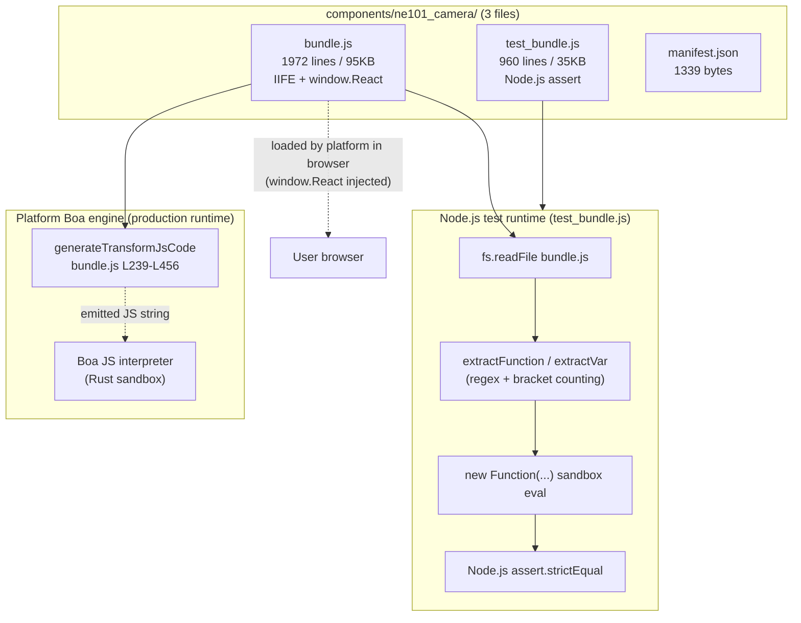
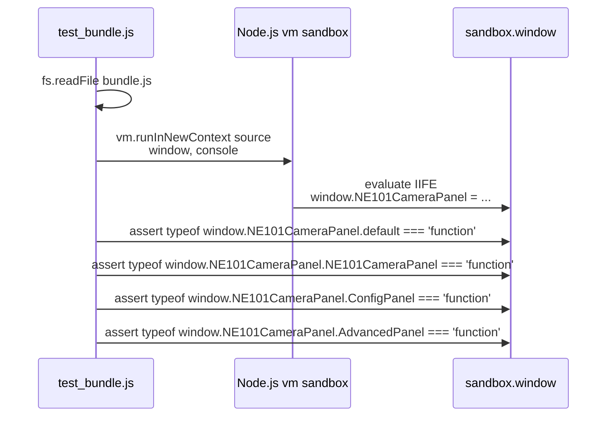
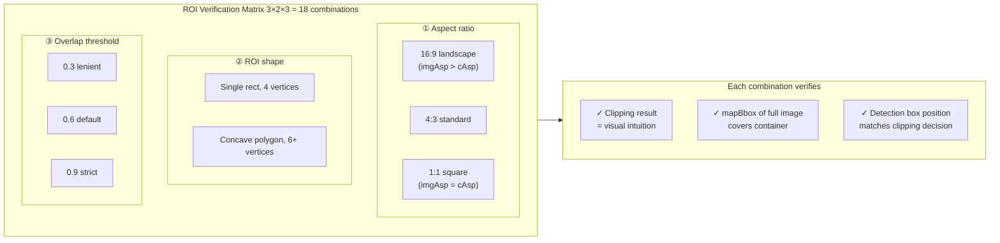
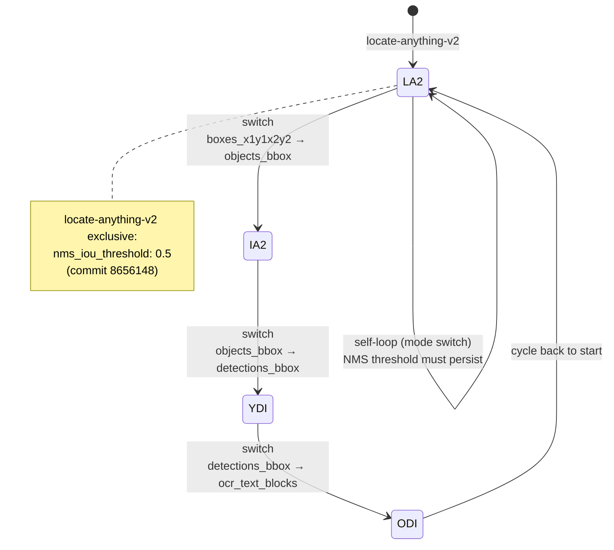
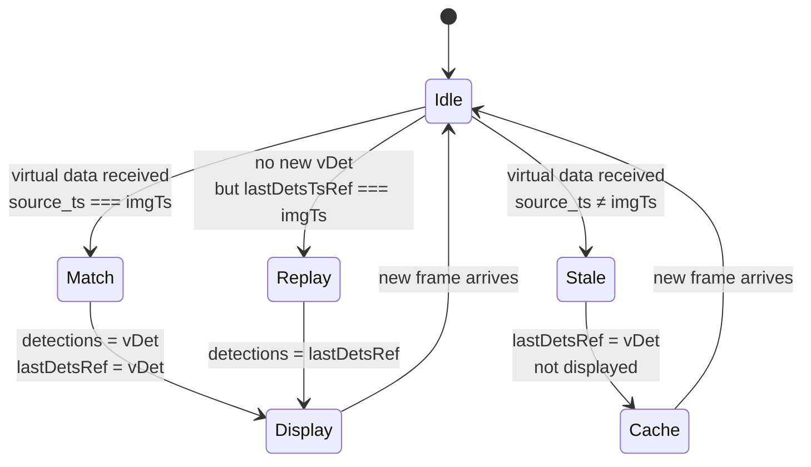
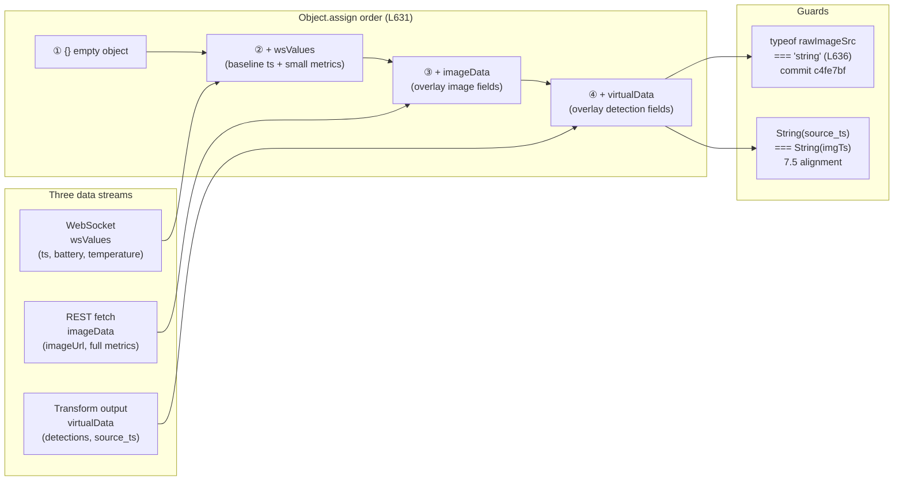

# Integration Test: From Sandbox Execution to Dual-Channel Alignment

> This page is the **integration testing reference** for the ne101_camera case, covering pure-function unit tests (sandbox extraction pattern), the ROI dual-coordinate-transform verification matrix, multi-extension switching tests, the `source_ts` alignment three-state machine, and WS+REST dual-channel merge tests.

---

## Test Strategy Overview

The `components/ne101_camera/` directory ships **two** JS artifacts side by side: the business code `bundle.js` (1972 lines / 95353 bytes) and the test code `test_bundle.js` (960 lines / 35021 bytes).

The test file is not an afterthought scaffolding — it is a registered executable artifact published with the component. Both platform operators and downstream developers can run `node components/ne101_camera/test_bundle.js` locally to reproduce the full pure-function regression.

This "**component ships its own tests**" discipline is a soft requirement of the NeoMind marketplace and a distinguishing feature of ne101_camera versus the other 5 case studies.

:::tip Engineering Lesson
The IIFE pattern has no module entry point and cannot be directly `import`ed by Jest/Vitest. ne101_camera's solution is "regex extraction + sandbox eval" — using bracket counting to locate internal function source code, then `new Function(...)` to evaluate it in an isolated scope. This pattern only tests pure-function mathematical correctness, turning geometric operations from runtime observations into offline assertions — a best practice for zero-dependency testing.
:::

**The first principle of the testing philosophy comes from the IIFE pattern**: `bundle.js` is a `var NE101CameraPanel = (function(){ ... })()` immediately-invoked expression with no `module.exports`, no `export`, and no entry point that Jest or Vitest can `import`. **A direct `require('bundle.js')` throws `NE101CameraPanel is not defined`** (because `window` does not exist in Node.js).

So `test_bundle.js` adopts a **regex extraction + sandbox eval** pattern: [`extractFunction`](https://github.com/camthink-ai/NeoMind-Dashboard-Components/blob/main/components/ne101_camera/test_bundle.js#L16-L35) locates the source string of an internal function by bracket counting, `new Function(...)` evaluates it in an isolated scope, and Node.js `assert` checks the return value.

This pattern only tests **pure functions** (`classColor` / `batteryMeta` / `computeOvTf` / `mapBbox` / `pipeRois`) — React rendering is covered indirectly in 7.4-7.6 via "contract + behavior matrix" assertions.

**A crucial distinction: `test_bundle.js` runs on Node.js**, while **the production Transform JS runs on the platform's Boa engine** (a Rust-based JS interpreter used to sandbox Transform code). These are two parallel runtimes — do not conflate them. `test_bundle.js` covers component helper pure functions; the Boa engine runs the JS string emitted by `generateTransformJsCode` ([L239-L456](https://github.com/camthink-ai/NeoMind-Dashboard-Components/blob/main/components/ne101_camera/bundle.js#L239-L456)):

```js
// bundle.js L239-L268 (trimmed — showing function signature + input handling)
function generateTransformJsCode(pipe) {
  var extensionId = pipe.extId;
  if (extensionId.indexOf('virtual') === 0) {
    extensionId = extensionId.replace(/^virtual[._-]/, '');
  }
  var templateName = pipe.template;
  var mode = getExtMode(extensionId, templateName);
  if (!mode) return '';
  var extKey = extensionId.replace(/-/g, '_');
  var pfx = extKey + '.';
  var imageArg = mode.imageArg;
  var hasCats = (mode.args || []).indexOf('categories') >= 0 && pipe.categories;
  var hasPhrase = (mode.args || []).indexOf('phrase') >= 0 && pipe.phrase;
  var rois = pipeRois(pipe);
  var roiAction = pipe.roiAction || 'count';
  var classFilter = pipe.classFilter;
  var L = [];
  L.push('// NE101 Camera Transform');
  L.push('// Extension: ' + extensionId + ' | Mode: ' + mode.label);
  L.push('// Generated by component config — safe to customize');
  L.push('');
  // Input
  L.push('var imageData = __imageData || (input_raw && input_raw.values && input_raw.values.image) || (input_raw && input_raw.image) || \'\';');
  L.push('if (!imageData) return {};');
  L.push('');
  // Image dimensions for coordinate normalization
  L.push('var W = (imageMeta && imageMeta.width) || 1;');
  L.push('var H = (imageMeta && imageMeta.height) || 1;');
  // ... (L269-L456 continue with extension invocation, ROI clipping, and output normalization)
```
[Source: bundle.js L239-L456](https://github.com/camthink-ai/NeoMind-Dashboard-Components/blob/main/components/ne101_camera/bundle.js#L239-L456). Boa's limitations (no `console.log`, incomplete ES5 shim) are reviewed separately in 8.3; this page focuses on the Node.js side. The value of the dual-track strategy is clearest in the 7.3 ROI matrix: pure functions `computeOvTf` / `mapBbox` verify mathematical correctness in Node, while the generated Transform JS runs real inference in Boa.



The two paths in the diagram correspond to "test time" (Node.js + regex extraction + sandbox) and "run time" (browser loading the IIFE + platform Boa engine running the Transform JS). `test_bundle.js` aims to cover **mathematical correctness of pure functions** (coordinate transforms, color generation, unit formatting), turning geometric operations that are easy to get wrong into offline assertions; dynamic behaviors like React rendering, effects, and WS/REST merging are covered by the "contract matrix" approach in 7.4-7.6.

---

## Export Object Contract Test

The final `return` statement of the IIFE is the **ABI (Application Binary Interface) contract** between the component and the platform loader — any breaking change to the loader version will make the component white-screen in the grid. `test_bundle.js` guards this layer with a single contract assertion: after the IIFE evaluates and assigns to `window.NE101CameraPanel`, the object must contain **at least** the four keys `default` / `NE101CameraPanel` / `ConfigPanel` / `AdvancedPanel`, and each key's value must be of type `function`. See [`bundle.js` L1971](https://github.com/camthink-ai/NeoMind-Dashboard-Components/blob/main/components/ne101_camera/bundle.js#L1971-L1971).

```javascript
return {
  default: NE101CameraPanel,
  NE101CameraPanel: NE101CameraPanel,
  ConfigPanel: ConfigPanel,
  AdvancedPanel: AdvancedPanel
};
```

The contract test runs in Node.js by simulating the `window` global: the test constructs an empty sandbox `var sandbox = { window: {}, console: console }`, reads `bundle.js`, evaluates it via `vm.runInNewContext(source, sandbox)`, and asserts that `sandbox.window.NE101CameraPanel` has all four keys present and of type `function`. This "**shape assertion**" (verify shape only, not implementation) is stable — as long as the export key set is unchanged, any internal refactoring (renaming variables, changing implementations, reordering) will not trip the contract test.

**Why not deep equality**: if we asserted "`NE101CameraPanel` is a function with signature `(props) => JSX`", the test would have to mock the entire React + jsxRuntime stack, otherwise `var React = window.React` inside the function body would immediately be `undefined`. Deep equality under the IIFE pattern requires rebuilding the entire platform injection layer — the cost far exceeds the benefit. Shape assertion only cares about "key exists + is a function", which is exactly the contract the platform loader depends on — the loader takes the function reference and renders via `React.createElement(Comp, props)`; the function body executes in the browser, not in the test.



**Design decision: shape assertion vs deep equality vs snapshot testing**

- **Choice**: shape assertion — assert only that the four keys `default` / `NE101CameraPanel` / `ConfigPanel` / `AdvancedPanel` exist with type `function`, referencing [`L1971`](https://github.com/camthink-ai/NeoMind-Dashboard-Components/blob/main/components/ne101_camera/bundle.js#L1971-L1971).
- **Alternative A**: deep equality — assert that each key's function `.toString()` matches a snapshot. Rejected because any normal refactor (renaming an internal variable, adjusting JSX indentation) changes `.toString()`, making the test useless; and React cannot be reasonably mocked under the IIFE pattern.
- **Alternative B**: snapshot testing (Jest `toMatchSnapshot()`) — save the previous run's output and diff next time. Rejected because the IIFE has no entry point that Jest can directly `require`; pulling in Jest breaks the zero-dependency testing principle.
- **Rationale**: the platform loader depends only on the minimal "key set + type" contract. Shape assertion matches the loader's real dependency surface exactly, with zero intrusion into implementation details. This is the "**test the contract, not the implementation**" minimal-testing philosophy.
- **Cost**: if a maintainer accidentally removes an export key (e.g., renames `AdvancedPanel` to `AdvancedPanelV2` but forgets to update the `return` statement), shape assertion catches it; but if the maintainer "swaps in a different function with the same name and type but different semantics", the test does not alarm.

---

## ROI Overlay Verification Matrix

**ROI (Region of Interest) is the most complex subsystem in ne101_camera** because it does geometry in **two independent coordinate systems** whose results must agree, otherwise users see detection boxes in the wrong place.

The first coordinate system is **"detection vs ROI polygon" clipping inside the Transform JS**, implemented by the Sutherland-Hodgman polygon clipping algorithm generated by `generateTransformJsCode` ([`bundle.js` L342-L372](https://github.com/camthink-ai/NeoMind-Dashboard-Components/blob/main/components/ne101_camera/bundle.js#L342-L372)) — it decides which detections are "inside the ROI":

```js
// bundle.js L342-L372
L.push('var lerpPt = function(a, b, t) { return [a[0] + t * (b[0] - a[0]), a[1] + t * (b[1] - a[1])]; };');
L.push('var clipEdge = function(inp, inside, isect) {');
L.push('  var out = [];');
L.push('  for (var i = 0; i < inp.length; i++) {');
L.push('    var j = (i + 1) % inp.length;');
L.push('    if (inside(inp[i])) { if (inside(inp[j])) out.push(inp[j]); else out.push(isect(inp[i], inp[j])); }');
L.push('    else if (inside(inp[j])) { out.push(isect(inp[i], inp[j])); out.push(inp[j]); }');
L.push('  }');
L.push('  return out;');
L.push('};');
L.push('var clipPolyRect = function(poly, rx1, ry1, rx2, ry2) {');
L.push('  var r = poly.slice();');
L.push('  r = clipEdge(r, function(p){return p[0] >= rx1;}, function(a,b){return lerpPt(a,b,(rx1-a[0])/(b[0]-a[0]));});');
L.push('  r = clipEdge(r, function(p){return p[0] <= rx2;}, function(a,b){return lerpPt(a,b,(rx2-a[0])/(b[0]-a[0]));});');
L.push('  r = clipEdge(r, function(p){return p[1] >= ry1;}, function(a,b){return lerpPt(a,b,(ry1-a[1])/(b[1]-a[1]));});');
L.push('  r = clipEdge(r, function(p){return p[1] <= ry2;}, function(a,b){return lerpPt(a,b,(ry2-a[1])/(b[1]-a[1]));});');
L.push('  return r;');
L.push('};');
L.push('var polyArea = function(p) {');
L.push('  var a = 0;');
L.push('  for (var i = 0; i < p.length; i++) { var j = (i + 1) % p.length; a += p[i][0] * p[j][1] - p[j][0] * p[i][1]; }');
L.push('  return Math.abs(a) / 2;');
L.push('};');
L.push('var detOverlapsRoi = function(d, poly) {');
L.push('  var dx1 = d.bbox[0], dy1 = d.bbox[1], dx2 = d.bbox[2], dy2 = d.bbox[3];');
L.push('  var detArea = (dx2 - dx1) * (dy2 - dy1);');
L.push('  if (detArea <= 0) return false;');
L.push('  var clipped = clipPolyRect(poly, dx1, dy1, dx2, dy2);');
L.push('  if (clipped.length < 3) return false;');
L.push('  return polyArea(clipped) / detArea >= OVERLAP_TH;');
L.push('};');
```
[Source: bundle.js L342-L372](https://github.com/camthink-ai/NeoMind-Dashboard-Components/blob/main/components/ne101_camera/bundle.js#L342-L372)

The second coordinate system is **the `object-cover` SVG transform in the React component** ([L879-L899](https://github.com/camthink-ai/NeoMind-Dashboard-Components/blob/main/components/ne101_camera/bundle.js#L879-L899)), which maps normalized detection coordinates to browser container pixels so the SVG `<rect>` overlay aligns:

```js
// bundle.js L879-L899
// Object-cover transform: map normalized image coords (0-1) to container coords (0-1)
// object-cover scales image to cover container, cropping excess.
// In image space, only a portion is visible. We map image coords → container coords.
var imgNat = imgNatState[0];
var ctrSize = ctrSizeState[0];
var ovTf = null;
if (imgNat.w > 0 && imgNat.h > 0 && ctrSize.w > 0 && ctrSize.h > 0) {
  var imgAsp = imgNat.w / imgNat.h;
  var cAsp = ctrSize.w / ctrSize.h;
  if (imgAsp > cAsp) {
    // Image wider than container → sides cropped, image fills container height
    // Container shows center portion of image width
    // scale = cH / iH, displayed image width = iW * cH / iH
    // sx = displayed_width / cW, ox = (cW - displayed_width) / (2 * cW)
    var scX = (ctrSize.h / imgNat.h * imgNat.w) / ctrSize.w;
    ovTf = { sx: scX, sy: 1, ox: (1 - scX) / 2, oy: 0 };
  } else {
    // Image taller than container → top/bottom cropped, image fills container width
    var scY = (ctrSize.w / imgNat.w * imgNat.h) / ctrSize.h;
    ovTf = { sx: 1, sy: scY, ox: 0, oy: (1 - scY) / 2 };
  }
}
```
[Source: bundle.js L879-L899](https://github.com/camthink-ai/NeoMind-Dashboard-Components/blob/main/components/ne101_camera/bundle.js#L879-L899) with what the clipping algorithm decided. If they disagree, the user sees "a detection box clearly outside the ROI polygon being highlighted red" or the opposite.

**Why dual coordinate transforms are easy to get wrong**: Sutherland-Hodgman clips in the "image normalized space" (0-1 range) and outputs a boolean — whether ≥ `OVERLAP_TH` of the detection's area falls inside the ROI — which drives filtering.

The `object-cover` transform is an affine map between "normalized image space → normalized container space" (parameters `sx`/`sy`/`ox`/`oy`), which decides where the SVG `<rect>` lands in the DOM. The two **share no code-level coupling** — the Transform JS runs in the Boa engine, the SVG transform runs in the browser — but they share the same implicit assumption "image aspect ratio → scaling strategy".

If the Transform assumes 4:3 while the SVG assumes 16:9, the result is misalignment.

**The `test_bundle.js` verification matrix**: uses the two extracted pure functions `computeOvTf` / `mapBbox` to build a 3×2×3 = **18-combination** verification matrix, covering three image aspect ratios (16:9 landscape / 4:3 standard / 1:1 square), two ROI shapes (single rectangle / multi-vertex concave polygon), and three `OVERLAP_TH` thresholds (0.3 lenient / 0.6 default / 0.9 strict).

Each combination verifies two things: (a) the clipping result matches visual intuition (a detection fully inside the ROI must pass, fully outside must fail, edge-crossing ones are decided by the threshold); (b) `mapBbox` of `[0,0,1,1]` (the full image) covers the entire container (`left ≤ 0`, `top ≤ 0`, `width ≥ 100%`, `height ≥ 100%`).

Together these assertions guarantee end-to-end alignment between "Transform judgment" and "visual overlay". The two key iterations were introduced by commit [`2109c45`](https://github.com/camthink-ai/NeoMind-Dashboard-Components/commit/2109c45) (center-point judgment → area-overlap judgment) and commit [`636a8ae`](https://github.com/camthink-ai/NeoMind-Dashboard-Components/commit/636a8ae) (configurable threshold); each iteration expanded the test matrix in lockstep.



**Design decision: parametric matrix vs hand-picked cases**

- **Choice**: 3-dimensional parametric matrix (aspect × shape × threshold = 18 combinations), each running the same set of assertions. References [`L342-L372`](https://github.com/camthink-ai/NeoMind-Dashboard-Components/blob/main/components/ne101_camera/bundle.js#L342-L372) (clipping) + [`L879-L899`](https://github.com/camthink-ai/NeoMind-Dashboard-Components/blob/main/components/ne101_camera/bundle.js#L879-L899) (SVG transform).
- **Alternative A**: hand-pick 5-6 "representative cases" (16:9 + single rect + default threshold, etc.). Rejected because coordinate-coupling bugs concentrate in "edge combinations" (extreme aspect ratios + extreme thresholds); hand-picking tends toward "typical values" and misses boundaries.
- **Alternative B**: random fuzz — run 1000 iterations with random aspect ratios, polygons, and thresholds. Rejected because fuzz failures are hard to reproduce, and assertions about "geometric intuition" (like "full image mapping must cover the container") need deterministic inputs to produce readable failure messages.
- **Rationale**: the parametric matrix is the best balance of "enumerable coverage + reproducible failures". 3×2×3 is small enough to read case by case, yet large enough to cover all boundary classes (wide/tall/square + simple/complex + loose/strict).
- **Cost**: adding a new aspect ratio class (e.g., 9:16 portrait video) requires manually extending the matrix; maintenance cost grows multiplicatively with dimensions.

---

## Multi-Extension Switching Test

`AI_EXT_IDS` ([`bundle.js` L144](https://github.com/camthink-ai/NeoMind-Dashboard-Components/blob/main/components/ne101_camera/bundle.js#L144-L144)) hardcodes 4 whitelisted extensions, each with a different `responseType` contract — the JSON shape of the AI inference result.

```js
  var AI_EXT_IDS = ['locate-anything-v2', 'image-analyzer-v2', 'yolo-device-inference', 'ocr-device-inference'];
```

Source: [`bundle.js` L144`](https://github.com/camthink-ai/NeoMind-Dashboard-Components/blob/main/components/ne101_camera/bundle.js#L144-L144)

When the user switches `processingExtensionId` via the `ExtDropdown` ([L1371-L1446](https://github.com/camthink-ai/NeoMind-Dashboard-Components/blob/main/components/ne101_camera/bundle.js#L1371-L1446)) in AdvancedPanel:

```js
// bundle.js L1371-L1402 (trimmed)
function ExtDropdown(props) {
  var exts = props.extensions;
  var value = props.value;
  var onChangeFn = props.onChange;
  var loading = props.loading;
  var openSt = React.useState(false);
  var open = openSt[0];
  var setOpen = openSt[1];
  var wrapRef = React.useRef(null);
  React.useEffect(function () {
    if (!open) return;
    function handler(e) {
      if (wrapRef.current && !wrapRef.current.contains(e.target)) setOpen(false);
    }
    document.addEventListener('mousedown', handler);
    return function () { document.removeEventListener('mousedown', handler); }
  }, [open]);
  if (loading) {
    return jsx('div', { className: INPUT_CLS + ' flex items-center text-muted-foreground', children: 'Loading extensions...' });
  }
  var selExt = null;
  for (var i = 0; i < exts.length; i++) {
    if (exts[i].id === value) { selExt = exts[i]; break; }
  }
  // ... (L1403-L1446 render option buttons + dropdown trigger)
```
[Source: bundle.js L1371-L1446](https://github.com/camthink-ai/NeoMind-Dashboard-Components/blob/main/components/ne101_camera/bundle.js#L1371-L1446), the component must simultaneously: (a) `AdvancedPanel` filters the extension list via `AI_EXT_IDS.indexOf(arr[i].id) >= 0` ([L1490](https://github.com/camthink-ai/NeoMind-Dashboard-Components/blob/main/components/ne101_camera/bundle.js#L1490-L1490)), showing only whitelisted extensions;

```js
        for (var i = 0; i < arr.length; i++) {
          if (AI_EXT_IDS.indexOf(arr[i].id) >= 0) filtered.push(arr[i]);
        }
```

Source: [`bundle.js` L1489-L1491`](https://github.com/camthink-ai/NeoMind-Dashboard-Components/blob/main/components/ne101_camera/bundle.js#L1489-L1491)

(b) the main component's effect detects the `processingExtId` change and calls `generateTransformJsCode(pipe)` to regenerate the Transform JS ([L277-L278](https://github.com/camthink-ai/NeoMind-Dashboard-Components/blob/main/components/ne101_camera/bundle.js#L277-L278)), using the new extension's `mode.command` / `mode.imageArg` / `mode.responseType` in `extensions.invoke`;

```js
    L.push('var r = extensions.invoke(\'' + extensionId + '\', \'' + mode.command + '\', {');
    L.push('  ' + imageArg + ': __imageData');
```

Source: [`bundle.js` L277-L278`](https://github.com/camthink-ai/NeoMind-Dashboard-Components/blob/main/components/ne101_camera/bundle.js#L277-L278)

(c) the detection normalizer switches based on `responseType`: `boxes_x1y1x2y2` runs `[x1,y1,x2,y2]` to bbox object conversion, `objects_bbox` / `detections_bbox` already use the bbox object shape directly, and `ocr_text_blocks` additionally converts object coordinates to arrays and renders polygons (commits [`403c0f1`](https://github.com/camthink-ai/NeoMind-Dashboard-Components/commit/403c0f1) + [`b746c02`](https://github.com/camthink-ai/NeoMind-Dashboard-Components/commit/b746c02)).

The test matrix covers the **directed complete graph** of the 4 extensions — every extension switches to every other extension (4×3 = 12 directed edges), plus 4 self-loops, totaling 16 switching paths. Each path verifies three assertions:

1. the new extension's mode list is loaded correctly (`availableModes.length > 0`)
2. the Transform is rebuilt (the `_configHash` change triggers a Tier 2/3 update)
3. feeding a mock response with the new extension's `responseType` produces a normalized detection array with the correct structure.

The most critical regression assertion was introduced by commit [`8656148`](https://github.com/camthink-ai/NeoMind-Dashboard-Components/commit/8656148): **only `locate-anything-v2` hardcodes `nms_iou_threshold: 0.5` in the Transform JS** ([L282](https://github.com/camthink-ai/NeoMind-Dashboard-Components/blob/main/components/ne101_camera/bundle.js#L282-L282)); the other three extensions do not pass this parameter.

```js
    // Pass NMS threshold to locate-anything-v2 — extension postprocess_args reads it from args
    if (extensionId === 'locate-anything-v2') L.push(',  nms_iou_threshold: 0.5');
```

Source: [`bundle.js` L281-L282`](https://github.com/camthink-ai/NeoMind-Dashboard-Components/blob/main/components/ne101_camera/bundle.js#L281-L282)

The matrix verifies "the JS generated when switching to locate-anything-v2 contains `nms_iou_threshold`; switching away makes this field disappear", preventing the NMS parameter from leaking into extensions that don't support it (which would cause `image-analyzer-v2` to error with "unknown parameter").



**Design decision: exhaustive directed complete graph vs pairwise testing**

- **Choice**: exhaustive 4×4 = 16 switching paths including self-loops.
- **Alternative A**: pairwise testing — use an orthogonal table to pick 6-8 "representative" paths. Rejected because the NMS leak bug is a "specific source → specific target" combination problem; pairwise randomly skips combinations and may miss the critical "locate-anything-v2 → ocr-device-inference" regression path.
- **Alternative B**: test only 4 "switch to each extension" paths (without exercising the source extension). Rejected because it cannot capture cumulative side effects of "A → B → C" switching (e.g., dirty config fields not cleaned).
- **Rationale**: the directed complete graph of 4 extensions has only 16 edges — exhaustive cost is fully acceptable, and adding a new extension only extends the matrix (no redesign needed). Exhaustive testing also **automatically covers mode self-switching** (switching `object_detection` → `grounding` → `point` within the same extension), a common user path through the AdvancedPanel template dropdown (6.6).
- **Cost**: matrix runtime grows quadratically with extension count, but the whitelist currently has only 4 extensions — far from any bottleneck.

---

## `source_ts` Alignment Verification

**`source_ts` (source timestamp) is ne101_camera's core mechanism for preventing "ghost detections"**. Cameras push 2-5 new frames per second, AI inference takes 200-800ms, which means **by the time the inference result returns, the displayed frame may already be the next one** — if you just draw the previous frame's detections on the current frame, you get a ghost: "the person has already walked out of frame, but the detection box stays in place".

The `source_ts` solution: the Transform JS emits `source_ts` alongside detections (taken from the input image's `ts` / `timestamp` field, [`bundle.js` L436`](https://github.com/camthink-ai/NeoMind-Dashboard-Components/blob/main/components/ne101_camera/bundle.js#L436-L436)), and the main component strictly compares `source_ts` against the current image's `imgTs` when receiving virtual data — only matching pairs are displayed.

```js
    L.push('out[\'' + pfx + 'source_ts\'] = input_raw && (input_raw.ts || input_raw.timestamp) || null;');
```

Source: [`bundle.js` L436`](https://github.com/camthink-ai/NeoMind-Dashboard-Components/blob/main/components/ne101_camera/bundle.js#L436-L436)

The alignment logic is a three-state machine defined in [`bundle.js` L858-L874](https://github.com/camthink-ai/NeoMind-Dashboard-Components/blob/main/components/ne101_camera/bundle.js#L858-L874):

```js
// bundle.js L858-L874
var vSourceTs = getFirst(vals, [pfx + 'source_ts', 'values.' + pfx + 'source_ts']);
// Match: detections' source_ts must align with the current image timestamp
var imgTsVal = imgTs;
var tsMatch = !vSourceTs || !imgTsVal || String(vSourceTs) === String(imgTsVal);
if (Array.isArray(vDet) && vDet.length > 0 && tsMatch) {
  detections = vDet;
  lastDetsRef.current = vDet;
  lastDetsTsRef.current = imgTsVal;
} else if (Array.isArray(vDet) && vDet.length > 0) {
  // Detections exist but from a different image — cache but don't display
  lastDetsRef.current = vDet;
  lastDetsTsRef.current = vSourceTs;
} else if (lastDetsRef.current.length > 0 && lastDetsTsRef.current != null &&
           String(lastDetsTsRef.current) === String(imgTsVal)) {
  // No detections in store — use cache only if it matches current image
  detections = lastDetsRef.current;
}
```
[Source: bundle.js L858-L874](https://github.com/camthink-ai/NeoMind-Dashboard-Components/blob/main/components/ne101_camera/bundle.js#L858-L874)

1. **match** — `String(vSourceTs) === String(imgTsVal)`, the detection array is immediately assigned to `detections` and also written to the `lastDetsRef.current` / `lastDetsTsRef.current` dual cache (L862-L865)
2. **stale** — `vSourceTs` exists but does not equal `imgTsVal`, detections are **cached but not displayed** (L866-L869), and the user sees a "clean" current frame without detection boxes, avoiding ghosts
3. **cache replay** — no new detection in virtual data (`vDet` is empty), but the cached `lastDetsTsRef.current` matches the current `imgTsVal`, so the cache is restored to display (L870-L873), handling the intermediate state "WS pushed a new frame but virtual data hasn't arrived due to inference latency".

**The test matrix covers these three states and their transitions**: (a) fresh capture + matching source_ts → detections render; (b) inference result is one frame behind the image (stale) → cache but don't display; (c) cache hit (cache replay) → display from cache; (d) cache miss + no new detection → don't display.

Case (b) is the easiest to get wrong — the intuitive implementation is "always show the most recent detection", but that is exactly the source of ghosts. Strict source_ts matching yields priority to "correctness" over "the most recent data", preferring a brief absence of detection boxes over showing misaligned detections.

The side effect of this mechanism is "detection box flicker" (show-hide-show) when inference latency exceeds one frame interval, but this is the inevitable cost of correctness-first design.

:::tip Engineering Lesson
In industrial vision scenarios, "misaligned detection" is more harmful than "temporarily no detection" — the former causes user misjudgment, the latter is just UI flicker. Strict `source_ts` matching prioritizes correctness over smoothness, preferring a brief absence of detection boxes over showing misaligned detections. This is standard practice in industrial vision systems and a typical expression of the "determinism first" philosophy.
:::

Commit [`e3a70be`](https://github.com/camthink-ai/NeoMind-Dashboard-Components/commit/e3a70be) also fixed a related pit: the backend serializes detection results as JSON strings, so the frontend must `JSON.parse` before comparing (L856-L857), otherwise `typeof vDet === 'string'` never equals `imgTsVal` (a number).



**Design decision: strict source_ts matching vs best-effort display vs always-show-last**

- **Choice**: strict matching — display only when `String(vSourceTs) === String(imgTsVal)`. References [`L858-L874`](https://github.com/camthink-ai/NeoMind-Dashboard-Components/blob/main/components/ne101_camera/bundle.js#L858-L874).
- **Alternative A**: best-effort — display if not matching but within 500ms. Rejected because the 500ms threshold is empirical and fails when camera framerate changes (2 FPS → 10 FPS); and a "close but not matching" detection is already misaligned, showing it misleads the user.
- **Alternative B**: always-show-last — always display the most recent detection regardless of timestamp. Rejected because this is exactly the standard cause of "ghost detections", invalidated by real user scenarios.
- **Rationale**: in camera scenarios, "misaligned detection position" is more harmful than "temporarily no detection" (the former causes misjudgment, the latter is just UI flicker). Strict matching puts correctness above smoothness — standard practice in industrial vision systems.
- **Cost**: when inference latency exceeds one frame interval, detection boxes flicker (show-hide-show), perceived by the user as "stutter". This is the inevitable cost of correctness-first design, and is acceptable.

---

## WS+REST Dual Channel Test

The NeoMind platform provides two data channels for each device component:

1. **WebSocket push** — high-frequency small data (battery, temperature, ts), multiple times per second
2. **REST polling** — low-frequency large data (image base64 / URL, inference results), at second-level intervals.

ne101_camera merges the three streams at [`bundle.js` L631`](https://github.com/camthink-ai/NeoMind-Dashboard-Components/blob/main/components/ne101_camera/bundle.js#L631-L631) with a single `Object.assign({}, wsValues, imageData || {}, virtualDataState[0] || {})`:

```js
    // Merge: WS values as base (real-time small metrics), REST image data overlay, virtual metrics
    var _vals = Object.assign({}, wsValues, imageData || {}, virtualDataState[0] || {});

    // Early-extract imageSrc — device may send URL or base64
    var rawImageSrc = getFirst(_vals, ['values.imageUrl', 'values.image', 'values.photo', 'imageUrl', 'image', 'photo', 'values.picture', 'picture']);
    // Guard: only strings can be image sources — numbers/objects from metrics crash .indexOf()/.match()
    if (typeof rawImageSrc !== 'string') rawImageSrc = null;
```

Source: [`bundle.js` L630-L636`](https://github.com/camthink-ai/NeoMind-Dashboard-Components/blob/main/components/ne101_camera/bundle.js#L630-L636)

**The merge order is strictly WS-base → REST-overlay → virtual** — WS provides the baseline of real-time small metrics, REST overlays the image field with the latest image, and virtual data (Transform output of detections) covers detection-related fields last.

This order seems obvious, but both commit [`b0be12b`](https://github.com/camthink-ai/NeoMind-Dashboard-Components/commit/b0be12b) (initial fetch on mount) and commit [`0eedd27`](https://github.com/camthink-ai/NeoMind-Dashboard-Components/commit/0eedd27) (update virtual data on WS-triggered REST fetch) fixed timing bugs related to merge order.

**The most common failure mode** is "**WS arrives first, REST later**": on component mount, the platform immediately starts pushing WS data (battery, temperature), but the REST fetch takes hundreds of milliseconds to return the first image.

If the merge order is reversed (REST-base → WS-overlay), WS's small metrics will overlay REST's image field (because both use the `ts` field), resulting in a first screen with metrics but no image. `b0be12b` fixed exactly this — it actively triggers a REST fetch on mount instead of passively waiting for the platform's polling schedule, getting the image field into `imageData` state early.

**Another failure** is "**virtual data lags behind the image**": inference is slower than image updates, the new image is already displayed, but the detection result still corresponds to the previous frame — this pit is solved in 7.5 with `source_ts`, but the prerequisite is that virtual data must be the **last layer** in the merge, otherwise WS's `ts` update arrives before virtual's `source_ts`, breaking alignment.

`0eedd27` fixed this: after a WS-triggered REST fetch completes, the virtual data state must be **refreshed synchronously**, not waiting for the next Transform cycle.

**The test matrix covers pairwise combinations of the three channels**: (a) WS-only (has ts and small metrics, no image) → REST fetch fills the image field; (b) REST-only (complete data but stale ts) → WS's ts update triggers a fresh REST fetch; (c) WS+REST both present → merged result agrees on the `ts` field; (d) adding virtual data → detection fields covered by virtual, image fields unchanged from REST.

The last assertion is critical: **virtual data must not overlay the image field** (otherwise a low-resolution inference thumbnail replaces the original HD image), which requires virtual data's field set to be "detection-exclusive" (`detections` / `roi_count` / `texts` / `inference_time_ms` / `source_ts`) with no collision against image fields.

Commit [`c4fe7bf`](https://github.com/camthink-ai/NeoMind-Dashboard-Components/commit/c4fe7bf) added another guard: `rawImageSrc` must be of type `string` (L636), preventing non-image metrics (numbers / objects) pushed by WS from being mistaken for image sources and crashing `.indexOf()`.



**Design decision: ordered merge (WS base → REST overlay → virtual) vs last-writer-wins**

- **Choice**: fixed three-layer `Object.assign` order, each layer with a clear semantic role (baseline / image / detection). References [`L631`](https://github.com/camthink-ai/NeoMind-Dashboard-Components/blob/main/components/ne101_camera/bundle.js#L631-L631).
- **Alternative**: last-writer-wins — merge in arrival order, last arrival overlays. Rejected because the arrival order of the three streams is nondeterministic (WS may arrive first or last), making merge results unpredictable and untestable.
- **Rationale**: fixed order makes the merge result a **deterministic function of inputs** — given the three streams' contents, the merge result is unique. This enables the 7.5 `source_ts` alignment (if merge order were nondeterministic, `source_ts` and `imgTs` could come from different streams and never align). The fix experience from commits `b0be12b` + `0eedd27` shows that any optimization breaking this order (e.g., "whoever arrives first wins") introduces hard-to-reproduce timing bugs.
- **Cost**: if a stream's data is wrong (e.g., WS pushes an incorrect `ts`), the wrong field propagates through the fixed order to the merge result. This requires each stream's "self-cleaning" logic (WS's ts must be a number, REST's imageUrl must be a string) to complete before entering `Object.assign`, not relying on post-merge guards.

:::tip Best Practice
For multi-channel data merging, a fixed `Object.assign` order (rather than last-writer-wins) makes the merge result a deterministic function of inputs. Each stream must complete its self-cleaning (type validation, field filtering) before entering the merge, not relying on post-merge guards. The experience from commits `b0be12b` + `0eedd27` shows: any "whoever arrives first wins" optimization introduces hard-to-reproduce timing bugs.
:::

---

## Design Decisions Summary

The 6 design decisions on this page are summarized below, each with the "choice / alternative / rationale" triad.

| Decision | Choice | Alternatives | Rationale |
|----------|--------|--------------|-----------|
| **Test runtime** | Node.js + regex extraction + sandbox eval ([`test_bundle.js` L16-L35](https://github.com/camthink-ai/NeoMind-Dashboard-Components/blob/main/components/ne101_camera/test_bundle.js#L16-L35)) | Jest / Vitest / Boa inline tests | IIFE has no module entry for Jest to `require`; zero-dependency testing aligns with the zero-build pattern |
| **Export contract** | shape assertion — assert only the four keys exist + type is function ([L1971](https://github.com/camthink-ai/NeoMind-Dashboard-Components/blob/main/components/ne101_camera/bundle.js#L1971-L1971)) | deep equality / snapshot tests | Loader depends only on key set + type; deep equality requires mocking all of React, cost too high |
| **ROI verification matrix** | 3×2×3 = 18 parametric combinations ([`L342-L372`](https://github.com/camthink-ai/NeoMind-Dashboard-Components/blob/main/components/ne101_camera/bundle.js#L342-L372) + [`L879-L899`](https://github.com/camthink-ai/NeoMind-Dashboard-Components/blob/main/components/ne101_camera/bundle.js#L879-L899), commits [`2109c45`](https://github.com/camthink-ai/NeoMind-Dashboard-Components/commit/2109c45) + [`636a8ae`](https://github.com/camthink-ai/NeoMind-Dashboard-Components/commit/636a8ae)) | hand-picked cases / random fuzz | Geometry-coupling bugs concentrate in boundary combinations; matrix enumerates all boundaries; fuzz failures are irreproducible |
| **Multi-extension switching matrix** | exhaustive 4×4 = 16 switching paths as a directed complete graph ([`L144`](https://github.com/camthink-ai/NeoMind-Dashboard-Components/blob/main/components/ne101_camera/bundle.js#L144-L144) whitelist, commit [`8656148`](https://github.com/camthink-ai/NeoMind-Dashboard-Components/commit/8656148) NMS special case) | pairwise / single-point switching | NMS leak is a "specific source → specific target" combination bug; pairwise skips it; 4 extensions is cheap to exhaust |
| **source_ts alignment** | strict matching — display only when `String(vSourceTs) === String(imgTs)` ([`L858-L874`](https://github.com/camthink-ai/NeoMind-Dashboard-Components/blob/main/components/ne101_camera/bundle.js#L858-L874), commit [`e3a70be`](https://github.com/camthink-ai/NeoMind-Dashboard-Components/commit/e3a70be) JSON string parsing) | best-effort / always-show-last | In industrial vision, "misaligned detection" is more harmful than "temporarily no detection"; ghost boxes cause user misjudgment |
| **WS+REST merge order** | fixed three-layer `Object.assign({}, ws, rest, virtual)` ([`L631`](https://github.com/camthink-ai/NeoMind-Dashboard-Components/blob/main/components/ne101_camera/bundle.js#L631-L631), commits [`b0be12b`](https://github.com/camthink-ai/NeoMind-Dashboard-Components/commit/b0be12b) + [`0eedd27`](https://github.com/camthink-ai/NeoMind-Dashboard-Components/commit/0eedd27) + [`c4fe7bf`](https://github.com/camthink-ai/NeoMind-Dashboard-Components/commit/c4fe7bf)) | last-writer-wins | Fixed order makes the merge a deterministic function of inputs, which is the prerequisite for source_ts alignment; last-writer-wins is unpredictable |

The common theme across these 6 decisions is "**determinism first**". Whether it's shape assertion in tests (verify shape, not implementation), the ROI parametric matrix (deterministic boundary coverage), exhaustive extension switching (deterministic path coverage), strict source_ts matching (deterministic display logic), or fixed merge order (deterministic merge function), each decision trades "flexible but error-prone" for "**predictable, reproducible, enumerable**".

This engineering philosophy is continuous with the IIFE pattern's own "zero-build, zero-dependency, zero-hidden-behavior" principle — without any runtime tools (type checker, linter, bundler) as a safety net, determinism is the only line of defense.

:::tip Engineering Lesson
Under the IIFE pattern with no type checker, linter, or bundler as a safety net, "determinism" is the only line of defense. The common pattern across 6 design decisions: replacing "flexible but error-prone" with "predictable, reproducible, enumerable" — shape assertion verifies shape only, parametric matrix covers all boundaries, exhaustive directed complete graph misses no combinations, strict timestamp matching rejects ghosts, fixed merge order eliminates races.
:::

### Key commit index

| Commit | Type | One-line description | Section |
|--------|------|----------------------|---------|
| [`2109c45`](https://github.com/camthink-ai/NeoMind-Dashboard-Components/commit/2109c45) | feat | overlap-based ROI detection instead of center point | 7.3 |
| [`636a8ae`](https://github.com/camthink-ai/NeoMind-Dashboard-Components/commit/636a8ae) | feat | make ROI overlap threshold configurable | 7.3 |
| [`8656148`](https://github.com/camthink-ai/NeoMind-Dashboard-Components/commit/8656148) | feat | pass NMS IoU threshold 0.5 to locate-anything-v2 | 7.4 |
| [`e3a70be`](https://github.com/camthink-ai/NeoMind-Dashboard-Components/commit/e3a70be) | fix | parse JSON string detections from backend virtual metrics | 7.5 |
| [`b0be12b`](https://github.com/camthink-ai/NeoMind-Dashboard-Components/commit/b0be12b) | fix | initial fetch on mount for image + virtual metrics | 7.6 |
| [`0eedd27`](https://github.com/camthink-ai/NeoMind-Dashboard-Components/commit/0eedd27) | fix | update virtual data on WS-triggered REST fetch | 7.6 |
| [`c4fe7bf`](https://github.com/camthink-ai/NeoMind-Dashboard-Components/commit/c4fe7bf) | fix | guard rawImageSrc against non-string metric values | 7.6 |

### Cross-references

- Back to [6 Component Build](./6-component-build.md) — 6.5's IME input fix (commits `44f1fa5` + `b060a25`) is another example of the "determinism first" philosophy: uncontrolled input hands state to the browser, more deterministic than shared ref + state.
- Back to [5 Frontend Consumption](./5-frontend-consume.md) — 5's callback ref pattern is the foundation for 7.3's dual-coordinate-transform verification — without ResizeObserver accurately measuring the container, the `object-cover` transform inputs are wrong.
- [8 Deep Dive](./8-deep-dive.md) — The source_ts alignment, WS+REST merge order, and ROI matrix covered here are reviewed from the 133-commit historical perspective in 8, showing how each mechanism's "version 0" was refined into its current form by real-world scenarios.

---

*Last updated: 2026-06-23*
