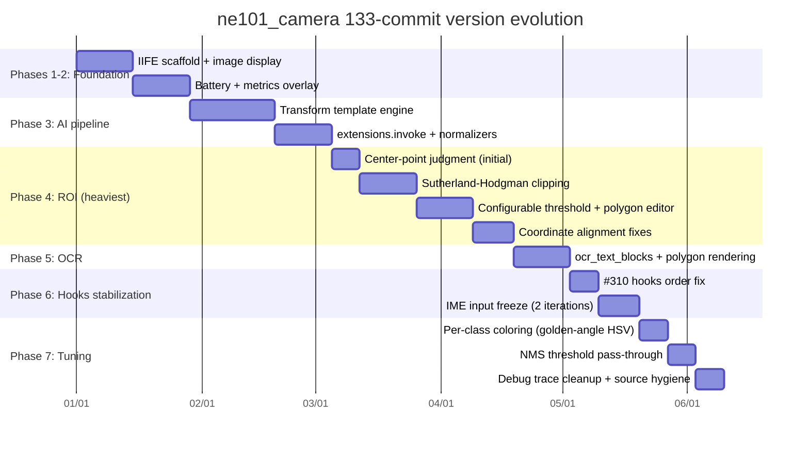
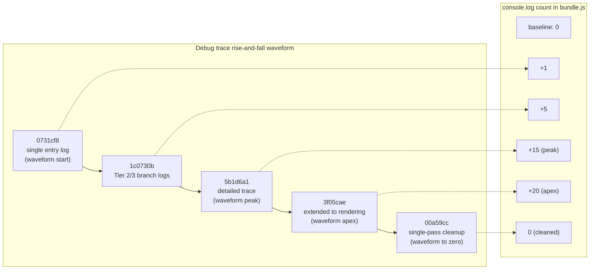
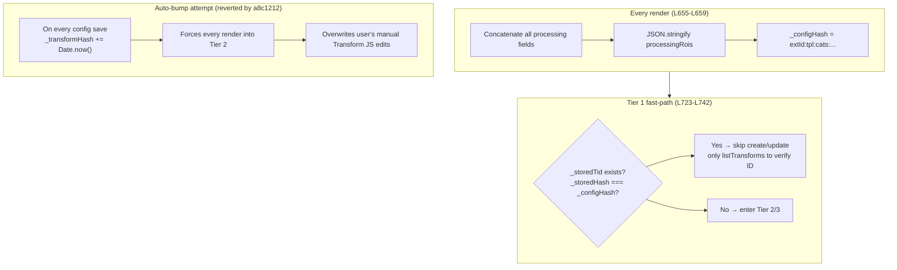
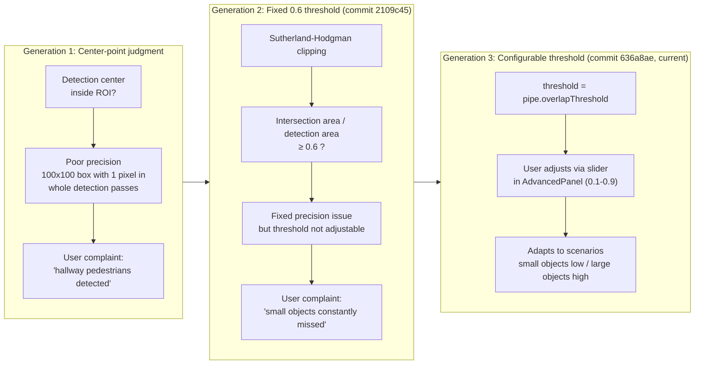
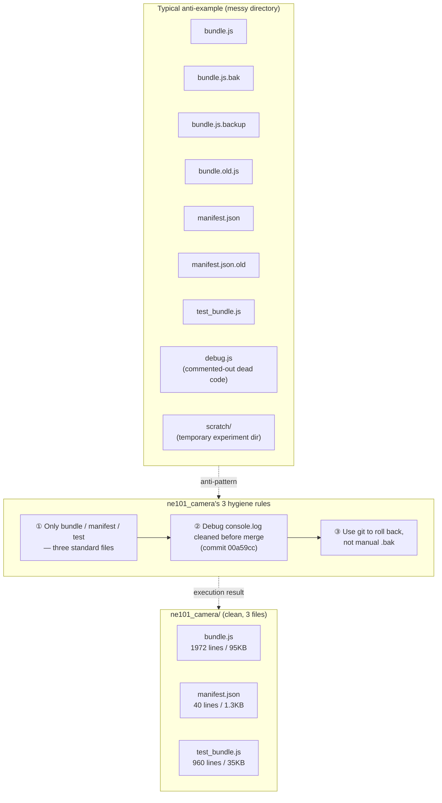

# 8 Deep Dive: Version Evolution and Engineering Retrospective Across 133 Commits

> This page is the **closing deep-dive retrospective** for the ne101_camera case, looking back at the component's evolution from the 133-commit historical perspective, covering the version evolution timeline, the rise and fall of debug traces, the Boa engine crash incident, the `_configHash` performance optimization, and source hygiene recap.

---

## 8.1 Version Evolution Timeline

The source repo [`camthink-ai/NeoMind-Dashboard-Components`](https://github.com/camthink-ai/NeoMind-Dashboard-Components) has accumulated **133 git commits** under `components/ne101_camera/`, spanning roughly 7 major development phases. This commit count is **the absolute highest** among the 6 NeoMind marketplace components — the runner-up, metric_card, has only ~30 commits, and the other 4 average 10-20. The number 133 reflects ne101_camera's complexity: it is the only component that simultaneously involves real-time video streaming, AI inference, multi-extension contracts, geometric coordinate transforms, React hooks lifecycle, and dual-channel data merging — each dimension contributing 10-30 commits of iteration.

Grouping the 133 commits by topic reveals 7 clear development phases:

1. **IIFE scaffold + image display** — establishing the `var React = window.React` injection pattern, `` rendering, basic props parsing
2. **Battery and metrics overlay** — visual design for small metrics like battery percentage, signal strength, temperature (badge styles, `formatValue` / `unitStr` helpers)
3. **AI processing pipeline + Transform integration** — the `generateTransformJsCode` template engine, `extensions.invoke` calls, detection result normalizers
4. **ROI overlay** (the heaviest phase, 10+ commits) — center-point judgment → Sutherland-Hodgman clipping, fixed threshold → configurable threshold, ROI polygon editor, coordinate alignment fixes
5. **OCR polygon support** — `ocr_text_blocks` responseType, conversion of object coordinates (x/y pair), polygon rendering + rectangle fallback
6. **React hooks stabilization** — conditional useState causing #310 crash, two iterations of IME input freeze fix, ResizeObserver async mount fix
7. **Per-class coloring + NMS tuning** — golden-angle HSV rotation for color allocation, `nms_iou_threshold` pass-through for locate-anything-v2.

These 7 phases are not strictly linear — for example, ROI overlay (phase 4) and hooks stabilization (phase 6) overlap in time, but the gantt chart shows each phase's relative volume.



Phase 4 (ROI overlay) is the most commit-heavy phase because it does geometry in two independent coordinate systems (detailed in 7.3), and those two systems execute in the Boa engine and the browser respectively, with no shared debugger. Each coordinate bug fix requires: (a) changing the Transform JS generation logic; (b) changing the SVG transform's React code; (c) manually verifying alignment in the browser. The cost of this debug loop drove the commit count inflation, and directly triggered the "rise and fall of debug traces" in 8.2 — the developer added a series of console.logs to locate ROI coordinate misalignment, then cleaned them up in a single sweep.

---

## 8.2 The Rise and Fall of Transform Lifecycle Debug Traces

ne101_camera's Transform three-tier lifecycle (detailed in [5.7](./5-frontend-consume.md): Tier 1 = ID + hash match fast-path, Tier 2 = ID exists but hash changed → update, Tier 3 = no ID → create) is the subsystem most prone to bugs. React StrictMode's double mounting, frequent config changes, concurrent effect races, and a host of other factors made the Transform "create-update-delete" state machine produce over a dozen bugs in real-world runs. The diagnostic process for those bugs gave rise to a unique "debug trace rise and fall" cycle in ne101_camera's history.

The cycle starts with commit [`0731cf8`](https://github.com/camthink-ai/NeoMind-Dashboard-Components/commit/0731cf8) (`debug(ne101): add console.log to trace Transform lifecycle`) — the developer added `console.log('Transform effect entered', { storedTid, configHash, ... })` at the entry of the Transform effect to observe which Tier path was triggered. A single log was insufficient to diagnose every case, so more were added: [`1c0730b`](https://github.com/camthink-ai/NeoMind-Dashboard-Components/commit/1c0730b) (`add Transform lifecycle debug logs`, covering Tier 2/3 branches), [`5b1d6a1`](https://github.com/camthink-ai/NeoMind-Dashboard-Components/commit/5b1d6a1) (`add detailed Transform lifecycle trace logs`, logging before and after every neomind API call), [`3f05cae`](https://github.com/camthink-ai/NeoMind-Dashboard-Components/commit/3f05cae) (`add overlay diagnostic to trace detection rendering`, extending trace coverage to the detection rendering pipeline). At this point, bundle.js was littered with 20+ console.logs, and the developer's browser console would spew dozens of colored log entries on every config change — diagnostic efficiency improved dramatically, but the code was unreadable.

The cleanup came suddenly and thoroughly: commit [`00a59cc`](https://github.com/camthink-ai/NeoMind-Dashboard-Components/commit/00a59cc) (`chore(ne101): remove debug console.logs from Transform lifecycle`) deleted all the console.logs added by the 4 debug commits in a single pass, restoring bundle.js to a "production-clean" state. The "add-then-remove" cycle lasted only a few days, but left an important engineering lesson: temporary debug logs must be cleaned up before merging to main, otherwise they become permanent noise; a better approach is error-boundary telemetry or an opt-in debug flag rather than bare console.logs. ne101_camera ultimately chose "delete entirely" rather than "keep behind a debug flag" — because the IIFE pattern has no build step to strip debug code, any retained logs would ship in the production bundle, slowing every user's render performance.



**Design decision: temporary debug logs vs permanent logging framework vs error-boundary telemetry**

- **Choice**: temporary add → single-pass remove pattern (commits [`0731cf8`](https://github.com/camthink-ai/NeoMind-Dashboard-Components/commit/0731cf8) → [`00a59cc`](https://github.com/camthink-ai/NeoMind-Dashboard-Components/commit/00a59cc)). References [`L661-L720`](https://github.com/camthink-ai/NeoMind-Dashboard-Components/blob/main/components/ne101_camera/bundle.js#L661-L720) (Transform lifecycle effect region):

```js
// bundle.js L661-L700 (trimmed)
React.useEffect(function () {
  if (_isPreview) return;
  var neomind = window.neomind;
  var onCfgChange = props.onConfigChange;
  // --- Processing OFF: delete Transform ---
  if (!processingEnabled || !processingExtId || !device) {
    if (_storedTid && neomind && neomind.deleteTransform) {
      neomind.deleteTransform(_storedTid).catch(function () {});
    }
    if (_storedTid) {
      transformIdRef.current = null;
      if (onCfgChange) onCfgChange(Object.assign({}, config, { _transformId: '', _transformHash: '' }));
    }
    setExtStatus('idle');
    return;
  }
  // --- No API ---
  if (!neomind || !neomind.createTransform) { setExtStatus('unavailable'); return; }
  // --- Build payload ---
  var mode = getExtMode(processingExtId, processingTemplate);
  if (!mode) { setExtStatus('active'); return; }
  // ... (L701-L720: pipe config + persist + resetGuard)
```
[Source: bundle.js L661-L720](https://github.com/camthink-ai/NeoMind-Dashboard-Components/blob/main/components/ne101_camera/bundle.js#L661-L720)
- **Alternative A**: permanent logging framework — define `var DEBUG = false; function log() { if (DEBUG) console.log(...); }` in the IIFE, with `DEBUG = false` in production. Rejected because the IIFE has no build step to strip debug code; the `if (DEBUG)` branch and function call still ship in the production bundle, exacting a per-render performance cost on every user (even when nothing is logged).
- **Alternative B**: error-boundary telemetry — report Transform errors to the platform's telemetry channel. Rejected because telemetry only captures thrown exceptions; most Transform lifecycle bugs are "logic errors" (creating duplicate Transforms, updating fields that shouldn't be updated) that don't throw, and telemetry can't catch them.
- **Rationale**: temporary add-then-remove is the only debugging approach under the IIFE pattern that leaves no production footprint. Its cost is "cleanup discipline" — the developer must remember to delete debug logs before the PR merges, otherwise main gets polluted. ne101_camera's `00a59cc` is a positive example of this discipline.
- **Cost**: if a similar bug reappears in the future, the developer must re-add logs, re-diagnose, and re-clean — the cycle repeats. This is the inevitable cost of "zero runtime overhead".

---

## 8.3 The Boa Engine console.log Crash Incident

Commit [`c16d803`](https://github.com/camthink-ai/NeoMind-Dashboard-Components/commit/c16d803) (`fix(ne101): remove console.log from Transform JS that crashes Boa engine`) is one of the most unusual fixes in ne101_camera's history — it doesn't fix business logic, it fixes a crash caused by a **runtime environment mismatch**. The root cause: ne101_camera's Transform JS is a **generated JS string** (assembled by `generateTransformJsCode`, [`bundle.js` L239-L456`](https://github.com/camthink-ai/NeoMind-Dashboard-Components/blob/main/components/ne101_camera/bundle.js#L239-L456)), and that string does not run in the browser or in Node.js — it runs in the platform's **Boa engine**, a Rust-based JS interpreter used to sandbox user-submitted Transform code (preventing malicious code from reaching the main process).

```js
  function generateTransformJsCode(pipe) {
    var extensionId = pipe.extId;
    if (extensionId.indexOf('virtual') === 0) {
      extensionId = extensionId.replace(/^virtual[._-]/, '');
    }
    var templateName = pipe.template;
    var mode = getExtMode(extensionId, templateName);
    if (!mode) return '';
    // ... (210 lines omitted: input handling, extension invoke, response parsing,
    //      ROI clipping, class filter, output metrics)
    return L.join('\n');
  }
```

Source: [`bundle.js` L239-L456`](https://github.com/camthink-ai/NeoMind-Dashboard-Components/blob/main/components/ne101_camera/bundle.js#L239-L456)

The Boa engine at a certain version **did not fully implement the `console` shim** — `console.log` was `undefined` in Boa, calling it threw `TypeError: console.log is not a function`, and the entire Transform execution aborted. Writing `console.log(...)` is absolutely safe in browsers or Node.js (it's JavaScript's "hello world"), so the developer dropped in a `console.log('detection count:', dets.length)` while debugging Transform generation logic. The log worked fine in browser testing, but crashed immediately when deployed to production (where Transform runs in Boa). That is what c16d803 fixed: removing `console.log` from the Transform JS string.

The engineering lesson: **in cross-runtime code, never assume the host environment**. Transform JS is the canonical "cross-runtime code" — its source string is generated by the component but executed in the platform sandbox, and the two runtimes have different capability sets (browser has full `console` / `window` / `fetch`; Boa has only the JS language core plus the platform-injected `extensions.invoke`). Any assumption about the host environment (`console.log` exists, `Date.now` exists, `JSON.stringify` exists) can fail in some runtime. After the fix, ne101_camera completely banned `console.log` in generated Transform code; subsequent debug traces (the 4 debug commits mentioned in 8.2) were added only on the **component side** (which runs in the browser, where console.log is safe), never in the Transform string. This distinction — component side can log, Transform side cannot — became a hard rule for ne101_camera debugging.

```mermaid
graph TB
    subgraph BROWSER["Browser runtime (component bundle.js)"]
        BC["console.log OK<br/>(full console shim)"]
        BD["Date / JSON / fetch OK"]
        BR["window.React OK"]
    end

    subgraph BOA["Boa engine runtime (Transform JS string)"]
        OC["console.log FAILS<br/>(shim incomplete, c16d803 crash)"]
        OD["Date / JSON OK<br/>(core JS language)"]
        OX["extensions.invoke OK<br/>(platform-injected)"]
    end

    subgraph GEN["generateTransformJsCode (bundle.js L239-L456)"]
        G1["assemble JS string<br/>(L.push('var r = extensions.invoke(...)')"]
        G2["string submitted to platform"]
        G1 --> G2
    end

    BROWSER -.->|"host env, log freely"| BC
    GEN ==>|"string submitted as-is"| BOA
    BOA -.->|"execution env, no console.log"| OC
```



**Design decision: Boa sandbox vs V8 isolate vs WASM runtime**

- **Choice**: the platform uses the Boa engine (Rust) as the sandbox runtime for Transform JS. The component side (`bundle.js`) runs in the browser; the Transform side (generated JS string) runs in Boa. References [`L239-L456`](https://github.com/camthink-ai/NeoMind-Dashboard-Components/blob/main/components/ne101_camera/bundle.js#L239-L456) (Transform generation).
- **Alternative A**: V8 isolate (`vm` module or `isolated-vm`). Rejected because V8 is a C++ implementation; integrating with the platform's Rust backend needs FFI bindings, and per-isolate memory overhead (tens of MB) dwarfs Boa's (hundreds of KB). Also, V8 isolates still access full `console` / `process`, less sandboxed than Boa.
- **Alternative B**: WASM runtime (e.g., QuickJS compiled to WASM). Rejected because WASM startup latency (compile + instantiate) exceeds Boa's native Rust interpreter, and WASM sandbox JS API compatibility requires extra polyfills.
- **Rationale**: Boa is a Rust native implementation, runs in-process with the platform backend, has low startup overhead, and is strongly sandboxed (no host APIs like `console` / `process` / `fs`). The cost is that Boa's ES spec coverage trails V8 (some ES2020+ features may be missing), but Transform JS uses only an ES5 subset, which is acceptable.
- **Cost**: the c16d803 incident exposed Boa's incomplete `console` shim. Subsequent platform Boa upgrades filled the shim in, but ne101_camera's Transform generation code still observes the "no console.log" rule — this is "defensive programming", not relying on whether the runtime fully implements some API.

---

## 8.4 The `_configHash` Performance Optimization

`_configHash` ([`bundle.js` L655-L659`](https://github.com/camthink-ai/NeoMind-Dashboard-Components/blob/main/components/ne101_camera/bundle.js#L655-L659)) is the **Tier 1 fast-path predicate** for ne101_camera's Transform three-tier lifecycle — a string concatenation of all processing-related config fields, serving as a digest of "has the config changed". On every React render, the component recomputes the current `_configHash` and compares it against the stored `_storedHash` (`config._transformHash`, [L660](https://github.com/camthink-ai/NeoMind-Dashboard-Components/blob/main/components/ne101_camera/bundle.js#L660-L660)). If equal, the Tier 1 fast-path fires ([L723-L742](https://github.com/camthink-ai/NeoMind-Dashboard-Components/blob/main/components/ne101_camera/bundle.js#L723-L742)): the component skips all Transform create/update/delete API calls:

```js
// bundle.js L723-L742
// --- Tier 1: ID + hash match — verify Transform still exists ---
if (_storedTid && _storedHash === _configHash) {
  transformIdRef.current = _storedTid;
  setExtStatus('active');
  // Verify the Transform still exists on the backend (may have been deleted externally)
  if (neomind.listTransforms) {
    neomind.listTransforms({ id: _storedTid }).then(function (list) {
      if (cancelled) return;
      var arr = Array.isArray(list) ? list : [];
      var found = false;
      for (var vi = 0; vi < arr.length; vi++) {
        if (arr[vi].id === _storedTid) { found = true; break; }
      }
      if (!found) {
        transformIdRef.current = null;
        if (onCfgChange) onCfgChange(Object.assign({}, config, { _transformId: '', _transformHash: '' }));
      }
    }).catch(function () {});
  }
  return;
}
```
[Source: bundle.js L723-L742](https://github.com/camthink-ai/NeoMind-Dashboard-Components/blob/main/components/ne101_camera/bundle.js#L723-L742), only verifies that the ID still exists on the backend, and returns immediately. This fast-path short-circuits 99% of renders (window drag, ResizeObserver firing, shallow prop changes), avoiding multiple-per-second Transform API calls that would overwhelm the backend.

```javascript
var _configHash = processingExtId + ':' + processingTemplate + ':' +
  (processingCategories || '') + ':' + (processingPhrase || '') + ':' + (processingClassFilter || '') + ':' +
  (processingRoiEnabled ? '1' : '0') + ':' + (processingRoiAction || '') + ':' + processingRoiOverlap + ':' +
  processingRoiX + ':' + processingRoiY + ':' + processingRoiW + ':' + processingRoiH + ':' +
  JSON.stringify(processingRois);
```

`_configHash` has a critical "**no auto-bump**" principle, established by commit [`a8c1212`](https://github.com/camthink-ai/NeoMind-Dashboard-Components/commit/a8c1212) (`revert(ne101): remove auto hash bump, preserve user transform edits`). This revert fixed an "auto-bump" attempt — an earlier version automatically appended a random suffix to `_transformHash` (like `+ Date.now()`) on every config save, forcing the next render into Tier 2 (update). The intent was "ensure the Transform is always up to date", but it had a fatal side effect: **it clobbered the user's manual edits to the Transform JS**. Power users sometimes directly modify the JS code in the backend's Transform editor (e.g., tuning NMS thresholds, adding custom filter logic); these modifications are not reflected in `_configHash` (because the hash is computed from config fields, not from the manually edited JS content). A Tier 2 update triggered by auto-bump would regenerate the JS with `generateTransformJsCode`, **overwriting** the user's manual edits.

The `a8c1212` revert restored "explicit hash" — the hash only changes when a config field actually changes (the user changes the extension, mode, ROI, etc.), not on every save. This means if the user manually edits the Transform JS and then changes a config (like adjusting the ROI threshold), their manual edit **will still be overwritten** (because the config change triggers a Tier 2 update) — but at least in the "save config without changing any field" case, the manual edit is safe. This is the best compromise between "platform-managed config" and "user-managed code". The compromise is not explicitly documented in `_configHash`'s comments, but the commit message is clear: "preserve user transform edits".



**Design decision: content-hash (current) vs version-counter vs always-update**

- **Choice**: content-hash — concatenate all processing config fields into a string as the hash ([`L655-L659`](https://github.com/camthink-ai/NeoMind-Dashboard-Components/blob/main/components/ne101_camera/bundle.js#L655-L659)), changing only when a field actually changes. Commit [`a8c1212`](https://github.com/camthink-ai/NeoMind-Dashboard-Components/commit/a8c1212) reverted auto-bump.
- **Alternative A**: version-counter — use a monotonically increasing integer (`config._transformVersion++`) bumped on every save. Rejected for the same reason as auto-bump — increment triggers Tier 2 and clobbers manual edits.
- **Alternative B**: always-update — call the update API on every render (no fast-path). Rejected because multiple-per-second update calls overwhelm the backend, and most calls have a payload identical to the previous one — pure waste.
- **Rationale**: content-hash is the most precise proxy for "configuration semantic change" — the hash only changes when the user actually changes a processing field. It cannot perceive "the user manually edited the Transform JS" (because JS content is not part of the hash input), but that is the boundary between "platform-managed" and "user-managed" — the platform is only responsible for its own config fields.
- **Cost**: if the user manually edits the Transform JS and then changes a config field, the manual edit is overwritten. This is the inevitable outcome of a "dual-write conflict" — the platform has no mechanism to merge modifications from both sides. The power user's workaround: after manually editing, immediately sync the same modification to a config field (e.g., if NMS threshold was changed, also change `processingOverlapThreshold`), so the hash naturally updates.

---

## 8.5 The ROI Iteration History: Center Point to IoU Threshold

The ROI (Region of Interest) detection algorithm is the submodule in ne101_camera that has undergone the **most generational replacements** — it evolved from the initial "center-point judgment" to the current "configurable threshold area-overlap judgment", each generation fixing a real user complaint. The current judgment logic lives in [`bundle.js` L365-L372`](https://github.com/camthink-ai/NeoMind-Dashboard-Components/blob/main/components/ne101_camera/bundle.js#L365-L372) (the generated code for the `detOverlapsRoi` function):

```js
// bundle.js L365-L372
L.push('var detOverlapsRoi = function(d, poly) {');
L.push('  var dx1 = d.bbox[0], dy1 = d.bbox[1], dx2 = d.bbox[2], dy2 = d.bbox[3];');
L.push('  var detArea = (dx2 - dx1) * (dy2 - dy1);');
L.push('  if (detArea <= 0) return false;');
L.push('  var clipped = clipPolyRect(poly, dx1, dy1, dx2, dy2);');
L.push('  if (clipped.length < 3) return false;');
L.push('  return polyArea(clipped) / detArea >= OVERLAP_TH;');
L.push('};');
```
[Source: bundle.js L365-L372](https://github.com/camthink-ai/NeoMind-Dashboard-Components/blob/main/components/ne101_camera/bundle.js#L365-L372)

**Generation 1: Center-point judgment**. The original ROI algorithm was "does the detection box's center point fall inside the ROI rectangle" — `if (centerX >= roiX1 && centerX <= roiX2 && centerY >= roiY1 && centerY <= roiY2)`. This implementation was simple and crude, but had an obvious precision problem: a 100x100 detection box with only its center point (1 pixel) inside the ROI would be judged "inside the ROI", causing massive false positives. User complaint: "I drew the ROI over the doorway, but people passing in the hallway are being detected too". This complaint exposed the fundamental flaw of center-point judgment: **it doesn't care about the actual overlap area between the detection box and the ROI**.

**Generation 2: Fixed 0.6 threshold area-overlap**. Commit [`2109c45`](https://github.com/camthink-ai/NeoMind-Dashboard-Components/commit/2109c45) (`feat(ne101_camera): overlap-based ROI detection instead of center point`) introduced the Sutherland-Hodgman polygon clipping algorithm ([L342-L372](https://github.com/camthink-ai/NeoMind-Dashboard-Components/blob/main/components/ne101_camera/bundle.js#L342-L372)), computing the intersection area of the detection box with the ROI polygon, and judging "inside the ROI" when intersection area / detection box area ≥ 0.6.

```js
// bundle.js L342-L364 (Sutherland-Hodgman clipping core, trimmed)
L.push('var lerpPt = function(a, b, t) { return [a[0] + t * (b[0] - a[0]), a[1] + t * (b[1] - a[1])]; };');
L.push('var clipEdge = function(inp, inside, isect) {');
L.push('  var out = [];');
L.push('  for (var i = 0; i < inp.length; i++) {');
L.push('    var j = (i + 1) % inp.length;');
L.push('    if (inside(inp[i])) { if (inside(inp[j])) out.push(inp[j]); else out.push(isect(inp[i], inp[j])); }');
L.push('    else if (inside(inp[j])) { out.push(isect(inp[i], inp[j])); out.push(inp[j]); }');
L.push('  }');
L.push('  return out;');
L.push('};');
L.push('var clipPolyRect = function(poly, rx1, ry1, rx2, ry2) {');
// ... (8 lines omitted: 4 clipEdge calls for x1/x2/y1/y2 bounds)
L.push('};');
L.push('var polyArea = function(p) {');
L.push('  var a = 0;');
L.push('  for (var i = 0; i < p.length; i++) { var j = (i + 1) % p.length; a += p[i][0] * p[j][1] - p[j][0] * p[i][1]; }');
L.push('  return Math.abs(a) / 2;');
L.push('};');
```

Source: [`bundle.js` L342-L372`](https://github.com/camthink-ai/NeoMind-Dashboard-Components/blob/main/components/ne101_camera/bundle.js#L342-L372)

This implementation fixed Generation 1's precision problem — a detection box with only its center point inside the ROI has intersection area 0 (zero area after clipping), so it doesn't pass. But the fixed 0.6 threshold soon triggered a new complaint: "I'm monitoring small objects (like mice); the detection box itself is small, and 60% overlap is too strict — it constantly misses".

**Generation 3: Configurable threshold**. Commit [`636a8ae`](https://github.com/camthink-ai/NeoMind-Dashboard-Components/commit/636a8ae) (`feat(ne101_camera): make ROI overlap threshold configurable`) replaced the hardcoded 0.6 with a `pipe.overlapThreshold` parameter that the user can adjust via a slider in AdvancedPanel (from 0.1 to 0.9). This change lets the threshold adapt to different monitoring scenarios — small objects use a low threshold (0.3, any overlap counts as "inside"); large objects use a high threshold (0.8, most of the box must be inside the ROI). The current code injects the threshold into the Transform JS string at [L341](https://github.com/camthink-ai/NeoMind-Dashboard-Components/blob/main/components/ne101_camera/bundle.js#L341-L341).

```js
      L.push('var OVERLAP_TH = ' + (pipe.overlapThreshold != null ? pipe.overlapThreshold : 0.6) + ';');
```

Source: [`bundle.js` L341`](https://github.com/camthink-ai/NeoMind-Dashboard-Components/blob/main/components/ne101_camera/bundle.js#L341-L341)



**Design decision: IoU threshold (current) vs center-point vs pixel-coverage-ratio**

- **Choice**: area-overlap (IoU variant) + configurable threshold. References [`L365-L372`](https://github.com/camthink-ai/NeoMind-Dashboard-Components/blob/main/components/ne101_camera/bundle.js#L365-L372) (`detOverlapsRoi`) + [`L341`](https://github.com/camthink-ai/NeoMind-Dashboard-Components/blob/main/components/ne101_camera/bundle.js#L341-L341) (threshold injection).
- **Alternative A**: center-point judgment (Generation 1). Rejected: poor precision, invalidated by user complaint.
- **Alternative B**: pixel-coverage-ratio — rasterize both the detection box and the ROI to pixel level, compute coverage per pixel. Rejected: rasterization is prohibitively expensive to implement in Transform JS (requires `ImageData` access), and performance is far worse than geometric clipping.
- **Rationale**: Sutherland-Hodgman is the classic geometric clipping algorithm with complexity O(n×m) (n detections × m ROI edges); in the Boa engine it completes in tens of microseconds. Configurable threshold lets the algorithm adapt to diverse scenarios — this is the key to serving heterogeneous user needs.
- **Cost**: threshold selection depends on user experience — new users don't know whether to pick 0.3 or 0.7 and need documentation guidance. The default of 0.6 is a "middle-of-the-road strict" choice that works for most scenarios (people/vehicle detection).

---

## 8.6 The IME Input Three-Iteration Saga

6.5 covered the technical details of the IME (Input Method Editor) input freeze bug; this section reviews the three iterations from the **engineering process** perspective, extracting reusable lessons. The bug's lifecycle spanned two commits: [`44f1fa5`](https://github.com/camthink-ai/NeoMind-Dashboard-Components/commit/44f1fa5) (`fix(ne101_camera): input fields frozen — use local state instead of shared composingRef`) and [`b060a25`](https://github.com/camthink-ai/NeoMind-Dashboard-Components/commit/b060a25) (`fix(ne101_camera): React error #310 — use defaultValue instead of hooks in imeInput`).

**Bug discovery path**: this bug was originally reported by a Chinese-language user — they typed in the "category filter" input in AdvancedPanel, and the input field showed no response (appeared "frozen"). The developer could not reproduce it in an English environment (English doesn't trigger IME composition), and initially suspected a user environment issue (browser version, extension conflict). It wasn't until a Japanese user reported the same symptom that the developer realized this was an IME-related bug, strongly tied to language environment. The lesson: **internationalization bug reproduction requires internationalization environments**; pure English-speaking development teams easily miss CJK (Chinese/Japanese/Korean) user-specific issues.

**First misdiagnosis** (iteration 0 → 1, commit `44f1fa5`): the developer identified "shared `composingRef`" as the root cause — multiple input fields share the same ref; when one input's `onCompositionStart` sets the ref to true, if that input is unmounted (conditional rendering disappears), `onCompositionEnd` doesn't fire, the ref stays true, and all inputs' `onChange` are skipped. The fix replaced the shared ref with per-input **local state** (`React.useState`). This resolved the freeze but introduced a new bug: `imeInput` is a **factory function** (returns JSX, not a React component), and calling `useState` inside a factory function violates the Rules of Hooks. When template switching causes some inputs to appear/disappear, the hook count changes, triggering React error #310.

**Second diagnosis** (iteration 1 → 2, commit `b060a25`): the developer realized "using hooks in a factory function" was a dead end — no matter how state was organized, hook count varied with input count. The real solution was to **completely abandon hooks in `imeInput`**, switching to a fully uncontrolled input ([`bundle.js` L1459-L1468`](https://github.com/camthink-ai/NeoMind-Dashboard-Components/blob/main/components/ne101_camera/bundle.js#L1459-L1468)):

```js
// bundle.js L1459-L1468
// Uncontrolled input — uses defaultValue so it always responds to typing.
// Syncs to config via onChange. No hooks needed, avoids hook-count mismatch
// when fields appear/disappear based on mode.
function imeInput(key, value, placeholder) {
  return jsx('input', {
    className: INPUT_CLS,
    defaultValue: value,
    placeholder: placeholder,
    onChange: function (e) {
      update(key, e.target.value);
    }
  });
}
```
[Source: bundle.js L1459-L1468](https://github.com/camthink-ai/NeoMind-Dashboard-Components/blob/main/components/ne101_camera/bundle.js#L1459-L1468) `defaultValue` + `onChange` one-way sync — the browser manages input natively, React doesn't intervene. The biggest advantage of this approach is "**simplicity**" — 10 lines of code, no hooks, no refs, no state, naturally free of hook-ordering issues or freeze issues.

**Engineering lesson**: under the IIFE pattern, **the simplest solution is usually the correct one**. In ESM + React projects, developers are accustomed to the "manage every interaction with hooks" pattern (controlled input + useState), because that pattern is safe under ESLint's `rules-of-hooks` protection. But the IIFE has no ESLint; hooks boundary conditions (no hooks in factory functions, no hooks in conditional blocks, hook count must be stable) rely entirely on developer discipline. In that context, **avoiding hooks** is safer than "using hooks correctly" — the uncontrolled input achieves with 10 lines of code what controlled input + IME-aware ref + composing state achieves with three layers of machinery, with no boundary conditions. This lesson was later applied to other ne101_camera subsystems: wherever the DOM's native capabilities can solve the problem (like `<input defaultValue>`, `<button onclick>`), don't introduce hooks.

**Design decision: uncontrolled `defaultValue` (final) vs controlled+IME-aware vs shared-ref**

- **Choice**: fully uncontrolled `defaultValue` + `onChange` one-way sync ([`L1459-L1468`](https://github.com/camthink-ai/NeoMind-Dashboard-Components/blob/main/components/ne101_camera/bundle.js#L1459-L1468), commit [`b060a25`](https://github.com/camthink-ai/NeoMind-Dashboard-Components/commit/b060a25)).
- **Alternative A**: controlled input + IME-aware state (`value` bound to state + `onChange` + composition state) — the iteration 0 and 1 approach. Rejected: calling hooks in a factory function violates Rules of Hooks and cannot be made stable.
- **Alternative B**: shared composingRef — the iteration 0 original approach. Rejected: cross-input shared ref causes the freeze bug.
- **Rationale**: uncontrolled input is the "simplest solution" under the IIFE pattern — zero hooks, zero refs, zero state, naturally free of boundary conditions. It hands input management to the browser's native capabilities, aligning with the "pick the simplest solution under zero-build conditions" engineering philosophy.
- **Cost**: the uncontrolled input's value cannot be force-reset from outside — if config is modified by another path (e.g., the user clicks a "reset" button), the input box doesn't auto-update. But in the AdvancedPanel scenario this isn't an issue: config changes usually coincide with panel reopening (component remount), and `defaultValue` is read fresh.

---

## 8.7 Source Hygiene Recap

The `components/ne101_camera/` directory maintains the **cleanest source hygiene record** among the 6 NeoMind marketplace components. The directory has only 3 files:

```
components/ne101_camera/
├── bundle.js       (95353 bytes, 1972 lines)
├── manifest.json   (1339 bytes, 40 lines)
└── test_bundle.js  (35021 bytes, 960 lines)
```

**Zero `.bak`, zero `.backup`, zero `.old`, zero commented-out dead code blocks, zero console.logs in the production bundle**. This is a positive case worth reviewing — under the pressure of 133 commits, the developer consistently maintained the discipline of "**every commit leaves the code cleaner than the last**". The most critical cleanup was commit [`00a59cc`](https://github.com/camthink-ai/NeoMind-Dashboard-Components/commit/00a59cc) (`chore(ne101): remove debug console.logs from Transform lifecycle`), which in a single pass deleted the 20+ console.logs accumulated across 4 debug commits, ensuring main's bundle.js had no debug residue.

**Contrast with negative examples**: several other marketplace components have directories littered with `.bak`, `.backup`, `.old` files (like `bundle.js.bak`, `manifest.json.old`). These are usually "manual backups" the developer made before major changes — the intent is "if I break it, I can roll back". But git already provides complete version history (`git checkout HEAD~1 -- file` rolls back instantly); manual backups are redundant and cause two problems:

1. the platform's component loader, under some configurations, scans the entire directory and may erroneously load `.bak` files (especially when `.bak` is renamed to `.js`)
2. `.bak` files accumulate with directory "entropy growth", eventually becoming unmaintained dead files that increase the cognitive load on new developers.

ne101_camera avoids both problems through strict "**3-file discipline**" — the directory has only `bundle.js` / `manifest.json` / `test_bundle.js`; any extra file is required to be deleted during PR review.



**Design decision: strict 3-file discipline vs allowing scratch files vs `.gitignore` fallback**

- **Choice**: strict 3-file discipline — `components/ne101_camera/` permits only `bundle.js` / `manifest.json` / `test_bundle.js`. References the whole directory structure ([`components/ne101_camera/`](https://github.com/camthink-ai/NeoMind-Dashboard-Components/tree/main/components/ne101_camera)).
- **Alternative A**: allow scratch files (like `bundle.dev.js`, `debug-utils.js`) but exclude them via `.gitignore`. Rejected: `.gitignore`-excluded files still exist in the local directory, and the platform loader may scan them under some configurations (e.g., "load all .js files in the directory" logic). And `.gitignore` cannot remove "already-committed .bak files".
- **Alternative B**: check "no .bak files" during PR review. Rejected: relying on manual review is error-prone, especially during rapid iteration. The most reliable approach is to build a cultural discipline of "no non-standard files allowed".
- **Rationale**: the 3-file discipline structurally prevents source code entropy growth — the directory has only 3 legitimate files, and any fourth file is immediately noticed and deleted. This "**zero tolerance**" policy is less effort than "allow but manage", because it requires maintaining no whitelist/blacklist.
- **Cost: ** developers cannot place experiment files in the directory (like `scratch.js` for running a function's output) and must use `/tmp/` or a project-root `scratch/` folder. This is a minor inconvenience, but in exchange for permanent directory cleanliness.

---

## 8.8 Design Decisions Summary

The 6 design decisions on this page are summarized below, each with the "choice / alternative / rationale" triad.

| Decision | Choice | Alternatives | Rationale |
|----------|--------|--------------|-----------|
| **Debug trace strategy** | temporary add → single-pass remove (commits [`0731cf8`](https://github.com/camthink-ai/NeoMind-Dashboard-Components/commit/0731cf8) → [`1c0730b`](https://github.com/camthink-ai/NeoMind-Dashboard-Components/commit/1c0730b) → [`5b1d6a1`](https://github.com/camthink-ai/NeoMind-Dashboard-Components/commit/5b1d6a1) → [`3f05cae`](https://github.com/camthink-ai/NeoMind-Dashboard-Components/commit/3f05cae) → [`00a59cc`](https://github.com/camthink-ai/NeoMind-Dashboard-Components/commit/00a59cc) cleanup) | permanent logging framework / error-boundary telemetry | IIFE has no build step to strip debug code; temporary add-then-remove is the only approach with no production footprint |
| **Transform sandbox** | platform Boa engine (Rust); component bundle.js in browser, Transform JS in Boa (commit [`c16d803`](https://github.com/camthink-ai/NeoMind-Dashboard-Components/commit/c16d803)) | V8 isolate / WASM runtime | Boa has low startup overhead, strong sandboxing, in-process with Rust backend; cost is trailing ES spec coverage vs V8 |
| **`_configHash` design** | content-hash + explicit comparison, no auto-bump ([`L655-L659`](https://github.com/camthink-ai/NeoMind-Dashboard-Components/blob/main/components/ne101_camera/bundle.js#L655-L659), commit [`a8c1212`](https://github.com/camthink-ai/NeoMind-Dashboard-Components/commit/a8c1212) reverts auto-bump) | version-counter / always-update | content-hash is the most precise proxy for "config semantic change"; auto-bump clobbers user's manual Transform JS edits |
| **ROI detection algorithm** | Sutherland-Hodgman clipping + configurable area-overlap threshold ([`L341-L372`](https://github.com/camthink-ai/NeoMind-Dashboard-Components/blob/main/components/ne101_camera/bundle.js#L341-L372), commits [`2109c45`](https://github.com/camthink-ai/NeoMind-Dashboard-Components/commit/2109c45) + [`636a8ae`](https://github.com/camthink-ai/NeoMind-Dashboard-Components/commit/636a8ae)) | center-point judgment / pixel-coverage-ratio | Geometric clipping is far more precise than center-point; configurable threshold adapts to different monitoring scenarios |
| **IME input approach** | fully uncontrolled `defaultValue` + one-way `onChange` ([`L1459-L1468`](https://github.com/camthink-ai/NeoMind-Dashboard-Components/blob/main/components/ne101_camera/bundle.js#L1459-L1468), commits [`44f1fa5`](https://github.com/camthink-ai/NeoMind-Dashboard-Components/commit/44f1fa5) → [`b060a25`](https://github.com/camthink-ai/NeoMind-Dashboard-Components/commit/b060a25)) | controlled + IME-aware state / shared composingRef | Simplest solution under IIFE; zero hooks, zero boundary conditions; factory functions can't use hooks |
| **Source hygiene discipline** | strict 3 files (`bundle.js` / `manifest.json` / `test_bundle.js`), zero tolerance for extras (commit [`00a59cc`](https://github.com/camthink-ai/NeoMind-Dashboard-Components/commit/00a59cc) cleans debug logs) | allow scratch + `.gitignore` / PR review checks | 3-file discipline structurally prevents source entropy growth, no whitelist maintenance needed |

The common theme across these 6 decisions is "**defensive minimalism**". Whether it's the debug trace's temporary add-then-remove (no production footprint), Boa sandbox's runtime isolation (Transform can't pollute the main process), `_configHash`'s explicit comparison (no auto-overwrite of user edits), ROI's configurable threshold (puts precision in user hands), IME input's uncontrolled approach (avoids hooks boundary conditions), or source hygiene's 3-file discipline (prevents entropy growth), every decision uses "**the least mechanism**" to achieve "**the most stable behavior**". This engineering philosophy is the fundamental reason ne101_camera has kept its code clean across 133 commits — and the proof of its qualification as the flagship component of the NeoMind marketplace.

### Key commit index

| Commit | Type | One-line description | Section |
|--------|------|----------------------|---------|
| [`0731cf8`](https://github.com/camthink-ai/NeoMind-Dashboard-Components/commit/0731cf8) | debug | add console.log to trace Transform lifecycle | 8.2 |
| [`1c0730b`](https://github.com/camthink-ai/NeoMind-Dashboard-Components/commit/1c0730b) | debug | add Transform lifecycle debug logs | 8.2 |
| [`5b1d6a1`](https://github.com/camthink-ai/NeoMind-Dashboard-Components/commit/5b1d6a1) | debug | add detailed Transform lifecycle trace logs | 8.2 |
| [`3f05cae`](https://github.com/camthink-ai/NeoMind-Dashboard-Components/commit/3f05cae) | debug | add overlay diagnostic to trace detection rendering | 8.2 |
| [`00a59cc`](https://github.com/camthink-ai/NeoMind-Dashboard-Components/commit/00a59cc) | chore | remove debug console.logs from Transform lifecycle | 8.2, 8.7 |
| [`c16d803`](https://github.com/camthink-ai/NeoMind-Dashboard-Components/commit/c16d803) | fix | remove console.log from Transform JS that crashes Boa engine | 8.3 |
| [`a8c1212`](https://github.com/camthink-ai/NeoMind-Dashboard-Components/commit/a8c1212) | revert | remove auto hash bump, preserve user transform edits | 8.4 |
| [`2109c45`](https://github.com/camthink-ai/NeoMind-Dashboard-Components/commit/2109c45) | feat | overlap-based ROI detection instead of center point | 8.5 |
| [`636a8ae`](https://github.com/camthink-ai/NeoMind-Dashboard-Components/commit/636a8ae) | feat | make ROI overlap threshold configurable | 8.5 |
| [`44f1fa5`](https://github.com/camthink-ai/NeoMind-Dashboard-Components/commit/44f1fa5) | fix | input fields frozen — use local state instead of shared composingRef | 8.6 |
| [`b060a25`](https://github.com/camthink-ai/NeoMind-Dashboard-Components/commit/b060a25) | fix | React error #310 — use defaultValue instead of hooks in imeInput | 8.6 |

### Case study closing

This page is the final page of the ne101_camera case study. Returning to the [case index](./index.md), you can see the complete 8-section structure — from 1 device background, 2 architecture overview, 3 extension-side contract, 4 data contract, 5 frontend consumption, 6 component build, 7 integration testing, to this deep dive, forming a complete knowledge chain from "**what it is**" to "**how to build it**" to "**why it evolved this way**". ne101_camera, as the flagship case of the NeoMind marketplace, has a 133-commit iteration history that is in itself a "history of React component engineering under the zero-build pattern" — every commit is a practice of "making tradeoffs under constraints", every revert is an act of "admitting the mistake and fixing it" courage. We hope this retrospective provides reusable engineering experience for future component developers.

---

*Last updated: 2026-06-23*
