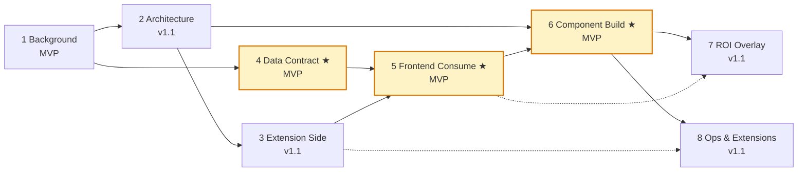

# ne101_camera: The Most Complex Device-Bound Component in the NeoMind Ecosystem

> **One-sentence positioning**: the flagship component that brings the CamThink NE101 sensing camera into the Dashboard — it is the first component in the NeoMind marketplace to combine device binding + image canvas + AI processing pipeline + ROI overlay in a single bundle, extending the entry-level metric_card "show a number" story into a full "device → inference → visual overlay" chain.

This is the "flagship deep-dive case" of the NeoMind component marketplace. The previous six cases (with [#6 metric_card](../6-metric-card-component.md) as the direct prerequisite) teach you "how to write a component"; this case's eight subpages answer "how to write a complex component that wires hardware + AI + visual effects together". After reading it you will understand why NeoMind's "IIFE + `window.React` injection" pattern (instead of ESM bundling) scales to 1972 lines of hand-written code, and why the manifest combination `has_data_source: false` + `has_device_binding: true` is the canonical signature of any device-bound component.

---

## 0 Recommended Reading Path

The flagship case has eight subpages organized by dependency. Read them in the order below; pages marked ★ are MVP core (required reading for the v1 release), the rest are v1.1 increments.

```
1 Background → 2 Architecture → 3 Extension Side → 4 Data Contract ★ → 5 Frontend Consume ★ → 6 Component Build ★ → 7 ROI Overlay → 8 Ops & Extensions
```

If you are short on time and only want to understand "how this component works", read 1 + 2 + 4 + 5 + 6. If you plan to fork the component or retarget it to another camera device, also read 3 (the extension-side contract) and 7 (ROI rendering).

---

## 1 Eight-Subpage Index

| # | Title | Role | Status |
|---|-------|------|--------|
| 1 | [Business Background](./1-background.md) | NE101 device capabilities + why a dedicated component is needed + ecosystem positioning | MVP |
| 2 | 2-architecture.md (v1.1) | Module breakdown of the 1972-line IIFE, component tree, data flow | v1.1 |
| 3 | 3-extension-side.md (v1.1) | The `processingExtensionId` generic contract + how extensions consume images | v1.1 |
| 4 | 4-data-contract.md ★ | MQTT topics, WebSocket deltas, the `detections` field schema | MVP |
| 5 | 5-frontend-consume.md ★ | How the component fetches detections, parses JSON strings, colors per class | MVP |
| 6 | 6-component-build.md ★ | The `NE101CameraPanel` named export, IIFE injection, React-hooks-in-IIFE pitfalls | MVP |
| 7 | 7-integration-test.md (v1.1) | End-to-end integration tests, ROI overlay verification, multi-extension switching matrix | v1.1 |
| 8 | 8-deep-dive.md (v1.1) | Version evolution (25+ commits), debug traces, performance tuning, source hygiene recap | v1.1 |

---

## 2 Relationship to #6 metric_card: From Starter to Flagship

This case is a direct continuation of [#6 metric_card](../6-metric-card-component.md), but **an order of magnitude more complex**. The table below maps the two cases so you can build a "starter → flagship" cognitive ladder.

| Dimension | metric_card (starter) | ne101_camera (flagship) |
|-----------|-----------------------|-------------------------|
| `bundle.js` lines | 352 | 1972 (5.6×) |
| Component type | Display (`category: "display"`) | Device (`category: "device"`) |
| Data access | Binds a data source (`has_data_source: true`) | Binds a device (`has_device_binding: true` + `device_type_filter`) |
| Renders images | No (scalars only) | Yes (JPEG capture + Canvas ROI overlay) |
| Triggers AI inference | No | Yes (via `processingExtensionId`) |
| Named export | `NeoMind_MetricCard` | `NE101CameraPanel` (note: **not** `default`) |
| Hardest topic | OKLCH + CSS variable glass | ROI normalized coords + `processingRoiOverlap` threshold + React-in-IIFE hooks pitfalls |

**Recommendation**: if you have not read the metric_card case yet, read its 1-3 first. metric_card teaches the triple "IIFE injection + manifest contract + fetchData pull"; that triple remains the underlying skeleton of ne101_camera, with two additional layers (device binding and AI processing) stacked on top.

---

## 3 What You Will Learn

Reading all eight sections will give you five key capabilities:

1. **The essential difference between device binding and data source** — why NE101 uses `has_device_binding: true` + `device_type_filter: ["ne101_camera"]` instead of `has_data_source: true`. This determines whether the dashboard editor shows a "bind device" panel and whether the component can invoke device commands like `trigger_capture`. See [1 Business Background](./1-background.md).

2. **How a 1972-line IIFE stays maintainable** — `bundle.js` has no build step at all; it is entirely hand-written IIFE. We break down its module layers (helpers / data layer / canvas layer / React layer / settings panel layer) and explain why NeoMind chose this pattern over ESM. See [6 Component Build](./6-component-build.md) (v1.1).

3. **The `processingExtensionId` generic AI processing contract** — the most important design innovation in this case: the component does not run AI itself; instead, the `processingExtensionId: ""` field lets the user pick an installed extension (object_detection / ocr / describe / any `locate-anything-v2`-compatible extension) to "outsource" the image to. This "component + pluggable extension" contract is the template for AI reuse across the NeoMind ecosystem. See [3 Extension Side](./3-extension-side.md) (v1.1).

4. **Engineering details of ROI overlay rendering** — from single-rectangle ROI (`processingRoiX/Y/W/H`, normalized 0-1) to multi-ROI arrays (`processingRois: []`), from center-point detection (deprecated) to the `processingRoiOverlap: 0.6` IoU-threshold detection. This involves Canvas coordinate mapping, the non-linear scaling of `objectFit: contain`, and the async setup of ResizeObserver. See [5 Frontend Consume](./5-frontend-consume.md) and [7 Integration Test](./7-integration-test.md).

5. **The React-in-IIFE pattern and its pitfalls** — writing React hooks inside a 1972-line IIFE has surprising traps: for example, `b060a25` fixes React error #310 (a useEffect that used hooks depending on uninitialized state), and `0601cd4` moves a conditional useState to the top level to keep hook order stable. These traps do not arise in bundled React projects but must be handled explicitly in the IIFE pattern. See [6 Component Build](./6-component-build.md) (v1.1).

---

## 4 Reading Dependency Graph

The diagram below shows the knowledge dependencies among the eight subpages. Solid arrows mean "must read prerequisite first"; dashed arrows mean "recommended but skippable". ★ marks MVP core (required for v1).



**Shortest learning path (MVP only)**: 1 Background → 4 Data Contract → 5 Frontend Consume → 6 Component Build. These four sections are enough to understand the full "NE101 capture → MQTT → NeoMind → extension inference → component render" chain.

**Full learning path (all eight)**: read in order 1 → 2 → 3 → 4 → 5 → 6 → 7 → 8. Best for developers planning to fork the component or retarget it to another camera device.

---

## 5 Case Info Card

| Field | Value |
|-------|-------|
| Component ID | `ne101_camera` |
| Version | `2.14.9` (as of this writing) |
| Author | CamThink Team |
| `bundle.js` lines | 1972 (hand-written IIFE, not a build artifact) |
| `manifest.json` lines | 40 |
| Source repo | [camthink-ai/NeoMind-Dashboard-Components](https://github.com/camthink-ai/NeoMind-Dashboard-Components/tree/main/components/ne101_camera) |
| Git commits (component dir) | 25+ |
| Prerequisite case | [#6 metric_card](../6-metric-card-component.md) (starter component case) |
| Successor case | none (this is currently the most complex case in the marketplace) |

---

## 6 Next

- Want to understand "why NE101 needs a dedicated component" → [1 Business Background](./1-background.md)
- Want to jump straight to code structure → 2 Architecture (v1.1)
- Want to understand the AI processing contract → 3 Extension Side (v1.1) + 4 Data Contract (MVP)
- Want React implementation details → 5 Frontend Consume (MVP) + 6 Component Build (MVP)

---

*Last updated: 2026-06-23*
