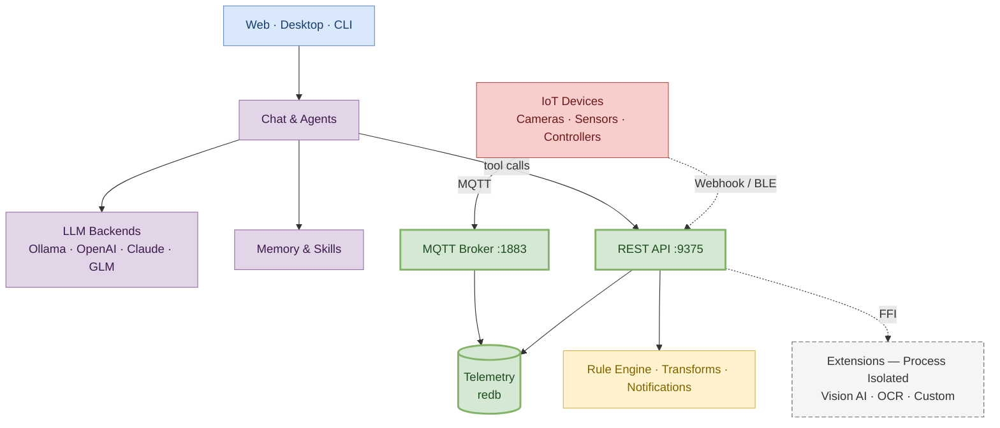

# What is NeoMind?

NeoMind is an **edge-deployed AI platform** that brings intelligence to IoT. It runs LLM-powered agents directly on your hardware, connects to devices via MQTT / BLE / Webhook, automates responses through a rule engine, and visualizes everything on real-time dashboards — all without relying on cloud services.

**Key idea**: Talk to your devices in natural language. The AI understands your intent, queries device states, creates automation rules, and takes action autonomously.

## Product at a Glance

Three core surfaces of NeoMind — manage your devices, visualize your data, and drive everything through natural language.

---

## Product Architecture

NeoMind uses a **single-process, multi-layer** architecture — all core capabilities are packaged in one process, with no external database or message broker required. It's ready the moment you start.

:::tip Three Design Philosophies

1. **Single-Process, Self-Contained** — API, MQTT broker, storage, and rule engine all live in one process. A single `cargo run` and everything is ready. No Docker compose, no external dependencies.

2. **Edge-First, Cloud-Optional** — Defaults to local LLMs (Ollama) for 100% offline operation — data never leaves your LAN. When you need more power, switch to cloud models (OpenAI / Claude / GLM) with one click.

3. **Crash-Isolated Extensions** — Extensions run in separate processes and communicate via FFI. A YOLO extension crashes? The main service and other extensions are completely unaffected.
   :::

> Want to go deeper into each layer's design? Read [Core Concepts](../concepts/2-core-concepts.md) — full breakdown of the data lifecycle, extension model, and agent execution loop.

---

## Why NeoMind?

| Feature | Description |
|---------|-------------|
| **Fully self-contained** | Embedded MQTT broker, redb storage, no external database or broker to install |
| **Type-safe end-to-end** | Rust backend with compile-time guarantees; agent CLI commands dispatch in-process with structured data, no fragile string parsing |
| **Crash-proof extensions** | Extensions run in isolated processes with capability-based permissions; a misbehaving extension never takes down the server |
| **Cloud-optional** | Works 100% offline with local LLMs (Ollama), or connect cloud models when you need more power |

## Core Capabilities

### AI Intelligence
- **Natural Language Chat** — Conversational interface to query and control all connected devices
- **Autonomous Agents** — Scheduled or event-driven AI agents that monitor, analyze, and act on device data independently
- **10+ LLM Backends** — Ollama, OpenAI, Anthropic, Google, xAI, Qwen, DeepSeek, GLM, MiniMax, and any OpenAI-compatible endpoint
- **Memory System** — Multi-tier memory (Profile / Knowledge / Tasks / Evolution) with automatic extraction and compression
- **Skill System** — YAML + Markdown skill files that guide agent behavior for specific scenarios
- **Multimodal** — Image upload and visual analysis support

### Device Management
- **MQTT Protocol** — Primary device integration with embedded broker, mTLS, and CA certificate support
- **BLE Provisioning** — Zero-touch device setup via Bluetooth (Tauri native + Web Bluetooth)
- **HTTP / Webhook** — Flexible REST-based device adapter
- **Auto-Discovery** — Automatic device detection, type registration, and AI-assisted onboarding
- **Command Queue** — Send control commands to devices with parameter validation and tracking
- **Custom Device Types** — Define device metrics and commands via JSON type definitions

### Automation
- **JSON Rule Engine** — Structured rule definitions: `{"condition": {"source": "device:sensor:temperature", "operator": "greater_than", "threshold": 30}}`
- **Data Transforms** — JavaScript-based data transformation for creating virtual metrics
- **Scheduled Agents** — Time-based or event-driven AI agent execution
- **Event Bus** — Pub/sub architecture for decoupled component communication

### Dashboards & Visualization
- **Drag-and-Drop Builder** — Visual dashboard editor with responsive grid layout
- **Rich Widgets** — Value cards, charts, gauges, tables, VLM vision components
- **Real-time Updates** — WebSocket / SSE for live data streaming to dashboards
- **Dashboard Sharing** — Public links with expiration
- **Custom Components** — Build and publish your own dashboard widgets

### Notification & Data Push
- **7 Notification Channels** — Webhook, Email, Telegram, WeCom, DingTalk, Slack, Feishu
- **Data Push** — Forward telemetry data to external systems via Webhook or MQTT
- **Delivery Tracking** — Exponential backoff retry, delivery history, and log management
- **Message Deduplication** — Prevent notification storms from high-frequency triggers

### Platform
- **Multi-Instance** — Connect to and manage multiple NeoMind backends from a single interface
- **Extension System** — Native & WASM extensions with process isolation and capability-based permissions
- **Cross-Platform Desktop** — macOS, Windows, Linux native apps via Tauri
- **Mobile-Friendly Web** — Responsive web UI optimized for phone and tablet
- **i18n** — English and Chinese
- **Dark Mode** — System-aware dark/light theme
- **API Key Auth** — Alternative to JWT for programmatic access
- **CLI Tools** — Full-featured command-line interface

## Ecosystem

NeoMind is a modular ecosystem with specialized repositories for each concern:

| Repository | Purpose |
|------------|---------|
| **[NeoMind](https://github.com/camthink-ai/NeoMind)** | Core platform — backend, frontend, desktop app |
| **[NeoMind-Extensions](https://github.com/camthink-ai/NeoMind-Extensions)** | Official extension marketplace — weather, YOLO detection, OCR, face recognition, streaming |
| **[NeoMind-DeviceTypes](https://github.com/camthink-ai/NeoMind-DeviceTypes)** | Device type definitions — standardized metrics and commands for IoT hardware |
| **[NeoMind-Dashboard-Components](https://github.com/camthink-ai/NeoMind-Dashboard-Components)** | Dashboard widget marketplace — community-contributed React components |

## Who It's For

- **IoT integrators / solution engineers** — Need to rapidly build edge intelligent solutions connecting cameras, sensors, and controllers with automation
- **Industrial / campus / retail operators** — Want to manage devices, configure alerts, and visualize data in natural language
- **Secondary developers** — Extend the platform via the Extension SDK, custom device types, or dashboard components
- **AI application engineers** — Run multimodal LLM agents at the edge, connected to real physical devices

## Next Steps

- [5-Minute Quick Start](../quick-start/1-five-minute-guide.md) — Experience the core loop in record time
- [Core Concepts](../concepts/2-core-concepts.md) — Understand the system overview and data flow
- [Glossary](../concepts/1-glossary.md) — Central definitions for all core terminology
- [Install & Setup](../user-guide/1-install-setup.md) — Get NeoMind running on desktop or server
- [Configure LLM Backend](../user-guide/2-configure-llm.md) — Connect Ollama or cloud models
- [Onboard a Device](../user-guide/3-onboard-device.md) — Use the onboarding wizard
- [AI Agent](../user-guide/6-ai-agent.md) — Create autonomous agents
- [Automation Rules](../user-guide/7-automation-rules.md) — JSON rule engine
- [Extensions](../user-guide/9-extensions.md) — Install vision AI / OCR extensions
- [Developer Guide Overview](../developer-guide/1-overview.md) — Start from one of four dimensions: device types / extensions / dashboard components / main project
- [Use Cases](../use-cases/1-object-detection.md) — End-to-end scenario examples

---

*Last updated: 2026-06-15*
