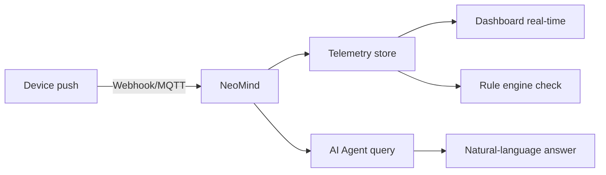

# 5-Minute Quick Start

Experience NeoMind's core loop — **device ingress → data visualization → AI conversation** — as fast as possible. Each step has a ✓ checkpoint and troubleshooting tips.

> For full installation options and troubleshooting see [Install & Setup](../user-guide/1-install-setup.md).

---

## What You'll Achieve

By the end of this guide you will have:

- ✅ A NeoMind service running locally
- ✅ A large language model connected (local or cloud)
- ✅ Your first device connected and pushing data via webhook
- ✅ Live data visible on a dashboard
- ✅ Asked the AI a question in natural language and gotten an answer

:::tip Prerequisites

- A **macOS / Windows / Linux** machine (4 GB+ RAM)
- **No** need to pre-install databases, message brokers, or any other infrastructure — everything is built into NeoMind
- For a local LLM (recommended): an extra 4–8 GB RAM; otherwise you can use a cloud API
  :::

---

## Step 1: Install (1 min)

### Option A: Desktop App (recommended)

Download the installer for your platform from [GitHub Releases](https://github.com/camthink-ai/NeoMind/releases/latest), double-click to install, then launch.

### Option B: Server Deploy

```bash
curl -fsSL https://raw.githubusercontent.com/camthink-ai/NeoMind/main/scripts/install.sh | sh
```

After startup, open `http://localhost:9375` in your browser.


> ✓ **Checkpoint**: you see the login / register page = the server is running. Register an account and log in.

:::note Can't see the page?

- **Port in use?** Default port is `9375`; you can change it in the config file
- **macOS security block?** First launch shows "cannot verify developer" — go to `System Settings → Privacy & Security → Open Anyway`
- **Server without a browser?** Use SSH port forwarding: `ssh -L 9375:localhost:9375 user@server`
  :::

---

## Step 2: Configure LLM Backend (1 min)

On first login you'll enter the setup wizard. NeoMind needs an LLM backend as its "brain" — pick one of three options:

| Option | Best for | Latency | Privacy | Requires |
|--------|----------|---------|---------|----------|
| **Ollama (local)** | Recommended, offline use | Low | Never leaves LAN | 8 GB+ RAM |
| **Cloud API** | Most powerful models | Medium | Data goes to cloud | API Key |
| **Skip for now** | Just look around | — | — | — |

### Option A: Ollama Local (recommended)

```bash
# 1. Install Ollama (if you haven't): https://ollama.com
# 2. Pull the model
ollama pull qwen3.5:4b
```

In the wizard:

1. Backend type → **Ollama**
2. URL → `http://localhost:11434` (default)
3. Model → `qwen3.5:4b`


### Option B: Cloud API

Pick OpenAI / Anthropic / GLM etc., enter your API Key and model name (e.g. `gpt-4o`, `claude-sonnet-4-6`).

> ✓ **Checkpoint**: the wizard shows **"LLM backend connected"** = the brain is ready.

:::note Connection failed?

- **Ollama not running?** Start it with `ollama serve` in a terminal
- **Model not pulled?** Run `ollama list` to confirm `qwen3.5:4b` exists
- **Cloud 401?** Check that your API Key is valid and has credit
  :::

> See [Configure LLM Backend](../user-guide/2-configure-llm.md).

:::tip Prefer the CLI?
Skip the UI — one command does it:

```bash
# Ollama local
neomind llm create --name local --type ollama --endpoint http://localhost:11434 --model qwen3.5:4b

# Cloud API (GLM example)
neomind llm create --name glm --type openai \
  --endpoint https://open.bigmodel.cn/api/paas/v4 \
  --model glm-4-flash --api-key YOUR_API_KEY

# Test connection → set as default
neomind llm test local && neomind llm activate local
```

Full command reference: `neomind llm --help`
:::

---

## Step 3: Connect Your First Device (1 min)

The fastest ingress method is **HTTP Webhook** — no MQTT client needed, a single `curl` simulates a device.

### 3.1 Create the device

In the Web UI **Devices** page → click **Add Device** → select **Webhook** → name it `demo-sensor`.

After creation you'll get a dedicated Webhook URL (like `/api/devices/<DEVICE_ID>/webhook`).

<div style={{display: 'flex', gap: '8px'}}>
  
  
</div>

### 3.2 Push data

Copy the command below, replace `<DEVICE_ID>` with your device's ID, and run it:

```bash
curl -X POST http://localhost:9375/api/devices/<DEVICE_ID>/webhook \
  -H 'Content-Type: application/json' \
  -d '{"temperature": 25.6, "humidity": 60}'
```

A `{"success": true}` response means it worked. Open the device detail page to see the latest telemetry values.


> ✓ **Checkpoint**: the device detail page shows `temperature: 25.6` and `humidity: 60` = data is in the database.

:::tip Connect real devices too

NeoMind has a built-in MQTT broker (`localhost:1883`) that supports real devices like ESP32, Raspberry Pi, industrial sensors, and more. See [Onboard Devices](../user-guide/3-onboard-device.md).
:::

:::note webhook returned 404?

- **Wrong device ID?** Click into the device in the device list — the ID is in the URL
- **Forgot Content-Type?** You must include `-H 'Content-Type: application/json'`
  :::

---

## Step 4: See Data on the Dashboard (30 sec)

Go to the **Dashboard** page — a default dashboard is auto-created. Click **Edit**, then add a **Value Card** widget:

1. Click **Add Widget** → choose **Value Card**
2. Data source → `device:demo-sensor:temperature`
3. Save


:::info DataSourceId Format

The unified data source reference format is `{type}:{id}:{field}`:

- `device:demo-sensor:temperature` — device telemetry
- `extension:weather:temp` — extension metric
- `agent:guard:status` — agent status

Dashboards, rules, and data pushes all use this format. See the [Glossary](../concepts/1-glossary.md).
:::

The temperature value appears live on the card. Push another webhook payload and watch it update instantly:

```bash
curl -X POST http://localhost:9375/api/devices/<DEVICE_ID>/webhook \
  -H 'Content-Type: application/json' \
  -d '{"temperature": 28.3, "humidity": 55}'
```

> ✓ **Checkpoint**: you see a live temperature reading on the dashboard = visualization loop is working.

> See [Use Dashboard](../user-guide/4-use-dashboard.md).

---

## Step 5: Ask AI Chat (30 sec)

Open **AI Chat** and type:

> What devices do I have? What's the temperature of demo-sensor?

The AI Agent will query the device list and latest telemetry, then answer in natural language.


Now try something more ambitious — let the AI create an automation for you:

> Notify me when temperature exceeds 30

The AI will understand your intent, create a rule, and configure a notification channel.

> ✓ **Checkpoint**: the AI answered your question = the intelligence loop is complete.

:::note AI not responding?

- **LLM backend not connected?** Go back to **Settings → LLM Config** and check status
- **First reply is slow?** Local models need to warm up on first inference — 10–20 seconds is normal
  :::

> See [AI Chat](../user-guide/5-ai-chat.md).

---

## 🎉 Core Loop Complete

Here's the pipeline you just verified end-to-end:



**Every link is verified**: data comes in, gets stored, is visualized, and can be queried.

---

## Next Steps

Congratulations! You've completed the NeoMind core loop. From here:

| I want to... | Go to |
|--------------|-------|
| Understand the architecture | [Core Concepts](../concepts/2-core-concepts.md) — process model, data flow, extension mechanism |
| Look up a term | [Glossary](../concepts/1-glossary.md) — Device / Extension / Agent / Rule |
| Configure more LLM backends | [Configure LLM Backend](../user-guide/2-configure-llm.md) — Ollama / cloud API |
| Connect real devices | [Onboard Devices](../user-guide/3-onboard-device.md) — MQTT / BLE / Webhook |
| Automate with AI Agents | [AI Agent](../user-guide/6-ai-agent.md) — scheduled / event-triggered autonomous agents |
| Set up automation rules | [Automation Rules](../user-guide/7-automation-rules.md) — threshold alerts / linked control |
| Configure notifications | [Notifications](../user-guide/8-notifications.md) — email / Slack / Telegram / Webhook |
| Install extensions (YOLO/OCR) | [Extensions](../user-guide/9-extensions.md) — install and configure vision AI extensions |
| See an end-to-end example | [Use Cases](../use-cases/1-object-detection.md) — full object detection solution |
| Troubleshoot issues | [Troubleshooting](../user-guide/10-troubleshooting.md) — common problems and solutions |

---

*Last updated: 2026-06-15*
