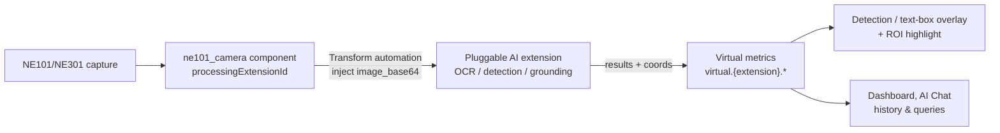

# NE101 Camera AI Vision

> One component, many AI vision capabilities — this guide walks the pluggable pipeline end-to-end with OCR (meter reads, product labels); swap `processingExtensionId` for the others.

---

## 1. Solution Overview

The NeoMind **NE101 camera component (`ne101_camera`)** is more than a display widget — it ships with a built-in **AI processing pipeline**. The component itself does not run AI; instead, through the `processingExtensionId` contract it hands every captured frame to an extension of your choice for inference, then renders the results back onto the image as overlays and virtual metrics.

The pipeline is **pluggable** — swap in a different extension and the same component performs a different kind of AI vision task:

| AI capability | Extension | Typical scenarios |
|------|------|------|
| **OCR / text recognition** | paddle-ocr-v6 / paddle-ocr-vl | Meter readings (water/electricity/gas), product and price labels, digital instruments, nameplates and serial numbers, documents and forms |
| **Object detection** | yolo-device-inference / image-analyzer-v2 | People counting, vehicle detection, zone intrusion alerts |
| **Open-vocabulary grounding** | locate-anything-v2 | Find or count arbitrary objects by natural language, defect localization, zero-shot counting |

> Beyond the structured pipeline, you can also use an **AI Agent + vision LLM** for open-ended scene understanding (description, reasoning, alerts) — see Section 7.

This guide uses **OCR / text recognition** (with `paddle-ocr-v6`) as a full walkthrough of the pipeline, from install to results; other capabilities follow the exact same configuration, only swapping `processingExtensionId` in step 5.3. The walkthrough uses **water-meter reading** and **product labels** as the OCR examples.

**Data Flow**:



Inference results are written to virtual metrics `virtual.<extension>.*`; the component overlays detection or text boxes on the image (optionally with ROI highlight) from them, and they are available to dashboards and AI Chat.

---

## 2. Bill of Materials (BOM)

| Item | Model / Spec | Qty | Purpose | Required |
|------|----------|------|------|------|
| **Smart camera** | NE101 or NE301 | 1+ | Image capture | ✅ |
| **NeoMind platform** | v0.8.0+ | 1 | Edge AI management | ✅ |
| **paddle-ocr-v6 extension** | v2.7.8+ | 1 | Local OCR inference engine | ✅ |
| **ne101_camera component** | v2.14.10+ | 1 | Camera panel + AI processing pipeline | ✅ (from the component marketplace) |
| **Local LLM** | Ollama, etc. | 1 | AI Chat backend | Optional |

---

## 3. Prerequisites

### 3.1 Install and configure NeoMind

Complete NeoMind installation, registration, and basic configuration — see [NeoMind Quick Start](../user-guide/1-install-setup.md).

### 3.2 Onboard the device

Register the NE101 or NE301 with the NeoMind platform (device type `ne101_camera`) — see [NeoMind Quick Start - Device Management](../user-guide/3-onboard-device.md).


---

## 4. Install the Extension and Component

### 4.1 Install the paddle-ocr-v6 extension

Go to the **Extensions** page, open the marketplace, search for **paddle-ocr-v6**, and download/install it; after installation, confirm the status is **Running**.


paddle-ocr-v6 offers four inference tiers, switchable in the extension config or the component panel:

| Tier | Size | Use case |
|------|------|------|
| `tiny` | ~6MB (bundled) | Lightweight CPU, offline (no Japanese) |
| `small` | ~18MB (lazy download) | CoreML or CUDA available, higher accuracy |
| `medium` | ~132MB (lazy download) | CUDA with ≥16GB RAM, highest accuracy |
| `auto` | — | Default; auto-selects by host capability |

### 4.2 Confirm the ne101_camera component is available

`ne101_camera` is an official component in the dashboard component marketplace. If it does not appear in the component library, install it from the marketplace (see [Extension Management](../user-guide/9-extensions.md)).

---

## 5. Dashboard Configuration: Camera + OCR Pipeline

### 5.1 Add the NE101 camera component

Go to **Dashboard**, create a dashboard, click **Add Panel**, and select the **NE101 Camera Panel** component. The first time you use it, you need to download the component package.


### 5.2 Configure the component and bind a device

After adding the component, bind an onboarded NE101 or NE301 device in the config panel; once bound, the panel shows the live feed, online status, and battery level.


### 5.3 Enable AI inference and select the extension

In the **Advanced** section of the component config, turn on **AI Inference**, and select **paddle-ocr-v6** from the extension dropdown (the extension must be installed first to appear in the list). The template is then auto-set to `text_detection`, which calls the extension's `recognize` command. This walkthrough uses OCR; for object detection, grounding, and other capabilities, see the extensions, templates, and parameters in Section 6.


### 5.4 Set a Region of Interest (optional)

Often only part of the frame is the content to read, such as a meter's digit wheels or the text area of a label. Enabling **ROI** highlights regions of interest on the image and lets you choose a counting strategy via `processingRoiAction` — `count`, `filter` (inside only), or `filter_outside` (outside only) — and tune the detection-box-vs-ROI overlap threshold via `processingRoiOverlap` (default `0.6`). ROIs support polygons, so you can draw one or more regions of interest directly on the image in the config panel.


### 5.5 Auto-generated data transform task

Once AI inference is enabled, NeoMind automatically creates a **data capture / transform task** (the Transform automation, named like `ne101-{deviceId}-paddle_ocr_v6-text_detection`): whenever the device uploads a new frame, it injects the image into paddle-ocr-v6's `recognize`, and the returned `text_blocks` are written to virtual metrics.


```
virtual.paddle_ocr_v6.texts             // ["00238", "m³"]   recognized text
virtual.paddle_ocr_v6.detections        // [{bbox, polygon, label, confidence}, ...]
virtual.paddle_ocr_v6.inference_time_ms // per-frame inference time (ms)
```

The task's transform rules are editable, so you can define richer post-processing logic — for example, parsing a reading string into a number, or filtering out noisy text.


The component reads these virtual metrics, overlays text boxes on the image by their normalized coordinates, and shows the extracted text, detection count, and inference time in the bottom info bar.

---

## 6. Application Scenarios

This section lists typical scenarios by AI capability. Device onboarding, component setup, binding, and ROI config are identical across all scenarios (Sections 3–5); the only difference is **the extension, template, and parameters chosen in step 5.3**:

| AI capability | Extension | Template | Key parameter |
|---|---|---|---|
| OCR / text recognition | paddle-ocr-v6 / paddle-ocr-vl | `text_detection` | — |
| Object detection | yolo-device-inference / image-analyzer-v2 / locate-anything-v2 | `object_detection` | `processingCategories` (e.g. `person,car`) |
| Open-vocabulary grounding | locate-anything-v2 | `grounding` | `processingPhrase` (natural-language description) |

### 6.1 OCR / text recognition

**Water-meter reading**: face the camera at the meter, draw the ROI over the reading area, and set `processingRoiAction = filter` to discard the logo, model, and other irrelevant text. After capture, recognized digits and units (e.g. `00238`, `m³`) are overlaid; the reading can be parsed into a number via [Data Transform](../user-guide/7b-data-transforms.md) to plot consumption trends.


**Product labels**: aim the camera at shelf price tags or conveyor labels, draw the ROI over the main text area (name, SKU, price, batch), and use multiple ROIs for multiple labels. The returned text can be pushed to ERP or reconciliation systems, or aggregated in the dashboard as "SKUs recognized this round".

> For complex layouts (tables, invoices, warped documents), switch to `paddle-ocr-vl` (VLM; requires a GPU service).

### 6.2 Object detection

Select `yolo-device-inference` (or `image-analyzer-v2`); the template auto-switches to `object_detection`, and you fill `processingCategories` with the classes of interest (e.g. `person,car`). After capture, detection boxes with class labels are overlaid, and results are written to virtual metrics for counting, statistics, and alerts.

- **People counting / vehicle detection**: `processingCategories = person` or `car`, combined with ROI `count` to tally targets in a region.
- **Zone intrusion alerts**: define a forbidden ROI, set `processingRoiAction = filter`, and trigger when a target appears inside it — pair with [Automation Rules](../user-guide/7-automation-rules.md) to push alerts.
- **Custom targets**: for targets outside the stock COCO 80 classes (uniforms, helmets, proprietary products), replace the extension's ONNX model with a custom-trained one.

### 6.3 Open-vocabulary grounding

Select `locate-anything-v2`; the template switches to `grounding`, and you describe the object to find in `processingPhrase`. The model locates it zero-shot, overlays grounding boxes, and counts matches — ideal for classes a fixed detector doesn't know or ad-hoc needs.

- **Natural-language counting**: `processingPhrase = people in red vests`, `red products on the shelf`, `trash on the floor` — returns all matching locations and a count.
- **Defect / foreign-object localization**: describe the anomaly (e.g. `scratch`, `leftover tool`) to aid localization, then combine with ROI or manual review.

> [`locate-anything-v2`](./6-locate-anything-v2.md) also supports `text_detection` (text localization) and `point` (pointing) templates — switch as needed.

---

## 7. LLM Scene Understanding: AI Agent Visual Analysis

The OCR, detection, and grounding capabilities above are a **structured pipeline** that returns deterministic text / boxes / classes. When you need more open-ended understanding — describing a scene, judging anomalies, giving recommendations, or reviewing history in natural language — use an **AI Agent + vision LLM** instead: the Agent binds to the camera device, analyzes each new frame with a vision LLM, and stores results in long-term memory for later queries. This path bypasses the `processingExtensionId` pipeline — the Agent consumes device images directly.

> A vision-capable LLM backend is required (e.g. a multimodal Ollama model or a cloud vision model) — see [Configure the LLM backend](../user-guide/2-configure-llm.md) and [AI Agent](../user-guide/6-ai-agent.md).

**Steps**:

1. **Create an AI Agent**: on the AI Agent page, create an Agent, bind the target camera device, and define what to analyze with a prompt (e.g. "describe on-site personnel activity and device status; alert on anomalies").


2. **Continuous capture + LLM analysis**: the Agent is event-triggered — each time the device uploads a frame, it calls the vision LLM to analyze the image.


3. **View analysis results**: each analysis's description, judgment, and recommendations are recorded in the Agent's run history.


4. **Long-term memory**: the Agent can write key information to long-term memory, accumulating context across runs (site baseline, past events, etc.).


5. **Review the site in natural language**: with memory and analysis history, ask the Agent to recap the device's deployment and on-site situation in natural language.


---

## 8. AI Chat Queries

Once results from any capability land in time-series data, you can query them in **AI Chat** using natural language, for example:

```
What's the reading trend of my-water-meter over the last 7 days?
How many people did the entrance camera count today? Which hours peaked?
List the product-label SKUs recognized today.
```

> AI Chat requires an LLM backend — see [Configure the LLM backend](../user-guide/2-configure-llm.md).

---

## 9. Tuning

### 9.1 Accuracy tuning

- **OCR**: the default `auto` tier covers most scenarios; for missed recognition, upgrade to `small` / `medium` or lower the detection threshold, and for false recognition, narrow the focus with ROI `filter`.
- **Object detection**: tune the confidence and NMS thresholds and tighten `processingCategories`; for proprietary targets, swap in a custom ONNX model.
- **Open-vocabulary grounding**: refine the `processingPhrase` wording and the NMS threshold to improve recall.

### 9.2 Relationship to the General OCR Solution

The [General OCR Solution](./2-ocr-text-extraction.md) uses a basic OCR panel for one-off recognition of a manual capture — "snap one, read one". This guide is a continuous-recognition / detection solution: always-on camera, automated pipeline, ROI overlay. Both build on the NeoMind extension system; pick by scenario.

---

## 10. Appendix

### Related docs

- [General OCR Solution](./2-ocr-text-extraction.md)
- [Object Detection Use Case](./1-object-detection.md)
- [Face Recognition Solution](./3-face-recognition.md)
- [LocateAnything Visual Grounding](./6-locate-anything-v2.md)
- [DeepStream Video Analytics (NG4500)](./7-deepstream-ng4500.md)
- [Extension Management](../user-guide/9-extensions.md)
- [Automation Rules](../user-guide/7-automation-rules.md)
- [AI Agent](../user-guide/6-ai-agent.md)
- [Data Transforms](../user-guide/7b-data-transforms.md)
- [Data Push](../user-guide/7c-data-push.md)
- [NE101 Camera Component Flagship Case Study](../developer-guide/case-studies/7-ne101-camera-component/index.md)

---

*Last updated: 2026-07-13*
