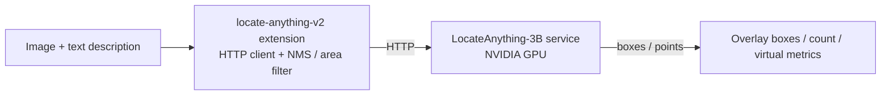

# LocateAnything Visual Grounding

> Open-vocabulary visual grounding via a VLM — a single phrase finds / counts any object in a frame, no pre-trained categories. A GPU server is required.

---

## 1. Solution Overview

locate-anything-v2 is an **HTTP bridge extension**: the extension is a lightweight client, while the LocateAnything-3B model runs in a separate Python inference service (NVIDIA GPU recommended). The extension handles result post-processing (NMS, area filtering).

"Open-vocabulary" is its core: unlike YOLO, which only recognizes its pre-trained 80 classes, you describe what to find in any natural language and the model locates it zero-shot.

**Five commands**:

| Capability | Command | Key parameter | Description |
|---|---|---|---|
| Category detection | `detect` | `categories` (e.g. `person,car`) | Detect by category |
| Phrase grounding | `ground` | `phrase` (natural language) | Zero-shot locate by description; `single`/`multi` |
| Text localization | `detect_text` | — | Locate all text in the frame |
| GUI grounding | `ground_gui` | `phrase`, `output_type` (box/point) | Locate UI elements in a screenshot |
| Pointing | `point` | `phrase` | Point to a specific object |

**Data Flow**:



---

## 2. Bill of Materials (BOM)

| Item | Spec | Purpose | Required |
|------|------|------|------|
| **NeoMind platform** | v0.8.0+ | Extension host | ✅ |
| **locate-anything-v2 extension** | v2.7.7+ | HTTP bridge + post-processing | ✅ |
| **GPU inference server** | NVIDIA GPU | Run the LocateAnything Python service | ✅ |
| **Local LLM** | Ollama, etc. | AI Chat backend | Optional |

---

## 3. Prerequisites: Deploy the Inference Service

The LocateAnything extension is just an HTTP client; the actual `nvidia/LocateAnything-3B` model (~6 GB) runs in a separate **Python inference service**. Built on FastAPI, it exposes these endpoints:

| Endpoint | Method | Purpose |
|----------|--------|---------|
| `/health` | GET | Health check; returns model and device status |
| `/detect` | POST | Detect by category |
| `/ground` | POST | Natural-language phrase grounding |
| `/detect_text` | POST | Localize all text in the frame |
| `/ground_gui` | POST | Localize a UI element |
| `/point` | POST | Point at an object |

It defaults to `http://127.0.0.1:9380`; the service source lives in the extension's `service/` directory (`server.py`, `locateanything_worker.py`, `Dockerfile`, `docker-compose.yml`, `start.sh`). Two options: **Docker (recommended)** or **local run**.

### 3.1 Option 1: Docker (recommended, GPU machine)

The image is based on `pytorch/pytorch:2.6.0-cuda12.4-cudnn9-devel` and ships with the CUDA runtime.

**Prerequisite**: an NVIDIA GPU with the [NVIDIA Container Toolkit](https://docs.nvidia.com/datacenter/cloud-native/container-toolkit/) installed.

```bash
cd service/

# Build the image (first build is slower; installs deps)
docker build -t locate-anything-service .

# Optional: pre-download the model (~6 GB) at build time to skip the first-start wait
docker build --build-arg DOWNLOAD_MODEL=1 -t locate-anything-service .

# Run: map port, mount model cache volume, attach GPU
docker run -d --gpus all \
  -p 9380:9380 \
  -v locate-models:/models \
  locate-anything-service
```

Or use the included Compose file (equivalent, with auto-restart and a health check):

```bash
cd service/
docker compose up -d        # start
docker compose logs -f      # follow logs (first run downloads the model)
```

> The model is ~6 GB, cached in the `locate-models` volume (at `/models/huggingface` inside the container); the first start downloads it, which is why the health check's `start_period` is 300 s.

### 3.2 Option 2: Run locally

Good for dev/debug, or for running on a Mac (MPS) / a GPU workstation.

**Prerequisite**: Python 3.10+; install the CUDA build of PyTorch on NVIDIA GPUs, or use MPS on Mac.

```bash
cd service/

# Install deps (Mac/CPU-compatible; includes torch>=2.5)
pip install -r requirements.txt

# Use the start script (auto-detects the env, sets MPS fallback)
./start.sh                          # default port 9380, downloads the model
./start.sh --port 9381              # custom port
./start.sh --model /path/to/model   # use a local model path

# Or run directly
python server.py --host 0.0.0.0 --port 9380
```

Common environment variables:

| Variable | Default | Description |
|----------|---------|-------------|
| `LOCATE_ANYTHING_MODEL` | `nvidia/LocateAnything-3B` | HF model ID or local path |
| `LOCATE_ANYTHING_PORT` | `9380` | Listen port (read by `start.sh`) |
| `PYTORCH_ENABLE_MPS_FALLBACK` | `1` (`start.sh`) | macOS MPS fallback toggle |

> The inference device is auto-selected as `CUDA → MPS → CPU`; CUDA is recommended for production.

### 3.3 Verify the service is ready

On startup the model loads first (~6 GB, plus a first-time download — wait a few minutes). Once ready, confirm with `/health`:

```bash
curl http://127.0.0.1:9380/health
# {"status":"ok","model":"nvidia/LocateAnything-3B","device":"cuda"}
```

`status: ok` means the model is loaded; `model_not_loaded` means it is still loading or failed (check the service logs).

Back on the NeoMind extension detail page, run **`check_status`** to confirm the model is loaded.


---

## 4. Install and Configure the Extension

Go to the **Extensions** page, install **locate-anything-v2** from the marketplace, and in **Configuration** point `service_url` at the inference service (e.g. `http://<gpu-server-ip>:9380`).

| Parameter | Default | Description |
|--------|------|------|
| `service_url` | `http://127.0.0.1:9380` | LocateAnything service URL |
| `generation_mode` | `slow` | `fast` (MTP, fastest) / `slow` (NTP, most stable) / `hybrid` (fast + fallback) |
| `max_new_tokens` | `2048` | Max tokens per inference (128–8192) |
| `nms_iou_threshold` | `0.7` | NMS IoU threshold (lower = more aggressive filtering) |
| `min_area_ratio` | `0.0005` | Min box area as fraction of image (filters tiny boxes) |
| `max_area_ratio` | `0.98` | Max box area as fraction of image (filters huge boxes) |

> NMS and area filtering apply to `detect` / `ground` / `ground_gui`; `detect_text` and `point` are returned as-is. All three can be overridden per command via args.


---

## 5. Usage

### 5.1 Test with the Dashboard card (LocateCard)

The extension ships a frontend component, **LocateCard** — add it to the Dashboard to test visually, with no need to fill in raw command args:

1. Upload an image (the component compresses it automatically).
2. Switch mode at the top: **Detect / Locate / OCR / UI / Point** (maps to `detect` / `ground` / `detect_text` / `ground_gui` / `point`).
3. Enter a query in the bottom input: categories for Detect (e.g. `person,car`), a natural-language phrase for Locate/UI/Point (e.g. `people in red vests`); OCR needs no input.
4. Click run (or press Enter) — boxes / points overlay directly on the image, with elapsed time and count shown.

> Under the hood it calls the same extension commands; the card just wraps image upload, parameters, and result visualization.


### 5.2 Integrate with the NE101 camera component

In the [NE101 camera component](./4-camera-ocr.md), set `processingExtensionId` to **`locate-anything-v2`**:

- Template `object_detection` → `detect` command (by `processingCategories`).
- Template `grounding` → `ground` command (locate via `processingPhrase`).

The latter is the killer feature: describe what to monitor in one sentence, and the camera locates it zero-shot, always-on.

### 5.3 Via AI Chat

Tell [AI Chat](../user-guide/5-ai-chat.md) "use locate-anything to count the people in red vests in this image" — the LLM calls the command and interprets the result.

---

## 6. Typical Scenarios

### 6.1 Natural-language find / zero-shot counting

Use `ground` + `phrase` to find / count anything, no training needed:

- `phrase = people in red vests` → count safety supervisors.
- `phrase = red products on the shelf` → out-of-stock / display checks.
- `phrase = trash on the floor` → environment inspection.

Returns all matching locations and a count; pair with [Automation Rules](../user-guide/7-automation-rules.md) to trigger alerts.


### 6.2 Defect / foreign-object localization

Describe the anomaly (e.g. `scratch`, `leftover tool`, `foreign object`); after the model locates it, combine with ROI or manual review. Suited to sporadic, occasional defect checks without training a model per defect type.

### 6.3 Text and GUI localization

- `detect_text`: locate all text in a frame (lighter than OCR — positions only).
- `ground_gui` / `point`: locate UI elements or point to objects in screenshots, useful for RPA, automated testing, and accessibility.

---

## 7. Selection: locate-anything vs yolo-device-inference

| Dimension | yolo-device-inference | locate-anything-v2 |
|------|----------------------|--------------------|
| Classes | Fixed (COCO 80 / custom model) | Open-vocabulary (natural language, zero-shot) |
| Latency | Milliseconds | Seconds (VLM) |
| Deployment | Local ONNX, edge-runnable | Requires a GPU inference service |
| Best for | Stable detection of known classes, high throughput | Ad-hoc needs, unknown classes, "find X in words" |

> Known classes and speed → yolo; "find things in words" or fluid classes → locate-anything. Both can be swapped in the [NE101 camera component](./4-camera-ocr.md).

---

## 8. Appendix

### Related docs

- [NE101 Camera AI Vision](./4-camera-ocr.md)
- [Object Detection Use Case](./1-object-detection.md)
- [Extension Management](../user-guide/9-extensions.md)
- [AI Chat](../user-guide/5-ai-chat.md)
- [Automation Rules](../user-guide/7-automation-rules.md)

---

*Last updated: 2026-07-13*
