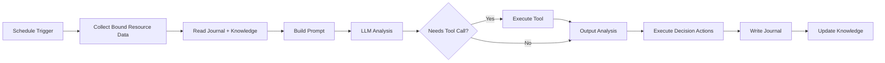

# AI Agent

AI Agent is NeoMind's **autonomous execution mode** — you set goals and triggers, and the Agent runs automatically on schedule or event, collecting data, calling LLM for analysis, and executing actions. Compared to [AI Chat](./5-ai-chat.md):

| Dimension | AI Chat (Interactive) | AI Agent (Autonomous) |
|-----------|----------------------|----------------------|
| Trigger | You send messages, real-time | Scheduled / event-triggered |
| Context | Conversation history | Memory system (journal + knowledge) |
| Use case | Ad-hoc queries, exploration, debugging | Long-term monitoring, scheduled checks, event response |
| Config | Go to Chat page | Create in Agents tab |

## Prerequisites

- An [LLM backend](./2-configure-llm.md) configured (Agents call LLM)
- [Devices](./3-onboard-device.md) onboarded (Agents need data sources)

## Creating an Agent

Go to **Agents** tab, click **Create Agent**, and fill in these core fields:

### 1. Name & Prompt

- **Name**: 1–100 characters, easy to identify (e.g., "Energy Patrol", "Device Health Monitor")
- **User Prompt**: Tell the Agent what to do. 1–10000 characters.

Example prompt:

> Check the latest readings from all temperature and humidity sensors. If any sensor reports temperature above 35C, notify the ops team via Slack and log an alert on the dashboard. If all devices are normal, give a brief summary.

### 2. Execution Mode

| Mode | Description | Best For |
|------|-------------|----------|
| **Focused** | Binds specific resources; Agent works within defined scope, single-pass analysis, token-efficient | Monitoring, alerts, data analysis |
| **Free** | No resource binding; LLM freely explores with all tools, multi-round reasoning | Complex automation, device control, exploratory tasks |

**Focused mode** requires bound resources (device metrics / extension metrics / devices / extension tools). The Agent only collects and analyzes data within the bound scope. Scope validation rejects commands outside bound resources.

**Free mode** needs no resource binding. The LLM has access to all tools (device / rule / message / extension / shell, etc.) and can do multi-round tool calls (default max 30 rounds, 5-minute timeout).

### 3. Schedule Type

Agents trigger automatically based on their schedule:

| Schedule | Description | Config |
|----------|-------------|--------|
| **Cron** | Triggers on cron expression | `schedule_type: "cron"`, `cron_expression: "0 */5 * * * *"` |
| **Interval** | Executes every N seconds | `schedule_type: "interval"`, `interval_seconds: 300` |
| **Event** | Triggers on device data change / alert | `schedule_type: "event"` |

**Cron examples**:
- Every hour: `0 0 * * * *`
- Daily at 8 AM: `0 8 * * *`
- Every 5 minutes: `0 */5 * * * *`

**Event trigger**: Executes automatically when devices push new data or the system generates alerts. Ideal for real-time response scenarios (e.g., immediate analysis after anomaly detection). Event triggers have a 60-second dedup window to prevent event storms.

### 4. LLM Backend

Each Agent can bind an independent LLM backend. Decoupled from the Chat model — switching Chat models doesn't affect Agent configuration. Recommendations:
- **Simple monitoring**: Local small model (`qwen3.5:4b`), lower latency and cost
- **Complex analysis**: Large model (`qwen3.5:32b` / cloud model), better reasoning quality

## Agent Memory System

Agents have an independent memory system that accumulates experience across execution cycles:

### Journal (Execution Log)

Each execution writes a journal entry recording:
- Execution time and trigger type
- Collected data summary
- LLM analysis conclusion
- Actions taken (`action_taken`)
- Success / failure status

On the next execution, the Agent reads recent journal entries to learn from historical patterns (avoid repeating failed actions, adjust thresholds, skip already-sent alerts).

### Knowledge Files

Agent's persistent knowledge in Markdown format:
- **identity.md** — Agent identity and responsibilities
- **mission.md** — Task objectives and constraints
- **resources.md** — Bound resource descriptions
- **schedule.md** — Execution plan

Auto-initialized on first execution. You can manually edit these files to fine-tune Agent behavior (Agent settings → Knowledge panel).

### User Messages (Feedback)

You can leave messages for the Agent (Agent detail page → User Messages), which the Agent reads on its next execution. Used to correct Agent behavior or provide additional context. Auto-retains the most recent 50 messages.

## Execution Flow



> Tool calls can loop (G → E) until the LLM no longer needs tools or hits the 30-round limit.

## Status Management

| Status | Description |
|--------|-------------|
| **Active** | Agent is active, auto-executes on schedule |
| **Paused** | Agent is paused, won't auto-trigger (can be run manually) |

Pause/activate syncs with the scheduler — pausing unschedules, activating reschedules.

### Manual Execution

Don't want to wait for the schedule? Click **Run Now** on the Agent detail page to execute immediately.

## Typical Scenarios

### Scenario 1: Hourly Temperature Patrol (Focused + Cron)

- **Mode**: Focused
- **Resources**: Bind 3 temperature sensor metrics
- **Schedule**: Cron `0 0 * * * *` (hourly)
- **Prompt**: Check the latest readings from all temperature sensors. Notify via Slack if above 35C. Send Telegram + email if above 45C.

### Scenario 2: Event-Driven Anomaly Diagnosis (Free + Event)

- **Mode**: Free
- **Resources**: None (free exploration)
- **Schedule**: Event (device data change)
- **Prompt**: Analyze whether the incoming data is anomalous. If abnormal, query related device history, determine if alerting or auto-remediation is needed. May use shell tool to check system status.

### Scenario 3: Daily Energy Report (Focused + Cron)

- **Mode**: Focused
- **Resources**: Bind energy consumption metrics
- **Schedule**: Cron `0 8 * * *` (daily 8 AM)
- **Prompt**: Summarize yesterday's 24-hour energy data, calculate peak and average, compare with the same period last week, generate a daily report, and send it to the ops email.

## CLI Management

```bash
# List all agents
neomind agent list

# View agent details
neomind agent get <agent_id>

# Activate / pause
neomind agent status <agent_id> --status active
neomind agent status <agent_id> --status paused

# Manually trigger execution
neomind agent run <agent_id>
```

## Concurrency & Timeout

- **Global concurrency**: Max 10 Agents executing simultaneously
- **Per-LLM-backend concurrency**: Max 2 concurrent requests per backend
- **Global timeout**: Max 5 minutes (300 seconds) per execution
- **Tool timeout**: Shell 30s (max 600s), Web fetch 15s, Extensions 300s

If concurrency is full, the scheduler skips the current execution (retries on next tick).

## Prompt Tips

- **Be specific about output**: "Generate a summary under 200 words" is more controllable than "analyze data"
- **Give conditional branches**: "If temp > 35 notify Slack; if > 45 also send Telegram and email"
- **Reference device names**: "Check sensor-01 through sensor-03" is more precise than "check all sensors"
- **Leverage memory**: The Agent reads journals, so you can write "If the same alert was already sent last time, don't repeat it"

## Integration with Other Modules

| Module | Integration |
|--------|-------------|
| [Automation Rules](./7-automation-rules.md) | Rule's `TRIGGER_AGENT` action can trigger Agents |
| [Notifications](./8-notifications.md) | Agent decides whether to send notifications after analysis |
| [Devices](./3-onboard-device.md) | Focused mode binds device metrics |
| [AI Chat](./5-ai-chat.md) | Two AI operation modes, complementary |

---

*Last updated: 2026-06-13 · NeoMind v0.8.11*
