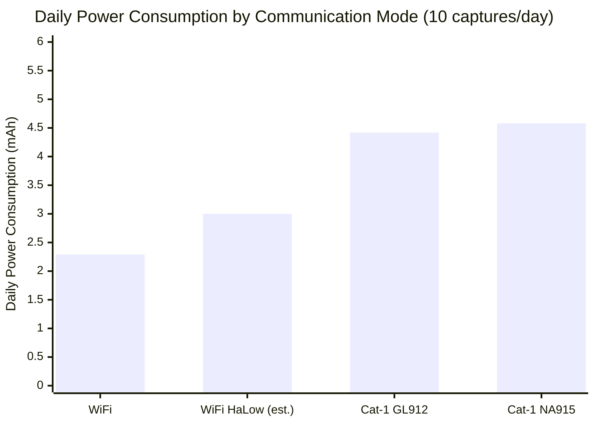

# Battery Recommendation

## Overview

NeoEyes NE101 and NE301 smart cameras are powered by 4 AA batteries by default, designed for outdoor low-power deployments. Choosing the right battery directly affects device operating time and system stability.

This document covers:

- **Battery fundamentals**: Common battery types, technical parameters, and discharge capabilities
- **Device compatibility**: Battery specifications and performance for NE101/NE301
- **Discharge requirements**: Actual battery demands under different operating modes (WiFi, Cat-1, WiFi HaLow)
- **Selection guidance**: Choosing the optimal battery based on use case and environmental conditions

> **Applicable devices**: NeoEyes NE101 series, NeoEyes NE301 series

## 1. Battery Fundamentals

### 1.1 Common Battery Types

AA batteries are the most common cylindrical battery form factor, 14.5mm in diameter and 50.5mm in height. Based on chemistry, AA batteries fall into the following categories:

| Battery Type | Nominal Voltage | Typical Capacity (AA) | Rechargeable | Characteristics |
|:---|:---|:---|:---:|:---|
| **Alkaline** | 1.5V | 1800-2850 mAh | ❌ | Widely available, good compatibility, relatively high internal resistance |
| **Lithium Iron** (Li-FeS₂) | 1.5V | 3000 mAh | ❌ | High energy density, low internal resistance, wide operating temperature range |
| **NiMH** | 1.2V | 600-2750 mAh | ✅ | Rechargeable but voltage incompatible (1.2V/cell, 4 cells yield only 4.8V); high self-discharge rate (20-30%/month) |
| **Li-SOCl₂ / 14500 Li-ion** | 3.6-3.7V | — | ❌ | Nominal voltage too high (3.6-3.7V/cell), 4 cells in series reach 14.4-14.8V, exceeding device rating |

### 1.2 Key Technical Parameters

| Parameter | Description | Impact on NE101/NE301 |
|:---|:---|:---|
| **Nominal voltage** | Average operating voltage during normal discharge | 4 cells in series: Alkaline/Li-FeS₂ = 6.0V (4×1.5V), NiMH = 4.8V (4×1.2V) |
| **Capacity (mAh)** | Total charge a battery can deliver; rated at low discharge current | Actual usable capacity may be lower than rated under high-current loads |
| **Discharge current** | Continuous discharge (sustained output) and pulse discharge (short peaks) | WiFi peak 300-500mA, Cat-1 peak up to 2A |
| **Self-discharge rate** | Rate of capacity loss when not in use | Long-term outdoor deployments require low self-discharge batteries |
| **Internal resistance** | Equivalent resistance inside the battery; determines voltage regulation under high current | Lower internal resistance means less voltage drop during pulse discharge |

**Internal resistance and discharge capability**: Internal resistance is the key parameter determining battery performance under high-current loads. During discharge, terminal voltage = nominal voltage - current × internal resistance. **Higher current causes greater voltage drop**. Batteries with high internal resistance may experience terminal voltage dropping below the device minimum operating voltage, causing unexpected shutdowns.

| Battery Type | Internal Resistance per Cell (Ω) | Self-discharge Rate | Shelf Life | Operating Temperature |
|:---|:---|:---|:---|:---|
| Alkaline | 0.15-0.3 | < 3%/year | 5-10 years | -20°C ~ 55°C |
| Li-FeS₂ | 0.12-0.2 | < 1%/year | 10-20 years | -40°C ~ 60°C |
| NiMH | 0.02-0.05 | 20-30%/month | 3-5 years | -20°C ~ 50°C |

> Alkaline and Li-FeS₂ batteries have similar internal resistance, but Li-FeS₂ maintains voltage better under high-current loads. NiMH has the lowest internal resistance but is not recommended due to voltage and self-discharge issues (see Section 2 for compatibility analysis).

**Practical impact of internal resistance on terminal voltage**:

Using 4 alkaline AA batteries in series as an example (combined internal resistance ~0.6-1.2Ω):

| Scenario | Peak Current | Voltage Drop | Terminal Voltage | Result |
|:---|:---|:---|:---|:---|
| WiFi module TX | 500 mA | 0.5A × 0.9Ω = 0.45V | 6.0V - 0.45V = 5.55V | ✅ Normal operation |
| Cat-1 module TX | 2 A | 2A × 0.9Ω = 1.8V | 6.0V - 1.8V = 4.2V | ⚠️ Close to device minimum voltage of 4.0V, limited voltage margin |

This explains why discharge requirements vary significantly across communication modes.

## 2. NE101/NE301 Battery Specifications and Compatibility

### 2.1 Default Battery Configuration

NE101 and NE301 are powered by 4 AA alkaline batteries by default:

| Parameter | Value | Description |
|:---|:---|:---|
| Battery count | 4 cells | Connected in series |
| Nominal voltage | 6.0V | 4 × 1.5V (fresh batteries ~6.4V) |
| Effective capacity | ~1750 mAh | Based on nominal capacity of ~2500mAh for high-quality AA batteries, minus ~30% losses (low-temperature degradation, self-discharge, voltage cutoff margin) |
| Operating voltage range | 4.0-6.0V | Device operates normally within this range (fresh open-circuit voltage can reach 6.4V) |

### 2.2 Battery Compatibility Overview

| Battery Type | Nominal Voltage (4 cells) | Compatibility | Description |
|:---|:---|:---:|:---|
| **Alkaline AA** | 6.0V | ✅ Preferred | Widely available, good compatibility, recommended for general use |
| **Li-FeS₂ AA** | 6.0V | ✅ Recommended | Better low-temperature performance, lower internal resistance, higher capacity; recommended for high-frequency capture and harsh environments |
| **NiMH AA** | 4.8V | ⚠️ Not recommended | Nominal voltage only 1.2V/cell, 4 cells in series yield 4.8V — above the device minimum operating voltage of 4.0V, but with limited voltage margin; high self-discharge rate (20-30%/month) makes it unsuitable for long-term unattended deployment |
| **Zinc-carbon AA** | 6.0V | ❌ Not recommended | Very low capacity (~600-900 mAh), extremely high internal resistance, poor pulse discharge performance |
| **Li-SOCl₂ / 14500 Li-ion** | 14.4-14.8V | ❌ Prohibited | Nominal voltage 3.6-3.7V/cell, 4 cells in series reach 14.4-14.8V, far exceeding device voltage rating, may damage the device |
| **Mixed brands/types** | — | ❌ Prohibited | Inconsistent internal resistance and capacity leads to individual cell over-discharge, affecting performance and safety |

> **Brand recommendation**: Use well-known alkaline battery brands (e.g., Energizer, Duracell, Panasonic) for more consistent quality and accurate capacity ratings.

### 2.4 Battery Capacity and Operating Life

Effective battery capacity directly determines device operating time. The following shows NE301 battery life under different battery capacities (WiFi mode, 5 captures/day):

| Battery Option | Effective Capacity | Estimated Operating Life |
|:---|:---|:---|
| 4× standard alkaline AA (low quality) | ~1200 mAh | ~2.7 years |
| 4× high-quality alkaline AA | ~1750 mAh | ~3.9 years |
| 4× Li-FeS₂ AA | ~2400 mAh | ~5.4 years |

> **Capacity note**: Li-FeS₂ AA batteries have a nominal capacity of 3000mAh, with 80% reserved as effective capacity (~2400mAh) after accounting for self-discharge and voltage cutoff margin. Alkaline AA effective capacity is calculated at ~1750mAh (nominal ~2500mAh × 70%).

> **Detailed battery life data**: See the [NE301 Battery Life document](../5-neoeyes-ne301-series/5-ne301-battery-life.md) for complete WiFi/Cat-1 power consumption analysis and an online battery life calculator.

## 3. Discharge Requirements by Operating Mode

NE101 and NE301 support multiple communication methods, each imposing significantly different demands on battery discharge capability. Understanding these differences helps in selecting the most suitable battery.

> **Data note**: WiFi and Cat-1 power consumption data below are from NE301 official testing (February 2026). NE101 power characteristics are similar but not identical; data is provided for reference only.

### 3.1 WiFi Mode Capture

WiFi is the lowest-power communication method, suitable for environments with WiFi coverage.

| Parameter | Value |
|:---|:---|
| Operating current | 70 mA |
| Operating duration | ~11 seconds |
| Energy per capture | 0.214 mAh |
| WiFi module peak current | 300-500 mA (instantaneous) |

**Battery requirements**:
- The WiFi module generates instantaneous pulse currents of 300-500mA during data transmission
- High-quality alkaline batteries experience a voltage drop of ~0.3-0.5V at this current; 4 cells in series maintain terminal voltage above 5.5V
- **Standard-quality alkaline batteries are sufficient for WiFi mode discharge requirements**

### 3.2 Cat-1 Mode Capture

4G Cat-1 provides wide-area coverage but with significantly higher power consumption than WiFi.

| Module Version | Operating Current | Operating Duration | Energy per Capture | Cat-1 Module Peak Current |
|:---|:---|:---|:---|:---|
| GL912 (Global) | 110 mA | ~14 seconds | 0.428 mAh | 500 mA - 2 A (instantaneous) |
| NA915 (North America) | 119 mA | ~13.4 seconds | 0.443 mAh | 500 mA - 2 A (instantaneous) |

**Battery requirements**:
- Cat-1 module peak current can reach **500mA-2A** during network registration and data transmission
- At 2A peak current, terminal voltage of 4 alkaline batteries may drop sharply from 6.0V to 4.2V
- The device's internal power management IC can handle short voltage fluctuations, but **low-quality batteries with high internal resistance may cause Cat-1 network registration failure or data upload interruption**
- **High-quality batteries are recommended** to ensure stable Cat-1 operation

### 3.3 WiFi HaLow Mode Capture (NE101 Only)

WiFi HaLow (IEEE 802.11ah) is a low-power, long-range communication protocol designed for IoT, supported only on NE101. The following power consumption data is estimated based on protocol characteristics; actual values may vary.

| Parameter | Description |
|:---|:---|
| Operating frequency | 868MHz / 915MHz Sub-1GHz |
| Communication range | Up to 1 km |
| Power consumption level | Between WiFi and Cat-1 |
| Peak current | Lower than standard WiFi |

**Battery requirements**:
- WiFi HaLow module peak current is lower than standard WiFi, with relatively modest discharge capability requirements
- However, at long range with weak signals, higher transmit power may be needed; high-quality batteries are recommended

### 3.4 Discharge Requirements Comparison

| Communication Mode | Operating Current | Peak Current | Energy per Capture | Discharge Requirement | Recommended Battery |
|:---|:---|:---|:---|:---|:---|
| **WiFi** | 70 mA | 300-500 mA | 0.214 mAh | Low | High-quality alkaline batteries sufficient |
| **WiFi HaLow** | ~80 mA | 200-400 mA | ~0.25 mAh | Low-Medium | High-quality alkaline batteries |
| **Cat-1 (GL912)** | 110 mA | 500 mA-2 A | 0.428 mAh | **High** | High-quality alkaline or Li-FeS₂ batteries |
| **Cat-1 (NA915)** | 119 mA | 500 mA-2 A | 0.443 mAh | **High** | High-quality alkaline or Li-FeS₂ batteries |

### 3.5 Alkaline Battery Performance Across Modes

Alkaline batteries show significantly different usable capacity under different loads: WiFi mode (70mA low load) achieves ~70% capacity utilization with good results; Cat-1 mode (2A peak pulse load) drops utilization to ~40-50%, and internal resistance-induced voltage fluctuations may affect module stability. **Li-FeS₂ batteries are recommended for Cat-1 mode for more stable performance**.

**Key finding**: Cat-1 daily power consumption is **1.9-2.0× that of WiFi**, with correspondingly higher battery discharge requirements. For Cat-1 mode, using higher-performance batteries (such as Li-FeS₂) effectively improves operational stability.

## 4. Battery Selection Recommendations

### 4.1 Recommendations by Use Case

| Use Case | Communication Mode | Recommended Battery | Estimated Operating Life | Notes |
|:---|:---|:---|:---|:---|
| Indoor / short-range monitoring | WiFi | High-quality alkaline AA | 2-13 years | Best compatibility (1-10 captures/day) |
| Outdoor environmental monitoring | WiFi | Li-FeS₂ AA | 2.9-18 years | Good low-temperature performance, long life (1-10 captures/day) |
| Remote area monitoring | Cat-1 | Li-FeS₂ AA | 1.5-11.5 years | Ensures stable Cat-1 module operation (1-10 captures/day) |
| Extended operating life | WiFi/Cat-1 | Li-FeS₂ AA | 2.9-18 years | Li-FeS₂ preferred for maximum operating life |
| Development / testing | WiFi/Cat-1 | High-quality alkaline AA | - | Easy to obtain, suitable for frequent testing |

> **Operating life calculation note**: The above estimates are based on NE301 official power consumption data. Li-FeS₂ AA nominal capacity is 3000mAh, with 20% loss reserve, yielding an effective capacity of ~2400mAh. Actual operating life is affected by ambient temperature, signal strength, and other factors.

### 4.2 Environmental Considerations

**Temperature effects**:

| Temperature Range | Alkaline Performance | Li-FeS₂ Performance | Recommendation |
|:---|:---|:---|:---|
| 20-25°C (room temp) | 100% (baseline) | 100% (baseline) | Either battery type suitable |
| 0-10°C (cold) | 70-80% | 90-95% | Li-FeS₂ recommended for cold environments |
| -10-0°C (severe cold) | 40-60% | 80-85% | Li-FeS₂ required for severe cold |
| 30-40°C (hot) | 90-95% | 95-100% | Either type suitable, ensure adequate ventilation |
| >50°C (extreme heat) | 70-80% | 90-95% | Avoid direct sunlight on the device |

> **Important**: NE101/NE301 operating temperature range is -20°C ~ 60°C. In cold climates, alkaline battery performance degrades significantly. Li-FeS₂ batteries (operating range -40°C ~ 60°C) are strongly recommended, as their low-temperature performance is far superior to alkaline batteries.

**Humidity and protection**: NE101/NE301 both carry an IP67 rating with a well-sealed battery compartment. No additional protection measures are needed in humid environments.

### 4.3 Common Misconceptions and Precautions

| Misconception | Fact |
|:---|:---|
| "Higher capacity means longer operating life" | Nominal capacity is measured at low discharge currents; actual usable capacity may decrease significantly under high-current loads |
| "Rechargeable batteries last longer" | NiMH rechargeable batteries have high self-discharge rates (20-30%/month), unsuitable for long-term unattended outdoor deployment |
| "Mixing old batteries is fine" | Different batteries have inconsistent internal resistance, causing individual cell over-discharge and degrading overall performance; always replace all 4 batteries together |
| "Zinc-carbon batteries work too" | Zinc-carbon capacity is only 1/3 of alkaline, with higher internal resistance and very poor pulse discharge performance, resulting in shorter overall operating life |
| "Battery quality doesn't matter for Cat-1" | Cat-1 module has high peak current requirements; low-quality batteries may cause network registration failure or frequent disconnections |

**Best practices**:
- **Always replace all 4 batteries together** to ensure cell consistency
- **Remove batteries** when the device will not be used for an extended period to prevent leakage damage
- Before deploying in cold environments, activate batteries at room temperature first (use them a few times before installation)

## 5. Further Reading

- **[NE301 Battery Life Document](../5-neoeyes-ne301-series/5-ne301-battery-life.md)**: Complete power consumption analysis, battery life calculation formulas, and typical application examples
- **[NE301 Battery Life Calculator](https://www.camthink.ai/tools/battery-calculator/)**: Online tool for customizing communication mode and capture frequency to calculate estimated operating life in real time

---

**Document version**: v1.1
**Last updated**: 2026-04-07
