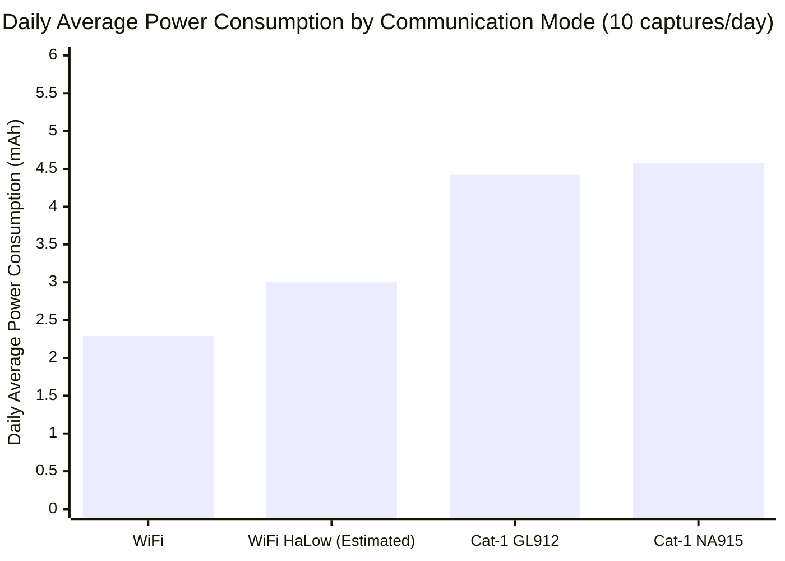

# Battery Recommendation

## Overview

NeoEyes NE101 and NE301 smart cameras are powered by 4 AA batteries by default, designed for outdoor low-power applications. Selecting the right battery directly affects device runtime and operational stability.

This document helps you understand:

- **Battery fundamentals**: Common battery types, technical specifications, and discharge capabilities
- **Device compatibility**: Battery specifications and performance for NE101/NE301
- **Discharge requirements**: Actual battery demands across different functional modes (WiFi, Cat-1, WiFi HaLow)
- **Selection recommendations**: Optimal battery solutions based on use cases and environmental conditions

> **Applicable devices**: NeoEyes NE101 series, NeoEyes NE301 series

## 1. Battery Fundamentals

### 1.1 Common Battery Types

The AA battery is the most common cylindrical battery format, with a diameter of 14.5mm and height of 50.5mm. Based on the chemistry, AA batteries fall into the following categories:

| Battery Type | Nominal Voltage | Typical Capacity (AA) | Rechargeable | Characteristics |
|:---|:---|:---|:---:|:---|
| **Alkaline** | 1.5V | 1800-2850 mAh | No | Widely available, good compatibility, higher internal resistance |
| **Lithium Iron** (Li-FeS2) | 1.5V | 3000 mAh | No | High energy density, low internal resistance, extreme temperature tolerance |
| **NiMH** | 1.2V | 600-2750 mAh | Yes | Rechargeable but voltage-incompatible (1.2V/cell, only 4.8V for 4 cells); high self-discharge rate (20-30%/month) |
| **Lithium Thionyl Chloride/Lithium-Ion** (Li-SOCl2/14500) | 3.6-3.7V | — | No | Nominal voltage too high (3.6-3.7V/cell), 4 cells in series reach 14.4-14.8V, far exceeding device rated voltage |

### 1.2 Key Technical Parameters

| Parameter | Description | Impact on NE101/NE301 |
|:---|:---|:---|
| **Nominal Voltage** | Average operating voltage during normal discharge | Device uses 4 cells in series: alkaline/lithium iron at 6.0V (4x1.5V), NiMH at only 4.8V (4x1.2V) |
| **Capacity (mAh)** | Total charge the battery can deliver; rated value measured at low discharge current | Actual usable capacity at high currents may be lower than rated |
| **Discharge Current** | Continuous discharge (sustained output) and pulse discharge (short-term peak) | WiFi peak 300-500mA, Cat-1 peak up to 2A |
| **Self-Discharge Rate** | Rate of natural charge loss when not in use | Long-term outdoor deployment requires batteries with low self-discharge rates |
| **Internal Resistance** | Equivalent internal resistance of the battery; directly determines voltage stability under high current | Lower internal resistance means less voltage drop during pulse discharge |

**Internal Resistance and Discharge Capability**: Internal resistance is the core parameter determining battery performance under high-current conditions. When the battery delivers current, terminal voltage = nominal voltage - current x internal resistance. **The higher the current, the more severe the voltage drop.** Batteries with high internal resistance may experience terminal voltage dropping below the device's minimum operating voltage under high-current discharge, causing unexpected shutdowns.

| Battery Type | Internal Resistance per Cell (Ohm) | Self-Discharge Rate | Shelf Life | Operating Temperature |
|:---|:---|:---|:---|:---|
| Alkaline | 0.15-0.3 | < 3%/year | 5-10 years | -20C ~ 55C |
| Lithium Iron | 0.12-0.2 | < 1%/year | 10-20 years | -40C ~ 60C |
| NiMH | 0.02-0.05 | 20-30%/month | 3-5 years | -20C ~ 50C |

> Alkaline and lithium iron batteries have similar internal resistance, but lithium iron batteries maintain voltage better under high current. NiMH batteries have the lowest internal resistance but are not recommended due to voltage and self-discharge issues (see Section 2 for compatibility analysis).

**Practical Impact of Internal Resistance on Terminal Voltage**:

Taking 4 alkaline batteries in series (total internal resistance approximately 0.6-1.2 Ohm) as an example:

| Scenario | Peak Current | Voltage Drop | Terminal Voltage | Result |
|:---|:---|:---|:---|:---|
| WiFi module transmitting | 500 mA | 0.5A x 0.9 Ohm = 0.45V | 6.0V - 0.45V = 5.55V | Normal operation |
| Cat-1 module transmitting | 2 A | 2A x 0.9 Ohm = 1.8V | 6.0V - 1.8V = 4.2V | Approaching device minimum operating voltage of 4.0V, insufficient voltage margin |

This is why battery discharge capability requirements vary significantly across different communication modes.

## 2. NE101/NE301 Battery Specifications and Compatibility

### 2.1 Standard Battery Configuration

NE101 and NE301 use 4 AA alkaline batteries by default:

| Parameter | Value | Description |
|:---|:---|:---|
| Battery count | 4 cells | Connected in series |
| Nominal voltage | 6.0V | 4 x 1.5V (new batteries approximately 6.4V) |
| Effective capacity | ~1750 mAh | Based on high-quality AA battery rated capacity of ~2500mAh, minus approximately 30% losses (including low-temperature degradation, self-discharge, and voltage cutoff margin) |
| Operating voltage range | 4.0-6.0V | Device operates normally within this range (new battery open-circuit voltage can reach 6.4V) |

### 2.2 Battery Compatibility Overview

| Battery Type | Nominal Voltage (4 cells) | Compatibility | Notes |
|:---|:---|:---:|:---|
| **Alkaline AA** | 6.0V | Recommended (first choice) | Widely available, good compatibility; the first choice for everyday use |
| **Lithium Iron AA** (Li-FeS2) | 6.0V | Recommended | Excellent low-temperature performance, low internal resistance, high capacity; recommended for frequent capture and extreme environments |
| **NiMH AA** | 4.8V | Not recommended | Nominal voltage only 1.2V/cell, 4 cells in series yield only 4.8V; though above the device minimum of 4.0V, voltage margin is limited; high self-discharge rate (20-30%/month), unsuitable for long-term unattended deployment |
| **Zinc Carbon AA** | 6.0V | Not recommended | Very low capacity (~600-900 mAh), very high internal resistance, poor pulse discharge performance |
| **Lithium Thionyl Chloride/Lithium-Ion** (Li-SOCl2 / 14500) | 14.4-14.8V | Prohibited | Nominal voltage 3.6-3.7V/cell, 4 cells in series reach 14.4-14.8V, far exceeding device rated voltage; may damage the device |
| **Mixed brands/types** | — | Prohibited | Inconsistent internal resistance and capacity causes individual cells to over-discharge, affecting performance and safety |

> **Brand recommendation**: Use reputable brand alkaline batteries (e.g., Energizer, Duracell, Panasonic) for more consistent quality and accurate capacity ratings.

### 2.3 Battery Capacity and Runtime Correlation

The effective capacity of the batteries directly determines device runtime. The following table shows NE301 runtime estimates under different battery capacities (WiFi mode, 5 captures per day):

| Battery Configuration | Effective Capacity | Estimated Runtime |
|:---|:---|:---|
| 4 standard alkaline AA (low quality) | ~1200 mAh | Approximately 2.7 years |
| 4 high-quality alkaline AA | ~1750 mAh | Approximately 3.9 years |
| 4 lithium iron AA (Li-FeS2) | ~2400 mAh | Approximately 5.4 years |

> **Capacity note**: Lithium iron AA batteries have a rated capacity of 3000mAh, with 80% reserved as effective capacity (~2400mAh) after accounting for self-discharge and voltage cutoff margin. Alkaline AA effective capacity is calculated at ~1750mAh (rated ~2500mAh x 70%).

> **Detailed runtime data**: Refer to the [NE301 Battery Life document](../5-neoeyes-ne301-series/5-ne301-battery-life.md) for complete WiFi/Cat-1 mode power analysis and an online runtime calculator.

## 3. Discharge Requirements by Functional Mode

NE101 and NE301 support multiple communication methods, and different communication modules impose significantly different demands on battery discharge capability. Understanding these differences helps in selecting the most suitable battery.

> **Data note**: The power consumption data for WiFi and Cat-1 modes below is sourced from NE301 official testing (February 2026). NE101 power characteristics are similar but not identical; data is for reference only.

### 3.1 WiFi Mode Capture

WiFi is the most power-efficient communication method, suitable for locations with WiFi coverage.

| Parameter | Value |
|:---|:---|
| Operating current | 70 mA |
| Operating duration | ~11 seconds |
| Energy per capture | 0.214 mAh |
| WiFi module peak current | 300-500 mA (instantaneous) |

**Battery requirements**:
- The WiFi module generates instantaneous pulse currents of 300-500mA when transmitting data
- High-quality alkaline batteries experience a voltage drop of approximately 0.3-0.5V at this current, with 4 cells in series maintaining a terminal voltage above 5.5V
- **Standard quality alkaline batteries are sufficient to meet WiFi mode discharge requirements**

### 3.2 Cat-1 Mode Capture

4G Cat-1 mode provides wide-area coverage but consumes significantly more power than WiFi.

| Module Version | Operating Current | Operating Duration | Energy per Capture | Cat-1 Module Peak Current |
|:---|:---|:---|:---|:---|
| GL912 (Global) | 110 mA | ~14 seconds | 0.428 mAh | 500 mA - 2 A (instantaneous) |
| NA915 (North America) | 119 mA | ~13.4 seconds | 0.443 mAh | 500 mA - 2 A (instantaneous) |

**Battery requirements**:
- The Cat-1 module peak current during network registration and data transmission can reach **500mA-2A**
- At 2A peak current, the terminal voltage of 4 alkaline batteries may drop sharply from 6.0V to 4.2V
- The device's internal power management IC can handle short voltage fluctuations, but **poor quality batteries with excessively high internal resistance may cause Cat-1 module network registration failure or data upload interruption**
- **Using high-quality batteries is recommended** to ensure stable operation in Cat-1 mode

### 3.3 WiFi HaLow Mode Capture (NE101 Only)

WiFi HaLow (IEEE 802.11ah) is a low-power, long-range communication protocol designed for IoT, supported only by NE101. The power consumption data below are estimates based on protocol characteristics; actual values should be verified through testing.

| Parameter | Description |
|:---|:---|
| Operating frequency | 868MHz / 915MHz Sub-1GHz |
| Communication range | Up to 1 km |
| Power consumption level | Between WiFi and Cat-1 |
| Peak current | Lower than standard WiFi |

**Battery requirements**:
- WiFi HaLow module peak current is lower than standard WiFi, with relatively modest battery discharge requirements
- However, due to the long communication range, weak signal conditions may require higher transmit power; using quality batteries is recommended

### 3.4 Discharge Requirement Comparison Across Modes

| Communication Mode | Operating Current | Peak Current | Energy per Capture | Battery Discharge Requirement | Recommended Battery |
|:---|:---|:---|:---|:---|:---|
| **WiFi** | 70 mA | 300-500 mA | 0.214 mAh | Low | High-quality alkaline batteries are sufficient |
| **WiFi HaLow** | ~80 mA | 200-400 mA | ~0.25 mAh | Low-Medium | High-quality alkaline batteries |
| **Cat-1 (GL912)** | 110 mA | 500 mA-2 A | 0.428 mAh | **High** | High-quality alkaline or lithium iron batteries |
| **Cat-1 (NA915)** | 119 mA | 500 mA-2 A | 0.443 mAh | **High** | High-quality alkaline or lithium iron batteries |

### 3.5 Alkaline Battery Performance Differences Across Modes

Alkaline batteries show significant differences in actual usable capacity under varying loads: in WiFi mode (70mA low load), capacity utilization is approximately 70% with good performance; in Cat-1 mode (2A peak high-load pulses), utilization drops to approximately 40-50%, and voltage fluctuations caused by internal resistance may affect module stability. **Lithium iron batteries are recommended for Cat-1 mode for more stable performance.**

**Key finding**: Cat-1 mode daily power consumption is **1.9-2.0x** that of WiFi mode, with significantly higher battery discharge requirements. If using Cat-1 mode, selecting better-performing batteries (such as lithium iron) can effectively improve operational stability.

## 4. Battery Selection Recommendations

### 4.1 Recommendations by Use Case

| Use Case | Communication Mode | Recommended Battery | Estimated Runtime | Notes |
|:---|:---|:---|:---|:---|
| Indoor/short-range monitoring | WiFi | High-quality alkaline AA | 2-13 years | Best compatibility (1-10 captures/day) |
| Outdoor environmental monitoring | WiFi | Lithium iron AA (Li-FeS2) | 2.9-18 years | Excellent low-temperature performance, long life (1-10 captures/day) |
| Remote area monitoring | Cat-1 | Lithium iron AA (Li-FeS2) | 1.5-11.5 years | Ensures stable Cat-1 module operation (1-10 captures/day) |
| Extended runtime requirements | WiFi/Cat-1 | Lithium iron AA (Li-FeS2) | 2.9-18 years | Prioritize lithium iron batteries for longer runtime |
| Development and testing | WiFi/Cat-1 | High-quality alkaline AA | — | Easy to obtain, suitable for frequent testing |

> **Runtime calculation note**: The above runtime estimates are based on NE301 official power consumption data. Lithium iron AA batteries have a rated capacity of 3000mAh, with effective capacity of approximately 2400mAh after reserving 20% for losses. Actual runtime is affected by ambient temperature, signal strength, and other factors.

### 4.2 Environmental Considerations

**Temperature effects**:

| Temperature Range | Alkaline Performance | Lithium Iron Performance | Recommendation |
|:---|:---|:---|:---|
| 20-25C (Room temperature) | 100% (baseline) | 100% (baseline) | Either battery type is suitable |
| 0-10C (Low temperature) | Drops to 70-80% | 90-95% | Lithium iron batteries recommended for low temperatures |
| -10-0C (Freezing) | Drops to 40-60% | 80-85% | Lithium iron batteries required for freezing conditions |
| 30-40C (High temperature) | 90-95% | 95-100% | Either battery type is suitable; ensure adequate ventilation |
| >50C (Extreme heat) | Drops to 70-80% | 90-95% | Avoid direct sunlight exposure on the device |

> **Important**: The NE101/NE301 operating temperature range is -20C ~ 60C. When deploying in cold regions, alkaline battery performance degrades significantly. Lithium iron batteries (Li-FeS2) are strongly recommended, with an operating temperature range of -40C ~ 60C and far superior low-temperature performance compared to alkaline batteries.

**Humidity and protection**: Both NE101 and NE301 achieve IP67 protection rating with a well-sealed battery compartment. No additional protection measures are needed in humid environments.

### 4.3 Common Misconceptions and Precautions

| Misconception | Reality |
|:---|:---|
| "Higher capacity batteries always last longer" | Rated capacity is measured at low discharge currents; actual usable capacity may be significantly reduced under high-current conditions |
| "Rechargeable batteries are more durable" | NiMH rechargeable batteries have high self-discharge rates (20-30%/month), making them unsuitable for long-term unattended outdoor deployments |
| "Mixing old batteries is fine" | Inconsistent internal resistance between batteries causes individual cells to over-discharge, affecting overall performance; all 4 batteries should be replaced simultaneously |
| "Zinc carbon batteries work too" | Zinc carbon batteries have only 1/3 the capacity of alkaline batteries and higher internal resistance, resulting in extremely poor pulse discharge performance and actually shorter overall runtime |
| "Slightly lower quality is fine for Cat-1 mode" | The Cat-1 module draws high peak currents; poor quality batteries may cause network registration failure or frequent disconnections |

**Usage recommendations**:
- When replacing batteries, **replace all 4 cells simultaneously** to ensure consistency
- If the device will not be used for an extended period, **remove the batteries** to prevent leakage that could damage the device
- Before deploying in low-temperature environments, it is recommended to activate the batteries at room temperature (use them a few times before installing in the device)

## 5. Further Reading

- **[NE301 Battery Life document](../5-neoeyes-ne301-series/5-ne301-battery-life.md)**: Complete power analysis, runtime calculation formulas, and typical application cases
- **[NE301 Battery Life Calculator](https://www.camthink.ai/tools/battery-calculator/)**: Online tool to customize communication mode and capture frequency for real-time runtime calculation

---
**Document version**: v1.1
**Last updated**: 2026-04-07
