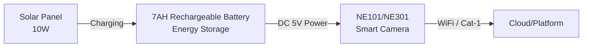
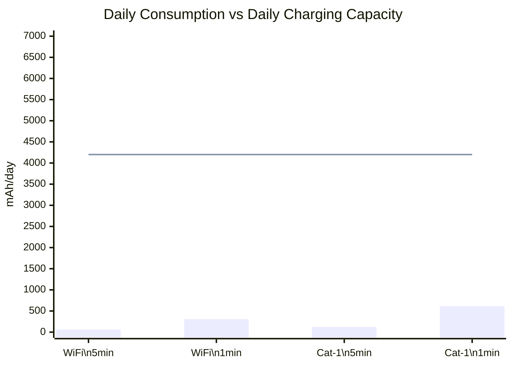

# Solar Power Solution

> **Verified**: This solution has been validated through actual deployment ✅
>
> **Compatible Devices**: NeoEyes NE101 Series, NeoEyes NE301 Series

---

## 1. Solution Overview

### Customer Requirements

In outdoor scenarios without grid power (e.g., agricultural monitoring, construction site surveillance, smart city applications), NE101/NE301 smart cameras need to operate stably and capture continuously over extended periods. While the traditional AA battery solution can last for years, it is only suitable for low-frequency triggering (1-10 captures/day). When **high-frequency or continuous capture** is required, AA battery life is significantly reduced.

This solution uses a solar panel + 7AH rechargeable battery combination. The solar panel charges during the day and the battery powers the device continuously, enabling **truly unlimited 24/7 runtime**.

### Solution Architecture

### Key Advantages

- **Unlimited Runtime**: 10W solar panel generates 4,200-7,000 mAh/day, far exceeding the device's maximum power consumption (637 mAh/day), achieving a positive energy balance
- **High-Frequency Continuous Capture**: Even at 1-minute intervals (1,440 captures/day) in Cat-1 mode, the system operates sustainably, breaking through the limitations of AA battery solutions
- **Maintenance-Free**: No battery replacement required — deploy once and operate long-term, significantly reducing maintenance costs
- **Quick Deployment**: Minimal components (solar panel + battery box + DC cable), supports both wall and pole mounting, setup in under 10 minutes

### Bill of Materials (BOM)

| Item | Specification | Qty | Purpose |
|------|---------------|-----|---------|
| **Smart Camera** | NeoEyes NE101 or NE301 | 1 | Edge AI capture and data upload |
| **Solar Power Kit** | 10W solar panel + 7AH rechargeable battery | 1 | Solar charging and energy storage, includes battery box, DC cable, and mounting clamps |

> **Power Interface**: NE101/NE301 draws power directly from the battery compartment's rear power connector. The solar kit's DC cable connects seamlessly without additional modifications.

---

## 2. Hardware Connection

### Connection Steps

| Step | Action | Description |
|------|--------|-------------|
| 1 | Mount the solar panel | Install in an unobstructed location, panel facing south (Northern Hemisphere), tilted at 30-45° |
| 2 | Mount the battery box | Secure to wall or pole using clamps, avoid direct sunlight exposure |
| 3 | Connect panel to battery | Use the included cable, connect with correct polarity |
| 4 | Connect DC power cable | One end to battery box DC 5V output, the other end to camera's battery compartment rear power connector |

### Installation Methods

| Method | Suitable Scenarios | Description |
|--------|-------------------|-------------|
| **Wall Mount** | Building walls, fences, bridge piers | Use clamps to secure to flat surfaces |
| **Pole Mount** | Poles, light poles, tree trunks | Use clamps to wrap around cylindrical supports |

**Installation Tips**:

- Install the solar panel in an unobstructed location with ample sunlight
- Seal cable pass-through holes with waterproof grommets or tape
- Keep the distance between camera and solar panel within 3 meters

### Capture Frequency Configuration

Configure the capture interval via the Web UI (**Capture Settings → Timed Capture**), supporting second-level and minute-level intervals. For recommended frequencies by scenario, refer to the [power consumption table](#daily-power-consumption-and-battery-life-by-frequency).

---

## 3. Power Consumption & Battery Life Analysis

### Device Power Consumption

The following data is from official NE301 testing. NE101 power characteristics are similar:

| Communication Mode | Operating Current | Duration | Energy per Capture | Peak Current |
|--------------------|-------------------|----------|--------------------|--------------|
| WiFi | 70 mA | ~11 s | 0.214 mAh | 300-500 mA |
| Cat-1 GL912 (Global) | 110 mA | ~14 s | 0.428 mAh | 500 mA-2 A |
| Cat-1 NA915 (North America) | 119 mA | ~13.4 s | 0.443 mAh | 500 mA-2 A |

> Sleep power consumption: 6.1 μA (~0.15 mAh/day), negligible in calculations.

### Daily Power Consumption and Battery Life by Frequency

| Capture Frequency | Daily Consumption (WiFi) | Daily Consumption (Cat-1) | 7AH Battery Life |
|-------------------|--------------------------|---------------------------|------------------|
| Every 30 min | 10.27 mAh | 20.54 mAh | WiFi ~682 days / Cat-1 ~341 days |
| Every 15 min | 20.54 mAh | 41.09 mAh | WiFi ~341 days / Cat-1 ~170 days |
| Every 5 min | 61.63 mAh | 123.26 mAh | WiFi ~114 days / Cat-1 ~57 days |
| Every 1 min | 308.16 mAh | 616.32 mAh | WiFi ~23 days / Cat-1 ~11 days |

### Solar Charging & Sustainability

With 4-5 hours of peak daily sunlight and ~70% charging efficiency, the 10W solar panel generates approximately **4,200-7,000 mAh/day**, far exceeding the device's maximum daily consumption:

> The dashed line represents the minimum daily charging capacity (4,200 mAh). Even at 1-minute intervals in Cat-1 mode, charging capacity is 6.8x the consumption.

**Overcast Backup**: The 7AH (7,000 mAh) battery provides a buffer during consecutive overcast days — WiFi at 5-minute intervals sustains ~114 days, Cat-1 at 1-minute intervals sustains ~11 days. Actual battery life varies with temperature and battery aging.

---

## 4. Demo

<video controls width="100%">
  <source src="https://resources.camthink.ai/wiki/img/hardware-dev-resources/solar-power-solution/solar-short.mov" type="video/mp4"></source>
  Your browser does not support video playback.
</video>

---

**Document Version**: v1.0
**Last Updated**: 2026-04-13
