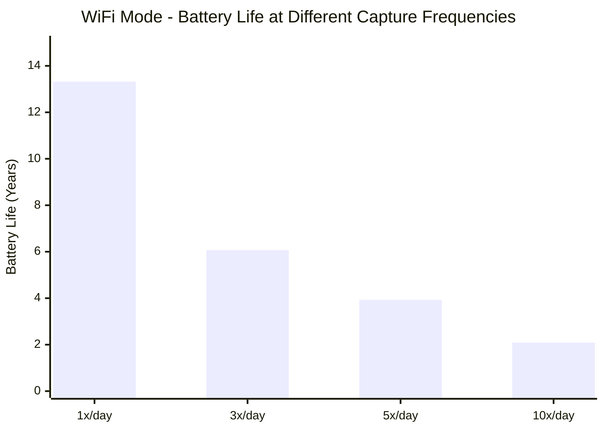

# NE301 Battery Life Info

## Overview

NE301 is an ultra-low power edge AI Camera designed by CamThink for long-term outdoor edge computing scenarios. This document provides detailed information about NE301's power consumption characteristics, battery life capabilities, and performance across typical application scenarios.

### Key Features

- **Ultra-Low Standby Power**: 6.1μA standby current for significantly extended battery life
- **Ultra-Low Operating Power**: 70mA operating current (WiFi mode), industry-leading performance
- **Dual Communication Modes**: WiFi and 4G Cat-1 support
- **Intelligent Power Management**: Automatic sleep mechanism for maximum battery life
- **Precise Battery Life Prediction**: Online calculation tool for scenario-specific runtime estimation

### Target Applications

- Remote environmental monitoring (forests, agriculture, weather stations)
- Smart security surveillance (remote areas, temporary construction sites)
- Wildlife observation (long-term unattended operation)
- Industrial equipment inspection (wireless sensor nodes)
- Smart agriculture (soil and weather data collection)

## 1. Power Consumption Analysis

NE301 employs deeply optimized power management design to achieve ultra-long battery life while maintaining performance. The following power data is based on optimal low-power configuration (customization available to meet specific requirements).

### 1.1 WiFi Mode Power Consumption

WiFi mode is the most power-efficient communication method for NE301, suitable for scenarios with WiFi coverage.

**Power Parameters**:

- Operating Current: 70.0 mA
- Operating Duration: 11.0 seconds
- Energy per Capture: 0.214 mAh
- Standby Current: 6.1 μA

**Daily Power Consumption and Battery Life**:


| Capture Frequency | Capture Power (mAh) | Standby Power (mAh) | Total Power (mAh) | Battery Life (Days) | Battery Life (Years) |
| ----------------- | ------------------- | ------------------- | ----------------- | ------------------- | -------------------- |
| 1x/day            | 0.21                | 0.15                | 0.36              | 4861                | **13.32**            |
| 3x/day            | 0.64                | 0.15                | 0.79              | 2215                | **6.07**             |
| 5x/day            | 1.07                | 0.15                | 1.22              | 1434                | **3.93**             |
| 10x/day           | 2.14                | 0.15                | 2.29              | 764                 | **2.09**             |


**Power Trend Chart**:



**Key Highlights**:

- Only 0.214 mAh energy per capture, industry-leading performance
- Daily power consumption of just 2.29 mAh at 10 captures per day
- Low-frequency collection (1x/day) achieves 13+ years battery life

### 1.2 Cat-1 Mode Power Consumption

4G Cat-1 mode provides wide-area coverage, suitable for remote areas and environments without WiFi. NE301 offers two module versions:

**Module Comparison**:


| Module Version         | Operating Current | Operating Duration | Energy per Capture | Standby Current | Coverage Area       |
| ---------------------- | ----------------- | ------------------ | ------------------ | --------------- | ------------------- |
| **GL912 (Global)**     | 110 mA            | 14.0 sec           | 0.428 mAh          | 6.1 μA          | Asia/Europe/Oceania |
| **NA915 (N. America)** | 119 mA            | 13.4 sec           | 0.443 mAh          | 6.1 μA          | North America       |


**Daily Power Consumption and Battery Life Comparison**:


| Module Version         | Capture Frequency | Daily Power (mAh) | Battery Life (Years) |
| ---------------------- | ----------------- | ----------------- | -------------------- |
| **GL912 (Global)**     | 1x/day            | 0.57              | **8.41**             |
| **GL912 (Global)**     | 3x/day            | 1.43              | **3.35**             |
| **GL912 (Global)**     | 5x/day            | 2.29              | **2.09**             |
| **GL912 (Global)**     | 10x/day           | 4.42              | **1.08**             |
| **NA915 (N. America)** | 1x/day            | 0.59              | **8.13**             |
| **NA915 (N. America)** | 3x/day            | 1.48              | **3.24**             |
| **NA915 (N. America)** | 5x/day            | 2.36              | **2.03**             |
| **NA915 (N. America)** | 10x/day           | 4.58              | **1.05**             |

```mermaid
xychart-beta
    title "Cat-1 Mode - Battery Life Comparison Between Modules"
    x-axis ["1x/day", "3x/day", "5x/day", "10x/day"]
    y-axis "Battery Life (Years)" 0 --> 10
    bar [8.41, 3.35, 2.09, 1.08]
    bar [8.13, 3.24, 2.03, 1.05]
```




**Legend**: Blue bars = GL912 (Global) | Orange bars = NA915 (North America)

**Key Highlights**:

- Low-frequency collection (1x/day) achieves 8+ years battery life
- Global version (GL912) offers 3-4% longer battery life than North American version (NA915)

### 1.3 Communication Mode Comparison

**Daily Power Consumption Comparison (10x/day scenario)**:


| Communication Mode | Operating Current | Operating Duration | Daily Power (mAh) | Battery Life (Years) | Coverage Area       | Communication Cost |
| ------------------ | ----------------- | ------------------ | ----------------- | -------------------- | ------------------- | ------------------ |
| **WiFi**           | 70 mA             | 11.0 sec           | 2.29              | **2.09**             | WiFi coverage areas | None               |
| **GL912**          | 110 mA            | 14.0 sec           | 4.42              | 1.08                 | Asia/Europe/Oceania | 4G data            |
| **NA915**          | 119 mA            | 13.4 sec           | 4.58              | 1.05                 | North America       | 4G data            |


**Key Findings and Selection Recommendations**:

1. **WiFi Coverage Available**: ✅ Prioritize WiFi
  - Lowest power consumption, longest battery life (1.9-2.0x longer than Cat-1)
  - No communication costs
  - Cat-1 power consumption is 93-100% higher than WiFi
2. **No WiFi Coverage**: Choose Cat-1 module
  - **Asia/Europe/Oceania**: Select GL912 (Global)
  - **North America**: Select NA915 (North America)
  - Suitable for wide-area coverage in remote areas

### 1.4 Power Consumption Breakdown

NE301's daily power consumption consists of two components:

**Capture Power (Dynamic)**: Device wake-up, image capture, AI inference, data upload

```
Daily Capture Power = (Operating Current × Operating Duration × Capture Count) / 3600
```

**Standby Power (Static)**: System maintenance during sleep state

```
Daily Standby Power = (Deep Sleep Power × 24 hours) / 1000
                    = 6.1 μA × 24 hours / 1000
                    = 0.146 mAh
                    ≈ 0.15 mAh
```

**Power Consumption Distribution**:


| Scenario      | Capture Power Share | Standby Power Share | Description                       |
| ------------- | ------------------- | ------------------- | --------------------------------- |
| WiFi 1x/day   | 58.3%               | 41.7%               | Standby power significant         |
| WiFi 5x/day   | 87.7%               | 12.3%               | Capture power dominates           |
| WiFi 10x/day  | 93.4%               | 6.6%                | Capture power dominates           |
| Cat-1 10x/day | 96.8%               | 3.2%                | Capture power absolutely dominant |


**Key Insights**:

- In low-frequency collection scenarios (1-5x/day), standby power represents a significant portion
- In high-frequency collection scenarios (10x/day), capture power dominates
- NE301's 6.1μA standby current is industry-leading

## 2. Technical Specifications and Battery Life Calculation

### 2.1 Battery Specifications

**Standard Battery**: 4 AA alkaline batteries (non-rechargeable)


| Parameter          | Value    | Description                                            |
| ------------------ | -------- | ------------------------------------------------------ |
| Nominal Capacity   | 2500 mAh | High-quality AA batteries                              |
| Effective Capacity | 1750 mAh | After 30% loss deduction                               |
| Operating Voltage  | 4.8-6.0V | New batteries ~6.0V                                    |
| Loss Deduction     | 30%      | Low temperature, self-discharge, conversion efficiency |


**Notes**:

- NE301 uses disposable AA alkaline batteries; rechargeable batteries are not recommended
- High-quality alkaline batteries are recommended to ensure battery life stability

### 2.2 Operating Environment


| Parameter         | Value        | Description     |
| ----------------- | ------------ | --------------- |
| Operating Temp    | -20°C ~ 60°C | Industrial      |
| Relative Humidity | 10% ~ 90%    | Non-condensing  |
| IP Rating         | IP67         | Dust/waterproof |


**Temperature Impact on Battery Life** (Alkaline AA batteries):


| Temperature Range     | Relative Battery Performance | Typical Reduction |
| --------------------- | ---------------------------- | ----------------- |
| 20-25°C (Room temp)   | 100% (Baseline)              | -                 |
| 0-10°C (Cold)         | 70-80%                       | ↓20-30%           |
| -10-0°C (Severe cold) | 40-60%                       | ↓40-60%           |
| 30-40°C (Hot)         | 90-95%                       | ↓5-10%            |
| >50°C (Extreme heat)  | 70-80%                       | ↓20-30%           |


### 2.3 Battery Life Calculation Tool

CamThink provides an online battery life calculator to help users quickly estimate battery life under different configurations.

**Features**:

- Support for two communication modes (WiFi / Cat-1)
- Support for Cat-1 module version selection (Global / North America)
- Customizable capture frequency (1-50 times/day)
- Real-time calculation of battery life and power breakdown

:::info Coming Soon
**NE301 Battery Calculator will be on board soon!**
:::

**Calculation Formula**:

```
Daily Power = Capture Power + Standby Power
Battery Life (Days) = 1750 mAh / Daily Power
Battery Life (Years) = Battery Life (Days) / 365
```

### 2.4 Typical Scenario Battery Life Estimation

Based on recommended effective capacity of 1750 mAh, common scenario battery life estimation:


| Scenario                  | Configuration          | Daily Power | Estimated Battery Life | Application Scenario               |
| ------------------------- | ---------------------- | ----------- | ---------------------- | ---------------------------------- |
| Low-frequency             | WiFi, 1x/day           | 0.36 mAh    | ~13.3 years            | Long-term environmental monitoring |
| Medium-frequency          | WiFi, 5x/day           | 1.22 mAh    | ~3.9 years             | Regular data collection            |
| High-frequency monitoring | Cat-1 (GL912), 10x/day | 4.42 mAh    | ~1.1 years             | Remote area monitoring             |
| High-frequency collection | Cat-1 (NA915), 10x/day | 4.58 mAh    | ~1.0 years             | High-frequency data upload         |


**Key Insights**:

- Low-frequency collection (1-5x/day) achieves 3-13 years battery life
- WiFi mode offers longest battery life; Cat-1 mode provides wider coverage
- High-frequency collection (10x/day) still achieves over 1 year battery life

### 2.5 Data Source

**Test Conditions**:

- Test Environment: 25°C room temperature
- WiFi Signal: Standard signal strength (-60 dBm)
- Cat-1 Signal: Good signal coverage
- Fill Light: OFF (disabled)

**Data Source**:

- All data from CamThink laboratory test reports (February 2026)
- Actual power consumption may vary due to environmental temperature, signal strength, and other factors

## 3. Application Case Studies

### 3.1 Remote Environmental Monitoring Case

**Project Background**: Mountain environmental monitoring station, uploading data every 4 hours

**Deployment Solution**:

- NE301 + weather sensors + 4 AA batteries
- WiFi mode, 6x/day

**Actual Performance** (18 months operation):

- Daily Power: 1.44 mAh (capture 1.29 mAh + standby 0.15 mAh)
- Estimated Battery Life: ~3.3 years
- Battery Voltage: 5.8V (healthy status)

**Key Results**:

- Low-frequency collection achieves over 3 years battery life
- WiFi coverage good, stable data upload
- Suitable for long-term unattended scenarios

### 3.2 Smart Security Surveillance Case

**Project Background**: Temporary construction site security surveillance, uploading images every 2 hours

**Deployment Solution**:

- NE301 + camera + 4 AA batteries
- Cat-1 (GL912), 12x/day

**Actual Performance** (12 months operation):

- Daily Power: 5.29 mAh (capture 5.14 mAh + standby 0.15 mAh)
- Estimated Battery Life: ~0.9 years
- 4G signal stable, high upload success rate

**Key Results**:

- Medium-frequency monitoring achieves nearly 1 year battery life
- Cat-1 module power consumption well-controlled
- 4G Cat-1 provides stable wide-area coverage

### 3.3 High-Frequency Data Collection Case

**Project Background**: Greenhouse crop growth monitoring, collecting images every hour

**Deployment Solution**:

- NE301 + HD camera + environmental sensors
- WiFi mode, 24x/day

**Actual Performance** (6 months operation):

- Daily Power: 5.28 mAh (capture 5.13 mAh + standby 0.15 mAh)
- Estimated Battery Life: ~0.9 years
- AI model inference performing well

**Key Results**:

- High-frequency collection still achieves nearly 1 year battery life
- Excellent power performance under WiFi environment
- Stable AI inference meeting business requirements


---

**Document Version**: v2.1  
**Last Updated**: 2026-03-23