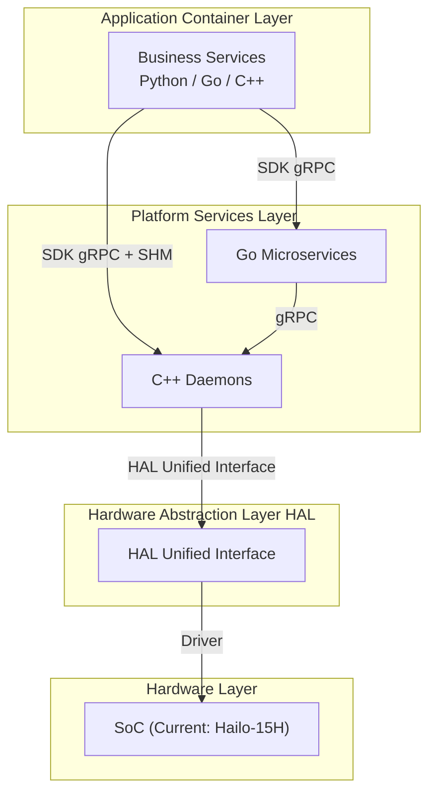
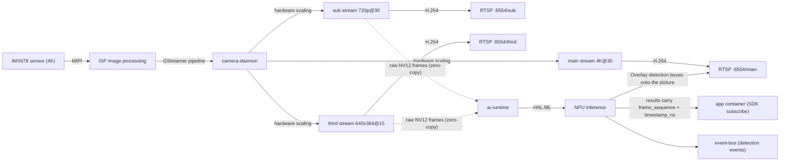
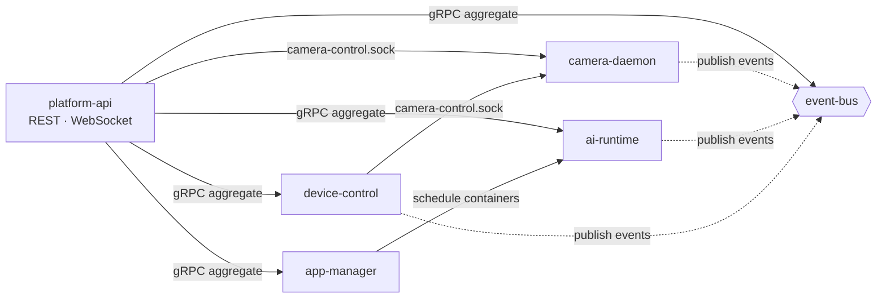
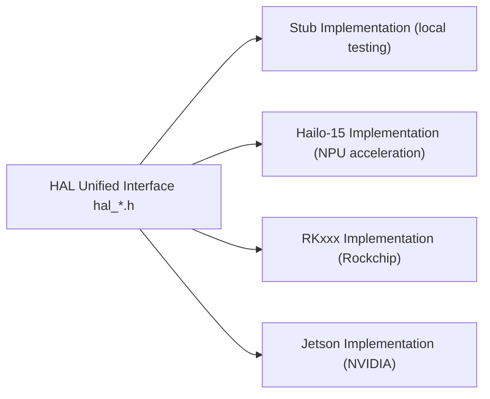
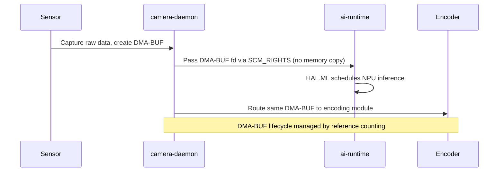

# System Architecture

The NE503 software stack has four layers: application containers, platform services, hardware abstraction (HAL), and hardware. This page helps you understand three things: **how the system is layered, how a frame travels from the sensor to the detection result your app receives, and which hardware each service operates through the HAL**. After reading, you can locate where a feature lives (what to change), follow the data path (which stream to subscribe to), and follow the links at the end to the open-source repository for implementation-level depth.

## 1. Four-Layer Architecture Overview

| Layer | What it governs | Notes |
|:---|:---|:---|
| Application Container Layer | Third-party AI applications, model inference pipelines | Python/Go/C++, containerized runtime |
| Platform Services Layer | Camera management, AI inference, container management, event dispatch, device control, API gateway, device discovery | Go microservices + C++ daemons |
| Hardware Abstraction Layer | A unified interface for all hardware (NPU/sensor/encoders/peripherals) | Services call only the HAL; they never touch hardware directly |
| Hardware Layer | SoC, NPU, ISP, sensors, MCU | Hailo-15H (current), RKxxx / Jetson (extensible) |

How the four layers cooperate in a single inference is the next section.

---

## 2. End-to-End Data Path

A frame's journey from the sensor to the detection result your app receives follows a single pipeline:

Capture, scaling, encoding, RTSP, and raw-frame distribution are handled by camera-daemon; inference scheduling by ai-runtime. Both operate the hardware through the unified HAL interface (see §4). Peripheral control (light/PTZ/GPIO) takes a separate path: app → device-control (gRPC) → HAL.IO → MCU.

As shown in the diagram, only `sub` and `third` hand **raw NV12 frames** (unencoded) to ai-runtime zero-copy; `main` outputs encoded H.264 only — the key constraint of the inference path:

> When subscribing for inference, `stream` must be `sub` or `third`; specifying `main` will never yield results. Full stream parameters (resolution/bitrate/GOP/raw frames) are in [Video and Imaging · RTSP Integration](../2-user-guide/1-media-and-image.md#rtsp-integration).

### How Detections Stay Aligned with Frames, Events, and the Picture

Every inference result carries `frame_sequence` (frame number) and `timestamp_ns` (nanosecond timestamp); all three consumers share them:

- **Fetch the raw frame**: the app calls `FdMediaClient.get_frame()` to grab the very same frame (snapshots, post-processing);
- **Event timing**: detection events on the event bus carry the same timestamp for correlating with business systems;
- **On-picture overlay**: the platform draws detection boxes onto the encoded picture per the `stream_map` config (factory default `third:main,sub:main`) — the boxes you see in RTSP/Web, the inference results, and the events are aligned to the same frame.

### Why Apps Never Touch Hardware Directly

An app container has no direct access to the NPU, sensor, or encoders:

1. **Calls go through services**: the SDK talks to platform services (inference, events, device control) over Unix Sockets; the services operate the hardware via the HAL on the app's behalf;
2. **Permissions are the contract**: what an app may call is declared in `app.yaml` `permissions`; undeclared calls are rejected by the platform;
3. **Five-layer sandbox**: containers run under namespace isolation, capability dropping, seccomp syscall filtering, cgroups resource limits, and a read-only rootfs.

See [security-architecture.md](https://github.com/camthink-ai/neoruntime/blob/main/docs/architecture/security-architecture.md) in the open-source repository for the full isolation and security design.

---

## 3. Platform Services Layer

Platform services fall into two groups: the **data plane** (ai-runtime, camera-daemon — the movers of frames and inference, performance-critical, C++) and the **management plane** (the other five — lifecycle, events, API, peripherals, discovery, Go microservices). Services communicate via gRPC over Unix Domain Sockets; the REST API is exposed externally through the platform-api gateway (internal `127.0.0.1:8080`, via nginx `:443`).

### 3.1 Service Collaboration

platform-api is the unified external entry point, aggregating every service's gRPC interfaces; event-bus is the messaging hub that nearly all services publish to; camera-daemon and device-control cooperate over a dedicated socket for lens control.

device-discovery is relatively independent: it manages external managed devices via MQTT/UDP and consumes no other platform services, so it is not in the diagram. The gRPC contract authority is the [source repository](https://github.com/camthink-ai/neoruntime)'s proto and YAML files; this page does not restate them.

### 3.2 Socket Overview

Internal communication goes over `/run/aipc/*.sock` (for on-device diagnosis, use `ss -x | grep aipc` or `systemctl status`). The single exception: event-bus also listens on TCP `127.0.0.1:50053` for Hailo C++ gRPC clients (the Hailo gRPC library lacks a unix socket resolver).

| Socket | Provider | Consumers | Purpose |
|:--|:--|:--|:--|
| `/run/aipc/camera.sock` | camera-daemon | ai-runtime | Raw-frame fd receiving (SCM_RIGHTS zero-copy) |
| `/run/aipc/camera-control.sock` | camera-daemon | device-control, platform-api | Lens control (lens_hal protocol) |
| `/run/aipc/ai-runtime.sock` | ai-runtime | SDK apps, platform-api, app-manager | Inference (inference.proto) |
| `/run/aipc/app-manager.sock` | app-manager | platform-api | App lifecycle (app.proto) |
| `/run/aipc/event-bus.sock` | event-bus | all services, SDK apps | Event pub/sub (event.proto) |
| `/run/aipc/device-control.sock` | device-control | SDK apps, platform-api | Peripheral control (device.proto) |
| `/run/aipc/device-discovery.sock` | device-discovery | platform-api | Device discovery (discovery.proto) |

### 3.3 Startup Dependencies

Startup dependencies come from the [systemd unit declarations](https://github.com/camthink-ai/neoruntime/tree/main/systemd) (`After` / `Wants`). Shared prerequisites for every service: `aipc-restore.service`, `aipc-firstboot.service`, `network.target`; the table lists only what is **specific** to each service:

| Service | Specific dependencies |
|:--|:--|
| camera-daemon | After `aipc-mcu-prep`, `isp_media_server`, `hailort_server` |
| ai-runtime | After + Wants `containerd.service` |
| event-bus, device-discovery | none specific |
| device-control | After + Wants **camera-daemon**; After `aipc-mcu-prep` |
| app-manager | Wants `ai-runtime`, `event-bus`, `containerd` |
| platform-api | After + Wants `ai-runtime`, `app-manager`, `device-control`, `event-bus` |

Troubleshooting notes:

- **camera-daemon has the deepest base-unit chain** (MCU prep → ISP media server → HailoRT server) — for picture issues, check `systemctl status isp_media_server hailort_server` before camera-daemon itself;
- ai-runtime starts in parallel with camera-daemon and connects via socket retry — ai-runtime coming up before camera-daemon is normal;
- platform-api starts last; `After` guarantees ordering, not readiness (Wants is a weak dependency — a failed dependency still lets it start).

### 3.4 Service Inventory

All paths below are relative to the [neoruntime repository](https://github.com/camthink-ai/neoruntime) root.

| Service | Responsibility | Source entry |
|:--|:--|:--|
| camera-daemon (C++) | Hardware abstraction entry: sensor, ISP, H.264/H.265 encoding, RTSP, MCU communication, audio; hands frames downstream zero-copy via DMA-BUF fds | `platform/camera-daemon/`, proto `camera.proto`/`lens_hal.proto`, design doc `docs/services/CAMERA_DAEMON_DESIGN.md` |
| ai-runtime (C++) | AI inference runtime: HEF model loading, single-shot/streaming inference, NPU scheduling, CLIP text encoding, GenAI streaming and post-processing; results auto-published to event-bus | `platform/ai-runtime/`, proto `inference.proto`, reference `docs/services/ai-runtime.md` |
| app-manager | Container app lifecycle: wraps containerd for app/image/container install, start/stop, logs, exec, Web URL registration | `platform/app-manager/`, proto `app.proto` |
| event-bus | Platform messaging hub: pub/sub, batch publish, topic management, wildcard subscription | `platform/event-bus/`, proto `event.proto` |
| device-control | Peripheral control: PTZ, lens, fill light/IR LED/IR-Cut, fan/heater/radar, alarm output (relay/Wiegand), RS485, GPIO | `platform/device-control/`, proto `device.proto` |
| device-discovery | CamThink device discovery and management: CT-Disc protocol (LAN UDP multicast `239.255.255.250:19850`, CAT1 via MQTT registration), SN-keyed device registry, heartbeat and management commands | `platform/device-discovery/`, proto `discovery.proto` |
| platform-api | HTTP/WebSocket gateway: aggregates each service's gRPC, exposes REST APIs and WebSocket externally, hosts the web console backend and authentication | `platform/platform-api/` + frontend `web/` |

---

## 4. Hardware Abstraction Layer (HAL)

The HAL is the only channel between platform services and hardware: porting to a new SoC means rewriting the HAL implementation only — all service-layer code stays untouched.

### 4.1 HAL Interface Overview

HAL headers are organized by component subdirectory under `hal_v2/include/`:

| Directory | Coverage |
|:---|:---|
| `media/` | Video capture, encoding (H.264/H.265), OSD, ISP, audio, profile management |
| `model/` | Model inference, post-processing (NMS), GenAI (LLM/VLM), visualization, CLIP text encoding |
| `dsp/` | Crop, scale, format conversion, privacy mask, stabilization |
| `peripheral/` | MCU communication, GPIO/sensor; device layer includes LED, lens, alarm, RS485, RTC, OTA, etc. |
| `common/` | Common enums/error codes, `HalFrameBuffer` frame buffer, basic types, logging |

Which service consumes which HAL sub-interface (e.g., ai-runtime consumes the `model/` inference interfaces, camera-daemon consumes the `media/` capture/encoding interfaces) is documented in the [HAL v2 overview](https://github.com/camthink-ai/neoruntime/blob/main/docs/architecture/hal_v2_overview.md) in the open-source repository.

### 4.2 Core Data Structure: HalFrameBuffer

`HalFrameBuffer` is the platform's core frame data carrier: frame metadata (dimensions, pixel format, timestamp) and memory descriptors (DMA-BUF fd, stride) are packaged together and passed between capture, inference, and encoding modules. It supports DMA-BUF zero-copy and CPU memory modes, with lifecycle managed by reference counting — the entire video → AI → encoding pipeline shares the same DMA-BUF without memory copying.

> For the complete struct definition, see the GitHub repository under `hal_v2/include/common/`.

### 4.3 Multi-Platform Support

Current implementations: Hailo-15 (complete) + Stub (a complete stub implementation for hardware-free development). To support a new SoC, implement the corresponding HAL interfaces — the service layer and all apps stay untouched.

---

## 5. Web Console

The web console is the device's management interface: device info and network settings, live preview, model and application management, peripheral control, and log viewing (including a WebSocket terminal and live container logs).

Access it at `https://<device-ip>` (development and usage details in [web-console.md](https://github.com/camthink-ai/neoruntime/blob/main/docs/services/web-console.md) in the open-source repository).

---

## 6. Key Technical Features

### 6.1 Zero-Copy Optimization

Core mechanisms:
- `HalFrameBuffer` passes DMA-BUF file descriptors via `dma_fds[]`, enabling zero-copy throughout the video -> AI -> encoding pipeline
- Reference counting manages frame lifecycle (`hal_frame_buffer_ref` / `hal_frame_buffer_release`)
- FD passing between ai-runtime and camera-daemon via `SCM_RIGHTS` (no memory copy required)

### 6.2 Event-Driven Architecture

The Event Bus uses a publish/subscribe pattern with MQTT-style wildcard matching (`*` single level, `**` multi-level, `**/suffix` suffix). AI inference results are published under `inference/{model_id}/{stream_id}`, and app custom events under `app/{app_id}/...`. All inference results, container events, and device events generated by services are dispatched through the Event Bus; third-party applications subscribe using the SDK's `EventClient`. Topic naming rules, wildcard matching, and subscription code are covered in [Event Integration](../4-application-guide/3-reference/5-event-integration.md).

### 6.3 Containerized Application Platform

- containerd runtime with OCI standard images — apps ship as standard Docker images, decoupled from the platform
- Multi-container support (Main + Sub): declared dependencies are pulled up automatically by the platform; you don't orchestrate startup order yourself
- Health checks (Command / HTTP / TCP) plus automatic restart with backoff — a restarted app surfaces no error to the user, so design your app to be idempotent (receiving the same frame/event twice must not cause side effects)

---

## 7. Related Documentation

**Within this wiki**:

- [Application Development Guide](../4-application-guide/3-reference/0-app-reference.md) — How to write and deploy container applications
- [Python SDK Reference](../4-application-guide/3-reference/1-sdk-reference.md) — SDK API signatures and usage examples

**Open-source repository (implementation-level deep dives)**:

- [Architecture Overview & Data Flow](https://github.com/camthink-ai/neoruntime/blob/main/docs/architecture/README.md) — Full architecture docs with four data-flow diagrams
- [Security Architecture](https://github.com/camthink-ai/neoruntime/blob/main/docs/architecture/security-architecture.md) — Sandbox isolation and security model design
- [Service Reference Docs](https://github.com/camthink-ai/neoruntime/tree/main/docs/services) — Per-service deep dives (ai-runtime / event-bus / camera-daemon design, etc.)
