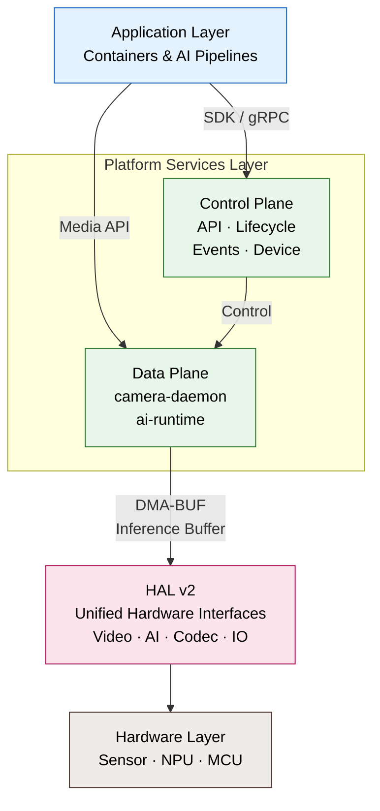
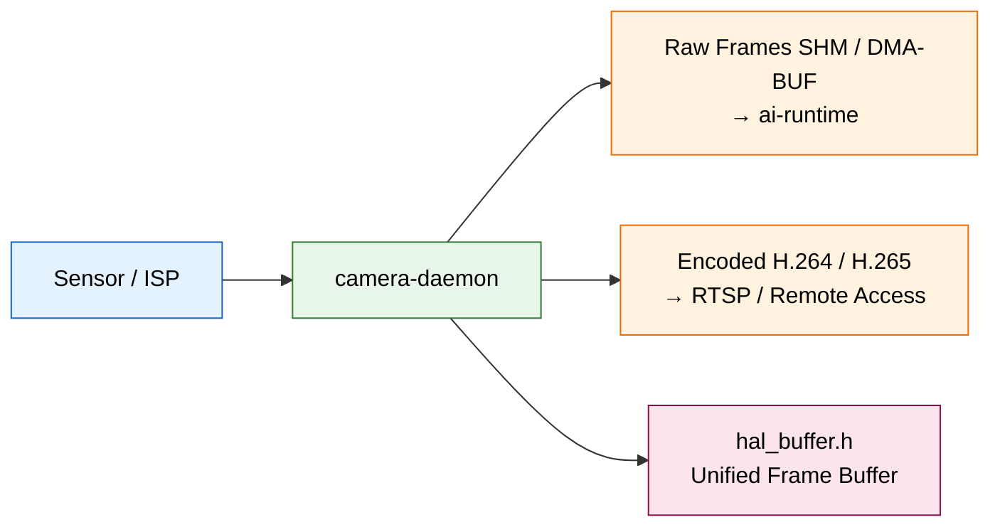
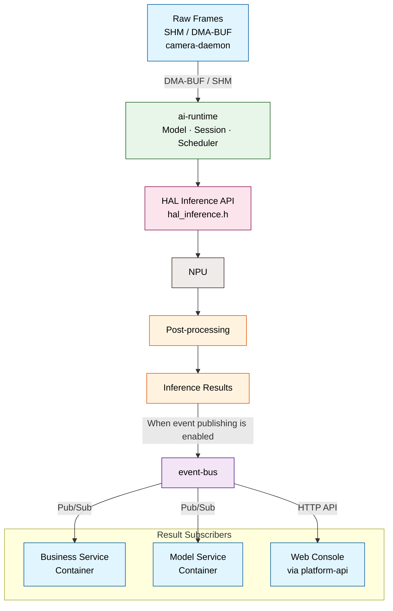
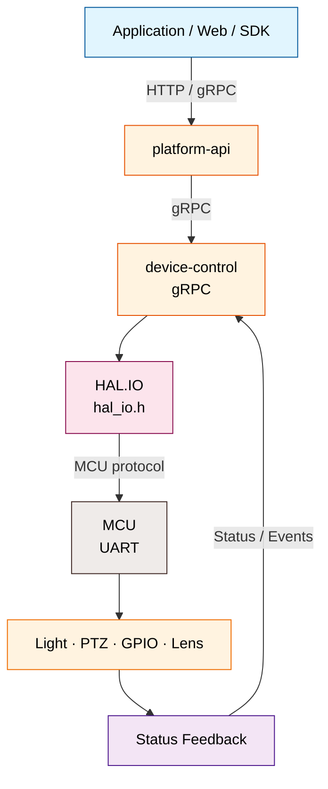

# System Architecture

The NE503 software platform has four layers: **application containers → platform services → HAL → hardware**. This page covers their relationships and three data flows. See the source links for APIs, configuration, sockets, and startup dependencies.

## 1. Four-Layer Platform Architecture

| Layer | Responsibility | Relationship |
|:---|:---|:---|
| Application Containers | Run business applications and inference pipelines | Call device capabilities through SDKs or platform interfaces; no direct hardware access |
| Platform Services · Data Plane | `camera-daemon` outputs raw frames and encoded streams; `ai-runtime` schedules NPU inference | Orchestrate video and inference flows |
| Platform Services · Control Plane | `platform-api`, `app-manager`, `event-bus`, `device-control`, and `device-discovery` | Handle control, lifecycle, and events; do not move video frames directly |
| HAL v2 | Provide interfaces for video, inference, codecs, peripherals, and buffers | Abstract SoC and vendor-runtime differences |
| Hardware & Runtimes | Execute capture, encoding, inference, and MCU peripheral control | Driven by the platform HAL implementation |

## 2. End-to-End Data Flow

Platform data flows are divided into video, AI inference, and peripheral control paths.

### Video and Media Path

- `camera-daemon` manages the imaging pipeline through HAL, outputs DMA-BUF raw frames to `ai-runtime`, and provides encoded RTSP streams.

### AI Inference and Event Path

- `ai-runtime` schedules NPU inference and post-processing through HAL. When event publishing is enabled, it publishes results to `event-bus`; business/model containers subscribe, and the Web Console accesses them through `platform-api`.

### Peripheral Control Path

- Requests flow through `platform-api` → `device-control` → `HAL.IO/MCU` to control lights, PTZ, GPIO, and lenses; status returns through the same path.

## 3. Source References

- [Architecture and data flows](https://github.com/camthink-ai/neoruntime/blob/main/docs/architecture/README.md) — layers, components, and data flows
- [HAL v2](https://github.com/camthink-ai/neoruntime/blob/main/docs/architecture/hal_v2_overview.md) — interfaces and platform implementations
- [Platform services](https://github.com/camthink-ai/neoruntime/tree/main/docs/services) — service documentation
- [Service configurations](https://github.com/camthink-ai/neoruntime/tree/main/configs) — configuration templates
- [Platform source and protos](https://github.com/camthink-ai/neoruntime/tree/main/platform) — implementations, gRPC, and message definitions
- [NE503 SDK](https://github.com/camthink-ai/neoruntime-sdks) — Python / C++ SDKs and shared protos
- [NE503 applications](https://github.com/camthink-ai/neoruntime-apps) — application templates and examples

**Related page**:

- [Developer Guide](./1-developer-guide.md) — development environment, build, and deployment entry points
