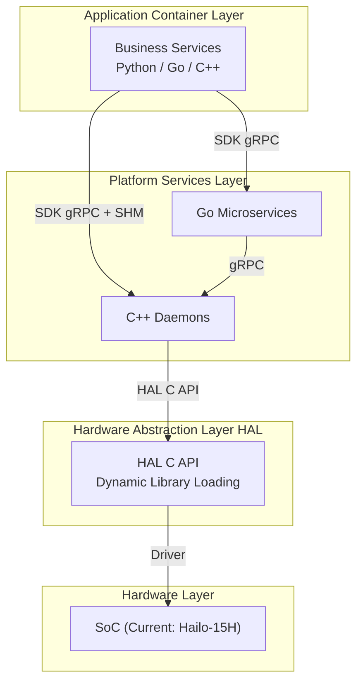
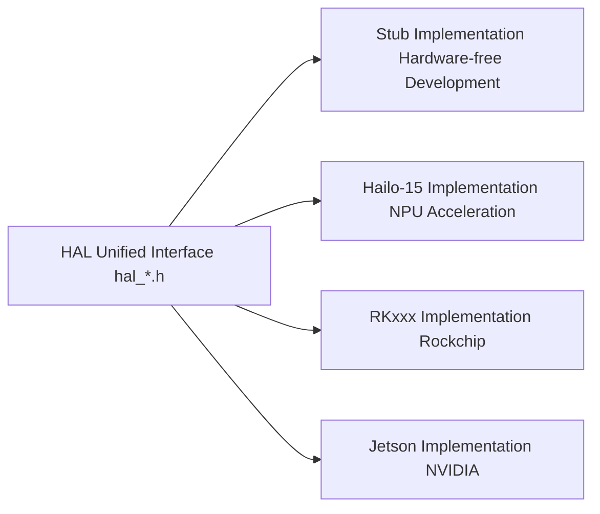
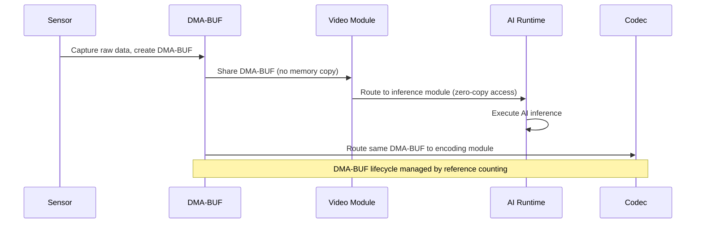

# System Architecture

The NE503 AIPC (AI IPC) platform is a complete software stack designed for edge AI computing. It adopts a four-layer architecture and supports multiple SoC platforms (Hailo-15 / RKxxx / Jetson) with seamless migration through a hardware abstraction layer. This document provides a detailed overview of each architectural layer, core services, and data flow.

## 1. Four-Layer Architecture Overview

| Layer | Responsibility | Technology |
|:---|:---|:---|
| Application Container Layer | Third-party AI applications, model inference pipelines | Python/Go/C++, containerized runtime |
| Platform Services Layer | Camera management, AI inference, container management, event dispatch, device control, API gateway, device discovery | Go microservices + C++ daemons |
| Hardware Abstraction Layer | Unified hardware interface, decoupling platform services from SoC | C/C++ function pointer tables (Ops), DMA-BUF zero-copy |
| Hardware Layer | SoC, NPU, ISP, sensors, MCU | Hailo-15H (current), RKxxx / Jetson (extensible) |

---

## 2. Platform Services Layer

The platform services layer consists of multiple microservices that communicate internally via gRPC over Unix Domain Sockets.

### 2.1 Service Overview

| Service | Language | Listen Address | Responsibility |
|:---|:---|:---|:---|
| **ai-runtime** | C++ | `unix:///run/aipc/ai-runtime.sock` | AI model management and inference scheduling, NPU resource allocation, GenAI streaming inference |
| **app-manager** | Go | `unix:///run/aipc/app-manager.sock` | Container application lifecycle management (install/start/stop/uninstall), based on containerd |
| **event-bus** | Go | `unix:///run/aipc/event-bus.sock` + TCP `127.0.0.1:50053` | Publish/subscribe message bus, MQTT-style wildcard matching |
| **device-control** | Go | `unix:///run/aipc/device-control.sock` | Hardware peripheral control (light/PTZ/lens/GPIO), MCU UART communication |
| **device-discovery** | Go | `unix:///run/aipc/device-discovery.sock` | Network device discovery (CT-Disc protocol), device registration and state management |
| **platform-api** | Go | `:8080` | HTTP/RESTful API gateway, proxying all backend gRPC services |
| **camera-daemon** | C++ | `unix:///run/aipc/camera.sock` (FD publish) + `unix:///run/aipc/camera-control.sock` (gRPC control) + `/run/aipc/shm/` (SHM) | Video capture, dual-channel frame dispatch (FD/SHM), encoding, RTSP streaming |

### 2.2 gRPC API Definitions

The platform defines all gRPC interfaces through Protocol Buffers files:

| Proto File | Service | Description |
|:---|:---|:---|
| `inference.proto` | AI Inference | Model registration, inference, streaming, GenAI session management |
| `app.proto` | Container Management | App install/lifecycle + container/image/resource management |
| `event.proto` | Event Bus | Publish/subscribe, MQTT-style wildcards, topic statistics |
| `device.proto` | Device Control | Light/PTZ/lens (incl. AF0832)/GPIO/environment/alarm/RS485 |
| `camera.proto` | Camera Management | Video capture pipeline, RTSP streaming, OSD overlay |
| `lens_hal.proto` | Lens Control | HAL bridge implementation for the lens portion of `device.proto` |
| `discovery.proto` | Device Discovery | CT-Disc protocol device discovery, monitoring, and scanning |

> For the complete list of operations per proto, see the corresponding service reference documentation.

---

## 3. Hardware Abstraction Layer (HAL)

### 3.1 HAL Interface Overview

HAL headers are organized by component subdirectory under `hal_v2/include/`:

| Directory | Coverage |
|:---|:---|
| `media/` | Video capture, encoding (H.264/H.265), OSD, ISP, audio, profile management |
| `model/` | Model inference, post-processing (NMS), GenAI (LLM/VLM), visualization, CLIP text encoding |
| `dsp/` | Crop, scale, format conversion, privacy mask, stabilization |
| `peripheral/` | MCU communication, GPIO/sensor; device layer includes LED, lens, alarm, RS485, RTC, OTA, etc. |
| `common/` | Common enums/error codes, `HalFrameBuffer` frame buffer, basic types, logging |

> Specific sub-interfaces consumed by each service (e.g., `HalInferenceOps`, `HalPostprocessOps`, etc.) are documented in the corresponding service reference pages.

### 3.2 Core Data Structure: HalFrameBuffer

`HalFrameBuffer` is the platform's core frame data carrier, used to pass frame data between video capture, AI inference, encoding, and other modules.

**Data encapsulation:**
- **Image metadata**: dimensions, pixel format, timestamp
- **Memory descriptors**: DMA-BUF fd, virtual addresses, stride/size
- **Private data**: platform-specific information passed through the `priv` pointer

- **Memory modes**: Supports DMA-BUF (zero-copy) and CPU Memory. The entire video → AI → encoding pipeline shares the same DMA-BUF without memory copying.
- **Lifecycle**: Managed through reference counting (`hal_frame_buffer_ref` / `hal_frame_buffer_release`).

> For the complete struct definition, see the GitHub repository under `hal_v2/include/common/`.

### 3.3 Multi-Platform Support

Current implementations: Hailo-15 (complete) + Stub (complete stub implementation for hardware-free development). RKxxx and Jetson can be supported through the HAL porting guide.

---

## 4. Web Console

The web console is built on React 19 + TypeScript + Vite, providing device management, video monitoring, AI model management, application management, and system monitoring.

| Technology Stack | Component |
|:---|:---|
| Framework | React 19 + TypeScript |
| Build | Vite |
| State Management | Zustand |
| Data Fetching | TanStack Query |
| UI Components | shadcn/ui + Radix |
| Testing | Vitest |

The web console communicates with platform-api via REST API and WebSocket, receiving real-time AI inference results and device events.

Access URL: `http://<device-ip>:8080`.

---

## 5. Key Technical Features

### 5.1 Zero-Copy Optimization

Core mechanisms:
- `HalFrameBuffer` passes DMA-BUF file descriptors via `dma_fds[]`, enabling zero-copy throughout the video -> AI -> encoding pipeline
- Reference counting manages frame lifecycle (`hal_frame_buffer_ref` / `hal_frame_buffer_release`)
- FD passing between AI Runtime and Camera Daemon via `SCM_RIGHTS` (no memory copy required)

### 5.2 Event-Driven Architecture

The Event Bus uses a publish/subscribe pattern with MQTT-style wildcard matching:

| Pattern | Description | Example |
|:---|:---|:---|
| Exact match | Exact topic name match | `app/myapp/status` |
| ``*`` Single-level wildcard | Matches one level | `app/*/status` |
| ``**`` Multi-level wildcard | Matches multiple levels | `model/**/detections` |

All inference results, container events, and device events generated by services are dispatched through the Event Bus. Third-party applications subscribe to topics of interest using the SDK's `EventClient`.

### 5.3 Containerized Application Platform

- Based on containerd runtime, OCI standard image deployment
- Multi-container support (Main + Sub), plugin-based dependency resolution
- Health check system (Command / HTTP / TCP, exponential backoff strategy)
- Automatic restart (backoff strategy on failure)

---

## 6. System Configuration

The platform uses YAML configuration files to manage all service parameters. Configuration files are located in the `configs/` directory:

| Configuration File | Service | Core Configuration |
|:---|:---|:---|
| `platform-api.yaml` | platform-api | Server port, authentication keys, log level |
| `platform/app-manager.yaml` | app-manager | containerd connection, security policies, resource limits |
| `platform/event-bus.yaml` | event-bus | Socket path, TCP listener, topic ACL |
| `platform/device-control.yaml` | device-control | MCU UART device, lens parameters, automation rules |
| `platform/camera-daemon.yaml` | camera-daemon | Video capture, encoding parameters, RTSP configuration |
| `platform/discovery.yaml` | device-discovery | CT-Disc protocol parameters |
| `ai/ai-runtime.yaml` | ai-runtime | HAL library paths, model repository, scheduler, auto-inference pipeline |
| `preload.yaml` | pack-factory | Factory preloading (pre-installed models and applications) |
| `security/seccomp-default.json` | Security | Default Seccomp system call allowlist |

Installation path: `/opt/aipc/` (binaries in `bin/`, configuration in `etc/`).

---

## 7. Related Documentation

- [Application Development Guide](../4-application-guide/1-app-development/reference/1-app-reference.md) — How to write and deploy container applications
- [Python SDK Reference](../4-application-guide/1-app-development/reference/2-sdk-reference.md) — SDK API signatures and usage examples
- [RESTful API Reference](../4-application-guide/2-3rd-party-integration/0-restful-api.md) — Complete HTTP API endpoint reference
- [Platform Services Overview](./4-reference/0-platform-services.md) — Service responsibilities, collaboration, and source pointers
