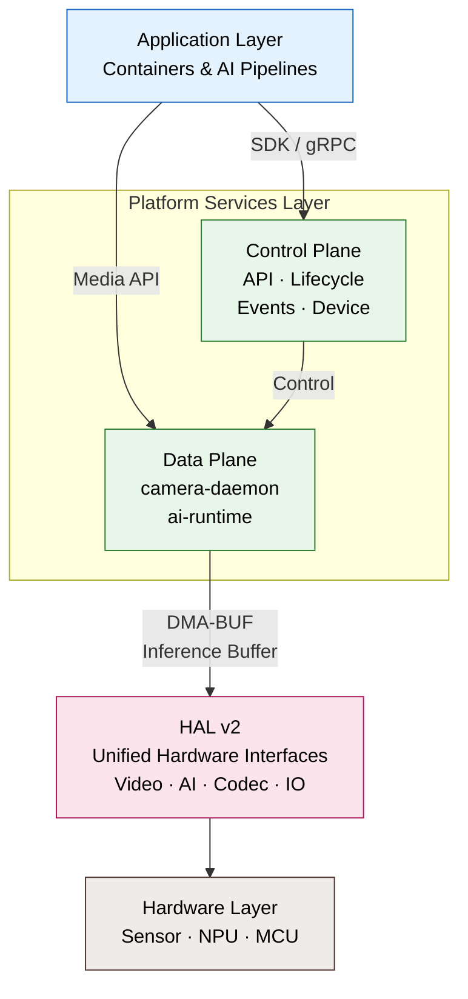
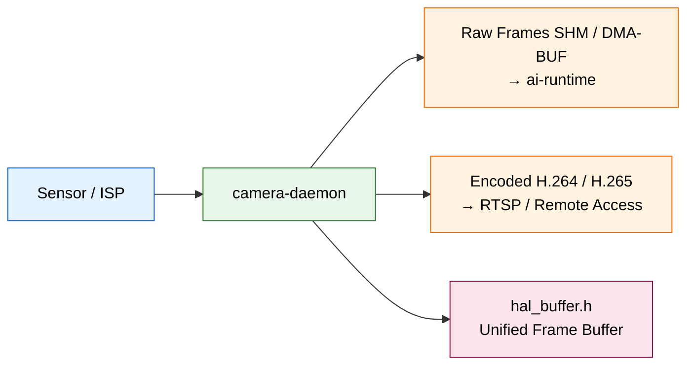
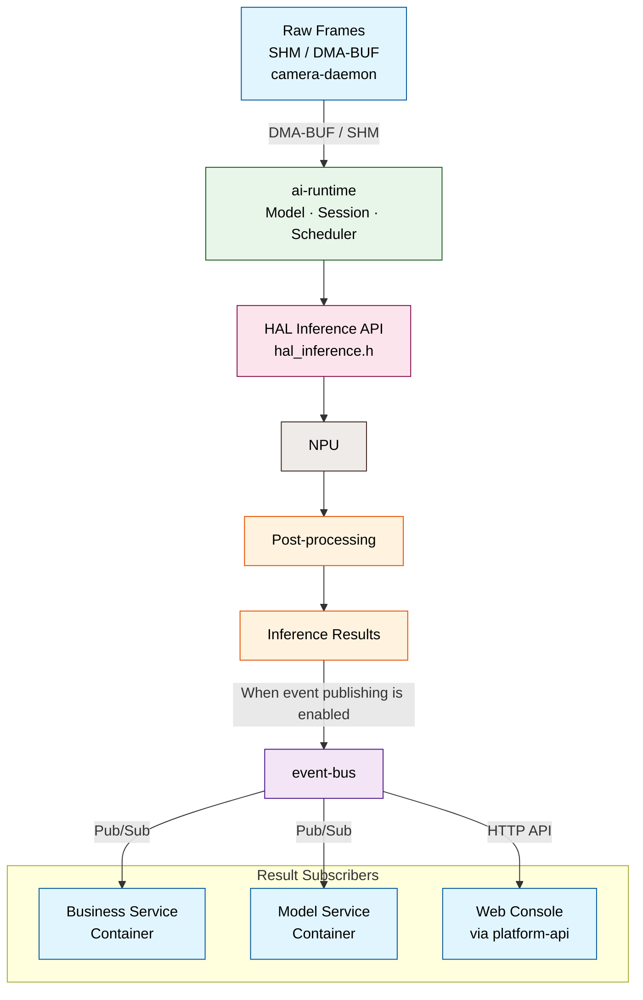
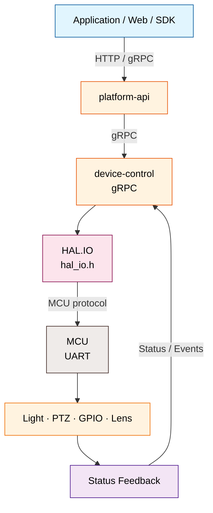

# System Architecture

The NE503 software platform has four layers: **application containers → platform services → HAL hardware abstraction → hardware**. This page explains only how the layers divide responsibilities and how data moves between them. For service APIs, configuration fields, sockets, startup dependencies, and HAL implementation details, use the source-repository links at the end of the page.

## 1. Four-Layer Platform Architecture

| Layer | Main Responsibility | Relationship to Upper Layer |
|:---|:---|:---|
| Application Containers | Run business applications, model pipelines, and integration logic | Use device capabilities through SDK or platform interfaces; do not access hardware directly |
| Platform Services · Data Plane | `camera-daemon` manages media pipeline outputting encoded streams & raw frames; `ai-runtime` schedules NPU inference | Receive application requests, orchestrate video/inference data flows |
| Platform Services · Control Plane | `platform-api` provides HTTP gateway, `app-manager` manages containers, `event-bus` distributes events, `device-control` drives peripherals, `device-discovery` discovers devices | Handle control commands, lifecycle, event distribution; do not move video frames directly |
| HAL v2 | Unified C interfaces for video, inference, codec, peripherals, and buffers | Hides SoC and vendor runtime differences; dynamically loads platform implementations |
| Hardware & Vendor Runtimes | Execute image capture, encoding, NPU inference, and MCU peripheral control | Driven by platform-specific HAL implementations (Hailo-15 / Stub) |

## 2. End-to-End Data Flow

Video, AI inference, and peripheral control are separated into three independent paths, corresponding to media processing, inference service, and device control flows in the source repository.

### Video and Media Path

- `camera-daemon` manages the imaging pipeline via HAL, provides zero-copy raw frames (DMA-BUF) to `ai-runtime`, and outputs encoded streams for RTSP/remote access.

### AI Inference and Event Path

- `ai-runtime` receives raw frames from `camera-daemon`, schedules the NPU through the HAL inference API, and performs model inference and post-processing.
- When event publishing is enabled, `ai-runtime` publishes inference results to `event-bus`: business and model containers receive them through Pub/Sub, while the Web Console obtains them through `platform-api`.

### Peripheral Control Path

- External requests are normally forwarded through `platform-api` to `device-control`; `device-control` drives lights, PTZ, GPIO, and lenses through `HAL.IO` and the MCU protocol, with status and events returning along the feedback path.
- In the current implementation, lens control may also use `device-control`'s CameraControl interface to `camera-daemon`; see the source repository for the complete branch.

> These paths describe only platform component relationships. For detailed service responsibilities, API methods, message formats, configuration, and deployment, see the [NeoRuntime architecture overview](https://github.com/camthink-ai/neoruntime/blob/main/docs/architecture/README.md) and the corresponding documents in the source repository.

## 3. Go Deeper in the Source Repository

The following implementation and interface references are maintained in the source repository rather than duplicated on this page:

- [Architecture overview and complete data flows](https://github.com/camthink-ai/neoruntime/blob/main/docs/architecture/README.md) — layered architecture, core components, data flows, deployment, and security design
- [HAL v2 overview](https://github.com/camthink-ai/neoruntime/blob/main/docs/architecture/hal_v2_overview.md) — HAL interfaces, platform implementations, and hardware-abstraction boundaries
- [Platform-service documentation](https://github.com/camthink-ai/neoruntime/tree/main/docs/services) — detailed documentation for `ai-runtime`, `camera-daemon`, `event-bus`, `device-control`, and other services
- [Service configurations](https://github.com/camthink-ai/neoruntime/tree/main/configs) — configuration templates for the platform services
- [Platform source and protos](https://github.com/camthink-ai/neoruntime/tree/main/platform) — service implementations, gRPC interfaces, and message definitions
- [NE503 SDK repository](https://github.com/camthink-ai/neoruntime-sdks) — Python / C++ SDKs and shared protos
- [NE503 application repository](https://github.com/camthink-ai/neoruntime-apps) — application templates and examples

**Related Wiki pages**:

- [Developer Guide](./1-developer-guide.md) — development environment, build, and deployment entry points
- [Application Development Reference](../4-application-guide/3-reference/0-app-reference.md) — application and SDK usage
