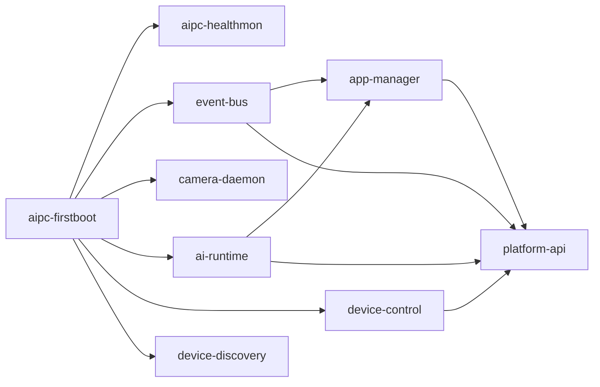

# Software Deployment

This document explains how to deploy the NE503 platform software release package to a device. Platform software includes platform services, HAL libraries, and the Web console. This is distinct from system image (hailo-os) flashing — see [System Flashing](./2-system-flashing.md) for that.

> Prerequisites: Complete the environment setup and build process in [Developer Guide](./1-developer-guide.md) to produce the `build/release/aipc-hailo15-<version>.tar.gz` release package.

## 1. Service Dependencies

NE503 runs multiple platform services managed by systemd with ordered startup:



| Service | Language | Dependencies |
|---------|----------|-------------|
| aipc-firstboot | Shell | None (oneshot, runs before all services) |
| aipc-healthmon | Shell | aipc-firstboot (black-box health sampler, resident) |
| event-bus | Go | None |
| camera-daemon | C++ | None |
| ai-runtime | C++ | containerd |
| device-control | Go | None |
| device-discovery | Go | None |
| app-manager | Go | event-bus + ai-runtime + containerd |
| platform-api | Go | event-bus + ai-runtime + app-manager + device-control |

> containerd is not listed above but is required by ai-runtime and app-manager. Ensure it is enabled: `systemctl enable containerd`.

## 2. Release Package Deployment

### 2.1 Transfer Package

```bash
scp build/release/aipc-hailo15-<version>.tar.gz root@<device-ip>:/tmp/
```

### 2.2 Execute Deployment

```bash
ssh root@<device-ip>
cd /tmp && tar xzf aipc-hailo15-<version>.tar.gz
cd aipc-hailo15-<version> && ./deploy.sh
```

Expected output (key stages excerpted; per-file `+ xxx -> ...` logs omitted):

```plaintext
[deploy]   AIPC Hot-swap Deploy
[deploy]   Current version:  unknown (first deploy) or previous version
[deploy]   Package version:  1.0.0
[deploy]   Config deploy:    yes
[deploy]   Install prefix:   /opt/aipc
Proceed with deployment? [y/N] y
[deploy] [1/8] Creating runtime directories...
[deploy] [2/8] Backing up current installation...
[deploy] [3/8] Stopping services for hot-swap...
[deploy] [4/8] Deploying binaries...
[deploy] [5/8] Deploying firstboot initialization script...
[deploy] [6/8] Deploying HAL libraries...
[deploy] [7/8] Deploying configs and systemd units...
[deploy] [8/8] Starting services...
[deploy] Running health checks (timeout 15s)...
[deploy] Service status:
[deploy]   aipc-healthmon: active
[deploy]   event-bus: active
[deploy]   camera-daemon: active
[deploy]   ai-runtime: active
[deploy]   platform-api: active
[deploy]   app-manager: active
[deploy]   device-control: active
[deploy]   device-discovery: active
[deploy]   Deploy successful!
[deploy]   Version: 1.0.0
```

### 2.3 deploy.sh Options

| Option | Description |
|--------|-------------|
| `--prefix /data/aipc` | Install to specified directory (recommended: `/data`, as root partition is only 100M) |
| `--force` | Force deployment, skip confirmation prompts |
| `--rollback` | Roll back to previous version |
| `--status` | Display current deployment status |
| `--no-config` | Skip config file overwrite (preserve device config) |

Complete examples:

```bash
./deploy.sh --prefix /data/aipc --force    # Deploy to /data partition
./deploy.sh --rollback                      # Roll back to previous version
./deploy.sh --status                        # Check deployment status
```

## 3. Iterative Development

During development, you can replace individual service binaries without a full deployment.

### 3.1 Manual Single Service Replacement

```bash
scp build/output/device-control root@<device-ip>:/opt/aipc/bin/
ssh root@<device-ip> "systemctl restart device-control"
```

If `/opt` runs low on space (root partition is ~100M), deploy to `/data` instead:

```bash
scp build/output/device-control root@<device-ip>:/data/aipc/bin/
```

### 3.2 Make Deploy Targets

The Makefile provides automated deployment commands:

```bash
make setup-ssh TARGET=root@<device-ip>          # First time: configure SSH key auth
make deploy-init TARGET=root@<device-ip>         # First time: initialize directory structure
make deploy-all TARGET=root@<device-ip>          # Per-service build + scp + restart
```

Specify `/data` partition:

```bash
make deploy-all TARGET=root@<device-ip> REMOTE_PREFIX=/data/aipc
```

## 4. Release Package Contents

`aipc-hailo15-<version>.tar.gz` contains:

| Path | Contents |
|------|----------|
| `opt/aipc/bin/` | Platform service binaries + CLI + tools |
| `opt/aipc/scripts/` | Ops scripts (firstboot / healthmon / logrotate) |
| `opt/aipc/lib/hal/` | HAL shared libraries |
| `opt/aipc/etc/` | YAML configuration |
| `opt/aipc/etc/security/` | seccomp policies |
| `opt/aipc/web/` | Web console |
| `opt/aipc/swagger-ui/` | API documentation |
| `opt/aipc/models/` | Model directory (empty, requires separate download) |
| `systemd/` | systemd service units |
| `deploy.sh` | Hot-swap deployment script |
| `VERSION` | Version metadata |

### Model Files

Models are not included in the release package and must be deployed separately:

```bash
make download-models TARGET=root@<device-ip> REMOTE_PREFIX=/data/aipc
```

## 5. Deployment Verification

After deployment, run the following checks on the device:

```bash
# 1. Service status (all should be active)
systemctl status ai-runtime camera-daemon app-manager event-bus device-control device-discovery platform-api
```

Expected output:

```plaintext
● ai-runtime.service - AI Runtime Service
     Loaded: loaded (/etc/systemd/system/ai-runtime.service)
     Active: active (running)
```

```bash
# 2. Binary architecture (should be ARM aarch64)
file /opt/aipc/bin/ai-runtime
# ELF 64-bit LSB pie executable, ARM aarch64

# 3. HAL libraries
ls -l /opt/aipc/lib/hal/libaipc_hal*.so

# 4. NPU device
lsmod | grep hailo && ls -la /dev/hailo*

# 5. Web console
curl -s http://localhost:8080/ | head -1
# <!DOCTYPE html>
```

Access the Web console at `http://<device-ip>:8080` with default credentials `admin` / `password`.

## 6. Troubleshooting

### containerd Not Running

If app-manager fails to start, check containerd:

```bash
systemctl enable containerd && systemctl start containerd
```

### "exec format error"

Binary architecture mismatch between build output and device:

```bash
file build/output/ai-runtime    # Should be ARM aarch64
ssh root@<device-ip> "uname -m" # Device should report aarch64
```

### Service Fails to Start

Check service logs to diagnose:

```bash
journalctl -u <service-name> -n 50 --no-pager
```

## 7. Related Documentation

- [Developer Guide](./1-developer-guide.md) — Environment setup and building
- [System Architecture](./0-system-architecture.md) — Four-layer architecture and core services
- [System Flashing](./2-system-flashing.md) — System image flashing
