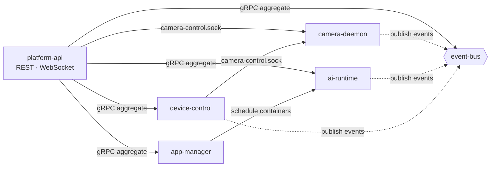

# Services Overview

The NE503 AIPC platform consists of seven core services, all communicating over Unix Sockets and managed by systemd. This page is each service's **archive page**: responsibility, socket, startup dependency, source pointer, and CLI commands — consult it when a service won't start, you need an interface definition, or you want to locate source code. The gRPC contract authority is the [source repository](https://github.com/camthink-ai/neoruntime)'s proto and YAML files; this page does not restate them.

## Service Collaboration

platform-api is the unified external entry point, aggregating every service's gRPC interfaces; event-bus is the messaging hub that nearly all services publish to; camera-daemon and device-control cooperate over a dedicated socket for lens control.



How data flows from the sensor to your app (the zero-copy frame path) is covered in [System Architecture · End-to-End Data Path](./0-system-architecture.md#2-end-to-end-data-path) — this page covers only service-to-service calls.

device-discovery is relatively independent: it manages external managed devices via MQTT/UDP and consumes no other platform services, so it is not in the diagram.

## Socket Overview

Internal communication goes over `/run/aipc/*.sock` (for on-device diagnosis, use `ss -x | grep aipc` or `systemctl status`). The single exception: event-bus also listens on TCP `127.0.0.1:50053` for Hailo C++ gRPC clients (the Hailo gRPC library lacks a unix socket resolver).

| Socket | Provider | Consumers | Purpose |
|:--|:--|:--|:--|
| `/run/aipc/camera.sock` | camera-daemon | ai-runtime | Raw-frame fd receiving (SCM_RIGHTS zero-copy) |
| `/run/aipc/camera-control.sock` | camera-daemon | device-control, platform-api | Lens control (lens_hal protocol) |
| `/run/aipc/ai-runtime.sock` | ai-runtime | SDK apps, platform-api, app-manager | Inference (inference.proto) |
| `/run/aipc/app-manager.sock` | app-manager | platform-api | App lifecycle (app.proto) |
| `/run/aipc/event-bus.sock` | event-bus | all services, SDK apps | Event pub/sub (event.proto) |
| `/run/aipc/device-control.sock` | device-control | SDK apps, platform-api | Peripheral control (device.proto) |
| `/run/aipc/device-discovery.sock` | device-discovery | platform-api | Device discovery (discovery.proto) |

## Startup Dependencies

Startup dependencies come from the [systemd unit declarations](https://github.com/camthink-ai/neoruntime/tree/main/systemd) (`After` / `Wants`). Shared prerequisites for every service: `aipc-restore.service`, `aipc-firstboot.service`, `network.target`; the table lists only what is **specific** to each service:

| Service | Specific dependencies |
|:--|:--|
| camera-daemon | After `aipc-mcu-prep`, `isp_media_server`, `hailort_server` |
| ai-runtime | After + Wants `containerd.service` |
| event-bus, device-discovery | none specific |
| device-control | After + Wants **camera-daemon**; After `aipc-mcu-prep` |
| app-manager | Wants `ai-runtime`, `event-bus`, `containerd` |
| platform-api | After + Wants `ai-runtime`, `app-manager`, `device-control`, `event-bus` |

Troubleshooting notes:

- **camera-daemon has the deepest base-unit chain** (MCU prep → ISP media server → HailoRT server) — for picture issues, check `systemctl status isp_media_server hailort_server` before camera-daemon itself;
- ai-runtime and device-control both connect to camera-daemon at runtime, but only device-control declares a systemd dependency on it; ai-runtime starts in parallel with camera-daemon and connects via socket retry — ai-runtime coming up before camera-daemon is normal;
- platform-api starts last; `After` guarantees ordering, not readiness (Wants is a weak dependency — a failed dependency still lets it start).

## Service Inventory

All paths below are relative to the [neoruntime repository](https://github.com/camthink-ai/neoruntime) root.

### camera-daemon

1. **Responsibility**: hardware abstraction entry point (**C++ service**). Manages the image sensor, ISP parameters, H.264/H.265 encoders, RTSP streams, MCU communication, and audio capture/playback, and hands frames to downstream consumers zero-copy via DMA-BUF fds.
2. **Collaboration**: exposes the fd receiver socket (`camera.sock`) to ai-runtime; the lens control endpoint (`camera-control.sock`) to device-control; publishes capture and encoding events to event-bus.
3. **Source**:
   - Proto: `platform/camera-daemon/proto/camera.proto`, `lens_hal.proto`
   - C++ implementation: `platform/camera-daemon/src/`, `platform/camera-daemon/include/`
   - Config: `configs/platform/camera-daemon.yaml`
   - Design doc: `docs/services/CAMERA_DAEMON_DESIGN.md`

### ai-runtime

1. **Responsibility**: the AI inference runtime (**C++ service**). Manages HEF model load/unload, single-shot and streaming inference, inference session quotas, NPU scheduling policy, CLIP text encoding, GenAI (LLM/VLM) streaming generation, and post-processing of inference results (detection, keypoints, segmentation, OCR, depth maps, etc.).
2. **Collaboration**: obtains zero-copy frames from camera-daemon via the fd receiver; inference results are automatically published to event-bus (`inference/` prefix); container apps scheduled by app-manager run inference through this service.
3. **Source**:
   - Proto: `platform/ai-runtime/proto/inference.proto`
   - C++ implementation: `platform/ai-runtime/src/`, `platform/ai-runtime/include/`
   - Config: `configs/ai/ai-runtime.yaml`
   - Reference: `docs/services/ai-runtime.md`

### app-manager

1. **Responsibility**: container app lifecycle management. Wraps containerd, providing install/start/stop/logs/resource cleanup/bulk operations for apps/images/containers, plus in-container exec and Web URL registration.
2. **Collaboration**: depends on the containerd socket; `Wants` ai-runtime and event-bus (scheduled apps usually need inference and event subscription).
3. **Source**:
   - Proto: `platform/app-manager/proto/app.proto`
   - Config: `configs/platform/app-manager.yaml`
   - Reference: `docs/services/app-manager.md`

### event-bus

1. **Responsibility**: the platform messaging hub. Provides pub/sub, batch publish, topic management, and event statistics. Supports topic pattern matching and wildcard subscription.
2. **Collaboration**: nearly every service is its producer or consumer — camera-daemon, ai-runtime, and device-control publish to it; app-manager and platform-api subscribe.
3. **Source**:
   - Proto: `platform/event-bus/proto/event.proto`
   - Config: `configs/platform/event-bus.yaml`
   - Reference: `docs/services/event-bus.md`

### device-control

1. **Responsibility**: device peripheral control. Covers PTZ, lens (zoom/focus/iris), fill light/IR LED/IR-Cut, environment control (fan/heater/radar), alarm output (relay/Wiegand), RS485, GPIO — all hardware control interfaces.
2. **Collaboration**: cooperates with camera-daemon for lens control via the lens endpoint (`camera-control.sock`); publishes events to event-bus.
3. **Source**:
   - Proto: `platform/device-control/proto/device.proto`
   - Config: `configs/platform/device-control.yaml`
   - Reference: `docs/services/device-control.md`

### device-discovery

1. **Responsibility**: CamThink device discovery and management. Implements the CT-Disc protocol: LAN discovery via UDP multicast (`239.255.255.250:19850`), CAT1 cellular devices registering via MQTT, all merged into one device registry keyed by SN; supports heartbeat detection and management commands (reboot, OTA, etc.).
2. **Collaboration**: relatively independent, consumes no other platform services; management commands are delivered to managed devices over MQTT.
3. **Source**:
   - Proto: `platform/device-discovery/proto/discovery.proto`
   - Config: `configs/platform/discovery.yaml`
   - Reference: `docs/services/device-discovery.md`

### platform-api

1. **Responsibility**: HTTP/WebSocket gateway. Aggregates all the above services' gRPC interfaces and exposes REST APIs and WebSocket (video stream push, terminal, event push) externally. Hosts the web console backend and authentication.
2. **Collaboration**: as the unified entry point, connects to ai-runtime, app-manager, device-control (camera-control.sock), and event-bus. The web frontend (`web/`) is its only UI client.
3. **Source**:
   - Directory: `platform/platform-api/` (`server/`, `handlers/`, `websocket/`, `auth/`)
   - Frontend: `web/`
   - Config: `configs/platform-api.yaml`
   - Reference: `docs/services/platform-api.md`

## CLI Tool

`aipc-cli` is the platform's command-line management tool, covering apps, devices, events, media, streams, models, and system operations. Use it via the web terminal (Maintenance → Terminal) or after SSH-ing into the device.

**Common command quick reference**:

```bash
# System
aipc-cli system info              # device info
aipc-cli system health            # health check

# Apps
aipc-cli app list                 # list apps
aipc-cli app start <id>           # start app
aipc-cli app stop <id>            # stop app
aipc-cli app logs <id> -f         # follow app logs

# Device (lens / IR)
aipc-cli device status            # device status
aipc-cli device zoom in 5         # zoom (in / out / stop, speed 1-10)
aipc-cli device focus auto        # autofocus

# Streams
aipc-cli stream list              # list stream status
aipc-cli stream url <id>          # show stream RTSP URL

# Models
aipc-cli model list               # list models
aipc-cli model register <path>    # register a new model
```

**Output format**: every command supports `-o table` (default) / `-o json` / `-o yaml` for script parsing. The full command tree and parameters are authoritative in `aipc-cli --help` and each subcommand's `<command> --help`.

**Source**: `tools/aipc-cli/cmd/`

## Related Documentation

- [System Architecture](./0-system-architecture.md) — layered design and the end-to-end data path (this page is the service archive; the architecture page owns the data-flow rationale)
- [Version Matrix](./5-version-matrix.md) — current component version mapping and upgrade compatibility gates
- [Troubleshooting FAQ](../5-troubleshooting.md) §8 — deep-dive service troubleshooting (systemd, journalctl, performance monitoring); use it together with this page's dependency table and command reference
