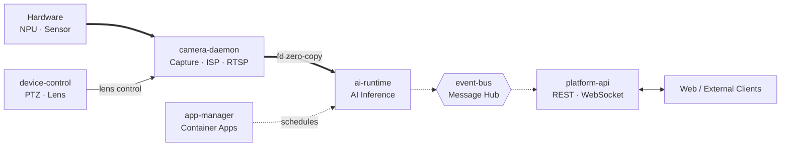

# Services Overview

The NE503 AIPC platform consists of seven core services, all communicating via Unix sockets and managed by systemd. This document describes only each service's **responsibilities and collaboration** — for gRPC interfaces, configuration fields, and command parameters, consult the source code directly, as it is the single authoritative source.

## Architecture

The platform's core data flow is a left-to-right pipeline: **Hardware capture → AI inference → Event dispatch → Gateway delivery**. device-control and app-manager attach to the pipeline as control services.

- **Thick arrows** (`==>`): video inference pipeline, DMA-BUF fd zero-copy frame transfer
- **Dashed arrows** (`-.->`): asynchronous event-bus messaging and container scheduling
- platform-api aggregates all core services via gRPC (including device-control, app-manager); camera-daemon and device-control also publish events to event-bus
- device-discovery is relatively standalone — it manages external devices via MQTT/UDP and is omitted from this diagram

## Startup Order

Startup dependencies are derived from systemd unit `After` / `Wants` declarations:

| Phase | Service | systemd dependency |
|:---|:---|:---|
| 1 | `camera-daemon` `event-bus` `device-discovery` `ai-runtime` `device-control` | Only `After=network.target` (ai-runtime additionally `Wants=containerd.service`) |
| 2 | `app-manager` | `After=network.target`; `Wants` ai-runtime + event-bus + containerd |
| 3 | `platform-api` | `After` ai-runtime + app-manager + device-control + event-bus all ready |

Note: Although ai-runtime and device-control connect to camera-daemon at runtime (fd_receiver / lens_endpoint), they do **not** declare a systemd startup dependency on camera-daemon. They start in parallel with camera-daemon in phase 1 and establish connections at runtime via socket reconnection.

All internal platform communication goes through `/run/aipc/*.sock`. The sole exception: event-bus also listens on `127.0.0.1:50053` for Hailo C++ gRPC clients (the Hailo gRPC library lacks a unix socket resolver).

## Service Inventory

### camera-daemon

1. **Responsibility**: Hardware abstraction layer entry point (**C++ service**). Manages image sensors, ISP parameters, H.264/H.265 encoders, RTSP streams, MCU communication, audio capture/playback, and provides frames to downstream via DMA-BUF fd zero-copy.
2. **Collaboration**: Exposes an fd receiver socket (`/run/aipc/camera.sock`) to ai-runtime; exposes a lens control endpoint (`/run/aipc/camera-control.sock`) to device-control; publishes capture and encoding events to event-bus.
3. **Source**:
   - Proto: `platform/camera-daemon/proto/camera.proto`, `lens_hal.proto`
   - C++ implementation: `platform/camera-daemon/src/`, `platform/camera-daemon/include/`
   - Config: `configs/platform/camera-daemon.yaml`

### ai-runtime

1. **Responsibility**: AI inference runtime (**C++ service**). Manages HEF model load/unload, single and streaming inference, inference session quotas, NPU scheduling strategy, CLIP text encoding, GenAI (LLM/VLM) streaming generation, and post-processing of inference results (detection, landmarks, segmentation, OCR, depth maps, etc.).
2. **Collaboration**: Receives zero-copy frames from camera-daemon via fd receiver; auto-publishes inference results to event-bus (`inference/` prefix); container apps scheduled by app-manager issue inference through this service.
3. **Source**:
   - Proto: `platform/ai-runtime/proto/inference.proto`
   - C++ implementation: `platform/ai-runtime/src/`, `platform/ai-runtime/include/`
   - Config: `configs/ai/ai-runtime.yaml`

### app-manager

1. **Responsibility**: Container application lifecycle management. Wraps containerd to provide app/image/container install, start/stop, logs, resource cleanup, batch operations, plus in-container exec, Web URL registration, and more.
2. **Collaboration**: Depends on the containerd socket; `Wants` ai-runtime and event-bus (scheduled apps typically need inference and event subscription).
3. **Source**:
   - Proto: `platform/app-manager/proto/app.proto`
   - Config: `configs/platform/app-manager.yaml`

### event-bus

1. **Responsibility**: Platform message hub. Provides publish/subscribe, batch publish, topic management, and event statistics. Supports topic pattern matching and wildcard subscription.
2. **Collaboration**: Nearly all services are its producers or consumers — camera-daemon, ai-runtime, device-control publish events; app-manager and platform-api subscribe to events.
3. **Source**:
   - Proto: `platform/event-bus/proto/event.proto`
   - Config: `configs/platform/event-bus.yaml`

### device-control

1. **Responsibility**: Device peripheral control. Covers PTZ (pan-tilt), lens (zoom/focus/iris), fill light/IR LED/IR-Cut, environmental control (fan/heater/radar), alarm outputs (relay/Wiegand), RS485, GPIO — the complete hardware control interface.
2. **Collaboration**: Controls the lens in concert with camera-daemon via the lens endpoint (`/run/aipc/camera-control.sock`); publishes events to event-bus.
3. **Source**:
   - Proto: `platform/device-control/proto/device.proto`
   - Config: `configs/platform/device-control.yaml`

### device-discovery

1. **Responsibility**: CamThink device discovery and management. Implements the CT-Disc protocol — LAN auto-discovery via UDP multicast (`239.255.255.250:19850`), CAT1 cellular device registration via MQTT, unified registry keyed by SN, heartbeat detection, and management command dispatch (reboot, OTA, etc.).
2. **Collaboration**: Relatively standalone; does not consume other platform services. Management commands are dispatched to managed devices via the MQTT channel.
3. **Source**:
   - Proto: `platform/device-discovery/proto/discovery.proto`
   - Config: `configs/platform/discovery.yaml`

### platform-api

1. **Responsibility**: HTTP/WebSocket gateway. Aggregates the gRPC interfaces of all services above, exposing REST APIs and WebSocket (video streaming, terminal, event push) externally. Hosts the Web console backend and authentication.
2. **Collaboration**: Serves as the unified entry point, connecting ai-runtime, app-manager, device-control (camera-control.sock), and event-bus. The web frontend (`web/`) is its sole UI client.
3. **Source**:
   - Directory: `platform/platform-api/` (`server/`, `handlers/`, `websocket/`, `auth/`)
   - Frontend: `web/`
   - Config: `configs/platform-api.yaml`

## CLI Tool

`aipc-cli` is the platform command-line management tool, covering app, device, event, media, stream, model, and system operations. The command tree and parameters are authoritative via `aipc-cli --help` and each subcommand's `<command> --help`.

**Source**: `tools/aipc-cli/cmd/`

## Related Documentation

- [Troubleshooting Guide](./1-troubleshooting.md) — Diagnostics, commands, and error code quick reference
