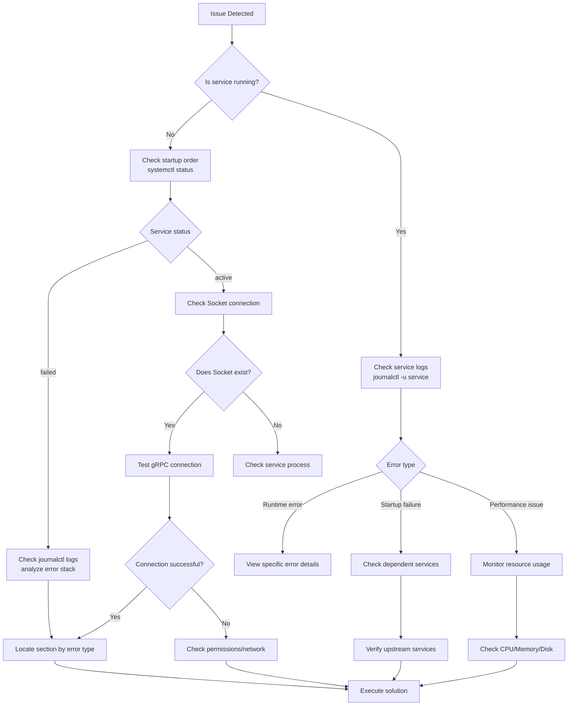
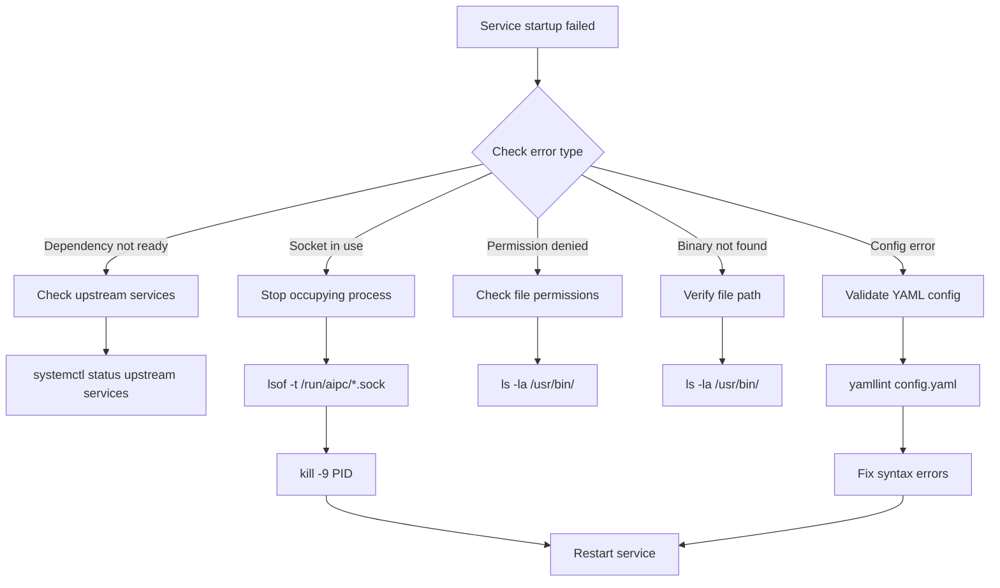
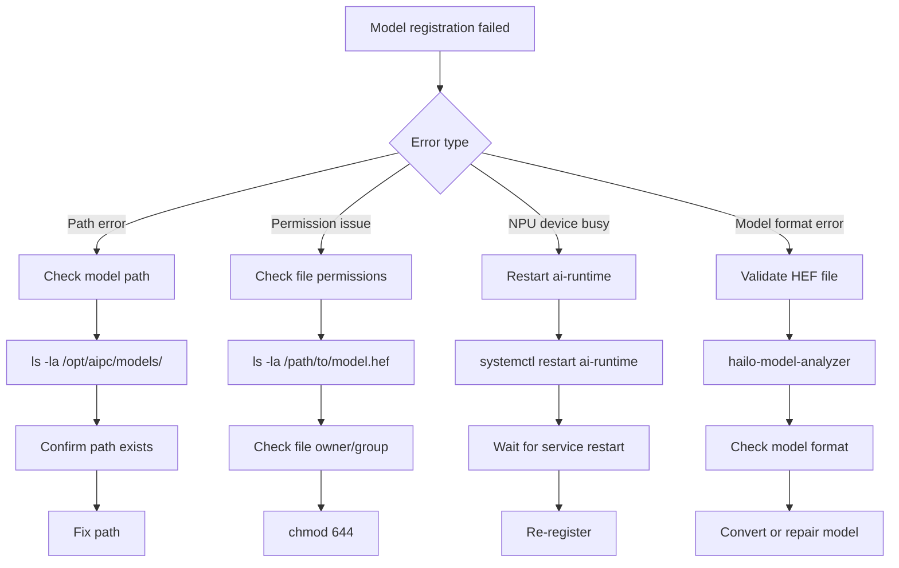
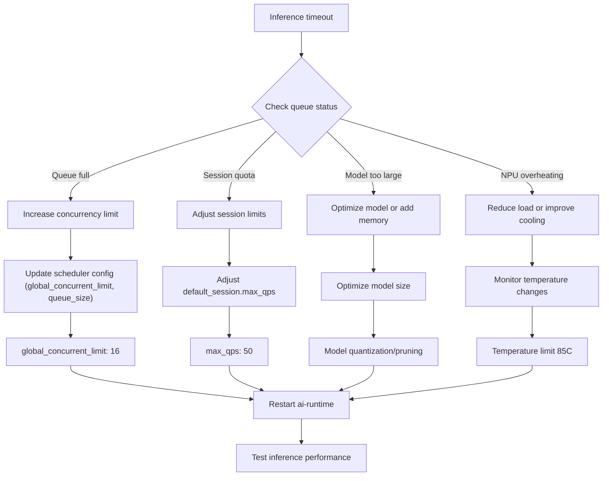
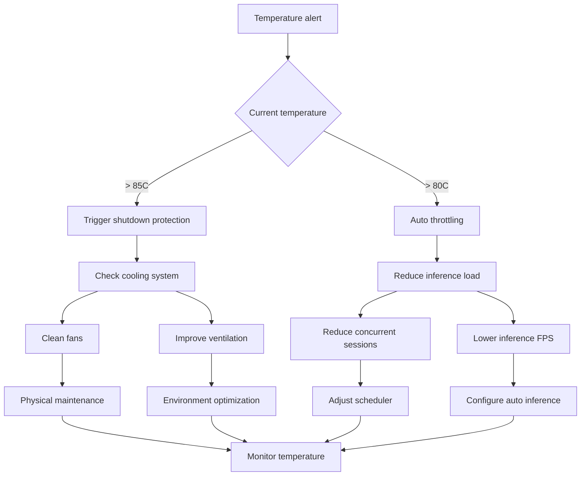
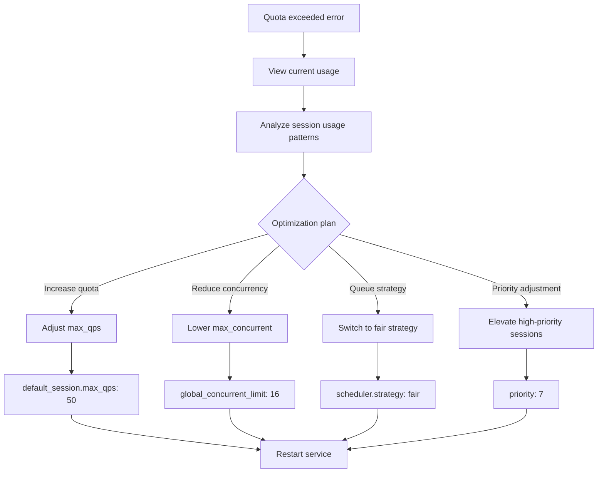
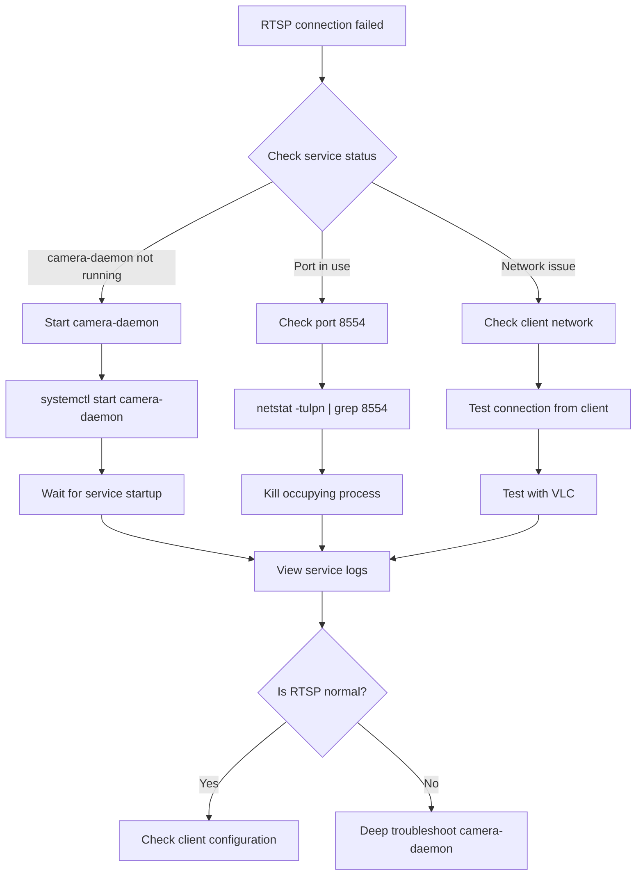

# Troubleshooting Guide

## 1. Overview

This guide provides systematic troubleshooting procedures and solutions for the NE503 AIPC platform. The platform uses a microservice architecture where services communicate via Unix Sockets and follow a specific startup sequence. When encountering issues, follow this general workflow:

1. Confirm the issue symptom
2. Check related logs
3. Refer to the corresponding section
4. Execute the recommended solution

## 2. General Troubleshooting Workflow



## 3. Service Startup Failure Troubleshooting

### 3.1 Check systemd Status

```bash
# View all AIPC service statuses
systemctl status ai-runtime camera-daemon app-manager event-bus device-control device-discovery platform-api

# View a specific service status
systemctl status ai-runtime.service

# View failed services
systemctl --failed

# View service dependencies
systemctl list-dependencies platform-api.service
```

### 3.2 Check if Unix Socket Exists

```bash
# List /run/aipc directory
ls -la /run/aipc/

# The platform has 7 sockets:
#   ai-runtime.sock        — AI inference service
#   app-manager.sock       — Container app management
#   device-control.sock    — Device peripheral control
#   event-bus.sock         — Event bus
#   device-discovery.sock  — Device discovery
#   camera.sock            — camera-daemon frame publisher (fd zero-copy)
#   camera-control.sock    — camera-daemon control (lens/HAL)
ls -la /run/aipc/*.sock

# Test Socket connection
nc -U /run/aipc/ai-runtime.sock
```

### 3.3 View Logs with journalctl

```bash
# View service logs in real time
journalctl -u ai-runtime -f

# View logs from the last 1 hour
journalctl -u camera-daemon --since "1 hour ago"

# View logs containing error keywords
journalctl -u app-manager | grep -i "error\|failed\|fatal"

# View detailed startup failure errors
journalctl -u app-manager -b --no-pager

# Filter by error level
journalctl -u event-bus -p err
journalctl -u device-control -p warning
```

### 3.4 Common Startup Issues



### 3.5 Socket Connection Test

```bash
# Test gRPC service using grpcurl
grpcurl -plaintext unix:///run/aipc/ai-runtime.sock list

# Test if service responds
grpcurl -plaintext -d '{}' unix:///run/aipc/ai-runtime.sock aipc.inference.InferenceService/ListModels

# Check Socket permissions
ls -ld /run/aipc/
ls -la /run/aipc/*.sock
```

## 4. AI Inference Troubleshooting

### 4.1 Model Loading Failure



**Diagnostic commands:**

```bash
# View model registration logs
journalctl -u ai-runtime | grep -i "model"

# Check NPU device status
hailortcli scan

# Validate model files
ls -la /opt/aipc/models/
file /opt/aipc/models/yolov8n.hef
```

### 4.2 Inference Timeout



**Diagnostic commands:**

```bash
# View inference statistics
grpcurl -plaintext -d '{}' unix:///run/aipc/ai-runtime.sock aipc.inference.InferenceService/GetStats

# List registered models
grpcurl -plaintext -d '{}' unix:///run/aipc/ai-runtime.sock aipc.inference.InferenceService/ListModels

# Monitor system resources
top -p $(pidof ai-runtime)
```

### 4.3 NPU Overheating



**Monitoring commands:**

```bash
# Check NPU temperature
hailortcli scan | grep Temperature

# View ai-runtime temperature logs
journalctl -u ai-runtime | grep -i "temperature"

# View performance statistics
grpcurl -plaintext -d '{}' unix:///run/aipc/ai-runtime.sock aipc.inference.InferenceService/GetStats
```

### 4.4 Session Quota Exceeded



**Diagnostic commands:**

```bash
# List registered models
grpcurl -plaintext -d '{}' unix:///run/aipc/ai-runtime.sock aipc.inference.InferenceService/ListModels

# View quota statistics
grpcurl -plaintext -d '{}' unix:///run/aipc/ai-runtime.sock aipc.inference.InferenceService/GetStats

# View session creation logs
journalctl -u ai-runtime | grep -i "session"
```

## 5. Video Streaming Troubleshooting

### 5.1 RTSP Connection Failure



**Diagnostic commands:**

```bash
# Check RTSP service status
systemctl status camera-daemon

# View RTSP logs
journalctl -u camera-daemon -f

# Test RTSP connection
ffmpeg -rtsp_transport tcp -i rtsp://localhost:8554/main -t 10 -f null -

# Check port usage
netstat -tulpn | grep 8554
```

> For Web Console WebSocket disconnection troubleshooting (video playback layer), see [Application Troubleshooting — Video Stream Integration](../../4-application-guide/0-app-troubleshooting.md#2-video-stream-integration-troubleshooting).

## 6. Device Control Troubleshooting

| Symptom | Possible Cause | Diagnostic Command |
|---------|---------------|-------------------|
| PTZ not responding | device-control not started / MCU UART communication failure | `systemctl status device-control`; `journalctl -u device-control -f`; `grpcurl ... DeviceControl/Pan` |
| Lens control abnormality | Focus/zoom/iris motor fault | `grpcurl ... DeviceControl/GetLensStatus`; `grpcurl ... DeviceControl/LensResetZero` |
| UART communication failure | Baud rate/wiring/voltage issue | `ls -la /dev/ttyS*`; `stty -F /dev/ttyS0 921600` |

The complete gRPC interface is defined in `platform/device-control/proto/device.proto`.

## 7. Web Console Troubleshooting

### 7.1 Browser Compatibility

| Browser | Minimum Version | Support Level | Known Issues | Solution |
|---------|----------------|--------------|-------------|----------|
| Chrome | 88+ | Full support | -- | -- |
| Firefox | 78+ | Basic support | No WebCodecs | Use MSE playback |
| Safari | 14+ | Partial support | No WebCodecs | Degrade to MSE |
| Edge | 88+ | Full support | -- | -- |
| Mobile browsers | -- | Limited support | Performance issues | Use desktop |

Chrome 88+ or Edge 88+ recommended for the best experience. Safari auto-degrades to MSE with slightly lower performance.

### 7.2 WebSocket and Video Playback Troubleshooting

Video playback relies on WebSocket to transport H.264 frames. Common issues:

| Symptom | Possible Cause | Solution |
|---------|---------------|----------|
| WebSocket 1006 | Abnormal connection close | Check if platform-api is running, firewall allows port 8080 |
| WebSocket 401/403 | Invalid or expired token | Re-login to get a new token |
| Black screen | WebSocket not established / SPS-PPS not received | Refresh page, check WebSocket connection status |
| Artifacts/mosaic | Network packet loss / decoder incompatibility | Switch browser or check network quality |
| High latency | Network latency / buffer too large | Ensure sufficient LAN bandwidth, reduce encoding GOP |

### 7.3 API Request Failures

| Status Code | Meaning | Solution |
|-------------|---------|----------|
| 401 | Authentication failed | Clear token and re-login |
| 403 | Insufficient permissions | Check user permissions |
| 404 | Resource not found | Check API path |
| 500 | Server error | Check `/var/log/aipc/platform-api.log` |
| 503 | Service unavailable | Check service status, restart if needed |

### 7.4 Log Viewing

**Browser-side:** Open Developer Tools (F12) → Console tab to view errors.

**Server-side:**

```bash
# AI inference service log
tail -f /var/log/aipc/ai-runtime.log

# Platform API service log
tail -f /var/log/aipc/platform-api.log

# App manager log
tail -f /var/log/aipc/app-manager.log

# Device control service log
tail -f /var/log/aipc/device-control.log

# Event bus log
tail -f /var/log/aipc/event-bus.log

# Camera daemon log
tail -f /var/log/aipc/camera-daemon.log
```

## 8. Log Level Adjustment

### 8.1 Temporarily Adjust Log Level

```bash
# Temporarily set to debug level
# Note: journalctl does not support --log-level; set debug level in the service configuration file instead
sudo journalctl -u ai-runtime -f

# View error level and above logs
sudo journalctl -u camera-daemon -p err
```

### 8.2 Modify Configuration File

The actual config files on the device are located at `/opt/aipc/etc/*.yaml` (the path specified in systemd ExecStart). The `configs/` directory in the source repo is only a template.

```yaml
# /opt/aipc/etc/ai-runtime.yaml — adjust log_level
service:
  name: ai-runtime
  listen: unix:///run/aipc/ai-runtime.sock
  log_level: debug  # debug, info, warn, error
```

### 8.3 Log Level Reference

| Level | Description |
|-------|-------------|
| `debug` | Detailed debugging information |
| `info` | Key runtime status |
| `warn` | Non-fatal warnings |
| `error` | Critical errors |

### 8.4 Log Analysis Tips

```bash
# View error rate
journalctl -u ai-runtime --since "1 hour ago" | grep -c "error"

# View most frequent errors
journalctl -u ai-runtime | grep "error" | sort | uniq -c | sort -nr

# Filter specific errors
journalctl -u ai-runtime | grep -E "(timeout|connection refused|permission denied)"
```

## 9. Performance Monitoring

### 9.1 System Resource Monitoring

```bash
# Monitor CPU usage
top -p $(pgrep -f ai-runtime)

# Monitor memory usage
free -h && ps aux | grep ai-runtime

# Monitor disk I/O
iostat -x 1 5

# Monitor network
iftop -i eth0
```

### 9.2 Service Performance Metrics

```bash
# AI Runtime statistics
grpcurl -plaintext -d '{}' unix:///run/aipc/ai-runtime.sock aipc.inference.InferenceService/GetStats

# Container statistics
aipc-cli app info <app-id>

# Device status
grpcurl -plaintext -d '{}' unix:///run/aipc/device-control.sock aipc.device.DeviceControl/GetDeviceStatus
```

### 9.3 Real-time Monitoring Script

```bash
#!/bin/bash
# Monitoring script example

while true; do
    echo "=== $(date) ==="
    echo "CPU Usage:"
    top -bn1 | grep "Cpu(s)" | sed "s/.*, *\([0-9.]*\)%* id.*/\1/" | awk '{print 100 - $1}'
    echo "Memory Usage:"
    free | grep Mem | awk '{printf "%.2f%%\n", $3/$2 * 100.0}'
    echo "Disk Usage:"
    df /opt/aipc | tail -1 | awk '{print $5}'
    echo "NPU Temperature:"
    hailortcli scan | grep Temperature | awk '{print $2}'
    sleep 5
done
```

## 10. Common Diagnostic Commands Quick Reference

| Scenario | Command | Description |
|----------|---------|-------------|
| View service status | `systemctl status ai-runtime camera-daemon app-manager` | Check core platform services |
| View service logs | `journalctl -u <service-name> -f` | View service logs in real time |
| Test gRPC connection | `grpcurl -plaintext unix:///run/aipc/service.sock list` | Test gRPC service availability |
| Check Socket | `ls -la /run/aipc/` | View Unix Socket files |
| Check port usage | `netstat -tulpn \| grep 8554` | Check RTSP port usage |
| Check system resources | `top -p $(pidof service)` | Monitor service resource usage |
| View container status | `aipc-cli app list` | List all container applications |
| Test network connection | `curl http://localhost:8080/api/v1/media/status` | Test API endpoint |
| View model status | `grpcurl -plaintext -d '{}' unix:///run/aipc/ai-runtime.sock aipc.inference.InferenceService/ListModels` | List registered models |
| Check NPU status | `hailortcli scan` | View Hailo device status |
| Test PTZ control | `grpcurl -plaintext -d '{"direction": "PAN_LEFT", "speed": 50}' unix:///run/aipc/device-control.sock aipc.device.DeviceControl/Pan` | Test PTZ control |
| View event logs | `aipc-cli event-log list` | View event bus logs |
| Check disk usage | `df -h /opt/aipc` | Check disk space |
| Check memory usage | `free -h` | Check system memory |

## 11. Error Code Reference

The following are business error codes returned by platform-api. The full definition is in `platform/platform-api/handlers/response.go`.

Code ranges: **1xxx** General/Request · **2xxx** Auth · **3xxx** Service/Infra · **4xxx** Resource · **5xxx** AI/Model · **6xxx** App Manager · **7xxx** Device · **8xxx** File/Storage · **9xxx** SSH · **10xxx** Process.

| Code | Meaning | Code | Meaning | Code | Meaning |
|:---|:---|:---|:---|:---|:---|
| 0 | Success | 1000 | Unknown error | 1001 | Invalid request |
| 1002 | Invalid JSON | 1003 | Missing parameter | 1004 | Invalid parameter |
| 2000 | Unauthorized | 2001 | Forbidden | 2002 | Token expired |
| 2003 | Invalid token | 3000 | Service unavailable | 3001 | Service timeout |
| 3002 | Service error | 3003 | gRPC error | 3004 | Database error |
| 4000 | Not found | 4001 | Already exists | 4002 | Resource exhausted |
| 4003 | Operation failed | 5000 | Model not found | 5001 | Model load failed |
| 5002 | Inference error | 5003 | Invalid model format | 6000 | App not found |
| 6001 | App install failed | 6002 | App start failed | 6003 | App stop failed |
| 6004 | App running | 6005 | App not running | 7000 | Device error |
| 7001 | PTZ error | 7002 | Camera error | 7003 | GPIO error |
| 8000 | File not found | 8001 | File upload failed | 8002 | File delete failed |
| 8003 | Storage full | 8004 | Access denied | 9000 | SSH config error |
| 9001 | SSH service error | 10000 | Process not found | 10001 | Process kill failed |

## 12. Troubleshooting Summary

1. **Check service status first** -- Use `systemctl status` to confirm if services are running
2. **View error logs** -- Use `journalctl` to view detailed error information
3. **Verify network connections** -- Check if Sockets and ports are normal
4. **Check resource usage** -- Ensure system resources are sufficient
5. **Troubleshoot module by module** -- Verify progressively from low-level hardware to upper-level applications
6. **Preserve complete logs** -- Save sufficient log information before and after failures

## Related Documentation

- [Services Overview](./0-platform-services.md) — Service responsibilities, collaboration, and source pointers
- [Platform Architecture](../0-system-architecture.md)
- [App Troubleshooting](../../4-application-guide/0-app-troubleshooting.md) — Application development troubleshooting (containers, video streams, event bus)
