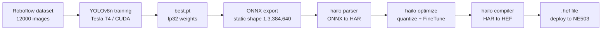
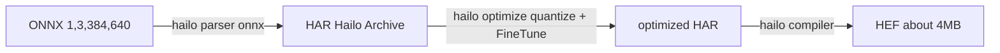

# HEF Model Compilation

This tutorial demonstrates how to train a **YOLOv8n** detection model from a public dataset in an **NVIDIA CUDA** environment, export a static-shape **ONNX**, and then compile it into a **`.hef`** file deployable on NE503 via the **Hailo Dataflow Compiler (DFC)** with quantization. Using safety helmet detection (Helmet / No Helmet) as the carrier, the method is universal — once you complete it, the training and compilation flow applies to any custom Hailo detection model (vehicles, pedestrians, PPE, etc.).

Target audience: ML engineers who want to deploy custom-trained detection models on NE503 (Hailo-15H), especially those with YOLO training experience who have not yet worked through edge-NPU deployment issues.

---

## 1. Overview

This tutorial covers the complete flow from dataset preparation to HEF deployment:

### End-to-end pipeline



### Carrier choice: safety helmet detection

This tutorial uses safety helmet detection (Helmet / No Helmet) as the example, with the Roboflow Safety Helmet v4 dataset (12000 images). The task has clear class definitions and intuitive business metrics: a single 2-class model outputs both `total people = Helmet + No Helmet` and `compliance rate = Helmet / total`, with no need for an additional person-detector cascade.

The final artifact of this tutorial, `safety_helmet_yolov8n_384_640.hef`, has been verified on a real NE503 device with val mAP50 ≈ 0.93.

---

## 2. Environment Preparation (NVIDIA CUDA)

### 2.1 Hardware requirements

| Component | Requirement |
|:---|:---|
| GPU | NVIDIA GPU; dedicated machine ≥8 GB VRAM; shared machine ≥16 GB VRAM (reference: Tesla T4 16G) |
| CPU | ≥4 cores (8 recommended) |
| RAM | ≥16 GB (30 GB recommended) |
| Storage | ≥50 GB (dataset + training artifacts + Hailo SW Suite ~13 GB) |
| Network | Stable internet connection (for downloading dataset and toolchain) |

### 2.2 Software stack

| Item | Tested version |
|:---|:---|
| OS | Ubuntu 22.04 |
| CUDA | 12.x |
| Python | 3.10+ |
| PyTorch | 2.x (CUDA 12.x compatible version) |
| ultralytics | 8.4.75+ (older versions reject tuple `imgsz`, see §4) |
| ONNX tools | onnx + onnxslim |

### 2.3 One-shot training environment setup

```bash
mkdir -p ~/yolo-train/{weights,datasets,scripts,logs,runs}
python3 -m venv ~/yolo-train/venv
source ~/yolo-train/venv/bin/activate
pip install ultralytics torch torchvision onnx onnxslim

# Verify CUDA availability
python -c "import torch; print('CUDA available:', torch.cuda.is_available())"
# Expected output: CUDA available: True
```

### 2.4 Hailo DFC toolchain

Hailo DFC (Dataflow Compiler) is published only for `linux/amd64` (wheel pinned to `linux_x86_64` + native `.so`), runs inside a Docker container with no translation overhead on native x86.

1. Register a free account at [Hailo Developer Zone](https://hailo.ai/developer-zone/)
2. Download the `hailo_ai_sw_suite` archive (~13 GB; version must match the device NPU firmware — this tutorial tested v5.3.0)
3. After importing the image, the compilation steps run inside the container (see §6)

:::note Platform support
The DFC toolchain only runs on Linux x86_64. This tutorial is entirely based on NVIDIA CUDA servers (e.g. Tesla T4) and does not involve a Mac compilation environment.
:::

---

## 3. Dataset Preparation

### 3.1 Download Roboflow Safety Helmet v4

Dataset source: `Safety Helmet.v4-data160.yolov8` from Roboflow Universe, YOLOv8 pyTorch format. Search "Safety Helmet" on [Roboflow Universe](https://universe.roboflow.com/) to download, or pull via API key:

```bash
pip install roboflow
```

```python
from roboflow import Roboflow
rf = Roboflow(api_key="<your API key>")           # generate in your Roboflow account settings
rf.workspace("<workspace>").project("safety-helmet").version(4).download("yolov8")
```

After manually downloading the zip, unzip it:

```bash
cd ~/yolo-train/datasets
unzip "Safety Helmet.v4-data160.yolov8.zip" -d safety-helmet
cd safety-helmet
ls -d train valid test   # all three splits present
```

Ensure the dataset directory is readable by the DFC container (Roboflow downloads default to 700 permissions):

```bash
chmod -R a+rX ~/yolo-train/datasets/safety-helmet
```

### 3.2 Dataset splits

| Split | Images | Background images | Notes |
|:---|---:|---:|:---|
| train | 10500 | 15 | includes a few unlabeled background images |
| valid | 1000 | 1 | used for training-time validation |
| test | 500 | 2 | final evaluation |
| **Total** | **12000** | 18 | |

### 3.3 data.yaml configuration

```yaml
path: ~/yolo-train/datasets/safety-helmet
train: train/images
val: valid/images
test: test/images

nc: 2
names: ["Helmet", "No Helmet"]
```

Class definitions:

- `Helmet` (class 0): head box of a person **wearing a helmet**
- `No Helmet` (class 1): bare head box of a person **not wearing a helmet**

Business mapping: `Helmet box count = helmeted people`, `No Helmet box count = unhelmeted people`, `total people = Helmet + No Helmet`, `compliance rate = Helmet / total`.

---

## 4. Model Training

### 4.1 Key hyperparameters: why lock 640×384

The NE503 `sub` stream (the low-resolution stream used for AI inference) is fixed at **640W×384H**, pixel format NV12. The model input must match this size, NCHW `[1, 3, 384, 640]` (H before W).

ultralytics 8.4.75 has a known limitation: `train`'s `imgsz` only accepts an int (tuple support came in 8.4.96+). The workaround is `imgsz=640` + `rect=True` (rectangular training), which actually produces 384×640 training inputs:

```python
TRAIN_IMGSZ  = 640          # int (8.4.75 rejects tuple)
RECT         = True         # rectangular training, keep 384 height
EXPORT_IMGSZ = (384, 640)   # lock static shape at export
```

> `rect=True` makes the dataloader batch images by aspect ratio into the **rectangle closest to imgsz** (instead of forcing a square resize). Safety-helmet images are mostly landscape (width>height), so it yields 384(H)×640(W). The log line "Image sizes 640 train" only echoes the parameter value, not the tensor shape. If ultralytics ≥8.4.96, you can use `imgsz=(384,640)` directly and skip `rect`; this tutorial uses the rect approach for backward compatibility.

### 4.2 Training script (key snippet)

```python
import torch
from ultralytics import YOLO

WEIGHTS_DIR  = "~/yolo-train/weights"
DATA_YAML    = "~/yolo-train/datasets/safety-helmet/data.yaml"
PROJECT      = "~/yolo-train/runs/helmet"
NAME         = "yolov8n_640_rect"
TRAIN_IMGSZ  = 640
RECT         = True
EXPORT_IMGSZ = (384, 640)
EPOCHS       = 100
BATCH        = 8       # adjustable based on GPU VRAM (16/32 on dedicated machine)
PATIENCE     = 20
WORKERS      = 4

# 1) Train
model = YOLO(f"{WEIGHTS_DIR}/yolov8n.pt")  # pretrained backbone
model.train(
    data=DATA_YAML,
    imgsz=TRAIN_IMGSZ,
    rect=RECT,
    epochs=EPOCHS,
    batch=BATCH,
    patience=PATIENCE,
    workers=WORKERS,
    project=PROJECT,
    name=NAME,
    exist_ok=True,
)

# 2) Export static ONNX (see §5)
best_pt = f"{PROJECT}/{NAME}/weights/best.pt"
em = YOLO(best_pt)
em.export(
    format="onnx",
    imgsz=list(EXPORT_IMGSZ),
    opset=11,
    simplify=True,
    dynamic=False,
)
```

> The class count is determined by `data.yaml`'s `nc`; the script itself does not hardcode it — the same script works for 2-class or 4-class.

### 4.3 Launch training (tmux background)

```bash
ssh <gpu-server> 'tmux new-session -d -s helmet-train \
  "source ~/yolo-train/venv/bin/activate && \
   cd ~/yolo-train && python scripts/train_helmet.py 2>&1 | tee logs/helmet-train.log"'

# Follow the log in real time
ssh <gpu-server> 'tail -f ~/yolo-train/logs/helmet-train.log'

# Monitor VRAM (confirm no impact on other processes)
ssh <gpu-server> 'nvidia-smi --query-gpu=memory.used,memory.total,utilization.gpu --format=csv'
```

### 4.4 Training artifacts

After training completes, `~/yolo-train/runs/helmet/yolov8n_640_rect/` contains:

| Artifact | Purpose |
|:---|:---|
| `weights/best.pt` | best training weights (fp32) |
| `weights/last.pt` | last-epoch weights (resumable) |
| `args.yaml` | full hyperparameter record |
| `results.csv` | per-epoch metrics |
| `results.png` | training curve overview |
| `labels.jpg` | dataset label distribution (four quadrants) |
| `BoxPR_curve.png` / `BoxF1_curve.png` / `BoxP_curve.png` / `BoxR_curve.png` | PR/F1/P/R curves |
| `confusion_matrix.png` / `confusion_matrix_normalized.png` | confusion matrices |
| `train_batch*.jpg` / `val_batch*_labels.jpg` / `val_batch*_pred.jpg` | training/val sample visualizations |

### 4.5 Measured accuracy reference (Tesla T4, 2-class)

100 epochs / batch=8 / Tesla T4, training time ~3.4 hours. Val-set metrics:

| Class | Images | Instances | Precision | Recall | mAP50 | mAP50-95 |
|:---|---:|---:|---:|---:|---:|---:|
| all | 1000 | 4786 | 0.906 | 0.884 | **0.931** | **0.631** |
| Helmet | 923 | 3694 | 0.929 | 0.907 | 0.949 | 0.653 |
| No Helmet | 175 | 1092 | 0.883 | 0.860 | 0.912 | 0.608 |

No Helmet recall (0.860) is about 5 points lower than Helmet (0.907), mainly due to class distribution (Helmet has more samples than No Helmet).


---

## 5. ONNX Export

### 5.1 Export command

The training script already includes export; you can also use the ultralytics CLI standalone:

```bash
yolo export model=best.pt format=onnx imgsz=384,640 opset=11 simplify=True
# CLI imgsz=384,640 is the "H,W" string, equivalent to list [384, 640]
```

### 5.2 Key parameter rationale

| Parameter | Value | Reason |
|:---|:---|:---|
| `imgsz` | `[384, 640]` | lock device sub-stream size (H×W), NCHW `[1,3,384,640]` |
| `opset` | 11 | Hailo DFC v5.3.0 is stable on opset 11 (14+ has known compatibility issues) |
| `simplify` | True | run onnxsim to simplify the graph (constant folding + redundant-op elimination); fewer ops is friendlier to the Hailo parser |
| `dynamic` | False | Hailo parser requires static shape; disable dynamic axes |

### 5.3 ONNX shape verification

After a successful export, the input/output shapes:

```text
Input:  name=images, shape=[1, 3, 384, 640], dtype=float32   # NCHW
Output: name=output0, shape=[1, 6, 5040], dtype=float32       # 2-class version
```

**Output shape derivation**:

```
5040 = (384/8)×(640/8) + (384/16)×(640/16) + (384/32)×(640/32)
     = 48×80 + 24×40 + 12×20 = 3840 + 960 + 240 = 5040

6 = 4(bbox coords cx,cy,w,h) + 2(class confidences Helmet, No Helmet)
```

### 5.4 Visual inspection (netron)

Upload the `.onnx` to [netron.app](https://netron.app) and check:

1. Input node `images` shape is `[1, 3, 384, 640]` (static, not dynamic)
2. Output node `output0` shape is `[1, 6, 5040]`
3. The last few layers are `Conv` (detection head), not Sigmoid/Softmax (those are handled in NMS)

---

## 6. Hailo HEF Quantization Compilation

This section quantizes and compiles the 2-class ONNX (output `[1, 6, 5040]`) from §5 into a `.hef` deployable on NE503. All commands and the `yolov8_2cls_ft.alls` parameters are given for 2 classes (Helmet / No Helmet); the NMS config `classes` count = 2.

### 6.1 Compilation pipeline



### 6.2 Prepare the calibration set

Hailo quantization requires a calibration set. This tutorial uses **2048 images** from the train set as the calibration set to ensure int8 quantization accuracy.

```python
# prepare_calib_npy.py — sample 2048 images from the valid set, export as NHWC float32 0-255 .npy
import os, glob, numpy as np
from PIL import Image

TRAIN_DIR = "~/yolo-train/datasets/safety-helmet/train/images"
OUT = "/local/shared_with_docker/calib_2048.npy"
TARGET_H, TARGET_W = 384, 640
N = 2048

imgs = sorted(glob.glob(os.path.join(TRAIN_DIR, "*.jpg")))[:N]
arr = np.zeros((N, TARGET_H, TARGET_W, 3), dtype=np.float32)
for i, p in enumerate(imgs):
    im = Image.open(p).convert("RGB").resize((TARGET_W, TARGET_H))
    arr[i] = np.asarray(im, dtype=np.float32)
np.save(OUT, arr)
print(f"saved {OUT} shape={arr.shape}")
```


### 6.3 Step 1: hailo parser onnx (ONNX → HAR)

Run inside the DFC container (mount the working directory at `/local/shared_with_docker`):

```bash
# MODEL=safety_helmet_yolov8n_384_640
echo n | hailo parser onnx safety_helmet_yolov8n_384_640.onnx \
  --hw-arch hailo15h \
  --end-node-names /model.22/cv2.0/cv2.0.2/Conv /model.22/cv3.0/cv3.0.2/Conv \
                   /model.22/cv2.1/cv2.1.2/Conv /model.22/cv3.1/cv3.1.2/Conv \
                   /model.22/cv2.2/cv2.2.2/Conv /model.22/cv3.2/cv3.2.2/Conv
# Output: safety_helmet_yolov8n_384_640.har
```

Key points:

- `echo n |`: skips the parser's interactive prompt (NMS is injected via the alls in §6.4)
- `--hw-arch hailo15h`: specifies the target hardware architecture as Hailo-15H
- `--end-node-names`: specifies the 6 detection-head Conv nodes (box branch cv2 + class branch cv3, 3 strides each) as the parser truncation points

### 6.4 Step 2: hailo optimize (quantize + FineTune)

```bash
hailo optimize safety_helmet_yolov8n_384_640.har \
  --model-script yolov8_2cls_ft.alls \
  --calib-set-path calib_2048.npy
# Output: safety_helmet_yolov8n_384_640_optimized.har
```

**Full `yolov8_2cls_ft.alls`** (normalization + NMS + explicit FineTune):

```text
normalization1 = normalization([0.0, 0.0, 0.0], [255.0, 255.0, 255.0])
nms_postprocess("yolov8_2cls_nms_config.json", meta_arch=yolov8, engine=cpu)
post_quantization_optimization(finetune, policy=enabled, learning_rate=0.0001, epochs=8, dataset_size=2048)
allocator_param(enable_partial_row_buffers=disabled)
performance_param(optimize_for_power=True)
```

Key points:

- `normalization`: normalize input to 0-1 (divide by 255)
- `nms_postprocess`: inserts an NMS operator at the tail of the optimized graph (runs on the device CPU); the final HEF output tensor name becomes `<network>/yolov8_nms_postprocess`, format `HAILO NMS BY CLASS`
- `post_quantization_optimization(finetune, ...)`: **FineTune configuration**, based on unlabeled knowledge distillation, executing 8 epochs (~14 minutes) to recover the post-quantization confidence toward the teacher (fp32) distribution, ensuring int8 inference accuracy
- the `yolov8_2cls_nms_config.json` referenced by `nms_postprocess` defines bbox_decoders stride/reg/cls layer mapping, score/iou thresholds, and `classes` (= 2 in this tutorial)
**Full `yolov8_2cls_nms_config.json`** (2-class version):

```json
{
    "nms_scores_th": 0.2,
    "nms_iou_th": 0.6,
    "image_dims": [384, 640],
    "max_proposals_per_class": 100,
    "classes": 2,
    "regression_length": 16,
    "background_removal": false,
    "bbox_decoders": [
        {"name": "bbox_decoder41", "stride": 8,  "reg_layer": "conv41", "cls_layer": "conv42"},
        {"name": "bbox_decoder52", "stride": 16, "reg_layer": "conv52", "cls_layer": "conv53"},
        {"name": "bbox_decoder62", "stride": 32, "reg_layer": "conv62", "cls_layer": "conv63"}
    ]
}
```


### 6.5 Step 3: hailo compiler (HAR → HEF)

```bash
hailo compiler safety_helmet_yolov8n_384_640_optimized.har --hw-arch hailo15h
# Output: safety_helmet_yolov8n_384_640.hef (~4 MB)
```

### 6.6 Compile-artifact verification

```bash
# Confirm NMS-baked
hailo parse-hef safety_helmet_yolov8n_384_640.hef | grep -i "nms"
# Expected output includes: yolov8_nms_postprocess HAILO NMS BY CLASS, Classes: 2

# Cross-machine md5 verification (training machine, compile machine, local must all match)
md5sum safety_helmet_yolov8n_384_640.hef
```

---

## 7. Deploy to NE503

### 7.1 Import the model via the Web console

Open the NE503 Web console, navigate to the **AI Models** page, and click **Import** to upload the compiled `safety_helmet_yolov8n_384_640.hef` file:


Upload the HEF file:


Fill in the model parameters:

| Parameter | Value |
|:---|:---|
| Model ID | `safety_helmet_yolov8n_384_640` |
| Model Type | `hef` |
| Threshold | `0.3` (detection confidence threshold) |


After import, the model is automatically loaded onto the NPU, and the page status shows Loaded:


### 7.2 Verify model loading

On the **AI Models** page, confirm that `safety_helmet_yolov8n_384_640` appears in the model list with a Loaded status. Click the model card to view details (ID, version, load time, model path).

### 7.3 End-to-end verification

After the model is loaded, deploy a safety helmet detection app for end-to-end verification. The app subscribes to the `sub` stream inference results via the SDK and outputs detection events when helmeted or unhelmeted heads appear in the frame. The complete app deployment process (building the image, writing app.yaml, deploying to the device, startup verification) is described in the NE503 application development documentation.
Custom-trained models require `raw_output_only=True` in the app to obtain detection results (the device's built-in post-processing operator looks up tensors by the preloaded model's name and cannot match a custom model's tensor name). For a complete example, see the NE503 application development documentation.

---

## 8. Appendix

### 8.1 Full artifact inventory

| Artifact | Size | Purpose | Download |
|:---|---:|:---|:---|
| `best.pt` | ~6 MB | best training weights (fp32) | [Download](https://resources.camthink.ai/wiki/img/neoeyes-ne503-series/application-guide/app-development/model-training-and-hef/best.pt) |
| `safety_helmet_yolov8n_384_640.onnx` | ~12 MB | ONNX for compilation | [Download](https://resources.camthink.ai/wiki/img/neoeyes-ne503-series/application-guide/app-development/model-training-and-hef/safety_helmet_yolov8n_384_640.onnx) |
| `safety_helmet_yolov8n_384_640.hef` | ~4 MB | final deployment artifact | [Download](https://resources.camthink.ai/wiki/img/neoeyes-ne503-series/application-guide/app-development/model-training-and-hef/safety_helmet_yolov8n_384_640.hef) |
| `args.yaml` | ~2 KB | full hyperparameter record | [Download](https://resources.camthink.ai/wiki/img/neoeyes-ne503-series/application-guide/app-development/model-training-and-hef/args.yaml) |
| `results.csv` | ~16 KB | per-epoch metrics | [Download](https://resources.camthink.ai/wiki/img/neoeyes-ne503-series/application-guide/app-development/model-training-and-hef/results.csv) |

### 8.2 FAQ

**Q1: Training OOM (out of memory)?**
Lower `batch` (8 → 4 → 2), or use a GPU with more VRAM.

**Q2: Training loss not dropping / mAP not improving?**
① Check dataset annotations (eyeball `train_batch0.jpg`); ② lower lr (0.01 → 0.001); ③ disable AMP (`amp=false`) to rule out mixed-precision issues; ④ switch backbone (yolov8n → yolov8s).

**Q3: Wrong ONNX shape after export?**
Check the `imgsz` parameter. CLI uses `imgsz=384,640` (comma-separated); Python uses `imgsz=[384, 640]` (list). If the output channel count is wrong, check `data.yaml`'s `nc`.

**Q4: 0 detections after deploying to Hailo?**
Troubleshoot in the following order: ① verify FP ONNX training accuracy with `onnxruntime`; ② confirm the HEF contains `yolov8_nms_postprocess HAILO NMS BY CLASS, Classes: 2` via `hailo parse-hef xxx.hef`; ③ confirm the app has set `raw_output_only=True` per §7.3.

**Q5: Big accuracy drop after quantization?**
Confirm the calibration set is 2048 images (see §6.2) and that alls has `post_quantization_optimization(finetune, ...)` configured. FineTune recovers the post-quantization confidence toward the teacher distribution via unlabeled knowledge distillation.

### 8.3 References

- [ultralytics YOLOv8 docs](https://docs.ultralytics.com/) — official training / export / evaluation docs
- [Hailo Developer Zone](https://hailo.ai/developer-zone/) — DFC / SW Suite download (free registration)
- [Roboflow Universe](https://universe.roboflow.com/) — Safety Helmet v4 dataset
- [netron.app](https://netron.app/) — ONNX model visualization

---

*Last updated: 2026-07-21*
