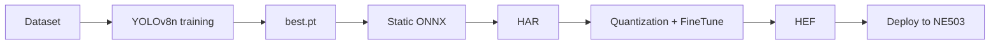

# HEF Model Compilation

This tutorial trains YOLOv8 on a dataset, exports a static-shape ONNX model, and compiles it with the Hailo Dataflow Compiler (DFC) into a `.hef` that runs on NE503. The example uses safety-helmet detection, but the same flow applies to custom vehicle, person, and PPE detectors.

**Look for a ready-made model first:** If you only need a downloadable model, start with the [CamThink Model Zoo](https://www.camthink.ai/developer-center/models/). Follow this tutorial only when no matching model exists or you need custom classes and data.

## 1. Overview

The model source determines whether you need the full training flow:

| Source | What to do |
|:---|:---|
| NE503 preloaded models or CamThink Model Zoo | Download and deploy according to the model instructions |
| Hailo Model Zoo | Prefer ONNX/HAR; standard-size HEFs such as 640×640 cannot be used directly on NE503 and must be recompiled with this flow |
| Custom model | Complete dataset preparation, training, ONNX export, quantization, compilation, and deployment |

NE503 preprocessing always produces **384(H)×640(W) NV12**, so the HEF input must be static NCHW `[1, 3, 384, 640]`. A mismatched size causes `byte_size mismatch`.

This tutorial uses two classes: `Helmet` and `No Helmet`, and produces `safety_helmet_yolov8n_384_640.hef`.

### End-to-end flow



## 2. Environment Preparation (CUDA)

### 2.1 Hardware and software

| Item | Requirement |
|:---|:---|
| GPU | NVIDIA GPU; ≥8 GB VRAM on a dedicated machine or ≥16 GB on a shared machine; example: Tesla T4 16G |
| CPU / RAM / storage | ≥4 cores / 16 GB / 50 GB; 8 cores / 30 GB recommended |
| Operating system | Ubuntu 22.04 |
| CUDA / Python | CUDA 12.x, Python 3.10+ |
| Python tools | PyTorch 2.x, ultralytics 8.4.75+, onnx, onnxslim |
| DFC | Hailo AI Software Suite v5.3.0, run through Docker |

DFC is distributed for `linux/amd64`; use a Linux x86_64 host or the corresponding Docker environment. Register at the [Hailo Developer Zone](https://hailo.ai/developer-zone/) and download the approximately 13 GB Software Suite. Match its version to the target device's NPU environment.

### 2.2 Create the training environment

```bash
mkdir -p ~/yolo-train/{weights,datasets,scripts,logs,runs}
python3 -m venv ~/yolo-train/venv
source ~/yolo-train/venv/bin/activate
pip install ultralytics torch torchvision onnx onnxslim

python -c "import torch; print('CUDA available:', torch.cuda.is_available())"
# Expected: CUDA available: True
```

## 3. Dataset Preparation

The example uses `Safety Helmet.v4-data160.yolov8` from Roboflow Universe. Search for “Safety Helmet” and download the YOLOv8 format from [Roboflow Universe](https://universe.roboflow.com/), or use the API:

```bash
pip install roboflow
```

```python
from roboflow import Roboflow

rf = Roboflow(api_key="<your API key>")
rf.workspace("<workspace>").project("safety-helmet").version(4).download("yolov8")
```

The directory should contain `train`, `valid`, and `test` splits (the example has 10,500 / 1,000 / 500 images). If you unpack it under `~/yolo-train/datasets/safety-helmet`, make it readable by the DFC container:

```bash
chmod -R a+rX ~/yolo-train/datasets/safety-helmet
```

Create `data.yaml`:

```yaml
path: ~/yolo-train/datasets/safety-helmet
train: train/images
val: valid/images
test: test/images

nc: 2
names: ["Helmet", "No Helmet"]
```

The order in `names` is the output class-ID order. The application can calculate `total people = Helmet + No Helmet` and `compliance rate = Helmet / total people`.

## 4. Model Training

### 4.1 Lock the input size

The device requires `[1, 3, 384, 640]`. Ultralytics 8.4.75 accepts only an integer `imgsz` for `train`, so this tutorial uses `imgsz=640` with `rect=True` to train on horizontal rectangles. Ultralytics 8.4.96+ can use `imgsz=(384, 640)` directly.

### 4.2 Training script

```python
import os
from ultralytics import YOLO

WEIGHTS = os.path.expanduser("~/yolo-train/weights/yolov8n.pt")
DATA = os.path.expanduser("~/yolo-train/datasets/safety-helmet/data.yaml")
PROJECT = os.path.expanduser("~/yolo-train/runs/helmet")

model = YOLO(WEIGHTS)
model.train(
    data=DATA,
    imgsz=640,
    rect=True,
    epochs=100,
    batch=8,          # use 4 or 2 if VRAM is insufficient
    patience=20,
    workers=4,
    project=PROJECT,
    name="yolov8n_640_rect",
    exist_ok=True,
)
```

After training, use `runs/helmet/yolov8n_640_rect/weights/best.pt`. Run it in the background with `tmux` if needed:

```bash
tmux new-session -d -s helmet-train \
  "source ~/yolo-train/venv/bin/activate && \
   python ~/yolo-train/scripts/train_helmet.py 2>&1 | tee ~/yolo-train/logs/helmet-train.log"
tail -f ~/yolo-train/logs/helmet-train.log
nvidia-smi
```

Reference result: Tesla T4, 100 epochs, batch 8, approximately 3.4 hours, with val mAP50 around 0.93. Training curve:


## 5. ONNX Export

```bash
yolo export model=~/yolo-train/runs/helmet/yolov8n_640_rect/weights/best.pt \
  format=onnx imgsz=384,640 opset=11 simplify=True dynamic=False
```

| Parameter | Requirement | Why |
|:---|:---|:---|
| `imgsz` | `384,640` | Matches the device input H×W |
| `opset` | `11` | Stable with Hailo DFC v5.3.0 |
| `simplify` | `True` | Simplifies the graph for the parser |
| `dynamic` | `False` | Hailo parser requires a static shape |

For the 2-class model, verify:

```text
Input:  name=images,  shape=[1, 3, 384, 640], dtype=float32
Output: name=output0, shape=[1, 6, 5040], dtype=float32
```

`6 = 4` bounding-box coordinates plus `2` class scores. `5040` is the total grid count across the three strides. You can also use [Netron](https://netron.app/) to confirm the static input and final detection-head Conv nodes.

## 6. Hailo HEF Quantization Compilation

The commands below target the 2-class model. If the class count changes, update `data.yaml`, the NMS `classes` value, and the application's class-name mapping together.

### 6.1 Prepare 2,048 calibration images

Generate an NHWC, float32, 0–255 calibration set in the training environment:

```python
import glob
import os
import numpy as np
from PIL import Image

TRAIN_DIR = os.path.expanduser("~/yolo-train/datasets/safety-helmet/train/images")
OUT = "/local/shared_with_docker/calib_2048.npy"
H, W, N = 384, 640, 2048

paths = sorted(glob.glob(os.path.join(TRAIN_DIR, "*.jpg")))[:N]
if len(paths) < N:
    raise RuntimeError(f"need {N} calibration images, found {len(paths)}")
arr = np.zeros((len(paths), H, W, 3), dtype=np.float32)
for i, path in enumerate(paths):
    image = Image.open(path).convert("RGB").resize((W, H))
    arr[i] = np.asarray(image, dtype=np.float32)
np.save(OUT, arr)
print(f"saved {OUT} shape={arr.shape}")
```

### 6.2 Parser: ONNX → HAR

Run inside the DFC container with the working directory mounted as `/local/shared_with_docker`:

```bash
echo n | hailo parser onnx safety_helmet_yolov8n_384_640.onnx \
  --hw-arch hailo15h \
  --end-node-names /model.22/cv2.0/cv2.0.2/Conv /model.22/cv3.0/cv3.0.2/Conv \
                   /model.22/cv2.1/cv2.1.2/Conv /model.22/cv3.1/cv3.1.2/Conv \
                   /model.22/cv2.2/cv2.2.2/Conv /model.22/cv3.2/cv3.2.2/Conv
```

The output is `safety_helmet_yolov8n_384_640.har`. `echo n` skips the interactive NMS prompt; NMS is injected by the `.alls` file in the next step.

### 6.3 Optimize: quantization + FineTune

```bash
hailo optimize safety_helmet_yolov8n_384_640.har \
  --model-script yolov8_2cls_ft.alls \
  --calib-set-path calib_2048.npy
```

`yolov8_2cls_ft.alls`:

```text
normalization1 = normalization([0.0, 0.0, 0.0], [255.0, 255.0, 255.0])
nms_postprocess("yolov8_2cls_nms_config.json", meta_arch=yolov8, engine=cpu)
post_quantization_optimization(finetune, policy=enabled, learning_rate=0.0001, epochs=8, dataset_size=2048)
allocator_param(enable_partial_row_buffers=disabled)
performance_param(optimize_for_power=True)
```

`normalization` divides inputs by 255, `nms_postprocess` bakes NMS into the HEF, and FineTune uses the unlabeled calibration set to recover post-quantization accuracy.

`yolov8_2cls_nms_config.json`:

```json
{
  "nms_scores_th": 0.2,
  "nms_iou_th": 0.6,
  "image_dims": [384, 640],
  "max_proposals_per_class": 100,
  "classes": 2,
  "regression_length": 16,
  "background_removal": false,
  "bbox_decoders": [
    {"name": "bbox_decoder41", "stride": 8, "reg_layer": "conv41", "cls_layer": "conv42"},
    {"name": "bbox_decoder52", "stride": 16, "reg_layer": "conv52", "cls_layer": "conv53"},
    {"name": "bbox_decoder62", "stride": 32, "reg_layer": "conv62", "cls_layer": "conv63"}
  ]
}
```

`classes` must equal the model class count. Class names are not stored in the HEF; the app maps class IDs using the order in `data.yaml`.

### 6.4 Compiler: HAR → HEF

```bash
hailo compiler safety_helmet_yolov8n_384_640_optimized.har --hw-arch hailo15h
```

Use `<task>_<network>_<H>_<W>.hef` for the filename, such as `safety_helmet_yolov8n_384_640.hef`. After deployment, the filename without `.hef` becomes the `model_id`.

### 6.5 Verify the compile artifact

```bash
hailo parse-hef safety_helmet_yolov8n_384_640.hef | grep -i "nms"
# Expected to include: yolov8_nms_postprocess HAILO NMS BY CLASS, Classes: 2

md5sum safety_helmet_yolov8n_384_640.hef
```

## 7. Deploy to NE503

### 7.1 Import through the Web Console (recommended)

Open the NE503 Web Console, go to **AI Models → Import**, and upload `safety_helmet_yolov8n_384_640.hef`.


Enter:

| Field | Value |
|:---|:---|
| Model ID | `safety_helmet_yolov8n_384_640` |
| Model Type | `hef` |
| Threshold | `0.3`; with `raw_output_only=True`, filtering is handled by the app |

After import, the model should be **Loaded**:


### 7.2 Deploy through the API (scripted)

```bash
scp safety_helmet_yolov8n_384_640.hef root@<device-ip>:/data/aipc/models/detection/

curl -k -X POST "https://<device-ip>/api/v1/ai/models/scan" \
  -H "Authorization: Bearer <token>"

curl -k -X POST "https://<device-ip>/api/v1/ai/models/safety_helmet_yolov8n_384_640/load" \
  -H "Authorization: Bearer <token>"
```

### 7.3 Verify the model and inference

Confirm **Loaded** in **AI Models**, or run:

```bash
aipc-cli model list
# or GET /api/v1/ai/models
```

For end-to-end testing, subscribe to `third` (the default inference stream) or `sub`, which publish raw frames. Do not use `main`, which publishes H.264 only. Custom models require `raw_output_only=True` and app-side NMS decoding; see [SDK Reference · custom models](../3-reference/1-sdk-reference.md#32-use-raw_output_only-only-for-raw-outputs).

Success means the model is **Loaded**, the app keeps receiving inference results, and the `Helmet` / `No Helmet` mapping matches the `data.yaml` order.

## 8. Appendix

### 8.1 Full artifact inventory

| Artifact | Purpose | Download |
|:---|:---|:---|
| `best.pt` | Best training weights | [Download](https://resources.camthink.ai/wiki/img/neoeyes-ne503-series/application-guide/app-development/model-training-and-hef/best.pt) |
| `safety_helmet_yolov8n_384_640.onnx` | Compilation input | [Download](https://resources.camthink.ai/wiki/img/neoeyes-ne503-series/application-guide/app-development/model-training-and-hef/safety_helmet_yolov8n_384_640.onnx) |
| `safety_helmet_yolov8n_384_640.hef` | Device deployment artifact | [Download](https://resources.camthink.ai/wiki/img/neoeyes-ne503-series/application-guide/app-development/model-training-and-hef/safety_helmet_yolov8n_384_640.hef) |
| `args.yaml` / `results.csv` | Training parameters and metrics | [args.yaml](https://resources.camthink.ai/wiki/img/neoeyes-ne503-series/application-guide/app-development/model-training-and-hef/args.yaml) / [results.csv](https://resources.camthink.ai/wiki/img/neoeyes-ne503-series/application-guide/app-development/model-training-and-hef/results.csv) |

### 8.2 References

- [Ultralytics YOLOv8 docs](https://docs.ultralytics.com/)
- [Hailo Developer Zone](https://hailo.ai/developer-zone/)
- [Roboflow Universe](https://universe.roboflow.com/)
- [Netron](https://netron.app/)

---

*Last updated: 2026-08-19*
