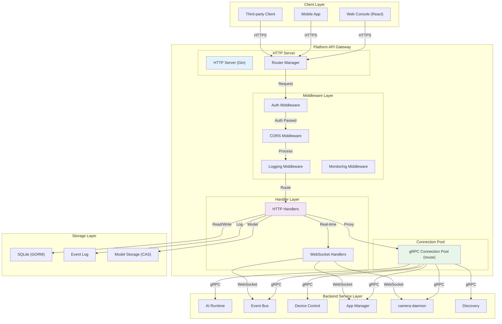

# RESTful API Reference

The Platform API is the HTTP gateway for the NE503. Built on Go + Gin, it proxies all backend gRPC services and supports WebSocket real-time communication (event streams, video streams, terminal, container logs). Tech stack: Go + Gin + gRPC Client + SQLite (GORM).



Request processing flow: client sends an HTTP request -> CORS handling -> logging -> authentication check -> route matching -> parameter validation -> permission check -> business logic (calls backend services via the gRPC connection pool) -> response wrapping. Gateway overhead is about 1-5 ms, backend service processing about 10-50 ms.

---

## 1. Overview

The Platform API is the HTTP gateway for the NE503. Built on Go + Gin, it uniformly proxies all backend gRPC services (AI Runtime, Event Bus, Device Control, App Manager, etc.) and supports WebSocket real-time communication (event streams, video streams, container logs, web terminal).

| Item | Description |
|:---|:---|
| Endpoint prefix | `/api/v1` |
| Base address | `http://<device_ip>:8080` |
| Swagger UI | `/swagger/` (interactive docs, try requests directly) |
| OpenAPI spec | `/api/v1/swagger.yaml` |
| Protocols | HTTP + WebSocket |
| Response format | JSON |

> The paths in the following sections omit the `/api/v1` prefix. When making real requests, prepend it to form the full path, e.g. `/api/v1/system/info`. The login endpoint `/api/login` is the exception — it stands outside this prefix.

---

## 2. Authentication

The Platform API **enables authentication by default**. Except for public endpoints, every request must carry a valid token or the API returns `401`.

**Log in to obtain a token:**

```bash
# The login endpoint is independent of the /api/v1 prefix
curl -X POST http://<device_ip>:8080/api/login \
  -H "Content-Type: application/json" \
  -d '{"username":"admin","password":"password"}'
```

```json
// Response
{"code":0,"message":"Success","data":{"token":"Bearer <token>","username":"admin"}}
```

> The default factory account is `admin` / password `password`. **Change it in production** (via `POST /system/password` or the `auth.username` / `auth.password` config fields). The returned token is a static Bearer key used directly as the credential for subsequent requests.

**Token transmission methods:**

| Method | Format | Applicable scenario |
|:---|:---|:---|
| HTTP Header | `Authorization: Bearer <token>` | REST API requests (recommended) |
| HTTP Header | `X-API-Key: <token>` | REST API requests |
| Query Parameter | `?token=<token>` | WebSocket connections (when the browser cannot customize headers) |

**Public endpoints (no authentication required):**

- `POST /api/login` — Log in
- `GET /system/health` — Health check

> Note: authentication is enabled by default from the factory. For third-party integration, you must first log in to obtain a token, then carry it when calling the remaining endpoints.

---
## 3. System Management

The system management endpoints handle device login authentication, system information queries, firmware upgrades (OTA), time and NTP configuration, and other low-level operations. They are aimed at integrators performing device management, health monitoring, and remote maintenance.

### 3.1 Login and System Information

| Method | Path | Description |
| --- | --- | --- |
| POST | `/login` | Submit username and password in exchange for a access token; the real address is `POST /api/login` (independent of the `/api/v1` prefix), a public endpoint requiring no authentication |
| GET | `/system/health` | Health check, a public endpoint requiring no authentication, commonly used for liveness probes |
| GET | `/system/info` | Get device system information (model, version, hardware, etc.) |
| GET | `/system/stats` | Get system runtime statistics (CPU, memory, disk, and other resource usage) |

Login is a prerequisite for calling other protected endpoints: after success, the returned Token must be sent in subsequent request headers as `Authorization: Bearer <token>`. The request body is JSON containing the two required fields `username` and `password`.

### 3.2 Password and Restart

| Method | Path | Description |
| --- | --- | --- |
| POST | `/system/password` | Change the backend login password |
| POST | `/system/restart` | Trigger a device system reboot |

The password-change request body is JSON and requires `old_password` (old password, optional) and `new_password` (new password, required). `/system/restart` has no request body; after calling it the device reboots, during which services are briefly unavailable — plan for reconnection and retry accordingly.

### 3.3 Firmware Upgrade (OTA)

| Method | Path | Description |
| --- | --- | --- |
| GET | `/system/ota/detect` | Check whether a new OTA firmware update is available |
| GET | `/system/ota/status` | Query current OTA upgrade progress and status |
| POST | `/system/ota/install` | Upload a firmware package and install it; the `multipart/form-data` field name is `firmware` |
| POST | `/system/ota/parse` | Parse firmware file information only, without performing the install; the `multipart/form-data` field name is `firmware` |
| POST | `/system/ota/install-from-path` | Install firmware from an absolute local path on the device (operations) |

Typical upgrade flow: first call `/system/ota/detect` to check for updates or `/system/ota/parse` to validate a local firmware package -> upload and install via `/system/ota/install` -> poll `/system/ota/status` to track progress. `install-from-path` takes a request body `{ "path": "<absolute path of the firmware file on the device>" }` and is intended for operations scenarios where firmware has already been pushed to the device; third-party integration generally only needs the upload approach.

### 3.4 Time Management

| Method | Path | Description |
| --- | --- | --- |
| GET | `/system/time` | Get the device's current system time |
| POST | `/system/time/set` | Manually set the system time |
| GET | `/system/time/config` | Get time configuration (whether NTP is enabled, NTP server, etc.) |
| PUT | `/system/time/timezone` | Set the device timezone |
| GET | `/system/time/timezones` | List the timezones the device supports |
| PUT | `/system/time/ntp` | Configure NTP settings (enable/disable, server address) |
| POST | `/system/time/ntp/sync` | Trigger an immediate NTP time synchronization |

The manual time-setting request body is `{ "datetime": "<RFC3339 timestamp>" }`, for example `2024-01-01T12:00:00Z`. The timezone-setting request body is `{ "timezone": "Asia/Shanghai" }`; you can first fetch valid values via `/system/time/timezones`. The NTP configuration request body is `{ "enabled": true, "server": "ntp.aliyun.com" }`; after enabling NTP, call `/system/time/ntp/sync` to synchronize once immediately instead of waiting for the next scheduled sync.

---

## 4. AI Models and Inference

This group of endpoints targets developers who need to manage inference models directly — registering, uploading, querying, and unloading model files (.hef, .onnx, .bin, .tflite, etc.) in the device AI runtime, and fetching overall runtime statistics. The application side typically does not call them directly; they are used during the model preparation phase.

### 4.1 Model Management

| Method | Path | Description |
| --- | --- | --- |
| GET | `/ai/models` | List all registered models |
| POST | `/ai/models` | Register a new model (pointing to an existing model file path on the device) |
| POST | `/ai/models/upload` | Upload a model file and automatically register it with the runtime |
| GET | `/ai/models/{model_id}` | Query detailed information for a specified model |
| DELETE | `/ai/models/{model_id}` | Unload (unregister) a specified model |
| GET | `/ai/models/{model_id}/apps` | Query the list of applications currently using this model |

Request body notes:

- `POST /ai/models`: JSON body; `model_path` is required (the absolute path of the model file on the device, e.g. `/data/aipc/models/yolov8n.hef`); the optional `model_id` customizes the model identifier — if omitted, the system generates one.
- `POST /ai/models/upload`: multipart/form-data upload; the required field is `model` (the model file itself; supports `.hef`, `.onnx`, `.bin`, `.tflite`); optional fields include `model_id`, `model_type` (hef/onnx/tflite), `variant`, `threshold` (detection threshold), `max_detections` (maximum detection count), and other inference parameters. Suitable when the model file is not yet on the device.

### 4.2 Runtime Statistics

| Method | Path | Description |
| --- | --- | --- |
| GET | `/ai/stats` | Get overall statistics of the AI runtime (number of registered models, load status, etc.) |

Before deleting a model, it is recommended to call `GET /ai/models/{model_id}/apps` first to confirm no application is referencing it, to avoid disrupting running inference tasks.

---

## 5. Application and Container Management

Manages AI applications running on the device and their underlying containers: install, start/stop, view logs and runtime status, and pull/delete container images. Aimed at third-party integrators who need to remotely deploy or operate their own applications.

### 5.1 Application Management

Applications are described by an `app.yaml` manifest; each application has a unique `app_id` and corresponds to one or more containers underneath.

| Method | Path | Description |
| --- | --- | --- |
| GET | `/apps` | List all installed applications |
| POST | `/apps` | Install an application per an `app.yaml` manifest |
| GET | `/apps/{app_id}` | View details of a specified application |
| DELETE | `/apps/{app_id}` | Uninstall a specified application; `keep_logs` can retain logs |
| POST | `/apps/{app_id}/start` | Start a specified application |
| POST | `/apps/{app_id}/stop` | Stop a specified application; `timeout` controls the graceful-shutdown wait |
| POST | `/apps/{app_id}/restart` | Restart a specified application |
| GET | `/apps/{app_id}/stats` | View application runtime statistics (CPU, memory, etc.) |
| GET | `/apps/{app_id}/logs` | View application logs; supports `max_lines` and `follow` |
| GET | `/apps/{app_id}/permissions` | View permissions granted to the application |
| POST | `/apps/wizard` | Quickly install an application via the wizard (provide app_id/name/image directly) |
| POST | `/apps/upload-image` | Upload a container image file to the device |

Differences between the two installation entry points:
- `POST /apps`: a complete `app.yaml` manifest already exists; request body `{ manifest_path, image_path? }`; `manifest_path` is required, `image_path` is optional (used for offline installation of a local image).
- `POST /apps/wizard`: no need to write a manifest in advance; request body `{ metadata: { id, name }, image, config? }` (the device actually requires `metadata.id`/`metadata.name` + a top-level `image`; slightly different from the spec annotation); `config` is an application-specific custom configuration object, suitable for third-party systems to quickly push an application.
- `POST /apps/upload-image`: multipart/form-data image-file upload, field name `file`, used for offline image import when the device has no internet access.

### 5.2 Container Management

Directly operates underlying containers (generally managed indirectly through the application layer; only used for troubleshooting or special scenarios).

| Method | Path | Description |
| --- | --- | --- |
| GET | `/containers` | List containers; supports filtering by `state` and `search`, plus pagination |
| GET | `/containers/{id}` | View container details |
| DELETE | `/containers/{id}` | Delete a specified container |
| GET | `/containers/{id}/stats` | View container resource usage |
| GET | `/containers/{id}/logs` | View container logs; `tail` controls the number of lines returned |
| GET | `/containers/{id}/logs/stream` | Push container logs in real time (SSE, `text/event-stream`) |
| POST | `/containers/{id}/start` | Start a container |
| POST | `/containers/{id}/stop` | Stop a container |
| POST | `/containers/{id}/restart` | Restart a container |

Common filter parameters for `GET /containers`: `state` takes `running`/`stopped`/`all`; `search` performs a fuzzy match by name; `page`/`page_size` paginate (defaults 1/20).

### 5.3 Container Images

| Method | Path | Description |
| --- | --- | --- |
| GET | `/images` | List local container images |
| POST | `/images/pull` | Pull an image from a registry; request body `{ image }` |
| DELETE | `/images/{image}` | Delete a local image |

### 5.4 Real-time Container Logs and Terminal (WebSocket)

Two WebSocket endpoints are used for real-time interaction. When connecting, pass the authentication token via the `token` query parameter:

| Method | Path | Description |
| --- | --- | --- |
| GET | `/containers/{id}/logs/ws` | Push container logs in real time (WebSocket); `tail` controls the initial line count |
| GET | `/containers/{id}/exec/ws` | Interactive container terminal (WebSocket); `cols`/`rows`/`command` can be specified |

`exec/ws` defaults to executing `/bin/sh` with a default terminal size of 80x24. It is generally used only for on-site debugging and is rarely used directly in third-party integration.

---

## 6. App Store

The Store is used to browse and search installable AI applications, and to manage records of applications installed on the device. Third-party integrators typically use the store endpoints to find a target application, trigger installation, then use the installation-management endpoints to query runtime status or uninstall. The paths below omit the `/api/v1` prefix.

### 6.1 Store Catalog

Browse the list of applications in the store along with their categories and tags.

| Method | Path | Description |
|------|------|------|
| GET | `/store/apps` | List applications in the store; supports filtering by category, keyword search, featured flag, and pagination |
| GET | `/store/apps/{key}` | Get details of a specified application (the path parameter `key` is the application's unique identifier) |
| GET | `/store/categories` | List application categories for filtering and navigation |
| GET | `/store/tags` | List application tags for multi-dimensional retrieval |

Common query parameters for `GET /store/apps`: `category` (category), `search` (keyword), `featured` (featured flag), `page` and `page_size` (pagination) — all optional.

### 6.2 Installation and Installed-Application Management

Install applications from the store and maintain the device's local installation records.

| Method | Path | Description |
|------|------|------|
| POST | `/store/apps/{key}/install` | Install the specified application from the store (`key` is the application identifier) |
| GET | `/store/installs` | List installed-application records on the device |
| POST | `/store/installs` | Create an installation record |
| GET | `/store/installs/{app_id}` | Get installation details for a specified installed application |
| PUT | `/store/installs/{app_id}` | Update the installation record for a specified application |
| DELETE | `/store/installs/{app_id}` | Delete the installation record for a specified application (uninstall and clean up the record) |

Request body notes:

- **`POST /store/apps/{key}/install`**: the optional request body can specify `version` (version number) and `config` (application initialization configuration object). Leave empty to use the store's default version and configuration.
- **`POST /store/installs`**: the request body must provide `app_id` and `name` (both required), with optional fields `version`, `image`, `store_app_id`, used to manually register an installation record.
- **`PUT /store/installs/{app_id}`**: used to write back installation status. Updatable fields include `status`, `container_id`, `pid`, `message`, and `config`, making it easy to track the container or process runtime.

Day-to-day third-party integration typically only needs `POST /store/apps/{key}/install` to trigger installation and `GET /store/installs/{app_id}` to poll status. The `POST/PUT/DELETE /store/installs` group is more low-level record maintenance and generally does not need to be called directly.

---

## 7. Device Control

This group is used to remotely control the NE503's hardware peripherals and lens, and to query/maintain basic device information. It is suitable for third-party platforms integrating fill lights, infrared night vision, PTZ zoom, and GPIO peripherals.

### 7.1 Device Status and Information

| Method | Path | Description |
| --- | --- | --- |
| GET | `/device/status` | Query the overall device runtime status |
| GET | `/device-info` | Get device information (model, version, name, etc.) |
| PUT | `/device-info` | Modify the device name |

### 7.2 Light Source and Night Vision

| Method | Path | Description |
| --- | --- | --- |
| POST | `/device/light` | Set white-light fill brightness (0-100) |
| POST | `/device/ir-led` | Toggle the infrared fill light on/off |
| POST | `/device/ir-cut` | Switch IR-CUT filter mode (auto/day/night) |

### 7.3 Lens and PTZ

| Method | Path | Description |
| --- | --- | --- |
| POST | `/device/ptz` | Unified PTZ and lens control (pan/tilt/zoom/focus/preset/stop) |
| POST | `/device/zoom` | Control zoom speed independently |
| POST | `/device/focus` | Control focus speed independently |
| POST | `/device/autofocus` | Toggle autofocus on/off |

### 7.4 GPIO

| Method | Path | Description |
| --- | --- | --- |
| POST | `/device/gpio` | Write the level value of a specified GPIO pin |
| GET | `/device/gpio/{pin}` | Read the level value of a specified GPIO pin |

**Request body notes**

- Light source: `/device/light` takes `level` (integer 0-100); `/device/ir-led` takes boolean `status`; `/device/ir-cut` takes `mode` (`auto`/`day`/`night`).
- The unified PTZ entry `/device/ptz` distinguishes actions via `action` (`pan`/`tilt`/`stop`/`preset`/`zoom`/`focus`), then pairs `direction`+`speed` (pan/tilt), `zoom_speed`/`focus_speed` (positive/negative indicates direction), or `preset_id` (1-255) according to the action. If you only need single zoom or focus control, you can also use `/device/zoom` or `/device/focus` directly — both take a single `speed` (-100 to 100; negative = zoom out/near focus, positive = zoom in/far focus).
- GPIO: when writing, pass `pin` (pin number) and boolean `value`; when reading, the pin number goes in the path parameter `{pin}`.
- Renaming the device: `PUT /device-info` takes `device_name`; only letters, digits, underscores, and hyphens are allowed.

---

## 8. Media and Video Streams

This group of interfaces is used to view the video stream list, subscribe to real-time H.264 video, and adjust low-level camera parameters (ISP image, encoder, RTSP, AI overlay, OSD subtitles, etc.). It is aimed at third-party integrators who need to do secondary video access or image tuning.

### 8.1 Video Stream Query and Real-time Subscription

| Method | Path | Description |
|------|------|------|
| GET | `/streams` | List the device's currently available video streams (encoding channels) and their basic information. |
| GET | `/streams/{stream_id}` | Query detailed information for a specified video stream (resolution, codec, frame rate, etc.). |
| GET | `/h264/{stream_id}` | Subscribe to the real-time H.264 raw bitstream of a specified stream; video frames are continuously pushed over WebSocket (WebSocket). |

### 8.2 Camera Configuration (Overall)

| Method | Path | Description |
|------|------|------|
| GET | `/media/config` | Read the full configuration of the camera daemon. |
| POST | `/media/config` | Update the daemon configuration by partial overlay and apply immediately; the request body only needs to include the fields to change. |

### 8.3 Image and Encoding

| Method | Path | Description |
|------|------|------|
| PUT | `/media/image` | Adjust ISP image parameters (brightness, contrast, saturation, sharpness; all in the range 0 to 100). |
| PUT | `/media/encoder` | Adjust the encoding parameters of a stream (bitrate, frame rate, GOP, etc.); `stream_name` must be specified. |
| PUT | `/media/encoder/reconfig` | Perform a full encoder rebuild on the specified stream (can change resolution, switch h264/h265 codec, bitrate, frame rate, GOP); a larger change than `/media/encoder` above. |

### 8.4 RTSP, Overlay, and OSD

| Method | Path | Description |
|------|------|------|
| PUT | `/media/rtsp` | Enable or disable the device's built-in RTSP service (request body `{ "enabled": true/false }`). |
| PUT | `/media/ai-overlay` | Configure the AI detection result overlay (enable/disable, whether to show labels/confidence, line thickness). |
| PUT | `/media/osd` | Configure on-screen display (OSD); supports adding text and timestamp overlays per stream, with configurable position, font size, color, and enable flag. |

### 8.5 Key Request Body Notes

- `PUT /media/image`: takes the four integers `brightness`/`contrast`/`saturation`/`sharpness`, each in the range 0 to 100; only send the fields you need to adjust.
- `PUT /media/encoder` and `PUT /media/encoder/reconfig`: must include `stream_name` to target a stream. The former does lightweight parameter tweaks (`bitrate_bps`/`framerate`/`gop`); the latter does a full rebuild and can change `width` (64-4096), `height` (64-2160), `codec` (`h264` or `h265`), `fps`, etc. — it is more expensive and is suitable when you need to switch codec format or resolution.
- `POST /media/config`: a partial overlay of the overall configuration; the request body is a JSON object containing any subset of fields, suitable for batch pushes without worrying about each dedicated endpoint.

### 8.6 Usage Suggestions

For third-party real-time preview, first call `GET /streams` to get the available stream IDs, then establish a WebSocket via `GET /h264/{stream_id}` to pull the H.264 raw bitstream and decode/play it yourself. If you prefer to go through a standard protocol, call `PUT /media/rtsp` to enable the built-in RTSP service and pull the stream with any RTSP player. Frame overlays (detection results, timestamp watermarks) are done on the device side via the `ai-overlay` and `osd` interfaces — the client does not need to draw them itself.

---

## 9. Event Bus and Event Logs

This group of resources is aimed at third-party integrators who need to receive device real-time events or retrieve historical event records: the Event Bus provides a publish/subscribe-style real-time event channel, while Event Logs persist events generated during device operation for conditional retrieval and statistics.

### 9.1 Event Bus

The Event Bus is centered on topics. Integrators can subscribe to topics of interest and actively publish events, suitable for real-time linkage (for example, receiving an immediate push after a target is detected).

| Method | Path | Description |
|------|------|------|
| GET | `/events/topics` | List all current event topics and their subscriber counts. |
| POST | `/events/publish` | Publish an event to a specified topic; the message is distributed to all current subscribers. |
| GET | `/events/stream` | Subscribe to a real-time event stream; after the connection is upgraded to WebSocket, events are pushed continuously (WebSocket). |

Request body and connection notes:

- The `POST /events/publish` request body requires `topic` (e.g. `app/detection/result`) and can additionally carry an arbitrary-structure `payload` object as the event content.
- `GET /events/stream` is a WebSocket endpoint. The connection address looks like `ws://<device_ip>:8080/api/v1/events/stream?token=<token>`; the Token obtained at login must be passed in via the `token` query parameter for authentication.

### 9.2 Event Logs

Event Logs persistently archive historical events, supporting filtering and paginated queries by category, level, and time range, and providing aggregate statistics for troubleshooting or integration with external monitoring systems.

| Method | Path | Description |
|------|------|------|
| GET | `/event-logs` | Filter and paginate event logs by category, level, time range, and keyword. |
| POST | `/event-logs` | Write an event log entry, for the system or integrators to proactively record key events. |
| DELETE | `/event-logs` | Clean up historical logs by retention days to free up storage. |
| GET | `/event-logs/statistics` | Get aggregate statistics for event logs (e.g. counts per level/category). |

Key parameter notes:

- `GET /event-logs` supported query parameters include: `category` (category), `level` (level), `start_time` / `end_time` (time range, ISO 8601 format), `search` (keyword search), as well as `limit` (page size, max 1000, default 50) and `offset` (pagination offset, default 0). The response includes a `total` field alongside the `entries` list for pagination calculation.
- The `POST /event-logs` request body requires `event_type`, `source`, and `message`; optional fields include `level`, `category`, `user`, and an arbitrary-structure `data` extension field.
- The `DELETE /event-logs` request body requires `days` (retention days, range 1-365); logs older than this number of days are purged. This operation is operations-oriented; third-party integration generally only needs query and statistics.

---

## 10. System Monitoring, Storage, and Network

This group is used to query device runtime status (CPU, memory, disk, network), manage attached storage devices, and view and modify network configuration. It is suitable for third-party integrators building operations monitoring dashboards or performing remote maintenance.

### 10.1 System Resource Monitoring

Query the device's current resource usage. All are read-only GET endpoints, usable for health checks and load inspection.

| Method | Path | Description |
|------|------|------|
| GET | `/monitor/summary` | Get a system resource overview (a summary view of key indicators such as CPU, memory, and disk) |
| GET | `/monitor/cpu` | Get CPU usage details |
| GET | `/monitor/memory` | Get memory and swap usage |
| GET | `/monitor/disk` | Get the usage of each disk partition |
| GET | `/monitor/network` | Get send/receive traffic statistics for network interfaces |

### 10.2 Storage Management

List available disks and partitions, and perform mount, unmount, and format operations on block devices. Request body notes for mutating operations:

| Method | Path | Description |
|------|------|------|
| GET | `/storage/disks` | List currently available disks and their partition information |
| POST | `/storage/mount` | Mount a block device to a specified directory |
| POST | `/storage/unmount` | Unmount a previously mounted disk |
| POST | `/storage/format` | Format a disk with a specified file system |

- Mount (`/storage/mount`): provide `device` (e.g. `/dev/sda1`) and the mount target `target` (e.g. `/mnt/sda1`); `device` is required.
- Unmount (`/storage/unmount`): only the previously mounted `target` path is required.
- Format (`/storage/format`): provide `device` and specify the file system type via `fstype` (supports `ext4`, `vfat`, `fat32`). **This operation erases all data on the target device — confirm the device path carefully beforehand.**

### 10.3 Network Configuration

Query or modify network interface configuration, and switch between DHCP and static IP modes.

| Method | Path | Description |
|------|------|------|
| GET | `/network/config` | Get the current network configuration (IP, subnet mask, gateway, DNS, etc.) |
| POST | `/network/config` | Update the network configuration (switch DHCP/static IP, set IP and gateway, etc.) |
| GET | `/network/interfaces` | List all network interfaces |

The `/network/config` request body uses a `NetworkConfig` structure to describe a complete configuration. Key fields: `interface` (interface name, e.g. `eth0`), `mode` (`dhcp` or `static`), and under static mode `ip_address`, `subnet_mask`, `gateway`, `dns1`/`dns2`; `mac_address` is a read-only field returned only by the query endpoint.

> Note: switching network modes or modifying the IP/gateway may briefly disconnect the device. Confirm the configuration is correct before calling, and have a reconnection or on-site recovery plan in place.

---

## 11. Files, Logs, and Processes

This group of interfaces constitutes the device's built-in web operations workbench. Aimed at development and troubleshooting scenarios, it provides read/write management of the device file system, viewing and control of running processes, search and download of system logs, and a web terminal based on WebSocket. It is overall for internal/debug use; third-party business integration generally does not need it, and it is only involved when remotely troubleshooting or collecting diagnostic information. Among them, operations such as file deletion, process signals, and the terminal carry high privileges — use them with extra care.

### 11.1 Process Management

| Method | Path | Description |
|------|------|------|
| GET | `/processes` | List the device's currently running processes; supports sorting by CPU, memory, or PID, and can limit the number of entries returned (internal/debug) |
| GET | `/processes/{pid}` | Query detailed information for a specified process (internal/debug) |
| POST | `/processes/{pid}/kill` | Send a signal to a specified process; supports `SIGTERM`/`SIGKILL`/`SIGINT`/`SIGHUP`, default `SIGTERM` (internal/debug) |

The `kill` endpoint takes the signal via the `signal` query parameter; the PID is a path parameter. Confirm the target process before calling — `SIGKILL` terminates forcibly and cannot be recovered.

### 11.2 File Management

| Method | Path | Description |
|------|------|------|
| GET | `/files` | List the contents of a specified directory; default path is `/data/aipc` (internal/debug) |
| DELETE | `/files` | Delete a specified file or directory; `path` is a required query parameter (internal/debug) |
| GET | `/files/content` | Read the contents of a specified file (internal/debug) |
| POST | `/files/content` | Write text content to a specified file; the request body contains `path` and `content` (internal/debug) |
| POST | `/files/upload` | Upload a file to the device (internal/debug) |
| GET | `/files/download` | Download a specified file on the device (internal/debug) |
| POST | `/files/mkdir` | Create a new directory; the request body contains `path` (internal/debug) |
| POST | `/files/rename` | Rename or move a file/directory; the request body contains `old_path` and `new_path` (internal/debug) |
| POST | `/files/batch-download` | Package multiple files into a ZIP for batch download; the request body is a file list (internal/debug) |
| POST | `/files/batch-delete` | Batch-delete files; the request body is a file list (internal/debug) |

Write-type endpoints (write content, upload, rename, batch delete, etc.) all take parameters via a JSON request body. Deletes and batch deletes are irreversible — verify the path before calling.

### 11.3 Logs

| Method | Path | Description |
|------|------|------|
| GET | `/logs/services` | Return the list of system services whose logs can be queried (internal/debug) |
| GET | `/logs/files` | Return the list of readable log files on the device (internal/debug) |
| GET | `/logs/content` | Read log contents; locate by `type` (`service` or `file`) and `target`; returns the most recent 500 lines by default (internal/debug) |
| GET | `/logs/download` | Download a complete log file or a service's journal (internal/debug) |
| GET | `/logs/stream/ws` | Push a log stream in real time (WebSocket); authentication via the `token` query parameter is required (internal/debug) |

When `type=service`, `target` is a service name (use with `/logs/services`); when `type=file`, `target` is a file path (use with `/logs/files`).

### 11.4 Web Terminal

| Method | Path | Description |
|------|------|------|
| GET | `/terminal/ws` | Web terminal session; send and receive commands via WebSocket, equivalent to opening a shell on the device (WebSocket, internal/debug) |

This endpoint provides full command-line interaction with permissions equivalent to a root shell. Use it only in trusted debugging scenarios.

---

## 12. SSH, Settings, and Debug Logs

This group targets device operations and troubleshooting scenarios: remotely manage the SSH service, read/write custom key-value configuration, and export system and service logs on demand, for operations staff or third-party integration platforms to perform security hardening, parameter tuning, and fault localization.

### 12.1 SSH Management

| Method | Path | Description |
|------|------|------|
| GET | `/ssh/config` | Query the current SSH service configuration (port, authentication method, etc.). |
| POST | `/ssh/config` | Update the SSH configuration (port, whether root login is allowed, password/key authentication toggles, etc.). |
| GET | `/ssh/status` | View the SSH service runtime status. |
| GET | `/ssh/logs` | Get SSH login records for security auditing. |

When updating the configuration (POST /ssh/config), the request body is an object whose main fields are:

- `port`: the SSH listening port (string, e.g. `"22"`).
- `permit_root_login`: whether root login is allowed; options `yes`, `no`, `prohibit-password`.
- `password_authentication` / `pubkey_authentication`: password authentication and key authentication toggles; values `yes` / `no`.
- `max_auth_tries`: maximum number of authentication attempts (string, e.g. `"3"`).
- `restart_service`: whether to automatically restart the SSH service after saving to apply the configuration; defaults to `false`. Setting it to `true` briefly interrupts existing connections — confirm before calling.

### 12.2 System Settings

A generic key-value configuration store that can be used to persist custom parameters (such as business configuration like detection thresholds). Reads and writes are done per key as a whole.

| Method | Path | Description |
|------|------|------|
| GET | `/settings` | Get all custom settings. |
| POST | `/settings` | Add or update a settings entry (write `value` by `key`). |
| DELETE | `/settings/{key}` | Delete a specified settings entry by key. |

The write request body is an object containing `key` (required, the setting name) and `value` (the value in string form), for example `{"key":"detection_threshold","value":"0.75"}`.

### 12.3 Debug Logs

Used for troubleshooting: first query the list of available systemd services and log files, then package and export them as tar.gz on demand for analysis. (internal/debug)

| Method | Path | Description |
|------|------|------|
| GET | `/debug-logs/services` | List systemd services whose logs can be exported. (internal/debug) |
| GET | `/debug-logs/files` | List selectable log files. (internal/debug) |
| POST | `/debug-logs/export` | Package and export the selected services and files as logs (tar.gz). (internal/debug) |

Export request body (DebugLogExportRequest) notes:

- `services`: array of systemd service names to include.
- `files`: array of log file paths to include.
- `lines`: number of lines to capture per service log; range 1-50000, default 10000.

---

## 13. Development Workbench

This group of endpoints serves the device's built-in online development workbench (Web IDE), used to create projects on the device, upload source code, edit files, and trigger builds. It is for internal/debug use; third-party business integration typically does not use it and it is generally only called by the device's own development console front-end.

| Method | Path | Description |
| --- | --- | --- |
| GET | `/dev/base-images` | List available development base images (internal/debug) |
| GET | `/dev/projects` | List all development projects (internal/debug) |
| POST | `/dev/projects` | Create a new development project (internal/debug) |
| GET | `/dev/projects/{id}` | Get details of a specified project (internal/debug) |
| PUT | `/dev/projects/{id}` | Update a specified project's configuration (internal/debug) |
| DELETE | `/dev/projects/{id}` | Delete a specified project (internal/debug) |
| POST | `/dev/projects/{id}/upload` | Upload a single file to a project (internal/debug) |
| POST | `/dev/projects/{id}/source` | Upload a source archive and import it into a project (internal/debug) |
| GET | `/dev/projects/{id}/files` | List the file tree under a specified path within a project (internal/debug) |
| GET | `/dev/projects/{id}/file` | Read the contents of a file within a project (internal/debug) |
| POST | `/dev/projects/{id}/file` | Save (write) the contents of a file within a project (internal/debug) |
| GET | `/dev/projects/{id}/builds` | List the project's historical build records (internal/debug) |
| POST | `/dev/projects/{id}/build` | Trigger a new build for the project (internal/debug) |

> Note: the above endpoints are internal interfaces served for the development workbench front-end. Their behavior and availability may change with firmware versions, and they are not recommended for direct use in third-party integration or production flows. To deploy or update applications on the device, prefer the official endpoints described in the "Application Management" and "AI Models and Inference" sections of this guide.

---

## 14. Response Format

All API responses use a unified JSON envelope.

**Success response:**

```json
{
  "code": 0,
  "message": "Success",
  "data": { ... }
}
```

**Error response:**

```json
{
  "code": 2000,
  "message": "Unauthorized",
  "error": {
    "detail": "Invalid or missing authentication token",
    "type": "auth"
  }
}
```

| Field | Type | Description |
|:---|:---|:---|
| `code` | int | `0` indicates success; non-zero indicates an error |
| `message` | string | Status description |
| `data` | object | Response data on success (absent on error) |
| `error` | object | Details on error (present only for business errors like 401/1001; routing 404 omits it; absent on success) |
| `error.detail` | string | Human-readable error description |
| `error.type` | string | Error category (e.g. `auth`) |

Common error codes: `1001` invalid request format, `2000` authentication failure, `3002` internal error, `4000` resource not found, `404` route does not exist.

---

## 15. WebSocket Interfaces

All WebSocket endpoints pass the authentication token via `?token=<token>`.

| Path | Purpose | Data direction |
|:---|:---|:---|
| `/events/stream` | Event stream real-time push | Server -> Client |
| `/h264/{stream_id}` | H.264 video stream push | Server -> Client |
| `/containers/{id}/logs/ws` | Container log real-time stream | Server -> Client |
| `/containers/{id}/exec/ws` | Container terminal interaction | Bidirectional |
| `/terminal/ws` | Web terminal (SSH) | Bidirectional |
| `/logs/stream/ws` | Service log real-time stream | Server -> Client |

---

## 16. Service Configuration

<!-- Verified: from the real device /data/aipc/etc/platform-api.yaml -->

| Config item | Actual value | Description |
|:---|:---|:---|
| `service.http_addr` | `:8080` | HTTP listen address |
| `service.log_level` | `debug` | Log level |
| `auth.enabled` | `true` | Authentication enabled by default |
| `auth.username` / `auth.password` | `admin` / `password` | Default login credentials (must change in production) |
| `web.enable_cors` | `true` | Enable CORS |
| `stream.rtsp_base_url` | `rtsp://localhost:8554` | RTSP stream base URL |
| `stream.encoded_pub_dir` | `/run/aipc/encoded` | H.264 encoded frame publish directory |
| `storage.root_path` | `/data/aipc` | Platform root directory |
| `storage.model_blob_path` | `/data/aipc/models/blobs` | Model file storage path |
| `database.path` | `/data/aipc/data/platform.db` | SQLite database path |

Backend gRPC services connect via Unix Domain Sockets; the socket files are located under the `/run/aipc/` directory (observed to include `ai-runtime.sock`, `app-manager.sock`, `camera.sock`, `camera-control.sock`, `device-control.sock`, `device-discovery.sock`, `event-bus.sock`). The connection pool supports automatic reconnection and resource reclamation.

---

## 17. Related Documentation

- [Platform Architecture](../../3-software-guide/0-system-architecture.md) — NE503 four-layer architecture and service dependencies
- [Application Development](../1-app-development/reference/1-app-reference.md) — Container application development reference
- [SDK Reference](../1-app-development/reference/2-sdk-reference.md) — Complete Python SDK API reference
- [Platform Services Overview](../../3-software-guide/4-reference/0-platform-services.md) — Service responsibilities and source pointers
- [Video Integration](./1-video-integration.md) — RTSP video stream integration in practice
- [Event Integration](./2-event-integration.md) — Event Bus integration in practice
