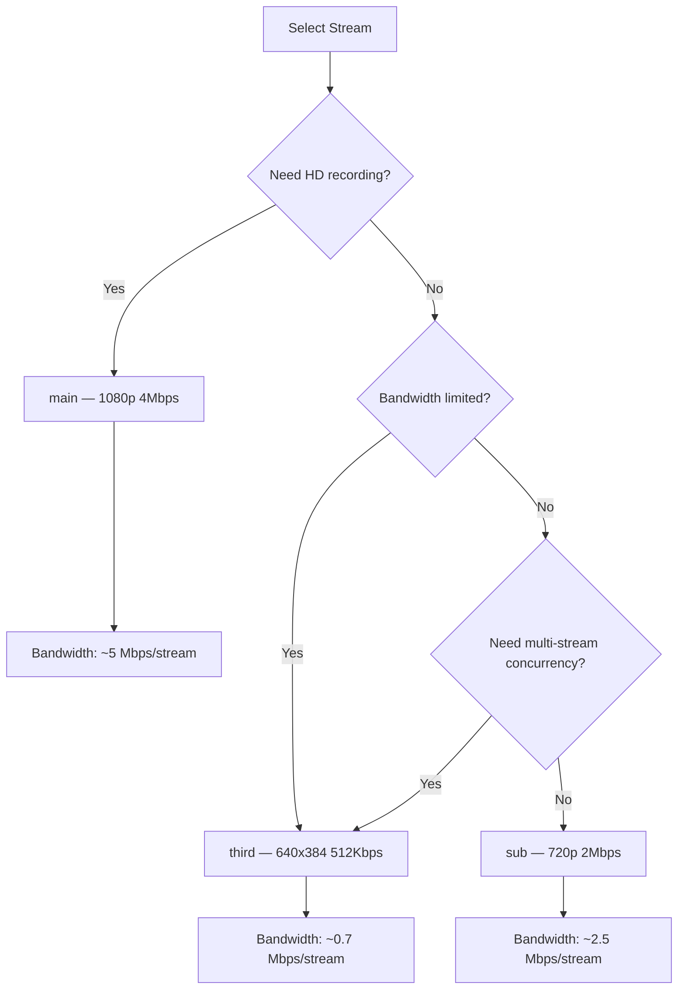

# Video Integration

NE503 outputs an H.264 video stream via the RTSP protocol, supporting TCP interleaved transport with end-to-end latency under 100 ms. This document targets third-party developers who need to integrate the NE503 video stream into their own systems, providing a complete solution from stream pulling, recording, and transcoding to NVR/VMS integration.

## 1. Stream Overview

### 1.1 Three-Stream Parameters

NE503 provides three independently encoded H.264 streams with the following parameters:

| Parameter | Main Stream (main) | Sub Stream (sub) | Third Stream (third) |
|------|-------------|-------------|---------------|
| Resolution | 1920x1080 | 1280x720 | 640x384 |
| Frame rate | 30 fps | 30 fps | 15 fps |
| Bitrate | 4 Mbps | 2 Mbps | 512 Kbps |
| GOP | 30 (1s) | 60 (2s) | 30 (2s) |
| Profile | High 4.1 | High | Main |
| Codec | H.264 | H.264 | H.264 |

> The values above are factory defaults. You can hot-update the bitrate, frame rate, and GOP at runtime via the Platform API `PUT /media/encoder` endpoint, with no device reboot required.

### 1.2 RTSP URL Format

```
rtsp://<DEVICE_IP>:8554/{main,sub,third}
```

| Stream | URL | Typical Use |
|------|-----|---------|
| Main stream | `rtsp://192.168.1.100:8554/main` | HD recording, large-screen display |
| Sub stream | `rtsp://192.168.1.100:8554/sub` | Multi-channel preview, medium-quality recording |
| Third stream | `rtsp://192.168.1.100:8554/third` | Mobile devices, AI analysis, low-bandwidth scenarios |

> NE503 mandates **RTSP over TCP** (RTP/AVP/TCP interleaved transport) and does not support UDP transport mode. All stream-pulling commands must specify TCP transport.

## 2. FFmpeg Integration

### 2.1 Basic Stream-Pulling Verification

```bash
# Verify that the stream is available (play for 10 seconds, no actual output)
ffmpeg -rtsp_transport tcp -i "rtsp://192.168.1.100:8554/main" \
  -t 10 -f null -
```

### 2.2 Stream Pulling and Recording

```bash
# Record the main stream directly (no transcoding, keep raw H.264)
ffmpeg -rtsp_transport tcp -i "rtsp://192.168.1.100:8554/main" \
  -c copy -f mp4 recording_main.mp4

# Record the sub stream as MKV (supports resuming after stream interruption; MKV container is more fault-tolerant)
ffmpeg -rtsp_transport tcp -i "rtsp://192.168.1.100:8554/sub" \
  -c copy -f matroska recording_sub.mkv
```

### 2.3 Transcoded Output

```bash
# Transcode to 720p H.264 for web distribution
ffmpeg -rtsp_transport tcp -i "rtsp://192.168.1.100:8554/main" \
  -vf scale=1280:720 -c:v libx264 -preset fast -crf 23 \
  -f mp4 output_720p.mp4

# Transcode to H.265 to save storage space
ffmpeg -rtsp_transport tcp -i "rtsp://192.168.1.100:8554/main" \
  -c:v libx265 -preset medium -crf 28 \
  -f mp4 output_h265.mp4
```

### 2.4 Scheduled Frame Capture

```bash
# Capture one frame every 5 seconds and save as JPEG
ffmpeg -rtsp_transport tcp -i "rtsp://192.168.1.100:8554/sub" \
  -vf fps=1/5 -q:v 2 snapshot_%04d.jpg

# Single-frame snapshot
ffmpeg -rtsp_transport tcp -i "rtsp://192.168.1.100:8554/main" \
  -frames:v 1 capture.jpg
```

### 2.5 Concurrent Multi-Stream Pulling

```bash
# Pull three streams concurrently and save them separately
ffmpeg -rtsp_transport tcp -i "rtsp://192.168.1.100:8554/main" \
       -rtsp_transport tcp -i "rtsp://192.168.1.100:8554/sub" \
       -rtsp_transport tcp -i "rtsp://192.168.1.100:8554/third" \
  -map 0:v -c copy recording_main.mp4 \
  -map 1:v -c copy recording_sub.mp4 \
  -map 2:v -c copy recording_third.mp4
```

### 2.6 Convert to HLS for Web Playback

```bash
# Convert RTSP to HLS segments, suitable for web frontend playback
ffmpeg -rtsp_transport tcp -i "rtsp://192.168.1.100:8554/sub" \
  -c:v libx264 -preset veryfast -tune zerolatency \
  -hls_time 2 -hls_list_size 3 -hls_flags delete_segments \
  -f hls stream.m3u8
```

## 3. GStreamer Pipeline

### 3.1 Basic Stream-Pulling Pipeline

```bash
# Pull the main stream and display it
gst-launch-1.0 rtspsrc location=rtsp://192.168.1.100:8554/main \
  protocols=tcp latency=0 ! \
  rtph264depay ! h264parse ! avdec_h264 ! autovideosink

# Pull the sub stream and save it as MP4
gst-launch-1.0 rtspsrc location=rtsp://192.168.1.100:8554/sub \
  protocols=tcp latency=0 ! \
  rtph264depay ! h264parse ! mp4mux ! filesink location=output.mp4
```

### 3.2 Hardware-Accelerated Transcoding (x86 Servers)

On servers with NVIDIA GPUs, you can leverage NVDEC hardware decoding:

```bash
# NVIDIA hardware decoding + transcoded output
gst-launch-1.0 rtspsrc location=rtsp://192.168.1.100:8554/main \
  protocols=tcp latency=0 ! \
  rtph264depay ! nvh264dec ! \
  videoconvert ! x264enc tune=zerolatency ! \
  mp4mux ! filesink location=output_hw.mp4
```

> On ARM platforms, use the corresponding hardware decoding plugin (e.g., `v4l2h264dec`), depending on the target platform's multimedia framework.

### 3.3 Capture Frames for AI Inference

```python
import gi
gi.require_version('Gst', '1.0')
from gi.repository import Gst, GLib

Gst.init(None)

PIPELINE = (
    "rtspsrc location=rtsp://192.168.1.100:8554/third protocols=tcp latency=0 ! "
    "rtph264depay ! decodebin ! videoconvert ! video/x-raw,format=RGB ! "
    "appsink name=sink emit-signals=True max-buffers=2 drop=True"
)

def on_new_sample(sink):
    sample = sink.emit("pull-sample")
    buffer = sample.get_buffer()
    caps = sample.get_caps()
    w = caps.get_structure(0).get_int("width")[1]
    h = caps.get_structure(0).get_int("height")[1]
    success, info = buffer.map(Gst.MapFlags.READ)
    if success:
        import numpy as np
        frame = np.frombuffer(info.data, dtype=np.uint8).reshape(h, w, 3)
        # Perform AI inference here
        buffer.unmap(info)
    return Gst.FlowReturn.OK

pipeline = Gst.parse_launch(PIPELINE)
sink = pipeline.get_by_name("sink")
sink.connect("new-sample", on_new_sample)
pipeline.set_state(Gst.State.PLAYING)

loop = GLib.MainLoop()
try:
    loop.run()
except KeyboardInterrupt:
    pipeline.set_state(Gst.State.NULL)
```

## 4. VMS Integration

### 4.1 Generic NVR / ONVIF Integration

The current NE503 release focuses on RTSP integration and does not provide ONVIF device discovery. Steps for generic NVR integration:

1. In the NVR, choose "Add device manually" or "Custom RTSP"
2. Fill in the RTSP address: `rtsp://<DEVICE_IP>:8554/main`
3. Select **TCP** as the transport protocol
4. Choose the stream as needed: use `main` for NVR recording and `sub` for multi-view preview

## 5. Multi-Client Concurrency and Bandwidth Planning

### 5.1 Concurrency Limits

The NE503 RTSP service supports up to **8 concurrent clients** (shared across all streams). Each stream can be pulled independently by multiple clients simultaneously.

| Scenario | Recommended Stream | Concurrency | Notes |
|------|---------|--------|------|
| NVR recording + live preview | main + sub | 2 | Main stream for recording, sub stream for preview |
| Multi-view monitoring wall | sub or third | Depends on view count | Use sub for 4 views or fewer, third for more |
| AI analysis + recording | third + main | 2 | Third stream for analysis saves bandwidth |
| Mobile remote viewing | third | 1 | Low bitrate suits cellular networks |

### 5.2 Bandwidth Estimation

| Stream | Bitrate | Single-Stream Bandwidth | 4 Concurrent Streams |
|------|------|---------|------------|
| main | 4 Mbps | ~5 Mbps (incl. overhead) | ~20 Mbps |
| sub | 2 Mbps | ~2.5 Mbps | ~10 Mbps |
| third | 512 Kbps | ~700 Kbps | ~2.8 Mbps |

> RTSP over TCP interleaved transport overhead is approximately 10-25%, so actual bandwidth requirements are higher than the encoded bitrate.

### 5.3 Stream Selection Recommendation



## 6. Related Documentation

- [Quick Start](../../1-quick-start.md) — RTSP stream verification and VLC playback
- [RESTful API](../../4-application-guide/2-3rd-party-integration/0-restful-api.md) — Media stream API endpoints (stream start/stop, parameter adjustment)
- [Platform Services Overview](../../3-software-guide/4-reference/0-platform-services.md) — Responsibilities and source pointers for services such as Camera Daemon
- [Troubleshooting](../../3-software-guide/4-reference/1-troubleshooting.md) — Common RTSP stream-pulling issues and solutions
