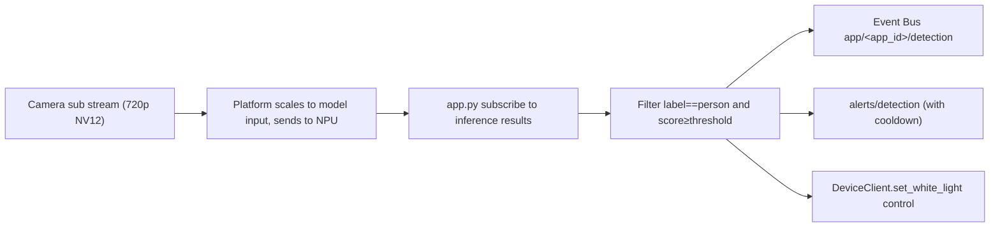

# Person Detection

This recipe uses the Person Detection example from `camthink-ai/neoruntime-apps` to walk through a single-model edge AI app end to end: from model and video stream discovery, `app.yaml` permission declaration, building the image and deploying to the device, to verifying detection is actually running via logs and the event bus — plus device light control.

> **Verification record**: The results in this recipe come from NE503 test device `192.168.93.50`, last verified in August 2026 (for firmware and background, see the record in [Parking Lot](./0-parking-lot.md)). Findings: after startup the app continuously received `sub` stream inference results; when a person was in frame, `Detected 1 person(s)` kept refreshing and `avg_persons≈1.0`; `app/person-detection/detection` events were received via `aipc-cli event subscribe` (with bbox/confidence); memory footprint ~33 MB. Light-control联动 depends on a physical fill light, which the test device did not have connected, so it was not verified end to end.

## 1. Goal

After completing this recipe, you can:

- Look up the real model ID and video stream name on the device and fill them correctly into `app.py` and `app.yaml`;
- Build an arm64 image with the repo's unified script and package it for deployment;
- Receive detection events via the `app/person-detection/detection` and `alerts/detection` topics;
- Use logs, statistics lines, and event subscription to confirm the inference loop is actually running — not just that the container started.

This is a reproducible project recipe, not a general API reference for the SDK. For the full API of each client, all `app.yaml` fields, and auth formats, see [Reference](../3-reference/1-sdk-reference.md).

:::tip Skip the build, try it now
Don't want to build the image yourself? Download the prebuilt package [person-detection.tar](https://resources.camthink.ai/wiki/img/neoeyes-ne503-series/application-guide/app-development/person-detection/person-detection.tar), unzip it to get `app.yaml` and `image.tar`, and deploy to the device per §5.
:::

## 2. Model & Data Flow

### 2.1 Models Used

The app uses a single preloaded model — no self-registration needed:

| Model | Source | Purpose |
|:--|:--|:--|
| `hailo_yolov8n_384_640` | Preloaded (`/data/aipc/models/`) | YOLOv8n, COCO 80 classes; takes `person` detections |

The model ID must be confirmed on the device first (§2.3); names may differ across firmware versions.

### 2.2 From Video to Event



Key difference: **inference must use the `sub` stream**. `sub` publishes raw NV12 frames; `main` is a 4K H264 encoded stream used only for RTSP pull — `subscribe(stream="main")` hangs forever with no error and no timeout.

| Stream | Resolution | Frame format | Inference |
|:--|:--|:--|:--|
| `sub` | 720p | Raw NV12 | ✅ Usable for inference |
| `main` | 4K | Encoded H264 | ❌ RTSP pull only |

:::note Keep resolution close to model input
The model input resolution should be as close as possible to the subscribed stream's resolution. If they differ, the platform still preprocesses (resize), but this adds overhead and can hurt accuracy when the ratio is extreme. Adjust the `sub` stream resolution in the web console to match the model input (e.g. 640×384).
:::

### 2.3 Query Real Values on the Device

The model name in `app.py`'s `subscribe(model=...)` and the stream name in `app.yaml`'s `permissions.video` **must use the device's real values** — a wrong value fails with `StatusCode.NOT_FOUND`.

**Query models** (device model files live in `/data/aipc/models/`; scan and load to NPU before first use):

```bash
TOKEN="Bearer <token>"   # obtain via /api/login with default creds admin/password

# 1. Scan the model directory and register .hef files
curl -k -X POST https://<deviceIP>/api/v1/ai/models/scan -H "Authorization: $TOKEN"

# 2. Load a specific model onto the NPU (required before inference)
curl -k -X POST https://<deviceIP>/api/v1/ai/models/hailo_yolov8n_384_640/load -H "Authorization: $TOKEN"

# 3. List available models and confirm the model_id
curl -k https://<deviceIP>/api/v1/ai/models -H "Authorization: $TOKEN"
```

**Query streams** (no dedicated curl endpoint; the SDK is the most direct way):

```python
from hailo_ipc_sdk import FdMediaClient as MediaClient
print(MediaClient().list_streams())   # → ['main', 'sub']
```

Where to fill the values:

| File | Field | Value |
|:--|:--|:--|
| `app.py` | `subscribe(stream=...)` | `sub` |
| `app.yaml` | `permissions.video` | `[sub.raw]` |
| `app.py` | `subscribe(model=...)` | The `model_id` found in §2.3 (e.g. `hailo_yolov8n_384_640`) |
| `app.yaml` | `permissions.inference.models` | Same `model_id` |

## 3. Configuration

:::info Prerequisite: get the example project
This recipe is based on the full example in the **neoruntime-apps** repo. Clone it and the SDK repo into the same parent directory (the build script pulls the SDK from the sibling `neoruntime-sdks` by default), then enter the app directory:

```bash
git clone https://github.com/camthink-ai/neoruntime-sdks.git
git clone https://github.com/camthink-ai/neoruntime-apps.git
cd neoruntime-apps/examples/person-detection
```

The directory already contains everything this recipe needs: `app.py` (main logic), `app.yaml` (manifest), `Dockerfile`, `requirements.txt` (the legacy `build.sh` targets the old single-repo layout — ignore it). Building uses the repo-root `scripts/build_app.sh` (see §5.1).
:::

### 3.1 Application Manifest (app.yaml)

The app must declare its required permissions in `app.yaml`; the platform uses this for container isolation and sandboxing. Person Detection declares: video stream `sub.raw`, model `hailo_yolov8n_384_640`, event publish/subscribe topics, and device light control.

```yaml
# AIPC Platform Application Manifest
apiVersion: v1
kind: Application

metadata:
  id: person-detection
  name: Person Detection
  version: 1.0.0
  description: Real-time person detection with AI inference and event publishing
  author: AIPC Team

spec:
  image: aipc/person-detection:1.0.0

  resources:
    cpu: "50%"
    memory: "256Mi"

  permissions:
    video:
      - sub.raw                       # stream publishing raw NV12 frames (main only emits H264, cannot subscribe for inference)
    inference:
      models:
        - hailo_yolov8n_384_640        # must match a loaded model on the device
      max_qps: 30
      max_concurrent: 2
      allow_register_model: false
    events:
      publish:
        - app/person-detection/*
        - alerts/detection
      subscribe:
        - system/*
        - model/*/detections
    device:
      light: true                     # fill-light linkage
      ir_cut: true
    network:
      mode: isolated                  # container network isolation (no external network)

  # Environment variables read by app.py via os.environ
  env:
    - name: DETECTION_THRESHOLD
      value: "0.3"                    # person confidence threshold; objects below this score are ignored
    - name: ALERT_COOLDOWN_SECONDS
      value: "5"                      # minimum interval (seconds) between alerts/detection events
    - name: LOG_LEVEL
      value: "INFO"                   # log level: DEBUG / INFO / WARNING / ERROR

  volumes:
    - host: /data/aipc/data/person-detection
      container: /app/data
      readonly: false
    - host: /data/aipc/logs/person-detection
      container: /app/logs
      readonly: false

  autostart: false
  restart_policy: on-failure
  restart_max_retries: 3

  healthcheck:
    enabled: true
    interval: 30s
    timeout: 5s
    retries: 3
```

> The declarative permission model means **the app can only access the resources listed here inside the sandbox**. Any stream, model, event topic, or device control not declared will be rejected by the platform at call time. For the full field reference, see [App Reference](../3-reference/0-app-reference.md).

### 3.2 Runtime Parameters

| Env var | Default | Effect |
|:--|:--|:--|
| `DETECTION_THRESHOLD` | 0.2 (`app.py`) / 0.3 (manifest) | person confidence threshold; lower detects more but increases false positives, higher the opposite |
| `ALERT_COOLDOWN_SECONDS` | 5 | minimum interval for `alerts/detection`; smaller means denser events, cloud consumer must be idempotent |
| `LOG_LEVEL` | INFO | set to DEBUG when troubleshooting to see light-control failures and other details |

## 4. Core Code

### 4.1 Main Logic (app.py)

The app does five things: initialize SDK clients → subscribe to `sub` stream inference results → filter by `DETECTION_THRESHOLD` for person → publish structured detection results to the event bus → trigger the fill light when a person is detected; it also listens for SIGTERM for graceful shutdown. The full source is the repo's `examples/person-detection/app.py`; key excerpts:

```python
#!/usr/bin/env python3
"""Person Detection Application for AIPC Platform"""
import os, sys, time, signal, logging
from datetime import datetime
from typing import Optional

from hailo_ipc_sdk import (
    InferenceClient, EventClient, DeviceClient,
    FdMediaClient as MediaClient, Config, InferenceResult,
)

class PersonDetectionApp:
    def __init__(self):
        self.running = True
        self.app_id = Config.get_app_id()
        self.detection_threshold = float(os.environ.get('DETECTION_THRESHOLD', '0.2'))
        self.alert_cooldown = int(os.environ.get('ALERT_COOLDOWN_SECONDS', '5'))
        self.last_alert_time = 0
        # ... state counters (frame_count / total_detections / person_count_history)
        signal.signal(signal.SIGINT, self._signal_handler)
        signal.signal(signal.SIGTERM, self._signal_handler)

    def initialize(self) -> bool:
        self.inference = InferenceClient()
        models = self.inference.list_models()
        if not any(m.model_id == "hailo_yolov8n_384_640" for m in models):
            logger.warning("Required model 'hailo_yolov8n_384_640' NOT found")
        self.events = EventClient()
        # DeviceClient / MediaClient failures do not block startup
        # (light control and stream discovery are optional capabilities)
        ...

    def run(self):
        if not self.initialize():
            self._cleanup(); return 1
        for frame_seq, result in self.inference.subscribe(
            stream="sub",                    # must be sub; main hangs forever
            model="hailo_yolov8n_384_640",
            fps=10,
        ):
            if not self.running:
                break
            self._process_frame(frame_seq, result)
        self._cleanup(); return 0

    def _process_frame(self, frame_seq: int, result: InferenceResult):
        persons = [
            obj for obj in result.objects
            if obj.label == "person" and obj.score >= self.detection_threshold
        ]
        self._publish_detection_event(frame_seq, result, persons)
        if persons and self.device:
            self._trigger_light()          # device.set_white_light(50)

    def _publish_detection_event(self, frame_seq, result, persons):
        self.events.publish(f"app/{self.app_id}/detection", {
            "app_id": self.app_id, "frame_sequence": frame_seq,
            "person_count": len(persons),
            "objects": [{
                "label": obj.label, "confidence": round(obj.score, 3),
                "bbox": {"x": round(obj.bbox.x, 3), "y": round(obj.bbox.y, 3),
                          "width": round(obj.bbox.width, 3), "height": round(obj.bbox.height, 3)},
            } for obj in persons],
        })
        # alerts/detection fires at most once per cooldown window
        ...
```

Key logic map (where to look when adjusting model/stream/threshold):

| Module | Location | Notes |
|:--|:--|:--|
| Config reading | `__init__` | `DETECTION_THRESHOLD`, `ALERT_COOLDOWN_SECONDS` read from env vars; actual values injected by `app.yaml`'s `env` |
| Model/stream discovery | `initialize` | `list_models()` / `list_streams()` print real device values and validate them |
| Inference subscription | `run` | `subscribe(stream="sub", fps=10)` — **stream must be sub** |
| Detection filter | `_process_frame` | keeps only `label == "person"` and `score >= threshold` |
| Event publish | `_publish_detection_event` | publishes `app/<app_id>/detection` every frame; `alerts/detection` at most once per cooldown |
| Light control | `_trigger_light` | `set_white_light(50)` (50% brightness) when a person is detected |
| Graceful shutdown | `_signal_handler` / `_cleanup` | SIGTERM sets `running=False`; after the loop exits, all clients close |

### 4.2 Build File (Dockerfile)

Based on `python:3.11-slim-bookworm`: install system deps, install the SDK locally into the image, then app deps, and run as a non-root user:

```dockerfile
FROM python:3.11-slim-bookworm

RUN apt-get update && apt-get install -y --no-install-recommends \
    bash curl procps libglib2.0-0 libsm6 libxext6 libxrender-dev \
    && rm -rf /var/lib/apt/lists/*

WORKDIR /app

# Local SDK install (copied in by the build script before build)
COPY hailo_ipc_sdk/ /app/hailo_ipc_sdk/
COPY setup.py README.md /app/
RUN pip install --no-cache-dir -e .

COPY app.py /app/app.py
COPY requirements.txt /app/requirements.txt
RUN pip install --no-cache-dir -r requirements.txt

RUN useradd -m -u 1000 appuser && chown -R appuser:appuser /app
RUN mkdir -p /app/data /app/logs && chown -R appuser:appuser /app/data /app/logs

ENV APP_ID=person-detection
ENV PYTHONUNBUFFERED=1
ENV LOG_LEVEL=INFO

HEALTHCHECK --interval=30s --timeout=5s --start-period=10s --retries=3 \
    CMD python3 -c "from hailo_ipc_sdk import InferenceClient; c = InferenceClient(); c.close()" || exit 1

USER appuser
CMD ["python3", "/app/app.py"]
```

`requirements.txt` is just `numpy>=1.21.0` (the SDK already bundles protobuf/grpc).

:::note Why does the Dockerfile install the SDK locally?
The device container runtime has no external network, so the SDK must travel with the image. The build script copies `neoruntime-sdks/python/hailo_ipc_sdk/` into the app directory before build; the Dockerfile's `COPY hailo_ipc_sdk/` bakes it in, then `pip install -e .` installs it locally.
:::

## 5. Deployment

### 5.1 Build & Package

The repo's unified build script `scripts/build_app.sh` does "build image → export → package" in one step:

```bash
cd neoruntime-apps
# must use arm64: the device is aarch64; an x86_64 image cannot be imported
./scripts/build_app.sh examples/person-detection --arch arm64
```

| Step | Action | Notes |
|:--|:--|:--|
| 1 | Copy SDK | copies `hailo_ipc_sdk/`, `setup.py`, `README.md` from sibling `neoruntime-sdks/python/` into the app directory |
| 2 | Build image | `docker buildx build --platform linux/arm64` produces `aipc/person-detection:1.0.0` |
| 3 | Export image | `docker save` exports `image.tar` |
| 4 | Package | `zip` bundles `app.yaml` + `image.tar` into `person-detection.aipc` |
| 5 | Cleanup | removes the SDK files from step 1 and the intermediate `image.tar`, keeping only `person-detection.aipc` (~97 MB) |

:::warning Unzip before deploying
Step 5 deletes `image.tar`, but deployment needs both `app.yaml` and `image.tar` as separate files. Run `unzip -o person-detection.aipc` before deploying.
:::

### 5.2 Install

```bash
cd neoruntime-apps/examples/person-detection
unzip -o person-detection.aipc      # extracts app.yaml + image.tar
```

Pick one of three deployment methods:

- **Web console upload (recommended)**: open the web console → **App Management** → **Import** → choose **Upload Package** → upload `app.yaml` and `image.tar` separately → click **Install**. Fully graphical, no SSH.
- **aipc-cli (alternative)**: once SSH'd in, copy both files to the device and run `aipc-cli app install app.yaml image.tar`.
- **HTTP two-step upload (alternative)**: log in for a token → `upload-image` (`image.tar`) → `upload-manifest` (`app.yaml`) → `install-package` → poll `install-progress/<task_id>` until `phase=complete`.

### 5.3 Start

After deployment the app is in Stopped state and must be started manually. In the web console go to **App Management** and click **Start** on the Person Detection card (or `POST /api/v1/apps/person-detection/start`). The status badge should switch from Stopped to Running within seconds.

:::tip First start times out?
On first start after a fresh deploy, the platform needs to load the image into the container runtime and may exceed the 10s API timeout, returning `code:6002 DeadlineExceeded`. This is not an error — call start again and it will succeed.
:::

## 6. Verification

### 6.1 Verify App Status & Permissions

Open the web console → **Applications**; Person Detection is **Running** with ~33 MB memory:


Click **Person Detection** to open details. The **Permissions & Resources** area shows the permissions the platform injected per `app.yaml` — video stream sub.raw, model hailo_yolov8n_384_640 (QPS 30), event publish/subscribe topics, device light control. This proves the app **only has the permissions it declared** inside the sandbox:


### 6.2 Verify the Inference Loop (Logs)

**Option 1: Web Logs live stream** — in **Applications**, click the app's **Logs** button and open the **Live Stream** panel to see container stdout/stderr scrolling in real time:


**Option 2: HTTP API to fetch recent logs**:

```bash
curl -k "https://<deviceIP>/api/v1/apps/person-detection/logs?max_lines=15" -H "Authorization: Bearer <token>"
```

```
[INFO] Available models: ['hailo_yolov8n_384_640']
[INFO] Available video streams: ['main', 'sub']
[INFO] Subscribing to stream 'sub' with model 'hailo_yolov8n_384_640'
[INFO] Received first inference result - frame 1
[INFO] [Frame 142] Detected 1 person(s)
[INFO] Statistics: frames=200, detections=198, avg_persons=1.00
```

If `detections` grows with frames and `avg_persons` is close to the actual number of people in frame, the inference loop is really running.

### 6.3 Verify Event Output

The app packages each detection's confidence, bbox, and count into a structured JSON published to the event bus. Subscribe on the device:

```bash
aipc-cli event subscribe 'app/person-detection/*'
```

```json
{"app_id":"person-detection","frame_sequence":142,"person_count":1,
 "timestamp_ns":1755417536000000000,"timestamp_iso":"2026-08-17T14:38:56.000123",
 "total_frames_processed":142,"total_detections":118,
 "objects":[{"label":"person","confidence":0.879,
   "bbox":{"x":0.31,"y":0.22,"width":0.27,"height":0.61}}]}
```

Events arriving continuously with `person_count` matching the frame means end-to-end verification is complete. For external consumption via WebSocket/MQTT, see [Event Integration](../3-reference/5-event-integration.md).

## 7. Common Errors

| Symptom | Check first | Fix |
|:--|:--|:--|
| App stuck waiting for inference results, no error | is `subscribe(stream=...)` mistakenly `main`? | change to `sub`; main is an H264 encoded stream and subscribing hangs forever |
| Startup or inference fails with `StatusCode.NOT_FOUND` | do model ID / stream name match the device's real values? | use §2.3 to query `list_models()` / `list_streams()` and fill the real values into both `app.py` and `app.yaml` |
| Model not loaded, no inference results | has the model been loaded onto the NPU? | `POST /api/v1/ai/models/<model_id>/load`, then restart the app |
| Web Logs reports `no log file found for container ...` | is the device root partition full? | check with `df -h /`; `truncate -s 0 /data/aipc/logs/*.log` to clean up, then reinstall the app |
| First start returns `code:6002` timeout | is this the first start after deploy? | normal timeout while the platform loads the image; call start once more |
| Logs look fine but no events received | is the subscribed topic within `permissions.events.publish`? | subscribe with the `app/person-detection/*` wildcard; cross-sandbox consumption goes via the WebSocket/MQTT channels in [Event Integration](../3-reference/5-event-integration.md) |
| Image import fails | was `--arch` set to arm64 at build time? | the device is aarch64; rebuild with `--arch arm64` |

## 8. Related Docs

- [SDK Workflow](../1-app-development/0-sdk-workflow.md) — SDK calling patterns and the permission model
- [App Reference](../3-reference/0-app-reference.md) — full `app.yaml` permissions, lifecycle, and container constraints
- [SDK Reference](../3-reference/1-sdk-reference.md) — field-by-field API for each client
- [Parking Lot](./0-parking-lot.md) — an advanced Cookbook project with multiple models and a web UI
- [Troubleshooting FAQ](../../5-troubleshooting.md) — app and container issue troubleshooting

---

**Doc version**: v1.1 · **Last updated**: 2026-08-19