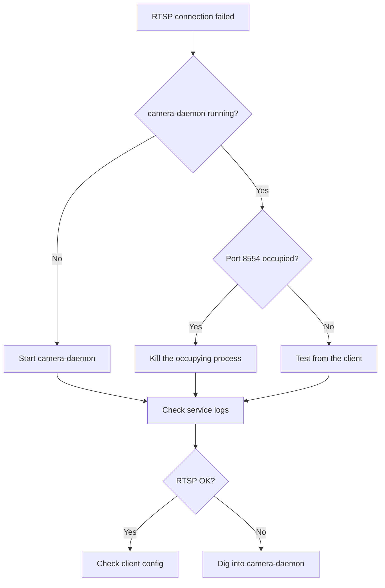
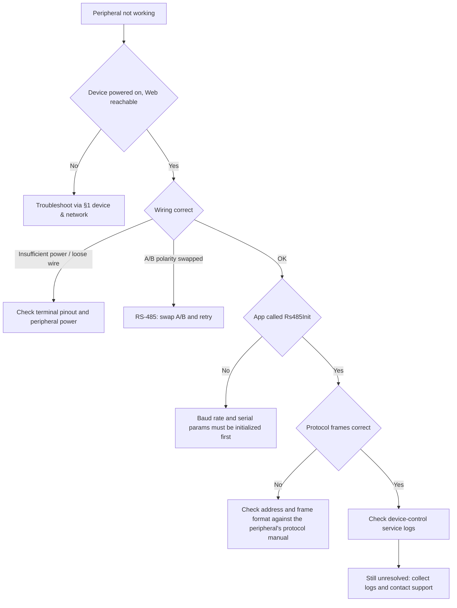
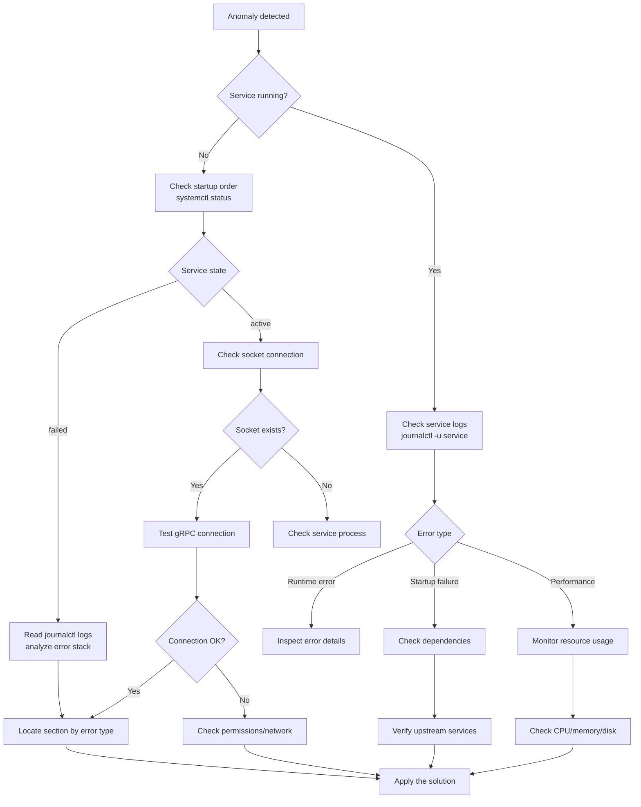
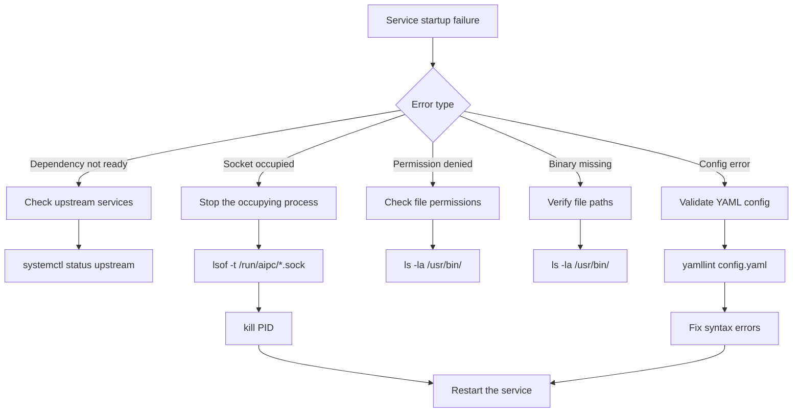

# Troubleshooting

This page organizes common problems **by symptom**. Each entry starts with the most direct "symptom → cause → quick fix"; dig into the diagnostic commands and details below it when needed.

- Field operators and admins: start from §1–§7 by symptom; the "quick fix" is usually enough.
- App developers: focus on §2–§5 (video streams, AI models, app containers, event integrations).
- Platform operators and developers: §8 is the system-service deep-dive (systemd, sockets, journalctl, performance monitoring).
- Error codes and command reference: see Appendix A / B at the end.

## 1. Device & Network

### 1.1 Cannot Access the Web Console

**Symptom**: The device web page does not open in the browser.

**Quick checks**:

1. Confirm the computer is on the same subnet as the device (default `10.0.0.x`).
2. `ping <device_ip>` to confirm connectivity.
3. If the device uses DHCP, check the IP assigned by the router.
4. Make sure the browser uses `https://` (not `http://`) and accepts the self-signed certificate warning.
5. Still failing: log in via SSH and check service status with `aipc-cli system health`.

**Diagnostic commands**:

```bash
# SSH login (test devices default to root/root)
ssh root@<device_ip>
aipc-cli system health

# Confirm platform-api is listening
systemctl status platform-api
```

### 1.2 Forgotten Web Password

**Symptom**: The web console password is forgotten.

**Fix**:

- If you can still log in: change it under Device Info → **Change Password**, or call `POST /api/v1/system/password`.
- If the default credentials (`admin` / `password`) are unchanged, log in with them and change the password immediately.
- If the password was changed and forgotten: `aipc-cli` has **no** password-reset command (verified across all 16 command modules). Contact technical support or reflash the firmware.

> The device currently has no "factory reset" feature (no endpoint in the API); reflashing the firmware is the equivalent.

### 1.3 Lens Control Malfunction

**Symptom**: Focus, zoom, or iris control is unresponsive or behaves abnormally.

**Cause**: Lens motor failure or an issue in the HAL control path.

**Diagnostic commands**:

```bash
# Get lens status
grpcurl -plaintext -d '{}' unix:///run/aipc/device-control.sock aipc.device.DeviceControl/GetLensStatus

# Reset lens zero point
grpcurl -plaintext -d '{}' unix:///run/aipc/device-control.sock aipc.device.DeviceControl/LensResetZero
```

The full gRPC interface is defined in `platform/device-control/proto/device.proto` in the source repo.

### 1.4 Serial / RS-485 Communication Failure

**Symptom**: External RS-485 devices (PTZ, sensors) get no response.

**Know the target first**: the external RS-485 baud rate is set by your app via `Rs485Init` and has nothing to do with the internal MCU host-link. `/dev/ttyS0 @ 921600` is the **internal** communication serial port between the core board and the interface-board MCU — not a peripheral interface.

**Troubleshooting**: see [§7.4 Alarm Input / Wiegand / RS-485](#74-alarm-input--wiegand--rs-485-runtime-issues).

### 1.5 Browser Compatibility & Fallback

| Browser | Minimum | Support | Known issues | Workaround |
|--------|---------|----------|---------|---------|
| Chrome | 88+ | Full | -- | -- |
| Firefox | 78+ | Basic | No WebCodecs | Use MSE playback |
| Safari | 14+ | Partial | No WebCodecs | Falls back to MSE |
| Edge | 88+ | Full | -- | -- |
| Mobile browsers | -- | Limited | Performance issues | Use a desktop browser |

Chrome 88+ or Edge 88+ is recommended. Safari automatically falls back to MSE with slightly lower performance.

### 1.6 WebSocket Failures at the Access Layer

Web preview and API rely on WebSocket to carry H.264 frames.

| Symptom | Possible cause | Fix |
|------|---------|---------|
| WebSocket 1006 | Abnormal closure | Check platform-api is running and the firewall allows port 443 |
| WebSocket 401/403 | Invalid or expired token | Log in again to get a new token |
| Black screen | WebSocket not established / SPS-PPS not received | Refresh the page and check the WebSocket state |
| Artifacts / mosaic | Packet loss / decoder incompatibility | Switch browser or check network quality |
| High latency | Network latency / oversized buffer | Ensure LAN bandwidth; reduce the encoding GOP |

> Web preview uses MJPEG by default; the root cause of HD preview black screens is that platform-api binds only `127.0.0.1:8080` at the factory — HD preview points the browser at `ws://<IP>:8080/...`, unreachable from outside, with no MJPEG fallback when H.264 fails. Verified fix: set the app environment variable `HD_PREVIEW_ENABLED=0` (falls back to MJPEG preview); HD can become the default again once the platform exposes the H.264 stream through nginx `wss://`. See each app's preview configuration.

## 2. Video & Streams

### 2.1 RTSP Pull Failure

**Symptom**: An external player or puller cannot connect to RTSP, or connects without video.

**Quick checks**:

1. Confirm the pulling side is on the same subnet as the device.
2. Confirm the device IP has not changed (DHCP may reassign).
3. `aipc-cli stream list` to confirm the stream is enabled and RTSP is on.
4. Verify the URL: `rtsp://<device_ip>:8554/main`, default port 8554.
5. Check whether the firewall allows port 8554.

**Diagnostic flow**:



**Diagnostic commands**:

```bash
# Check RTSP service status
systemctl status camera-daemon

# View RTSP logs
journalctl -u camera-daemon -f

# Test the RTSP connection (replace <device-ip> with the actual device IP)
ffmpeg -rtsp_transport tcp -i rtsp://<device-ip>:8554/main -t 10 -f null -
```

> RTSP on `:8554` currently has **no authentication** — any client that can reach the device can pull the stream. Isolate at the network layer in production.

### 2.2 WebSocket Disconnections at the Integration Layer

**Symptom**: Third-party systems integrating the video stream see frequent WebSocket disconnects.

**Cause**: Client timeouts, server errors, or network fluctuations.

**Diagnostic commands**:

```bash
# View WebSocket connection logs
journalctl -u platform-api | grep -i "websocket\|h264"

# Test the WebSocket connection (add --no-check for the self-signed certificate)
wscat --no-check -c wss://<device_ip>/api/v1/h264/main
```

For client-side reconnection strategies see [Video Integration](./4-application-guide/3-reference/4-video-integration.md).

### 2.3 Stuck in SIMULATION Mode with No Detections

**Symptom**: The app log shows `Running in SIMULATION mode - no actual inference` and detections stay at 0.

**Cause**: This is the SDK's graceful degradation when it cannot get a real video stream — **not an app bug**. The root cause is usually camera-daemon not running.

**Diagnostic commands**:

```bash
ssh root@<device_ip> "systemctl status camera-daemon"
# If activating(auto-restart): inspect the crash reason
ssh root@<device_ip> "journalctl -u camera-daemon -n 20 --no-pager"
# Typical root cause: dlopen(/data/aipc/lib/hal/hal-hailo15.so) failed = firmware missing the HAL library; reflash an image with HAL
```

On a device with a working camera, the same app outputs real detections.

## 3. AI & Models

### 3.1 Model Imported but No Detections

**Symptom**: The model is imported, the app runs normally, but no detection/inference results appear.

**Five-step check** (in order):

1. **Is the model Loaded?** — Check the Models page or `aipc-cli model list`. An unloaded model never infers; load it with `POST /api/v1/ai/models/<id>/load`.
2. **Does the app have permission for the model?** — `app.yaml` `permissions.models` must declare the model id.
3. **Is the threshold too high?** — Lower the threshold in the Detail dialog and retry.
4. **Does the input size match?** — The platform preprocessing output is fixed at 384×640 NV12 (see §3.4).
5. **Is the stream enabled and authorized?** — `permissions.streams` must include a stream that publishes raw frames: `third` (the default inference stream) or `sub`; `main` publishes encoded H.264 only and never yields results.

> Model loading has explicit REST endpoints: `POST /ai/models/{id}/load` (load onto the NPU) and `POST /ai/models/scan` (scan the model library into the DB). The standard deployment path is "place the HEF in `/data/aipc/models/<category>/` → scan → load".

### 3.2 Inference Reports Model Not Found

**Symptom**: Inference subscription reports `StatusCode.NOT_FOUND: Model not found`, or app-manager logs `requires model X, but not found`.

**Cause**: Hard-coded model or stream names in `app.py` / `app.yaml` that don't match the device.

**Fix**: Query the real names first, then fill them back in.

```python
from hailo_ipc_sdk import InferenceClient, FdMediaClient
print(InferenceClient().list_models())   # e.g. ['hailo_yolov8n_384_640']
print(FdMediaClient().list_streams())    # e.g. ['main', 'sub']
```

You can also confirm via API:

```bash
curl -k https://<device_ip>/api/v1/ai/models -H "Authorization: Bearer <token>"
```

### 3.3 Zero Detections from a High Threshold

**Symptom**: Model loaded, stream working, but detection count is 0.

**Cause**: The confidence threshold in `app.yaml` or app code is higher than the model's actual output distribution.

**Fix**: Lower the threshold (e.g. 0.1) to confirm detections appear, then raise it to a usable level.

### 3.4 Input Size Mismatch

**Symptom**: Inference reports `byte_size mismatch` or garbled results.

**Cause**: The platform preprocessing output is fixed at **384×640 NV12**; the model input must match. Mismatched models (e.g. some CLIP/OCR models) cannot run end-to-end — a platform limitation, not an app bug.

**Fix**: Use a HEF matching 384×640 (e.g. `hailo_yolov8n_384_640.hef`).

### 3.5 Inference running but zero frames / zero events (no errors in logs)

**Symptom**: Model is Loaded, app is Running, and ai-runtime's NPU worker looks active — but the app gets zero frames and zero events, with no errors anywhere in the logs.

**Cause**: The model registration is attached to a dead container session — ai-runtime keeps inferring but results are never delivered back. The SDK on the app side **silently swallows** failed responses (no logging), so neither side shows an anomaly.

**Diagnosis** (two steps):

1. Watch the app's status heartbeat log — normally one entry per 50 frames; none at all means results are not coming back (do not trust an active ai-runtime worker alone; that does not mean results are delivered).
2. strace is the only window that exposes inference failures:

```bash
strace -f -p $(pidof ai-runtime) -e trace=sendmsg -s 200 2>&1 | grep "Inference failed"
```

Continuous `Inference failed: -2814`-style output means the inference service itself is failing (combined with stopping the service and running `hailortcli run -t 5 <hef>` directly, you can bisect "NPU/firmware layer vs ai-runtime software stack" — if the direct run is fine, it's an ai-runtime issue).

**Fix**: Restart ai-runtime, then re-register/load the model (`POST /ai/models/scan` → `POST /ai/models/{id}/load`), then start the app.

## 4. Apps & Containers

### 4.1 App Installation Failure

**Symptom**: `aipc-cli app install` or package upload fails.

**Three root causes**:

- **Image pull**: network unreachable or registry unavailable.
- **Manifest parsing**: `app.yaml` syntax error.
- **Permission**: the running user must be in the `aipc` group.

**Diagnostic commands**:

```bash
# Watch installation logs (manifest errors and image import failures show here)
journalctl -u app-manager -f

# Pre-check app.yaml syntax locally
yamllint app.yaml
```

> The old single-file upload API (`curl -F app=@.aipc`) is deprecated; use the two-step flow: upload-image + upload-manifest + install-package.

### 4.2 Container Startup Failure

**Symptom**: The app is installed but exits immediately after `start` or keeps restarting.

**Quick checks**:

1. `aipc-cli app logs <id>` for error logs.
2. Check resources (Dashboard memory / storage).
3. If image pull fails, check internet connectivity.
4. Incorrect Permissions (e.g. the app needs a stream but is not authorized) also fail startup.

**Diagnostic commands**:

```bash
journalctl -u app-manager | grep -i "container"
free -h
df -h
systemd-cgtop
systemctl status containerd
```

The container sandbox has security restrictions (dropped capabilities, seccomp, read-only rootfs, etc.); some host operations will be denied.

### 4.3 Health Check Failure

**Symptom**: The health probe fails after startup and app-manager marks the app unhealthy.

**Cause**: `app.yaml` supports HTTP / exec / TCP probes; the probe target is unreachable or returns unexpected results.

**Diagnostic commands**:

```bash
# View health check logs
journalctl -u app-manager | grep -i "healthcheck"

# Run the health check command manually inside the app container
aipc-cli app exec <app-id> -- /path/to/healthcheck.sh

# View app status
aipc-cli app info <app-id>
```

Reproduce manually by probe type: HTTP with `curl`, exec with `aipc-cli app exec`, TCP with `netstat`.

### 4.4 Field-Verified Quick Reference

Common issues verified in real NE503 deployments:

| # | Symptom | Root cause | Fix |
|:--|:-----|:-----|:-----|
| 1 | `apk add ... I/O error` during build | Docker Desktop + buildx + alpine flakiness | Re-run the build command |
| 2 | Startup returns `DeadlineExceeded` | First-time image load into containerd exceeds the 10s gRPC timeout | Call the start API once more |
| 3 | `json.tool` fails to parse logs | Response is NDJSON (one JSON per line, not an array) | Parse with `json.loads` per line |
| 4 | `curl -F app=@.aipc` JSON parse error | The old single-file upload API is deprecated | Two-step flow: upload-image + upload-manifest + install-package |

> Disk-related startup failures (`parent snapshot` / `no space` / `mount ... no such file`) are covered in [§6 Storage & Disk](#6-storage--disk).

## 5. Events & Integrations

### 5.1 Event Publish Failure

**Symptom**: Subscribers receive nothing after the app publishes, or the publish call errors.

**Quick checks**:

1. Confirm event-bus is running: `systemctl status event-bus`.
2. Topics must use the `app/<app_id>/<event>` format (e.g. `app/person_alert/person_detected`).
3. `app.yaml` `permissions.events.publish` must declare the publish topics.

**Diagnostic commands**:

```bash
systemctl status event-bus
journalctl -u event-bus -f

# Test event publishing
aipc-cli event publish app/demo/started '{"message": "test"}'
```

### 5.2 Subscription Failure / No Events Received

**Symptom**: The subscriber connects to the Event Bus but receives no expected events.

**Quick checks**:

1. `app.yaml` `permissions.events.subscribe` must declare the subscription topics.
2. The subscribed topic must match what the app publishes (mind the `*` / `#` wildcards).
3. Network mode: in Isolated mode the app has no internet; the Event Bus uses the internal platform bus — make sure the subscriber connects to the device Event Bus.

**Diagnostic commands**:

```bash
systemctl status event-bus
# Subscription test to verify topic permissions
aipc-cli event subscribe "app/<your_app>/*"
```

> Events are pushed only over WebSocket in real time; there is no REST history endpoint (`/api/v1/events` returns 404). The server subscribes to `*` (all topics) regardless of URL parameters — filter by the topic field on the client side.

### 5.3 Topic Permissions & Wildcards

Event bus topics are `/`-delimited with wildcards:

- `*` matches a single level (`app/demo/*` matches `app/demo/started` but not `app/demo/sub/started`).
- `#` matches multiple levels (MQTT-style).

The publish/subscribe topics must be declared in `app.yaml` `permissions.events`; they are validated at runtime and undeclared topics are rejected.

## 6. Storage & Disk

### 6.1 Low Disk Space

**Symptom**: Dashboard reports high disk usage, or app startup / log writes fail.

**Four routine cleanup steps**:

1. Check `/data/aipc/logs`, app images, and model files under Maintenance → File Manager.
2. Clean old logs; uninstall idle apps / remove unused images.
3. Above 80%, consider a microSD expansion (Settings → Storage).
4. For runaway container logs, adjust the app's log policy.

**Diagnostic commands**:

```bash
ssh root@<device_ip> "du -sh /data/aipc/* /home/root/* | sort -rh | head"
# Common cleanable items: stale logs (/data/aipc/logs/*.log), crash core dumps (/home/root/*.core), leftover packages
ssh root@<device_ip> "truncate -s 0 /data/aipc/logs/<big_log>; rm -f /home/root/*.core"
```

### 6.2 containerd Partition Mismatch (Large Images Won't Fit)

**Symptom**: Startup reports `Failed to create container: parent snapshot sha256:...` or `no space` while `df -h` shows the root partition full.

**Root cause**: The factory deployment root is `/data/aipc` (on the large `/data` partition, ~53GB); **older devices** use `/opt/aipc` (on the small root `/` partition, ~3.3GB). If containerd's `root` points to the small root partition, images of tens of MB or more fill it during unpack.

**Diagnosis & fix**:

```bash
# Diagnose: partition usage
curl -k https://<device_ip>/api/v1/monitor/disk -H "Authorization: Bearer <token>"
ssh root@<device_ip> "df -h / /data"

# Confirm containerd root location (should be /data/containerd)
ssh root@<device_ip> "grep '^root' /etc/containerd/config.toml"

# Fix: move to /data
ssh root@<device_ip> << 'EOF'
  cp /etc/containerd/config.toml /etc/containerd/config.toml.bak
  sed -i 's|^root = "/opt/aipc/containerd"|root = "/data/containerd"|' /etc/containerd/config.toml
  mkdir -p /data/containerd
  systemctl restart containerd && systemctl restart app-manager
  rm -rf /opt/aipc/containerd   # clean up the migrated orphan directory
EOF
```

### 6.3 App Volume Directory Missing

**Symptom**: Startup reports `error mounting "/data/aipc/data/<id>" ... no such file or directory`.

**Root cause**: `app.yaml` `volumes` declares `host:/data/aipc/data/<id> → container:/app/data`, but app-manager **does not create the host directory**.

**Fix**:

```bash
ssh root@<device_ip> "mkdir -p /data/aipc/data/<app-id> /data/aipc/logs/<app-id>"
```

### 6.4 Root Partition Filled by Stale Logs / Core Dumps

**Symptom**: upload-image returns `no space left` even though the app image is not large.

**Root cause**: The root partition is filled by stale logs or crash core dumps.

**Fix**:

```bash
ssh root@<device_ip> "du -sh /data/aipc/* /home/root/* | sort -rh | head"
ssh root@<device_ip> "truncate -s 0 /data/aipc/logs/<big_log>; rm -f /home/root/*.core"
```

## 7. Flashing & Peripherals

### 7.1 Flashing Fails or Aborts Midway

**Symptom**: SPI Flash boot-chain programming fails, times out, or crashes midway.

**Common causes**: unstable UART connection, wrong baud rate, firmware package mismatch, or missing mkenvimage (the §2.3 step crashes without it).

**Details**: see [System Flashing §8 Troubleshooting](./3-software-guide/2-system-flashing.md#8-troubleshooting).

### 7.2 Recovering from an Interrupted Upgrade

**Symptom**: Power or network loss during a U-Boot TFTP upgrade leaves the device unbootable.

**Details**: see [System Flashing §8.4](./3-software-guide/2-system-flashing.md#84-upgrade-interruption-recovery).

### 7.3 U-Boot Won't Start

**Symptom**: No U-Boot output on the serial console after power-on, or stuck at boot.

**Details**: see [System Flashing §8.5](./3-software-guide/2-system-flashing.md#85-u-boot-fails-to-boot).

### 7.4 Alarm Input / Wiegand / RS-485 Runtime Issues

When a peripheral does not work, rule out layers in this order — physical first, then configuration and software:



**Known firmware capability limits** (not your configuration problem):

| Symptom | Cause | Fix |
|------|------|------|
| Alarm input trigger produces no event | The MCU has the `EV_ALARM_IN` event and a HAL subscribe interface, but the platform layer has no consumer; reporting is **not yet available** | Wait for the firmware team; this is not a configuration issue |
| Alarm input level High/Low toggle has no effect | The web "Alarm Input Level" control only changes local state and is not wired to an API (the MCU firmware has no AIN_SET command either) | The control is currently non-functional — a known capability gap |
| Wiegand gets no input from a card reader | Wiegand is **output-only** (GPIO levels); there is no reader input path or protocol encoding | Cannot be used for reader input; door-access output only |
| PTZ Pan/Tilt call returns an error | device-control's Pan/Tilt sends MCU host-link commands, but the MCU firmware has no corresponding implementation (no PTZ commands exist in the host-link protocol) | On-device PTZ control is currently unavailable; for an external RS-485 PTZ, implement the protocol in your app (see [Product Wiring](./2-user-guide/8-product-wiring.md)) |
| RS-485 receives no data | Baud rate not initialized / A/B polarity swapped / no common ground / wrong protocol frame | Walk the decision tree above layer by layer |

For peripheral wiring and terminal definitions see [Product Wiring](./2-user-guide/8-product-wiring.md) and [Interface Board](./2-hardware-guide/2-aipc-board-connection.md).

## 8. System & Services

> This section is for platform operators and developers digging into service-level issues with systemd, Unix sockets, journalctl, etc. Field operators normally won't need it.

### 8.1 General Troubleshooting Flow



### 8.2 Service Startup Failure

**Check systemd status**:

```bash
# Status of all AIPC services
systemctl status ai-runtime camera-daemon app-manager event-bus device-control device-discovery platform-api

# Failed services
systemctl --failed

# Service dependencies
systemctl list-dependencies platform-api.service
```

**Check Unix sockets**:

```bash
# 7 platform sockets:
#   ai-runtime.sock        — AI inference
#   app-manager.sock       — container app management
#   device-control.sock    — device peripheral control
#   event-bus.sock         — event bus
#   device-discovery.sock  — device discovery
#   camera.sock            — camera-daemon frame publish (fd zero-copy)
#   camera-control.sock    — camera-daemon control (lens/HAL)
ls -la /run/aipc/*.sock

# Test socket connectivity
nc -U /run/aipc/ai-runtime.sock
```

**Use journalctl**:

```bash
# Follow service logs
journalctl -u ai-runtime -f

# Last hour
journalctl -u camera-daemon --since "1 hour ago"

# Error keywords
journalctl -u app-manager | grep -i "error\|failed\|fatal"

# Detailed startup failure
journalctl -u app-manager -b --no-pager

# Filter by severity
journalctl -u event-bus -p err
```

### 8.3 Common Startup Issues & Socket Permissions



**Socket permission check**:

```bash
ls -ld /run/aipc/
ls -la /run/aipc/*.sock
```

### 8.4 API Request Failures

| Status | Meaning | Fix |
|--------|------|---------|
| 401 | Authentication failed | Clear the token and log in again |
| 403 | Insufficient permission | Check user permissions |
| 404 | Resource not found | Check the API path |
| 500 | Server error | Check `/var/log/aipc/platform-api.log` |
| 503 | Service unavailable | Check service status; restart if needed |

### 8.5 Log Level Adjustment

Actual on-device config lives at `/data/aipc/etc/*.yaml` (as set by the systemd ExecStart). The `configs/` directory in the source repo is only a template.

```yaml
# /data/aipc/etc/ai-runtime.yaml — adjust log_level
service:
  name: ai-runtime
  listen: unix:///run/aipc/ai-runtime.sock
  log_level: debug  # debug, info, warn, error
```

| Level | Meaning |
|------|------|
| `debug` | Verbose debugging |
| `info` | Key runtime state |
| `warn` | Non-fatal warnings |
| `error` | Critical errors |

**Log analysis tips**:

```bash
# Error rate
journalctl -u ai-runtime --since "1 hour ago" | grep -c "error"

# Most frequent errors
journalctl -u ai-runtime | grep "error" | sort | uniq -c | sort -nr

# Filter specific errors
journalctl -u ai-runtime | grep -E "(timeout|connection refused|permission denied)"
```

### 8.6 Performance Monitoring & Resource Checks

**System resources**:

```bash
# CPU
top -p $(pgrep -f ai-runtime)

# Memory
free -h && ps aux | grep ai-runtime

# Disk I/O
iostat -x 1 5

# Network
iftop -i eth0
```

**Service metrics**:

```bash
# AI Runtime stats
grpcurl -plaintext -d '{}' unix:///run/aipc/ai-runtime.sock aipc.inference.InferenceService/GetStats

# Container stats
aipc-cli app info <app-id>

# Device status
grpcurl -plaintext -d '{}' unix:///run/aipc/device-control.sock aipc.device.DeviceControl/GetDeviceStatus
```

## Appendix A: Error Codes

Business error codes returned by platform-api; full definitions in `platform/platform-api/handlers/response.go` in the source repo.

Code ranges: **1xxx** general/request · **2xxx** auth · **3xxx** service/infrastructure · **4xxx** resources · **5xxx** AI/models · **6xxx** app management · **7xxx** device · **8xxx** files/storage · **9xxx** SSH · **10xxx** processes.

| Code | Meaning | Code | Meaning | Code | Meaning |
|:---|:---|:---|:---|:---|:---|
| 0 | Success | 1000 | Unknown error | 1001 | Invalid request |
| 1002 | Invalid JSON | 1003 | Missing parameter | 1004 | Invalid parameter |
| 2000 | Unauthenticated | 2001 | No permission | 2002 | Token expired |
| 2003 | Invalid token | 3000 | Service unavailable | 3001 | Service timeout |
| 3002 | Service error | 3003 | gRPC error | 3004 | Database error |
| 4000 | Resource not found | 4001 | Resource already exists | 4002 | Resource exhausted |
| 4003 | Operation failed | 5000 | Model not found | 5001 | Model load failure |
| 5002 | Inference error | 5003 | Invalid model format | 6000 | App not found |
| 6001 | App install failure | 6002 | App start failure | 6003 | App stop failure |
| 6004 | App is running | 6005 | App is not running | 7000 | Device error |
| 7001 | PTZ error | 7002 | Camera error | 7003 | GPIO error |
| 8000 | File not found | 8001 | File upload failure | 8002 | File delete failure |
| 8003 | Storage full | 8004 | Access denied | 9000 | SSH config error |
| 9001 | SSH service error | 10000 | Process not found | 10001 | Process kill failure |

> `DELETE /ai/models/{id}` also **deletes the model file itself** (`os.Remove` when the DB record has no FileHash); a factory HEF deleted this way is unrecoverable without a backup copy. Double-check before deleting a model.

## Appendix B: Diagnostic Command Reference

```bash
TOKEN="Bearer <token>"
IP="<device_ip>"

# Service status
systemctl status ai-runtime camera-daemon app-manager event-bus platform-api
systemctl --failed

# Logs
journalctl -u <service-name> -f                          # follow logs
journalctl -u ai-runtime --since "1 hour ago" | grep error   # error filter

# Sockets
ls -la /run/aipc/*.sock
nc -U /run/aipc/ai-runtime.sock

# Device monitoring (API)
curl -k https://$IP/api/v1/monitor/disk    -H "Authorization: $TOKEN"   # partition usage
curl -k https://$IP/api/v1/apps            -H "Authorization: $TOKEN"   # app list & status
curl -k https://$IP/api/v1/ai/models       -H "Authorization: $TOKEN"   # loaded models

# App logs (NDJSON, parse per line)
curl -k "https://$IP/api/v1/apps/<id>/logs?max_lines=30" -H "Authorization: $TOKEN"

# On-device deep dive (SSH)
ssh root@$IP "systemctl status containerd app-manager camera-daemon"
ssh root@$IP "df -h / /data; du -sh /data/aipc/* | sort -rh | head"
ssh root@$IP "journalctl -u app-manager -n 30 --no-pager"

# Direct gRPC
grpcurl -plaintext -d '{}' unix:///run/aipc/ai-runtime.sock aipc.inference.InferenceService/ListModels
grpcurl -plaintext -d '{}' unix:///run/aipc/ai-runtime.sock aipc.inference.InferenceService/GetStats
grpcurl -plaintext -d '{}' unix:///run/aipc/device-control.sock aipc.device.DeviceControl/GetDeviceStatus

# NPU
hailortcli scan                                          # Hailo device status
hailortcli fw-control --temperature                      # NPU temperature

# Events
aipc-cli event-log list                                  # event bus logs
aipc-cli event subscribe "app/<your_app>/*"              # subscription test
```

## Related Docs

- [Platform Services Overview](./3-software-guide/4-platform-services.md) — service responsibilities and aipc-cli command reference
- [Platform Architecture](./3-software-guide/0-system-architecture.md)
- [System Flashing](./3-software-guide/2-system-flashing.md) — flashing procedures and flashing troubleshooting (§8)
- [Hardware Wiring](./2-hardware-guide/2-aipc-board-connection.md) — peripheral terminal definitions
- [Deployment & Operations](./2-user-guide/5-deployment.md) — disk policy, OTA & rollback
- [Security Hardening](./2-user-guide/7-security-hardening.md) — credentials and network exposure