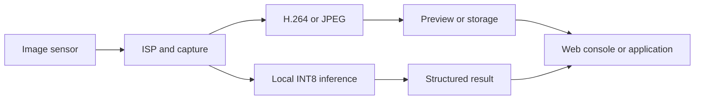

import ApplicationScenarios from '@site/src/components/ApplicationScenarios';
import SupportGrid from '@site/src/components/SupportGrid';

# Product Information

## Product Overview

NeoEyes NE302 is a Mini AI Vision Camera for device integration. It combines 4 MP image capture, STM32N6 edge AI, wireless connectivity and local storage on a 38 × 38 mm Main Board. A complete NE302 shipment includes the Main Board and Interface Board: the two-board device supports continuous USB Type-C power or a USB Type-C external battery pack; the Main Board can also be used for custom integration with DC power.

### Core Capabilities

- **Edge AI inference**: STM32N6 Cortex-M55 and Neural-ART perform INT8 inference on the device.
- **Image capture and encoding**: The product supports 4 MP image capture; H.264 video encoding supports up to 1920 × 1080 at 30 fps, with hardware JPEG encoding.
- **Two-board expansion and custom integration**: The Interface Board provides the complete device with USB Type-C power, MicroSD, control and development connections for installation, maintenance and further development; the Main Board can also be used for custom integration with DC power.
- **Wireless connectivity**: 2.4 GHz Wi-Fi 6 and Bluetooth Low Energy are supported; radio revision, antenna and regional configuration follow the delivered SKU.
- **Local storage and data delivery**: MicroSD storage and the Web console support preview, capture, model validation and device management.
- **Lighting and extensions**: Some hardware revisions may expose supplemental lighting or extension modules. Confirm availability against the delivered SKU and firmware.
- **Development resources**: The open engineering project contains FSBL, application, Web, model and WakeCore components for build, packaging, flashing and OTA development.
- **Compact installation**: The enclosure baseline is 42 × 42 × 20 mm and supports indoor magnetic or 3M-adhesive mounting according to the product design.

## Specifications

The following specifications use the NE302 datasheet as their public baseline. For delivered interface and engineering-revision differences, see the [Hardware Guide](./3-hardware-guide/0-components-overview.md).

### Core platform

| Item | Specification |
| :--- | :--- |
| Primary MCU | STM32N6, Cortex-M55, 800 MHz, Arm Helium |
| AI accelerator | Neural-ART, 1 GHz, up to 0.6 TOPS INT8 |
| Memory | 4.2 MB on-chip SRAM / NPU RAM; 32 MB PSRAM |
| Flash | 64 MB SPI Flash |

### Imaging and sensing

| Item | Specification |
| :--- | :--- |
| Image sensor | 4 MP high-sensitivity CMOS |
| Maximum H.264 video mode | 1920 × 1080 at up to 30 fps |
| JPEG encoding | Hardware JPEG encoding |
| Lens | Standard M12; 88° / 137° HFOV options |
| Onboard lighting | White LED |

### Wireless, storage and controls

| Item | Specification |
| :--- | :--- |
| Wireless | Wi-Fi 6, 802.11ax 2.4 GHz; BLE 5.3 |
| Antenna | Standard external SMA, 3–4 dBi |
| Storage and controls | MicroSD slot; Trigger and Reset buttons; dual-color indicators |

### Power and mechanical

| Item | Specification |
| :--- | :--- |
| Power | Complete device (Main Board + Interface Board): continuous USB Type-C (5 V) power or USB Type-C external battery-pack power; Main Board custom integration: DC power |
| Low power | STM32U0 always-on domain; supports low-power sleep and multi-source wake-up |
| PCBA | 38 × 38 mm |
| Enclosure | 42 × 42 × 20 mm |
| Environment | Indoor, −20 °C to +50 °C |
| Mounting | Rear magnetic or 3M adhesive mounting |

### Product Contents

NE302 is built from the following major parts:

| Part | Role | Notes |
| :--- | :--- | :--- |
| Main Board | Carries the STM32N6, WakeCore, camera and wireless-related circuits | 38 × 38 mm board baseline |
| Interface Board | Provides power, storage, control and development connections | Interface count and layout follow the hardware revision |
| Camera assembly | Provides the image input | Lens model and focal length follow the SKU |
| Antenna | Provides wireless connectivity | The antenna form and connector follow the SKU |
| Enclosure | Provides mechanical protection and mounting | Product dimensions follow the delivered mechanical record |
| USB Type-C cable | Provides device power | Use the compatible cable and power source supplied for the delivery |

## Performance and Edge AI

### Vision-AI Computing

NE302 uses the STM32N6 Cortex-M55 and Neural-ART accelerator for image processing and local AI inference. The engineering project contains object-detection, pose-estimation and model-switching support; usable models, input sizes and performance depend on the model package, firmware and hardware revision.

| Capability | NE302 boundary |
| :--- | :--- |
| Inference location | Local device inference |
| Acceleration | Neural-ART, up to 0.6 TOPS INT8 in product material |
| Model source | Model files, JSON configuration and packaging flow under `Model/` |
| Runtime validation | Model Validation in the Web console |
| Performance claims | A single-device test or one displayed model is not a system-wide performance commitment |

### Image and Data Flow

The Web console can show a preview, execute a capture, validate a model and inspect stored records. Result delivery and media-stream configuration depend on the MQTT, Webhook, RTSP or RTMP pages exposed by the current firmware. Protocol choices, fields and compatibility must follow the delivered release.

## Hardware Introduction

### Main Board

The Main Board integrates the STM32N6, STM32U0, camera, PSRAM, SPI Flash, and wireless-related circuits. See [Components Overview](./3-hardware-guide/0-components-overview.md) to identify the board, camera, antenna, and hardware-version boundaries.

### Interface Board

The Interface Board exposes the connections needed for use and development, including USB Type-C, MicroSD, debug/flash channels, serial access and other revision-dependent interfaces. It is the main reference for first assembly, flashing and field connection.

### Version Notes

Delivered versions may differ in radio revision, lens, antenna, debug interfaces and power input. Do not infer a specific SKU from a product render or generic annotated board image. Check the delivered hardware record before installation, flashing or model deployment.

The current public wireless baseline is Wi-Fi 6 and Bluetooth Low Energy. A Wi-Fi HaLow-compatible version is planned, but it requires the corresponding wireless hardware and is not part of the current delivery baseline. Confirm the delivered version and hardware configuration when Wi-Fi HaLow is required.

## Product Applications

NE302 is positioned around compact camera integration, local AI and device-level result delivery. The following are product-positioning examples, not verified customer cases or fixed SKUs. Validate the lens, lighting, model, trigger path and result protocol before deployment.

<ApplicationScenarios
  introduction="NE302 can act as a compact vision node inside an existing device, workstation or small terminal. Confirm the lens, lighting, model and network path before defining a deployment."
  imagePosition="left"
  maxDescriptionLines={8}
  categories={[
    {
      title: 'Device state and event detection',
      items: [
        { title: 'Workstation or equipment state recognition', description: 'Recognize a fixed workstation or equipment state locally and deliver structured results to an upper-layer system; validate the field of view, lighting, model and result protocol first.', image: 'https://resources.camthink.ai/wiki/img/neoeyes-ne302-series/overview/ne302-application-workstation.jpg', imageAlt: 'Industrial workstation example' },
        { title: 'Event-triggered capture', description: 'Combine IO/PIR, remote control or scheduled capture to save or send images on events; confirm trigger wiring, storage policy and retry behavior before deployment.', image: 'https://resources.camthink.ai/wiki/img/neoeyes-ne302-series/overview/ne302-application-entry-terminal.jpg', imageAlt: 'Entry terminal example' }
      ]
    },
    {
      title: 'Compact vision integration',
      items: [
        { title: 'Vision module for a small terminal', description: 'Use the two-board design, wireless connectivity and local storage to add vision to a custom device; confirm installation space, power, antenna and maintenance access.', image: 'https://resources.camthink.ai/wiki/img/neoeyes-ne302-series/overview/ne302-application-self-service-terminal.jpg', imageAlt: 'Small self-service terminal example' },
        { title: 'Edge-AI prototype validation', description: 'Use the Web console and the engineering project to validate models, lenses and result-delivery methods; one-device results do not replace production performance and reliability testing.', image: 'https://resources.camthink.ai/wiki/img/neoeyes-ne302-series/overview/ne302-application-edge-ai-prototype-validation.png', imageAlt: 'Edge-AI prototype validation workflow' }
      ]
    }
  ]}
/>

## Product Resources

### Wiki Guides

- [Quick Guide](./1-quick-start.md): complete the first device-management and model-validation path.
- [Capture and Storage](./2-user-guide/0-capture-storage.md): configure capture, storage and records.
- [Data Transmission](./2-user-guide/1-data-transmission.md): configure result and media delivery.
- [AI Model Validation](./2-user-guide/2-ai-model-validation.md): upload a compatible model and validate fixed inputs.
- [System Maintenance](./2-user-guide/3-system-maintenance.md): manage communication, firmware, storage resources and device information.
- [Hardware Guide](./3-hardware-guide/0-components-overview.md): identify boards, interfaces and installation boundaries.
- [Software Guide](./4-software-guide/0-development-environment.md): set up the source environment and build or flash the project.

### Development Resources

- [NE302 GitHub Repository](https://github.com/camthink-ai/ne302): source, README, setup instructions and build scripts.
- [CamThink Developer Center Models](https://www.camthink.ai/developer-center/models/): downloadable model resources for device validation.
- [NE302 GitHub Releases](https://github.com/camthink-ai/ne302/releases): released firmware and OTA packages.

## Technical Support

When reporting a product or firmware difference, provide the hardware version, component versions, reproduction steps and a redacted result. Do not include passwords, Secret Keys, network keys, MAC addresses, serial numbers or complete device-configuration files.

<SupportGrid />
