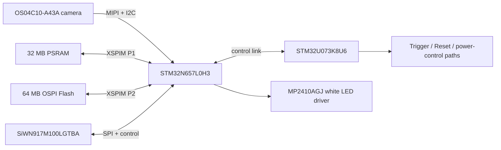

# Components Overview

NE302 is a two-board vision platform. The Main Board contains the image, compute, memory, wireless, and control circuits; the Interface Board provides power, storage, programming, and service access. This page identifies those hardware blocks. For cable connection and firmware flashing, use [Hardware Connection](./1-hardware-connection.md).

## Main Board component map

| Component | Circuit role | Connected hardware path |
| :--- | :--- | :--- |
| **STM32N657L0H3** | Primary vision and AI MCU | Receives the camera stream and connects to PSRAM, Flash, Wi-Fi, and the Interface Board |
| **STM32U073K8U6** | Low-power control MCU | Handles power-control and wake/control signals, including Trigger and Reset-related control paths |
| **APS512XXN-OBR-BG PSRAM** | 32 MB runtime memory | Connected to STM32N657 through the XSPIM P1 interface |
| **OSPI Flash** | 64 MB non-volatile storage | Connected to STM32N657 through the XSPIM P2 interface; firmware packages and partition addresses must match this hardware |
| **SiWN917M100LGTBA** | 2.4 GHz Wi-Fi 6 and Bluetooth wireless module | Connected to STM32N657 through the Wi-Fi SPI/control path and the fitted antenna connection |
| **OS04C10-A43A** | 4 MP CMOS image sensor | Uses the MIPI camera data path and I2C control path to STM32N657 |
| **MP2410AGJ** | White-LED driver | Drives the onboard illumination through the `PWM_LED` control path |

The Main Board also carries the external-power input, Alarm I/O, Trigger button, external-antenna connector, and board-to-board sockets shown in the component map. These labels identify the physical areas; they do not publish a field-wiring pinout or electrical limit.

## Main Board rear and Reset

The rear-side map identifies the **Reset Button**. Use Reset only when the operating procedure requires it. It restarts the device; it is not a substitute for selecting the N6 or U0 programming target.

## Imaging, compute, and control paths

This separation matters during development: N6 firmware covers the FSBL, App, Web, and Model targets, while the U0 runs the separate WakeCore target. Do not use an N6 firmware image on the U0 programming path, or a WakeCore image on the N6 path.

## Interface Board component map

The Interface Board includes the USB-C and MicroSD connection circuits, programming headers, and an **SHT31-DIS** temperature/humidity sensor. It is the service-access board; it does not replace the Main Board's compute, image, or wireless circuits.

  
  

| Interface-board component or area | Function | Use boundary |
| :--- | :--- | :--- |
| USB-C circuit | Device power and USB connection | Use the approved USB-C supply and cable for the delivered unit |
| MicroSD circuit | Local card access | Follow the current device procedure; if hot-plug behavior is not explicitly supported, stop the device and disconnect power before handling the card |
| SHT31-DIS | Temperature/humidity sensor present in the schematic | The firmware read path and Web UI exposure were not verified here; do not treat the component as a confirmed user-visible feature |
| N6-STLINK / U0-STLINK | Separate SWD programming paths | Select the path that matches the firmware target |
| U6-UART | STM32N6 serial-console connector | Use only with the matching adapter and serial procedure; the source README lists 921600 baud |
| N6-BOOT / U0-BOOT | Programming-mode controls | Change the matching switch only while the device is unpowered |

## Related resources

- Board assembly, USB-C, MicroSD, U6-UART, and ST-LINK: [Hardware Connection](./1-hardware-connection.md)
- Build and flashing commands: [Build, Flash and Update](../4-software-guide/1-build-and-flash.md)
- Schematics, PCB files, and project sources: [NE302 source repository](https://github.com/camthink-ai/ne302)
